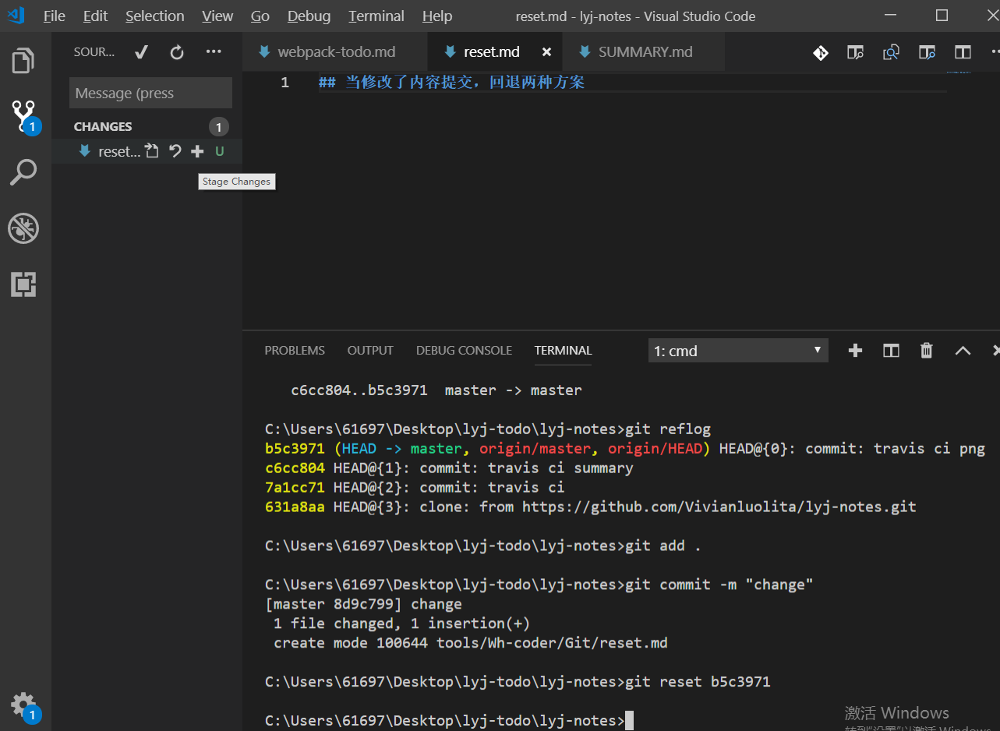
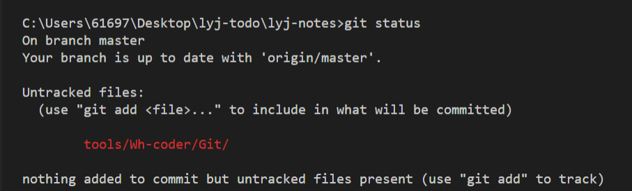
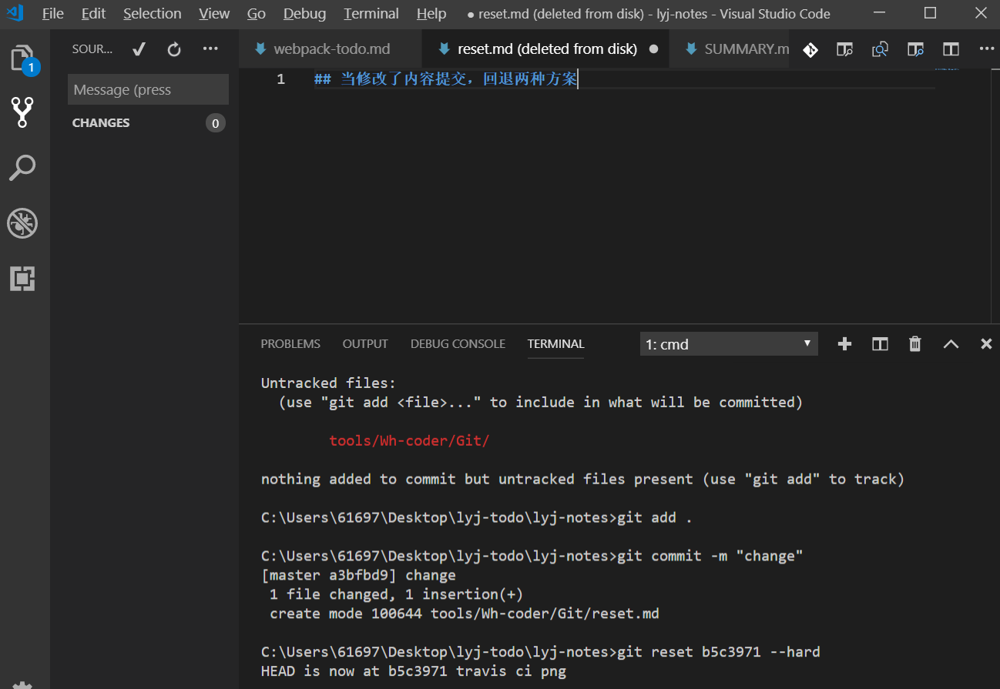

## 当修改了内容提交，回退两种方案
### git reset b5c3971 

### git status显示状态

>右侧显示change文件，并可以修改。修改后在其提示操作，点击“+”，将change放入暂存区，并提交后。**或者在命令行打 add commit 命令也可解决**

###git reset b5c3971 --hard

>右侧此时就没有修改前的文件了。回退到没有变化的时候的版本。