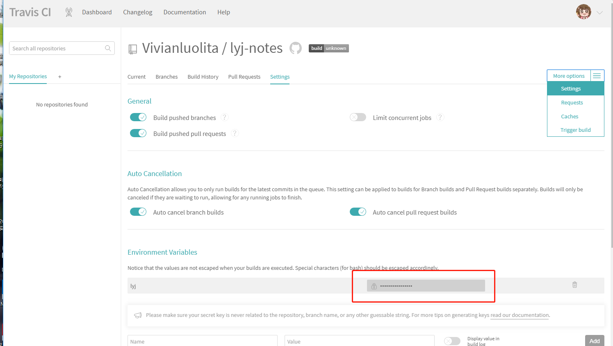
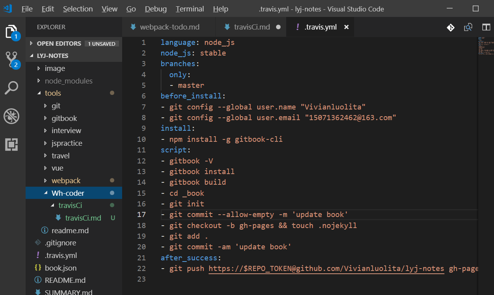

## Travis Ci
**Travis CI 提供的是持续集成服务（Continuous Integration，简称 CI）。它绑定 Github 上面的项目，只要有新的代码，就会自动抓取。然后，提供一个运行环境，执行测试，完成构建，还能部署到服务器。**
>[持续集成服务 Travis CI 教程](http://www.ruanyifeng.com/blog/2017/12/travis_ci_tutorial.html) 

### Activate your GitHub repositories

### Add a .travis.yml file to your repository

### Trigger your first build
push 远程项目
>[First time here? Let's get you started!
](https://travis-ci.org/getting_started)