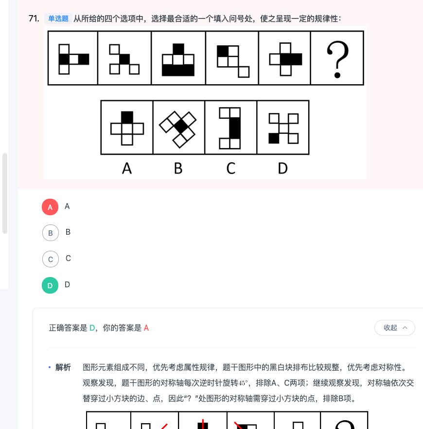
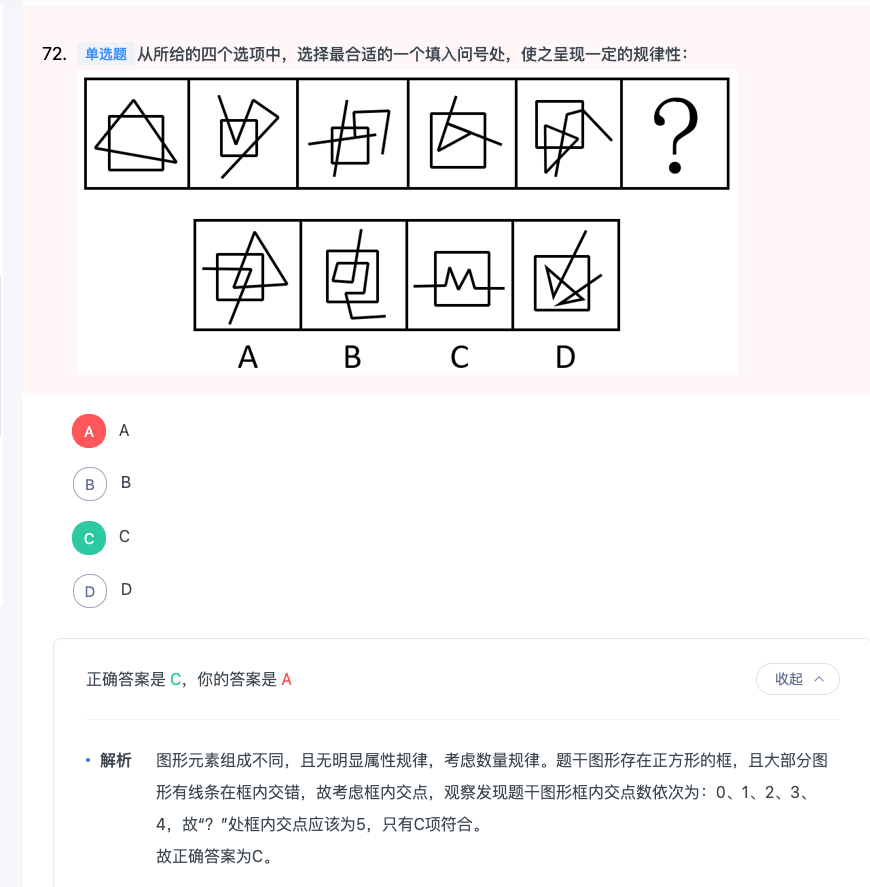
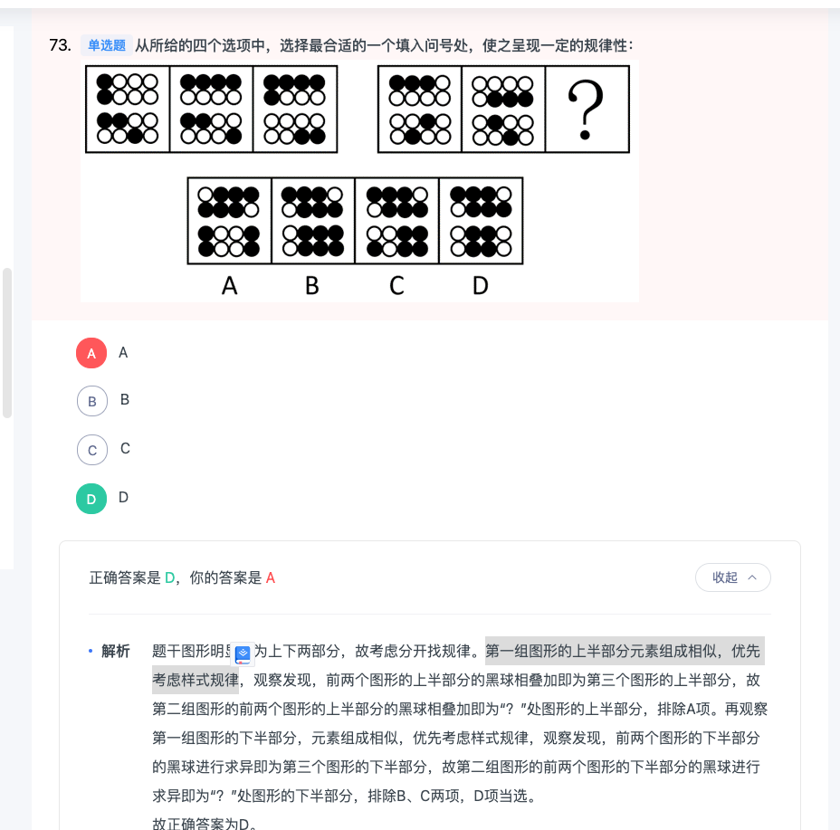
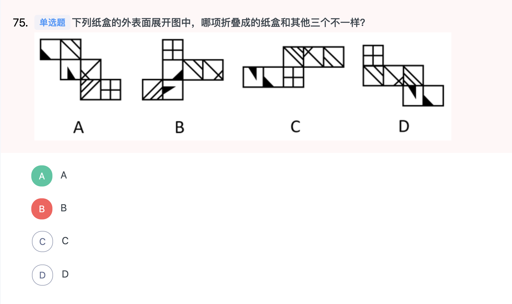
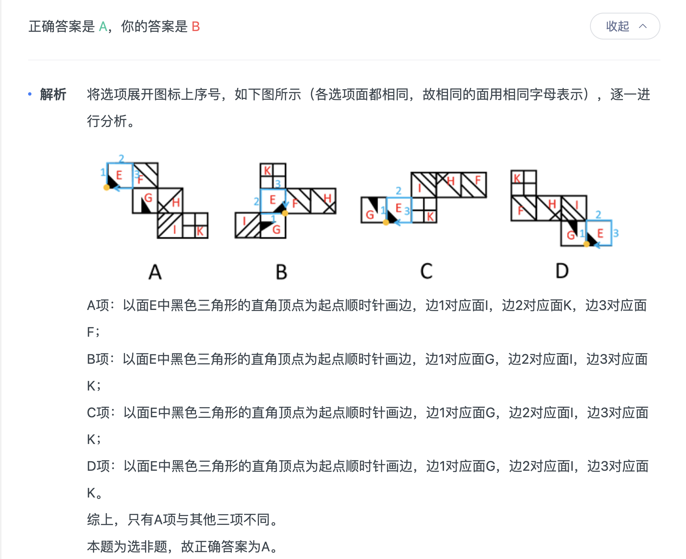
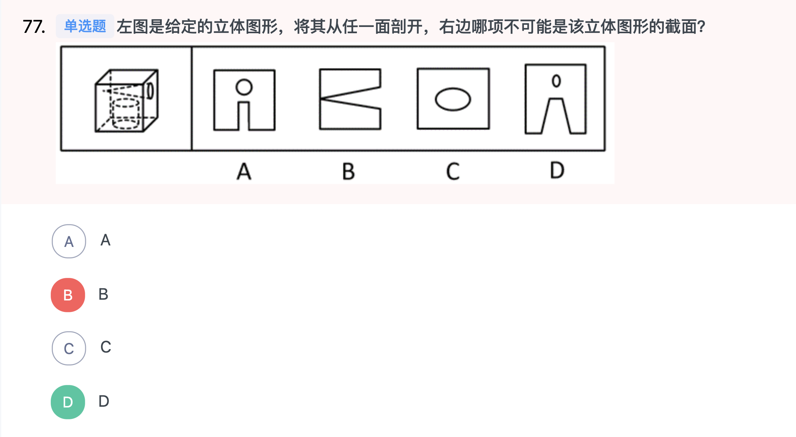
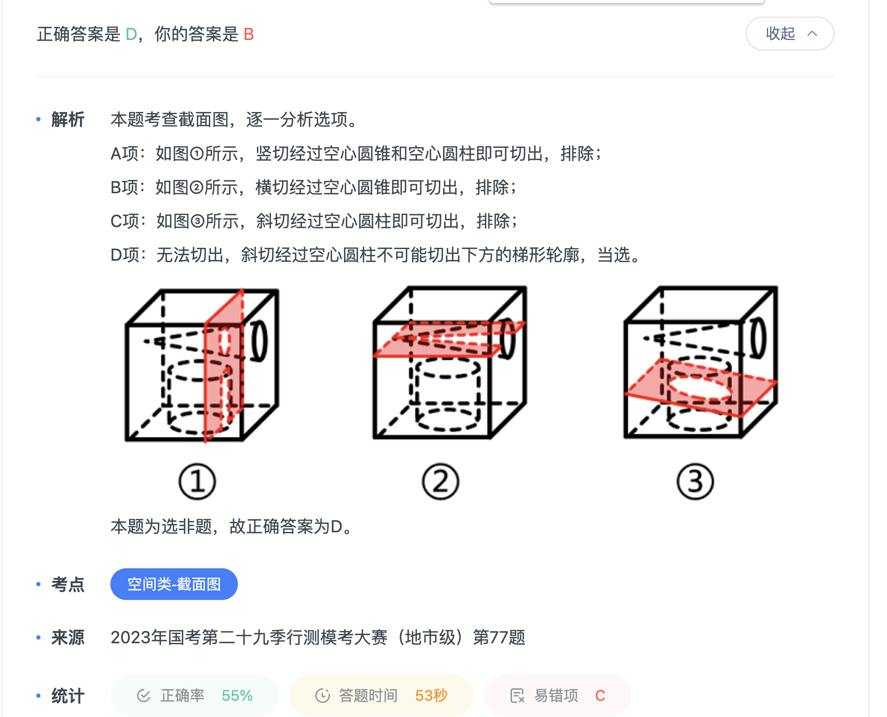
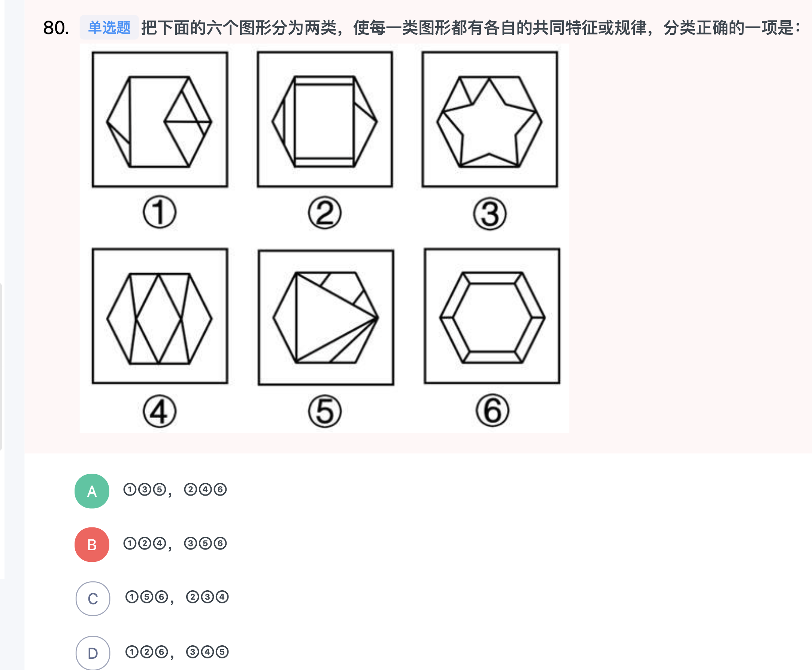

### 言语
|  错误类型（为什么错）   | 统计次数  |
|  ----  | ----  |
|   言语-逻辑填空| 12 |
|   言语-填空句子题| 2 |
|   言语-中心理解| 1 |
|   言语-排序题| 1 |
|   言语-接语选择题| 1 |

- 1（根据横线前“无异于”可知，前文是对横线处的解释说明。。对应这句话：没有实践导向的研究工作）


```
刑事诉讼法治是社会治理的有机组成部分，刑事诉讼理论的阐释能力必须接受实践检验。刑事诉讼法学研究也应该直面社会治理中的中国问题，没有实践导向的研究工作，无异于            ，不会有生命力。

填入画横线部分最恰当的一项是：

A
闭门造车

B
纸上谈兵

C
削足适履

D
昙花一现

根据横线前“无异于”可知，前文是对横线处的解释说明。根据“必须接受实践检验”可知，刑事诉讼法学研究不能缺少实践，横线处应体现研究脱离客观情况，没有从实际出发之意，A项“闭门造车”比喻只凭主观办事，不管客观实际，侧重强调脱离实际，符合文意，当选。

B项“纸上谈兵”指空谈理论不能解决实际问题，文段并非强调空谈理论，而是强调工作脱离实际，排除；

C项“削足适履”比喻不合理地迁就凑合或不顾具体条件，生搬硬套，D项“昙花一现”比喻美好的事物或景象出现了一下，很快就消失，均与文意不符，排除。

故正确答案为A。

```

- 2（和而不同：和睦的相处但不随便附和）


```
杂技团和芭蕾舞团的首次联动，将西方艺术芭蕾与中国传统杂技相结合。高超精湛的技巧，默契十足的配合，变化多端的造型，一柔一刚相辅相成，            ，给人一种艺术的美感。

填入画横线部分最恰当的一项是：

A
各有千秋

B
和而不同

C
珠联璧合

D
浑然天成

正确答案是 C，你的答案是 B收起
解析
根据横线前“西方艺术芭蕾与中国传统杂技相结合”及“高超精湛的技巧，默契十足的配合”可知，横线处应体现出两种优美的艺术表演结合在一起给人带来了美好体验之意，C项“珠联璧合”比喻杰出的人才或美好的事物聚集在一起，符合文意，当选。

A项“各有千秋”指各有所长，各有优点，各有特色，无法体现出两种优美的艺术表演结合在一起，与文意不符，排除；

B项“和而不同”指和睦地相处，但不随便附和，与文意不符，排除；

D项“浑然天成”形容诗作、文章的结构严谨自然，用词运典毫无斧凿痕迹，也形容人的才能、品德完美自然，与文意不符且搭配不当，排除。

故正确答案为C。
```

- 3（1.摧枯拉朽”比喻腐朽势力很容易摧毁 2. 语境：从长远看。应该是想从根本上解决。所以是釜底抽薪”比喻从根本上解决问题）


```
治理噪声污染，不能仅靠立法。说到底，噪声污染是人为制造的污染，根子在人的身上。运用法律予以        ，解决的是“不敢为”和“不能为”的问题，而不是“不想为”的问题。从长远看，想要收取“            ”之效，还需进一步提高社会文明程度。

依次填入画横线部分最恰当的一项是：

A
震慑 立竿见影

B
规制 釜底抽薪

C
惩治 摧枯拉朽

D
制衡 正本清源

正确答案是 B，你的答案是 C收起
解析
第一空，根据文意可知，横线处应体现以法律手段解决噪声污染问题。A项“震慑”意为使感到震动并害怕，B项“规制”意为政府设置（出台）规定进行限制，C项“惩治”意为惩罚治理，均能体现以法律手段解决噪声污染问题，保留。D项“制衡”意为相互制约，使保持平衡，与文意不符，排除。

第二空，根据“说到底，噪声污染是人为制造的污染，根子在人的身上”可知，噪声污染问题的根本原因在于人，因此“提高社会文明程度”是从根本上解决噪声污染问题，故横线处应体现彻底解决问题之意。B项“釜底抽薪”比喻从根本上解决问题，与文意相符，当选。A项“立竿见影”比喻收效非常迅速，强调见效快，C项“摧枯拉朽”比喻腐朽势力很容易摧毁，均与文意不符，排除。

故正确答案为B。
```

- 4（1. 文章要填一个比开枝散叶更好的词语。所以落地生根在开枝散叶之前不能构成递进关系。2. 根据语境，书出海。所以载体 导航这种更好。3. 繁花似锦”指繁茂的鲜花像美丽多彩的锦缎，形容美丽的景色或美好的事物）


```
从哲学经典《道德经》到科幻文学《三体》，中书外译经历了从懵懂前行到积极探索的转变。通过外译走向世界的中国书籍，在对话与建构中，成为中华文化“出海”的重要        。走向世界的“中国书架”在摸爬滚打中“开枝散叶”，但似乎远未“            ”。在机遇与挑战并存的时代，如何让中国书籍向外“走深走实”仍需通盘谋划。

依次填入画横线部分最恰当的一项是：

A
导航 落地生根

B
载体 枝繁叶茂

C
通道 繁花似锦

D
桥梁 郁郁葱葱

正确答案是 B，你的答案是 A收起
解析
本题可从第二空入手，横线前出现转折词“但”，故横线处语义和前文语义相反，前文指出走向世界的“中国书架”“开枝散叶”，即“中国书架”发展很好，故转折后要体现出并没有那么好，且横线处通过“双引号”进行形象化表达，要和“开枝散叶”构成对应，B项“枝繁叶茂”指树木的枝叶繁密茂盛，D项“郁郁葱葱”形容草木苍翠茂盛，也形容气势美好蓬勃，生机勃勃的样子，远未“枝繁叶茂”以及远未“郁郁葱葱”均可与前文构成转折关系，且与“开枝散叶”构成对应，保留。A项“落地生根”指扎根落户，文段表明“中国书架”已经“开枝散叶”，与文意不符，排除；C项“繁花似锦”指繁茂的鲜花像美丽多彩的锦缎，形容美丽的景色或美好的事物，与“开枝散叶”无法构成对应，排除。

第一空，体现中国书籍对于中华文化“出海”的作用，即中国书籍承载着中华文化，B项“载体”与文意相符，当选。D项“桥梁”指起到连接作用，与文意不符，排除。

故正确答案为B。
```

- 5（1. 众口难调”比喻不容易使所有人都满意 2. 根据语境：第二个空应该对应这句话：让新时代学校美育“曲高而和众”。所以耦合比提升更好）


```
长期以来，虽然人们对美育这一基本范畴的理解            ，但美育是净化心灵、陶冶情操、以雅润行、塑造人格的教育实践活动，已基本达成共识。因而，构建新时代学校美育体系要立足于这一本质，从学生的群体特征和接受心理出发，直面学生的现实生活世界，促使美育的实施策略和开展形式能够        学生的审美旨趣，积极调动学生的情感逻辑和价值逻辑，让新时代学校美育“曲高而和众”。

依次填入画横线部分最恰当的一项是：

A
众口难调 满足

B
见仁见智 提升

C
莫衷一是 耦合

D
众口铄金 塑造

正确答案是 C，你的答案是 B收起
解析
第一空，根据“但美育是······的教育实践活动，已基本达成共识”可知，横线处成语应体现人们对美育的理解未达成共识。B项“见仁见智”指对同一问题各有各的见解，C项“莫衷一是”意为不能得出一致的结论，均与文意相符，保留。A项“众口难调”比喻不容易使所有人都满意，D项“众口铄金”比喻舆论影响的强大，均与文意不符，排除。

第二空，搭配“审美旨趣”，根据“积极调动学生的情感逻辑和价值逻辑，让新时代学校美育‘曲高而和众’”可知，横线处词语应体现美育的实施策略和开展形式与学生的审美旨趣能结合起来之意。C项“耦合”指两个或两个以上的体系或两种运动形式间通过相互作用而彼此影响以至联合起来的现象，置于此处可以体现美育的实施策略和开展形式与学生的审美旨趣能结合起来之意，当选。B项“提升”表示使位置、程度、水平、数量、质量等方面比原来高，与文意不符，排除。

故正确答案为C。
```

- 6（1. 注意文章的行文脉络是总分结构，第一句话是重点，后面都是例子。例子非重点。2. A选项错在对应最后一句话，例子上，非重点。特别是依托网络实行敏捷的跨部门协调、跨国协调成为可行）


```
培养干部不容易，要管理好、监督好，让他们始终有            的警觉。一些年轻干部的偏航之举不能及时得到纠正，就有可能开始追求高高在上的优越感和以权谋私的愉悦感，在飘飘然中走上了违纪违法道路，需要通过谈话提醒等方式            。

依次填入画横线部分最恰当的一项是：

A
杯弓蛇影 敲山震虎

B
如履薄冰 防患未然

C
安不忘虞 摄人心魂

D
如临深渊 防微杜渐

正确答案是 D，你的答案是 B收起
解析
第一空，搭配“警觉”，B项“如履薄冰”、D项“如临深渊”均比喻存有戒心，行事极为谨慎，C项“安不忘虞”指在安定的时候不要忘记潜伏的忧患，均与“警觉”搭配恰当，保留。A项“杯弓蛇影”原意是将映在酒杯里的弓影误认为蛇，比喻把虚幻误作真实，形容人疑神疑鬼，自相惊扰，含贬义，与文段感情色彩不符，排除。

第二空，根据“一些年轻干部的偏航之举不能及时得到纠正”可知，横线处应体现在年轻干部的成长过程中要及时纠正他们的偏航之举，D项“防微杜渐”指在错误或坏事萌芽的时候及时制止，不让它发展，符合文意，当选。B项“防患未然”是指在事故、灾害发生之前做好防范准备，文段指的是在发生之后，排除；C项“摄人心魂”指某样东西十分吸引人，以至于把魂都给勾走了，与文意不符，排除。

故正确答案为D。
```

- 7（1. 文章这里应该是发生了的意思：防微杜渐：当坏事、坏思想、坏作风刚刚冒头的时候,就加以制止,不让它发展下去。防患未然：是指在事故、灾害发生之前做好防范准备。）


```
培养干部不容易，要管理好、监督好，让他们始终有            的警觉。一些年轻干部的偏航之举不能及时得到纠正，就有可能开始追求高高在上的优越感和以权谋私的愉悦感，在飘飘然中走上了违纪违法道路，需要通过谈话提醒等方式            。

依次填入画横线部分最恰当的一项是：

A
杯弓蛇影 敲山震虎

B
如履薄冰 防患未然

C
安不忘虞 摄人心魂

D
如临深渊 防微杜渐

正确答案是 D，你的答案是 B收起
解析
第一空，搭配“警觉”，B项“如履薄冰”、D项“如临深渊”均比喻存有戒心，行事极为谨慎，C项“安不忘虞”指在安定的时候不要忘记潜伏的忧患，均与“警觉”搭配恰当，保留。A项“杯弓蛇影”原意是将映在酒杯里的弓影误认为蛇，比喻把虚幻误作真实，形容人疑神疑鬼，自相惊扰，含贬义，与文段感情色彩不符，排除。

第二空，根据“一些年轻干部的偏航之举不能及时得到纠正”可知，横线处应体现在年轻干部的成长过程中要及时纠正他们的偏航之举，D项“防微杜渐”指在错误或坏事萌芽的时候及时制止，不让它发展，符合文意，当选。B项“防患未然”是指在事故、灾害发生之前做好防范准备，文段指的是在发生之后，排除；C项“摄人心魂”指某样东西十分吸引人，以至于把魂都给勾走了，与文意不符，排除。

故正确答案为D。
```

- 8（1. 耳提面命：意思是不但当面教导他,而且揪着他的耳朵向他讲。后来用“耳提面命”形容恳切地教导。 2. 不教而诛”指事先不进行教育，一犯错就加以惩罚，非强迫式的错误方法）


```
当前一个普遍的事实是，由于孩子是家长最关心的人，很多家长会用            的方式去管理孩子，逼迫孩子“学好”，但结果很可能适得其反。另外，家长要求孩子做的事情一定是孩子有能力做的。比如家长觉得要求孩子完成所有作业是            的，但事实并非如此，由于每一个孩子的能力不同，当作业难度超出了孩子的能力，孩子在作业面前就只会“偷懒耍滑”“磨洋工”，无法完成作业也就无可非议了。

依次填入画横线部分最恰当的一项是：

A
耳提面命 轻而易举

B
不教而诛 理所当然

C
揠苗助长 天经地义

D
急功近利 手到擒来

正确答案是 C，你的答案是 A收起
解析
第一空，根据“逼迫孩子‘学好’，但结果很可能适得其反”可知，横线处所填成语的意思应为强迫式的错误方法，C项“揠苗助长”比喻违反事物发展的客观规律，急于求成，反把事情弄糟，D项“急功近利”指急于求成，贪图眼前的成效和利益，均符合文意，保留。A项“耳提面命”形容恳切地教导，褒义词，与文段感情色彩不符，排除；B项“不教而诛”指事先不进行教育，一犯错就加以惩罚，非强迫式的错误方法，排除。

第二空，横线处所填成语修饰家长的“要求”，横线后出现转折词“但”，根据转折后“······孩子在作业面前就只会‘偷懒耍滑’‘磨洋工’，无法完成作业也就无可非议了”可知，让有些孩子完成所有作业是不合理的，横线处所填成语应体现家长认为要求孩子完成所有作业是非常合理的，C项“天经地义”指理所当然，无可非议的事情，符合文意，当选。D项“手到擒来”比喻做事很有把握或毫不费力就能成功，不能修饰家长的“要求”，排除。

故正确答案为C。
```

- 9（1. 如日中天”指事物正处于最兴盛的阶段，“最兴盛”，程度过重，排除 2. 相形见绌”指跟同类事物比较显现出不足，与“数字”搭配恰当）


```

美国《财富》杂志网站在近日的报道中指出，疫情加速了印度经济的虚拟化，投资者持续涌向印度            的科技行业，印度的“独角兽俱乐部”正迅猛发展。2021年全年，印度新增44家独角兽企业，令此前10年总共才诞生独角兽企业37家这一数字            。

依次填入画横线部分最恰当的一项是：

A
风起云涌 略逊一筹

B
如日中天 黯然失色

C
方兴未艾 自惭形秽

D
如火如荼 相形见绌

正确答案是 D，你的答案是 B收起
解析
第一空，根据后文“印度的‘独角兽俱乐部’正迅猛发展”可知，横线处表达印度的科技行业正迅猛发展之意，A项“风起云涌”比喻许多事物相继兴起，声势浩大，C项“方兴未艾”指事物正在发展，尚未达到止境，多形容新生事物正在蓬勃发展，D项“如火如荼”指事物已经发展到比较鼎盛的阶段，均符合文意，保留。B项“如日中天”指事物正处于最兴盛的阶段，“最兴盛”文段并未提及，程度过重，排除。

第二空，搭配“数字”，且根据前文“2021年全年，印度新增44家独角兽企业，令此前10年总共才诞生独角兽企业37家”可知，横线处表达过去10年总共37家这个数字与1年44家这个数字相比的结果，D项“相形见绌”指跟同类事物比较显现出不足，与“数字”搭配恰当，且符合文意，当选。A项“略逊一筹”指比较起来，稍微差一点，程度过轻，排除；C项“自惭形秽”指因为自己不如别人而感到惭愧，文段未提及“感到惭愧”，且与“数字”搭配不当，排除。

故正确答案为D。
```

- 10（旨在展示各国文化独特面貌，        共生共融文化渊源。这个词应该与前文相互对应。）


```
“丝绸之路国际艺术作品展”作为第七届丝绸之路国际艺术节的重要展出板块，旨在展示各国文化独特面貌，        共生共融文化渊源。展品有来自国外的传统手工艺，也融入了剪纸、皮影等中国非遗。这些作品既有不同，也有        之处，比如制作工艺或许是互相借鉴的，再比如所        的工匠精神相差无几，在本届艺术节期间举办中外艺术作品共展，就是让观众现场体会到中西文化各美其美、美美与共。

依次填入画横线部分最恰当的一项是：

A
探索 雷同 传达

B
呈现 吻合 潜藏

C
彰显 相似 蕴含

D
挖掘 接近 折射

正确答案是 C，你的答案是 A收起
解析
第一空，搭配“渊源”，且与“旨在展示各国文化独特面貌”构成句式上的同义并列，故横线处所填词语应体现“展现出、展示”之意，B项“呈现”指显出、露出，C项“彰显”指鲜明地显示，均符合文意，且与“渊源”搭配恰当，保留。A项“探索”指多方寻求答案，解决疑问，D项“挖掘”指挖、发掘，均与文意不符，且与“渊源”搭配不当，排除。

第二空，根据“比如”可知，横线处所填词语应与“制作工艺或许是互相借鉴的······相差无几”对应，体现作品存在类似之处，C项“相似”指相像、大致相同，符合文意，保留。B项“吻合”指完全相符，填入此处程度过重，排除。

第三空，代入验证，搭配“工匠精神”，C项“蕴含”指包含，与“工匠精神”搭配恰当，当选。

故正确答案为C。
```

- 11（1. “异军突起”比喻另一支新的力量突然出现，文段已处于蓬勃发展阶段，并非新的力量刚出现 2. 对应蓬蓬发展更好的词语是百花齐放）


```
尽管传统水印版画在原理上遵循木刻版画制作的基本逻辑，但从题材内容、制作工艺的角度来说，其艺术面貌有着            的审美趣味。当附着水性颜料的木质板材与中国宣纸相遇，可幻化出万千变化。因此，传统水印版画的制作并不是        的流水线作业，需要制作者在操作中准确把控。进入二十一世纪，版画家们或是关注时代发展，或是聚焦平凡生活，抑或是借由景物刻画的诗意表达，水印木刻版画的创作可谓蓬勃发展，            。

依次填入画横线部分最恰当的一项是：

A
匠心独运 机械 异军突起

B
另辟蹊径 粗糙 登堂入室

C
别具一格 死板 百花齐放

D
天马行空 重复 遍地开花

正确答案是 C，你的答案是 A收起
解析
第一空，根据横线前转折词“但”可知，横线处所填成语应与“遵循木刻版画制作的基本逻辑”语义相反，体现出其艺术面貌有着别样的审美趣味之意，A项“匠心独运”指独创性地运用精巧的心思，形容文学艺术等方面构思巧妙，B项“另辟蹊径”比喻另创一种新风格或新方法，C项“别具一格”比喻另有一种独特的风格，均符合文意，保留。D项“天马行空”形容气势豪放，不受约束，也形容言论空泛，不着边际，与文意不符，排除。

第二空，根据“因此”及横线前“当附着水性颜料的木质板材与中国宣纸相遇，可幻化出万千变化”可知，横线处应体现出传统水印版画的制作并不是单一的流水线作业之意，A项“机械”指方式拘泥死板，没有变化，C项“死板”指不会变通，不灵活，均符合文意，保留。B项“粗糙”指不精细，与文意不符，排除。

第三空，根据“可谓”及“进入二十一世纪，版画家们或是关注时代发展，或是聚焦平凡生活，抑或是借由景物刻画的诗意表达”可知，横线处应体现出水印木刻版画的创作是多元的之意，C项“百花齐放”比喻各具特色的不同事物一齐出现，或同一事物以不同方式同时出现，符合文意，当选。A项“异军突起”比喻另一支新的力量突然出现，文段已处于蓬勃发展阶段，并非新的力量刚出现，与文意不符，排除。

故正确答案为C。
```

- 12（1. 执行”意为依照政策、法令、计划等去做，一般与“政策、法令、计划”等搭配，与“承诺”搭配不当）


```
民主的真谛是人民当家作主。一个国家民主不民主，关键在于是不是真正做到了人民当家作主，要看人民有没有投票权，更要看人民有没有        参与权；要看人民在选举过程中得到了什么口头许诺，更要看选举后这些承诺        了多少。如果简单地将民主与选票画等号，甚至认为只有“票选民主”才是真民主，而罔顾人民能否有意义地行使和实现当家作主权利，那无疑是            。 

依次填入画横线部分最恰当的一项是：

A
普遍 执行 本末倒置

B
广泛 实现 买椟还珠

C
直接 履行 沽名钓誉

D
全面 兑现 喧宾夺主

正确答案是 B，你的答案是 A收起
解析
第一空，搭配“参与权”，根据“民主的真谛是人民当家作主”可知，横线处应体现人民享有参与权之意。A项“普遍”意为存在面很广泛，B项“广泛”意为涉及的范围广、面积大，C项“直接”意为不经过中间事物的，均与文意相符，保留。D项“全面”指所有方面，程度过重，排除。

第二空，横线处搭配“承诺”。B项“实现”意为达成或完成，C项“履行”意为实际地做自己答应做的或应该做的事，均与文意相符，保留。A项“执行”意为依照政策、法令、计划等去做，一般与“政策、法令、计划”等搭配，与“承诺”搭配不当，排除。

第三空，根据“如果简单地将民主与选票画等号，甚至认为只有‘票选民主’才是真民主，而罔顾人民能否有意义地行使和实现当家作主权利”可知，这种做法只追求“投票”的形式而忽视了民主的本质，属于颠倒了主要和次要的做法。B项“买椟还珠”比喻没有眼力，取舍不当，与文意相符，当选。C项“沽名钓誉”比喻故意矫情做作，用手段猎取名声或赞誉，未体现文中主次颠倒之意，排除。

故正确答案为B。
```


- 13（这道题没看懂行为脉络。因为先提出问题乡村治理。然后引出制度。最后提出对策：用法治。）


```
                  ——————。当前乡村治理体系与乡村治理的新要求还不完全适应，乡村基层组织治理能力不足等问题亟须解决。推进乡村治理体系和治理能力现代化，夯实乡村振兴的制度基础，需要完善乡村治理机制。应按照党的十九届四中全会《决定》的要求，坚持和完善共建共治共享的乡村治理制度，实现政府治理和社会调节、居民自治良性互动。这就要求在法治轨道上统筹社会力量、调节社会关系、规范社会行为，运用法治方式深化农村改革、维护农村稳定，不断提高工作的法治化水平，充分激发乡村治理的活力和创造力。

填入画横线部分最恰当的一句是：

A
通过法治保障乡村有效治理

B
推进乡村振兴需以社会因素为抓手

C
以共建共治共享推进乡村治理现代化

D
完善乡村治理机制以提升乡村治理有效性

正确答案是 A，你的答案是 D收起
解析
横线出现在文段开头，需概括后文的核心内容。后文首先提出问题，指出当前乡村治理存在的问题，接着引出《决定》的要求——要坚持和完善共建共治共享的乡村治理制度，尾句“这就要求”介绍应如何实现《决定》的要求，即“在法治轨道上······运用法治方式······不断提高工作的法治化水平······”。由此可知，后文主要强调利用法治完善乡村治理机制，进而解决乡村治理存在的问题，A项“通过法治保障乡村有效治理”能概括后文内容，当选。

B项，后文主要强调的是“法治”，“社会因素”只是其中一部分，表述片面，排除；

C、D两项，“共建共治共享”和“完善乡村治理机制”均非文段重点内容，排除。

故正确答案为A。
```

- 14（1. 这道题是选两方面不能看到C讲的是两方面就直接选了。2。 D也是讲两方面，但是它讲的更全一些。C只对应前一方面。）


```
COFs是新兴的晶态多孔材料，具有优异结构可裁剪性和功能可调性，以及低骨架密度、高孔隙率、开放的孔道结构等优点，在气体储存、吸附分离、光电转化、多相催化等功能应用中前景广阔。动态共价化学是COFs材料定向设计的科学基础，赋予了共价组装过程的纠错能力，是兼具结晶性和稳定性的关键。然而，                    ：一方面，高结晶性COFs框架合成所采用的可逆共价键容易在极端条件下分解，大大限制了其可应用的场景；另一方面，采用不可逆共价键，虽然可以制备高稳定性的COFs材料，但通常结晶性较差而难以发挥其应有的高性能。

填入画横线部分最恰当的一项是：

A
动态共价化学在使用过程中也有无法攻破的难关

B
提高COFs材料的结晶性才能使其具有更高的稳定性

C
结晶性和稳定性也限制了COFs材料的实际应用场景

D
这两大特性在COFs材料的合成制备中往往“顾此失彼”

正确答案是 D，你的答案是 C收起
解析
横线位于文段中间，起到承上启下的作用。横线前先是介绍COFs材料的优点和应用前景，指出动态共价化学是让COFs材料兼具结晶性和稳定性的关键，紧接着出现转折关联词“然而”，转折前后语义应相反，再由横线后的冒号可知，后文是对横线处的解释说明，后文通过并列标志词“一方面······另一方面······”，分别阐述了高结晶性COFs易分解和高稳定性的COFs材料结晶性较差的情况，故横线处所填语句应体现COFs材料的结晶性和稳定性难以兼顾，D项，“这两大特性”指代前文“结晶性和稳定性”，且“顾此失彼”可以概括后文并列的两方面内容，当选。

A项，“无法攻破”文段并未提及，无中生有，且缺少文段核心话题“COFs材料”，排除；

B项，后文仅表示结晶性和稳定性难以兼顾，并未指出结晶性的提高会让其稳定性变高，无中生有，排除；

C项，“限制了COFs材料的实际应用场景”仅对应后文并列关系中的一方面内容，表述片面，排除。

故正确答案为D。
```

- 15


```

伴随多域战的兴起，多领域行动叠加，起到1+1>2的战略功效，使军事行动事半功倍。在“海神之矛”行动中，行动方案的评选法则不是光注重军事行动的成功率，还看军事行动与外交行动、降低基地组织报复的综合效益。在人道主义援助行动中，从临时应急性的救灾支援行动拓展到联合演习、增进军事互信行动，进而开展联合反恐行动、网络安全合作行动，战略效益滚雪球式地扩大。随着全球化进程的深入，特别是依托网络实行敏捷的跨部门协调、跨国协调成为可行，军事行动战略横向发展，多元组合，绽放交响乐般同步共振的艺术之花。

这段文字意在强调：

A
“互联网+”是军事行动多领域叠加的助推器

B
多域战争或将成为未来军事战争的主要形态

C
军事行动多领域叠加能起到相得益彰的效果

D
依托于互联网的联合行动能提升战略的功效

正确答案是 C，你的答案是 A收起
解析
文段首先指出多领域行动叠加能起到1+1>2的战略功效，接着分别以“海神之矛”行动、人道主义援助行动和依托网络实行敏捷的跨部门协调、跨国协调为例进行论证。由此可知，文段为观点+举例论证的结构，意在强调多领域行动叠加能起到1+1>2的战略功效，对应C项。

A项，“互联网+”对应“依托网络实行敏捷的跨部门协调、跨国协调”的内容，非重点，排除；

B项，“未来军事战争的主要形态”无中生有，且未涉及文段的主题词“多领域行动叠加”，排除；

D项，“依托于互联网的联合行动”对应“依托网络实行敏捷的跨部门协调、跨国协调”的内容，非重点，排除。

故正确答案为C
```

- 16（1. 首句区分不了，可以看尾句。2是对策，更适合做尾句，2.3，6是一问一答。所以选A比B好 3. 思考方式有问题。首句无法确定看尾句，然后看有无关联词，看有无对策。对策放后面。 ）


```
茉莉花》《在那桃花盛开的地方》等歌曲的元素能唤醒很多父辈人的记忆，可一些年轻人却难以产生共鸣

②青年人要传承和发扬民歌，就要扎根在民间的土壤，深入人们的生活，去体验、挖掘、凝练

③一些学者也强调同样的问题，相较于流行歌曲，民歌的传播渠道较为局限，原本来自民间的民歌逐渐“曲高和寡”

④民歌不光是旋律上的呈现，更是一种生活的再现

⑤在部分青年群体里，对于民歌是存在审美断层的

⑥要解决审美断层问题，让民歌被更多年轻人接受，不可一蹴而就

将以上6个句子重新排列，语序正确的一项是：

A
⑤①③⑥④②

B
④①⑤⑥③②

C
④⑤①③②⑥

D
⑤③①⑥②④

正确答案是 A，你的答案是 B收起
解析
对比选项，确定首句。④句指出民歌是生活的再现，⑤句指出在部分青年群体中存在民歌审美断层的问题，均适合作首句，无法判断。

对比尾句，②句给出青年人传承和发扬民歌的对策，④句引出“民歌”的话题，⑥句指出解决民歌审美断层问题不可一蹴而就，对比之下，②句为更明确的对策，适合作尾句，排除C、D两项。

继续观察发现，③句指出问题，⑥句给出对策，故③句应该在⑥句之前，排除B项，A项当选。

故正确答案为A。
```

- 17（接语选择题，重点在最后一句）


```
费孝通在《乡土中国》一书中指出，乡村生活铸就了一种“乡土本色”。所谓“土气”是城里人对乡下人的传统看法，它所表示的正是农民对土地的基本依靠关系和深厚的情感特色。乡村生活，既依赖于其环境，更依赖于农人特有的生活情怀，构成了独特的乡土诗歌境界。在中国诗歌史上，陶渊明的诗歌创作，不仅开“田园诗”的先河，而且以他敏锐的视角和透彻的感悟向后世展示了一幅新鲜活泼、亲切自然的乡土诗歌画卷。据已知文献，陶渊明传世的诗篇仅120余首，其中吟诵田园生活的居多，《归园田居》可作为其田园诗境的最具代表性诗篇。

若这段文字为文章引言，那么这篇文章最有可能谈论的是：

A
田园诗派的诸多代表人物及经典诗作

B
《乡土中国》对乡土本色的深刻阐述

C
从陶渊明的生平遭遇探究其心境变化

D
《归园田居》中田园生活的诗意解读

正确答案是 D，你的答案是 B收起
解析
本题为接语选择题，重点关注文段尾句。文段开篇引出话题“乡土本色”，并指出“土气”表示的是农民对土地的依靠关系和情感特色，随后指出乡村生活构成了独特的乡土诗歌境界。接下来指出陶渊明开创了“田园诗”的先河并向后人展示了一幅乡土诗歌画卷，尾句指出《归园田居》是其田园诗境代表作。故下文应围绕《归园田居》继续论述，对应D项。

A项，“诸多代表人物及经典诗作”与文段尾句《归园田居》的话题不一致，排除；

B项，“对乡土本色的深刻阐述”对应文段前半部分，为文段已论述过的内容，后文不会再论述，排除；

C项，“从陶渊明的生平遭遇探究其心境变化”与文段尾句《归园田居》的话题不一致，排除。

故正确答案为D。
```

- 18


```

```

- 19


```

```

- 20


```

```
### 判断（还有五道题最后没有对答案）
|  错误类型（为什么错）   | 统计次数  |
|  ----  | ----  |
|   图推 | 2 |
|       | 1 |
|       | 1 |

- 1（元素组成不同，看数量和属性。而这道题有属性对称的特点）



- 2（这道题元素组成不同，想数量和属性。而没看到属性，就看数量。点：因为都有正方形，可以考虑正方形内部的点的交点数量：0，1，2，3.。。）


- 3（1.题干图形明显分为上下两部分，故考虑分开找规律。 2. 第一组图形的上半部分元素组成相似，优先考虑样式规律 ）



- 4（1. 找出关键点，顺时针确定面的顺序，从而确定是不是同一种图形）



- 5（立体图形截面：需要找到特殊形状）



- 6（1. 图形不相同不相似看数量和属性。2. 这里是看最大面的对称性。1，3，5为轴对称图形。2，4，6是中心对称图形）



- 7（错因：看错了，这个是选非题。）


```

捆绑销售是将两种产品捆绑起来销售，是共生营销的一种形式。换句话说，是两个或两个以上的品牌或公司在促销过程中进行合作，从而扩大它们的影响力。

根据上述定义，下列情况不属于捆绑销售的是：

A
某五金店为回馈新老客户推出促销活动，若配套购买钉子与铁丝可享受7折优惠

B
屈臣氏在情人节时，将A品牌洗面奶与B品牌面霜组成一个节日限定套盒来销售

C
乙在购买汽车时，销售人员建议其为新车购买与店内有合作的C公司的汽车保险

D
某大型超市里的D品牌酸奶做推广活动，凡购买一板原味酸奶即送一盒同款酸奶

正确答案是 D，你的答案是 C收起
解析
第一步：找出定义关键词。

“两种产品捆绑起来销售”、“两个或两个以上的品牌或公司”、“在促销过程中进行合作”、“扩大它们的影响力”。

第二步：逐一分析选项。

A项：配套购买钉子与铁丝可享受7折优惠，符合“两种产品捆绑起来销售”，符合定义，排除；

B项：A品牌洗面奶和B品牌面霜组合销售，符合“两种产品捆绑起来销售”、“两个或两个以上的品牌或公司”、“在促销过程中进行合作”，符合定义，排除；

C项：销售人员建议乙为新车购买与店内有合作的C公司的汽车保险，符合“两个或两个以上的品牌或公司”、“在促销过程中进行合作”，符合定义，排除；

D项：买一板D品牌的原味酸奶送一盒同款酸奶，只涉及到一个品牌，不符合“两个或两个以上的品牌或公司”，不符合定义，当选。

本题为选非题，故正确答案为D。

```
- 8（1. 注意：找出定义关键词。同种想象数罪：“一个行为导致数个同一种类的结果”、“触犯同种的数罪名”；异种想象数罪：“一个行为导致数个不同种类的结果”、“触犯数个不同的罪名”。 2.  B项，绑架并烧毁是属于两个行为。 但是D选项是引燃炸药这一个行为。）
```
同种想象数罪是想象数罪的一种，指的是一个行为导致数个同一种类的结果，触犯同种的数罪名。异种想象数罪是“同种想象数罪”的对称，指的是一个行为导致数个不同种类的结果而触犯数个不同的罪名。

根据上述定义，下列情形属于异种想象数罪的是：

A
甲与女友吵架闹分手，一气之下杀死了女友张某，冷静下来后悲痛欲绝选择了自杀

B
乙在购买商品时与商铺老板发生口角，隔天便绑架了老板三岁的女儿并且烧毁了店铺

C
丙到一公司楼内实施盗窃，在一间办公室内盗取笔记本电脑一台以及现金三千元

D
丁与戊有债务纠纷，丁讨债失败后便引燃炸药，炸死了戊，炸药余波将戊的房子炸毁

正确答案是 D，你的答案是 B收起
解析
第一步：找出定义关键词。

同种想象数罪：“一个行为导致数个同一种类的结果”、“触犯同种的数罪名”；

异种想象数罪：“一个行为导致数个不同种类的结果”、“触犯数个不同的罪名”。

第二步：逐一分析选项。

A项：甲杀死女友后自杀，杀人和自杀是两个行为，不符合“一个行为导致数个不同种类的结果”，而且自杀不属于犯罪，不符合“触犯数个不同的罪名”，不符合“异种想象数罪”定义，排除；

B项：乙绑架商铺老板的女儿并且烧毁店铺，绑架和纵火是两个行为，不符合“一个行为导致数个不同种类的结果”，不符合“异种想象数罪”定义，排除；

C项：丙盗取了笔记本电脑和现金，均属于盗窃罪这一罪名，不符合“触犯数个不同的罪名”，不符合“异种想象数罪”定义，排除；

D项：丁用炸药炸死了戊且余波炸毁了戊的房子，引燃炸药这一行为导致了戊的死亡和戊的房子被炸毁两个结果，符合“一个行为导致数个不同种类的结果”，而且炸死戊和炸毁戊的房子属于故意杀人罪和故意毁坏公私财物两个罪名，符合“触犯数个不同的罪名”，符合“异种想象数罪”定义，当选。

故正确答案为D。

```
- 9（1. 对比bd两项，常识；区位行为就是根据地理位置做出的行为。所以有地理位置区分。2. 而d项，D项：甲小学六年级不同班级的学生，属于在相同的地理环境下，不符合“不同地理环境下的行为类型和决策行为”，不符合定义，当选。）
```

行为地理学是指研究人类不同类群（集团、阶层等）在不同地理环境下的行为类型和决策行为及其形成因素（包括地理因素、心理因素）的科学。

根据上述定义，下列情形不属于行为地理学的是：

A
研究中国内地南北方居民的出行规律

B
研究国企和私企中管理和经营阶层的区位行为

C
研究世界500强的规划决策者的决策判断

D
研究甲小学六年级不同班级学生的学习行为

正确答案是 D，你的答案是 B收起
解析
第一步：找出定义关键词。

“人类不同类群”、“不同地理环境下的行为类型和决策行为及其形成因素”。

第二步：逐一分析选项。

A项：南北方居民，符合“人类不同类群”，出行规律，符合“不同地理环境下的行为类型和决策行为”，符合定义，排除；

B项：国企和私企中管理和经营阶层，符合“人类不同类群”，区位行为就是根据地理位置做出的行为，符合“不同地理环境下的行为类型和决策行为”，符合定义，排除；

C项：世界500强的规划决策者，符合“人类不同类群”，决策判断，符合“不同地理环境下的行为类型和决策行为”，符合定义，排除；

D项：甲小学六年级不同班级的学生，属于在相同的地理环境下，不符合“不同地理环境下的行为类型和决策行为”，不符合定义，当选。

本题为选非题，故正确答案为D。
```
- 10（根据定义，只有A项有腰。并且D没有直耳。）


```
第一步：找出定义关键词。

“分上下两部分”、“多为圆形，直耳，侈口，束腰，袋状腹，腹下设锥足或柱形足，器体厚重”。

第二步：逐一分析选项。

A项：图中容器分上下两部分，符合“分上下两部分”，且外型符合“多为圆形，直耳，侈口，束腰，袋状腹，腹下设锥足或柱形足，器体厚重”，符合定义，当选；

B项：图中容器为圆球形，没有腰，不符合“多为圆形，直耳，侈口，束腰，袋状腹，腹下设锥足或柱形足，器体厚重”，不符合定义，排除；

C项：图中容器为圆弧形，没有腰，不符合“多为圆形，直耳，侈口，束腰，袋状腹，腹下设锥足或柱形足，器体厚重”，不符合定义，排除；

D项：图中容器没有直耳，不符合“多为圆形，直耳，侈口，束腰，袋状腹，腹下设锥足或柱形足，器体厚重”，不符合定义，排除。

故正确答案为A。

```
- 11（1. 找到能明白的定义：“产生云、雨等天气”、“气温上升，气压下降，天气转暖”。 2. BC两项对比，B是纯碳，C是秋天。B：随风潜入夜，润物细无声C空山新雨后，天气晚来秋）
```
暖锋是指锋面在移动过程中，暖空气推动锋面向冷气团一侧移动的锋。暖锋过境时，暖气团前缘的暖空气沿冷气团的边缘徐徐爬升，其中水汽冷却凝结，产生云、雨等天气。暖锋过境后，暖气团占据了原来冷气团的位置，于是气温上升，气压下降，天气转暖。

根据上述定义，下列选项涉及暖锋的是：

A
风吹一片叶，万物已惊秋

B
随风潜入夜，润物细无声

C
空山新雨后，天气晚来秋

D
露从今夜白，月是故乡明

正确答案是 B，你的答案是 C收起
解析
第一步：找出定义关键词。

“产生云、雨等天气”、“气温上升，气压下降，天气转暖”。

第二步：逐一分析选项。

A项：“风吹一片叶，万物已惊秋”出自杜牧的《早秋客舍》，意思是微风吹过黄叶飘落，万物才惊觉秋天已经来了，不符合“产生云、雨等天气”、“气温上升”，不符合定义，排除；

B项：“随风潜入夜，润物细无声”出自杜甫的《春夜喜雨》，意思是春雨随着春风在夜里悄悄地落下，悄然无声地滋润着大地万物，描写的是春雨，符合“产生云、雨等天气”，并且进入春天后会升温，符合“气温上升，天气转暖”，符合定义，当选；

C项：“空山新雨后，天气晚来秋”出自王维的《山居秋暝》，意思是青山在一阵新雨过后愈发静幽，夜晚凉风习习令人感到秋意浓厚，描写的是秋天气温下降，不符合“气温上升”，不符合定义，排除；

D项：“露从今夜白，月是故乡明”出自杜甫的《月夜忆舍弟》，意思是从今夜就进入了白露节气，月亮还是故乡的最明亮，不符合“产生云、雨等天气”、“气温上升，气压下降，天气转暖”，不符合定义，排除。

故正确答案为B。

```
- 12（1. 其他关系对应：因果对应 2. 但是B是因果。C是目标对应 2. 常识：地下潮湿会导致地面返潮 3. 空气湿度很大时，地面和物品附着很多水分。或指地下水分上升时，地面和墙根呈潮湿现象。每年开春以后，一些地区会有室内返潮出水现象，致使衣物、家具潮湿发霉，也就是人们常说的“南风天”。

）
```

资金链断裂：企业破产

A
通货膨胀：货币超发

B
地下潮湿：地面返潮

C
精准扶贫：共同富裕

D
聚众斗殴：拉帮结派

正确答案是 B，你的答案是 C收起
解析
第一步：判断题干词语间逻辑关系。

因为资金链断裂，所以企业破产，二者是因果对应关系。

第二步：判断选项词语间逻辑关系。

A项：因为货币超发，所以通货膨胀，二者是因果对应关系，但词语顺序与题干相反，与题干逻辑关系不一致，排除；

B项：因为地下潮湿，所以地面返潮，二者是因果对应关系，与题干逻辑关系一致，当选；

C项：精准扶贫的目的是共同富裕，二者是方式目的对应关系，与题干逻辑关系不一致，排除；

D项：聚众斗殴和拉帮结派之间不存在因果关系，与题干逻辑关系不一致，排除。

故正确答案为B。
```
- 13（1. 这个考逻辑关系：全同关系和并列关系 2. 蹑手蹑脚是并列关系，并且同时进行。但是自言自语是全同。B
自卖：自夸是并列关系并且同时进行。）
```
蹑手：蹑脚

A
自生：自灭

B
自卖：自夸

C
自言：自语

D
自给：自足

正确答案是 B，你的答案是 C收起
解析
第一步：判断题干词语间逻辑关系。

蹑手指行动时手部动作轻微，蹑脚指行动时脚部动作轻微，二者为并列关系，且是两个同时进行的动作。

第二步：判断选项词语间逻辑关系。

A项：自生指自然地发生，自灭指自然地消灭，但先自生，后才自灭，不是两个同时进行的动作，与题干逻辑关系不一致，排除；

B项：自卖指自己贩卖物品，自夸指夸耀自己所贩卖物品的优点，二者为并列关系，且是两个同时进行的动作，与题干逻辑关系一致，当选；

C项：自言和自语都是指和自己说话，二者为全同关系，与题干逻辑关系不一致，排除；

D项：自给指依靠自己的生产，自足指满足自己的需要，但先自给，后才自足，不是两个同时进行的动作，与题干逻辑关系不一致，排除。

故正确答案为B。

```
- 14（1. 第一个与第二三构成种属关系 2. 常识
重金属，是指密度大于4.5g/cm3的金属，包括金、银、铜、铁、汞、铅、镉等，所以B错）
```
工具：冲击钻：吸管

A
理科：生物：历史

B
重金属：铜：铝

C
饰品：项链：挂画

D
人造材料：石棉：塑料

正确答案是 C，你的答案是 B收起
解析
第一步：判断题干词语间逻辑关系。

冲击钻和吸管是不同的工具，二者是并列关系，且均与工具构成种属关系。

第二步：判断选项词语间逻辑关系。

A项：生物和历史都是学科，二者是并列关系，但历史不是理科，与题干逻辑关系不一致，排除；

B项：铜是重金属，但铝不是重金属，与题干逻辑关系不一致，排除；

C项：饰品指用来装饰的物品，项链和挂画是不同的饰品，二者是并列关系，且均与饰品构成种属关系，与题干逻辑关系一致，当选；

D项：石棉指天然的纤维状硅酸盐类矿物质，石棉不是人造材料，与题干逻辑关系不一致，排除。

故正确答案为C。

```
- 15（）
```


```
- 16（）
```


```
- 17（）
```


```


### 资料（还未对答案）
|  错误类型（为什么错）   | 统计次数  |
|  ----  | ----  |
|   | 1 |
|  | 1 |
|   | 1 |

- 3


```

```
