###  第四节 数量规律
----


> 点线面素

- 考点1：点数量（线与线的交点）


```
曲直交点，细化

点的考点：

1. 点的相加 或者相减（九宫格横着加，竖着加，斜着加）
2. 点的数量规律：两个点两两相加 等于第三个数的值

3. 有可能考切点个数
```


- 考点2：线数量


```
五角星是10条线
```
- 线的特殊考点：笔画数


> 笔画常见的特征图


- 例子

- 例子（走投无路一笔画可以试试，明显的两个五角星也可以试试）


- 总结


```

1. 横线和竖线的数量相等：如果图形有干扰图形又有很明显的横线竖线，可以数一下横线竖线的数量。
2. 甚至可以看图形平行线的数量
```

> 考点3：面数量


```
上图：面的数量为：1，0，1
```


- 例子


```
选7个面，外边6条边，现在会复合考点加大面的难度。
```


```
曲直性会复合考。

面数量+属性（曲直性）

做题有关的面的考点：

1. 面的细化：面最小的面积都是某一图形(正方形)，面的最大面积都是某一图形（正方形）
2. 面的细化，发现题干每幅图都包含两个相同面。

3. 面的细化，发现九宫格每行面的数量相加都等于同一个数字

4. 面的复合考点，面的数量和多边形的边数是否相等

5. 面的复合，如果光数面没有规律，则可以考虑其他因素，比如面的里面的直角数量有没有规律。其实就是考直角的数量。

```
> 考点4（感觉现在考直角个数的情况也挺多啊，注意）
> 素数量


```
上图：1，2，6部分
```

- 面是数白色的封闭空间，部分是数黑色的封闭空间


- 总结


```
1. 素不一定是很生活化的图形，作为考点。像百分号这种也算。除号这种也可以考虑。毕竟可以考部分数。
2. 汉字规律：面无规律，则考虑横竖规律。横的数量等于竖的数量
3. 九宫格除了黑白出现了阴影，记得也可以算作素，记得数各元素的数量。
4. 复合部分数：黑球的数量 + 白球的部分数
```

### 第五节 空间重构


> 考点1：相对面

- 如何判断相对面
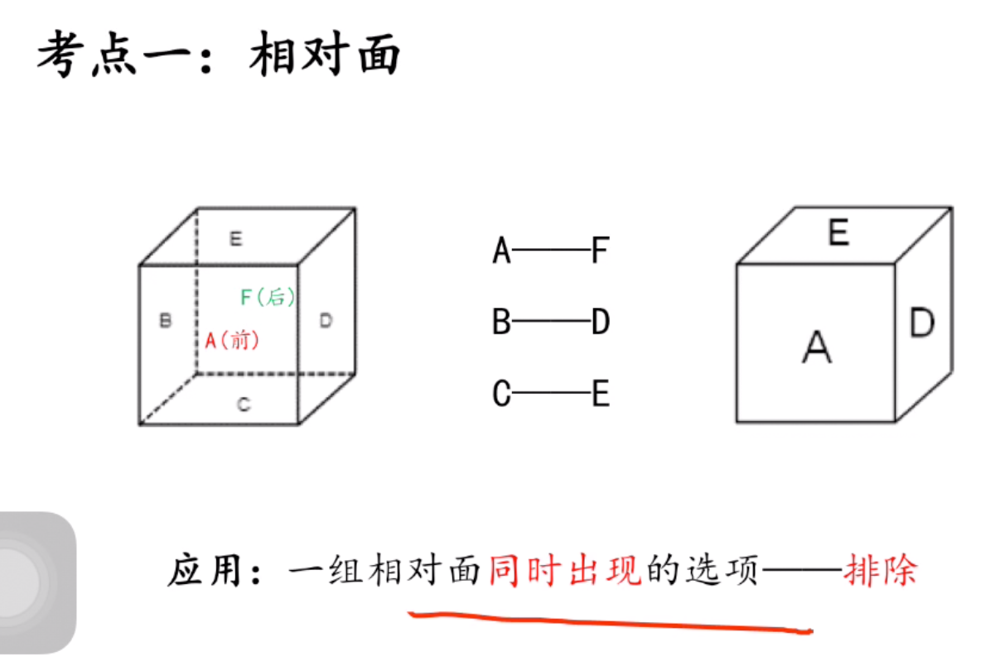
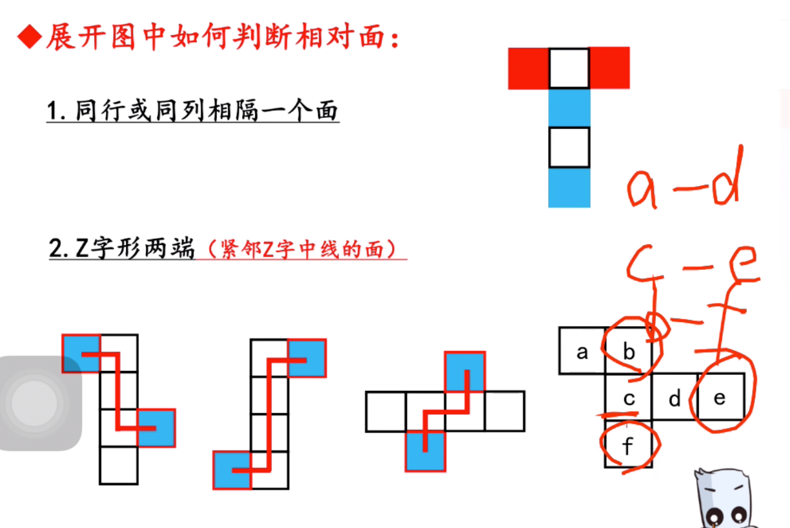

- 例子1（通过相对面排除A，B,C：不能有相同的图案相邻）（先看同行或者同列相隔一个面，再看z字形两端）

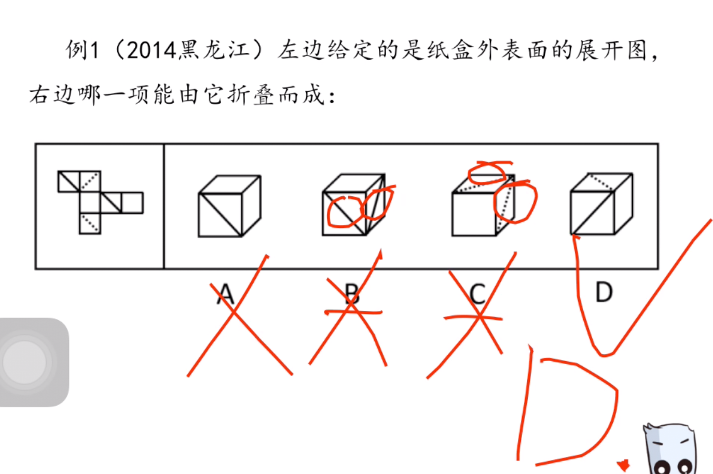

> 考点2：相邻面

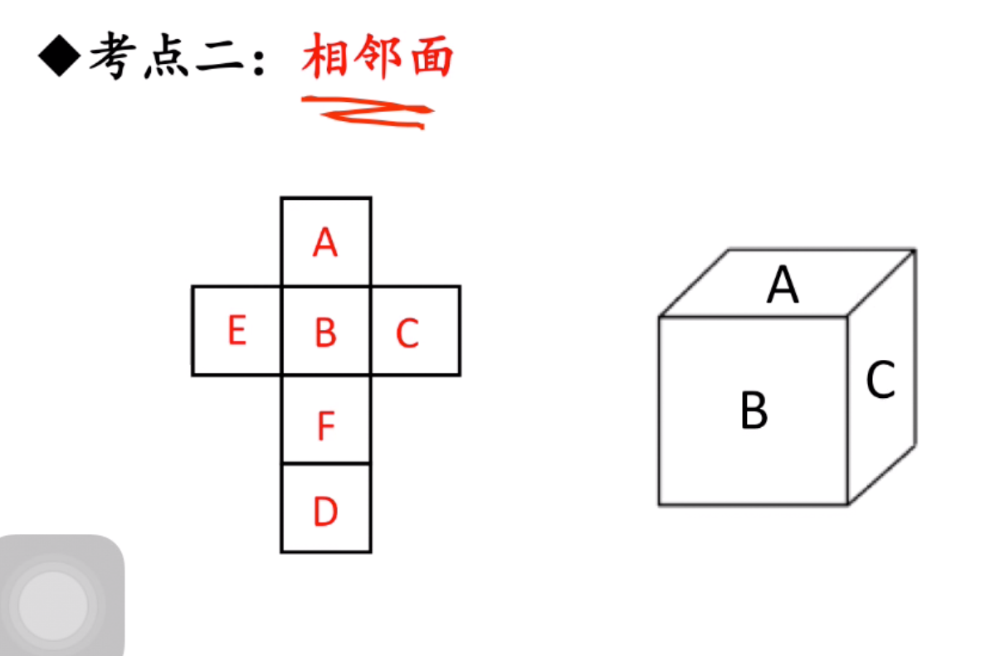
- 构成直角的两个边是同一条边


- 相邻面方法1-看相对位置（图形指向明显）
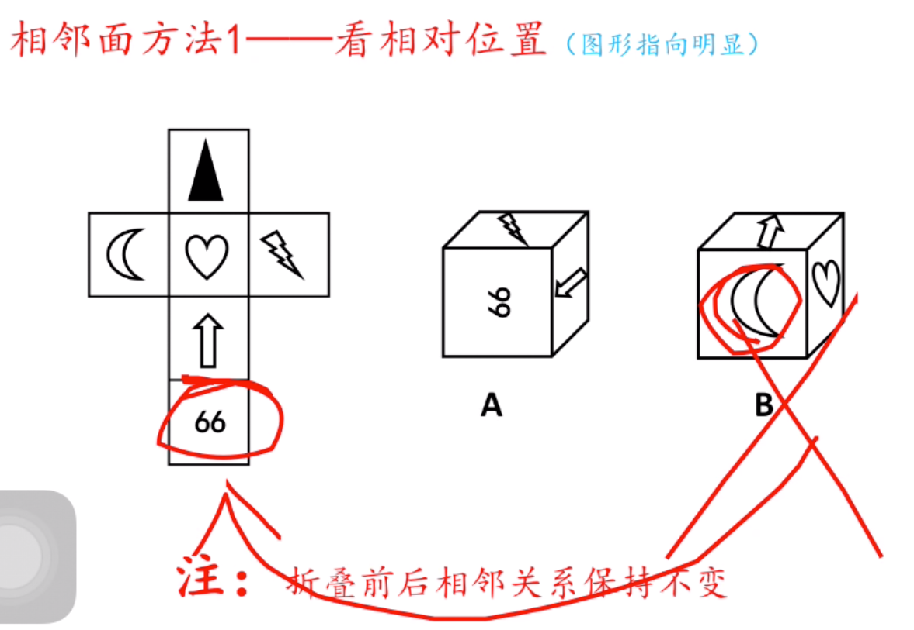

- 相邻面方法2-画边法
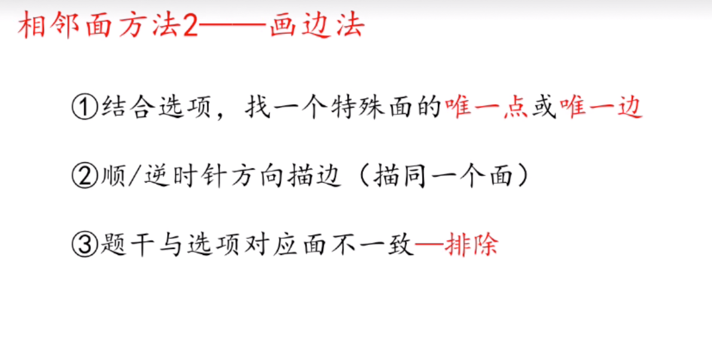
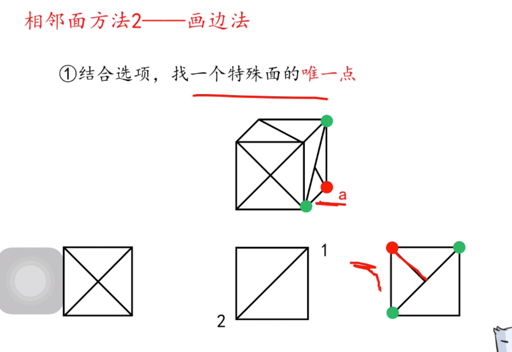
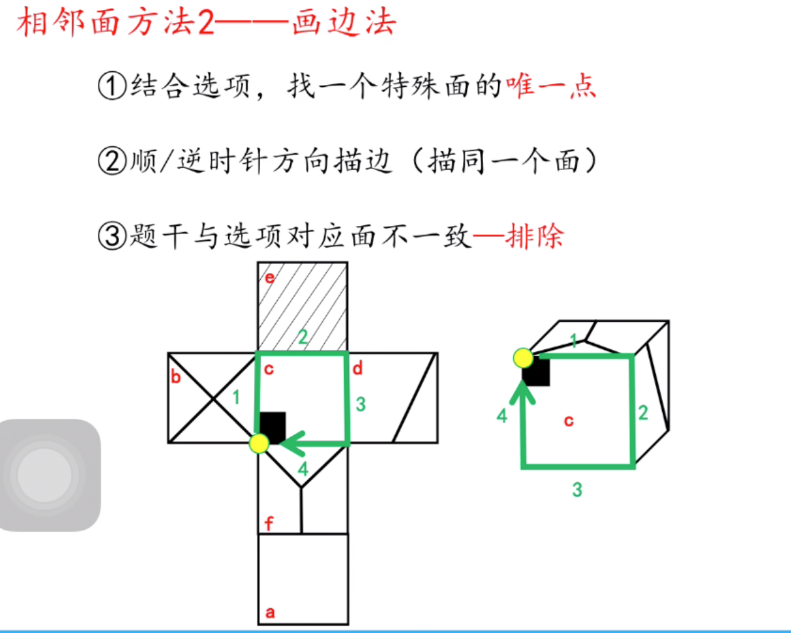

- 例子
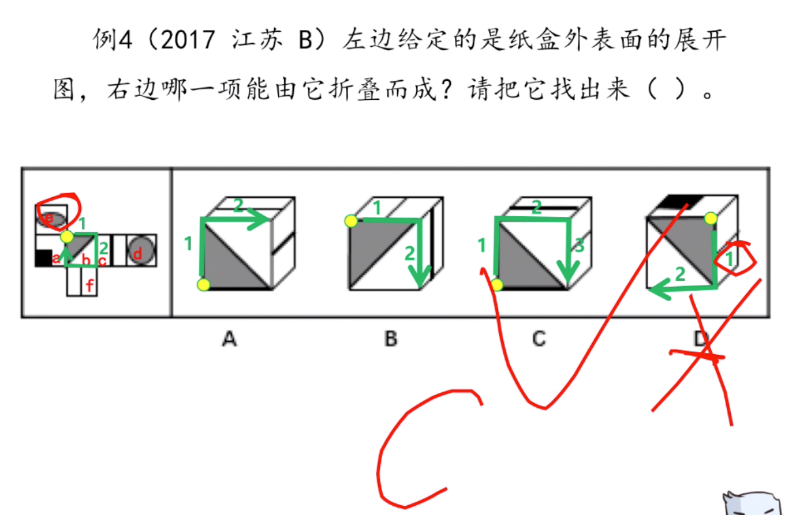

- 相邻面方法2-画边法


```
找不到唯一点可以找唯一边
```
- 例子
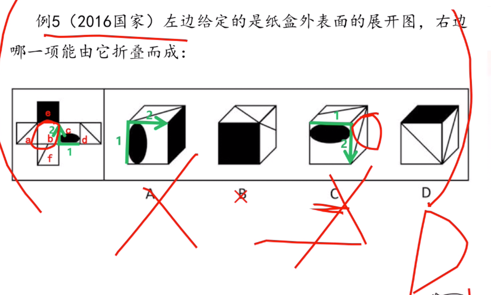

```
b项排除：因为相对面排除

A，C排除因为，画边法排除
```
> 总结
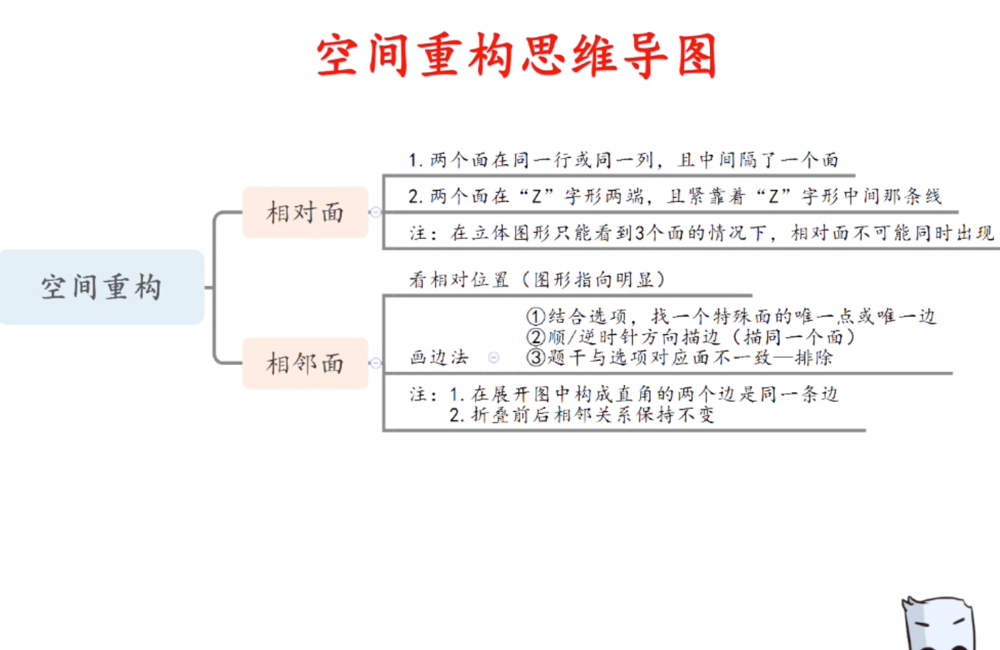

```
所有方法为了排除，为了速度！

```

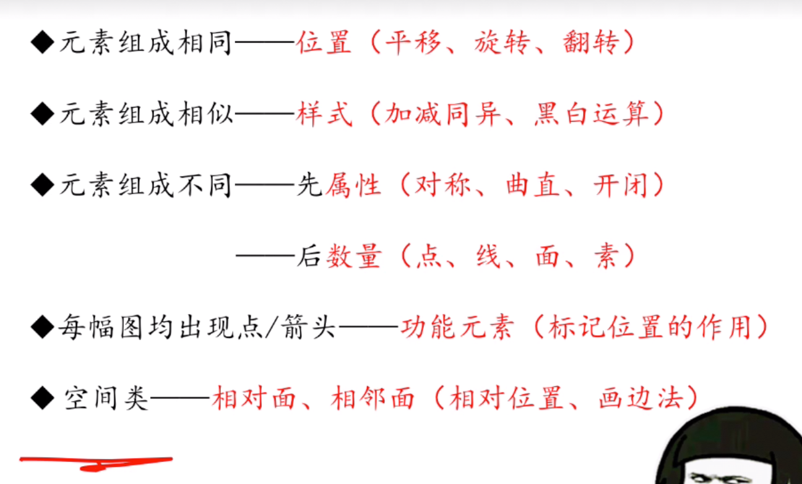