# 逻辑判断

## 翻译推理
----

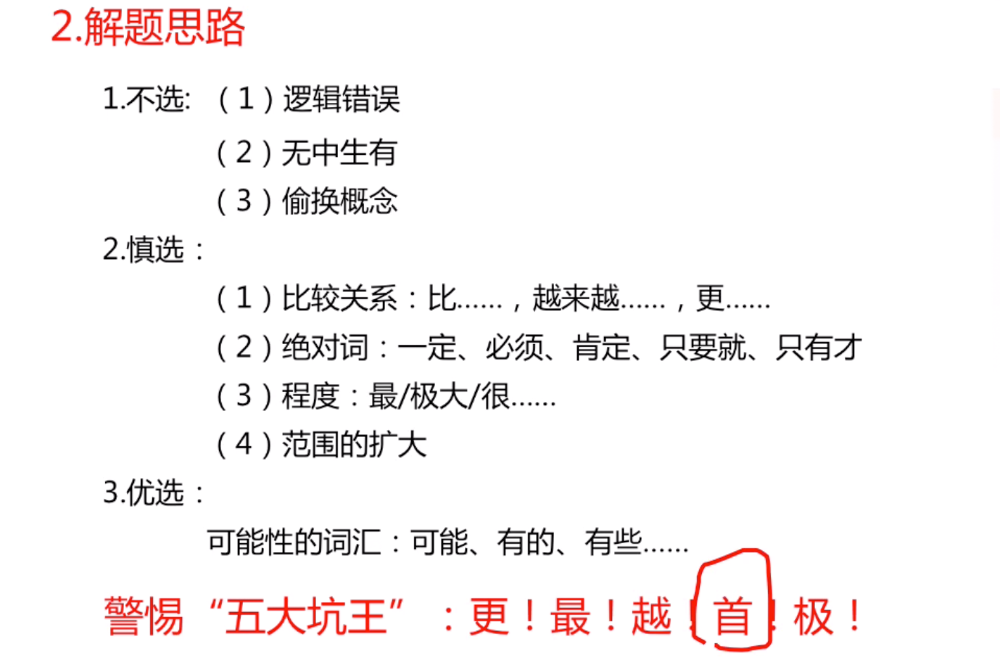

```
1. 比如四个选项，三个都带最字，一个不带最字，可能不带最字那个是正确选项

2. 选项带可能两个字的，可能是正确选项


```

- 例子
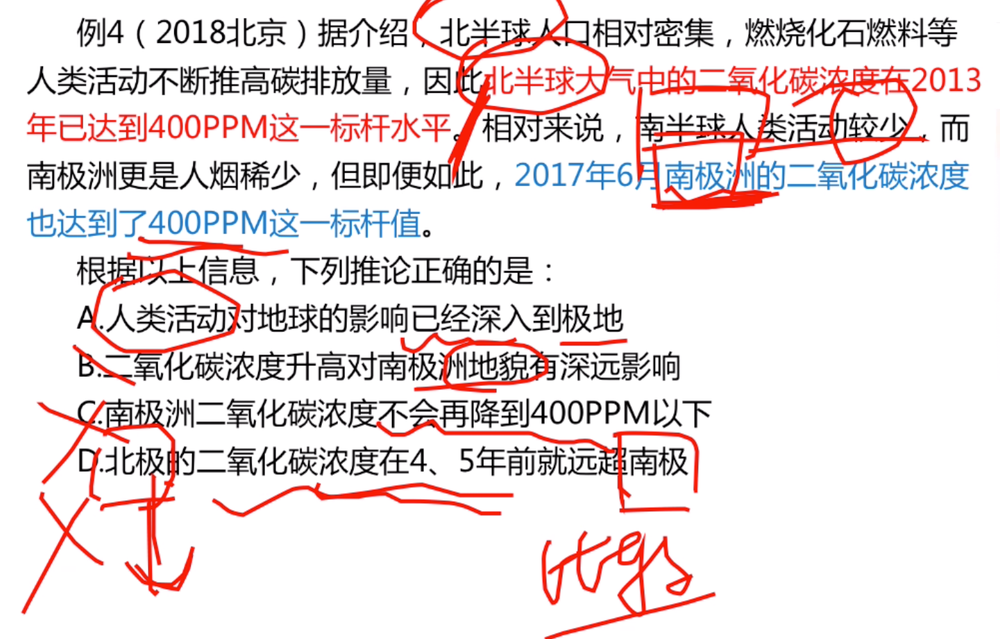

```
选A,B项无中生有

```

> 总结

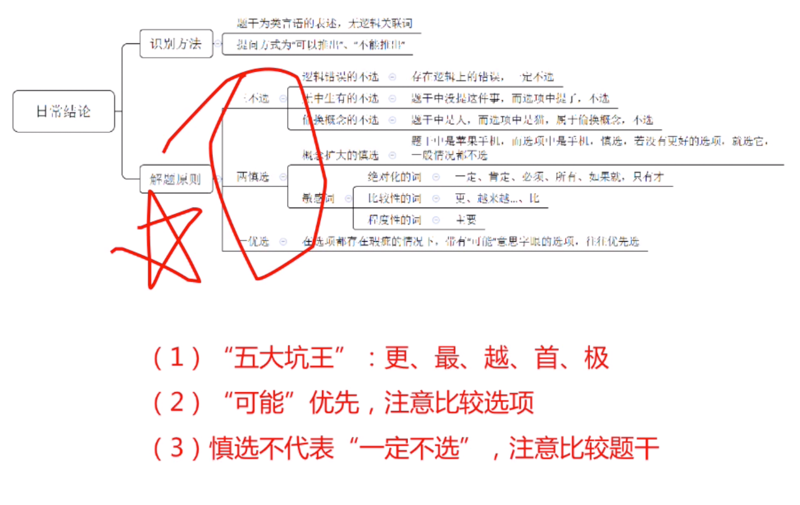

### 逻辑论证
----
```
削弱题型：反对
加强题型：赞同
```
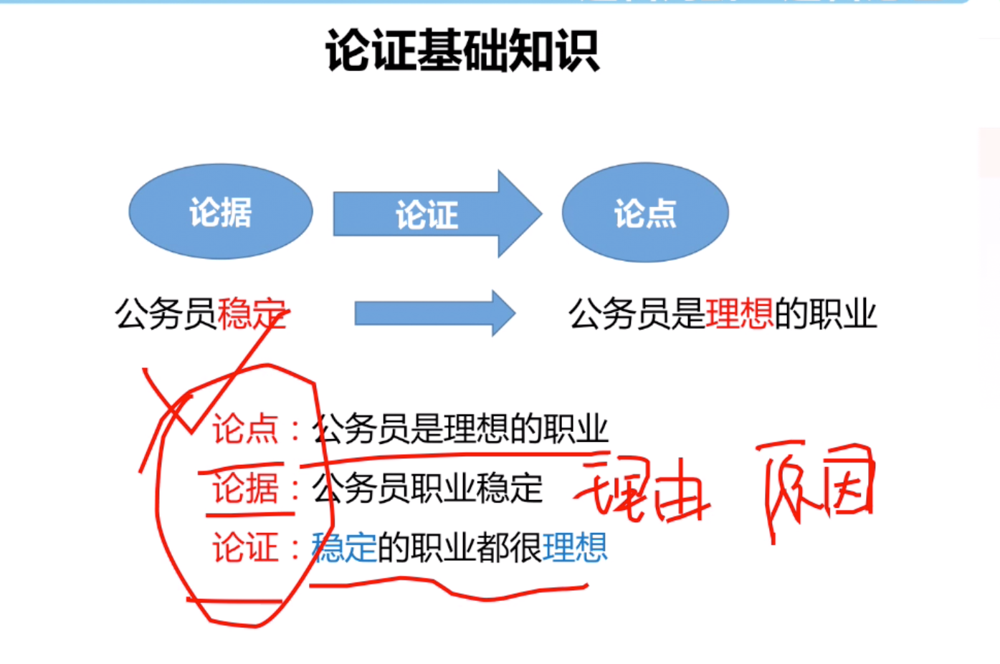
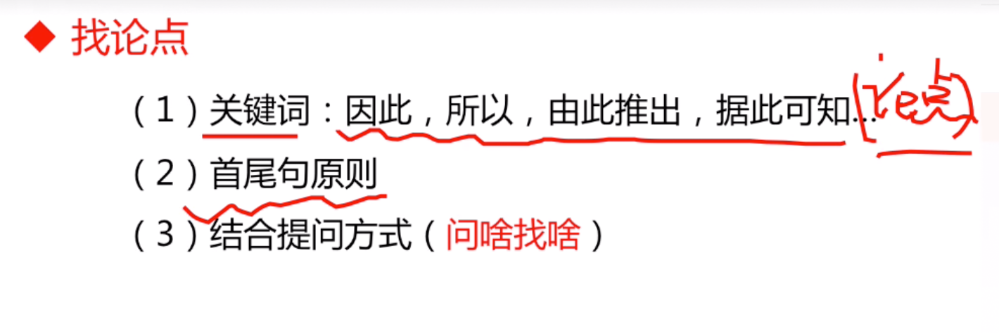

> 加强
```
不能加强：1.削弱2.无关
```
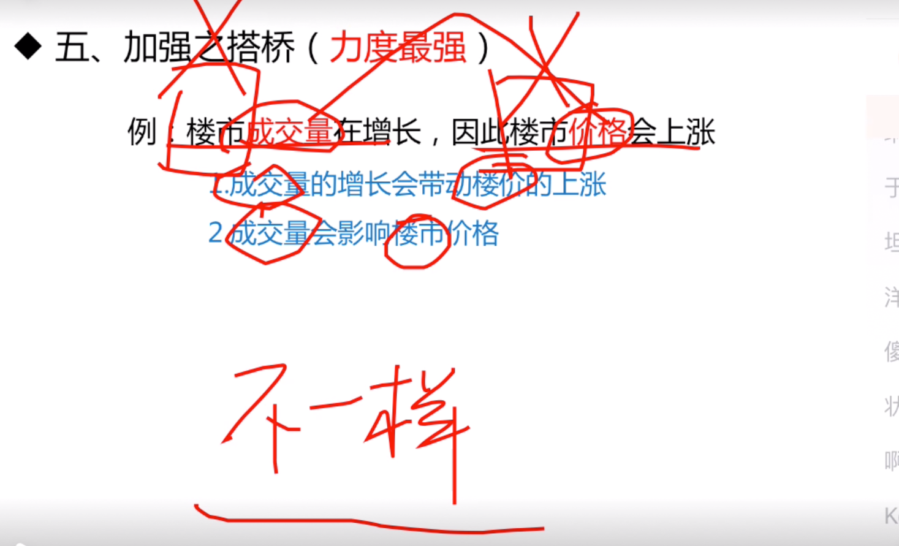

- 搭桥

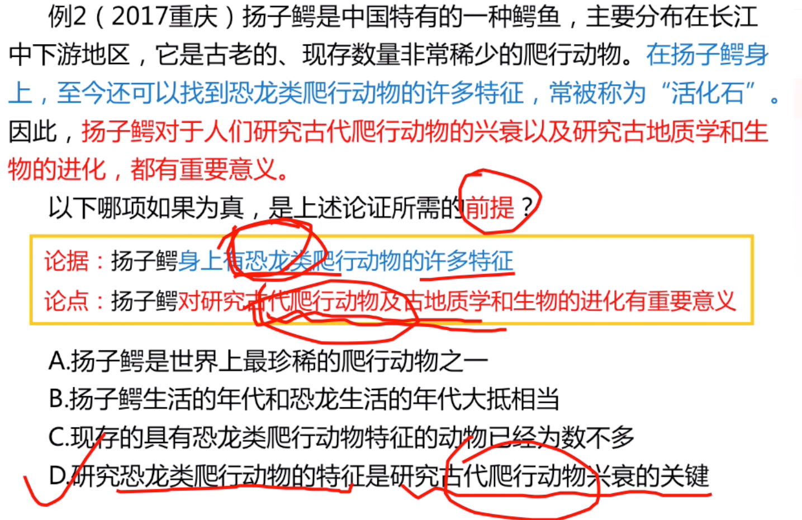
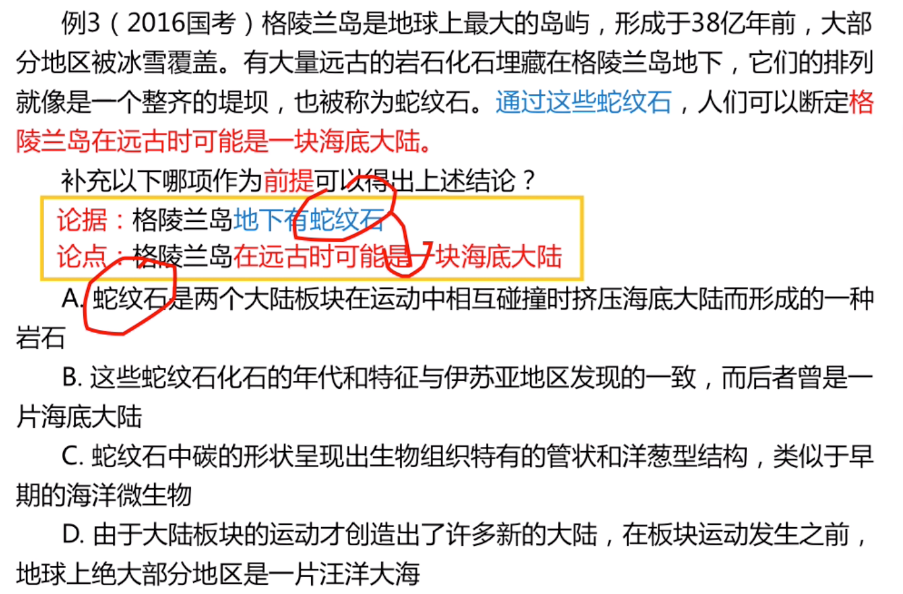

```
选a,b错是类比选项。类比时间一致不能说明其他是一样的。

```
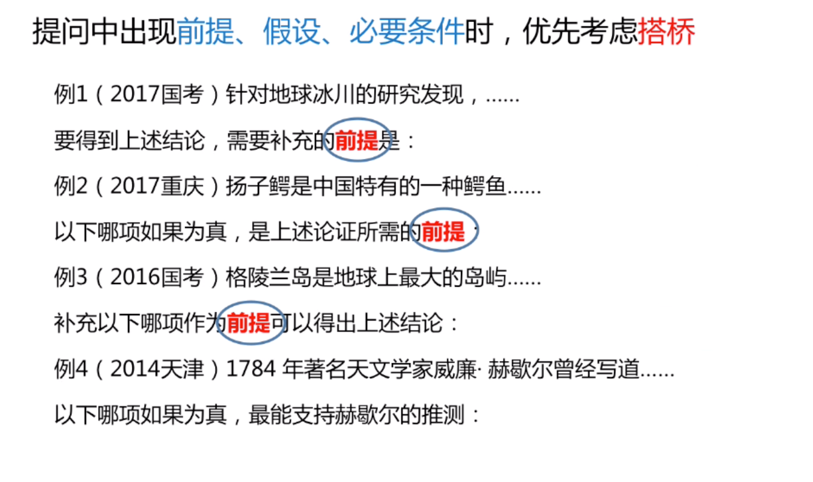
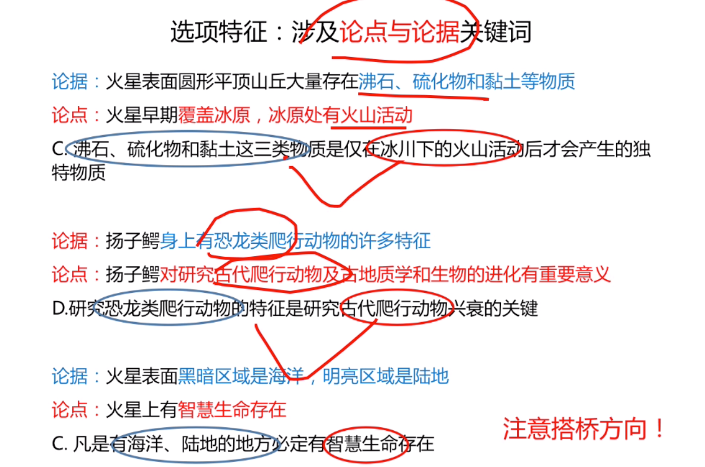

（论据退出论点：搭桥。）
> 考点6：补充论据

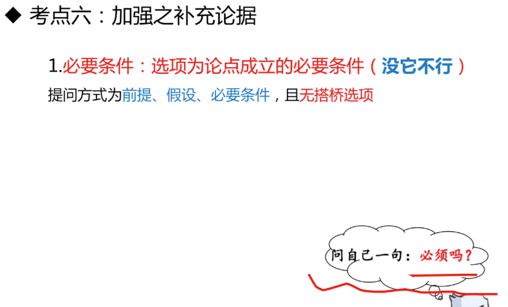
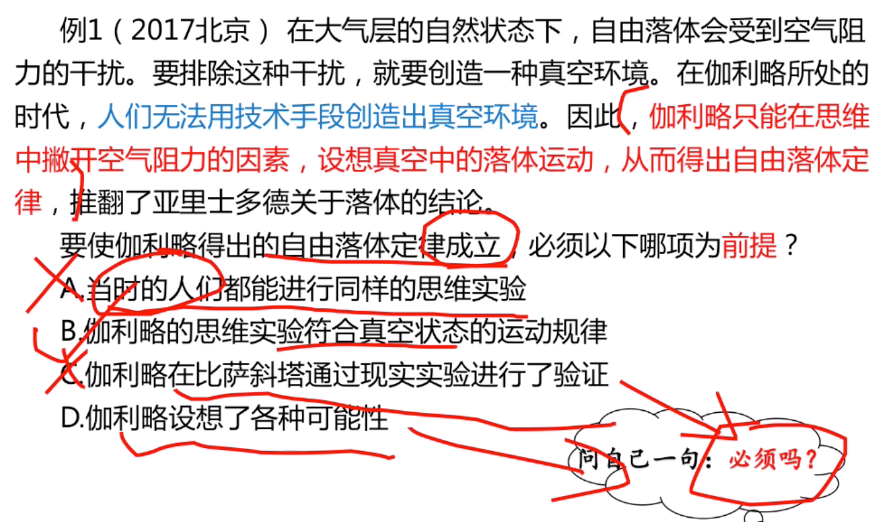
- 例子
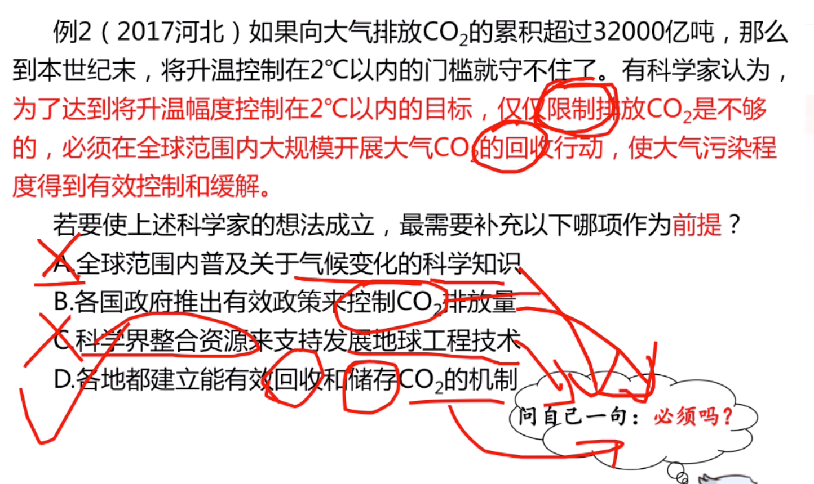
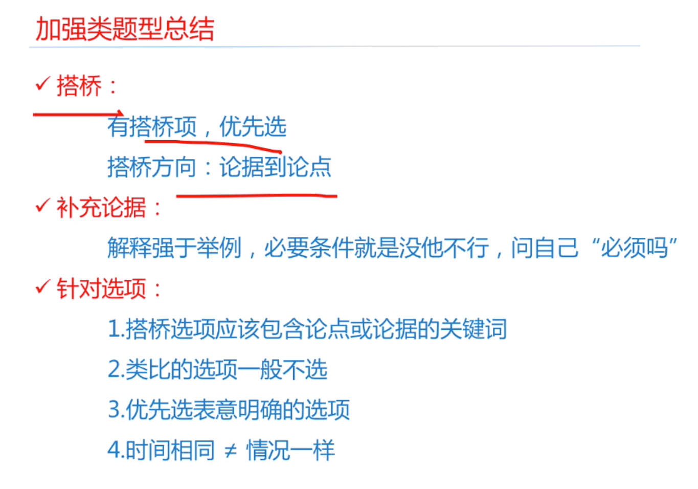

```
b选项是产生偏见，而题目是减少偏见，无中生有

选C，举例子
```
- 总结
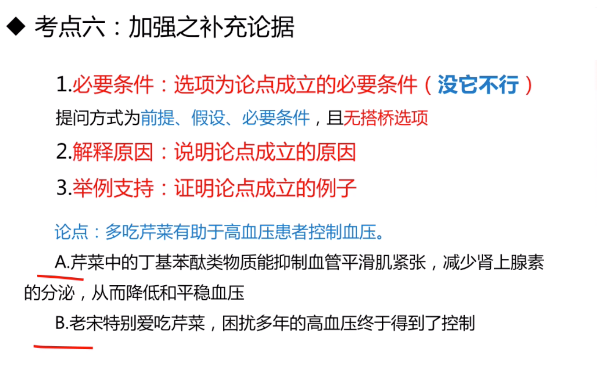
```
重要性，强度 1>2>3

```

