# 逻辑论证
----

```
削弱题型：反对
加强题型：赞同
```
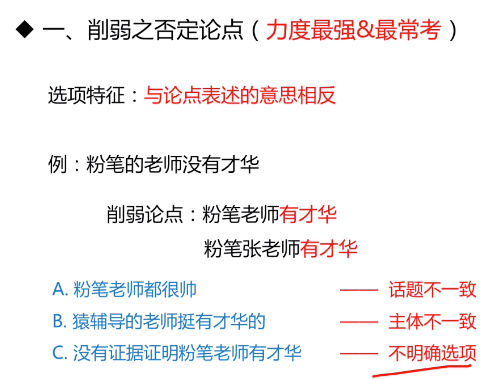

> 一：削弱之否定论点（力度最强，最常考）

```
解题步奏：找出论点->想出削弱—>寻找选项

削弱类题目：对策一般不选

```

- 例子
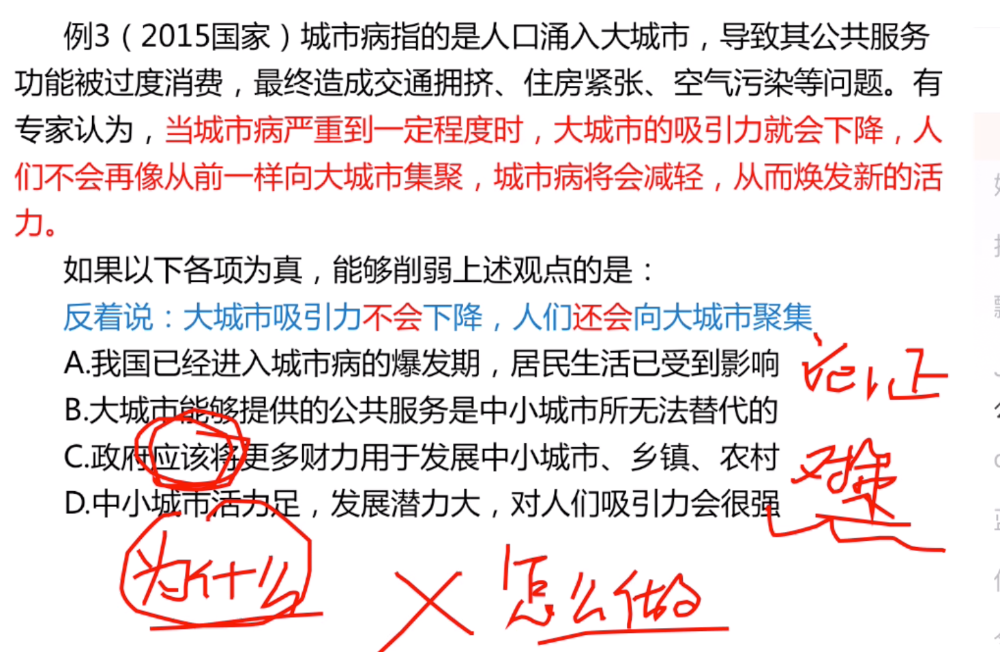

```
选B
```

- 例子
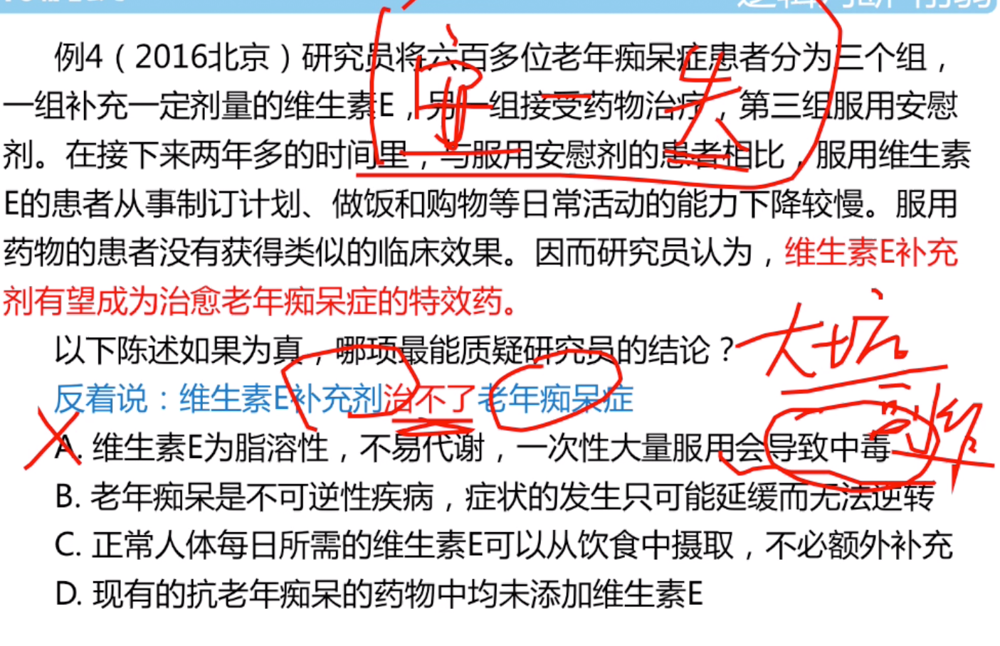
```
选B

治不了，说明维生素E也治不了
```

- 总结
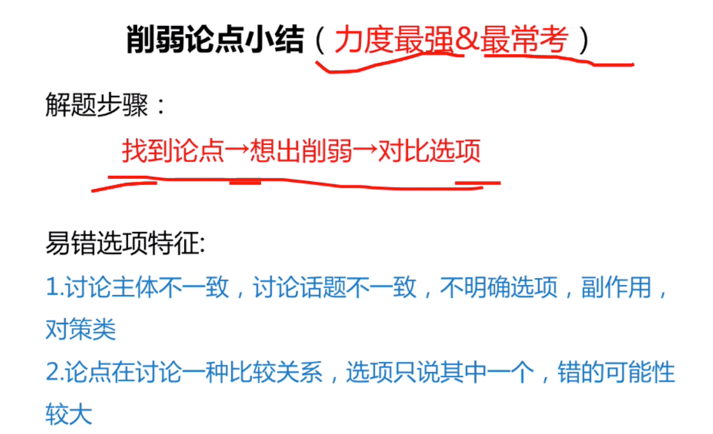

> 拆桥

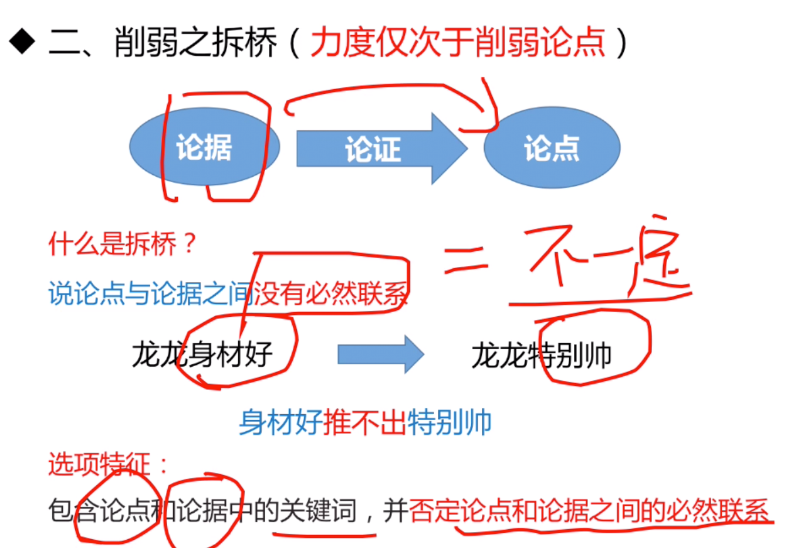
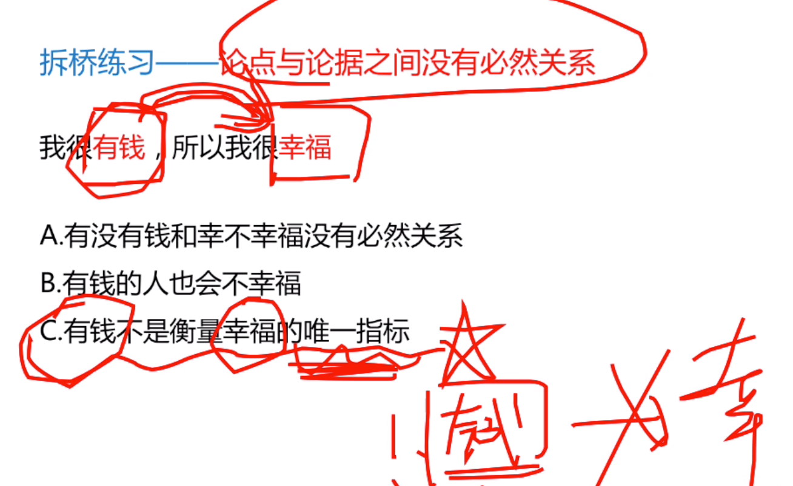
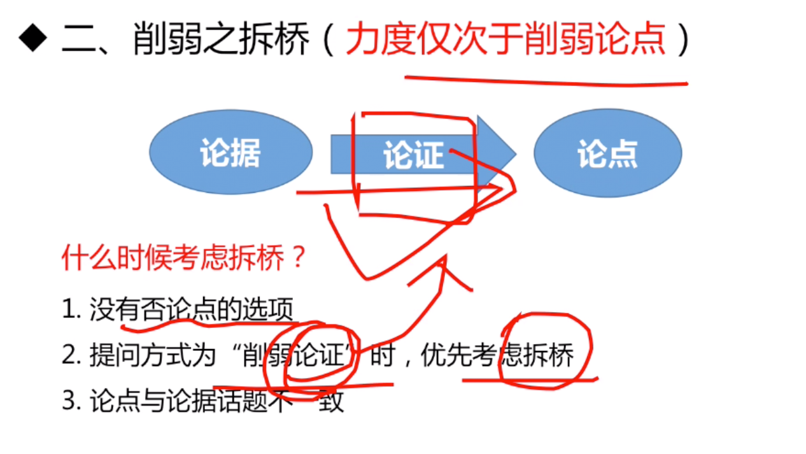

```
程度 1>2>3
```

- 例子
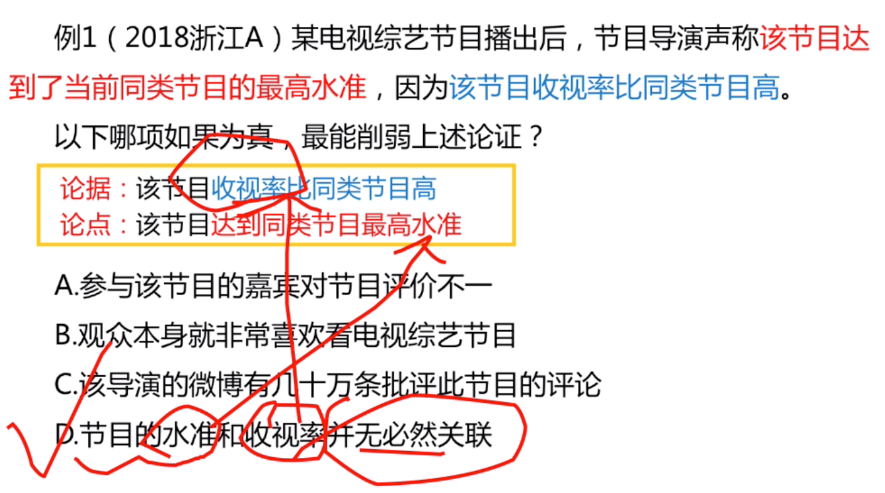

> 总结

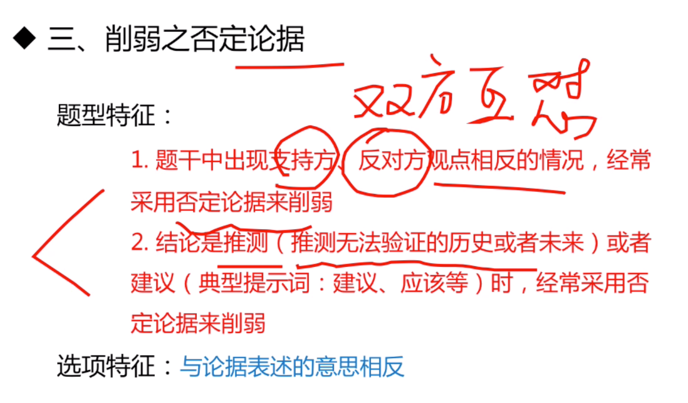
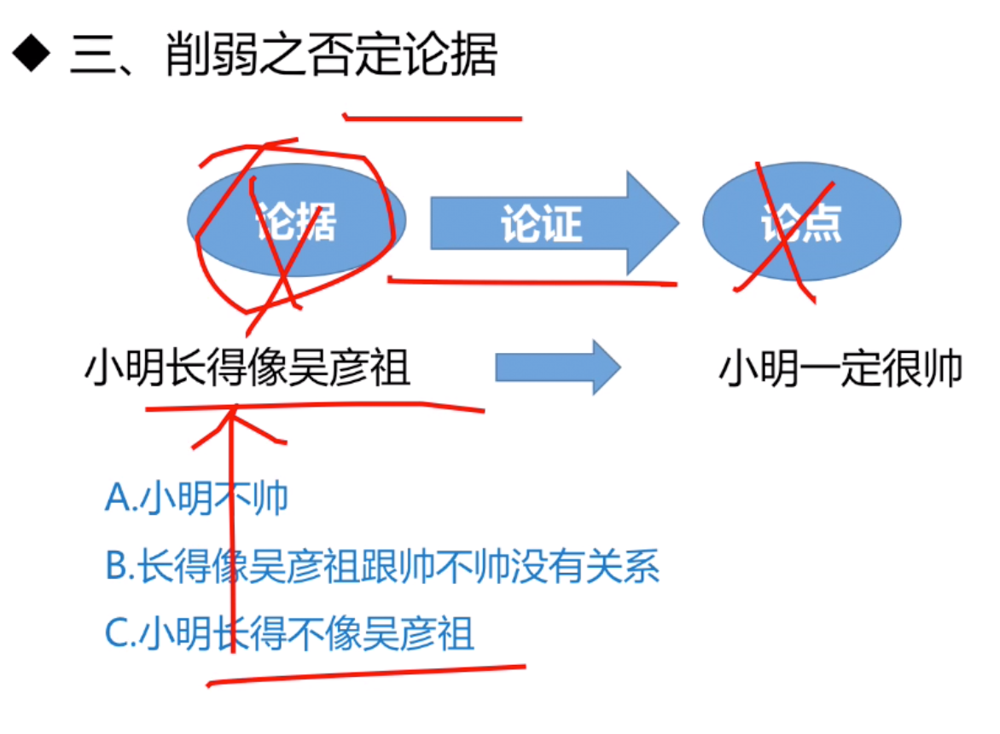

- 例子

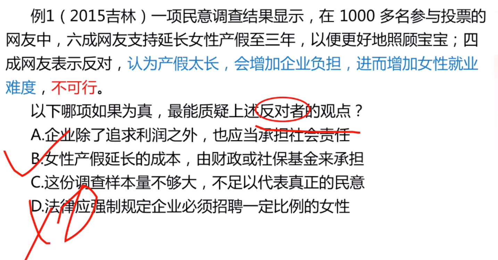

```
选B
B：实际情况
D,对策不可选,选项有应该这词
C：反驳的观点而不是样本
```

> 总结

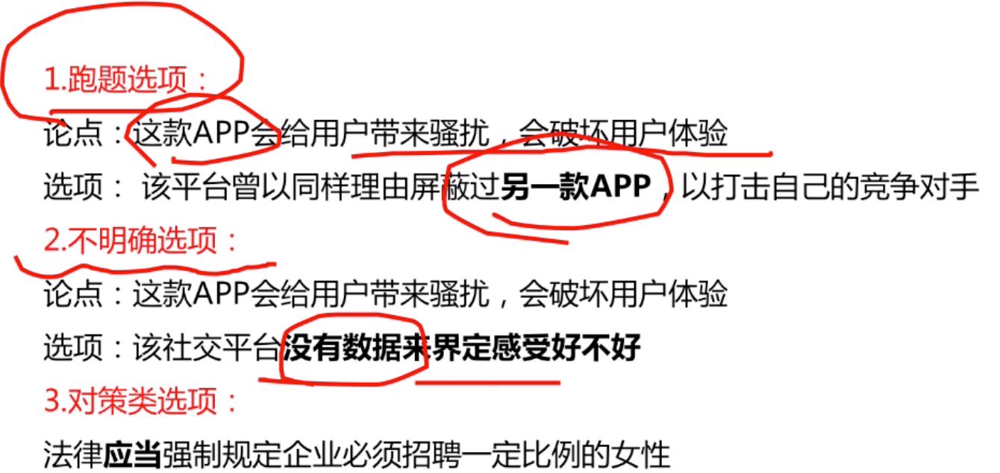


- 例子

```
论点是想说明它不好，所以选D.
D是说它好
```
- 备考建议

