### 解题思维：相邻比较

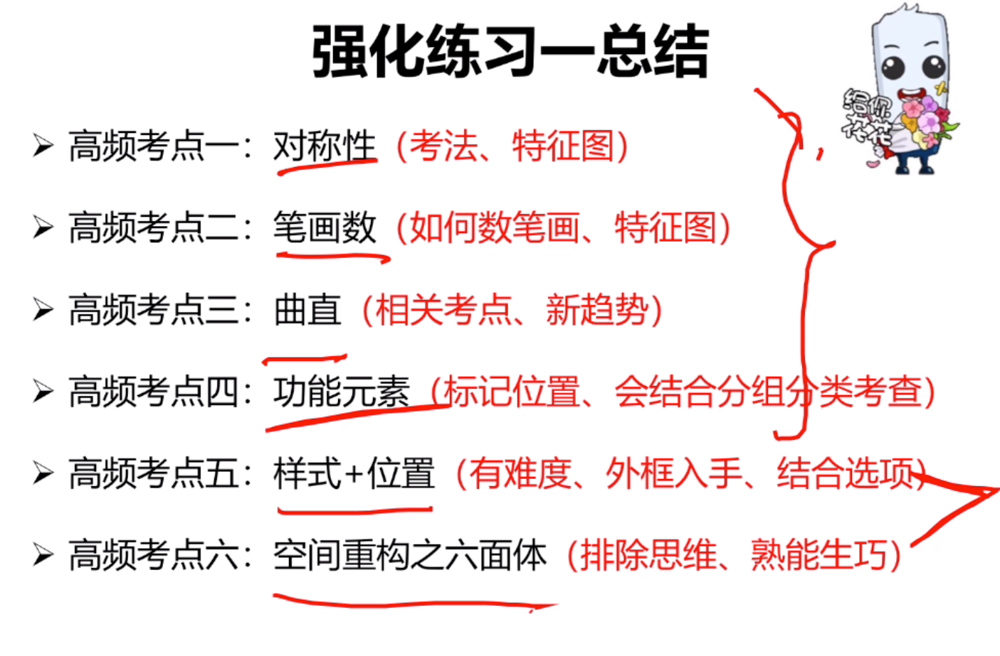

- 例子（只有两个图形变了交换位置）


- 例子
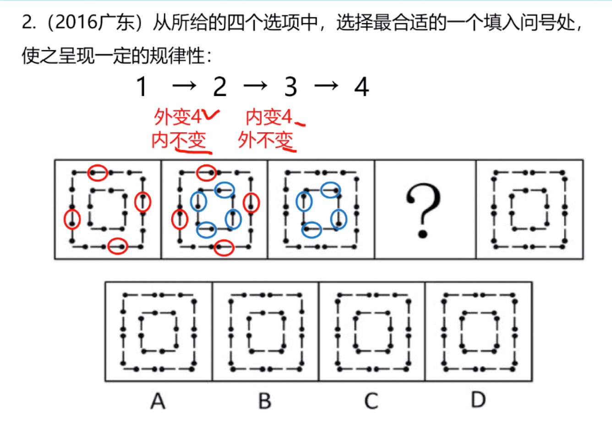
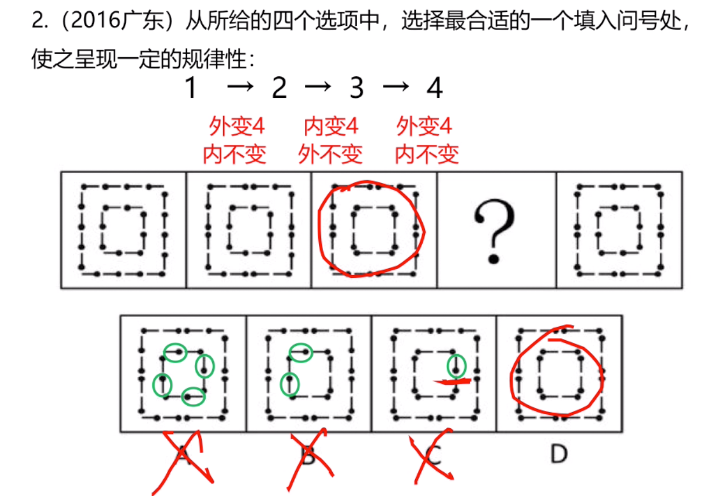

- 例子
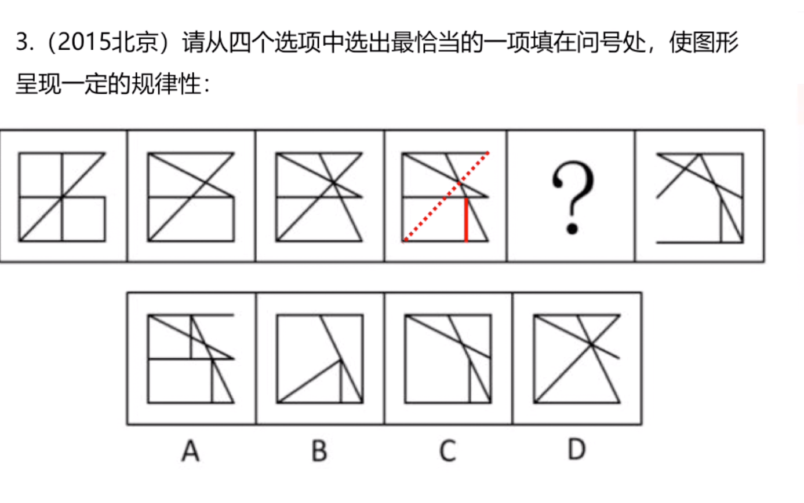


- 例子（相邻图形有且只有一个相似图形）
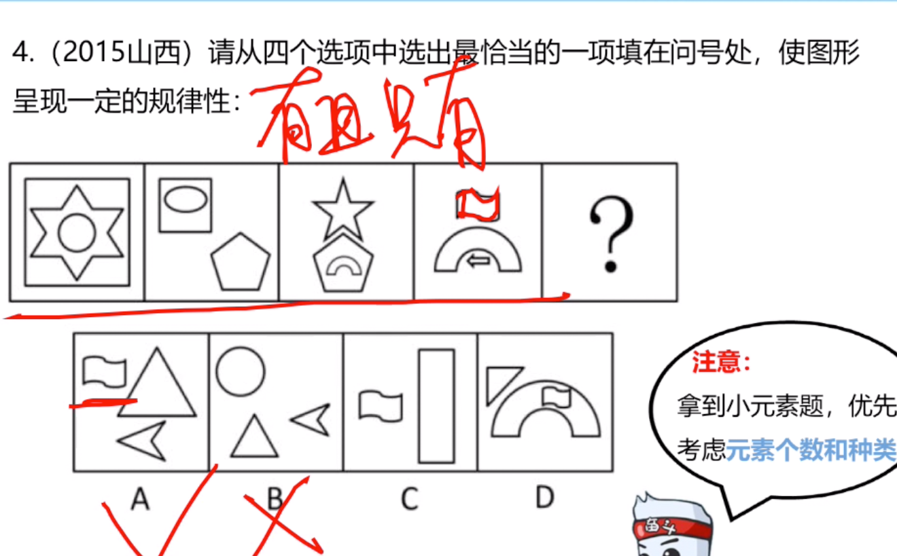

## 定义判断

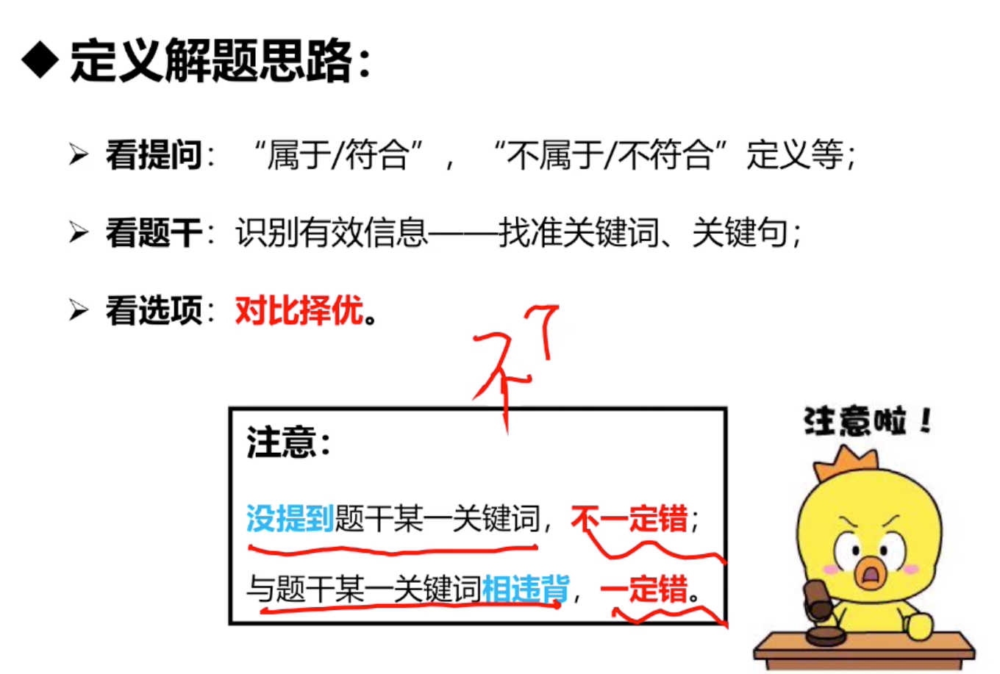

### 要点一：快速识别有效信息
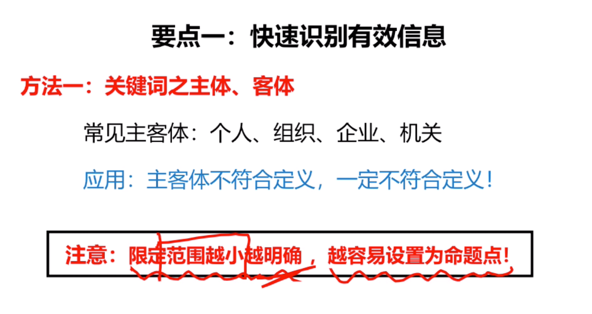

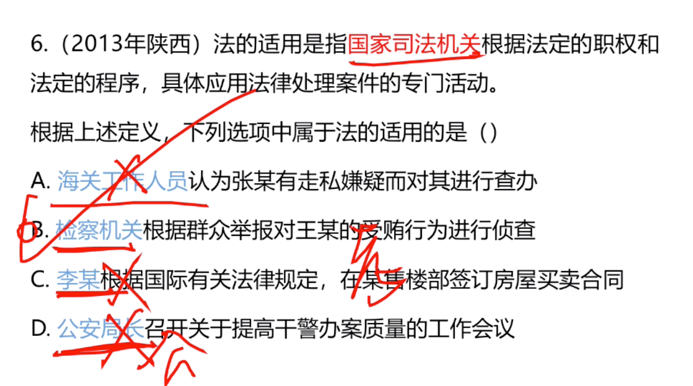
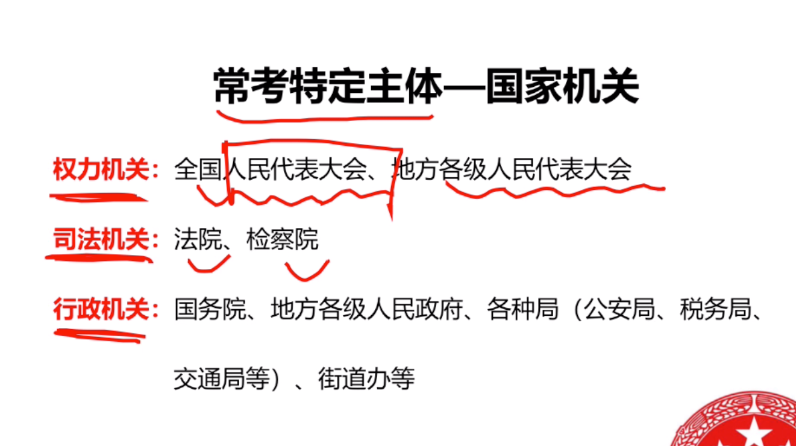

- 例子(被管理人的对管理的做出合理评价)
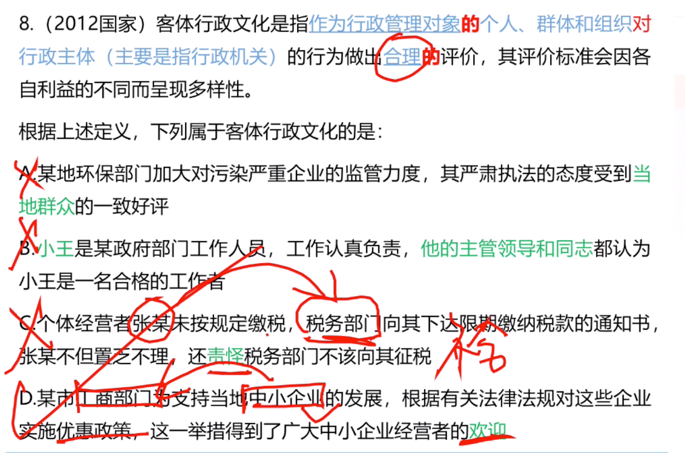

### 方法2
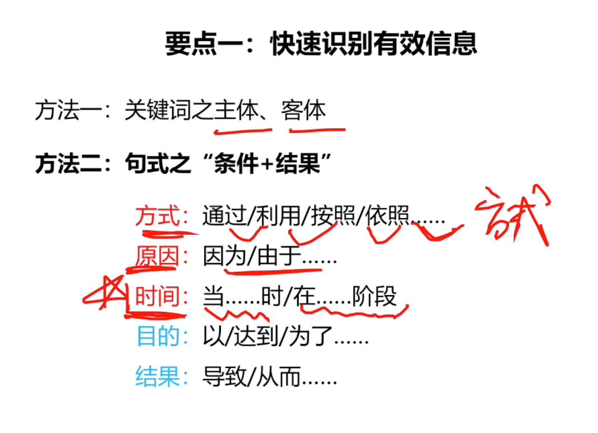

- 例子
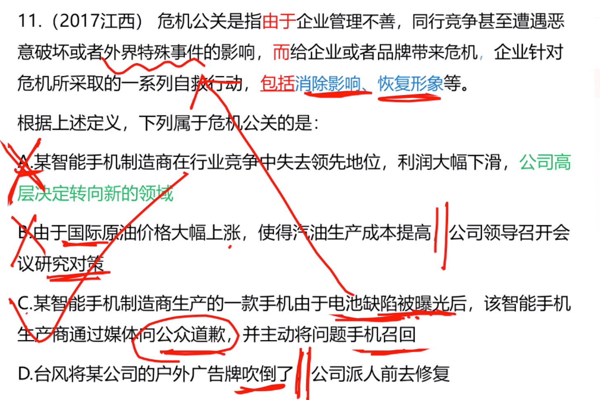
```
B，C，不一定是遇到需要自救的危急，不太合适，

```

- 例子（分为三部分：原因+结果+造成的后果）

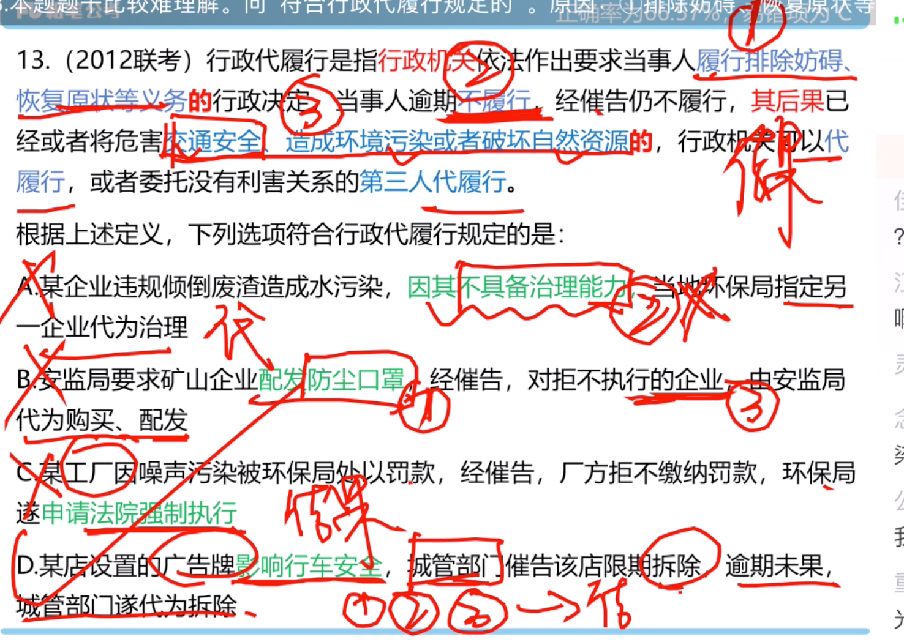

```
c不符合排除妨碍。
```

