### 


#### 考点一：削弱否定论点


- 例子(选A)

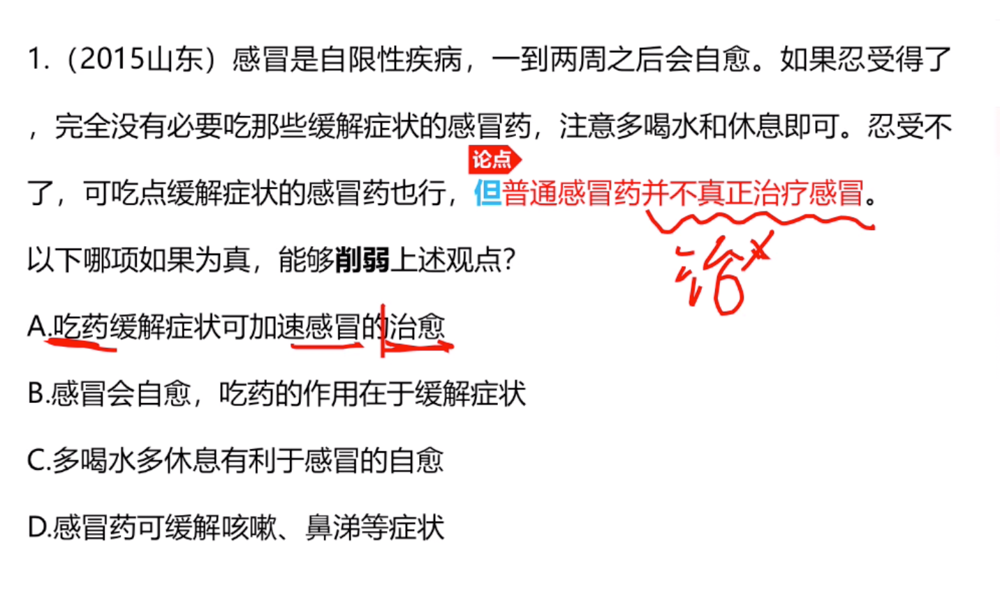

- 例子（）
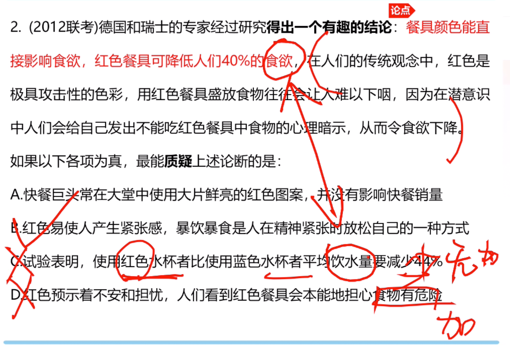

```
A.无关选项
B.与论点相反
C.水跟食欲无关
D.顺着论点说的。
```

- 总结
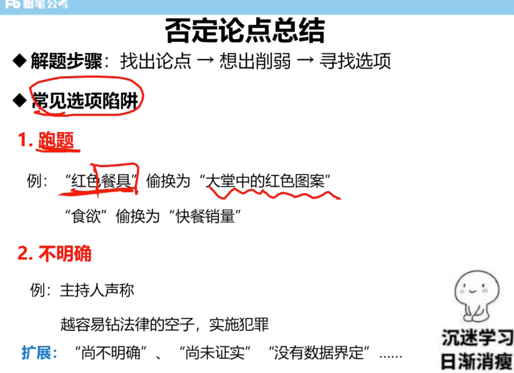
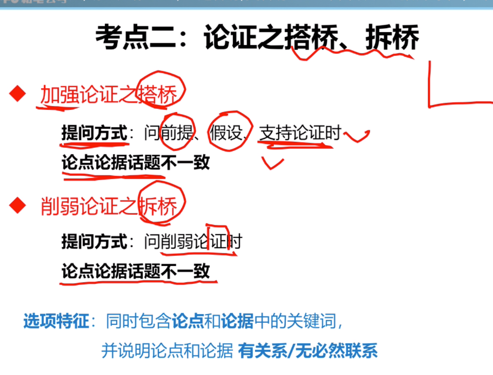

- 例子
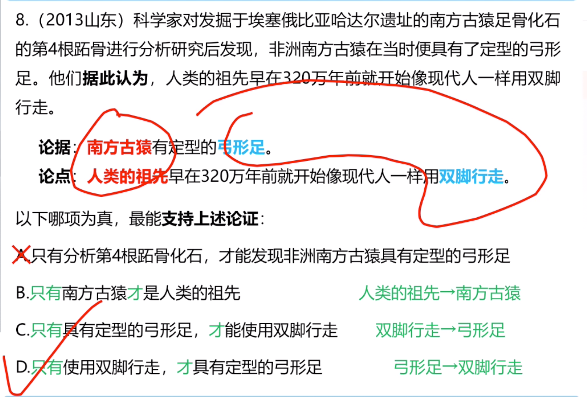

```
方向是从论据到论点

如果论点和论据的主体和宾语都不是一个东西

则找论点和论点

或者论据和论据

两种搭桥方式
大致方向依旧是从论点到论据


```

- 总结

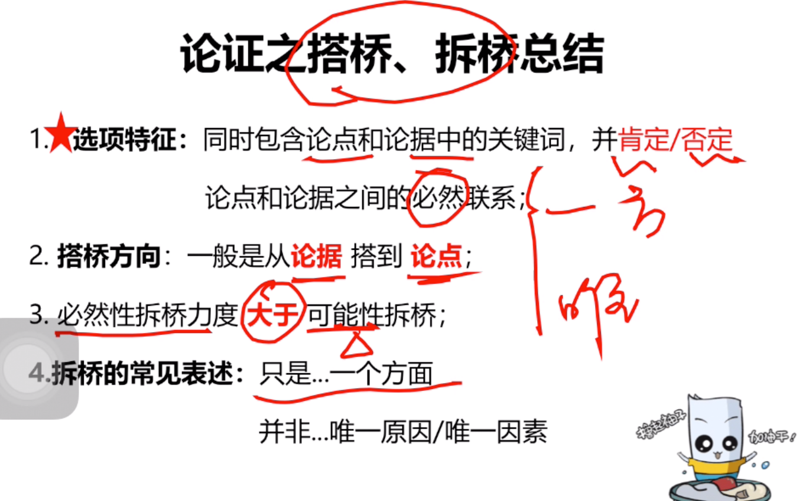

### 考点三：实验类论证问题

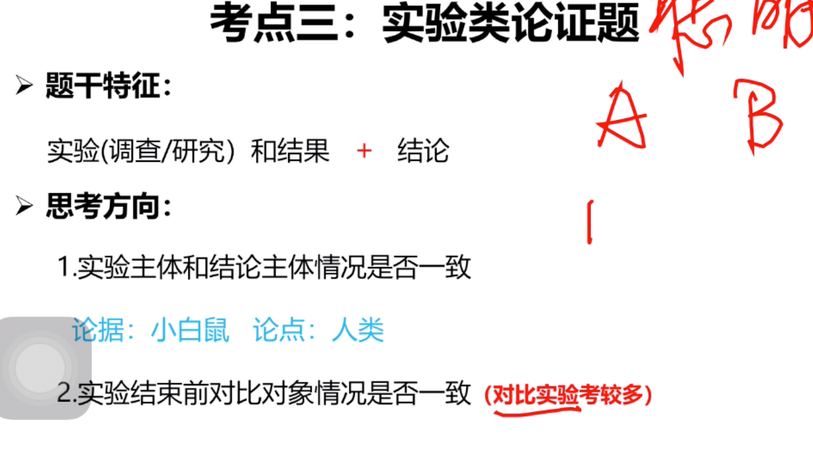

- 总结
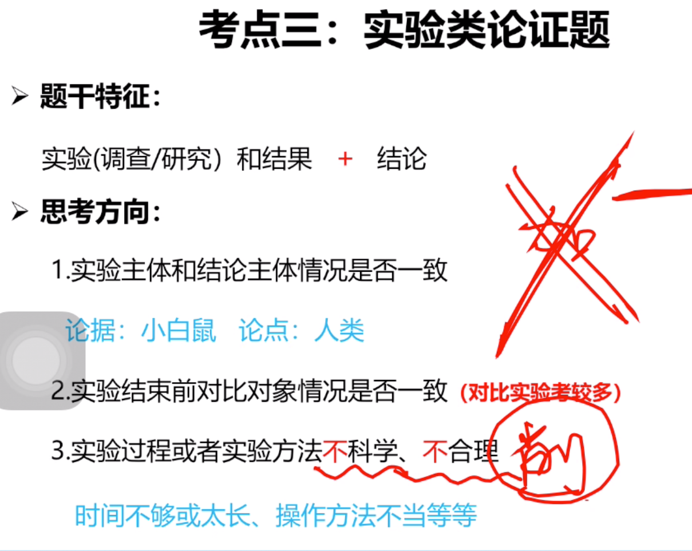
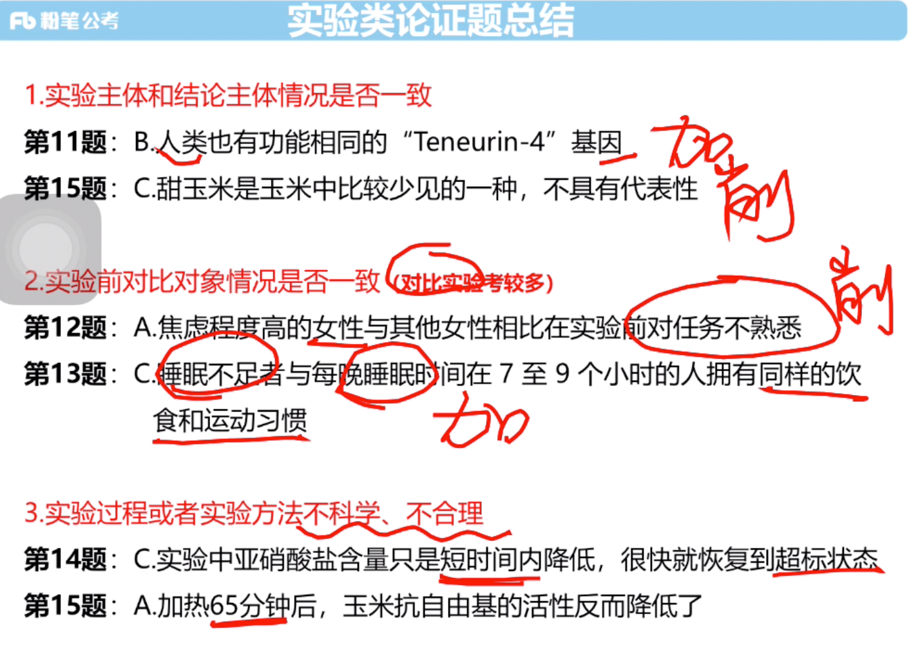

#### 考点四：特色论证

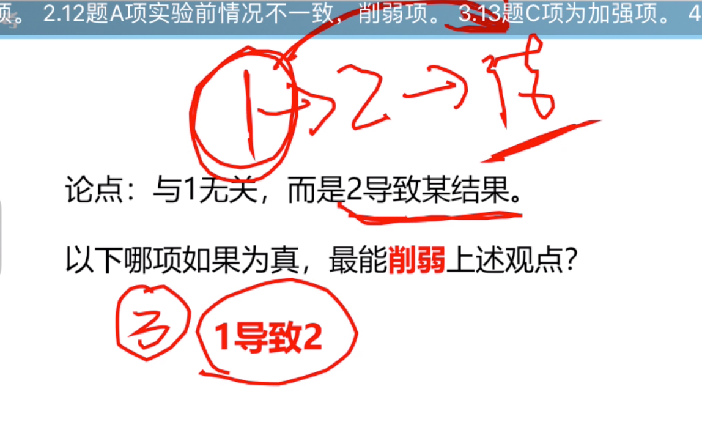
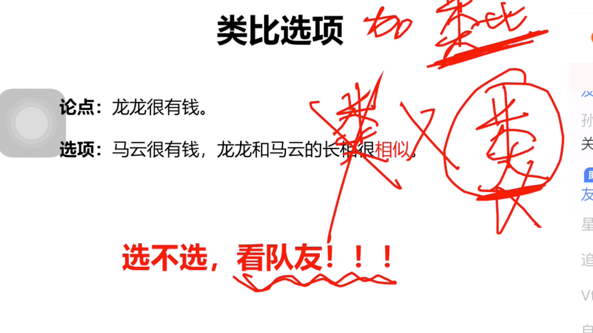

```
加强题力度：解释 > 举例 > 类比

```

- 例子（搭桥不对，选的类比）
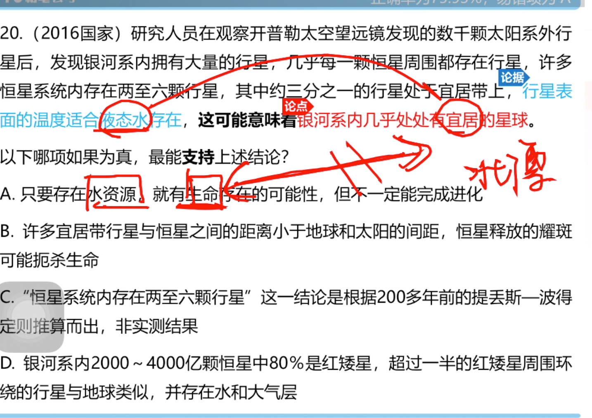


### 总结

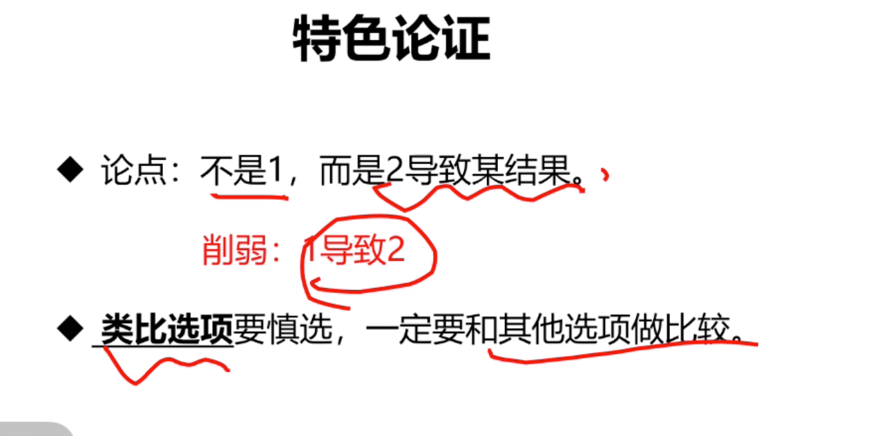
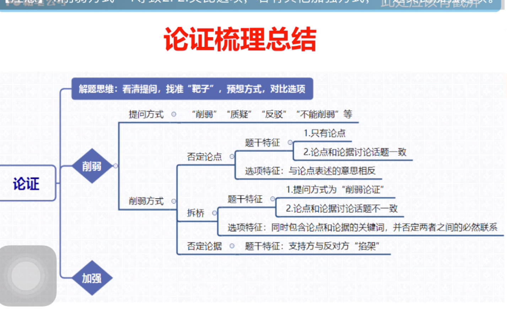
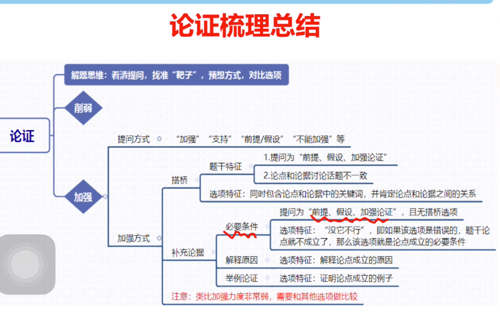
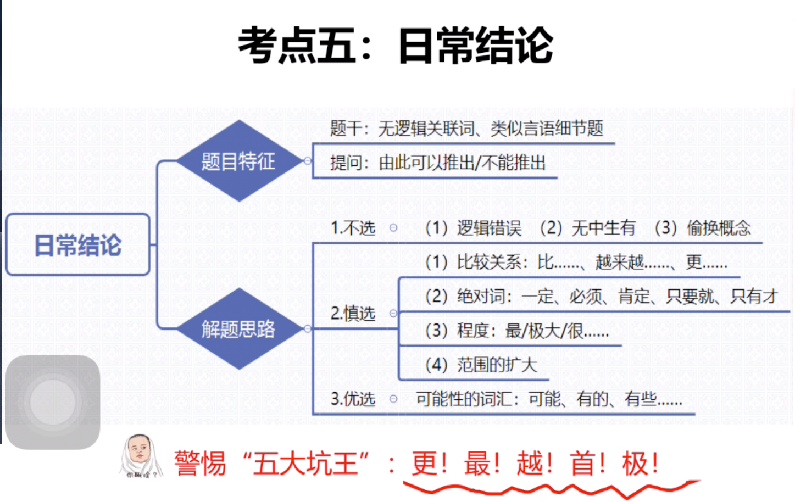