### 总结构

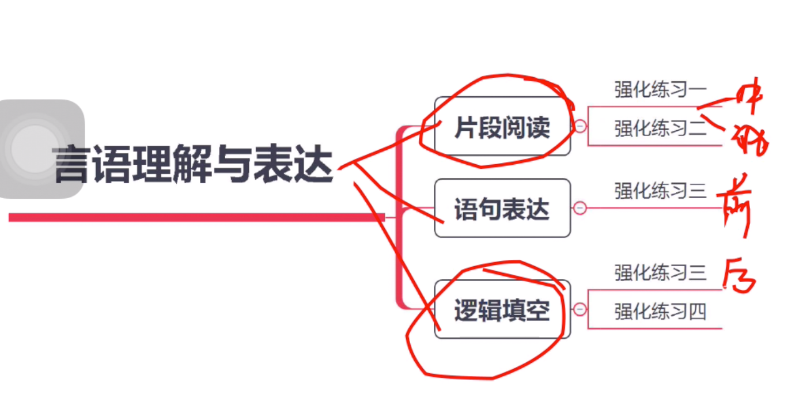

### 中心理解题的要点

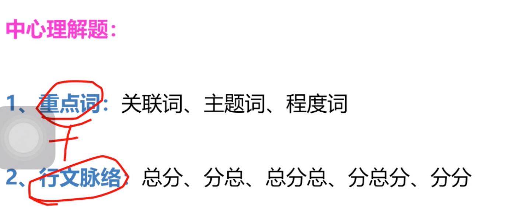

### 高频考点一：转折

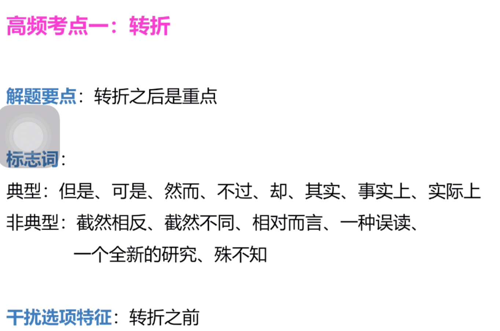
- 如果看不懂则看转折之前的逆向思维
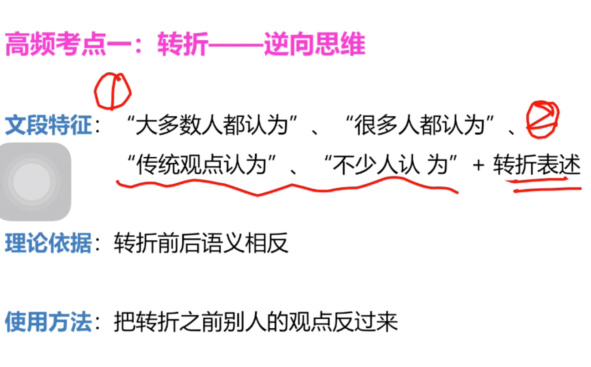

- 总结

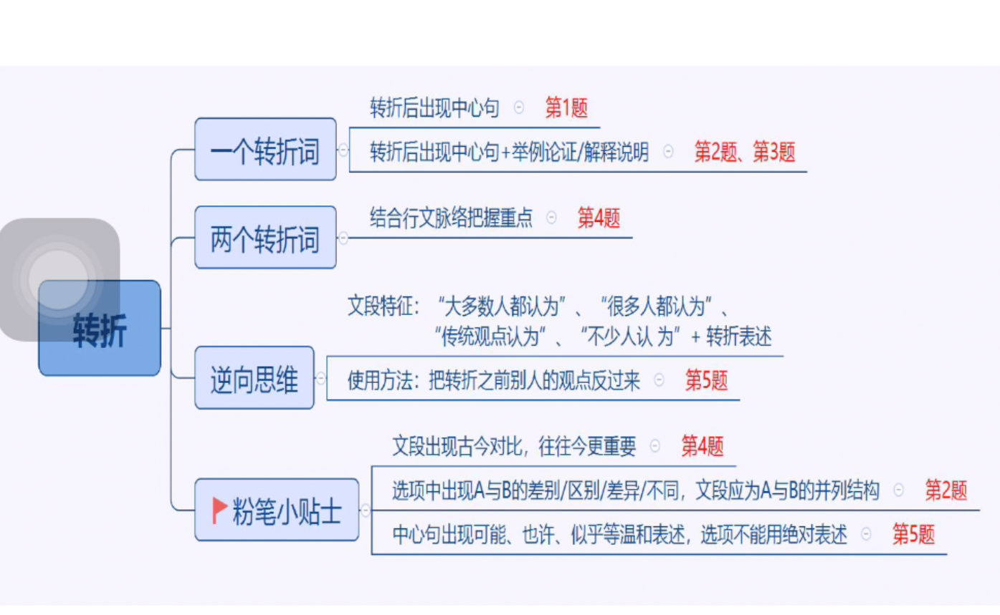

### 高频考点二：因果

- 例子（bcd都包含重点词。可以看到正是，也是对前一句的强调。b打赢太绝对。c只是例子不重要。）

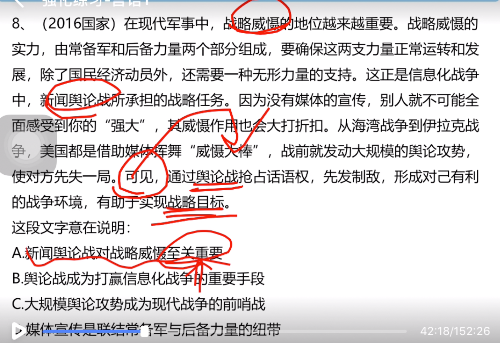

- 总结

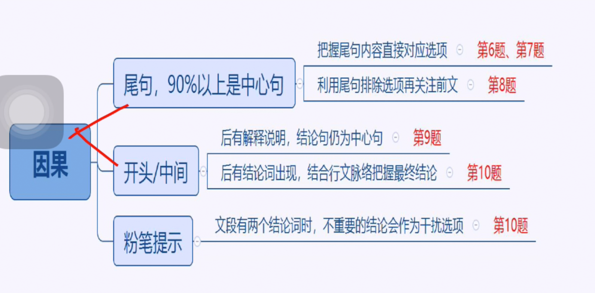

### 高频考点三：必要条件

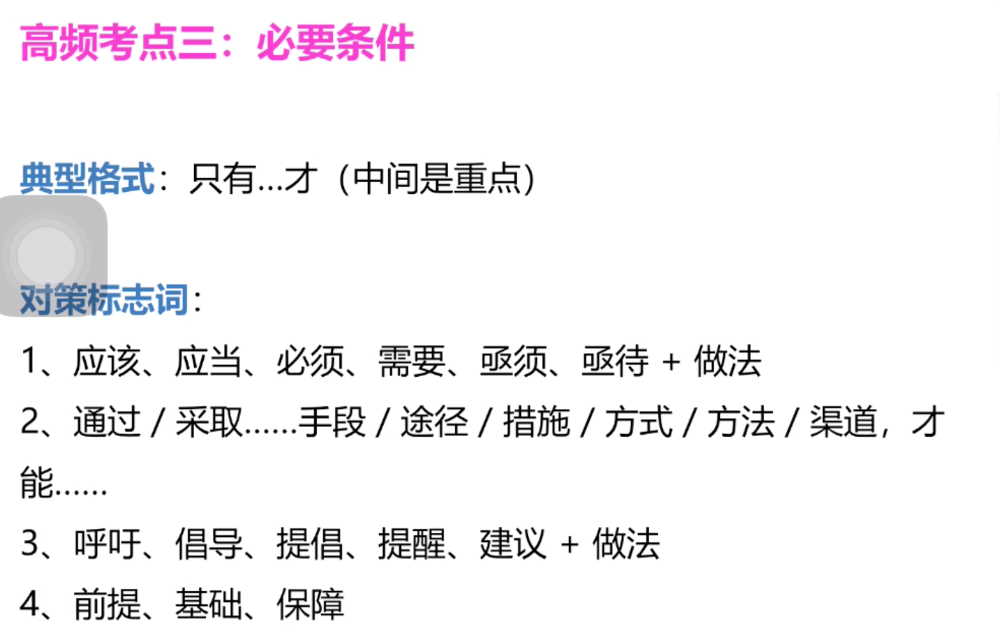
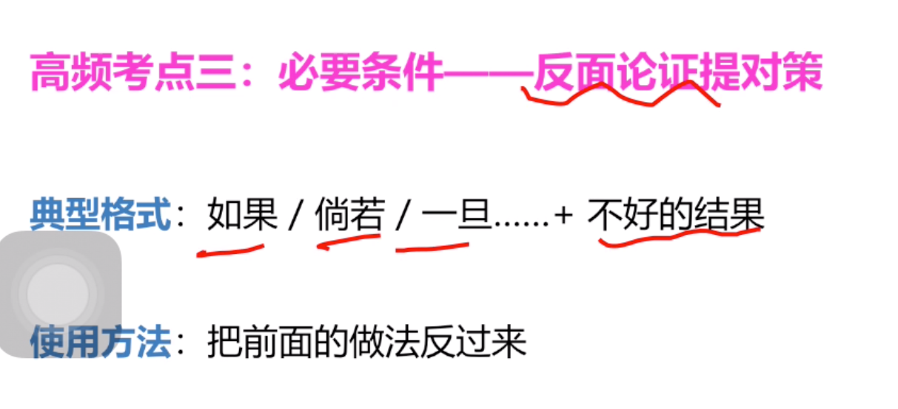

- 例子
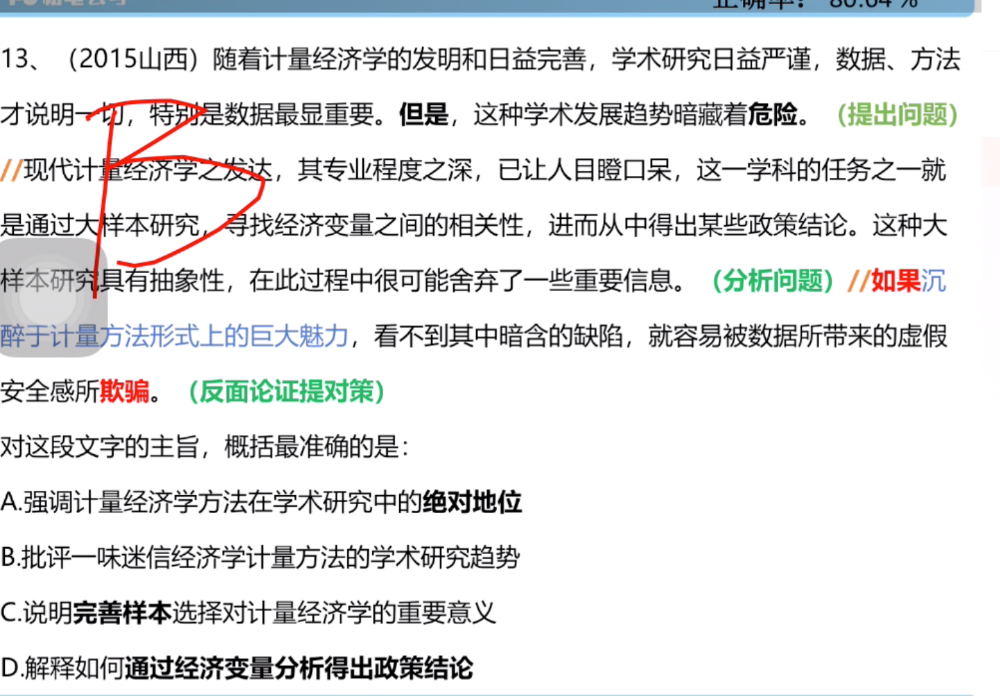

- 总结
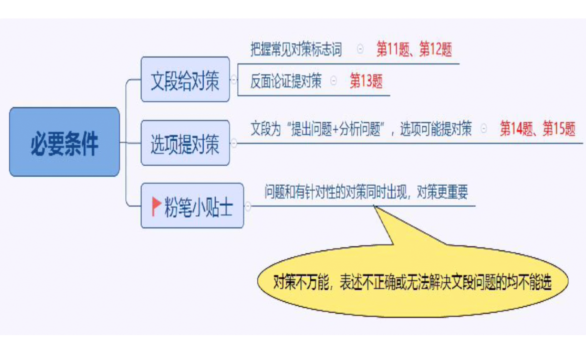

### 高频考点四：并列

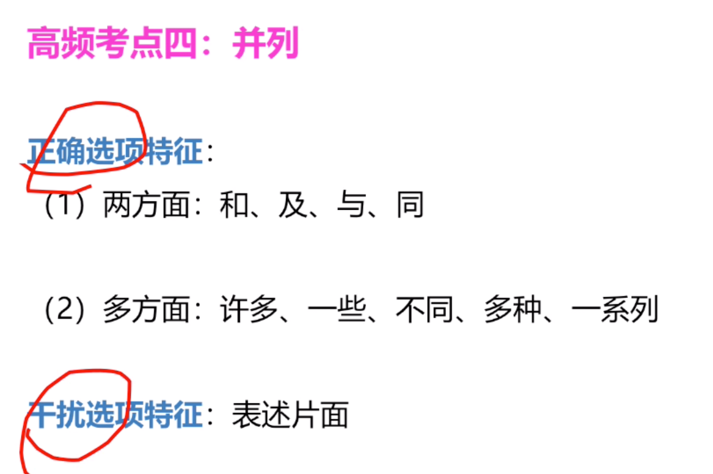

- 例子（要注意文章主体）
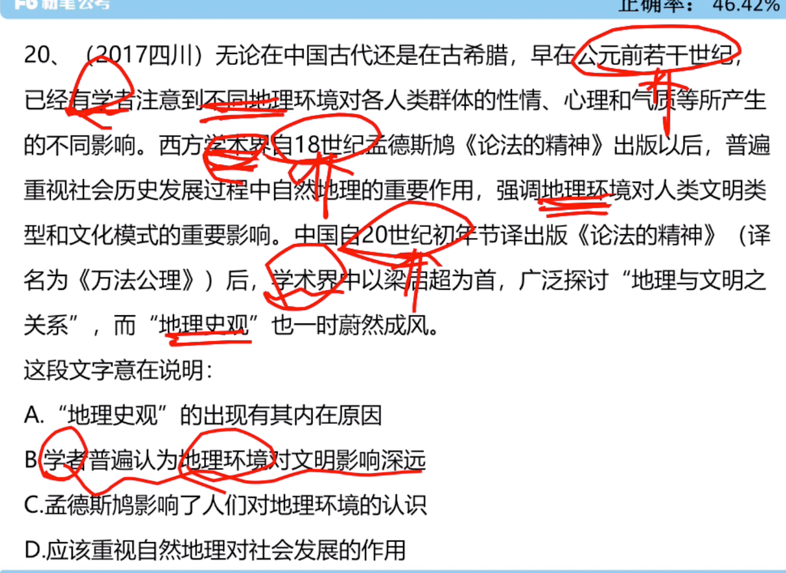                 

- 总结

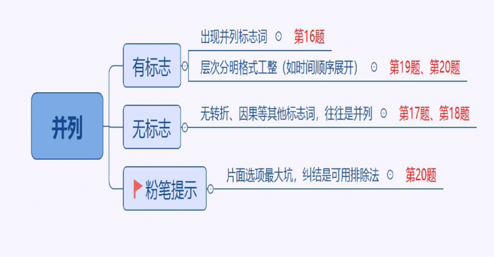

### 高频考点四：行文脉络

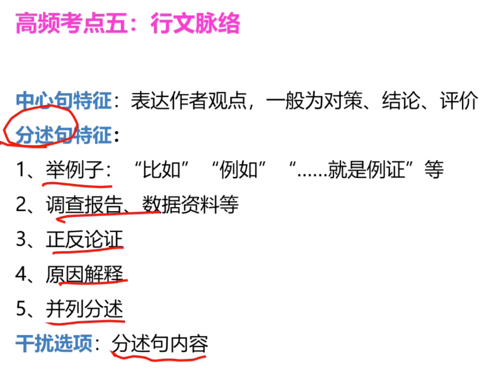

- 例子（文章说的是或许，而d太绝对了。文章中但是这一句最重要，而且主语是记忆。）

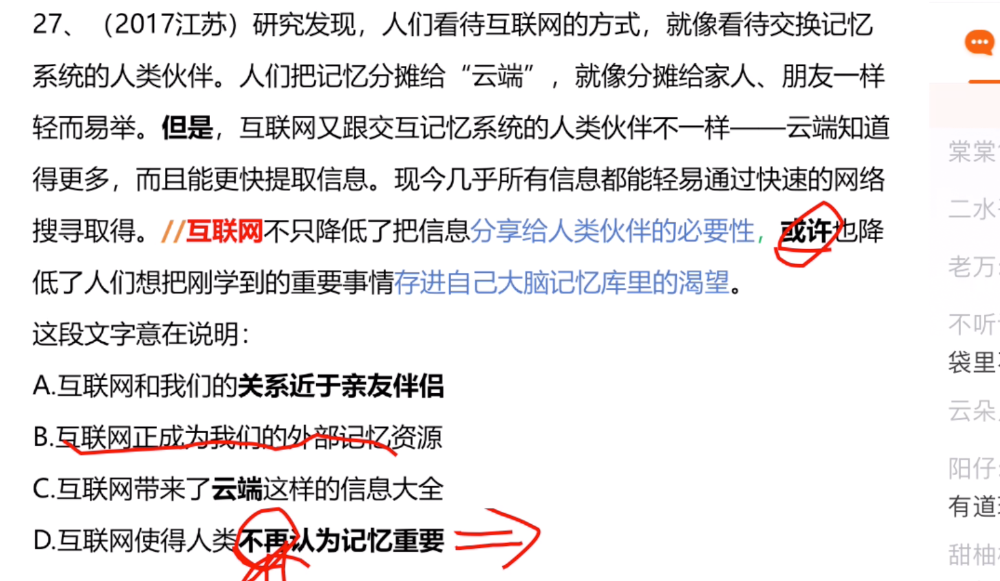

- 总结
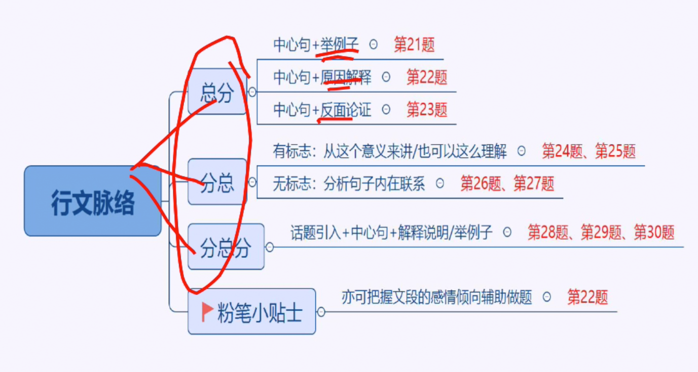