### 高频考点六：主题词

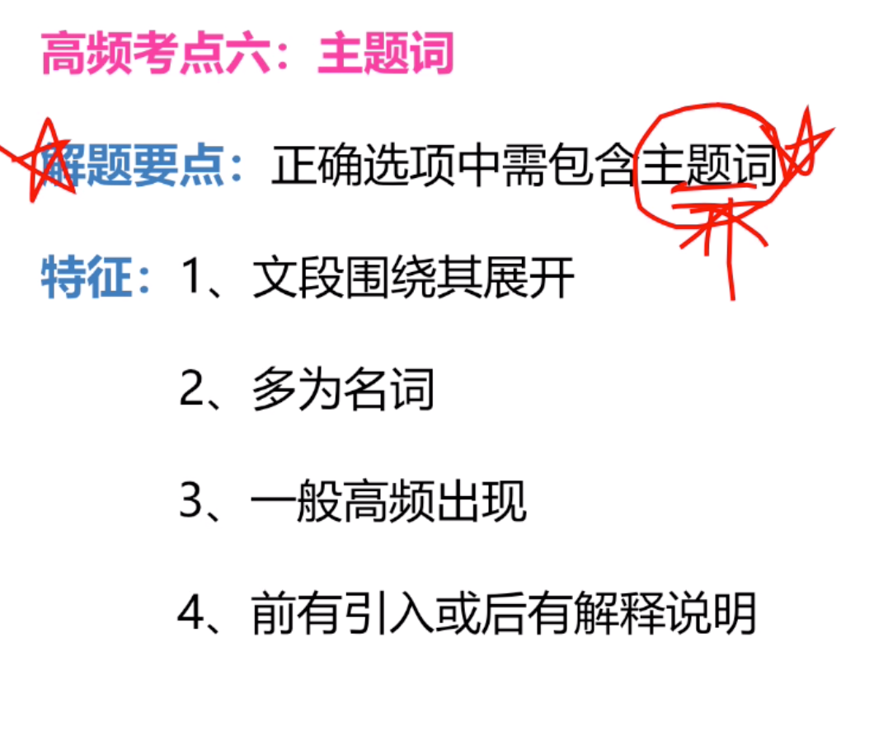

- 例子（文章通过对比强调反乌托邦。而d项则应该是并列关系才对。但文章不是。）

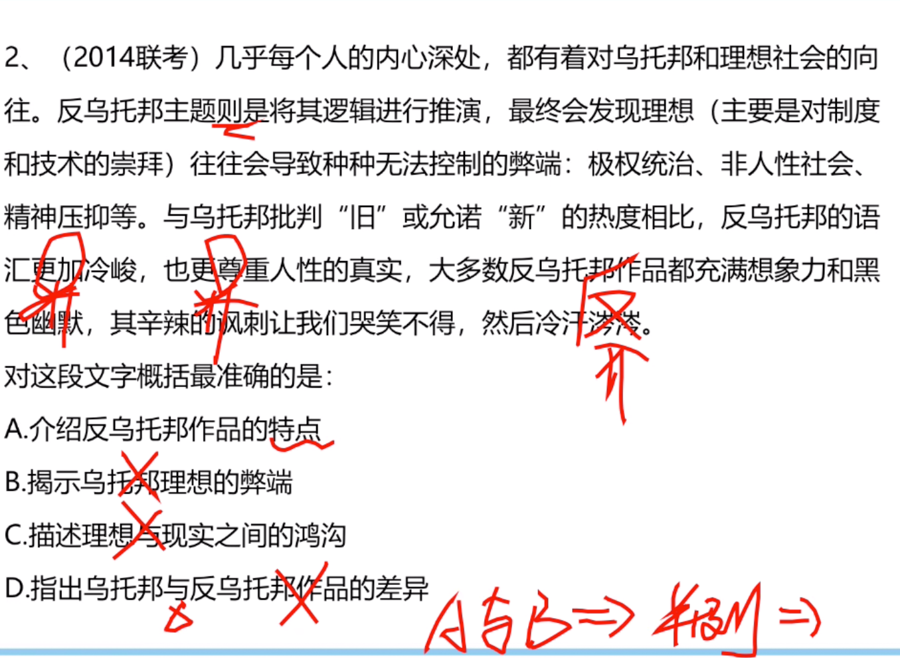

- 例子（要注意文段层级关系。1.转折之前非重点 2.转折强调文章可能不会轻易告诉你同义替换句，需要你理解.这道题选b）
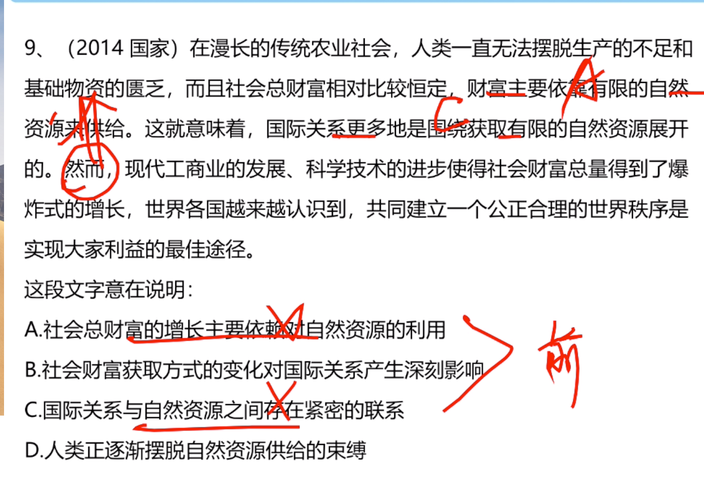

- 总结

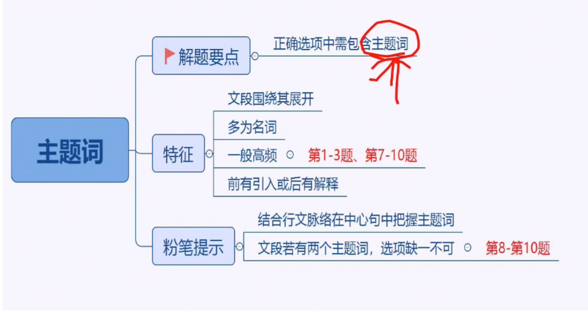
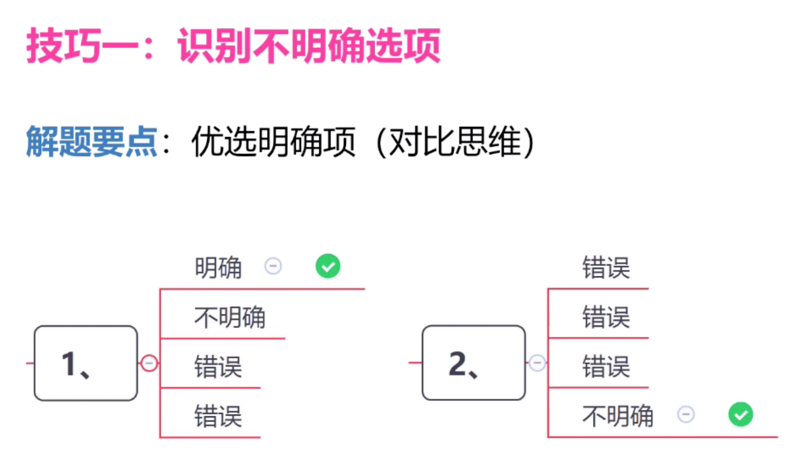

- 技巧
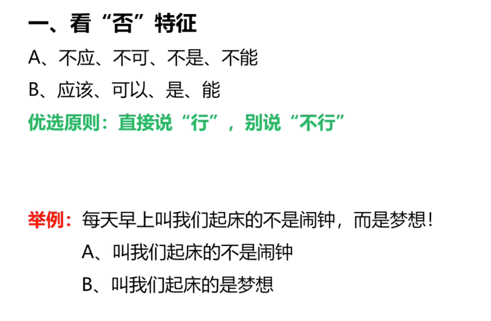

- 例子(提出问题后，又从反面提出了对策。问题不重要。对策重要。选C)

- 技巧
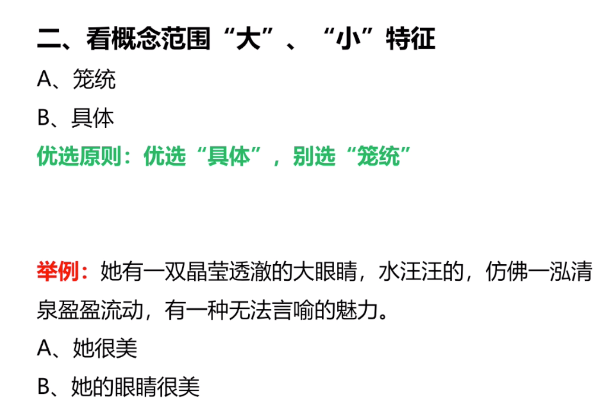

- 例子(有分号不一定答案是什么和什么，前面是审时度势后面是当机立断。a包括更全面。b不太准确。)
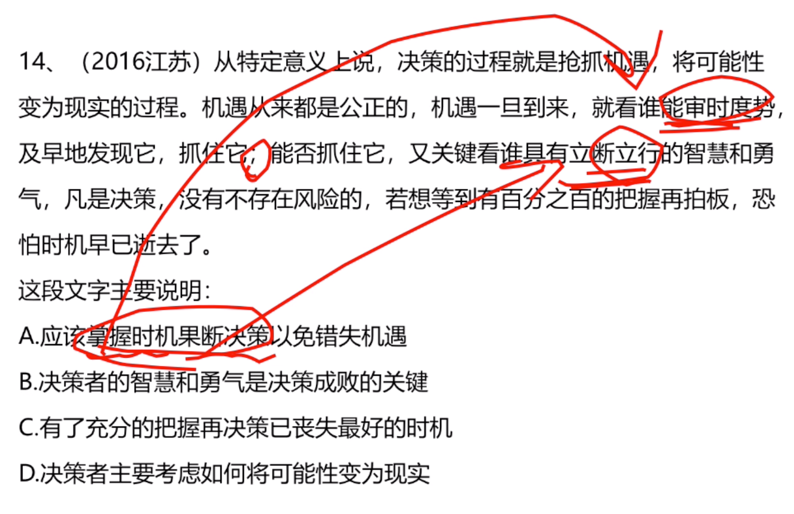

- 总结
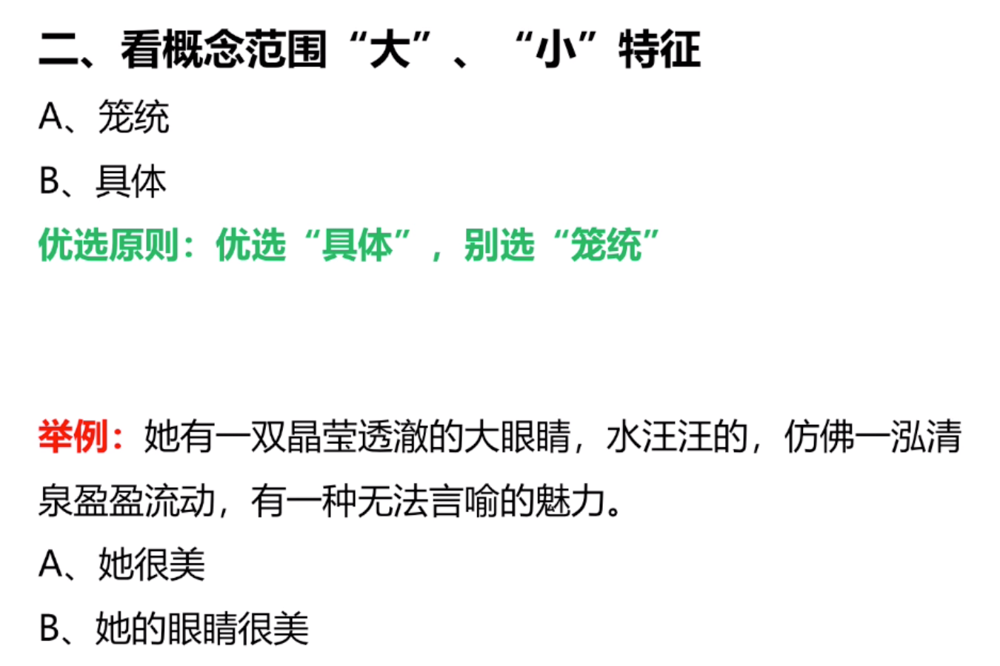
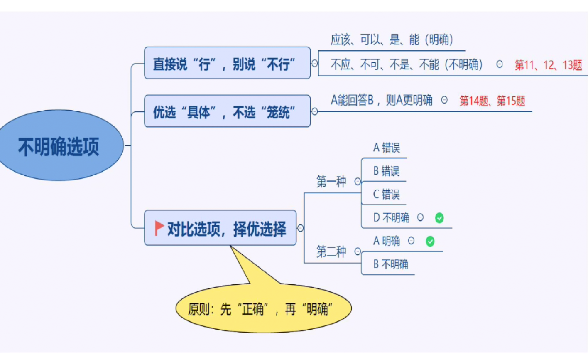

- 方法2：反推法

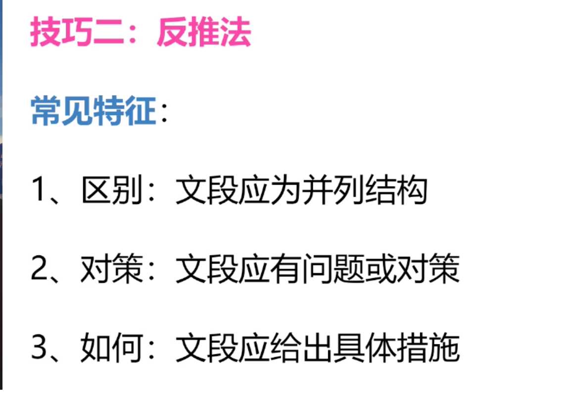
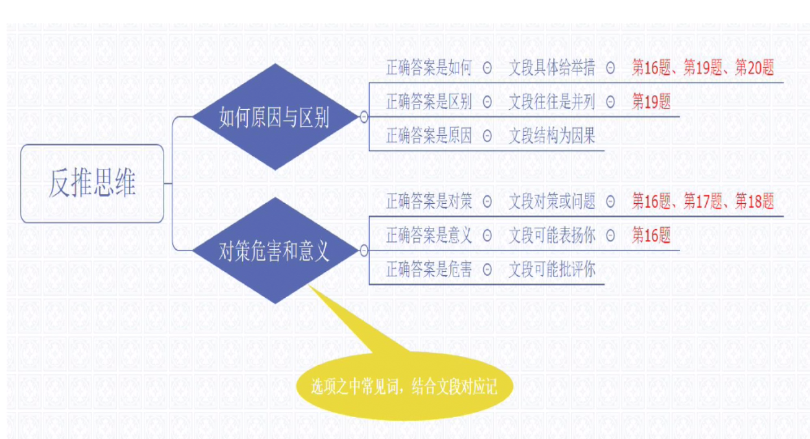

### 细节判断题

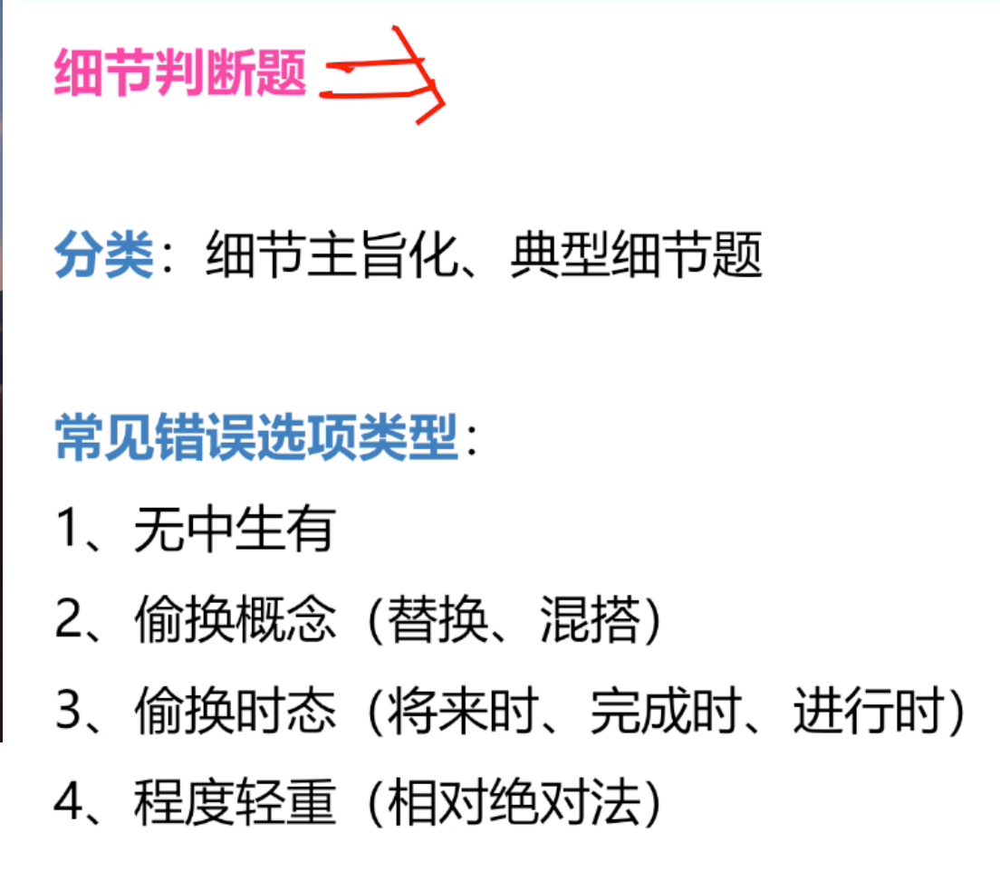

- 例子（选D,春秋是秦朝。史记是西汉）

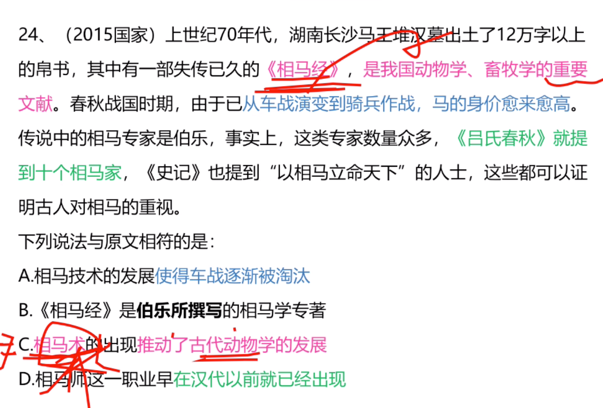

- 例子

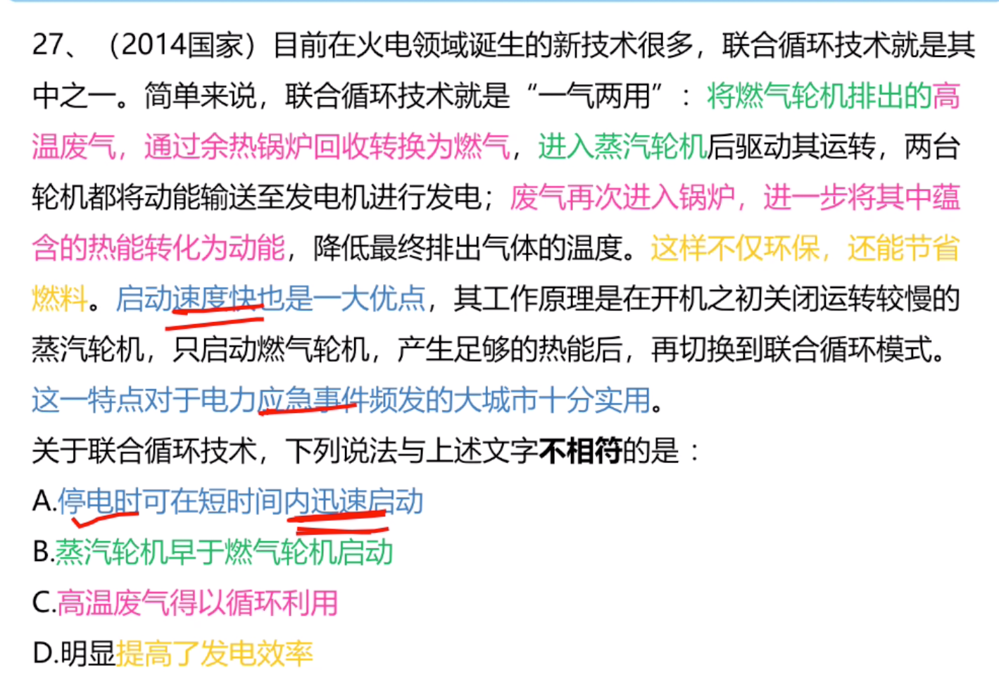