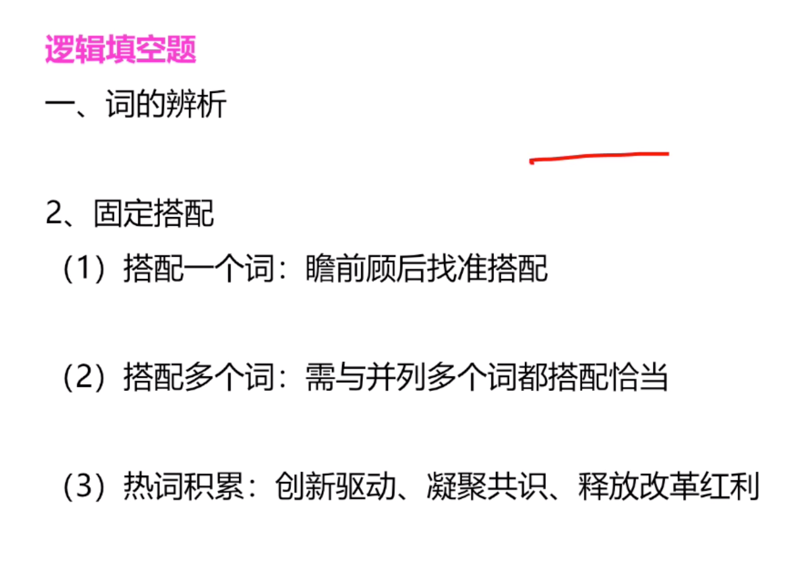
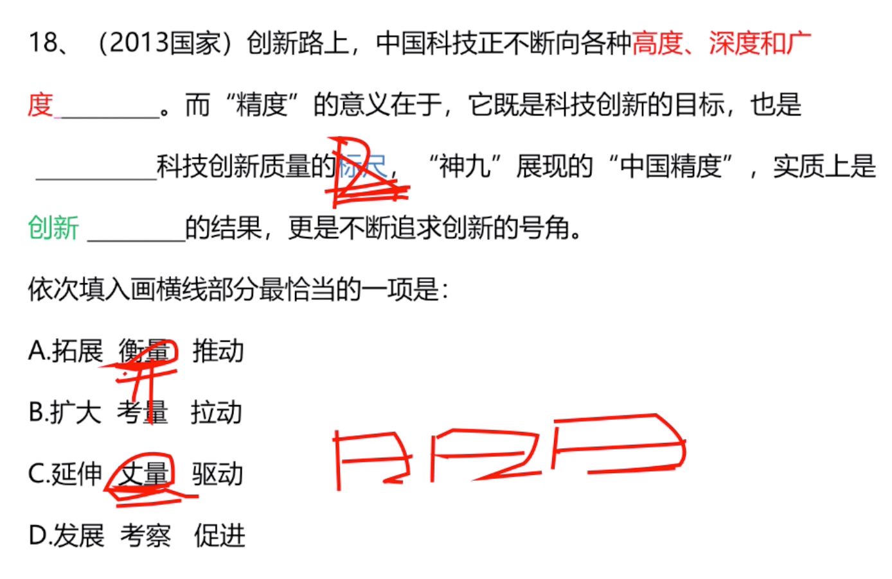
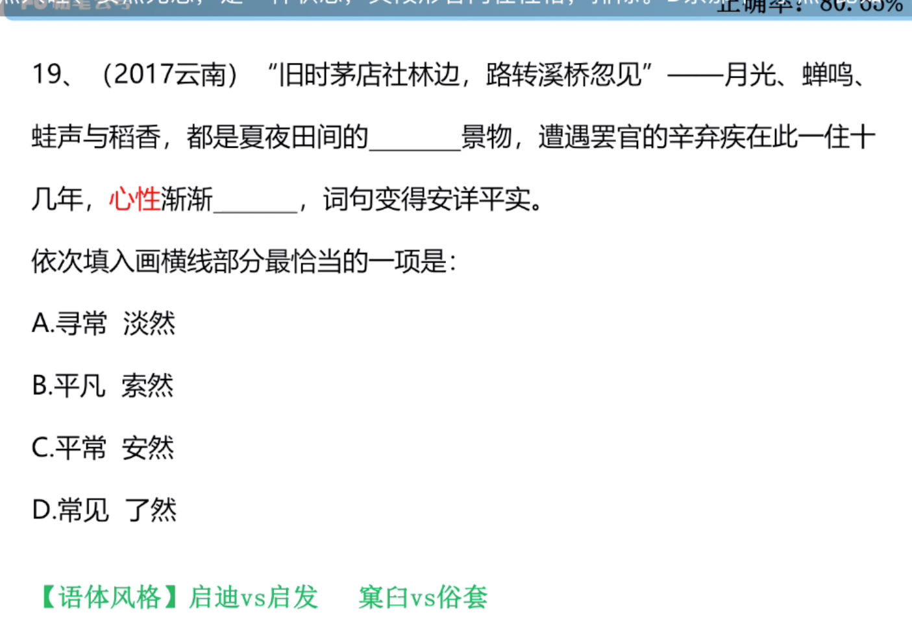
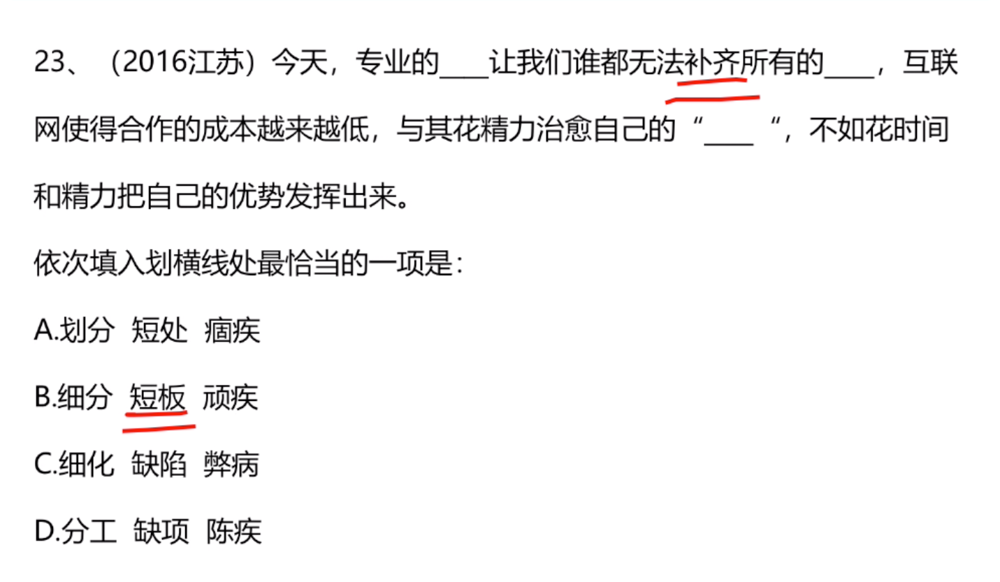
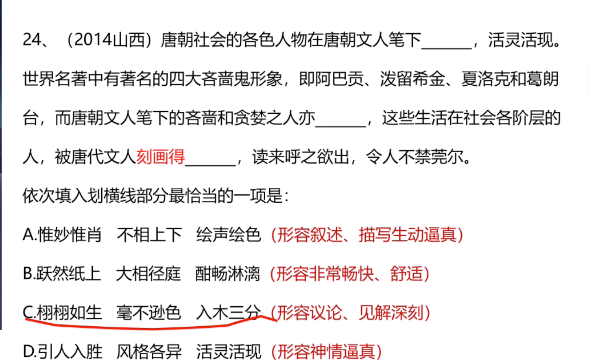
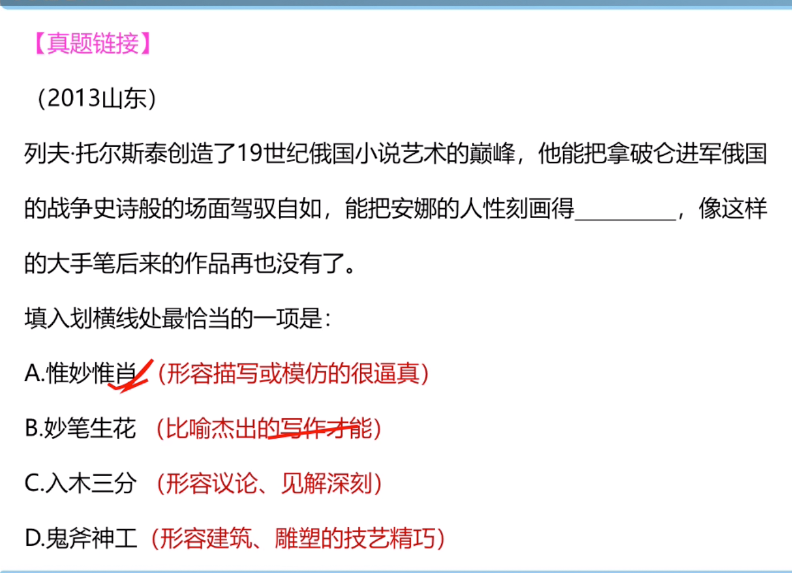
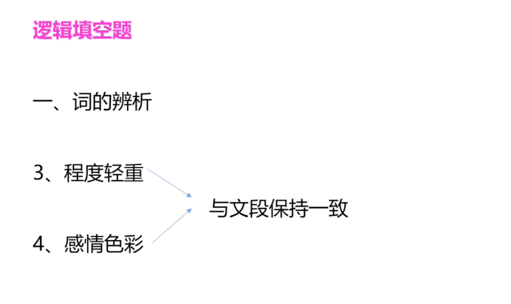
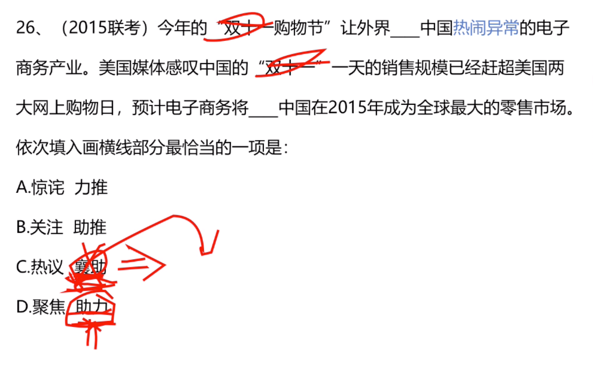
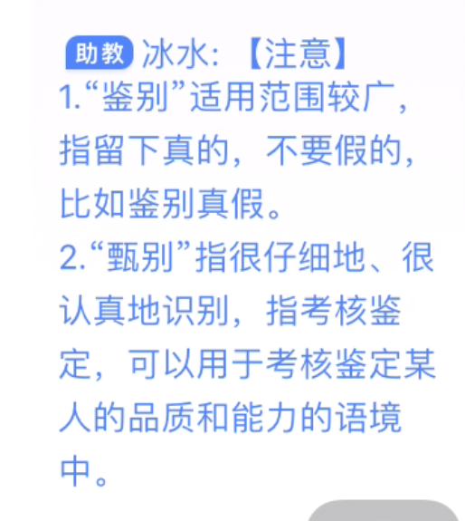

### 语句排序题


### 高频考点二：确定捆绑集团


### 高频考点三：确定顺序


- 例子（先有生态再有生态红线）


- 总结


### 语句填空题


- 例子(主题词是纪检监察干部)


- 总结


### 逻辑填空


(拆字组词：抑制，制约。=》压抑，约束)

- 例子（结构的平稳，情绪的稳定）


#### 搭配



- 例子（衡量标准，丈量标尺。（一寸一尺一丈->丈量））


- 例子


```
形容性格用淡然比较好。安然无恙。索然无味不行。还有口语化表达，选A比较合适。
```

- 例子（因为细分才不会补齐所有的。补齐是个物体所以选短板。）






```
刻画的入木三分
大自然的鬼斧神工

```

### 词的辨析



- 例子



```
惊诧于...

襄助：书面（从旁协助）

贻笑大方：被内行人笑话
```



