## 第三章 定义判断

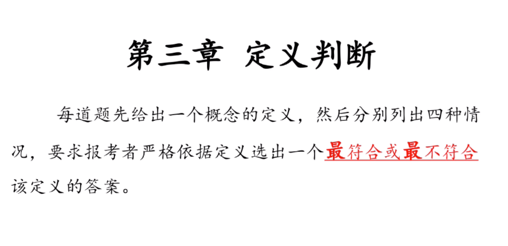
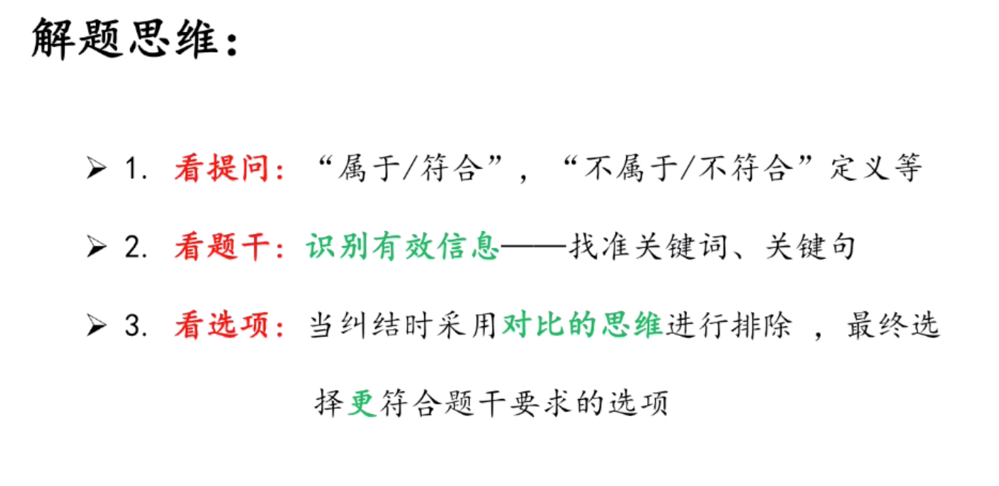

> 考点1：快速识别有效信息

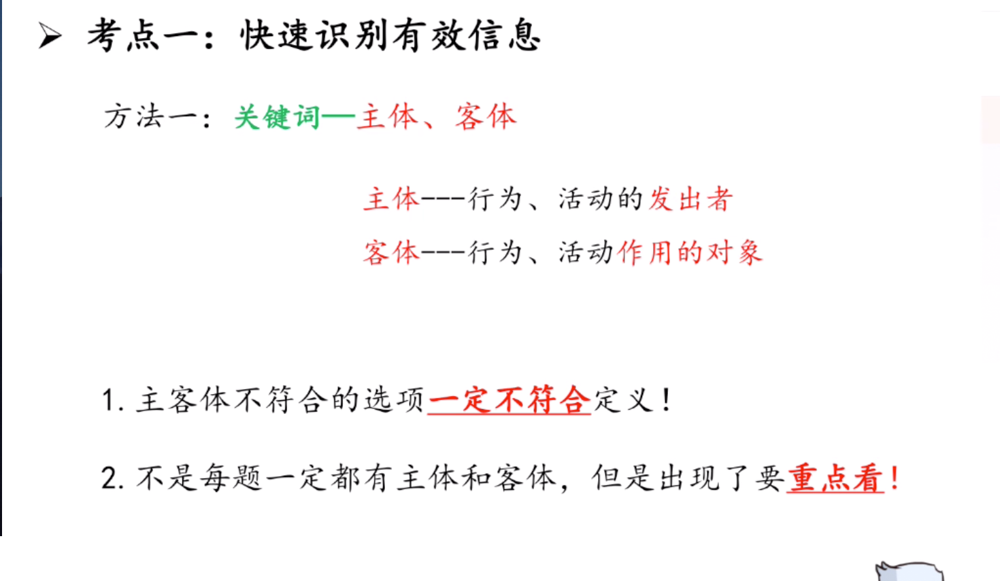

- 例子
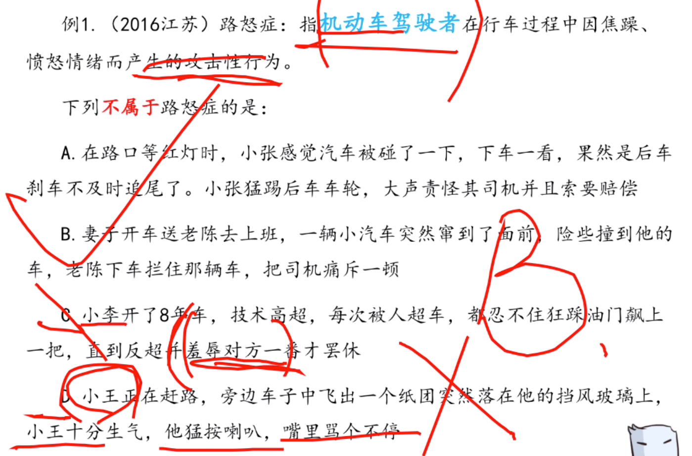
```
妻子开车，不是主体。b排除
```
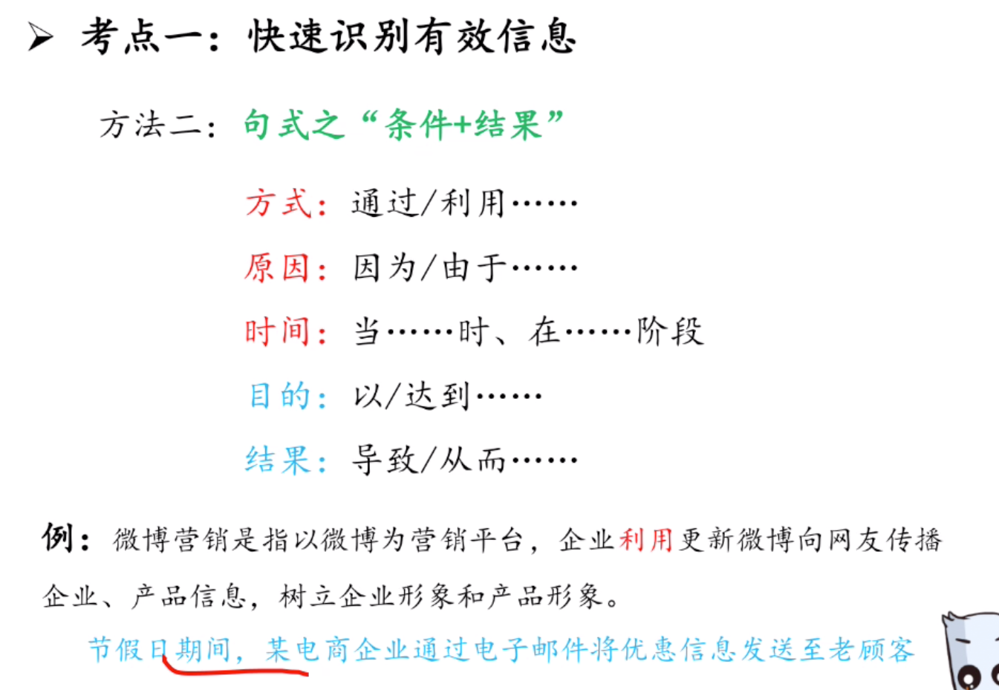

- 例子
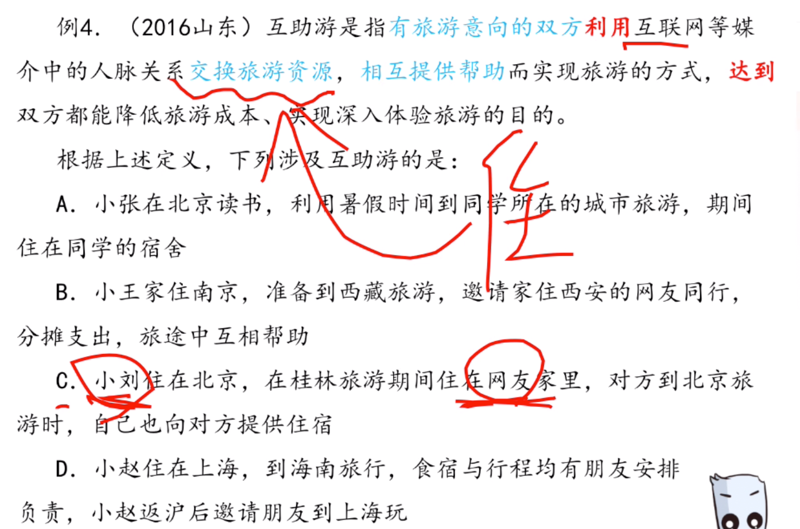
```
B选项只是aa，没有交换旅游资源
```

- 例子
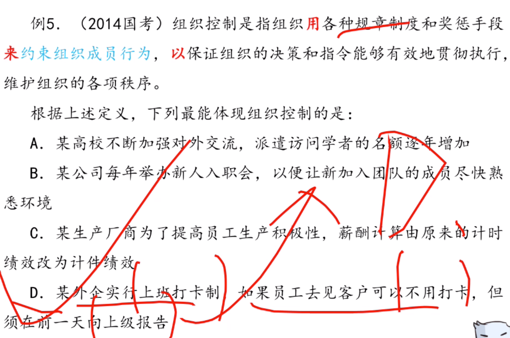
```
A,B,C都没有说明约束行为是什么
D项约束行为可以不用打卡但是要向上级回报
```

- 例子

```
A，没有多重身份，他就是一个北京打工的湖北人，没有别的身份
B,梦里的角色不是真的角色
C,自己将自己的角色混淆，而不是将别人的角色混淆
D,是对的，分不清自己是在工作中还是以为父亲的角色
```
> 方法三：1.优先看到概念所在那句话的句号，后面暂时不看


```
选B
```

- 例子
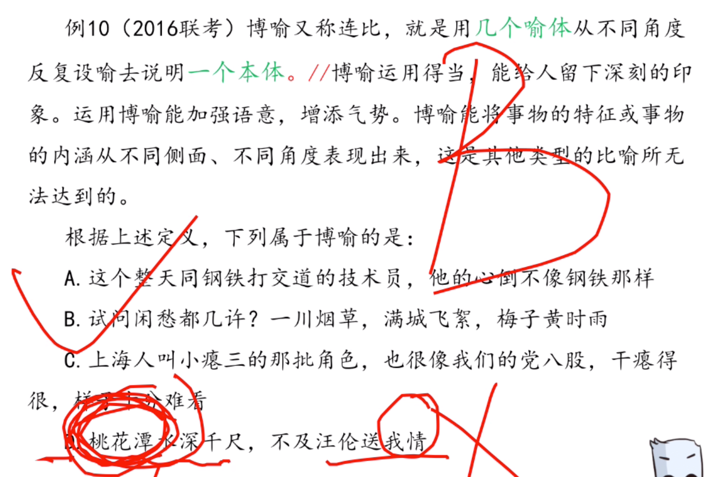

> 方法三：2. 注意阅读补充说明-即，也就是说


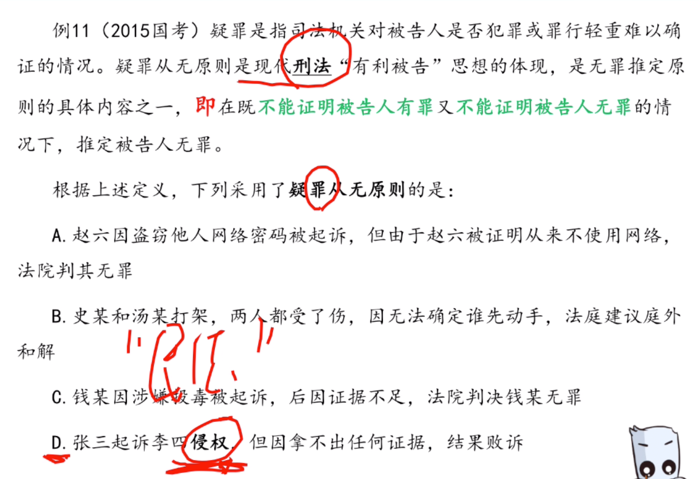

```
D选项，侵权是民法
```
- 例子

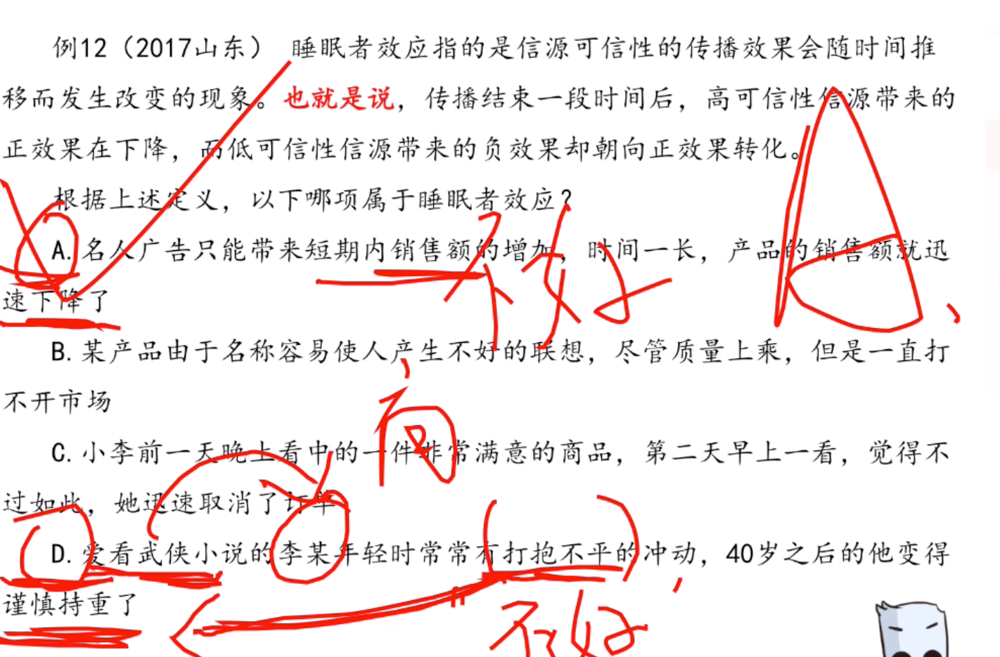

```
C,没有信息源头
D，变化不一定是正效果下降，可能是变得更稳重。正负效果说不清
```

> 多定义

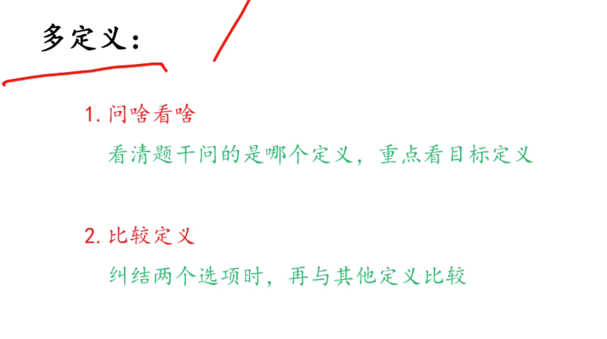

- 例子

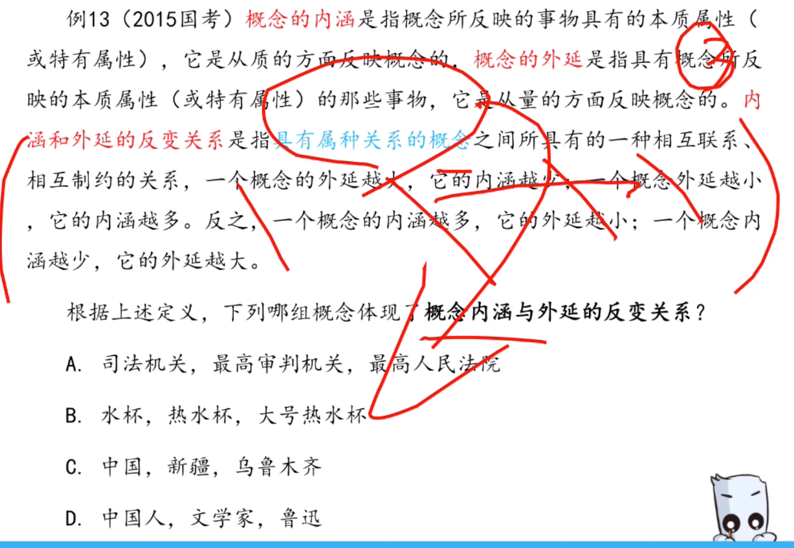

```

A:最高审判机关 = 最高人民法院

不是种属关系
```

## 考点二 同构选项排除法，一般是不属于

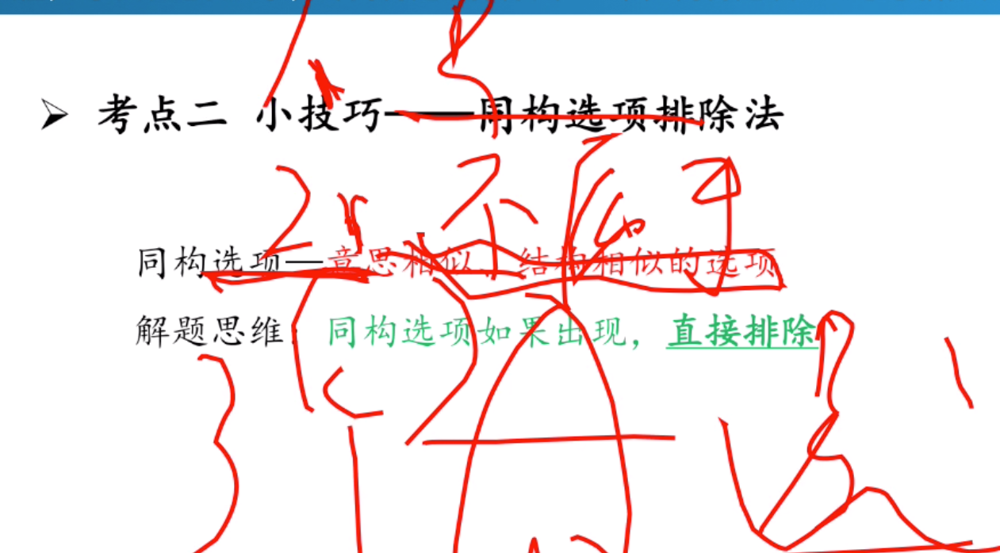

- 例子
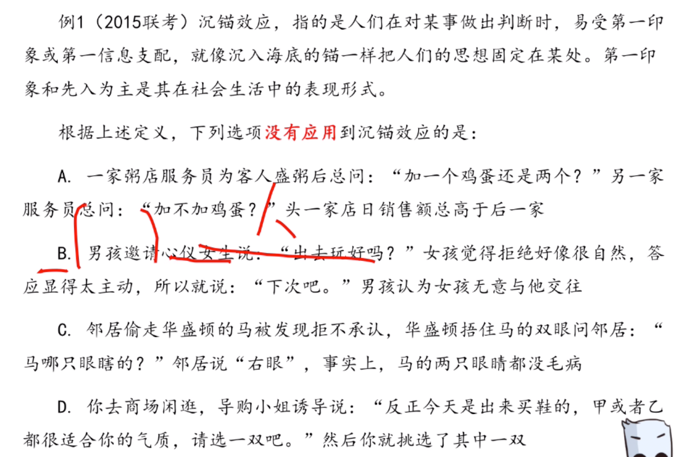
```
其他都可以选，而选一，但是B应该问：去看电影还是去吃饭
```

> 总结（方式目的原因结果时间）

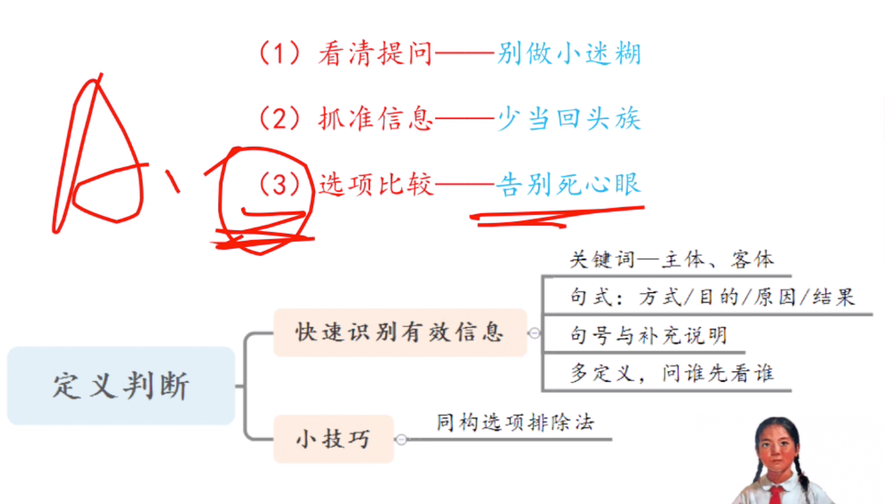

- 例子（不知道题干说啥，就看选项）同构
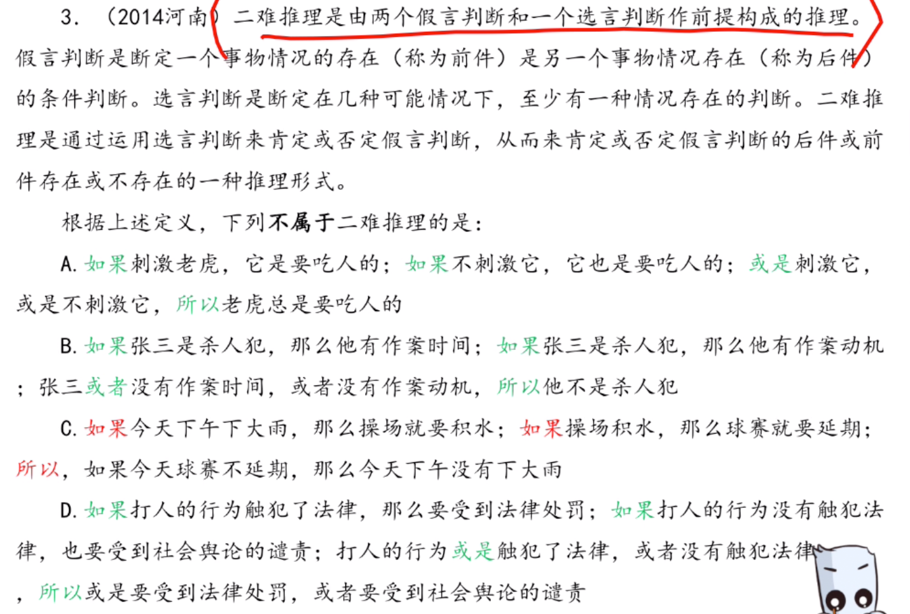

```
两个如果一个或者
```