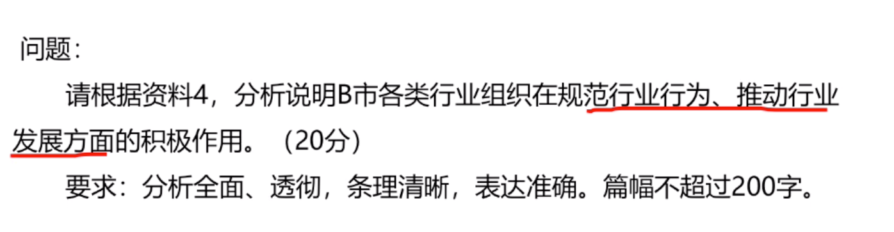

## 数量关系题型


### 代入排除

- 什么时候用


- 先排除再代入


```
如果问求最大的，那么将选项中最大的数依次代入。求最小的同样。

```

- 例子


```
1.首先年龄差3排除A，D
2.王比李大三岁，然后排除C
```

- 例子


```
1. 假设丁有16，丙+丁 = 34，而丁是最大的，则丁一定大于17.所以排除A

2. 代入25，如图所示，没有满足丙大于乙
```

- 例子


```
带A,结果就是选A

方法2：因为个位+千位 = 6

而千位又比个位大2，如图，选A
```
- 总结


### 数字特性（奇偶特性和倍数特性）

- 奇偶特性（只研究加减乘法）


- 奇偶特性（不定方程首先考虑奇偶特性）


```
2是质数中唯一的偶数
```
- 什么时候用


###


- 例子




```
1. 通过奇偶性可得，母亲的年龄为奇数
2. 用代入法，
```
- 例子


- 总结


###

