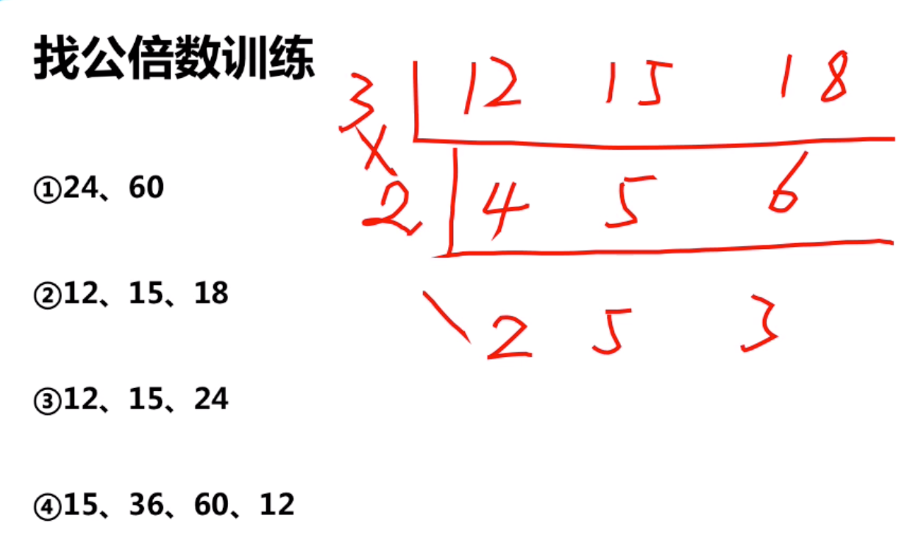
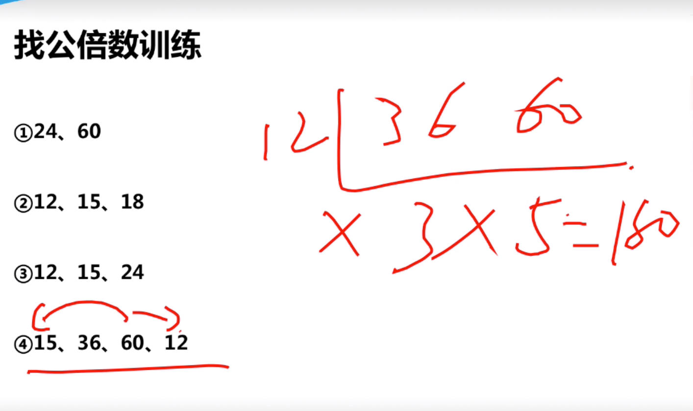
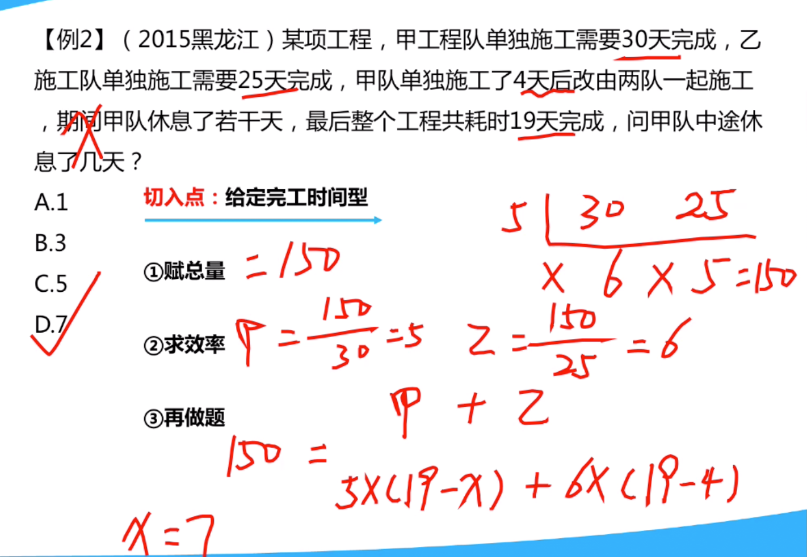
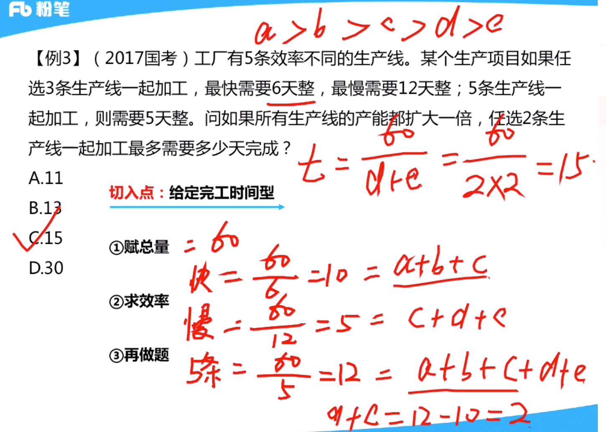
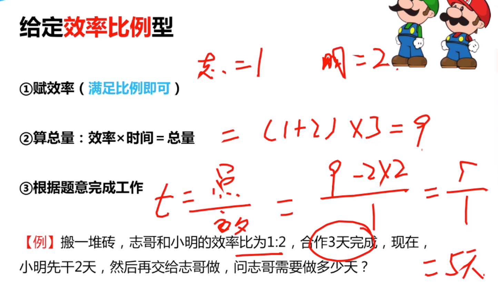
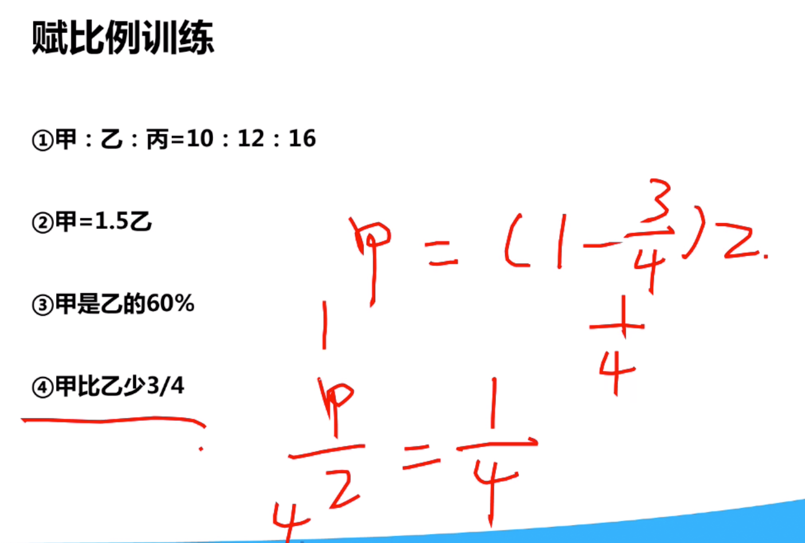
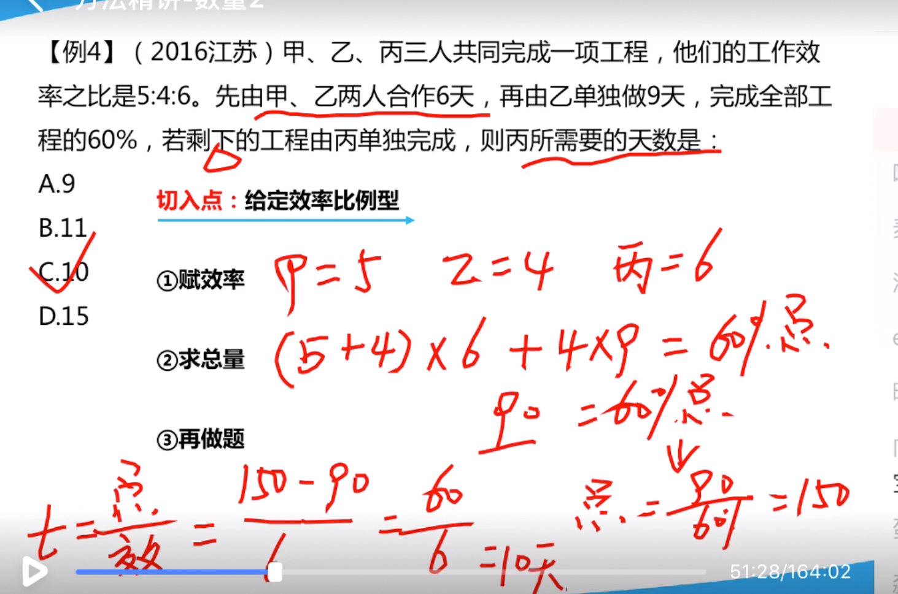

## 工程问题


### 给定完工时间型





```
15,12可以不管，因为他们是60，36d的公倍数
```

- 例子


```
假定工程量为12
```

- 例子



```
求公倍数 150
```

- 例子



```
1. 6,12,5的公倍数为60

2. 设五条生产线的效率为：a>b>c>d>E

3. 如图计算

4. 相减获得d+e

5.求出时间，因为效率扩大了一倍，所以60/2/2 = 15

```

### 给定效率比例型





```
1. 求总量150

2. 求丙需要做的剩余量

3. 求天数

```