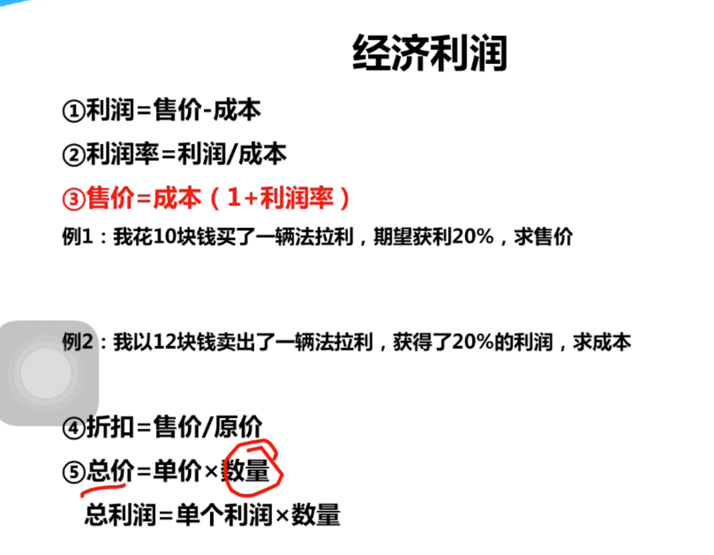
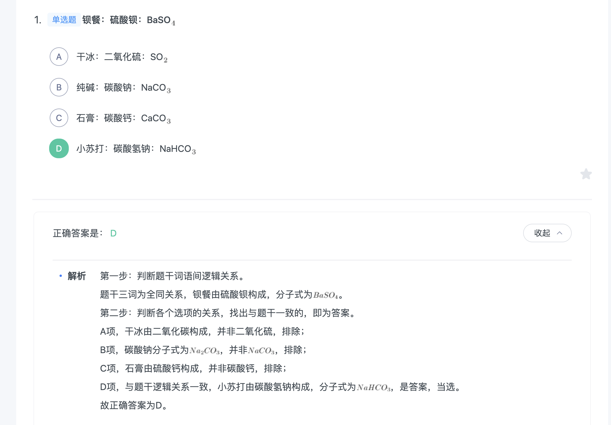
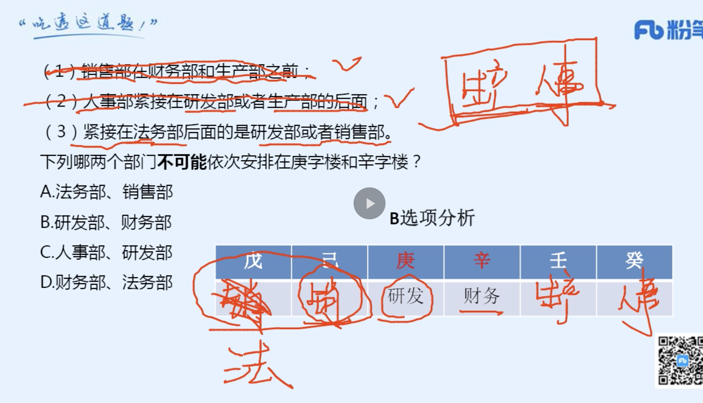
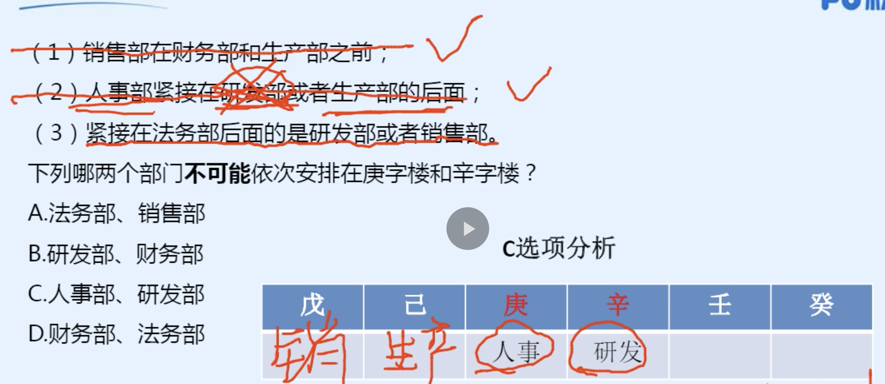

### 经济利润(简单做，难的放)




- 例子（尾数法看选项）


- 例子


```

1. 求出甲乙的原价
2. 算出一共省了多少钱的式子
3. 根据奇偶性，发现x为奇数
4. 算出x,y,求出文章问题
```

- 例子


```
1. a+b为一定值的时候，当A=B时，A*B最大

2. 根据题目可知，A：1.1+1.2 = 2.3
B:1.15+1.15=2.3 C：1.12+1.18 = 2.3

3. 可求

```

- 小技巧


- 例子


```
1. 削x（左右两边相减）
2.分母化同求得x
3. 由下图继续求解
```


### 分段计价


- 总结


### 排列组合以及概率

- 分类与分步


```
1. 组合，对结果没影响为c72

2.排列，对结果有影响A72

```


```

c10,8 = c10,2
```

- 例子


- 例子

```
1. 选人没顺序

2. 分类相加

3.求和
```


- 例子


```
1. 先分类

2. 再选人

3. 再排名

（如图：从左到右）
```

### 枚举法


### 特定题型


```
（林涛不在排头那么就先排林涛）

1. 先干啥再干啥，相乘

2. 先排林涛，再将剩下四个位置分给其他人

```

### 相邻问题（先捆绑再排列）


```

1. 先将两人捆起来A22

2. 1，1，1，2就是四组，再A44
```


```
1. 先捆后排，捆A33,A22,A44

2. 然后排这三个A33

3. 也不用算，结果就是在1000以上

```

### 不相邻用插空法


```
1. 先将不相邻的进行排列，A33

2. 再根据排列出的空隙，插空。A42

3. 按顺序相乘
```

- 例子


```
1. 首先，先分类，

2. 1男3女的情况：先选人，再排列A44

3. 2男2女的情况：先选人，因为不让男生相邻，所以先排列女生，A22,再插空男生A32

4.将所有分类相加

```

- 同素分堆（相同的元素分几堆）


```
1. 分3个小盆友也就是插两个板子

2. 然后7个苹果有六个位置可以插板子

3. 并且两个板子换位置其实不影响分给三个小朋友

4. 所以是C62

```


- 例子




- 不用想太多，只用掌握方法去做就行了

- 例子



```
1. 改题，15个苹果，至少每人分3个
2.就是 每人分两个+至少一个
3. 15- （2*3）= 9.
4. 插空取板
5. C82

```

### 错位重排


- 例子

