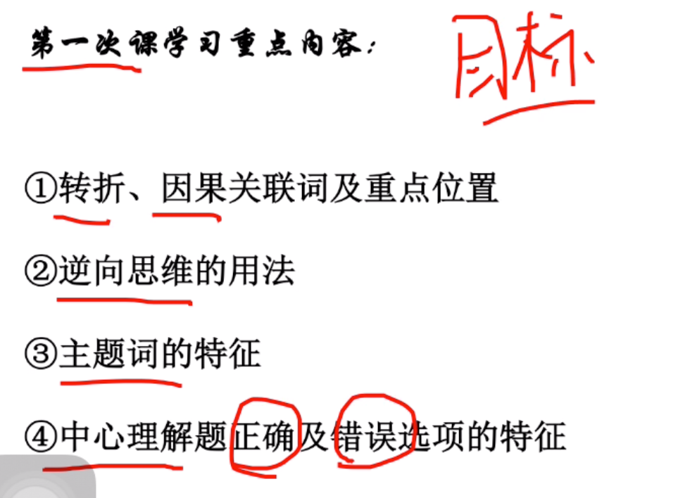

## 片段阅读
----
> 解题顺序

提问-文段-选项（带着问题去读文段
）

### 第一节 中心理解题

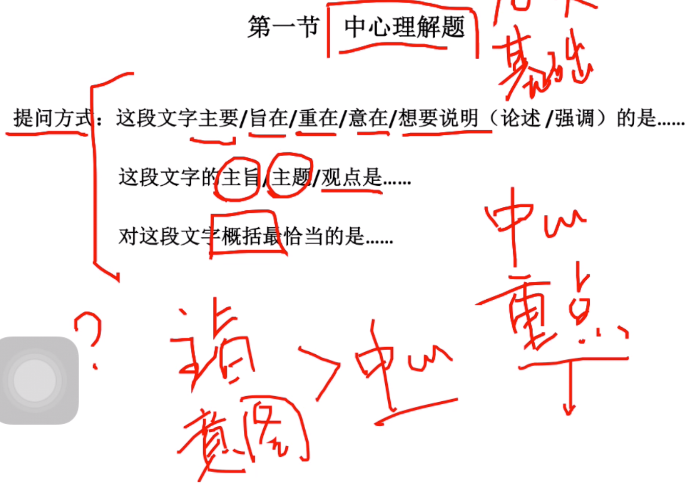

- 解题思路


- 提示
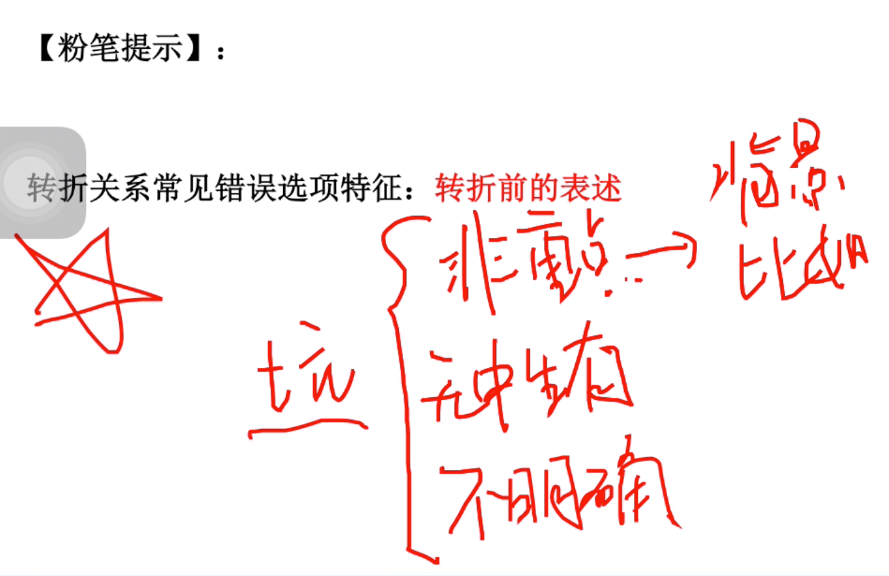

- 例子


```
却后面的主体错了。
```
- 例子
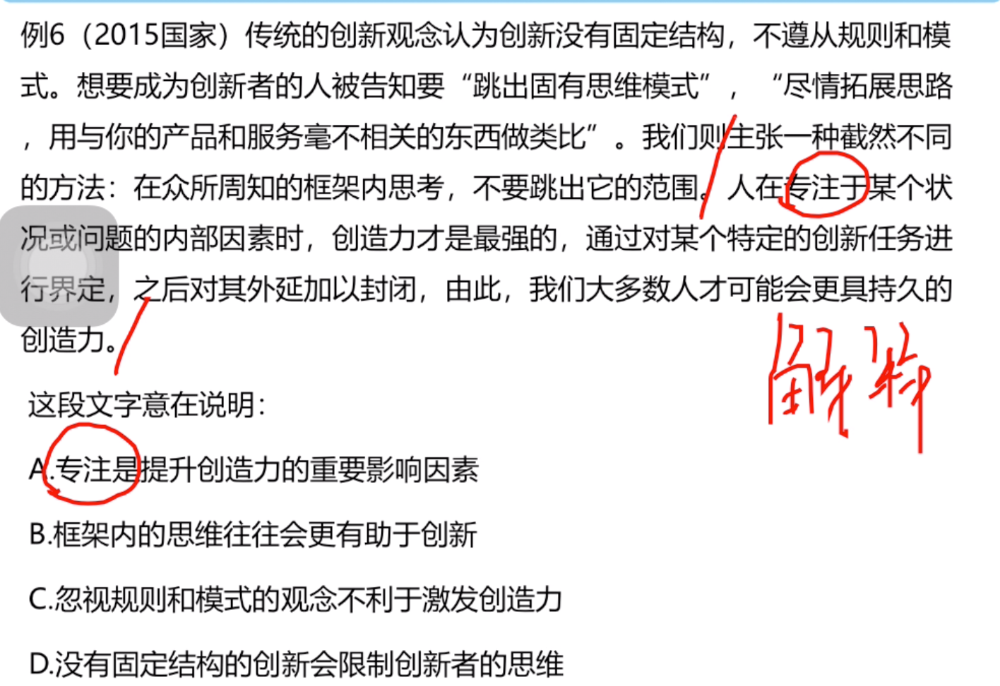

```
在众所周知的框架内思考，不要跳出范围
```

- 逆向思维解题

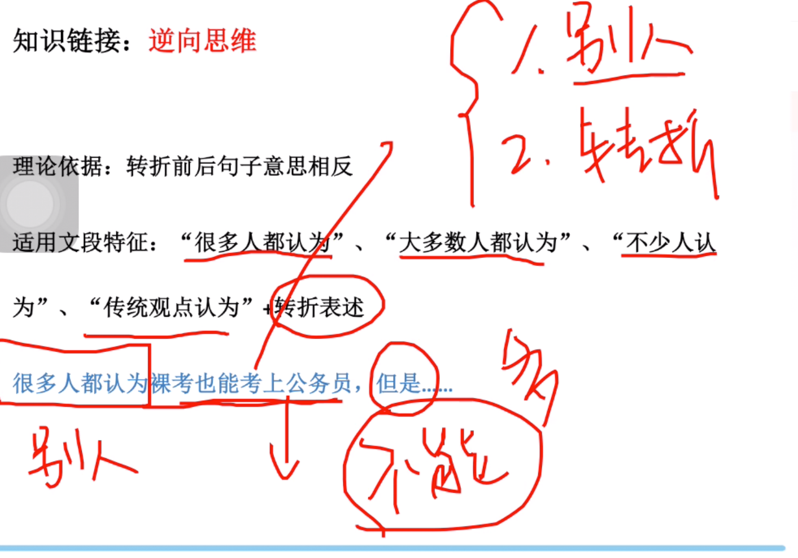

- 总结
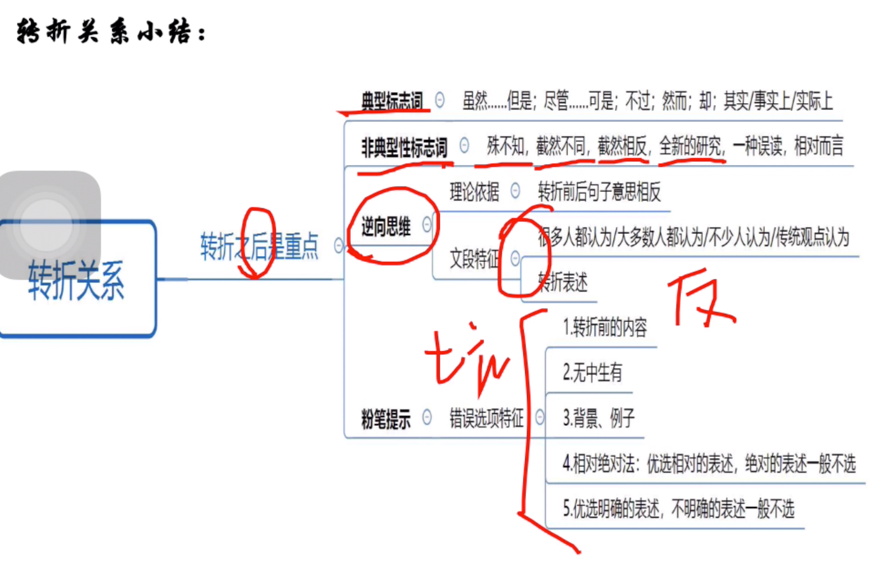

> 主题词

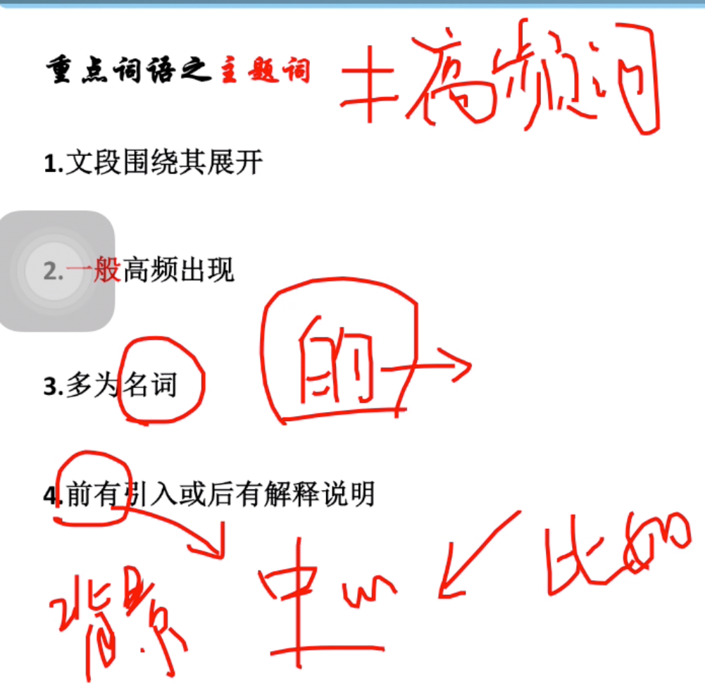

- 例子
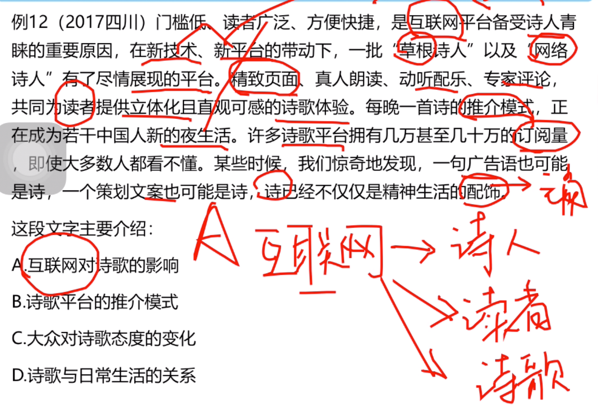

- 总结

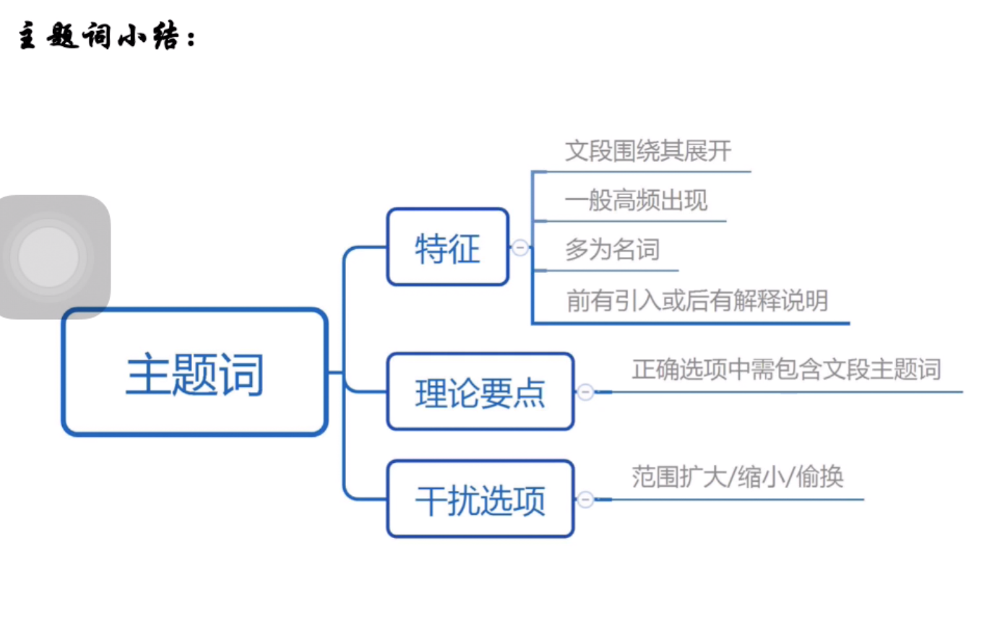

> 因果关系

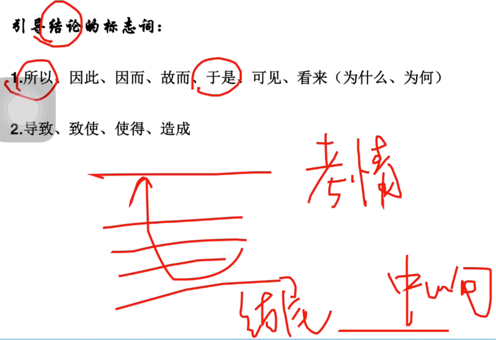

```
结论是重点
```
- 例子
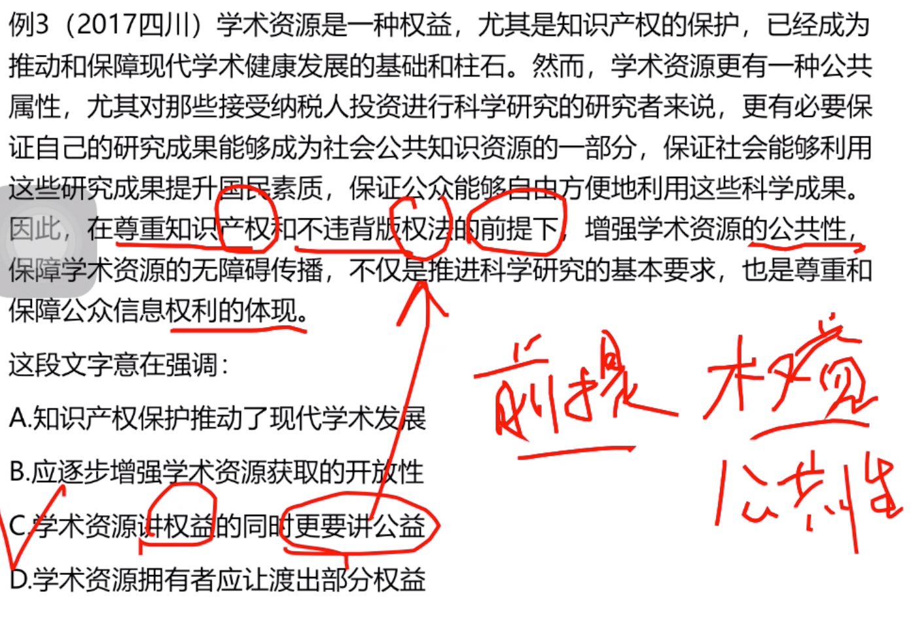

- 总结
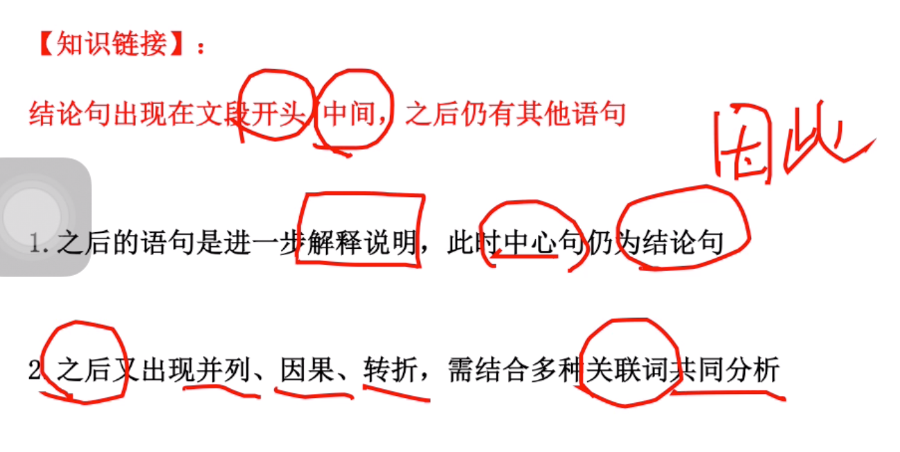

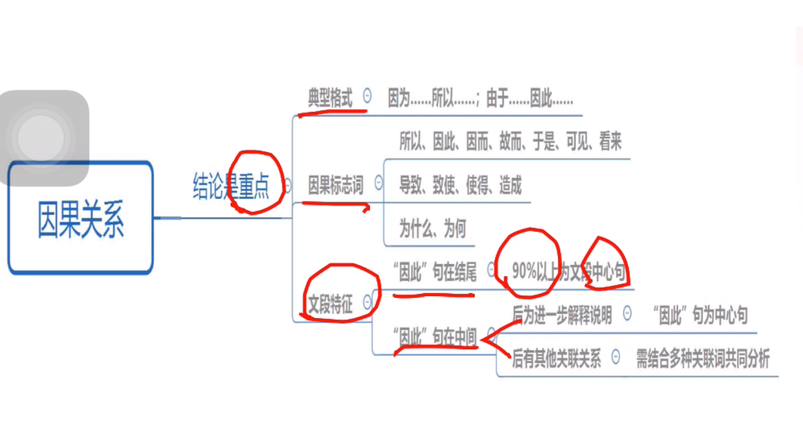
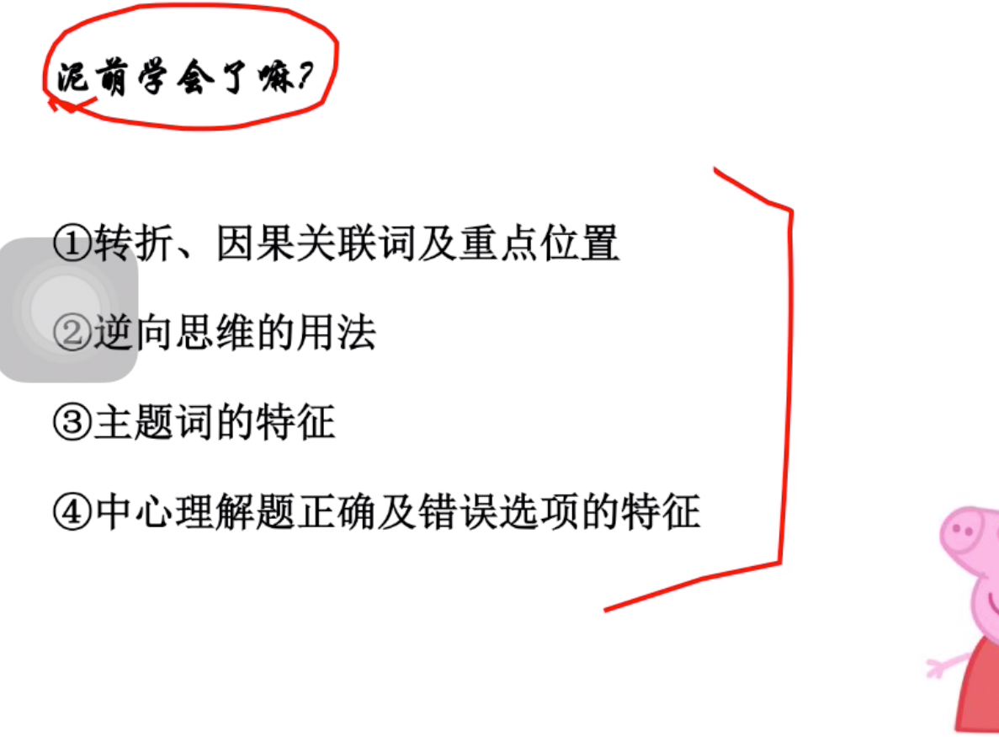

