### 接语选择题


- 例子

```

前文已经说过患病是什么状态
```
- 总结
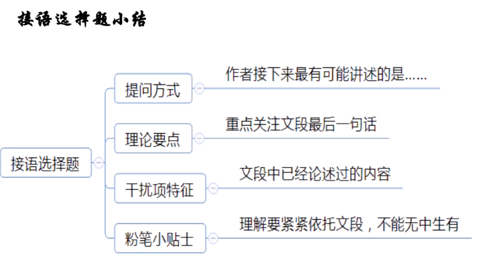

- 例子(关键词一致)
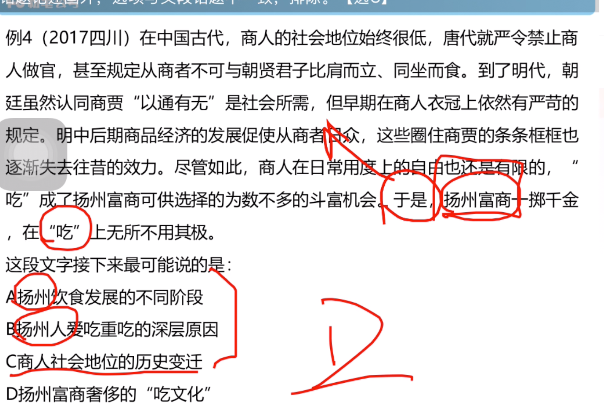


### 逻辑填空


#### 词的解析

> 词的解析
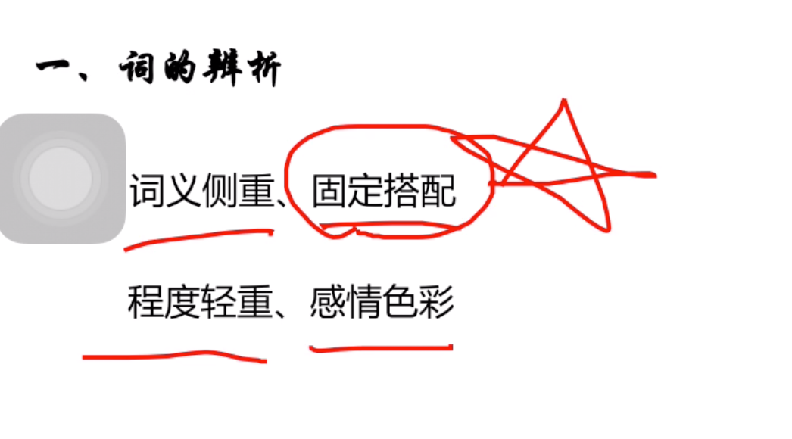

- 词义侧重

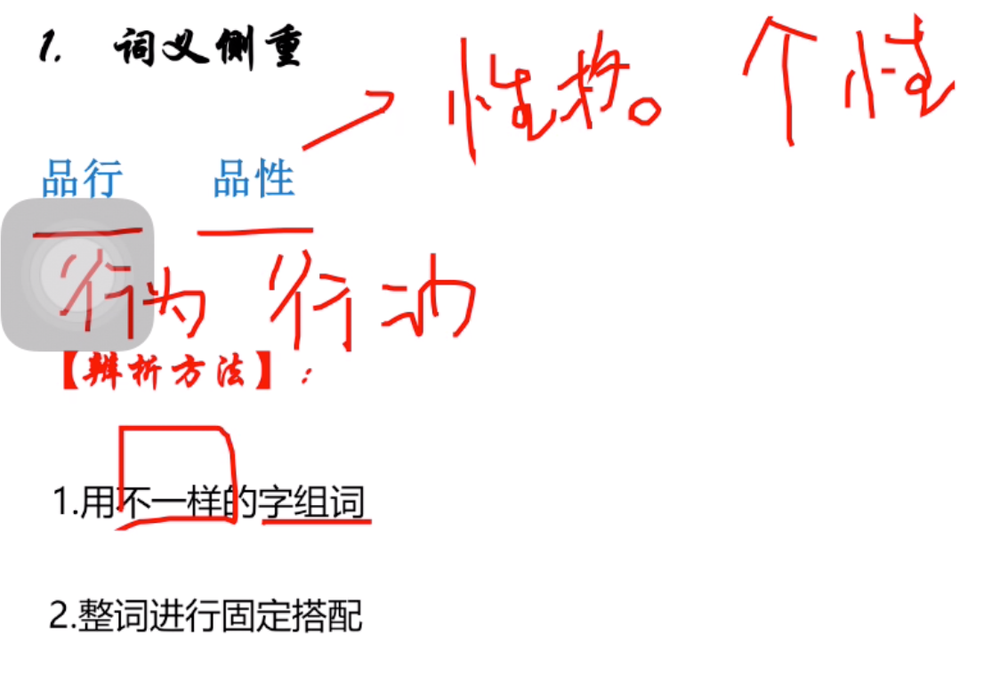

- 例子

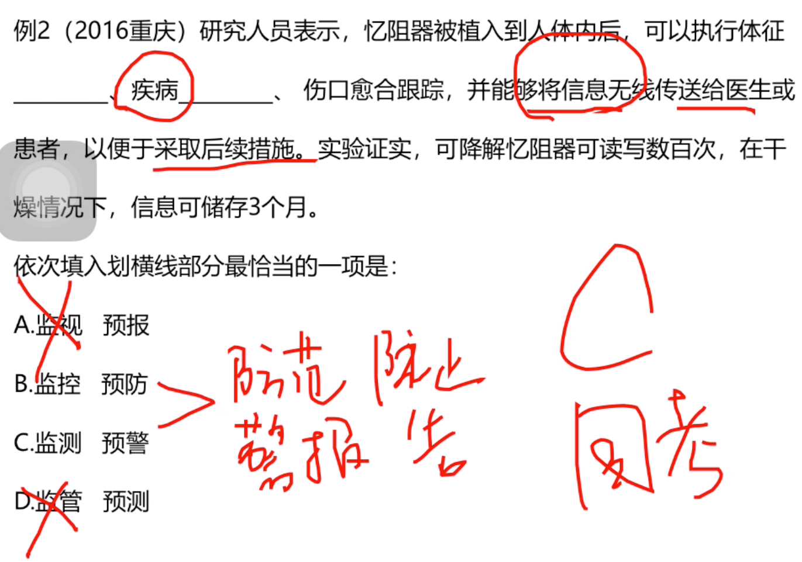

```
异阻器，会发成防范预警的声音滴滴滴

```

> 固定搭配(1. 人物 2. 上下 3. 具体，还是抽象 4. 主动被动)

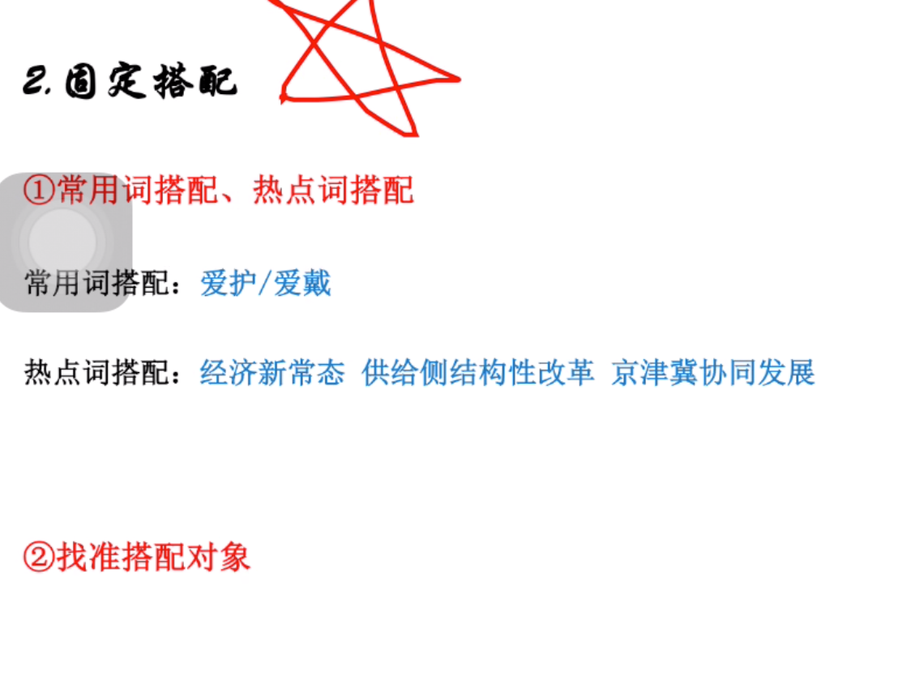

```
爱护：物体、人（上对下）

爱戴：人 （下对上）

```

- 例子（A是物，其他是人）
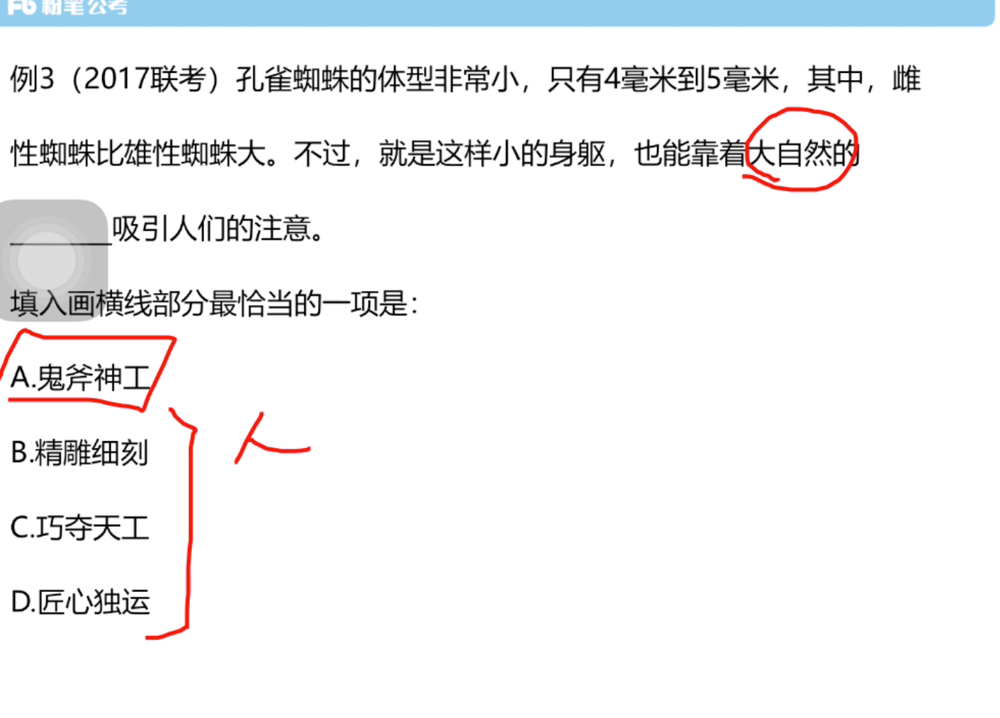

```
有口皆碑：形容人或物有口碑
鳞次栉比：形容建筑物排列很整齐
星罗棋布：形容数量挺多
不计其数：多到数不过来。
望其项背=望尘莫及：追不上赶不上
契合 = 合契 = 一致的意思
嬗变：指根本性质变化
善变：经常变化

```

```
1. 积累
2.瞻前顾后看文字

```

> 程度轻重

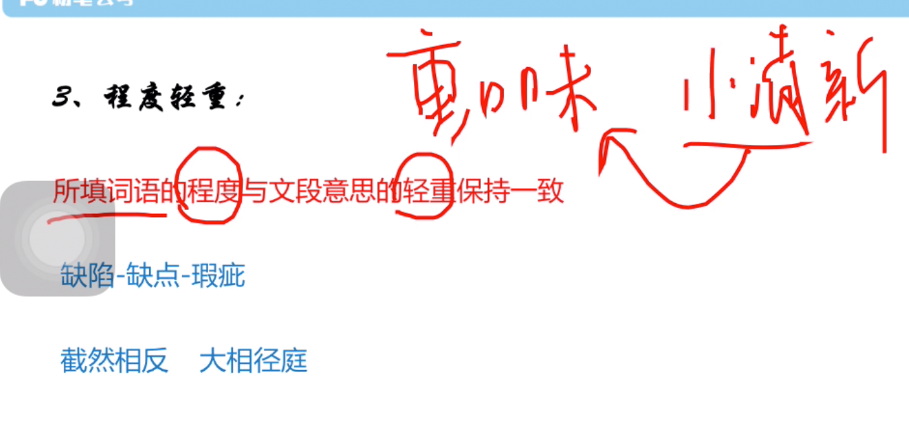

```
左支右绌=捉襟见肘=表示应付不过来
贻笑大方：被内行人笑话
```
> 感情色彩

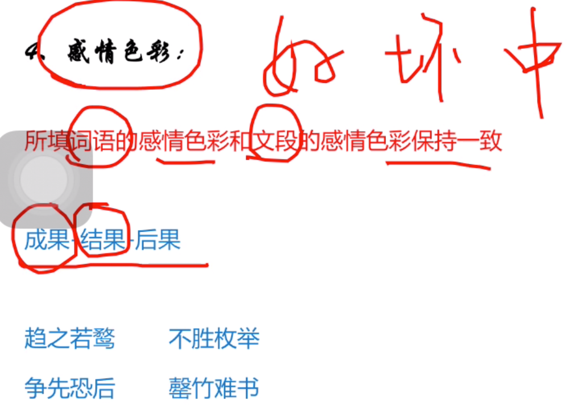

```
注脚：注释
```

- 双引号，形象化表达的作用

- 总结
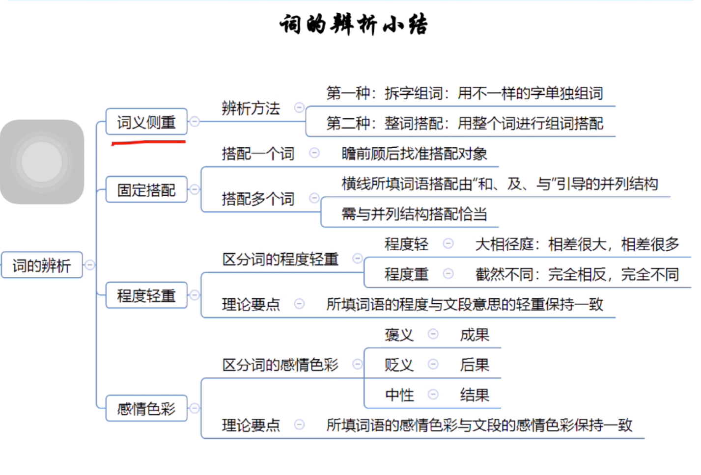

## 语境分析

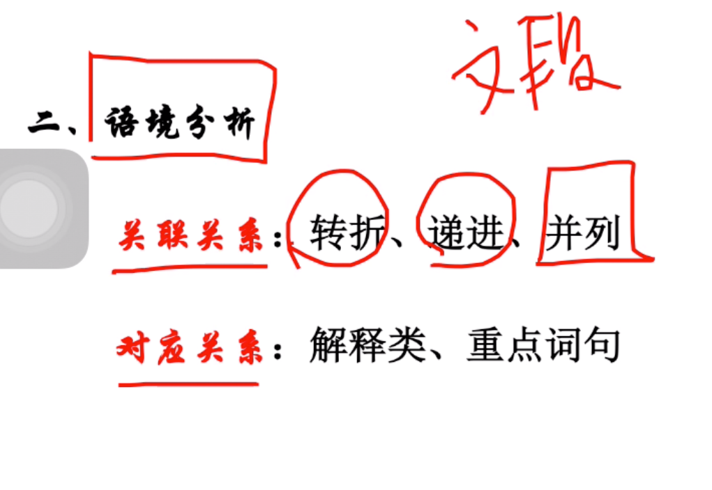
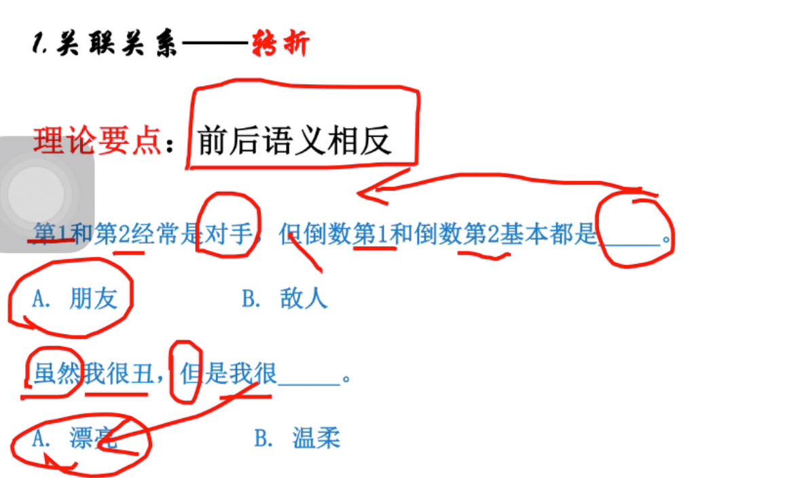
- 例子

```
实至名归：我已经拿到手了，但是当时他没拿


而且，文章强调“应该”
```

- 例子
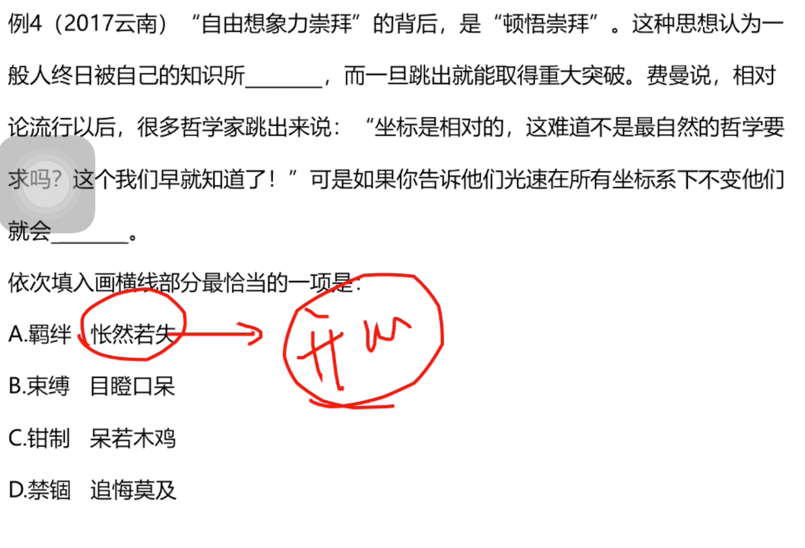
```

b选项对

钳制：在外力的作用下

```

> 递进关系

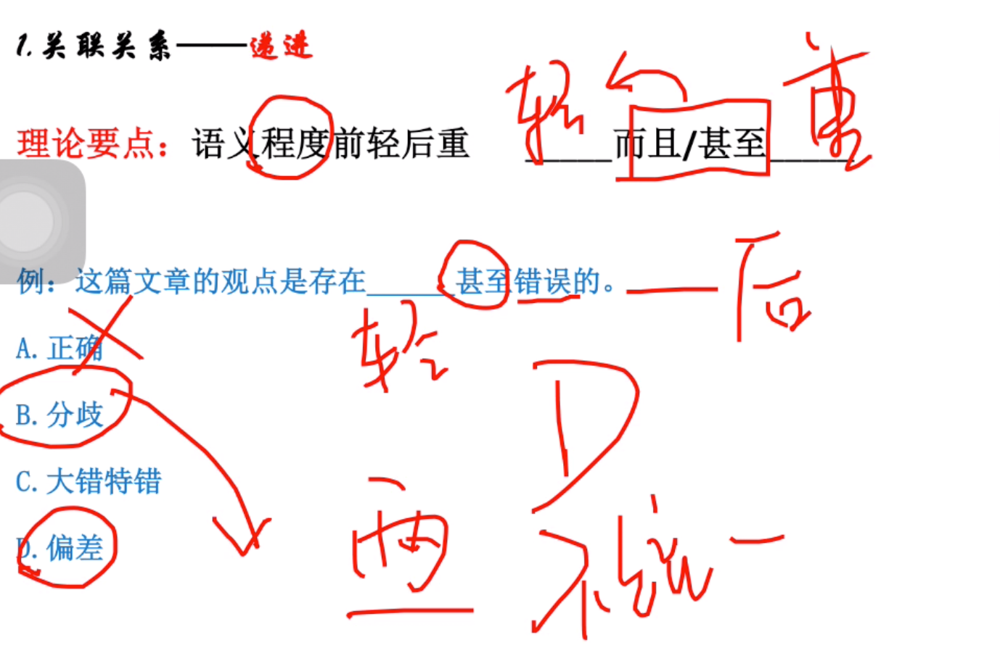

- 例子

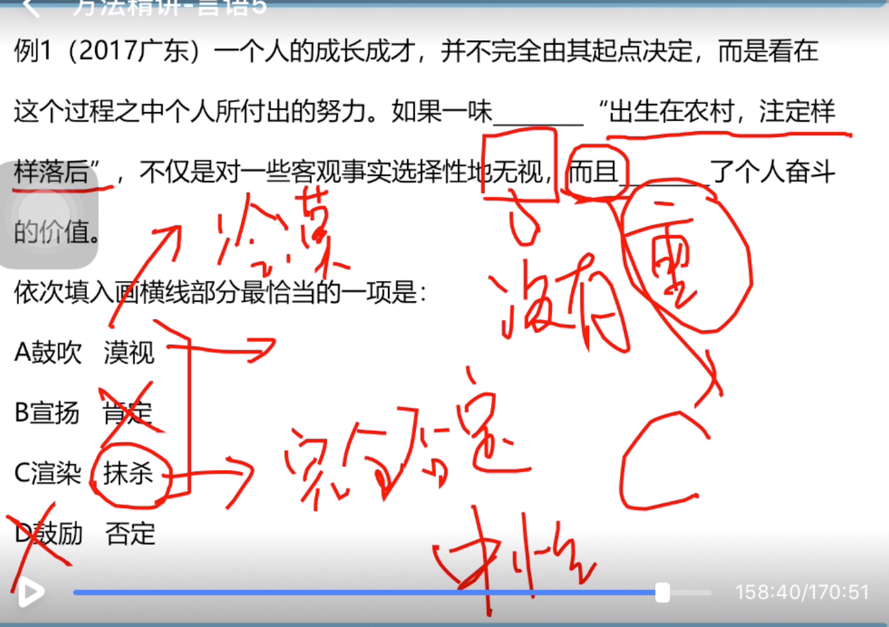