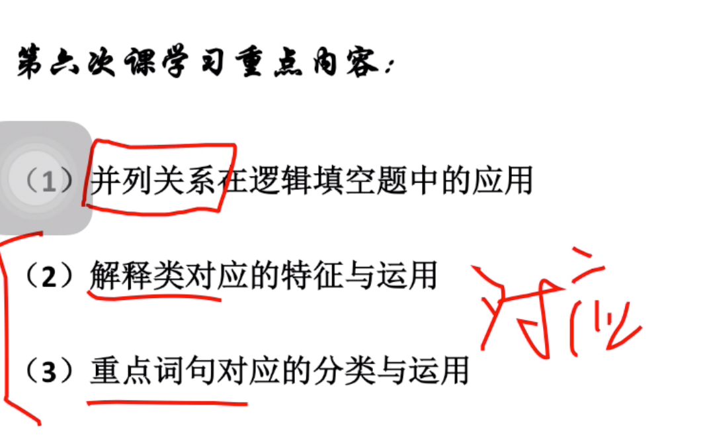
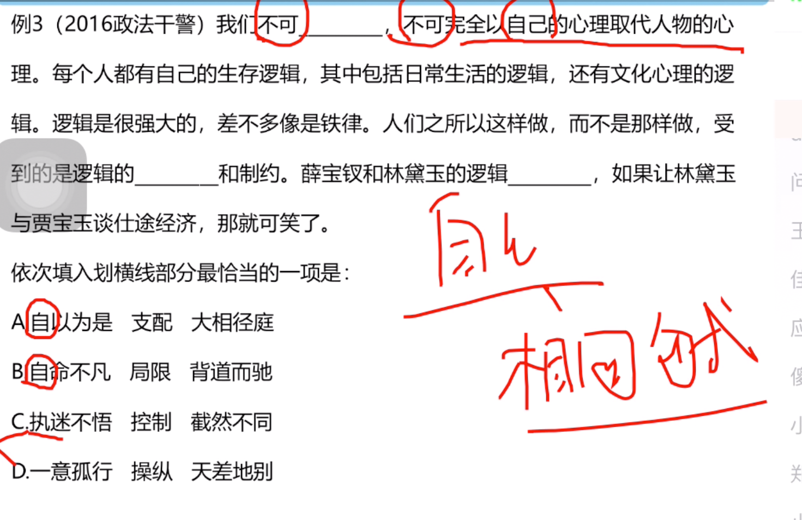
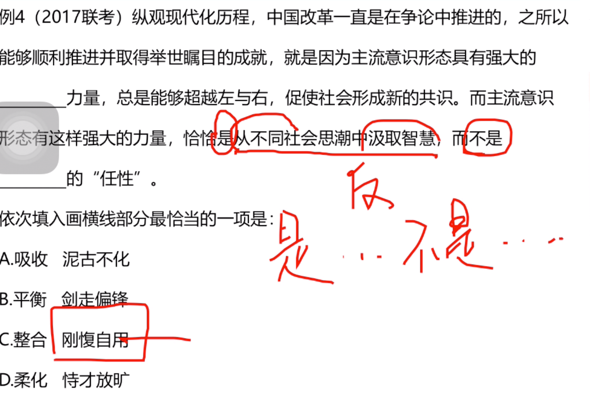
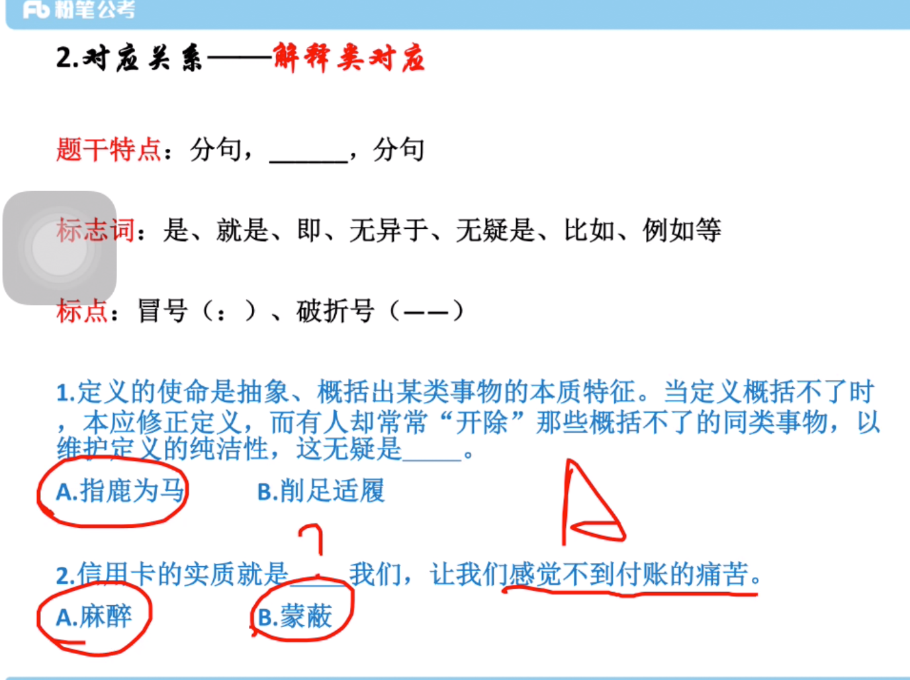
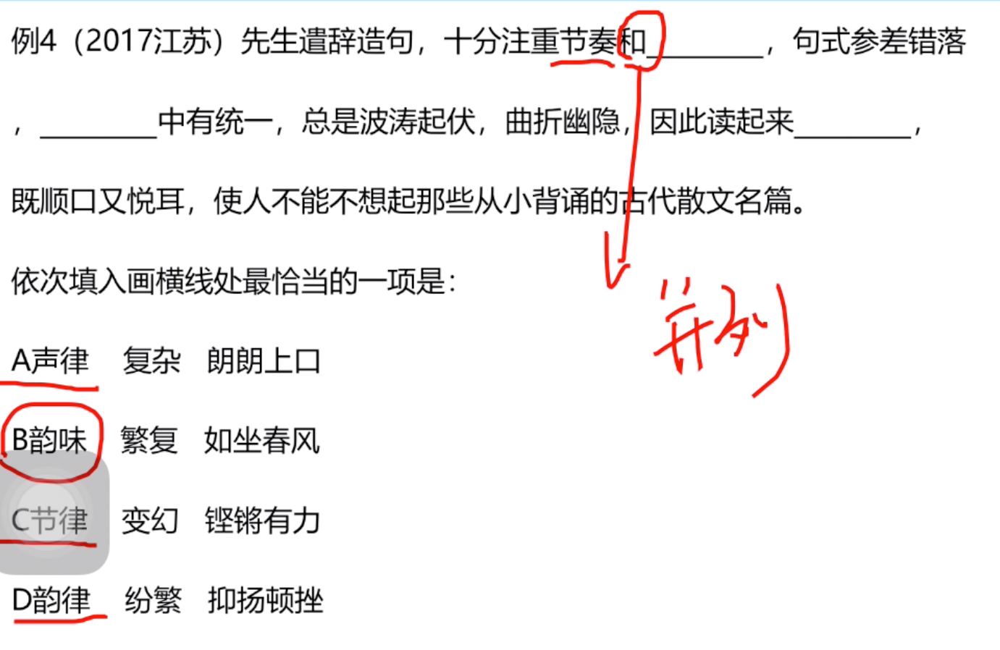
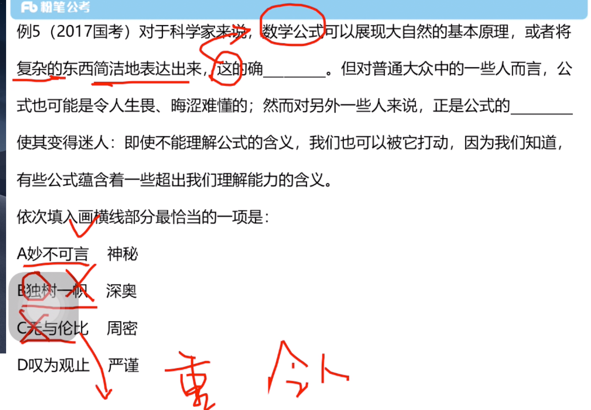
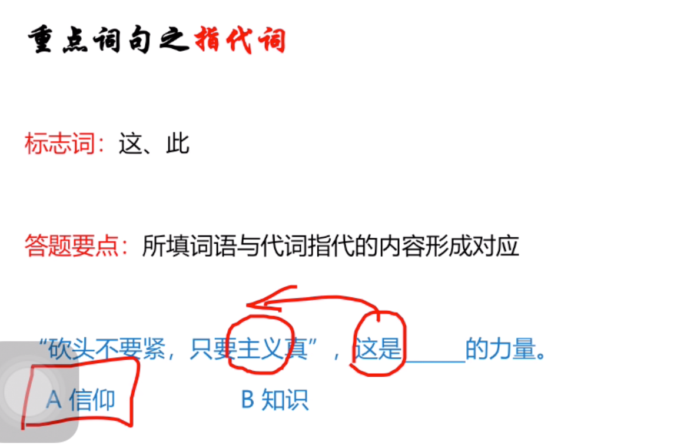
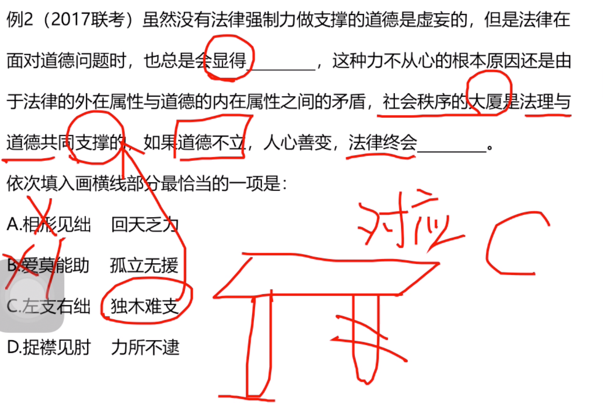
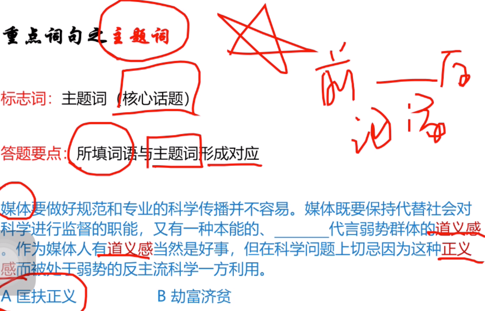
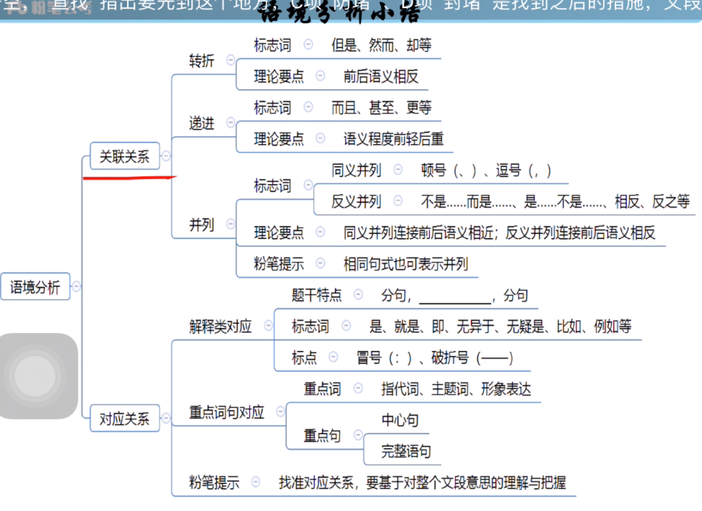

### 并列



```
不绝如缕：声音很微弱或情况危急


```

- 例子



```
正确：A

第一空：同意并列，去掉C，D

背道而驰：道：正确的路。指你走错路了，强调对错的问题，常用在消极的
```

- 例子



```

是...不是...
反义词
```

> 对应关系



```
演化：强调自然界的变化
演变：人类社会的变化
分道扬镳：之前在一起又分开了。
南辕北辙：形容行动和目的不一致。


```

- 例子



```
选D

B选项，因为，和节奏，并列。而韵味没有节奏的感觉，首先排除

抑扬顿挫，有种高高低低的感觉，所以跟曲折又硬对应。

如坐春风= 如沐春风：表示和品德高尚的人相处受到好的影响

慷锵有力：表示有力量
```

- 例子



```
选a

独树一帜：说法太绝对，指自己的独特风格。但是别的学科也有自己的独特风格。
c也太绝对
D叹为观止，要用令人叹为观止

```

```
不言自明：不用说就能明白
毋庸讳言：直接说，不用避讳。
坐而论道：说道

```

> 重点词



- 例子



```
大厦支撑，独木难支

力所不逮：力量达不到。而文段强调一个人支撑不了。
```

> 主题词



- 例子


```
大阿捯持：把宝剑倒着拿，对自己有危害。
以一持万：抓住了关键可以控制全局
```

- 总结


```
耳闻能诵：形容人记忆力比较好。
目知眼见：亲眼所见，形容熟悉了解
驾轻就熟：某个技能很熟练
```
