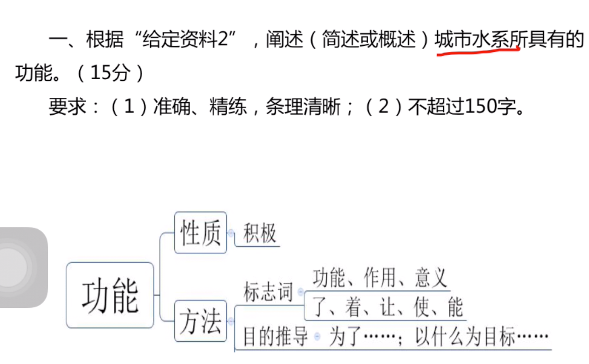
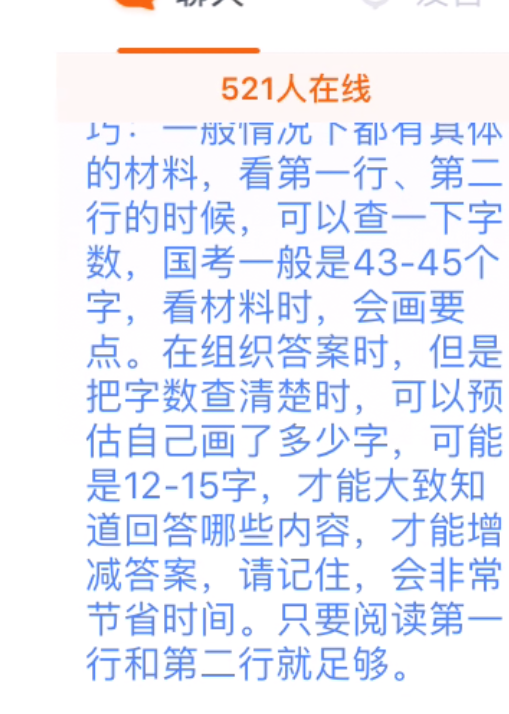

### 看题目感知题型

1. 题型，单一，综合，公文题，作文题
2. 感知材料作文，为作文服务

### 2017题（目标，单一题80%分数，综合题60%分数。公文题70%分数。大作文二类文）

- 阐述“城市水系所具有的功能”（申论考前必做100题。P77）

- 阐述“城市水系就像城市的指纹”的意思

- 以打造“水清，水活，水美”的城市“活力水城”为题，写一篇报道。（格式+语言分数一定要得到）

- 就L市构建城市水系的规划特点以及可行性，写一份材料，供领导参阅。（公文题）

- 大作文，像水学习。（二类文）

### 训练知识点

- 阐述“城市水系所具有的功能”

1. 审题三步走
```
1. 确定范围

2. 主题、结构（城市水系，功能）

3. 相应要求

```

2. 如果以后类似功能，不太常见的要素，就往已知道的要素。往多种方面靠拢。

3. 方法



4. 字数



```
1. 先数材料第一行第二行多少字。一般45左右

2. 从文章找出要点，算材料第一行第二行你画出来的字数，一般是三分之一，就是15个字。

3. 这样就可以总估计你一共画了多少字数。
```

5. 阅读技巧

```
1. 如果段落主题词不对。而且找的是消极的影响，文章问的是积极影响。那么这一段可以快速略过。

2.而且文章找的是城市水系的功能。如果段落给的市城市水系的问题不是功能。这段落就直接略过。

3. 意义作用反推功能

4. 目的（为了啥，也反推功能意义）

5. 
```