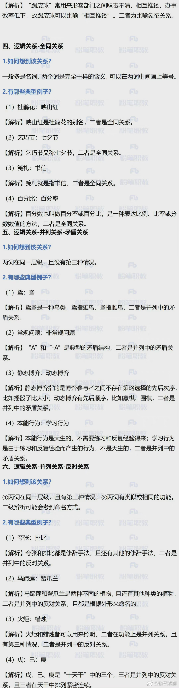
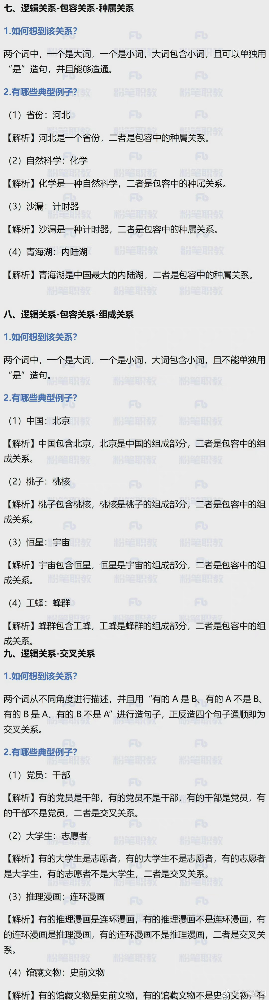
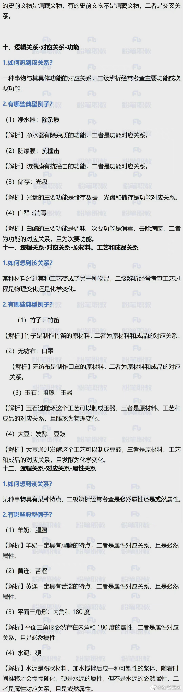
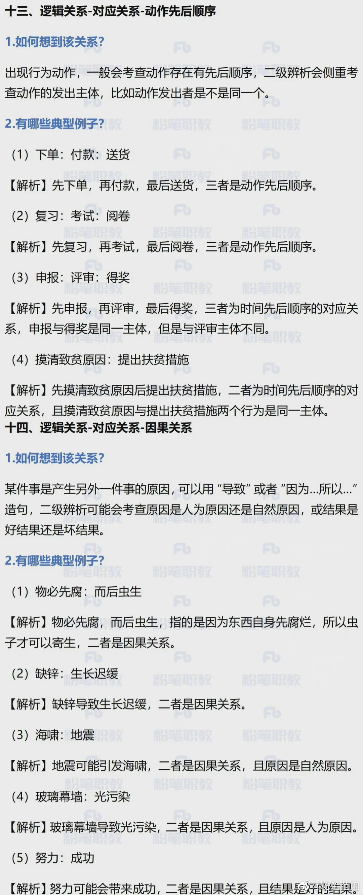
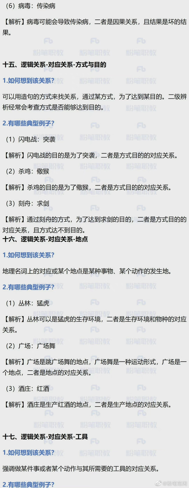
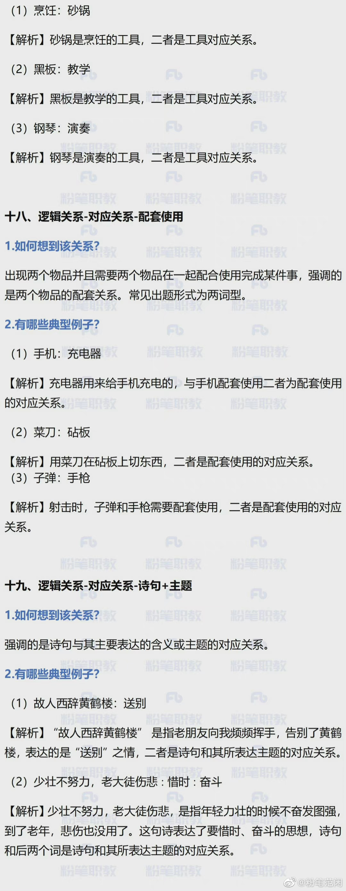
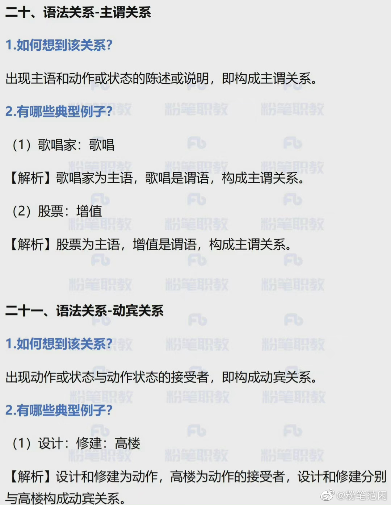
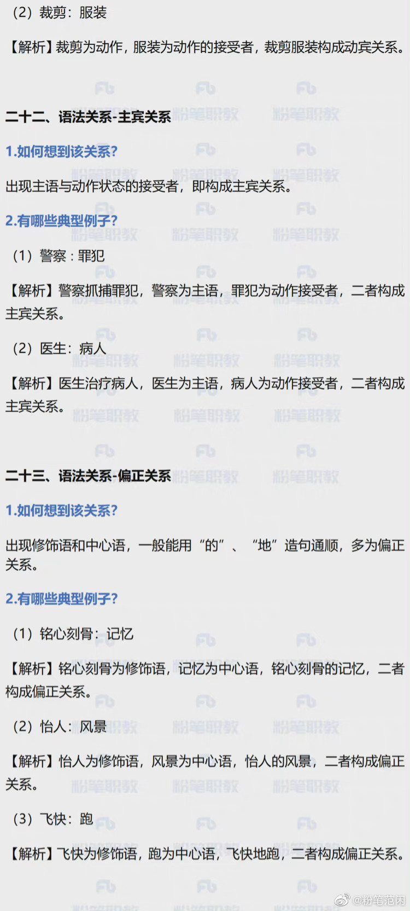
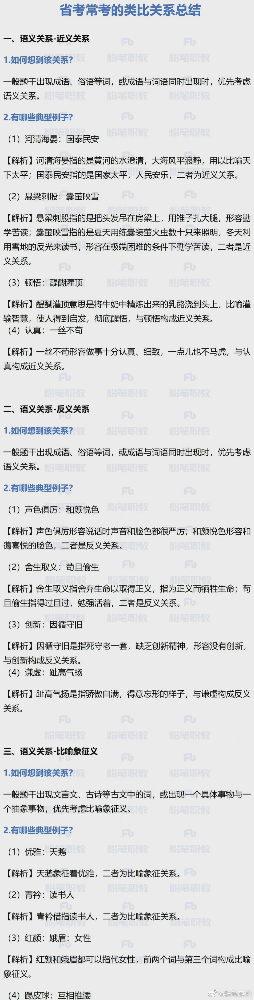

###  言语共35道，答对22道，正确率63%，用时54分钟

 #### 阅读理解(共11道，答对7道，正确率64%)
  1. 中心理解(共8道，答对6道，正确率75%,时间超了8min)

    (1) 关联词-因果(共1道，答对0道，正确率0%)
    (2) 行文脉络-分总(共2道，答对0道，正确率0%)

  ```
    主要文章的层次。重点讲什么，此外的那种就不是重点。

  ```  

  2. 细节判断(共2道，答对1道，正确率50%)
  3. 标题填入(共1道，答对0道，正确率0%)

 #### 语句表达(共6道，答对3道，正确率50%,超了6min)
  1. 语句排序(共2道，答对0道，正确率0%)
  2. 语句填空(共4道，答对3道，正确率75%)
    (1) 中间(共1道，答对0道，正确率0%)

    ```


    ```
 #### 逻辑填空(共18道，答对12道，正确率67%)
  1. 实词填空(共10道，答对8道，正确率80%)

  ```


  ```
  2. 成语填空((共3道，答对2道，正确率67%))

  ```
  1. 成语的含义以及积累，比如：皮里阳秋”指表面上不作评论但内心有所褒贬。
  ```
  3. 混搭填空((共5道，答对2道，正确率40%))
  4. 词的辨析(共10道，答对7道，正确率70%)
    (1)固定搭配(共10道，答对7道，正确率70%)
    (2)词义侧重(共1道，答对0道，正确率0%)
 
  5. 语境分析
    (1)对应关系：重点词语对应(共11道，答对8道，正确率73%)

###  判断共35道，答对25道，正确率71%，用时45分钟

  #### 定义判断（共7道，答对5道，正确率71%）！！

  1. 单定义（共3道，答对2道，正确率67%）
    （1） 其他句式 
    
  2. 多定义（共4道，答对3道，正确率75%）
     
      （1） 常规问法 

  #### 逻辑判断（共11道，答对6道，正确率55%）！！！
   1. 加强题型（共5道，答对2道，正确率40%，用时7分钟）
    （1） 搭桥 （共1道，答对0道，正确率0%，）
    （2） 补充论据 （共2道，答对1道，正确率50%，）
     (3) 必要条件 
     (4) 加强选非题 （共1道，答对0道，正确率0%，）
  3. 翻译推理
  #### 常用的类比推理23种（共10道，答对26道，正确率60%，用时5分钟）
   1. 语义关系

   (1) 近义关系 （共3道，答对2道，正确率67%）
   

  2. 逻辑关系（共8道，答对4道，正确率50%）

    
    
    
    
    
    
    
    
    
    
      （1） 并列 
     
      （1）全同 (多为名词，相同)

       
      （1） 包容 （种属：大词和一个小词，大词能包括小词。组成：大词包括小词，且不能用是）
      （1） 对应  (共4道，答对2道，正确率50%，）

  3. 语法关系
###  资料共20道，答对15道，正确率75%，用时42分钟 