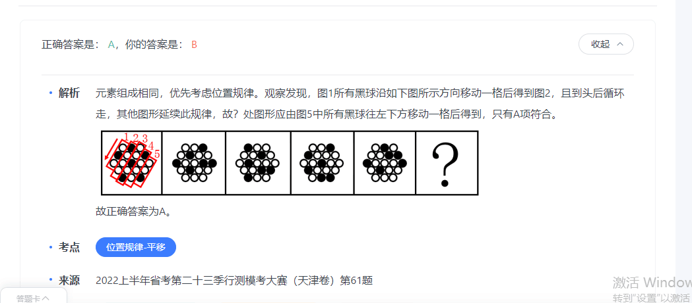
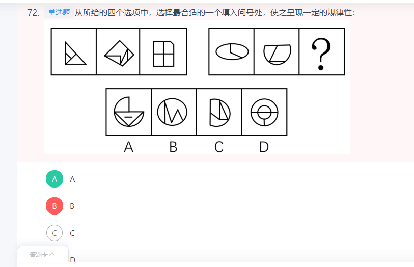

- 1


```


```


## 7-29


### 言语
|  错误类型（为什么错）   | 统计次数  |
|  ----  | ----  |
|   偏化学性质的词语不能用（稀释，融化）| 1 |
|  固定搭配（击破：防线，破除：封建迷信等思想，打破：垄断）| 1 |
|   | 1 |

- 1（稀释”指在溶液中再加入溶剂使溶液的浓度降低，文段并无将微量元素的浓度降低之意。“溶化”指溶解，多指固体溶解，或形容冰、雪等变成水，文段强调“海水”中含有大量“微量元素”，并非固体溶解或冰雪溶化，与文意不符，）


```

除了一些常见元素，海水中还        了大量的微量元素。科学家        海水和海洋沉积物中各种各样的元素，去        大洋的洋流路径，了解不同水体之间的混合，确定海水的酸度，估算海水温度和盐度等。

依次填入画横线部分最恰当的一项是：

A

稀释 通过 分析

B

分解 根据 研究

C

溶解 利用 追踪

D

溶化 收集 考察


正确答案是： C收起
解析
第一空，根据文意可知，横线处所填词语应体现出“海水”中含有大量“微量元素”之意。C项“溶解”指一种物质以分子或离子等状态均匀地分散在另一种物质中，置于此处可以表示海水中含有大量微量元素，与文意相符，保留。A项“稀释”指在溶液中再加入溶剂使溶液的浓度降低，文段并无将微量元素的浓度降低之意，与语境不符，排除；B项“分解”指一个整体分成它的各个组成部分，或指一种物质经过化学反应而生成两种或两种以上成分较简单的其他物质，文段并无将微量元素拆分成几个部分或几种其他物质的意思，且海水无法分解微量元素，排除；D项“溶化”指溶解，多指固体溶解，或形容冰、雪等变成水，文段强调“海水”中含有大量“微量元素”，并非固体溶解或冰雪溶化，与文意不符，排除。

第二空，代入验证，C项“利用”与“元素”搭配恰当，保留。

第三空，代入验证，根据文意可知，“海水和海洋沉积物中各种各样的元素”有助于了解“大洋的洋流路径”。C项“追踪”指按着踪迹去追赶或根据线索去追查，置于此处可表示以“元素”为线索，来了解“大洋的洋流路径”，符合文意，当选。

故正确答案为C。
```

- 2（固定搭配（击破：防线，破除：封建迷信等思想，打破：垄断））


```
中国企业在计算机视觉、机器学习、图像识别、生物识别、语音识别和自然语言处理关键技术领域不断取得        。在经历了PC时代的Windows和移动互联网时代的Android和iOS之后，与新一代人工智能相        的操作系统正在        原有的垄断。

依次填入划横线部分最恰当的一项是：

A

突进 适合 颠覆

B

突破 适应 打破

C

进步 对应 击破

D

进展 切合 破除


正确答案是： B收起
解析
第一空，根据“在经历了PC时代的Windows和移动互联网时代的Android和iOS之后，与新一代人工智能······的操作系统正在······原有的垄断”可知，横线处词语应体现我国在关键技术领域取得重大成就，B项“突破”意为冲破超越，C项“进步”意为在原有基础上提高、有发展，D项“进展”意为向前发展，均与文意相符，保留。A项“突进”意为集中兵力向一定的方向或地区猛进，强调前进的过程，而非最终取得的结果，与文意不符，排除。

第二空，根据文意可知，横线处词语应体现操作系统与新一代人工智能更适合之意，B项“适应”意为适合，多指符合客观环境或需要，D项“切合”意为十分符合，均能体现更适合之意，保留。C项“对应”意为与某一情况相当，无法体现更适合之意，排除。

第三空，与“垄断”搭配，B项“打破”意为突破原有的限制和约束，与“垄断”搭配恰当，当选。D项“破除”意为打破并废除，一般与“封建迷信”“思想观念”等搭配，与“垄断”搭配不当，排除。

故正确答案为B。
```

- 3（1. 眼花缭乱”形容眼睛看见复杂纷繁的东西而感到迷乱，也比喻事物复杂，无法辨清，通常搭配的主语为人，且在文中需表述为“令人眼花缭乱的世界变局。2. 第二个空填写，感恩相近的成语。安之若素”指在反常或危困等情况下，仍安然处之。不合适 3. 第三个空应该填写勇于担当：一马当先：自己应尽的责任，不能推卸给别人。）


```
人无德不立，品德是为人之本。面对            的世界变局，要明辨是非、恪守正道；面对形形色色的外部诱惑，要保持定力、严守规矩；面对来之不易的美好岁月，要            、心怀感恩；面对强国强军的伟大事业，要            、勇于担当。

依次填入画横线部分最恰当的一项是：

A

纷繁复杂 安之若素 当仁不让

B

眼花缭乱 知恩图报 一马当先

C

扑朔迷离 饮水思源 责无旁贷

D

一日千里 安居乐业 义不容辞


正确答案是： C收起
解析
第一空，搭配“世界变局”，A项“纷繁复杂”形容头绪多，情况复杂，C项“扑朔迷离”形容事情错综复杂，难以辨别清楚，D项“一日千里”比喻进展极快，均可形容世界发展的局势，保留。B项“眼花缭乱”形容眼睛看见复杂纷繁的东西而感到迷乱，也比喻事物复杂，无法辨清，通常搭配的主语为人，且在文中需表述为“令人眼花缭乱的世界变局”，搭配不当，排除。

第二空，通过“、”与“心怀感恩”形成并列，体现要感恩现在的美好岁月，C项“饮水思源”指喝水的时候想起水是从哪儿来的，比喻不忘本，符合文意，保留。A项“安之若素”指在反常或危困等情况下，仍安然处之，毫不在意，D项“安居乐业”指人民生活安定美满的样子，比喻安定地生活，愉快地工作，均不能体现感恩之意，排除。

第三空，代入验证，C项“责无旁贷”指自己应尽的责任，不能推卸给旁人，可与“勇于担当”形成并列关系，符合文意，当选。

故正确答案为C。
```

- 4（1. 流通：固定搭配：货币流通 2. 在复杂的血管里面，应该强调随机应变而不是快。所以灵活大于灵敏）


```
磁控软体机器人，就像一根细细的导线，能在复杂的血管环境中        ，帮助医生完成脑部等微创手术。机器人内芯是一种柔软的聚合物基质，其中均匀分布着磁性微粒，因而可以通过外部磁场编程精确控制机器人的走向。为了        出入复杂曲折的脑血管环境，机器人最外层还涂有一层水凝胶以降低表面摩擦力。

依次填入划横线部分最恰当的一项是：

A

穿梭 灵敏

B

流通 便于

C

穿行 灵活

D

通行 灵巧


正确答案是： C收起
解析
第一空，根据“就像一根细细的导线”可知，文段将磁控软体机器人进行了形象化表达，故横线处词语应体现出磁控软体机器人像细细的导线一样，可以在复杂的血管环境中穿过之意。A项“穿梭”指像织布的梭子来回穿行，C项“穿行”指从中间穿过，D项“通行”指通过，畅行无阻，均符合文意，保留。B项“流通”指流转通行，不停滞，如空气流通，不符合文意，排除。

第二空，根据后文“涂有一层水凝胶以降低表面摩擦力”可知，横线处词语体现的是水凝胶降低表面摩擦力带来的结果。C项“灵活”指极敏捷而不死板，表达机器人涂水凝胶工作更加迅速敏捷，可以与后文形成对应，当选。A项“灵敏”指反应迅速，如头脑灵敏，侧重反应快，不符合文意，排除；D项“灵巧”指灵活而巧妙，侧重巧妙，与后文无法形成对应，排除。

故正确答案为C。
```

- 5（1. 主题词是今天的青年。2. 不要觉得像你做过的题就直接选。）


```
今天的青年，有着同先辈们一样的“处处为国家着想”的赤子之心，一样的“把有限的生命投入到无限的为人民服务中去”的凛然担当。他们享受生活，但同时也勇于担当职责；他们关注个人权益，但同时也懂得尊重集体和他人福祉；他们主张自主选择，但也并不缺乏家国情怀、奉献精神，一样是雷锋精神的坚定拥趸和积极行动者。

本段文字旨在说明：

A

今天的青年同样具有雷锋精神

B

新时代雷锋精神具有新的阐释

C

雷锋精神在本质上未发生改变

D

雷锋精神已经融入到生活之中


正确答案是： A收起
解析
文段开篇指出“今天的青年”与先辈们具有一样的“为人民服务”的精神品质，接着通过三个并列句具体论述“今天的青年”身上如何体现雷锋精神的，故文段主题词是“今天的青年”，意在强调“今天的青年”与先辈们一样是雷锋精神的拥趸和行动者，对应A项。

B项，缺少主题词“今天的青年”，且“新的阐释”无中生有，排除；

C项，缺少主题词“今天的青年”，排除；

D项，缺少主题词“今天的青年”，且“融入到生活之中”无中生有，排除。

故正确答案为A。
```

- 6（1。语义更丰富的词可以获选：身临其境表示亲自真实感受。近在咫尺：只是强调近而已。）


```

红色资源是宝贵的革命历史文化遗产，全国各地都有自己独特的红色资源，这些红色资源具有唯一性和原真性的特点，十分珍贵，人们走进这些红色资源，正是想            地具体了解其独特的革命遗址、纪念物及先辈的革命事迹，在真实体验中感悟当年艰苦卓绝的革命历程和先辈崇高的革命精神。

填入画横线部分最恰当的一项是：

A

设身处地

B

近在咫尺

C

寓教于乐

D

亲临其境


正确答案是： D收起
解析
根据“走进这些红色资源”“在真实体验中感悟”可知，横线处所填成语应表达观众切身感受红色资源之意。D项“亲临其境”指亲自到了那个地方，符合文意，当选。A项“设身处地”指站在别人的处境替别人着想，B项“近在咫尺”形容距离很近，C项“寓教于乐”指把教育跟娱乐融合为一体，使人在娱乐中受到教育，均无法体现出切身感受之意，与文意不符，排除。

故正确答案为D。

【文段出处】《红色资源是宝贵的革命历史文化遗产》
```

- 7（1. 感知”指利用感官对物体获得的有意义的印象，侧重于通过“感官”感受，文段并未体现通过感官感受力量，与文意不符）


```

在中共一大纪念馆“真理的味道”展陈前，72种版本的《共产党宣言》作为“镇馆之宝”，吸引参观者驻足，在此        真理的力量。

填入横线处最恰当的是：

A

感知

B

感悟

C

体验

D

品味


正确答案是： B收起
解析
横线处搭配“真理的力量”，体现参观者观看《共产党宣言》后感受到真理的力量之意。B项“感悟”指有所感触而领悟，置于此处可体现参观者观看72种版本的《共产党宣言》后因有所感触而领悟到其中的力量，符合文意，当选。A项“感知”指利用感官对物体获得的有意义的印象，侧重于通过“感官”感受，文段并未体现通过感官感受力量，与文意不符，排除；C项“体验”指通过实践来认识周围的事物或亲身经历，侧重“实践”，与文意不符，排除；D项“品味”意为鉴赏、玩味、品尝，与“真理的力量”搭配不当，排除。

故正确答案为B。
```

- 8（横线处所填成语应与“作家创作”这一话题相关。文思不畅比无从下手更好）


```
创作瓶颈”是非常令人        的一种状态，深陷其中的创作者往往会想要超越而难以前行。因此《韦氏词典》把            解释为“一种阻碍了作家继续创作的心理障碍”。

依次填入画横线部分最恰当的一项是：

A

气馁 文思不畅

B

迷惑 无从下手

C

恐惧 力不从心

D

厌弃 不通文墨


正确答案是： A收起
解析
本题可从第二空入手，根据《韦氏词典》及“解释为‘一种阻碍了作家继续创作的心理障碍’”可知，横线处所填成语应与“作家创作”这一话题相关，体现作家创作过程中遇到的瓶颈，A项“文思不畅”指写作的思路不畅通，符合文意，保留。B项“无从下手”指没有任何途径没法着手去办，C项“力不从心”指心里想做而力量不够，均无法与“作家创作”这一话题对应，排除；D项“不通文墨”指人文化水平不高或识字不多，无法用于形容作家，排除。

第一空，代入验证，A项“气馁”指灰心丧气，置于横线处体现了作家遇到“创作瓶颈”后灰心丧气的状态，符合文意，当选。

故正确答案为A。
```

- 9（1. 注意对策并不是万能的。2. 文章主题词是农业灾害 -- 数据库。3. A范围扩大了，对比择优，选C）


```
迄今为止，国内外农业灾害史研究还未能建立一个全面记录历史时期世界各地自然灾害发生完整过程和灾情信息的综合性灾害史料数据库。在气候变化、灾害影响与适应防灾减灾应用等方面研究的资料需求无法得到满足，以致于不能全面地揭示灾害成因和环境后果。

上述文段主要讲了：

A

建立综合性灾害史料数据库的紧迫性

B

综合性灾害史料对于农业灾害研究的重要性

C

农业灾害史研究当前面临的问题

D

推动农业灾害成因和环境后果研究需加强国际合作


正确答案是： C收起
解析
文段开篇指出目前国内外农业方面的灾害史研究还没有建立一个综合性灾害史料数据库，并在后文进一步论述，即在很多方面的资料需求无法得到满足以致产生一些不良后果。因此，文段主要论述了农业灾害史目前缺少综合性灾害史料数据库的问题，对应C项。

A项，“综合性灾害史料数据库”范围扩大，文段强调的是“农业综合性灾害史料数据库”，排除；

B项，“综合性灾害史料”偷换概念，文段话题为“综合性灾害史料数据库”，排除；

D项，“加强国际合作”文段未提及，无中生有，排除。

故正确答案为C。
```

- 10


```

```
### 判断
|  错误类型（为什么错）   | 统计次数  |
|  ----  | ----  |
|  立体图形：标1，2，3定位。 | 1 |
|  定义判断：注意不明确不能选| 1 |
|  黑白九宫格：也要先从位置开始找规律| 1 |
|  图推：用不了花生的办法，则可以列举所有情况的相对面，相对面排除法| 1 |

- 1(1. 这种数图形首先要定位，技巧：标1，2，3定位。)




- 2（对比择优。一定要注意不明确：C：丙听朋友描述澳洲大火的细节。不明确，朋友并不一定经历了。2但是B是确实经历了。 但反复梦见自己被大火吞噬，做梦不属于情绪、躯体反应，不符合“产生与经历者等同的情绪、躯体反应”，）

```
替代性创伤是指在听到或看到一些灾难性事件的信息后，损害程度超过其中部分人群的心理和情绪的耐受极限，产生与经历者等同的情绪、躯体反应的现象。

根据上述定义，下列现象属于替代性创伤的是：

A

乘客甲经历紧急故障迫降事件后从此再也不敢乘坐任何飞机

B

抗疫志愿者乙目睹新冠肺炎感染者遭受病痛折磨而严重失眠

C

丙听朋友描述澳洲大火的细节之后反复梦见自己被大火吞噬

D

医生丁面对因医学技术上的局限而不能治愈的患者深感自责


正确答案是： B收起
解析
第一步：找出定义关键词。

“在听到或看到一些灾难性事件的信息后”、“产生与经历者等同的情绪、躯体反应”。

第二步：逐一分析选项。

A项：乘客甲经历了灾难性事件，是经历者，不符合“在听到或看到一些灾难性事件的信息后”，也不符合“产生与经历者等同的情绪、躯体反应”，不符合定义，排除；

B项：抗疫志愿者乙目睹新冠肺炎感染者遭受病痛折磨，符合“在听到或看到一些灾难性事件的信息后”，严重失眠，符合“产生与经历者等同的情绪、躯体反应”，符合定义，当选；

C项：丙听朋友描述澳洲大火的细节，符合“在听到或看到一些灾难性事件的信息后”，但反复梦见自己被大火吞噬，做梦不属于情绪、躯体反应，不符合“产生与经历者等同的情绪、躯体反应”，不符合定义，排除；

D项：医生丁面对因医学技术上的局限而不能治愈的患者深感自责，不符合“在听到或看到一些灾难性事件的信息后”，也不符合“产生与经历者等同的情绪、躯体反应”，不符合定义，排除。

故正确答案为B。
```
- 2（九宫格也要先从位置开始看规律：这道题就是每行元素分别平移1，2，3，并且还反弹。）


- 4


- 5（主要是BD不好排除，B排除是因为用花生的方法看到实心三角形的直角点都连着有直线；但是B没有）


- 6（1. A不能说没有救人，就相当于合伙打人了、2.尽管谢某后来后悔了，但行动上却仍默许了丁某配置汽车钥匙，使其成功盗窃了汽车，仍属于共同犯罪，符合定义 ）

```
共同犯罪是指二人以上共同故意犯罪，共同故意犯罪要求共犯人知道共犯的内容及社会意义，并希望结果的发生，并且共犯人主观上要有共同犯罪意思联络，知道自己不是孤立的在犯罪，而是和他人一起共同犯罪。

根据上述定义，下列案件不属于共同犯罪的是：

A

李某和杨某系夫妻，与邻居黄某因为排水问题发生纠纷，继而发生口角，黄某被李某殴打。黄某受伤倒地后杨某未实施救助，与李某快速离开了现场。经鉴定，黄某受重伤

B

周某和陈某对刘某怀恨在心，二人商议杀死刘某，于是二人非法购买了枪支，准备第二天杀死刘某。但是陈某感到害怕，于当天晚上告知刘某杀人计划，并和刘某一起到公安机关报案

C

张某和王某两人互不认识。一天深夜，张某进入一家超市偷东西时，碰到王某也在该超市偷东西，两人相视而笑。之后，张某和王某一起将偷取的东西变卖，分别获利2.2万元和1.3万元

D

谢某和丁某共谋盗窃汽车，谢某将开车所需的钥匙交给丁某。后来，谢某后悔，让丁某归还钥匙。丁某请求谢某让他配置—把钥匙之后再归还，谢某同意。随后丁某利用自己配置的钥匙盗窃了汽车
```
- 7（1. 题干图形被分割明显，考虑面数量，但整体数面无法分组，所有图形的面数量均为7。再次观察发现，题干图形存在较多的三角形面，则考虑数三角形面的个数，图①③⑥均有4个三角形面）


- 8


```
故将题干图形均旋转进行观察，此时从右向左看，每幅图中的数字依次为：88、89、90、91、92，故“？”处图形旋转之后为数字93，只有D项符合。
```

- 9（D项：老王将自己的稿费用于鼓励新人，这是对他人的赠予，赠予行为需要当事人双方一致的意思表示才能成立，不符合“只要一方当事人的意思表示就可成立”，不符合定义，当选。）

```

单方法律行为是指只要一方当事人的意思表示就可成立的民事法律行为。

下列不属于单方法律行为的是：

A

刘某因和林某之间的情感，免除了林某的债务

B

张某放弃继承权

C

林某变更遗嘱

D

老王将所获得的稿费用于鼓励新人


正确答案是： D，你的答案是： C收起
解析
第一步：找出定义关键词。

“只要一方当事人的意思表示就可成立”、“民事法律行为”。

第二步：逐一分析选项。

A项：刘某免除林某的债务，仅凭刘某单方面的意思表示即可成立，且免除债务是民事法律行为，符合“只要一方当事人的意思表示就可成立”、“民事法律行为”，符合定义，排除； 

B项：张某放弃继承权，仅凭张某单方面的意思表示即可成立，且放弃继承权是民事法律行为，符合“只要一方当事人的意思表示就可成立”、“民事法律行为”，符合定义，排除；

C项：林某变更遗嘱，仅凭林某单方面的意思表示即可成立，且变更遗嘱是民事法律行为，符合“只要一方当事人的意思表示就可成立”、“民事法律行为”，符合定义，排除；

D项：老王将自己的稿费用于鼓励新人，这是对他人的赠予，赠予行为需要当事人双方一致的意思表示才能成立，不符合“只要一方当事人的意思表示就可成立”，不符合定义，当选。

本题为选非题，故正确答案为D。
```
### 资料
|  错误类型（为什么错）   | 统计次数  |
|  ----  | ----  |
|   | 1 |
|  | 1 |
|   | 1 |

- 3


```

```