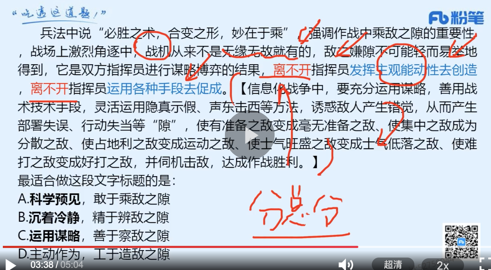
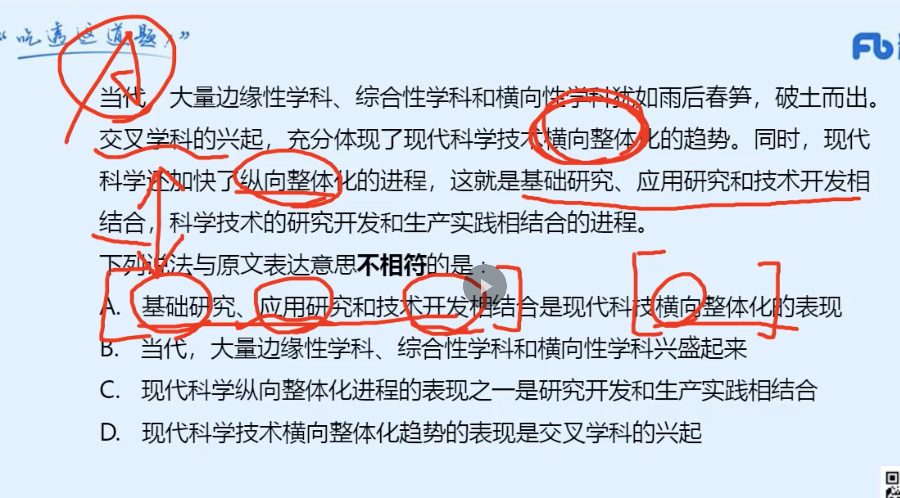
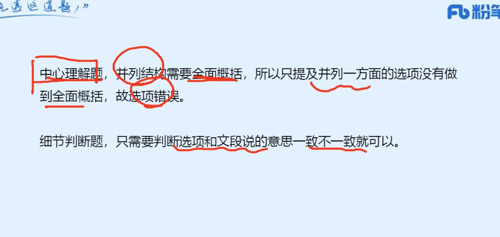
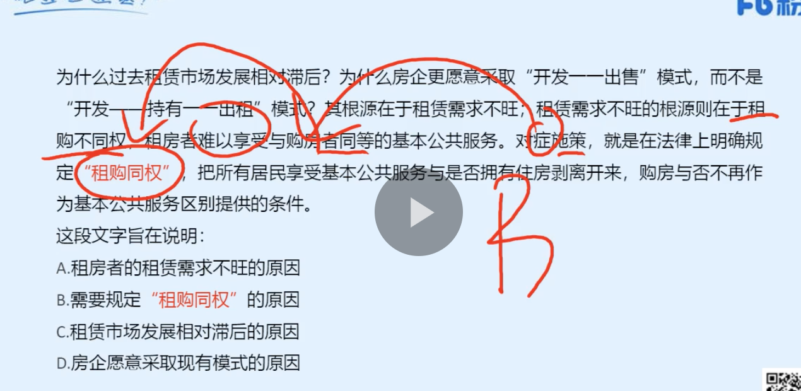

### 言语 （35 64% 32min）
|  错误类型（为什么错）   | 统计次数  |
|  ----  | ----  |
|  无中生有：典通性这个定义在文章中没有出现过 | 1 |
|  | 1 |
|   | 1 |

- 1


```
生态审美以人与自然的和谐关系为基础，这种关系是审美性的，是自由性的，是以保护我们赖以生存的环境为目的的。生态审美观更加注重人与自然的和谐共生，不侧重于以某一方面作为主宰，而是强调人与自然的平等。二者的生态审美关系是内在互动的而不是单方面的独奏。人们融入自然、顺应自然，保持人与自然的和谐共生，从而使得自己的生活充满诗意。

下列说法与原文表达意思不相符的是：

A

应把自然万物当作与人平等的主体看待

B

人与自然应该自由互动、和谐共生

C

人与自然之间具有审美性关系

D

自然万物与人有相关性、典通性


正确答案是： D收起
解析
A项，根据“生态审美观更加注重人与自然的和谐共生，不侧重于以某一方面作为主宰，而是强调人与自然的平等”可知，“应把自然万物当作与人平等的主体看待”表述正确，排除；

B项，根据“二者的生态审美关系是内在互动的而不是单方面的独奏”“人们融入自然、顺应自然，保持人与自然的和谐共生”可知，“人与自然应该自由互动、和谐共生”表述正确，排除；

C项，根据“生态审美以人与自然的和谐关系为基础，这种关系是审美性的”可知，“人与自然之间具有审美性关系”表述正确，排除；

D项，“典通性”文段并未提及，无中生有，当选。

本题为选非题，故正确答案为D。

```
- 2（1. 这种题首先A是很可能对的，因为它说之一很严谨。你可以不重点先找她。2. 比如D可以直接排除 2. CD过于绝对，都是，不再，可以去文章中找。3.B项，需要理解。当一颗体型巨大的恒星坍缩时，它会在巨大的爆炸中走向消亡，成为一颗“超新星”。正是在此过程中产生了各种重元素。此时产生重元素：碳、铁、铀等 ）


```
恒星中心迅速的聚合反应在经历数百万年后，逐渐耗尽自身的氢元素。此时，恒星的中心坍缩产生更高的温度，直到氦原子开始聚合，产生更复杂的元素，比如碳。经历一系列这样的剧烈坍缩，新的元素不断诞生，直至出现原子核中拥有26个质子的铁元素。产生含有更多质子的元素需要更高的温度。没有恒星（无论其体积大小）能达到如此高的温度。当一颗体型巨大的恒星坍缩时，它会在巨大的爆炸中走向消亡，成为一颗“超新星”。正是在此过程中产生了各种重元素，直到最重的元素铀，其原子核中含有92个质子。超新星使得化学反应成为可能，没有它们，人类就不会存在，地球也不会存在。第一批超新星很可能是在大爆炸发生10亿年内消亡的。从那时起，超新星就一直将更复杂的化学元素抛撒到星际空间。尽管氢和氦仍是宇宙中占绝对优势的主导元素，但是其他元素的储量也有了显著的积累和提高。这些元素可以通过各种复杂的方式合成化合物。

根据这段文字推论正确的是：

A

足够高的温度是星际空间产生新元素的必要条件之一

B

碳、铁、铀等元素都是在恒星的聚合坍缩中产生的

C

超新星时期，宇宙中占优势的化学元素不再是氢和氦

D

超新星的消亡使宇宙中更加复杂的物质化合成人类


正确答案是： A收起
解析
A项，根据“恒星的中心坍缩产生更高的温度······产生含有更多质子的元素需要更高的温度”可知，表述正确，当选；

B项，根据“当一颗体型巨大的恒星坍缩时，它会在巨大的爆炸中走向消亡，成为一颗‘超新星’。正是在此过程中产生了各种重元素，直到最重的元素铀”可知，铀元素产生于恒星成为“超新星”的过程，而非“坍缩”过程，表述错误，且“聚合坍缩”偷换概念，文段中关于“聚合”的表述仅为氦元素聚合，而非恒星聚合，表述错误，排除；

C项，根据“尽管氢和氦仍是宇宙中占绝对优势的主导元素”可知，“占优势的化学元素不再是氢和氦”表述错误，排除；

D项，根据“超新星使得化学反应成为可能，没有它们，人类就不会存在”可知，超新星使得化学反应成为可能，并非“超新星的消亡”，偷换概念，排除。

故正确答案为A。

【文段出处】《人类的出现

```
- 3（1. 文章是总分结构。先说话题，然后进行解释。2. 一定要注意行文脉络。）


```
约三千年前，青海藏族先民就已掌握原始藏毯的编织技艺，如今，在融入深厚的藏族文化后，藏毯也从单纯的日用品迈入艺术品的殿堂，其中颇具代表性的是加牙藏毯。清康熙年间，因塔尔寺扩建，藏毯编织业在加牙村蓬勃兴起，加牙藏毯以优质藏系棉羊毛为原料，运用手工连环编结法，使用天然植物和矿物质染料低温染纱。由于选毛、纺纱、编织等全靠手工完成，加牙藏毯的每道工序都需匠人的非凡功力。2006年，“加牙藏毯织毯技艺”被国务院列为国家级非物质文化遗产项目。

最适合做这段文字标题的是：

A

藏毯技艺 穿越千年

B

小小藏毯 蜚声世界

C

特色产业 富民兴村

D

研发新品 开拓市场


正确答案是： A收起
解析
文段开篇强调藏毯技艺于约三千年前便已被青海藏族先民掌握并流传至今，其中颇具代表性的是加牙藏毯。后文围绕加牙藏毯的原料、编织手法等进行介绍，尾句指出加牙藏毯被列入国家非遗项目之中。故文段为总分结构，重在强调藏毯技艺已流传千年，后文以加牙藏毯为例具体介绍，对应A项。

B项，“蜚声世界”文段未体现，无中生有，排除；

C、D两项，均缺少文段主题词“藏毯”，偏离文段核心话题，排除。

故正确答案为A。

```
- 4（1. 文章的中心词是法治道路 2. B项，“法治实践”为举例内容，非重点，且“本国的法治实践”侧重强调已经做了的，而文段尾句的“探索”侧重强调未知的，与文意不符，排除；3. 这是一个对策题，因为一开始就反向论证了。）


```
沿着什么样的法治道路前进，直接关系社会主义法治建设的成败。世界上没有放之四海而皆准的法治模式。如果脱离本国实际照抄照搬别国的法治模式，就会对经济社会发展产生消极作用。实践中，有的国家就是因为简单照抄照搬别国的法治模式，结果不但没有实现善治，反而增加了社会不稳定因素。法治是现代国家治理的基本特征和根本保障，任何一个国家进行法治建设，都必须探索适合自己的法治道路。

这段文字意在说明：

A

法治道路直接决定法治建设成败

B

法治建设离不开本国的法治实践

C

应坚定探索适合自身的法治道路

D

没有放之四海而皆准的法治模式


正确答案是： C收起
解析
文段首句引出话题，论述了“法治道路”的重要性，并指出世界上没有放之四海而皆准的法治模式，紧接着运用反面论证，强调脱离本国实际照抄照搬别国的法治模式会带来一系列不良影响，最后尾句通过“必须”提出对策，强调任何一个国家的法治建设都必须探索适合自己的法治道路。故文段论述的重点是必须探索适合自己的法治道路，对应C项。

A项，指出了法治道路的意义，非重点，文段重点强调的是对策，排除；

B项，“法治实践”为举例内容，非重点，且“本国的法治实践”侧重强调已经做了的，而文段尾句的“探索”侧重强调未知的，与文意不符，排除；

D项，表述不明确，未明确指出文段的重点即应探索适合自身的法治道路，排除。

故正确答案为C。

```
- 5（1. 观察文段前后是什么关系。应该是必要条件关系。只要。。就太过于绝对，公务员说话要客观。2. 看主谓宾对不对，CD的主谓宾不对。）


```

社会是企业家施展才华的舞台。        真诚回报社会、切实履行社会责任的企业家，        能真正得到社会认可，        是符合时代要求的企业家。

依次填入画横线部分最恰当的一项是（    ）。

A

只有 才 才

B

只要 就 就

C

如果 不仅 还

D

因为 所以 就


正确答案是： A收起
解析
根据文意可知，“真诚回报社会、切实履行社会责任”是对社会有利的，是社会所希望看到的，那么满足这个条件的企业家是能够“得到社会认可”的，是“符合时代要求”的，故前后语句构成必要条件关系。A项“只有······才······才”为必要条件关系标志词，填入文段符合文意，当选。

B项，“只要······就”为充分不必要条件关系标志词，即条件一定能推出之后的结果，填入文段表述过于绝对，排除；

C项，“如果”为假设关系标志词，根据文意可知，横线处缺少必要条件关系关联词，而非对企业家回报社会、履行责任进行假设，且“不仅······还”表示递进关系，而文段“得到社会认可”和“符合时代要求的企业家”无法构成递进关系，排除；

D项，“因为······所以”为因果关系标志词，即原因导致结果，文段强调“真诚回报社会、切实履行社会责任”是“得到社会认可”的条件，不构成因果关系，不符合文意，排除。

故正确答案为A。
```
- 6（1. c是偷换时态：但不能由此而拒绝了相对性的界定，至少在学科域限上可以作出界分。此时还没有完成。）


```
浪漫主义是一个意义庞杂、内涵宽泛的概念。在浪漫主义论题上，要想获得一个世上公众一致认可的、绝对精确的概念也是不可能的。但不能由此而拒绝了相对性的界定，至少在学科域限上可以作出界分。后者对于中国文学理论界来说显得尤其重要，因为，我们从未明确地在这一向度上做过辨析的工作，我们文学理论体系中的浪漫主义交织着政治学、社会学等多重内容，是政治学等和美学的混合体。

对这段文字理解正确的是：

A

文学理论体系中的浪漫主义很简单

B

人们对浪漫主义的研究现在才刚起步

C

学术界已对浪漫主义作出相对性的界定

D

关于浪漫主义，公众还没有达成共识


正确答案是： D收起
解析
A项，根据“我们文学理论体系中的浪漫主义交织着政治学、社会学等多重内容，是政治学等和美学的混合体”可知，“很简单”与文意相悖，排除；

B项，“研究现在才刚起步”文段并未提及，无中生有，排除；

C项，根据“在浪漫主义论题上······但不能由此而拒绝了相对性的界定，至少在学科域限上可以作出界分”可知，对于浪漫主义作出相对性的界定我们是持肯定态度的，并向着这个方向努力，“已作出相对性的界定”偷换时态，排除；

D项，根据“在浪漫主义论题上，要想获得一个世上公众一致认可的、绝对精确的概念也是不可能的”可知，表述正确，当选。

故正确答案为D。

```
- 7（1. 语境分析：对应前文的诗句。秋风有意染黄花。要体现染色的意思。2. 藻饰”指用辞藻修饰，C项“润饰”指润色、修饰文字，D项“点缀”指加以衬托或装饰，均体现不出“染色”的含义，无法与前文形成对应）


```

虽说春兰秋菊各一时之秀，但同兰比起来，唯菊独占一秋。“秋风有意染黄花”，如果你领悟了菊的意韵，是不是也会去有意为菊        一番。

填入划横线部分最恰当的一项是：

A

藻饰

B

点染

C

润饰

D

点缀


正确答案是： B收起
解析
由并列关联词“也”可知，横线处应与前文语义相近，“秋风有意染黄花”指的是秋风有意把菊花染上金黄色，横线处也应体现出为菊花染色的含义，B项“点染”指绘画时点缀景物和着色，符合文意，当选。A项“藻饰”指用辞藻修饰，C项“润饰”指润色、修饰文字，D项“点缀”指加以衬托或装饰，均体现不出“染色”的含义，无法与前文形成对应，排除。

故正确答案为B。
```
- 8（1. 文章主题词是手卷 2. A项目属于片面表述，因为除了纸条还有胶水。）


```
敦煌手卷较之之前的竹简、木简，就是把竹条、木条换成了纸条，把绳子换成了胶水。原来那时候的书写要远比我们想象的艰难。彼时活字印刷术的发明还看不到半点萌芽，雕版印刷术虽已产生，但它又贵又费事。在敦煌遗书中我们看到更多的是手写卷而非印刷品。更何况我们到现在也没发明毛笔字的涂改液，万一写错，而作为经书又力求美观整洁，那可怎么办？没问题，只要换张纸条就可以了。因此，手卷制作方式既方便工人分工抄写，又方便校刊。

对这段文字概括最准确的是：

A

纸条在敦煌遗书成书过程中的重要作用

B

敦煌手卷使用纸条和胶水的原因

C

在敦煌手卷制作的年代，人们书写很困难

D

敦煌手卷的制作为何比我们想象的复杂


正确答案是： B收起
解析
文段开篇介绍了敦煌手卷的制作方式，即将制作材料换成了纸条和胶水，接着具体分析原因，当时人们书写较为困难、雕版印刷术又贵又费事，以及敦煌手卷有美观整洁的要求，尾句通过结论词“因此”总结前文，得出敦煌手卷的制作方式方便抄写与校刊这一结论。故文段重点强调的便是敦煌手卷使用纸条和胶水的原因，对应B项。

A项，文段主题词为“敦煌手卷”，“敦煌遗书”偏离文段核心话题，排除；

C项，“书写困难”为结论前的内容，非重点，排除；

D项，文段强调的是敦煌手卷的制作相对简便，选项与文意相悖，排除。

故正确答案为B。


```
- 9（1. 错是没有宏观的行文脉络思维 2. 文章第一句话提出问题，然后就是解释问题。所以应该是得到问题的答案，回复第一句话是重点。）


```
20世纪30-50年代，围绕以仰韶文化彩陶为代表的中国史前文化究竟是本土起源还是从外部传入问题，曾发生激烈争论。一些外国学者根据仰韶文化陶器表面的彩绘纹饰与西亚地区史前文化的彩陶有相似之处，提出“仰韶文化西来说”。中国考古学家经过近百年的发掘和研究，以大量实物资料和研究成果证明，中国史前文化虽与同时期外部文化发生过交流，但中国黄河、长江和辽河流域的史前文化都是本地区土生土长的，具有从一万年前发展至今的清晰的自身发展脉络。中国境内彩陶出现的年代要早于欧亚大陆，两者自成体系。

最适合做这段文字标题的是：

A

仰韶文化是中国史前文化的代表

B

考古证实中国史前文化起源于本土

C

中国史前文化与外部文化互有交流

D

中国境内彩陶出现年代比欧亚大陆早


正确答案是： B收起
解析
文段开篇引出中外学界曾经对“中国史前文化”是否起源于本土有争论的话题，随后分别介绍外国学者和中国考古学家的观点。外国学者依据彩绘纹饰之间的相似性提出“仰韶文化西来说”；而中国学者则通过考古研究证实了“中国黄河、长江和辽河流域的史前文化”确实源于本土，发展脉络清晰，中国境内彩陶自成一个发展体系。故文段重点在于介绍“中国史前文化”确实起源于本土，且这一观点具有客观的考古依据，对应B项。

A项，“仰韶文化”偏离文段核心话题，仅对应文段开头话题引入部分，非重点，排除；

C项，对应文段中转折词“但”之前的内容，文段重在阐述转折后提出的“史前文化都是本地区土生土长的”这一观点，非重点，排除；

D项，对应文段尾句，仅能作为证实“两者自成体系”的依据，非重点，排除。

故正确答案为B。


```
- 10（1. 语境分析题，注意：成语填入不一定必须根据前文的语境，也可能是根据后文的语境。这里是根据后面的语境，代表浑然不知。）


```

虽然美洲人很早就把玉米作为主食，但欧洲人对此            。直到15世纪末哥伦布到了北美，才发现这种美妙的粮食。不过，粮食与物种的传播过程，历来            ，也有人认为在哥伦布之前玉米就传到了欧洲。

依次填入画横线部分最恰当的一项是：

A

不屑一顾 莫衷一是

B

不以为然 不言自明

C

嗤之以鼻 见仁见智

D

浑然不知 众说纷纭


正确答案是： D收起
解析
第一空，根据后文“直到15世纪末哥伦布到了北美，才发现这种美妙的粮食”可知，直到15世纪欧洲人才发现玉米，横线处成语应体现欧洲人之前不知道还存在玉米之意，D项“浑然不知”形容糊里糊涂，什么都不知道，符合文意，保留。A项“不屑一顾”指不值得一看，形容极端轻视，B项“不以为然”即不认为是对的，表示不同意，C项“嗤之以鼻”即表示轻蔑，看不起，均强调已经发现玉米但是不重视、不认为玉米可以做主食，与文意不符，排除。

第二空，代入验证，根据前文“直到15世纪末哥伦布到了北美，才发现这种美妙的粮食”和后文“也有人认为在哥伦布之前玉米就传到了欧洲”可知，对于玉米的传播过程说法不统一，D项“众说纷纭”指各式各样的说法纷乱不一致，符合文意，当选。

故正确答案为D。
```
- 11（1.从上述提醒能得到，这是细节题不是中心理解题！！！ 2.前三个都有问题，D是没有问题的。 ）


```
汉代“爱国”的观念开始大量出现，标志着中华民族爱国主义的确定与形成。虽然这一时期的“爱国如家”观念主要针对官员，但这一命题本身就含有普遍的意义。到了晋代，“忠贞爱国”作为一种政治道德，明确把先秦的忠贞思想与“爱国”结合在一起，显示出“爱国”的观念已深入人心。近代以来，有人说中国古代只知道忠君，不知道爱国，这是不符合历史事实的。

根据这段文字可以得出：

A

在汉代，“爱国”的观念已经深入人心

B

“爱国”观念是忠贞思想的进一步升华

C

在中国古代，爱国是先于且重于忠君的

D

在汉代和晋代，对官员都有爱国的要求


正确答案是： D收起
解析
A项，根据“汉代‘爱国’的观念开始大量出现”和“到了晋代······显示出‘爱国’的观念已深入人心”可知，表述错误，排除；

B项，根据“到了晋代，‘忠贞爱国’作为一种政治道德，明确把先秦的忠贞思想与‘爱国’结合在一起”可知，“进一步升华”无中生有，排除；

C项，“爱国是先于且重于忠君的”无中生有，排除；

D项，根据“汉代‘爱国’的观念······虽然这一时期的‘爱国如家’观念主要针对官员”和“到了晋代，‘忠贞爱国’作为一种政治道德，明确把先秦的忠贞思想与‘爱国’结合在一起”可知，在汉代和晋代，官员都被要求“爱国”，表述正确，当选。

故正确答案为D。

【文段出处】《论中华民族爱国

```
- 12（1. 细节题：注意这个类型是主题一致只是选项的方面不一样，这种题，要看清楚选项，再带着问题去找。发现除了C其他都有。因为文章说的应用前景是未来。而文章说的是现在应用在哪些方面。）


```

脑机接口是在人与外部设备间创建的信息连接通路。通过解码脑信号，将其转换为可被识别的命令信号，实现人与外部设备间的交互。脑机接口可分为侵入式和非侵入式。侵入式需通过手术将电极植入大脑内部，非侵入式则需穿戴设备以捕捉脑电信号。脑机接口主要用于医疗康复领域，人工耳蜗便是最普遍的临床应用。在教育、智能家居、军事等领域，脑机接口也有广泛的应用。目前，脑机接口技术仍需破解诸多难题，并且当脑电波被感知、记录，人的思维处于全面暴露的风险之中，隐私安全问题也愈加凸显。技术往往是中性的，如何应用才是决定其“善恶”的关键，期待越来越成熟的脑机接口技术能够改善健康，帮助人类享有更多福祉。

该文段未谈及脑机接口的：

A

运作机制

B

类型区分

C

应用前景

D

技术局限


正确答案是： C收起
解析
A项，根据“通过解码脑信号，将其转换为可被识别的命令信号，实现人与外部设备间的交互”可知，“运作机制”有所谈及，排除；

B项，根据“脑机接口可分为侵入式和非侵入式。侵入式需通过手术将电极植入大脑内部，非侵入式则需穿戴设备以捕捉脑电信号”可知，“类型区分”有所谈及，排除；

C项，根据“脑机接口主要用于医疗康复领域，人工耳蜗便是最普遍的临床应用。在教育、智能家居、军事等领域，脑机接口也有广泛的应用”可知，文段仅提及脑机接口的当前的应用场景，并未谈及基于未来的“应用前景”，当选；

D项，根据“目前，脑机接口技术仍需破解诸多难题”和“期待越来越成熟的脑机接口技术能够改善健康，帮助人类享有更多福祉”可知，“技术局限”有所谈及，排除。

本题为选非题，故正确答案为C。
```

- 13（1. 注意行文脉络：分总分。（离不开，离不开强调重要性是重点！说明是要自己主动创造的！））



```
兵法中说“必胜之术，合变之形，妙在于乘”，强调作战中乘敌之隙的重要性，战场上激烈角逐中，战机从来不是无缘无故就有的，敌之隙不可能轻而易举地得到，它是双方指挥员进行谋略博弈的结果，离不开指挥员发挥主观能动性去创造，离不开指挥员运用各种手段去促成。信息化战争中，要充分运用谋略，善用战术技术手段，灵活运用隐真示假、声东击西等方法，诱惑敌人产生错觉，从而产生部署失误、行动失当等“隙”，使有准备之敌变成毫无准备之敌、使集中之敌成为分散之敌、使占地利之敌变成运动之敌、使士气旺盛之敌变成士气低落之敌、使难打之敌变成好打之敌，并伺机击敌，达成作战胜利。

最适合做这段文字标题的是：

A

科学预见，敢于乘敌之隙

B

沉着冷静，精于辨敌之隙

C

运用谋略，善于察敌之隙

D

主动作为，工于造敌之隙


正确答案是： D收起
解析
文段开篇首先引用兵法中的名言，意在强调作战中乘敌之隙的重要性，也就是要善于把握和运用战机，接着指出战场上战机的获得，离不开指挥员的主观能动性，是指挥员主动创造出来的，然后具体论述在信息化战争中，如何通过发挥主观能动性来制造战机，从而获得最终的胜利，所以文段重在强调指挥员主观能动性的发挥对于获得战机的重要性，对应D项。

A项，“科学预见”重在强调根据事物的发展规律，对将来进行预料，文段并未提及，无中生有，排除；

B项，“沉着冷静”重在强调从容不迫，稳重镇定的态度，文段并未提及，无中生有，排除；

C项，“运用谋略”对应后文解释说明的内容，且表述片面，排除。

故正确答案为D。


```
- 14（1. AD不确定则要对比择优：根据“隔扇主要由抹头（横向的木条）、上部的隔芯和下部的裙板组成，其中隔芯在隔扇中占用的比例最大。隔芯部分的纹饰稀疏有致，为糊纸或裱绢提供支点”可知，隔扇的“主要材质”文段有所论述。但是制作流程一点没提到）

```
隔扇是我国古代的一种门，用于分隔室内外或室内空间，隔扇门既可联通内外，又能分隔空间，还可透光、通风，因而兼具门、窗、墙的功能。据记载，隔扇门在唐代已经出现，宋代以后大量采用，多置于朝向内院的房屋，用于分隔内部空间。太和殿隔扇主要由抹头（横向的木条）、上部的隔芯和下部的裙板组成，其中隔芯在隔扇中占用的比例最大。隔芯部分的纹饰稀疏有致，为糊纸或裱绢提供支点，同时起到通风、采光的作用。由于隔芯会采取不同形式的纹饰，因而这部分是最能体现隔扇艺术特色的部分，是装饰的重点所在。

关于隔扇，这段文字未提及：

A

制作流程

B

出现时间

C

基本功能

D

主要材质


正确答案是： A收起
解析
A项，文段未提及隔扇制作的流程，故表述无中生有，当选；

B项，根据“隔扇门在唐代已经出现，宋代以后大量采用”可知，隔扇的“出现时间”文段有所论述，排除；

C项，根据“隔扇是我国古代的一种门，用于分隔室内外或室内空间”可知，隔扇的“基本功能”文段有所论述，排除；

D项，根据“隔扇主要由抹头（横向的木条）、上部的隔芯和下部的裙板组成，其中隔芯在隔扇中占用的比例最大。隔芯部分的纹饰稀疏有致，为糊纸或裱绢提供支点”可知，隔扇的“主要材质”文段有所论述，排除。

本题为选非题，故正确答案为A。

【文段出处】《紫禁城古建筑门窗的运用智慧》

```
- 15（1. 错是因为没有理解最后一句话。2. 尾句通过“这就说明”进行总结，再次强调儿童学习外语时，并不具备明显的低龄优势。故文段围绕“儿童学习外语”和“年龄因素”展开，最可能回答的问题为儿童学习外语是否应该越早越好，对应B项。）

```

儿童学习语言主要依靠内隐的语言习得机制，需要长期大量的语言输入和练习才能取得好的效果。而年龄较大的外语学习者，因其认知能力方面的优势，表现往往优于年龄较小者。一项长达7年的研究发现了正规课堂中年龄因素对外语学习的影响：在接受了同样时间的语言教学之后，年龄较大的学习者成绩优于年龄较小者，特别是在语言的形态、句法特征掌握方面表现尤为突出。这就说明，在课堂学习环境下，儿童并不具备明显的低龄优势，如果没有大量的语料输入和练习，即使很早接触外语学习，也很难获得母语那样的水平。

这段文字最可能回答的问题是：

A

年龄因素对外语学习会产生哪些影响

B

是否应该让儿童尽早在课堂学习外语

C

成年人外语课堂学习表现为何优于儿童

D

学习者在外语学习中受哪些因素的影响


正确答案是： B收起
解析
文段开篇指出，儿童学习语言需要大量的语言输入和练习才能取得好的效果，但年纪较大的外语学习者由于认知能力方面的优势，表现往往会优于年龄较小者。接下来通过一个研究实验证实了这一观点。尾句通过“这就说明”进行总结，再次强调儿童学习外语时，并不具备明显的低龄优势。故文段围绕“儿童学习外语”和“年龄因素”展开，最可能回答的问题为儿童学习外语是否应该越早越好，对应B项。

A项，“哪些影响”表述不明确，且未提及文段核心话题“儿童”，排除；

C项，“成年人”偏离了文段的核心话题，文段重点讨论的是“儿童学习外语”，排除；

D项，文段仅讨论年龄因素的影响，未涉及其他因素，且缺少文段核心话题“儿童”，排除。

故正确答案为B。

【文段出处】《学外语并非越早越好》
```

- 16（1. A把纵向整体化和横向整体化搞反了。2. 细节判断题，只判断对不对不一定要C很全。）



```
当代，大量边缘性学科、综合性学科和横向性学科犹如雨后春笋，破土而出。交叉学科的兴起，充分体现了现代科学技术横向整体化的趋势。同时，现代科学还加快了纵向整体化的进程，这就是基础研究、应用研究和技术开发相结合，科学技术的研究开发和生产实践相结合的进程。

下列说法与原文表达意思不相符的是∶

A

基础研究、应用研究和技术开发相结合是现代科技横向整体化的表现

B

当代，大量边缘性学科、综合性学科和横向性学科兴盛起来

C

现代科学纵向整体化进程的表现之一是研究开发和生产实践相结合

D

现代科学技术横向整体化趋势的表现是交叉学科的兴起


正确答案是： A收起
解析
A项，根据“现代科学还加快了纵向整体化的进程，这就是基础研究、应用研究和技术开发相结合”可知，“横向整体化”表述错误，当选；

B项，根据“当代，大量边缘性学科、综合性学科和横向性学科犹如雨后春笋，破土而出”可知，表述正确，排除；

C项，根据“现代科学还加快了纵向整体化的进程······科学技术的研究开发和生产实践相结合的进程”可知，表述正确，排除；

D项，根据“交叉学科的兴起，充分体现了现代科学技术横向整体化的趋势”可知，表述正确，排除。

本题为选非题，故正确答案为A。
```
- 17（1. 注意文章行文脉络。分总分 2. 注意：最重要的是观点，结论，对策！而本文给了对症施策，就是在法律上明确规定“租购同权。）


```
为什么过去租赁市场发展相对滞后？为什么房企更愿意采取“开发一一出售”模式，而不是“开发——持有一一出租”模式？其根源在于租赁需求不旺；租赁需求不旺的根源则在于租购不同权，租房者难以享受与购房者同等的基本公共服务。对症施策，就是在法律上明确规定“租购同权”，把所有居民享受基本公共服务与是否拥有住房剥离开来，购房与否不再作为基本公共服务区别提供的条件。

这段文字旨在说明：

A

租房者的租赁需求不旺的原因

B

需要规定“租购同权”的原因

C

租赁市场发展相对滞后的原因

D

房企愿意采取现有模式的原因


正确答案是： B收起
解析
文段首先提出有关于租赁市场发展滞后和房企不愿选择租赁模式的问题，接着分析问题产生的原因在于租购不同权，之后提出“租购同权”的对策，并具体介绍何为“租购同权”。故文段结构为分总分，主题词是“租购同权”，对应B项。

A项“租赁需求不旺”、C项“租赁市场发展相对滞后”、D项“房企愿意采取现有模式”均为前文的问题表述，偏离文段核心话题“租购同权”，排除。

故正确答案为B。

```
- 18

```
改革开放是先从农村开始的。
```
- 19（总结共性：都是打破了隔离，以前都是上层的权利，现在不是了。）

```
回顾媒介发展的历程，每一种新媒介的诞生都对社会产生了深刻的影响。印刷媒介造成社会场景之间的隔离，从而促成知识的垄断和权威的得势；电子媒介则倾向于打破隔离，融合社会场景，从而模糊角色，消解权威。在新媒体环境下，“社会精英”们的话语影响力被“草根英雄”“平民英雄”抢尽风头。作为舆论引导主体的政府，在社会化媒体众声喧哗的媒介环境中，“被引导”“被议程设置”。“微博反腐”就是很好的例证。

这段文字旨在强调新媒体：

A

对传播权力的消解

B

对社会结构的改变

C

对政府管理的影响

D

对信息传播的冲击


正确答案是： A收起
解析
文段首先指出新媒介的出现会对社会产生深刻影响，接着通过举例解释说明，随后强调在新媒体环境下，“社会精英”的话语影响力被“草根英雄”“平民英雄”抢占，作为舆论引导主体的“政府”被“大众”所引导，并通过“微博反腐”的例子来解释说明，即“新媒体环境下”的传播权力发生改变，对应A项。

B项，“社会结构”文段未提及，无中生有，排除；

C项，“政府”对应举例说明部分的内容，非重点，排除；

D项，文段重点强调的是“新媒体”对传播权力的影响，“信息传播”表述不明确，排除。

故正确答案为A。

```


### 判断
|  错误类型（为什么错）   | 统计次数  |
|  ----  | ----  |
|   | 1 |
|  | 1 |
|   | 1 |

- 2


```

```
### 资料
|  错误类型（为什么错）   | 统计次数  |
|  ----  | ----  |
|   | 1 |
|  | 1 |
|   | 1 |

- 3


```

```