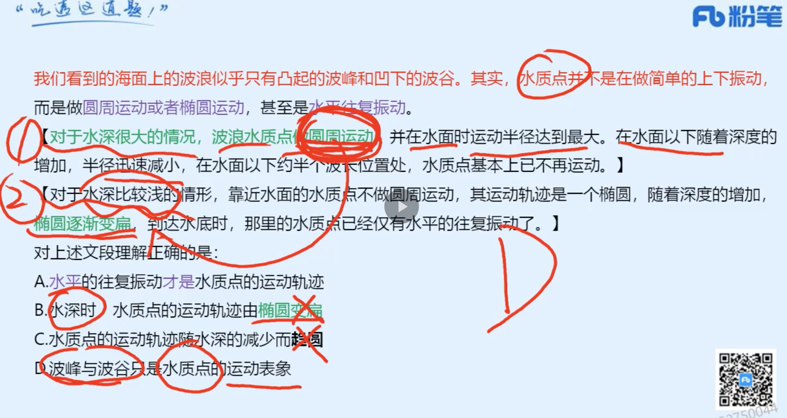

1. 早上判断40（完结）资料 10
2. 中午言语 40
3. 晚上判断20（新）
4. 晚上资料 10 
5. 晚上对答案（当天记录对答案）
6. 当天解决当天的。过去的不予解决。做好记录，周末解决。

### 言语
|  错误类型（为什么错）   | 统计次数  |
|  ----  | ----  |
|   | 1 |
|  | 1 |
|   | 1 |

- 1（1. 注意问题的关键词是：葫芦文化，而只有最后一句讲了葫芦文化。所以寓意吉祥更准确。）


```

葫芦谐音“福禄”，代表着中国人对美好生活的向往，是民族文化基因的重要组成部分。季羡林在对刘尧汉先生所著文章《论中华葫芦文化》的评述中提到，“我国民族确属兄弟民族，具有共同的原始葫芦文化传统”。葫芦外形柔和圆润、线条流畅，上下球体浑然天成，符合“尚和合”“求大同”的理念。“左瓢右瓢，可盛千百福禄；大肚小肚，能容天下万物”，葫芦蕴含着多层次的吉祥文化，幸福、平安、和谐、多子等。

这段文字意在说明葫芦文化：

A

源远流长

B

与时俱进

C

内涵丰富

D

寓意吉祥


正确答案是： D收起
解析
文段开篇指出葫芦的谐音并阐明其美好寓意，并通过季羡林的话进行论证，强调我们有共同的葫芦文化。后文由葫芦的外形引出其代表的美好理念，文段尾句再次强调葫芦蕴含丰富而吉祥的文化，故整个文段旨在强调葫芦寓意吉祥，对应D项。

A项，“源远流长”强调时间长，B项，“与时俱进”指随着时代的发展而进步，无中生有，排除；C项，“内涵丰富”表述不明确，文段重点强调葫芦内涵很吉祥，很好，排除。

故正确答案为D。

```
- 2（1. B错是因为不全面，宁愿选模糊的也不要选不全面的。B在另外里面提到，而另外之前提到的事C越少越容易生成）


```
常温常压下，天然气的气态轻烃有4种，甲烷、乙烷、丙烷和丁烷。轻烃的含碳数越高，每个分子里需要供给的氢的数量也越多。腐殖型有机质含氢的数量较少，无法为碳数较多的轻烃提供足够的氢。另外，随着碳数越多，轻烃的形成温度也依次升高。烃源岩在低温的时候（左右），就能够大量地生成甲烷。由于很多地方的地温达不到那么高，所以也无法形成高碳数的气态轻烃。

上述文段意在说明：

A

轻烃的含碳数越高，氢的数量也越多

B

含碳数越多，轻烃所需的温度也越高

C

在天然气中，甲烷是占比最多的成分

D

在天然气中，丁烷是占比最多的成分


正确答案是： C收起
解析
文段首先引出了“天然气的气态轻烃”这个话题，接着指出由于客观条件，碳数较多的轻烃无法获得足够的氢，故天然气中以低碳数的气态轻烃即甲烷为主，后文通过“另外”表并列，阐述轻烃随着碳数增多，形成温度也会发生变化，而多地都达不到的温度让气态轻烃无法形成高碳数的气态轻烃，只能生成甲烷。故文段通过并列结构，全面论述甲烷是天然气中占比最多的成分，对应C项。

A项“氢的数量”、B项“温度”分别对应并列的两个方面，表述片面，D项与文段表述完全相反。且A、B、D三项均未提到低碳数的气态轻烃即甲烷，主题词不符，排除。

故正确答案为C。

```
- 3（这段话其实说的是这个意思，通过鱼鳔引出了深海鱼抗压的方式。）


```


对于生活在浅海的硬骨鱼类来说，鱼鳔非常重要，可以帮助其调整浮力，实现上浮或下潜。但是对于深海鱼来说，充满气的鱼鳔像是脆弱的气球，在外部巨大水压的挤压下，会炸成碎片。因此，很多深海鱼在进化过程中“舍弃”了鱼鳔这个“危险”的部件，转而依靠某些脂类提供浮力。相比于浅海中的鱼，深海鱼的骨骼和肌肉含量都比较少，脂质和胶质相对较多。此外，深海鱼骨骼中软骨的比例也远高于浅海鱼。对于深海鱼来说，这些都是为了适应深海生活所作出的必要的“妥协”。毕竟相比于骨骼和肌肉，脂质和胶质能更好地帮助鱼类对抗巨大的压力。

最适合做这段文字标题的是：

A

深海鱼竟是“软骨头”

B

抗压，从鱼鳔的“断舍离”开始

C

精通以柔克刚的深海鱼

D

深海压力，无法承受之痛


正确答案是： B收起
解析
文段开篇介绍鱼鳔对于浅海硬骨鱼类的重要性，并通过转折关联词“但是”指出鱼鳔无法承受深海压力，接着通过“因此”总结前文，强调深海鱼为了承受水压而在进化过程中“舍弃”了鱼鳔，转而依靠某些脂类提供浮力。后文通过介绍深海鱼与浅海鱼在骨骼和肌肉含量等方面的不同，继续论述深海鱼类为了适应深海生活而作出的“妥协”。故文段强调深海鱼为了“抗压”而“舍弃”鱼鳔，依靠脂类，对应B项。

A项，“软骨头”对应“此外”之后的内容，表述片面，排除；

C项，未提及核心话题“抗压”，且文段指出深海鱼相对于浅海鱼的一些不同是“为了适应深海生活所作出的必要的‘妥协’”，“以柔克刚”指用柔软的去克制刚强的，与文意不符，排除；

D项，“无法承受之痛”文段并未提及，无中生有，且程度过重，排除。

故正确答案为B。

```
- 4（1. 错是因为没有理解）



```

我们看到的海面上的波浪似乎只有凸起的波峰和凹下的波谷。其实，水质点并不是在做简单的上下振动，而是做圆周运动或者椭圆运动，甚至是水平往复振动。对于水深很大的情况，波浪水质点做圆周运动，并在水面时运动半径达到最大。在水面以下随着深度的增加，半径迅速减小，在水面以下约半个波长位置处，水质点基本上已不再运动。对于水深比较浅的情形，靠近水面的水质点不做圆周运动，其运动轨迹是一个椭圆，随着深度的增加，椭圆逐渐变扁，到达水底时，那里的水质点已经仅有水平的往复振动了。

对上述文段理解正确的是：

A

水平的往复振动才是水质点的运动轨迹

B

水深时，水质点的运动轨迹由椭圆变扁

C

水质点的运动轨迹随水深的减少而趋圆

D

波峰与波谷只是水质点的运动表象


正确答案是： D收起
解析
A项，由“水质点并不是在做简单的上下振动，而是做圆周运动或者椭圆运动，甚至是水平往复振动”可知，水质点的运动轨迹并非只有“水平的往复振动”，还有“圆周运动或者椭圆运动”，表述错误，排除；

B项，由“对于水深很大的情况，波浪水质点做圆周运动”可知，在水深很大的情况下，水质点的运动轨迹并非椭圆，表述错误，排除；

C项，由“对于水深很大的情况，波浪水质点做圆周运动，并在水面时运动半径达到最大。在水面以下随着深度的增加，半径迅速减小”可知，在水深很大的情况下，水质点的运动轨迹一直都是圆周运动，“随水深的减少而趋圆”表述错误，排除；

D项，由“我们看到的海面上的波浪似乎只有凸起的波峰和凹下的波谷。其实，水质点并不是在做简单的上下振动”可知，表述正确，当选。
```
- 5（1. 讲了历史，面貌，文化，流传范围。所以应该选D这个范围更大。）


```
不久前，一个收获颇丰的考古队发现了一个来自伦敦泰晤士河泥泞河岸的玩具骑士。据悉，它已有1300年左右的历史。【讲历史】这个玩具为我们展现了中世纪儿童童年的一些面貌。【面貌】中世纪的人们和现在一样，有自己的文化。【文化】这个玩具骑士是使用模具批量生产而成。它可能流传于商人、店主、工匠、贵族和绅士家庭【流传】。

最适合做这段文字标题的是：

A

玩具是了解中世纪儿童童年的一扇窗户

B

中世纪父母对孩子的爱传承到今天

C

中世纪玩具的起源

D

中世纪玩具的考古价值


正确答案是： D收起
解析
文段开头引出考古队发现了中世纪玩具的话题，随后表示该玩具可再现中世纪儿童童年的部分生活面貌，并蕴涵相应文化，接着论述该玩具由模具批量生产，流传在各个阶层的家庭，故文段为并列结构，开头引出玩具话题，随后从儿童童年生活面貌、生活文化、制作工艺、流传范围不同角度，强调从该玩具可获知的关于中世纪的历史信息，对应D项。

A项，“了解中世纪儿童童年”对应文段“展现了中世纪儿童童年的一些面貌”，表述片面，排除；

B项，“父母对孩子的爱”文段未提及，无中生有，排除；

C项，“起源”文段未提及，无中生有，排除。

故正确答案为D。

```
- 6（1. 总分总 强调蜜蜂都离不开这种特殊味道的花蜜了）


```
美国《科学》杂志的一项研究表明：咖啡因是让蜜蜂忠诚专一的物质。正如咖啡因会刺激人类的大脑一样，这种化学物质也可以刺激蜜蜂的大脑，特别是其中一个叫蘑菇体的脑区域，这一区域跟气味的学习和记忆有关。咖啡因的摄入使得蜜蜂深刻地记住了在柑橘和咖啡花朵上采集花蜜这件事情，所以在接下来很长的一段时间里，蜜蜂都离不开这种特殊味道的花蜜了。

最适合这段文字标题的是：

A

花蜜与咖啡因

B

难以抗拒的咖啡因

C

蜜蜂为何“单恋一枝花”

D

蜜蜂学习和记忆的奥秘


正确答案是： C收起
解析
文段通过《科学》杂志的研究引出咖啡因让蜜蜂忠诚专一这一观点，接着通过“正如”用人类大脑作类比，来解释为何咖啡因能让蜜蜂记住在柑橘和咖啡花朵上采蜜的事，最后通过“所以”引导结论，即蜜蜂离不开这种特殊味道的花蜜了，故文段先提出观点，再进行原因解释，最后给出结论首尾呼应，强调的是蜜蜂“钟爱”特殊味道花蜜的原因，对应C项。

A、B两项，均未提到文段的核心话题“蜜蜂”，排除；

D项，“学习和记忆”对应原因解释部分，并非文段重点，且无法体现出“专一性”，排除。

故正确答案为C。

```
- 7（1. 前面先讲法律是他律，再讲道德是自律。然后这句话是作者观点，后面都是在论述作者观点：现代法治强调良法善治，实现这一目标离不开道德作用的发挥。2. 强调道德所以对应A选项。）


```
法律和道德都是具有一定约束性的社会规范，都能发挥规范人们行为的功能。法律更注重以国家的外在强制力保障规则实施，主要是一种他律。道德虽然也通过社会评价等方式产生外部约束作用，但更强调自律，通过人们内心的价值认同来感染人心、凝聚共识，实现个体对于道德规范的自愿遵从。现代法治强调良法善治，实现这一目标离不开道德作用的发挥。道德为法律创制提供伦理基础，为法律的正当性提供评判标准，也为法律实施提供道义支持，对于法治体系的建立和运行具有重要支撑作用。

这段文字意在说明：

A

良法善治的实现需要道德“保驾护航”

B

道德规范是现代法治精神的重要来源

C

法律和道德发挥作用的机制不同

D

法治和德治互为表里、不可偏废


正确答案是： A收起
解析
文段开篇指出法律和道德可以发挥约束、规范人们行为的功能，接着分别论述两者功能机制的不同侧重，之后指出现代法治的目标是良法善治，并通过“离不开、基础、标准、支持、重要支撑作用”强调道德对于实现这一目标的重要性，故文段为分总结构，重点强调实现良法善治离不开道德，对应A项。

B项，“现代法治精神的重要来源”文段并未提及，无中生有，排除；

C项，“机制不同”对应文段分述句部分的内容，非重点，排除；

D项，“法治和德治互为表里”文段并未提及，无中生有，排除。

故正确答案为A。

【文段出处】《以道德滋养法治精神》

```
- 8（1. 我觉得文章自始至终都在讨论首句的那个问题：教育与产业否能够采取产教融合的共同行动 2. 中间都是拿非研发创新或低技术创新的需求做解释 3. 后面又说这正是职业教育可以共同行动，采取产教融合的共同行动。）


```
教育与产业毕竟有不同的利益诉求，双方是否能够采取产教融合的共同行动？有学者认为，德国的传统中小企业中存在大量的非研发创新或低技术创新的需求，正是这类创新，而不是大企业的技术研发，确保了德国制造业的长盛不衰。中国的中小企业数量远远多于德国，其技术能力远远落后于大企业，有大量的非研发创新或低技术创新的需求。这正是职业教育可以发挥作用的空间。

这段文字意在强调：

A

职业教育实施产教融合是可能与可行的

B

中小企业要注重学习德国既有的成功经验

C

职业教育需要强化服务中小企业的意识

D

中小企业要关注非研发创新与低技术创新


正确答案是： A收起
解析
文段开篇提出问题，即教育与产业能否采取产教融合的共同行动，并以后文内容进行了回答。先以德国为例，说明德国传统中小企业中的非研发创新或低技术创新的需求保证了制造业的活力，接着对比指出中国中小企业也有大量的非研发创新或低技术创新的需求，尾句通过指代词“这”指代前文，强调职业教育大有可为。故尾句是对首句问题的回答，即职业教育可以采取产教融合的共同行动，对应A项。

B项，缺少主题词“职业教育”，且“学习德国既有的成功经验”文段未提及，无中生有，排除；

C项，“强化服务中小企业的意识”文段未提及，无中生有，排除。

D项，缺少主题词“职业教育”，且“要关注非研发创新与低技术创新”的对策无中生有，排除。

故正确答案为A。

视频


```
- 9（1. B项是对前文只靠引进是不行的解释，并且他在对策之前 2.有对策的对策最重要，前面都不重要 ）


```
过去几十年我们主要依靠引进外国技术实现发展，短期看这不失为加快经济发展的捷径，从长期看只靠引进是不行的，它会使我们与国外的技术差距越拉越大，将我们长期锁定在产业分工格局的低端。关键核心技术是要不来、买不来、讨不来的。为此，要加快推进国家重大科技专项，深入推进知识创新和技术创新，增强原始创新、集成创新和引进消化吸收再创新能力。

这段文字意在说明：

A

我国要不断提高自主创新能力

B

我国要逐步掌握关键核心技术

C

我国要依靠技术推动经济发展

D

我国要减少对国外技术的依赖


正确答案是： A收起
解析
文段开篇提出我国与国外的技术之间差距变大的问题，随后介绍“关键核心技术”靠引进是不行的，最后通过“为此”指代前文进行总结，并通过对策引导词“要”提出对策，即我国要深入推进创新，增强创新能力。故文段是分总结构，尾句为文段重点，核心话题为“创新”，对应A项。

B项，缺乏主题词“创新”，且“核心技术”处在对策之前，非重点，排除。

C项，缺乏主题词“创新”，且“依靠技术”对应文段开篇，非重点，排除。

D项，缺乏主题词“创新”，如何“减少对国外技术的依赖”表述不明确，文段已表明要靠创新实现发展，排除。

故正确答案为A。

```

### 判断

```
1. 我发现图推还是得把握图形规律
```
|  错误类型（为什么错）   | 统计次数  |
|  ----  | ----  |
|  图推 | 6 |
|  定义判断| 4 |
|   逻辑推理| 2 |
|   类比定义| 1 |

- 1(图形特征：元素组成相似，相同线条重复出现，优先考虑加减同异2. 图1和图2求异，相同部分去掉，不同部分保留，再顺时针或者逆时针旋转得到图3)


- 2(A,D.文章给的化学条件发生变化。同构选项发现ABC都是通过沉淀水发生的变化。但是D不是沉淀水发生变化。)
```
化学沉积作用是指在水介质中，以胶体溶液和真溶液形式搬运的物质到达适宜场所后，当化学条件发生变化时，产生沉淀、堆积的过程。其中，胶体溶液是指含有一定大小的固体颗粒物质或高分子化合物的溶液，真溶液是指透明度较高的水溶液。

根据上述定义，下列不属于化学沉积作用的是：

A

干旱气候区，湖水很少外泄，蒸发作用使湖水的氯化钠增加、累积，变成咸水湖

B

当海水中的绿色粘土矿物随水流动时，会和含有铝、铁的胶体物质聚合形成海绿石

C

富含磷质的海水上升至浅海区，因压力减小，温度升高，磷质析出、沉积而形成磷矿

D

湖泊里的生物骨骼，它们吸收了空气中的二氧化碳形成碳酸钙，当碳酸钙浓度达到一定程度就在海底堆积下来，形成石灰岩


正确答案是： D，你的答案是： A收起
解析
第一步：找出定义关键词。

化学沉积作用：“水介质”、“以胶体溶液和真溶液形式搬运”、“当化学条件发生变化时，产生沉淀、堆积”；

胶体溶液：“含有一定大小的固体颗粒物质或高分子化合物的溶液”；

真溶液：“透明度较高的水溶液”。

第二步：逐一分析选项。

A项：湖水是水介质，符合“透明度较高的水溶液”，蒸发使湖水的氯化钠增加累积，变成咸水湖，即湖水搬运的最终物质是氯化钠，符合“当化学条件发生变化时，产生沉淀、堆积”，符合定义，排除；

B项：海水是水介质，符合“透明度较高的水溶液”，绿色粘土矿物随海水流动和含有铝、铁的胶体物质聚合形成海绿石，符合“以胶体溶液和真溶液形式搬运”、“当化学条件发生变化时，产生沉淀、堆积”，符合定义，排除；

C项：海水是水介质，符合“透明度较高的水溶液”，压力减小、温度升高导致磷质析出沉积形成磷矿，符合“以胶体溶液和真溶液形式搬运”、“当化学条件发生变化时，产生沉淀、堆积”，符合定义，排除；

D项：湖泊是水介质，符合“透明度较高的水溶液”，但生物骨骼最终形成的石灰岩不是在真溶液形式搬运下发生的沉淀、堆积，属于生物沉积作用，不符合“当化学条件发生变化时，产生沉淀、堆积”，不符合定义，当选。

本题是选非题，故正确答案为D。

备注：本题很多学生比较纠结A项和D项，如下图所示，A项是在“化学沉积”相关文献中的典型案例，通过对比择优，本题问“不属于”，故小粉笔更倾向把答案给到D项。
```
- 3（1、题干中图形均由直线构成，考虑直线数，但整体数直线后没有规律，考虑线的细化考法 2、 线的平行有规律 ）


- 4(1. 不知道为什么错，这个很明显是左右翻转。第二排和第三排。其实第一排第二排旋转180度可以不用管的。)


```
本题为九宫格题。元素组成相同，优先考虑位置规律。九宫格优先看横行，第一行图1旋转得到图2，图2左右翻转得到图3，第二行验证符合此规律。第三行应用此规律，图1旋转得到图2，故？处图形由图2左右翻转得到，只有B项符合。

故正确答案为B。
```
- 5（1. A项的位置不对 2. 而D项同为反对关系：病毒和细菌是两种不同的病原微生物，二者为并列关系中的反对关系；熊猫和鲸鱼是两种不同的哺乳动物，二者为并列关系中的反对关系，前后逻辑关系一致，当选）
```
病毒 对于 （    ） 相当于 （    ） 对于 鲸鱼

A

疫苗；捕鲸船

B

微小；庞大

C

医生；渔夫

D

细菌；熊猫


正确答案是： D，你的答案是： A收起
解析
逐一代入选项。

A项：疫苗可以杀死病毒，二者为功能的对应关系；捕鲸船是一种专门用于捕鲸、加工鲸鱼的专用船，二者为工具的对应关系，前后逻辑关系不一致，排除；

B项：病毒是一种个体微小，结构简单的非细胞型生物，微小是病毒的属性，二者为属性对应关系；鲸鱼是体型庞大的海洋生物，庞大是鲸鱼的属性，二者为属性对应关系，但是前后顺序相反，前后逻辑关系不一致，排除；

C项：医生消灭病毒，二者为主宾关系；渔夫捕捉鲸鱼，二者为主宾关系，但是前后顺序相反，前后逻辑关系不一致，排除；

D项：病毒和细菌是两种不同的病原微生物，二者为并列关系中的反对关系；熊猫和鲸鱼是两种不同的哺乳动物，二者为并列关系中的反对关系，前后逻辑关系一致，当选。

故正确答案为D。
```
- 6（1. 错是因为没有画出清晰的逻辑图。）
```
只有缴纳会费，才能办理会员；只有办理会员才可以随便使用体育设备；如果不注册使用信用卡，就不能成为会员。

以下哪个不一定为真？

A

只有缴纳会费才能随便使用体育设备

B

如果是会员，那么可以随便使用体育设备

C

开通信用卡，未必可以随便使用体育设备

D

如果可以随便使用体育设备，那么一定开通了信用卡


正确答案是： B，你的答案是： A收起
解析
第一步：翻译题干。

①会员缴纳会费；

②随便使用体育设备会员；

③信用卡会员；

①和②可以递推出：④随便使用体育设备会员缴纳会费；

②和③逆否可以递推出：⑤随便使用体育设备会员信用卡。

第二步：逐一分析选项。

A项：翻译为：随便使用体育设备缴纳会费，是对④的肯前，肯前必肯后，可以推出，排除；

B项：翻译为：会员随便使用体育设备，是对②的肯后，肯后得不出必然结论，无法推出，当选；

C项：信用卡是对⑤的肯后，肯后得不出必然结论，所以是未必可以随便使用体育设备，可以推出，排除；

D项：翻译为：随便使用体育设备信用卡，是对⑤的肯前，肯前必肯后，可以推出，排除。

本题为选非题，故正确答案为B。
```
- 7（1. 知识点补充：什么是前提。就算说法是前提之意。也是把前提放在后面 2....一定要求...也是前推后。 ）
```
在知识经济时代，社会持续发展的前提之一是培养大量高素质人才，只有高校教育质量的提升才能培养出大量高素质人才，而高校教育质量的提升一定要求高校教师整体素养的提升。

如果以上陈述为真，则可以推出以下哪项：

A

只要社会持续发展，就要求提升高校教师整体素养

B

如果没有大量高素质人才，那么高校教育质量不会有提升

C

如果培养了大量高素质人才，那么社会就能持续发展

D

如果处在知识经济时代，高校教育质量必定有所提升


正确答案是： A，你的答案是： C收起
解析
第一步：翻译题干。

①社会持续发展培养大量高素质人才

②培养大量高素质人才高校教育质量提升

③高校教育质量提升高校教师整体素养提升

以上条件可以递推出：④社会持续发展培养大量高素质人才高校教育质量提升高校教师整体素养提升

第二步：逐一分析选项。

A项：翻译为社会持续发展提升高校教师整体素养，是对④的肯前，肯前必肯后，可以推出，当选；

B项：翻译为大量高素质人才高校教育质量提升，是对②的否前，否前得不出必然结论，无法推出，排除；

C项：翻译为培养大量高素质人才社会持续发展，是对①的肯后，肯后得不出必然结论，无法推出，排除；

D项：翻译为知识经济时代高校教育质量提升，题干中“知识经济时代”和“高校教育质量提升”之间没有推出关系，无法推出，排除。

故正确答案为A。
```
- 8（1. CD两项，D是只是培养学生区分 而不是饮食习惯。还得脑补一下学生能区分就代表懂营养。但是C就直接是科普营养。）
```
食育行动是指通过科学的营养知识普及活动，以适合一国国情的方式，让居民渐渐养成良好的饮食生活习惯，其意义在于提升公民的营养知识，继承传统饮食文化，培养良好饮食习惯，倡导低碳消费，并最终实现人与自然的和谐相处。

根据上述定义，下列属于食育行动的是：

A

烹饪学校要求学生安全地使用工具处理食材

B

社区开展帮助居民改善健康状况的体育锻炼活动

C

有关部门颁布了《国民营养计划（2017-2030年）》

D

某食品学院培养学生能够分辨天然食材与加工食材


正确答案是： C，你的答案是： D收起
解析
第一步：找出定义关键词。

“科学的营养知识普及活动”、“适合一国国情”、“让居民渐渐养成良好的饮食生活习惯”。 

第二步：逐一分析选项。

A项：烹饪学校要求学生安全地使用工具处理食材，是针对特定学生的要求，不符合“科学的营养知识普及活动”、“让居民渐渐养成良好的饮食生活习惯”，不符合定义，排除；

B项：社区开展体育锻炼活动帮助居民改善健康状况，不符合“科学的营养知识普及活动”、“适合一国国情”、“让居民渐渐养成良好的饮食生活习惯”，不符合定义，排除；

C项：有关部门颁布了《国民营养计划（2017-2030年）》，针对的是本国国民的饮食生活，符合“科学的营养知识普及活动”、“适合一国国情”、“让居民渐渐养成良好的饮食生活习惯”，符合定义，当选；

D项：某食品学院培养学生能够分辨食材，是针对特定学生的要求，不符合“科学的营养知识普及活动”、“让居民渐渐养成良好的饮食生活习惯”，不符合定义，排除。

故正确答案为C。
```
- 9


- 10(1. 没有找到关键词：在最后一句。主观资质过剩指劳动者对这种情况的主观评估或感受，也被称为资质过剩感。 2. 应该是个人感觉。)
```
劳动者的受教育水平、工作经验或知识、技能、能力高于岗位需求的现象被称为资质过剩。客观资质过剩指劳动者实际拥有的任职资格超出岗位平均需求的情况，主观资质过剩指劳动者对这种情况的主观评估或感受，也被称为资质过剩感。

根据上述定义，以下符合资质过剩感的是：

A

小张想要离职，他觉得自己的技能和目前岗位不够匹配，一些工作技能用不上

B

小梁去公司应聘，招聘者认为小梁的条件已超出该岗位要求，小梁顺利入职

C

小方未能升职为市场总监，很不高兴，她觉得以自己的能力早就该升职了

D

小江一直做公司会计，他的朋友都觉得，以小江的资质一直做普通会计太屈才了


正确答案是： C，你的答案是： B收起
解析
第一步：找出定义关键词。

资质过剩：“劳动者的受教育水平、工作经验或知识、技能、能力高于岗位需求”；

客观资质过剩：“劳动者实际拥有的任职资格超出岗位平均需求的情况”；

主观资质过剩（资质过剩感）：“劳动者对这种情况（指资质过剩）的主观评估或感受”。

第二步：逐一分析选项。

A项：小张认为自己的技能和岗位不够匹配，一些工作技能用不上，但是技能和岗位不够匹配并不代表小张的技能高于岗位需求，不符合“劳动者的受教育水平、工作经验或知识、技能、能力高于岗位需求”，不符合资质过剩感，排除；

B项：招聘者认为小梁的条件超出岗位要求，并不是劳动者小梁的主观感受，不符合“劳动者对这种情况（指资质过剩）的主观评估或感受”，不符合资质过剩感，排除；

C项：小方认为按照自己的能力早就该升职，说明小方认为自己的能力超过目前其所在的岗位需求，符合“劳动者的受教育水平、工作经验或知识、技能、能力高于岗位需求”，也符合“劳动者对这种情况（指资质过剩）的主观评估或感受”，符合资质过剩感，当选；

D项：小江的朋友认为小江的资质一直做普通会计屈才，并不是劳动者小江的主观感受，不符合“劳动者对这种情况（指资质过剩）的主观评估或感受”，不符合资质过剩感，排除。

故正确答案为C。
```
- 11（1. 注意题目的逻辑意思：有A有B，没A没B 2. 注意限定词：各个。所以A是一种场景，那么就不符合。）
```
契合差异并用法是判明现象因果关系的一种归纳方法。先确定某现象出现的各个场合里其唯一共同点在于有某条件，某现象不出现的各个场合里其唯一共同点正好在于不具有该条件，再把上述结果加以比较，从而判明该条件与某现象有因果联系。

根据上述定义，下列属于契合差异并用法的是：

A

在土壤等都相同的两块土地上种同一品种作物，一块施肥一块不施肥，结果施肥的产量高，不施肥的产量低，说明施肥是产量高的原因

B

某地长寿老人在当地人口中占比极高，经调查研究发现，该地空气中的负离子非常高，因此负离子高的空气是老人长寿的原因

C

医疗队在几个甲状腺肿大流行病区的水域中检测不出碘，而在一些非流行病区能检测出碘，说明碘缺乏是造成甲状腺肿大的原因

D

一定压力下的一定量气体，温度升高，体积增大；温度降低，体积缩小。这说明气体温度的改变是其体积改变的原因


正确答案是： C，你的答案是： A收起
解析
第一步：找出定义关键词。

“某现象出现的各个场合唯一共同点在于有某条件”、“某现象不出现的各个场合里唯一共同点在于不具有该条件”、“判明该条件与某现象有因果联系”。

第二步：逐一分析选项。

A项：该项指出在土壤等都相同的两块土地上种同一品种作物，一块施肥一块不施肥，这里只是采用了控制变量的方式进行实验，没有提及某现象出现的各个场合，也没有提及某现象不出现的各个场合，不符合“某现象出现的各个场合唯一共同点在于有某条件”、“某现象不出现的各个场合里唯一共同点在于不具有该条件”，不符合定义，排除；

B项：该项只分析了某地长寿老人人口占比高，是因为该地空气中的负离子高，并没有分析其他长寿老人人口占比高的地方，是否空气中的负离子同样高，不符合“某现象出现的各个场合唯一共同点在于有某条件”，也没有分析其他长寿老人人口占比不高的地方，是否空气中的负离子也不高，不符合“某现象不出现的各个场合里唯一共同点在于不具有该条件”，不符合定义，排除；

C项：医疗队在几个甲状腺肿大流行病区的水域中检测不出碘，即存在碘缺乏（条件）是甲状腺肿大流行病区（某现象出现的各个场合）的共同点，符合“某现象出现的各个场合唯一共同点在于有某条件”，而在一些非流行病区能检测出碘，即不存在碘缺乏（不具有该条件）是甲状腺肿大非流行病区（某现象不出现的各个场合）的共同点，符合“某现象不出现的各个场合里唯一共同点在于不具有该条件”，根据以上两点最终得出碘缺乏是造成甲状腺肿大的原因，符合“判明该条件与某现象有因果联系”，符合定义，当选；

D项：该项指出一定压力下的一定量气体，温度和体积存在正比的关系，这里只是研究了两种物理量之间的变化关系，没有提及某现象出现的各个场合，也没有提及某现象不出现的各个场合，不符合“某现象出现的各个场合唯一共同点在于有某条件”、“某现象不出现的各个场合里唯一共同点在于不具有该条件”，不符合定义，排除。

故正确答案为C。
```
- 12（1. D项，公共点，画面法）


```
注意：有两个公共面就不要做了，做五分钟都做不出来，用排除法
```
### 资料
|  错误类型（为什么错）   | 统计次数  |
|  ----  | ----  |
|   | 1 |
|  | 1 |
|   | 1 |

- 3


```

```