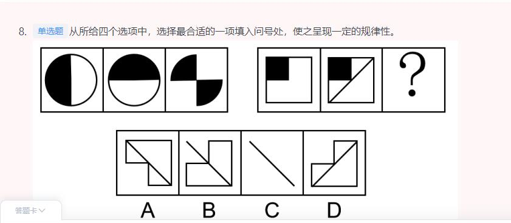
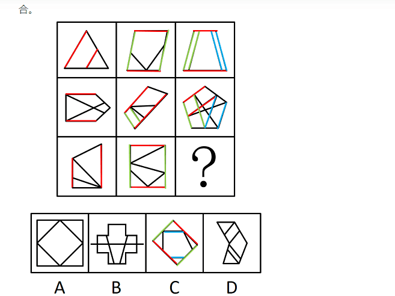
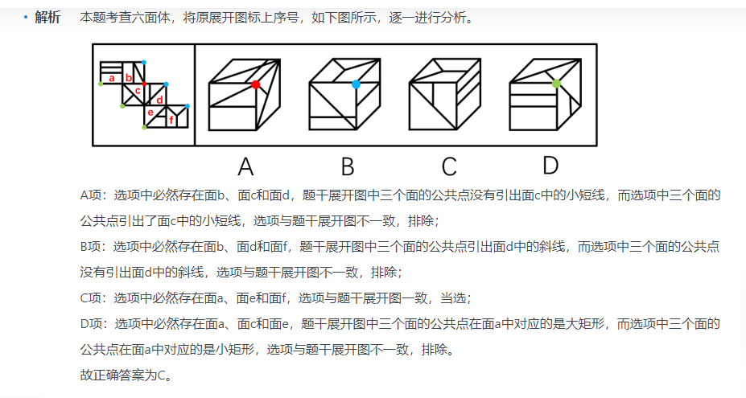

1. 早上判断40（完结）资料 10
2. 中午言语 40
3. 晚上判断20（新）
4. 晚上资料 10 
5. 晚上对答案（当天记录对答案）
6. 当天解决当天的。过去的不予解决。做好记录，周末解决。

### 言语
|  错误类型（为什么错）   | 统计次数  |
|  ----  | ----  |
|   | 1 |
|  | 1 |
|   | 1 |

- 1


```


```
### 判断

```
1. 我发现图推还是得把握图形规律
```
|  错误类型（为什么错）   | 统计次数  |
|  ----  | ----  |
|  图推 | 6 |
|  定义判断| 4 |
|   逻辑推理| 2 |
|   类比定义| 1 |

- 1(图形特征：元素组成相似，相同线条重复出现，优先考虑加减同异2. 图1和图2求异，相同部分去掉，不同部分保留，再顺时针或者逆时针旋转得到图3)



- 2(A,D.文章给的化学条件发生变化。同构选项发现ABC都是通过沉淀水发生的变化。但是D不是沉淀水发生变化。)
```
化学沉积作用是指在水介质中，以胶体溶液和真溶液形式搬运的物质到达适宜场所后，当化学条件发生变化时，产生沉淀、堆积的过程。其中，胶体溶液是指含有一定大小的固体颗粒物质或高分子化合物的溶液，真溶液是指透明度较高的水溶液。

根据上述定义，下列不属于化学沉积作用的是：

A

干旱气候区，湖水很少外泄，蒸发作用使湖水的氯化钠增加、累积，变成咸水湖

B

当海水中的绿色粘土矿物随水流动时，会和含有铝、铁的胶体物质聚合形成海绿石

C

富含磷质的海水上升至浅海区，因压力减小，温度升高，磷质析出、沉积而形成磷矿

D

湖泊里的生物骨骼，它们吸收了空气中的二氧化碳形成碳酸钙，当碳酸钙浓度达到一定程度就在海底堆积下来，形成石灰岩


正确答案是： D，你的答案是： A收起
解析
第一步：找出定义关键词。

化学沉积作用：“水介质”、“以胶体溶液和真溶液形式搬运”、“当化学条件发生变化时，产生沉淀、堆积”；

胶体溶液：“含有一定大小的固体颗粒物质或高分子化合物的溶液”；

真溶液：“透明度较高的水溶液”。

第二步：逐一分析选项。

A项：湖水是水介质，符合“透明度较高的水溶液”，蒸发使湖水的氯化钠增加累积，变成咸水湖，即湖水搬运的最终物质是氯化钠，符合“当化学条件发生变化时，产生沉淀、堆积”，符合定义，排除；

B项：海水是水介质，符合“透明度较高的水溶液”，绿色粘土矿物随海水流动和含有铝、铁的胶体物质聚合形成海绿石，符合“以胶体溶液和真溶液形式搬运”、“当化学条件发生变化时，产生沉淀、堆积”，符合定义，排除；

C项：海水是水介质，符合“透明度较高的水溶液”，压力减小、温度升高导致磷质析出沉积形成磷矿，符合“以胶体溶液和真溶液形式搬运”、“当化学条件发生变化时，产生沉淀、堆积”，符合定义，排除；

D项：湖泊是水介质，符合“透明度较高的水溶液”，但生物骨骼最终形成的石灰岩不是在真溶液形式搬运下发生的沉淀、堆积，属于生物沉积作用，不符合“当化学条件发生变化时，产生沉淀、堆积”，不符合定义，当选。

本题是选非题，故正确答案为D。

备注：本题很多学生比较纠结A项和D项，如下图所示，A项是在“化学沉积”相关文献中的典型案例，通过对比择优，本题问“不属于”，故小粉笔更倾向把答案给到D项。
```
- 3（1、题干中图形均由直线构成，考虑直线数，但整体数直线后没有规律，考虑线的细化考法 2、 线的平行有规律 ）




- 4(1. 不知道为什么错，这个很明显是左右翻转。第二排和第三排。其实第一排第二排旋转180度可以不用管的。)


```
本题为九宫格题。元素组成相同，优先考虑位置规律。九宫格优先看横行，第一行图1旋转得到图2，图2左右翻转得到图3，第二行验证符合此规律。第三行应用此规律，图1旋转得到图2，故？处图形由图2左右翻转得到，只有B项符合。

故正确答案为B。
```
- 5（1. A项的位置不对 2. 而D项同为反对关系：病毒和细菌是两种不同的病原微生物，二者为并列关系中的反对关系；熊猫和鲸鱼是两种不同的哺乳动物，二者为并列关系中的反对关系，前后逻辑关系一致，当选）
```
病毒 对于 （    ） 相当于 （    ） 对于 鲸鱼

A

疫苗；捕鲸船

B

微小；庞大

C

医生；渔夫

D

细菌；熊猫


正确答案是： D，你的答案是： A收起
解析
逐一代入选项。

A项：疫苗可以杀死病毒，二者为功能的对应关系；捕鲸船是一种专门用于捕鲸、加工鲸鱼的专用船，二者为工具的对应关系，前后逻辑关系不一致，排除；

B项：病毒是一种个体微小，结构简单的非细胞型生物，微小是病毒的属性，二者为属性对应关系；鲸鱼是体型庞大的海洋生物，庞大是鲸鱼的属性，二者为属性对应关系，但是前后顺序相反，前后逻辑关系不一致，排除；

C项：医生消灭病毒，二者为主宾关系；渔夫捕捉鲸鱼，二者为主宾关系，但是前后顺序相反，前后逻辑关系不一致，排除；

D项：病毒和细菌是两种不同的病原微生物，二者为并列关系中的反对关系；熊猫和鲸鱼是两种不同的哺乳动物，二者为并列关系中的反对关系，前后逻辑关系一致，当选。

故正确答案为D。
```
- 6（1. 错是因为没有画出清晰的逻辑图。）
```
只有缴纳会费，才能办理会员；只有办理会员才可以随便使用体育设备；如果不注册使用信用卡，就不能成为会员。

以下哪个不一定为真？

A

只有缴纳会费才能随便使用体育设备

B

如果是会员，那么可以随便使用体育设备

C

开通信用卡，未必可以随便使用体育设备

D

如果可以随便使用体育设备，那么一定开通了信用卡


正确答案是： B，你的答案是： A收起
解析
第一步：翻译题干。

①会员缴纳会费；

②随便使用体育设备会员；

③信用卡会员；

①和②可以递推出：④随便使用体育设备会员缴纳会费；

②和③逆否可以递推出：⑤随便使用体育设备会员信用卡。

第二步：逐一分析选项。

A项：翻译为：随便使用体育设备缴纳会费，是对④的肯前，肯前必肯后，可以推出，排除；

B项：翻译为：会员随便使用体育设备，是对②的肯后，肯后得不出必然结论，无法推出，当选；

C项：信用卡是对⑤的肯后，肯后得不出必然结论，所以是未必可以随便使用体育设备，可以推出，排除；

D项：翻译为：随便使用体育设备信用卡，是对⑤的肯前，肯前必肯后，可以推出，排除。

本题为选非题，故正确答案为B。
```
- 7（1. 知识点补充：什么是前提。就算说法是前提之意。也是把前提放在后面 2....一定要求...也是前推后。 ）
```
在知识经济时代，社会持续发展的前提之一是培养大量高素质人才，只有高校教育质量的提升才能培养出大量高素质人才，而高校教育质量的提升一定要求高校教师整体素养的提升。

如果以上陈述为真，则可以推出以下哪项：

A

只要社会持续发展，就要求提升高校教师整体素养

B

如果没有大量高素质人才，那么高校教育质量不会有提升

C

如果培养了大量高素质人才，那么社会就能持续发展

D

如果处在知识经济时代，高校教育质量必定有所提升


正确答案是： A，你的答案是： C收起
解析
第一步：翻译题干。

①社会持续发展培养大量高素质人才

②培养大量高素质人才高校教育质量提升

③高校教育质量提升高校教师整体素养提升

以上条件可以递推出：④社会持续发展培养大量高素质人才高校教育质量提升高校教师整体素养提升

第二步：逐一分析选项。

A项：翻译为社会持续发展提升高校教师整体素养，是对④的肯前，肯前必肯后，可以推出，当选；

B项：翻译为大量高素质人才高校教育质量提升，是对②的否前，否前得不出必然结论，无法推出，排除；

C项：翻译为培养大量高素质人才社会持续发展，是对①的肯后，肯后得不出必然结论，无法推出，排除；

D项：翻译为知识经济时代高校教育质量提升，题干中“知识经济时代”和“高校教育质量提升”之间没有推出关系，无法推出，排除。

故正确答案为A。
```
- 8（1. CD两项，D是只是培养学生区分 而不是饮食习惯。还得脑补一下学生能区分就代表懂营养。但是C就直接是科普营养。）
```
食育行动是指通过科学的营养知识普及活动，以适合一国国情的方式，让居民渐渐养成良好的饮食生活习惯，其意义在于提升公民的营养知识，继承传统饮食文化，培养良好饮食习惯，倡导低碳消费，并最终实现人与自然的和谐相处。

根据上述定义，下列属于食育行动的是：

A

烹饪学校要求学生安全地使用工具处理食材

B

社区开展帮助居民改善健康状况的体育锻炼活动

C

有关部门颁布了《国民营养计划（2017-2030年）》

D

某食品学院培养学生能够分辨天然食材与加工食材


正确答案是： C，你的答案是： D收起
解析
第一步：找出定义关键词。

“科学的营养知识普及活动”、“适合一国国情”、“让居民渐渐养成良好的饮食生活习惯”。 

第二步：逐一分析选项。

A项：烹饪学校要求学生安全地使用工具处理食材，是针对特定学生的要求，不符合“科学的营养知识普及活动”、“让居民渐渐养成良好的饮食生活习惯”，不符合定义，排除；

B项：社区开展体育锻炼活动帮助居民改善健康状况，不符合“科学的营养知识普及活动”、“适合一国国情”、“让居民渐渐养成良好的饮食生活习惯”，不符合定义，排除；

C项：有关部门颁布了《国民营养计划（2017-2030年）》，针对的是本国国民的饮食生活，符合“科学的营养知识普及活动”、“适合一国国情”、“让居民渐渐养成良好的饮食生活习惯”，符合定义，当选；

D项：某食品学院培养学生能够分辨食材，是针对特定学生的要求，不符合“科学的营养知识普及活动”、“让居民渐渐养成良好的饮食生活习惯”，不符合定义，排除。

故正确答案为C。
```
- 9


- 10(1. 没有找到关键词：在最后一句。主观资质过剩指劳动者对这种情况的主观评估或感受，也被称为资质过剩感。 2. 应该是个人感觉。)
```
劳动者的受教育水平、工作经验或知识、技能、能力高于岗位需求的现象被称为资质过剩。客观资质过剩指劳动者实际拥有的任职资格超出岗位平均需求的情况，主观资质过剩指劳动者对这种情况的主观评估或感受，也被称为资质过剩感。

根据上述定义，以下符合资质过剩感的是：

A

小张想要离职，他觉得自己的技能和目前岗位不够匹配，一些工作技能用不上

B

小梁去公司应聘，招聘者认为小梁的条件已超出该岗位要求，小梁顺利入职

C

小方未能升职为市场总监，很不高兴，她觉得以自己的能力早就该升职了

D

小江一直做公司会计，他的朋友都觉得，以小江的资质一直做普通会计太屈才了


正确答案是： C，你的答案是： B收起
解析
第一步：找出定义关键词。

资质过剩：“劳动者的受教育水平、工作经验或知识、技能、能力高于岗位需求”；

客观资质过剩：“劳动者实际拥有的任职资格超出岗位平均需求的情况”；

主观资质过剩（资质过剩感）：“劳动者对这种情况（指资质过剩）的主观评估或感受”。

第二步：逐一分析选项。

A项：小张认为自己的技能和岗位不够匹配，一些工作技能用不上，但是技能和岗位不够匹配并不代表小张的技能高于岗位需求，不符合“劳动者的受教育水平、工作经验或知识、技能、能力高于岗位需求”，不符合资质过剩感，排除；

B项：招聘者认为小梁的条件超出岗位要求，并不是劳动者小梁的主观感受，不符合“劳动者对这种情况（指资质过剩）的主观评估或感受”，不符合资质过剩感，排除；

C项：小方认为按照自己的能力早就该升职，说明小方认为自己的能力超过目前其所在的岗位需求，符合“劳动者的受教育水平、工作经验或知识、技能、能力高于岗位需求”，也符合“劳动者对这种情况（指资质过剩）的主观评估或感受”，符合资质过剩感，当选；

D项：小江的朋友认为小江的资质一直做普通会计屈才，并不是劳动者小江的主观感受，不符合“劳动者对这种情况（指资质过剩）的主观评估或感受”，不符合资质过剩感，排除。

故正确答案为C。
```
- 11（1. 注意题目的逻辑意思：有A有B，没A没B 2. 注意限定词：各个。所以A是一种场景，那么就不符合。）
```
契合差异并用法是判明现象因果关系的一种归纳方法。先确定某现象出现的各个场合里其唯一共同点在于有某条件，某现象不出现的各个场合里其唯一共同点正好在于不具有该条件，再把上述结果加以比较，从而判明该条件与某现象有因果联系。

根据上述定义，下列属于契合差异并用法的是：

A

在土壤等都相同的两块土地上种同一品种作物，一块施肥一块不施肥，结果施肥的产量高，不施肥的产量低，说明施肥是产量高的原因

B

某地长寿老人在当地人口中占比极高，经调查研究发现，该地空气中的负离子非常高，因此负离子高的空气是老人长寿的原因

C

医疗队在几个甲状腺肿大流行病区的水域中检测不出碘，而在一些非流行病区能检测出碘，说明碘缺乏是造成甲状腺肿大的原因

D

一定压力下的一定量气体，温度升高，体积增大；温度降低，体积缩小。这说明气体温度的改变是其体积改变的原因


正确答案是： C，你的答案是： A收起
解析
第一步：找出定义关键词。

“某现象出现的各个场合唯一共同点在于有某条件”、“某现象不出现的各个场合里唯一共同点在于不具有该条件”、“判明该条件与某现象有因果联系”。

第二步：逐一分析选项。

A项：该项指出在土壤等都相同的两块土地上种同一品种作物，一块施肥一块不施肥，这里只是采用了控制变量的方式进行实验，没有提及某现象出现的各个场合，也没有提及某现象不出现的各个场合，不符合“某现象出现的各个场合唯一共同点在于有某条件”、“某现象不出现的各个场合里唯一共同点在于不具有该条件”，不符合定义，排除；

B项：该项只分析了某地长寿老人人口占比高，是因为该地空气中的负离子高，并没有分析其他长寿老人人口占比高的地方，是否空气中的负离子同样高，不符合“某现象出现的各个场合唯一共同点在于有某条件”，也没有分析其他长寿老人人口占比不高的地方，是否空气中的负离子也不高，不符合“某现象不出现的各个场合里唯一共同点在于不具有该条件”，不符合定义，排除；

C项：医疗队在几个甲状腺肿大流行病区的水域中检测不出碘，即存在碘缺乏（条件）是甲状腺肿大流行病区（某现象出现的各个场合）的共同点，符合“某现象出现的各个场合唯一共同点在于有某条件”，而在一些非流行病区能检测出碘，即不存在碘缺乏（不具有该条件）是甲状腺肿大非流行病区（某现象不出现的各个场合）的共同点，符合“某现象不出现的各个场合里唯一共同点在于不具有该条件”，根据以上两点最终得出碘缺乏是造成甲状腺肿大的原因，符合“判明该条件与某现象有因果联系”，符合定义，当选；

D项：该项指出一定压力下的一定量气体，温度和体积存在正比的关系，这里只是研究了两种物理量之间的变化关系，没有提及某现象出现的各个场合，也没有提及某现象不出现的各个场合，不符合“某现象出现的各个场合唯一共同点在于有某条件”、“某现象不出现的各个场合里唯一共同点在于不具有该条件”，不符合定义，排除。

故正确答案为C。
```
- 12（1. D项，公共点，画面法）


```
注意：有两个公共面就不要做了，做五分钟都做不出来，用排除法
```
### 资料
|  错误类型（为什么错）   | 统计次数  |
|  ----  | ----  |
|   | 1 |
|  | 1 |
|   | 1 |

- 3


```

```