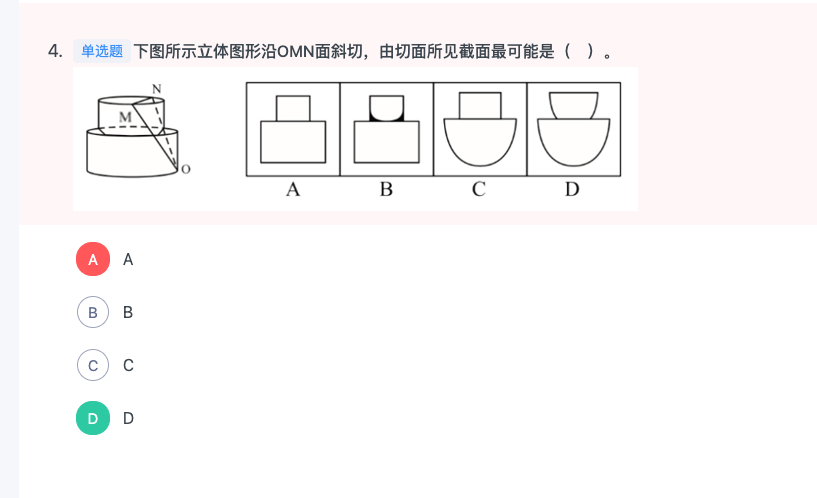
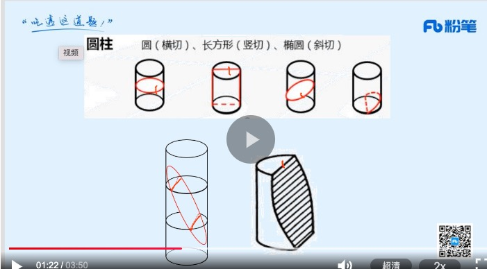
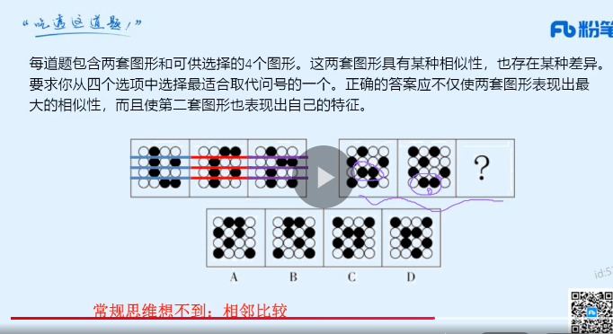
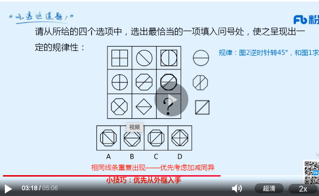
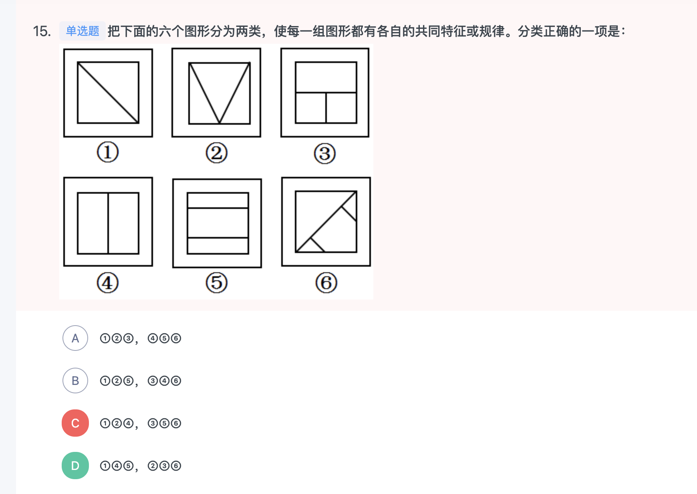
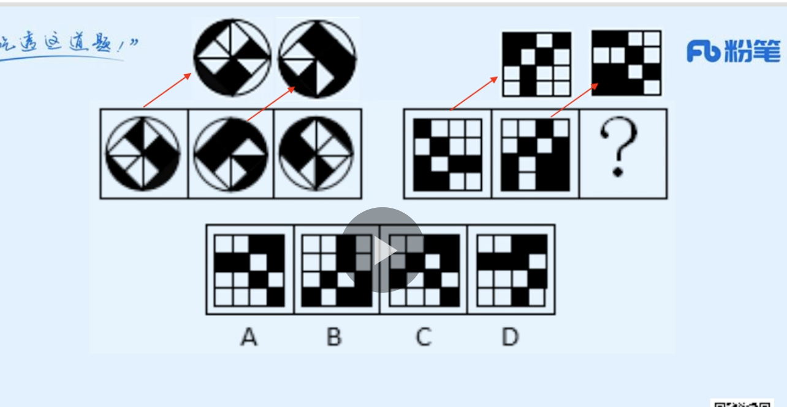
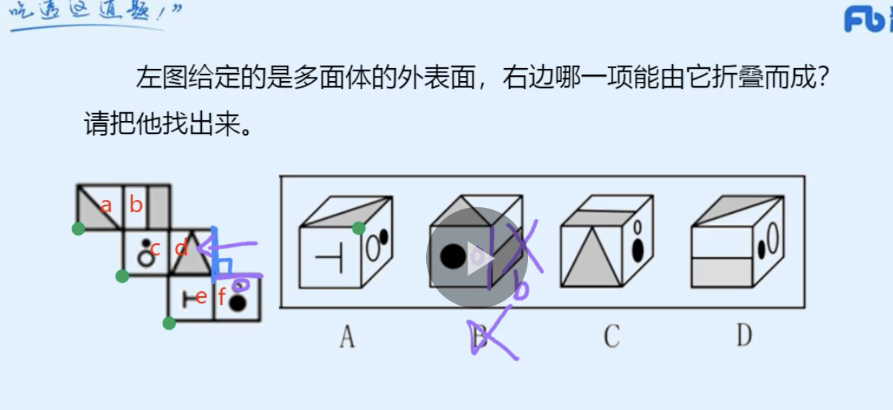
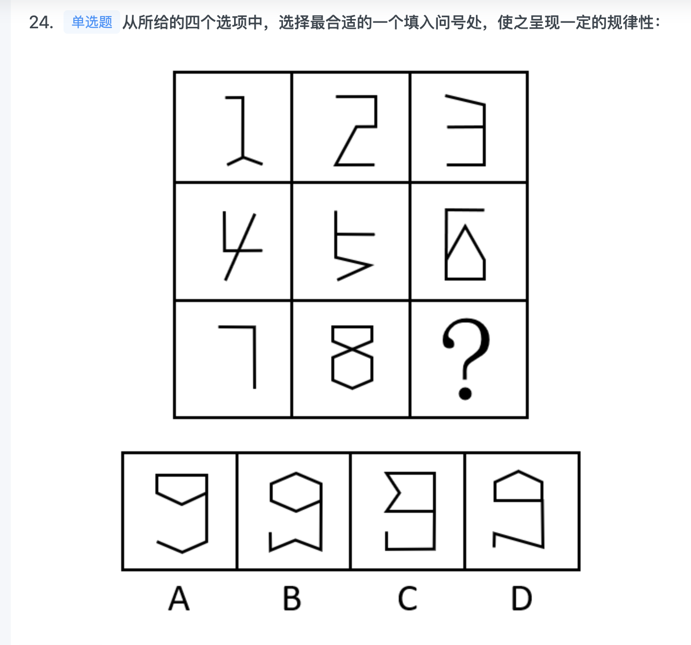
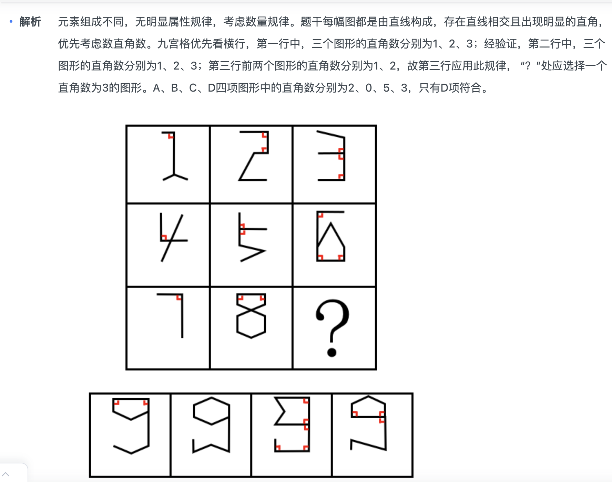
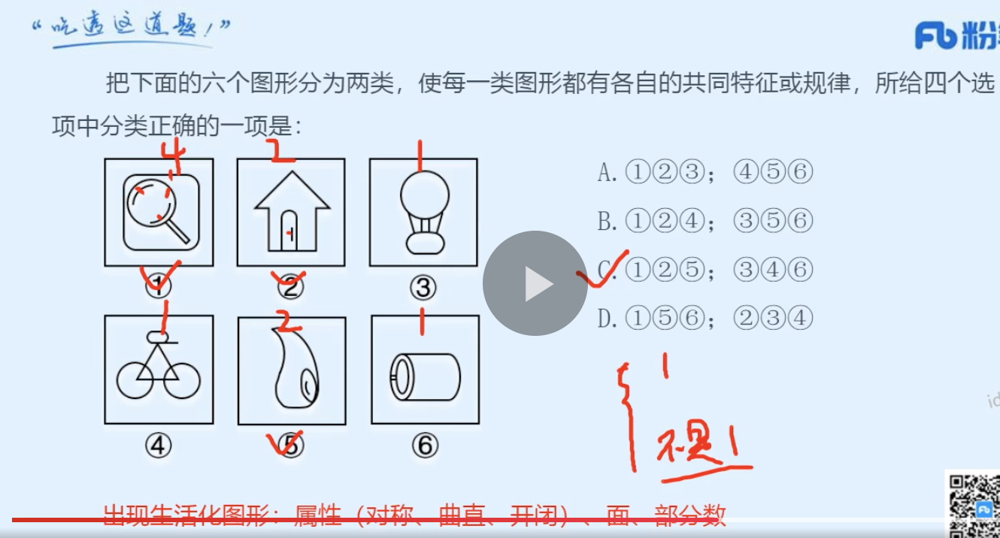

1. 早上判断40（完结）资料 10
2. 中午言语 40
3. 晚上判断20（新）
4. 晚上资料 10 
5. 晚上对答案（当天记录对答案）
6. 当天解决当天的。过去的不予解决。做好记录，周末解决。

### 言语
|  错误类型（为什么错）   | 统计次数  |
|  ----  | ----  |
|   | 1 |
|  | 1 |
|   | 1 |

- 1(1. 创造这里不合适 2. 制造，打造主语是人 3. 常用搭配：云的凝结)


```
在高山相夹的谷底，有时能直观地看到地形对云的        ：气流翻山越岭被抬升形成波动气流，在气流的波峰与波谷之前，云也随之上下扭曲。在一些情况下，大气温度和高度呈反比，处于波谷处的温度更高，达不到云        的温度，而波峰处的温度可以形成云，这样就形成了有云和无云条带反复交错的波状云天空。

依次填入划横线部分最恰当的一项是：

A

塑造 凝结

B

制造 凝集

C

打造 凝聚

D

创造 凝固


正确答案是： A收起
解析
第一空，横线后出现冒号提示解释类对应，根据“气流翻山越岭被抬升形成波动气流，在气流的波峰与波谷之前，云也随之上下扭曲”可知，文段意在说明地形对云的形状产生影响。A项“塑造”指通过培养、改造使人或事物达到某种预定的目标，可体现“影响”之意，保留。B项“制造”、C项“打造”、D项“创造”均强调从无到有的过程，而文段中云已然存在，强调的是地形对云的形状产生影响，与文意不符，排除。

第二空，代入验证，A项“凝结”能体现水蒸气变成云的过程，搭配恰当，符合文意，当选。

故正确答案为A。

```
- 2(1.分总分 2.反面提对策：如果遇到这种情况，互相指责、争论或者装作漠不关心，都是错误而且缺乏远见的。 )

```
在科学研究中，同样的研究得到不同的结果，很正常，很普遍。生命科学目前还停留在实验科学阶段，由于实验条件、样品、动物、仪器设备、实验技术略有不同而得到完全不同的结果，也不意外。如果遇到这种情况，互相指责、争论或者装作漠不关心，都是错误而且缺乏远见的。从个人事业看，这种做法会损害一个人在学术领域内的名声和信誉；如果作为导师，还会误导学生在未来学术发展中的判断，甚至影响他们的人生观。从社会的角度来看，如果利用错误的实验结果获得风险投资并针对疾病开发治疗药物，则是对宝贵社会资源的巨大浪费。

这段文字意在讨论：

A

生命科学研究为什么具有特殊性

B

科学家保持严谨求实精神很重要

C

用正确态度与方法面对学术争议

D

可靠的实验流程有哪些现实意义


正确答案是： C收起
解析
文段开篇指出同样的科学研究得出不同结果是很正常的，并指出在生命科学中由于一些因素出现这种情况也不意外，接着通过反面论证，提出面对这种学术争议，不能采取互相指责、争论或者装作漠不关心等错误的态度与方法，随后通过个人和社会的角度对前文观点进行论证，故文段为分总分结构，强调要用正确态度与方法面对学术争议，对应C项。

A项，“生命科学研究为什么具有特殊性”文段并未提及，无中生有，排除；

B项，文段重点围绕遇到学术争议应该如何处理展开论述，该项偏离文段核心话题，且“严谨求实精神”文段并未提及，无中生有，排除；

D项，“实验流程”文段并未提及，无中生有，排除。

故正确答案为C。
```
- 3(这道题要保证前后话题一致，文章主题主要讲的是市场。所以这里B)

```
农民卖粮舒心，源于市场之“手”用得好。2020年的夏粮生产，不仅数量增加，质量也在提升。一个重要指标就是专用麦比例高，全国优质强筋弱筋小麦面积占比，比上年提高2.8个百分点。从目前收购市场情况看，每斤优质小麦要比普通品种高出0.1元左右。这背后，                    。如今，多元化市场主体入市收购，既让丰收粮有了更加多样化的销售渠道，也让优质粮食品种销路更好、价格更高，优粮优价成为种粮农民增收的“金钥匙”。

填入画横线部分最恰当的一项是：

A

说到底就是稳住这些农民的种粮收益，保护农民的种粮积极性

B

正是粮食收储制度改革持续推进，市场机制作用得到更好发挥

C

全国农户构成了粮食安全的坚强基石，稳住粮食生产的好形势

D

通过优化供给体系，拓展粮食产加销增值空间，分享增值收益


正确答案是： B收起
解析
本题为语句填空题，横线在文段中间，需联系前后文把握话题的一致性。横线前首先指出农民粮食卖的好得益于市场，紧接着指出全国优质强筋弱筋小麦面积占比不断提高且价格也高于普通品种，横线后论述“多元化市场主体入市收购”使得优质粮食品种销路好、价格高，故横线处所填句子应体现优质粮食销路好、价格高的原因在于“市场”发挥作用，对应B项。

A项，“稳住这些农民的种粮收益，保护农民的种粮积极性”，无法与后文“市场”衔接，排除；

C项，“全国农户构成了粮食安全的坚强基石”，强调农户的重要性，而文段围绕“市场”展开，无中生有，排除；

D项，“通过优化供给体系”强调“供给”，“供给”无中生有，并且未提及“市场”，排除。

故正确答案为B。

【文段出处】潇湘晨报《千方
```
- 4(1. 注意 A：2. 而过度关注担保覆盖面又会影响担保机构的生存能力，进而影响其持续经营和服务农业的目的  这句话是A的同义替换的反面)

```

农业信贷担保机构在具体经营过程中需要平衡政策性与独立性，权衡担保覆盖面与担保风险之间的关系。过度担心担保风险会影响担保机构的业务开展，无法实现机构设立扶植“三农”的政策性初衷，而过度关注担保覆盖面又会影响担保机构的生存能力，进而影响其持续经营和服务农业的目的。因此，担保机构应通过有效的外部风险管理配套机制来提高自身风险管理能力和金融服务能力，实现政策性和独立性的双赢。

对这段文字理解不正确的是：

A

大力拓展农业借款对象的覆盖面，有助于担保机构业务的顺利开展

B

建立科学有效的风险控制体系，有助于其实现农业服务的政策初衷

C

农业信贷担保机构在其经营过程中，需要提高管理、服务和自保能力

D

农业信贷担保机构在其经营过程中，需关注政策性与独立性的平衡


正确答案是： A收起
解析
A项，根据“过度关注担保覆盖面······服务农业的目的”可知，大力拓展农业借款对象的覆盖面，会影响担保机构业务的顺利开展，表述错误，当选；

B项，根据“过度担心担保风险······设立扶植‘三农’的政策性初衷”可知，建立科学有效的风险控制体系，有助于其实现农业服务的政策初衷，表述正确，排除；

C项，根据“过度关注担保覆盖面又会影响······服务农业的目的”“担保机构应通过有······的双赢”可知，“生存能力”“自身风险管理能力”“金融服务能力”对于农业信贷担保机构非常重要，表述正确，排除；

D项，根据“农业信贷担保机构在具体经营过程中需要平衡政策性与独立性”可知，表述正确，排除。

本题为选非题，故正确答案为A。

```
- 5(引入最古老的物种，展开论述)

```
在半个世纪前撞上地球的巨大陨石内，科学家们发现了距今70亿年的星尘。这是地球上已知存在的最古老物质。这种古老的尘埃由比我们的太阳更古老的颗粒组成，通过垂死的恒星进入宇宙。这种尘埃最终借着1969年坠落于澳大利亚的默奇森陨石来到地球。这也是研究人员第一次在地球上的岩石中发现太阳前颗粒。在这项新的研究中，研究人员分析了来自默奇森陨石的颗粒。他们把颗粒碾碎后加入酸性物质，以溶解矿物和硅酸盐，从而仅留下太阳前颗粒。

最适合做这段文字标题的是：

A

太阳前颗粒的价值

B

默奇森陨石的由来

C

地球上最古老的物质

D

陨石的科学研究价值


正确答案是： C收起
解析
文段首先指出在巨大陨石内发现了地球上已知存在的最古老物质，即星尘，接着通过指代词“这种尘埃”指代地球上已知存在的最古老物质星尘，指出其借助陨石来到地球，这也是研究人员第一次在地球上的岩石中发现太阳前颗粒，后文对这一研究进行详细论述，故文段重点围绕地球上最古老的物质来论述，对应C项。

A项“价值”、D项“科学研究价值”文段均未论述，无中生有，排除；

B项，“默奇森陨石”非重点，文段重在强调借助默奇森陨石来到地球的最古老物质，排除。

故正确答案为C。

```
- 6(1. 波涛起伏”指海面上风浪大，常比喻情况万分危急，常搭配内心、历史、大海等。不能搭配故事情节 2.排除ad，剩下bc发现一语道破软肋比开门见山软肋好 )

```
参加动漫节高峰论坛的专家            中国动漫发展的软肋：动画的本质特征就是丰富的想象力，但这在国产动画片中却很少能够看到。反而美国的《功夫熊猫》为我们提供了一个很好的例证。在多处巨大的反差中发挥丰富的想象，让故事情节            、精彩纷呈。

依次填入画横线部分最恰当的一项是：

A

一语中的 波涛起伏

B

开门见山 跌宕起伏

C

一语道破 一波三折

D

一针见血 艰难曲折


正确答案是： C收起
解析
本题可以从第二空入手，搭配“故事情节”，且和“精彩纷呈”构成同义并列，体现故事情节设计得巧妙。B项“跌宕起伏”形容事物多变，不稳定，也比喻音乐声忽大忽小和故事情节的曲折，C项“一波三折”比喻文章的结构起伏曲折，或事情进行中意外的变化很多，均搭配恰当，保留。A项“波涛起伏”指海面上风浪大，常比喻情况万分危急，常搭配内心、历史、大海等，D项“艰难曲折”指困难和周折，均与“故事情节”搭配不当，且无法与“精彩纷呈”构成同义并列，排除。

第一空，搭配“中国动漫发展的软肋”。C项“一语道破”指一句话就说穿了，搭配恰当，当选。B项“开门见山”比喻说话或写文章直截了当谈本题，不拐弯抹角，不能直接搭配“软肋”，排除。

故正确答案为C。

```
- 7(1.第二个空跟画史相对应 所以留下AC 2.这里没有把书、画、道粘合在一起的意思 ，只是比如说（李同学是德智体美劳的综合体。这样夸奖竹而已） )

```
竹被文人高士用来表现脱俗的情趣、正直的气节、虚心的品质，墨竹成了书、画、道的          ，成了人格、人品的写照，寓意兴寄愈益丰厚，成为中国画史            的题材。

依次填入画横线部分最恰当的一项是：

A

粘合剂 历久弥新

B

代表作 独树一帜

C

综合体 经久不衰

D

标志物 引人注目


正确答案是： C收起
解析
本题可从第二空入手。根据文段开篇可知，竹常被文人高士用作表达高尚品格的象征物，而“寓意兴寄愈益丰厚”更体现出墨竹所代表的思想情感不断丰富厚重，由此可知墨竹这一题材在中国画史之中应是备受关注和喜爱的，语义程度较重。A项“历久弥新”指经历长久的时间而更加鲜活，更加有活力，更显价值，可与“愈益丰厚”相对应，保留；C项“经久不衰”形容某事或某人经历很长时间仍旧保持旺盛状态，语境相符，保留。B项“独树一帜”比喻独闯一条路子，自成一家，多强调“独创性”，文段未体现这层意思，排除；D项“引人注目”指吸引人们注意，语义过轻，无法表达墨竹这一题材在中国画史中的重要地位，排除。

第一空，横线处体现墨竹与“书、画、道”三者的关系。C项“综合体”原指由多个功能、属性不同的个体而组成的整体，此处可引申理解为，“墨竹”是“书、画、道”三者均有涉及，可综合三者，符合语境信息，当选。A项“粘合剂”指使两个物体互相黏合的物质，用于此处表示将“书、画、道”三者合在一起，与文意不符，排除。

故正确答案为C。

常识补充：“兴寄”指寄托在作品中的思想感情。

【文段出处】《千年经典，墨竹一派》


```
- 8(具体调整却是复杂的系统工程。不存在一种简单的理论，可以立竿见影搞定所有中国式问题。最后一句话，强调理论与实践。)

```
抽象的价值，存留在理论之中；具体的公正，则需体现在每一个人身上，不像喊喊口号那样简单。医疗改革既需协调利益魔方，更需面对海量刚需和分布不均的现实；收入分配改革“分好蛋糕”理论明确，具体调整却是复杂的系统工程。不存在一种简单的理论，可以立竿见影搞定所有中国式问题。

这段文字强调的是改革中需解决好以下哪项关系？

A

偏与全

B

快与慢

C

知与行

D

难与易


正确答案是： C收起
解析
文段开篇先指出理论是抽象的，公正这种理论的具体落实则不像喊口号那样简单，即理论应用到实际很难。后列举“医疗改革”和“收入分配改革”例子指出，改革落实均面临重重困难。尾句进一步重申，不存在一种简单的理论可以立刻解决所有问题。故本文强调在改革中要处理好理论与实践的关系，对应C项。

A项“偏与全”、B项“快与慢”文段均未提及，无中生有，排除；

D项，文段主要围绕理论与实践谈论，“难与易”表述模糊，排除。

故正确答案为C。
```
- 9(1. 注意文章315捆绑 26也捆绑 所以要确定这两个整体的顺序 2.26是下定义 315是解释 26在315之前 )

```
①但它可以成为专家和工程师的强大工具

②网络和数据安全的未来，无论是否基于区块链作为重要工具

③区块链虽然不是修复所有互联网问题的灵丹妙药

④传统风险不断，新的威胁一直出现

⑤开发出变革性的安全应用，赋予互联网更丰富的价值和更美好的未来

⑥都必须拥有整体安全理念

将以上6个句子重新排列，语序正确的是：

A

④③①⑤②⑥

B

③①⑤②⑥④

C

③①⑤⑥②④

D

④②⑥③①⑤


正确答案是： D收起
解析
对比选项，判断首句，③句指出区块链不能修复所有互联网问题，④句介绍传统风险不断，新的威胁一直出现，结合选项可知，③①两句均捆绑在一起，③①两句介绍区块链对解决互联网问题具有的作用，由此可知，应先引出问题，再介绍办法，④句应在③句之前，排除B、C两项。

对比A、D两项发现，选项分别对“③①⑤”“②⑥”进行捆绑，区别在于二者的顺序。分析内容可知，②⑥两句指出“区块链”不论是否作为重要工具，网络和数据安全的未来都必须拥有整体安全理念，③①⑤三句指出“区块链”能够成为专家和工程师的强大工具，开发出变革性的安全应用，赋予互联网更好的未来。③①⑤三句是对②⑥两句“网络和数据安全要拥有整体安全理念”的详细展开，且具体介绍了“区块链”对“网络和数据安全”的积极意义，故②⑥两句应在③①⑤三句之前，锁定D项。

故正确答案为D。

```
- 9(1. 文章先提出认知地图，然后说海马体影响他，然后说而转折，表结论：空间认知对人意义重大 )

```
认知地图是一种心智表征，它服务于个人获取、编码、存储、回忆和解码有关其日常或隐喻空间环境中现象的相对位置和属性的信息。海马体在人体中的存在，不但让我们建立起关于空间的认知地图，帮助我们记住位置并找到正确路线，还表明我们关于过去的记忆正是建立在认知地图上的。而空间认知和记忆对人类的意义远超日常生存，它们形成了我们的自我感知：过去的记忆就像我们个体身份的支柱，我们用它铸造了我们生活中的独特叙事；这些故事塑造了我们的行动和决策，也为我们描画出遐想未来的框架。

这段文字意在揭示：

A

认知地图对人类的重要意义

B

早期记忆对个体发展的影响

C

空间认知与早期记忆之间的关系

D

海马体如何影响人类的自我感知


正确答案是： A收起
解析
文段首先引出“认知地图”的话题，介绍了“认知地图”的定义，紧接着指出人体中通过海马体建立了关于空间的认知地图，而且我们过去的记忆正是建立在认知地图上的。最后强调基于认知地图形成的空间认知和记忆对人类的重要意义，形成了我们的自我感知，并进行了具体说明。故文段为分-总-分结构，重点强调认知地图对人类的重要意义，对应A项。

B项，未包含主题词“认知地图”，偏离文段重点，且“早期记忆对个体发展的影响”仅属于文段中的部分内容，表述片面，排除；

C项，强调“空间认知与早期记忆之间的关系”，未包含主题词“认知地图”，且文段强调的是基于认知地图形成的空间认知与早期记忆对人类的影响，而非二者的关系，偏离文段重点，排除；

D项，未包含主题词“认知地图”，且选项强调海马体对人类自我感知的影响，而根据文意，海马体建立了空间认知地图，形成了人类的自我感知，而非影响人类的自我感知，表述错误，排除。

故正确答案为A。

```
- 10(1.注意最后一句，指代词。这出现了抢人竞争，然后后面讲的是未来。所以应该强调未来最重要  )

```
从历史上看，改革开放初期，全国各省（区市）的城市化大致处于共同进步的阶段，除了上海这样早就有市场经济元素的大城市外，绝大多数地区都需要经过一个农村转向城市的“原始积累阶段”。而进入新世纪之后，国内城市之间发展差距变大，不同层级的城市规模出现了不同的发展轨迹，一线城市更容易吸引年轻人的目光，而一些二三线城市也不甘落后，纷纷加入新一轮的城市竞争中。这两年兴起的二三线城市的“抢人竞争”就是基于这种背景出现的，这是中国城市化必然经历的一个阶段，在一线城市格局逐渐明确之后，对二线城市、国家中心城市地区的抢夺，则成为新一轮的竞争。

这段文字主要讲的是：

A

未来中国城市化发展的方向和趋势

B

中国城市化发展的不同阶段及特点

C

中国城市化发展过程中的地域特色

D

二三线城市“抢人竞争”的大背景


正确答案是： A收起
解析
文段首先通过改革开放初期城市化发展的情况引出城市化发展的话题，紧接着通过“而进入新世纪之后”重点介绍其后城市化发展的现状，即城市之间的发展差距变大，出现了一线城市和二三线城市的区分，并说明一线城市更容易吸引年轻人的目光，而一些二三线城市也不甘落后，纷纷加入新一轮的城市竞争中。尾句通过“这是中国城市化必然经历的一个阶段”进行总结，强调在一线城市格局逐渐明确之后，对二线城市、国家中心城市地区的抢夺，成为新一轮的竞争，即接下来城市化的发展方向是二线城市、国家中心城市地区。对应A项。

B项，文段并非并列陈述城市化发展的不同阶段，后文侧重强调现有情况下城市化的发展重点，“不同阶段”非重点，排除；

C项，“地域特色”文段并未提及，无中生有，排除；

D项，“抢人竞争”为城市竞争的表现，非重点，且偏离文段核心话题“城市化发展”，排除。

故正确答案为A。
```
- 11（注意D项：A与B，A与C有关系不代表B与C有关系）


- 12(1. 主题词：法律思想史 2. 对策：非英语学术谱系中存在大量有价值的材料 选B)

```
传统的西方法律思想史研究存在“吃偏食”的现象，即研究的范围、题材的主次、对象的脉络等受制于英语学术谱系，这种单一的考察重心限制了研究者的视角。而实际上，在非英语学术谱系中存在大量有价值的材料。这要求研究者把目光投向先前不够重视的领域，比如“一带一路”建设参与国众多，对它们的法律思想史进行研究，可以发现新的史料，找到新的研究关注点。这就要求业内学者努力译介并尽快研究英语学术谱系外的相关权威学术资料，包括专题资料和通史资料，扩展我们对世界法治现代化进程的理解。

这段文字旨在强调：

A

法律思想史研究受制于英语学术谱系

B

法律思想史研究须重视非英语学术谱系

C

西方法律思想史研究存在“吃偏食”现象

D

非英语学术谱系中存在大量有价值的材料


正确答案是： B收起
解析
文段开篇指出传统的西方法律思想史研究存在“吃偏食”的问题，接着通过转折词“实际上”指出非英语学术谱系中存在大量有价值的材料，后文通过“要求”提出对策，并通过“比如”进行举例论证，尾句通过指代词“这”总结前文，并通过“应该”提出对策，故文段为提出问题-解决问题的结构，重点为对策，即业内学者应该研究英语学术谱系外的内容，对应B项。

A项“受制于”为问题表述，且为文段话题引入部分内容，非重点，排除；

C项“西方法律思想史研究存在‘吃偏食’的现象”为文段话题引入部分内容，非重点，排除；

D项，“非英语学术谱系中存在大量有价值的材料”为对策之前的表述，非重点，排除。

故正确答案为B。
```
- 13（1. 第二个空把AB排除。B：囫囵吞枣”比喻读书等不加分析地笼统接受。而文章说的是顾不了全面，意思相反。 2. CD从语意上排除，重点有筛选的含义，方向没有。3. 挂一漏万”形容列举不周，选了一个，但遗漏很多。）

```
中国历史很长，地域广袤，社会发展的状况也不尽相同，经常有新的东西出现。因此，研究和学习历史，一定要有        ，靠一个人的力量要兼顾到各方面是不可能的，必致            。

依次填入画横线部分最恰当的一项是：

A

侧重 事半功倍

B

取舍 囫囵吞枣

C

重点 挂一漏万

D

方向 顾此失彼


正确答案是： C收起
解析
第一空，根据文段“靠一个人的力量要兼顾到各方面是不可能的”可知，横线处强调的是研究和学习要有选择性、不能兼顾所有，A项“侧重”、B项“取舍”、C项“重点”均符合文意，保留。D项“方向”指前进的目标，侧重于目的，不迷失，与语境不符，排除。

第二空，对应“兼顾到各方面是不可能的”，横线处要体现出“无法顾全所有”的意思，C项“挂一漏万”形容列举不周，选了一个，但遗漏很多，符合文意，当选。A项“事半功倍”形容用力小而收效大，B项“囫囵吞枣”比喻读书等不加分析地笼统接受，均与“顾全所有方面”无关，排除。

故正确答案为C。

```
- 14（1.显示提出问题，解决问题比意义更重要！ 2. 科研人员正探索人体生物钟检测新法 比 研究生物钟可助于人们更好了解疾病 更重要！）

```

有人是“早起鸟”，有人是“夜猫子”，每个人都有自己一套独特的生物钟。生物钟是体内控制日常生物节律的系统，帮助调整人体左右的基因活动，睡眠、进食、体温、血压等的“节奏编排”均与之相关。测量人体生物钟的常用方法是监测人体内褪黑素浓度的变化，不过此法要求研究对象长时间坐在暗室，每隔大约一小时采集一次血液或唾液的样本。目前，多国科研人员正尝试开发快速检测人体生物钟的新法，以期更好地了解人体，保障健康。研究人员表示，生物钟紊乱与糖尿病、心脏病、抑郁症等多种疾病相关，如能找到检测人体生物钟的简便方法，将有助于人们更好地了解并治疗这些疾病。

上述文字重在强调：

A

每个人都有一套属于自己的生物钟

B

研究生物钟可助于人们更好了解疾病

C

科研人员正探索人体生物钟检测新法

D

生物钟系统有助于调整人体基因活动


正确答案是： C收起
解析
文段开篇引出生物钟的话题，具体介绍生物钟以及生物钟的功能，指出生物钟很重要。接着通过转折词“不过”引出问题，即常用于测量生物钟的方法比较复杂不够便利，随后给出解决的对策“多国科研人员正尝试开发快速检测人体生物钟的新法”并阐述其意义。最后引用研究人员的话通过正面论证强调前文“开发快速检测人体生物钟的新法”的必要性。故文段重点在对策，即强调要找到检测人体生物钟的新法，对应C项。

A项，对应文段引出话题部分，非文段重点，排除；

B项，对应尾句解释说明部分，且为意义表述，非文段重点；同时文段尾句为“检测人体生物钟的简便方法······”选项表述为“研究生物钟”，偏离文段核心，排除；

D项，“调整人体基因活动”对应生物钟的功能，话题引入，非文段重点，排除。

故正确答案为C。
```
- 15（1. 第二个空 直接对应语境 ：如切如磋，如琢如磨。所以选琢磨更好）

```
工匠精神是一种严谨认真、精益求精、追求完美的精神。我国自古就有        和弘扬工匠精神的优良传统。《诗经》中的“如切如磋，如琢如磨”，反映的就是古代工匠在切割、打磨、雕刻玉器时精益求精、反复        的工作状态。

依次填入划横线部分最恰当的一项是：

A

推崇 雕琢

B

崇奉 加工

C

尊崇 琢磨

D

传承 打磨


正确答案是： C收起
解析
第一空，由“和”引导，横线处词语与“弘扬”构成并列关系，形容我国对待工匠精神的态度。A项“推崇”指十分推重，C项“尊崇”指尊敬、推崇，D项“传承”指传授和继承，均符合文意，保留。B项“崇奉”指信奉，与“工匠精神”搭配不当，排除。

第二空，横线处形容工作状态，且与前文“如切如磋，如琢如磨”对应。A项“雕琢”指雕刻；C项“琢磨”指对玉器等加工打磨或加工使精美（指文章等）；D项“打磨”指在器物的表面摩擦，使光滑精致，均与文意相符，但对应前文“如切如磋，如琢如磨”反映的······工作状态，对比择优可知，C项“琢磨”对应的更为恰当，优选C项。

故正确答案为C。

```
### 判断（已对完）

图推 》 逻辑 》定义 》类比
|  错误类型（为什么错）   | 统计次数  |
|  ----  | ----  |
|   | 1 |
|  | 1 |
|   | 1 |

<<<<<<< HEAD
- 1(1. 找出强调是整体性 2. AD.对比择优，只有D强调整体性)


```
类别化是指个体对自身或他人在社会中所处位置的感知和判断，这种感知和判断不仅基于现实社会中社会体制的不同分类标准，也基于自身与他人的社会比较过程。类别化分为社会类别化和自我类别化。社会类别化是个体基于共享的相似性把他人分为不同群体类别的主观心理过程。自我类别化指个体从独立个体到群体成员的过程是通过类别化而得以实现的，是通过“去个性化”实现对群体的归属和成员身份的定位。

根据上述定义，下列属于自我类别化的是：

A

只要每个人的素质提高了，我们整个国民的素质也就自然提高了，因此，重要的是首先做好自己

B

小明打算应聘公司某职位，但他的父母却认为他更适合做公务员

C

同学们都说小倩长得像明星，做主播肯定有前途

D

王医生常常为自己所从事的职业感到无比自豪


正确答案是： D，你的答案是： A收起
解析
第一步：找出定义关键词。

类别化：“个体对自身或他人在社会中所处位置的感知和判断”、“基于现实”、“也基于自身与他人的社会比较”；

社会类别化：“个体基于共享的相似性”、“把他人分为不同群体类别”；

自我类别化：“个体从独立个体到群体成员”、“实现对群体的归属和成员身份的定位”。

第二步：逐一分析选项。

A项：强调做好自己的重要性，并不涉及“个体对自身或他人在社会中所处位置的感知和判断”，不符合题干中任何一个定义，排除；

B项：父母认为小明适合做公务员，符合“个体基于共享的相似性”、“把他人分为不同群体类别”，符合“社会类别化”定义，不符合“自我类别化”定义，排除；

C项：同学们觉得小倩长得像明星，做主播有前途，符合“个体基于共享的相似性”、“把他人分为不同群体类别”，符合“社会类别化”定义，不符合“自我类别化”定义，排除；

D项：王医生为自己所从事的职业感到自豪，符合“个体从独立个体到群体成员”、“实现对群体的归属和成员身份的定位”，符合“自我类别化”定义，当选。

故正确答案为D。
```
- 2（椭圆斜切得到的是曲线）


```
本题考查截面图。题干图形由上、下两个立体图形组成，且下方为圆柱体。从上方立体图形的顶面斜切，再从圆柱体的底部切出，经过上、下立体图形的顶面切出来的均为直线，经过其他部位切出来的均为曲线，即经过上方立体图形的侧面和圆柱体柱身切出来的均为半弧形截面，符合要求的只有D项。

故正确答案为D。
```
- 3（没有找到九宫格的规律。因为要观察到这九个图的均由相同的黑白球组成，元素组成相同，优先考虑位置规律 2. 观察发现是每行向下平移一行得到的。）


```
题干两套图形均由相同的黑白球组成，元素组成相同，优先考虑位置规律。第一套图形两两相邻比较可以发现，图1中每一行黑球整体往下平移一行得到图2，图2中每一行黑球整体往下平移一行得到图3。第二套图形运用此规律，只有A项符合。

故正确答案为A。
```
- 4(1. 没有考虑到：元素组成相似，优先考虑样式规律。且相同线条重复出现，因此考虑样式规律中的加减同异。2. 九宫格优先按行看，观察发现，第一行中，图2逆时针旋转45度，再与图1求异得到图3。)


- 5（）


```

```
- 6


```

```
- 7


```

```
- 8


```

```
- 9


```

```
- 10


```

```
- 11


```

```
- 12


```

```
- 13


```

```
- 14


```

```
- 15


```

```
- 16


```

```
- 17


```

```
- 18


```

```
- 19


```

```
- 20


=======
- 1（1. 只看最后一句话 强调 类别化。而A没有类别化 并且 要去个性化 归属集体 ，而A最后一句话强调个人。2. bc错是因为不是自我类别化，而是对他人的类别化。）


```
类别化是指个体对自身或他人在社会中所处位置的感知和判断，这种感知和判断不仅基于现实社会中社会体制的不同分类标准，也基于自身与他人的社会比较过程。类别化分为社会类别化和自我类别化。社会类别化是个体基于共享的相似性把他人分为不同群体类别的主观心理过程。自我类别化指个体从独立个体到群体成员的过程是通过类别化而得以实现的，是通过“去个性化”实现对群体的归属和成员身份的定位。

根据上述定义，下列属于自我类别化的是：

A

只要每个人的素质提高了，我们整个国民的素质也就自然提高了，因此，重要的是首先做好自己

B

小明打算应聘公司某职位，但他的父母却认为他更适合做公务员

C

同学们都说小倩长得像明星，做主播肯定有前途

D

王医生常常为自己所从事的职业感到无比自豪


正确答案是： D，你的答案是： A收起
解析
第一步：找出定义关键词。

类别化：“个体对自身或他人在社会中所处位置的感知和判断”、“基于现实”、“也基于自身与他人的社会比较”；

社会类别化：“个体基于共享的相似性”、“把他人分为不同群体类别”；

自我类别化：“个体从独立个体到群体成员”、“实现对群体的归属和成员身份的定位”。

第二步：逐一分析选项。

A项：强调做好自己的重要性，并不涉及“个体对自身或他人在社会中所处位置的感知和判断”，不符合题干中任何一个定义，排除；

B项：父母认为小明适合做公务员，符合“个体基于共享的相似性”、“把他人分为不同群体类别”，符合“社会类别化”定义，不符合“自我类别化”定义，排除；

C项：同学们觉得小倩长得像明星，做主播有前途，符合“个体基于共享的相似性”、“把他人分为不同群体类别”，符合“社会类别化”定义，不符合“自我类别化”定义，排除；

D项：王医生为自己所从事的职业感到自豪，符合“个体从独立个体到群体成员”、“实现对群体的归属和成员身份的定位”，符合“自我类别化”定义，当选。

故正确答案为D。
```
- 2（1. 这道题圆柱下面是圆台，所以会有直线 2. 斜切圆柱体，看最后底面，如果汇聚一点，则是圆弧面。如果圆柱体不规则，可能是直线）




```
本题考查截面图。题干图形由上、下两个立体图形组成，且下方为圆柱体。从上方立体图形的顶面斜切，再从圆柱体的底部切出，经过上、下立体图形的顶面切出来的均为直线，经过其他部位切出来的均为曲线，即经过上方立体图形的侧面和圆柱体柱身切出来的均为半弧形截面，符合要求的只有D项。

故正确答案为D。
```
- 3（1. 九宫格黑白格，常规思维想不到，则相邻图形比较 2. 这道题是整体向下移动一行）



```
题干两套图形均由相同的黑白球组成，元素组成相同，优先考虑位置规律。第一套图形两两相邻比较可以发现，图1中每一行黑球整体往下平移一行得到图2，图2中每一行黑球整体往下平移一行得到图3。第二套图形运用此规律，只有A项符合。

故正确答案为A。
```
- 4（1. 如果知道是位置旋转+求异，有时候会不知道怎么旋转，则需要看留下哪条线。这里第一行留下了竖线，横线消失。则可以想是第二个空逆时针旋转45度，然后竖线和竖线抵消了。）




- 5（1. 看到等腰元素想到对称轴 2. 2，3，6只有一条对称轴）



```
本题为分组分类题。元素组成不同，优先考虑属性规律。观察可知，题干中出现了等腰三角形，是轴对称的特征图，优先考虑对称性。图①④⑤一组，有两条对称轴；图②③⑥一组，有一条对称轴，对应D项。

故正确答案为D。

视频

```
- 6（1.外框图形注意数线条都是9 2.三角形一上一下 3.注意三个边上都有点。 ）


```
题干每幅图形均由一个正方形和内部线条组成，元素组成相同，优先考虑位置规律。观察发现，三角形的位置依次上下移动，故？处应选择一个三角形位置在上方的图形，排除B项；题干图形内部线数量均为9，排除C项；继续观察发现，题干图形内部线条在正方形四条边上均出现，而D项内部线条只在正方形三条边上出现，排除D项。

故正确答案为A。
```
- 7（黑白块：1. 先看位置顺时针旋转90度，则样式相似。并黑白对换。）



```
元素组成相似，优先考虑样式规律。观察可知，题干图形轮廓相同，且内部分割相同，考虑黑白运算，但是发现黑白运算并不存在规律。继续观察发现，前一幅图的黑色区域和后一幅图的白色区域相同，且前一幅图的白色区域与后一幅图的黑色区域相同。左边一组图中，图一顺时针转之后，将黑白颜色互换，得到第二幅图；继续将第二幅图顺时针旋转之后，黑白颜色互换得到第三幅图。将此规律运用到右边一组图中发现，图一顺时针转之后，黑白颜色互换得到第二幅图，满足左边的规律，因此将右边图二再顺时针转且黑白颜色互换之后，得到A项的图形。

故正确答案为A。
```
- 8（这道题不应该错：C是添加论据 D是削弱）


```
一项最新研究指出，可以根据大脑血清素系统的变化提前20年发现帕金森病的早期发病征兆。在该跟踪研究中，研究人员招募了14名携带一种极为罕见的突变基因的志愿者。这些志愿者的这种突变基因几乎肯定会在他们一生中的某个阶段诱发帕金森病。研究人员表示，血清素系统功能是判断帕金森病前兆的一个很好指标，因为在尚未确诊的参与者体内发现了血清素系统的可检测变化。

以下各项如果为真，最能支持上述研究的是：

A

全球已知只有约100人携带这种突变基因

B

医生可以在最常见的症状出现之前诊断出帕金森病

C

研究人员指出，血清素系统变化是迄今发现的帕金森病最早信号

D

因志愿者都携带有极罕见的突变基因，该研究结论无法覆盖其他患者


正确答案是： C，你的答案是： D收起
解析
第一步：找出论点和论据。

论点：可以根据大脑血清素系统的变化提前20年发现帕金森病的早期发病征兆。

论据：研究人员招募了14名携带一种极为罕见的突变基因的志愿者。这些志愿者的这种突变基因几乎肯定会在他们一生中的某个阶段诱发帕金森病。研究人员表示，血清素系统功能是判断帕金森病前兆的一个很好指标，因为在尚未确诊的参与者体内发现了血清素系统的可检测变化。

本题的论点论据讨论的均为大脑血清素系统的变化与提前发现帕金森病早期发病征兆之间的关系，论点论据话题一致，优先考虑补充论据的形式进行加强。

第二步：逐一分析选项。

A项：该项指出全球已知只有约100人携带这种突变基因，有多少人携带这种突变基因与大脑血清素系统的变化是否可以提前发现帕金森病的早期发病征兆无关，无法加强，排除；

B项：该项表明医生可以在最常见的症状出现之前诊断出帕金森病，医生可以诊断与大脑血清素系统的变化是否可以提前发现帕金森病的早期发病征兆无关，无法加强，排除；

C项：该项指出血清素系统变化是帕金森病的最早的信号，说明血清素系统变化是最早的信号，确实能够提前发现帕金森病的早期发病征兆，补充论据，可以加强，当选；

D项：该项指出研究中的志愿者均具有极罕见的突变基因，研究结果没有办法覆盖其他患者，说明此次研究的结果无法覆盖所有人，为削弱项，无法加强，排除。

故正确答案为C。
```
- 9（1. A：注意直角边是相邻的两条边 2. B：注意白色小圆对应的图形是阴影三角形 3.C也同样，白色小圆对应的面是垂直阴影三角 D：阴影三角形的一边应该与C面的边相邻 ）




- 10（这道题考的是，边相交形成直角的个数，成递增趋势）




- 11（生活化图形：考面，部分，属性。这里考的是部分数，只有3，4，6部分数都为1）




- 12（1. 互负债务 2. 同时履行（一手交钱一手交货） 2. B错因为没有互负债务 3. C从法律角度讲，叫单务合同，属于两个合同 而A属于一个合同）


```
同时履行抗辩权，是指当事人互负债务，没有先后履行顺序的，应当同时履行。一方在对方履行之前有权拒绝其履行的请求。一方在对方履行债务不符合约定时，有权拒绝其相应的履行请求。

根据上述定义，下列属于行使同时履行抗辩权的是：

A

甲从乙处购买汽车一辆，在甲没有支付价款前，乙不交付汽车

B

甲、乙约定各自出资100万成立丙公司，甲没有出资前，乙也不予出资

C

甲向乙借用了相机，随后乙向甲借用了手机，甲未归还相机，乙不归还手机

D

甲、乙约定甲免费赠送乙一幅名画，在乙没有支付运费之前，甲不予交付给乙


正确答案是： A，你的答案是： B收起
解析
第一步：找出定义关键词。

“当事人互负债务，没有先后履行顺序的，应当同时履行”、“一方在对方履行之前有权拒绝其履行的请求”、“一方在对方履行债务不符合约定时，有权拒绝其相应的履行请求”。

第二步：逐一分析选项。

A项：甲从乙处购买汽车，发生了买卖行为，适用同时履行抗辩制度，约定买卖后买方负债体现为欠卖方钱，卖方负债体现为欠买方货品，符合“当事人互负债务，没有先后履行顺序的，应当同时履行”，在甲没有支付价款前，乙不交付汽车，符合“一方在对方履行债务不符合约定时，有权拒绝其相应的履行请求”，符合定义，当选；

B项：甲、乙约定各自出资100万成立丙公司，资金是需要给公司的，没有互负债务，不符合“当事人互负债务，没有先后履行顺序的，应当同时履行”，不符合定义，排除；

C项：甲向乙借用了相机，随后乙向甲借用了手机，甲未归还相机，乙不归还手机，甲借还相机和乙借还手机之间不是基于同一件事、同时发生的债务，因此也不需要同时履约，不符合“当事人互负债务，没有先后履行顺序的，应当同时履行”，不符合定义，排除；

D项：甲免费赠送乙一幅名画，因乙未支付运费，甲就不予交付给乙，没有互负债务，不符合“当事人互负债务，没有先后履行顺序的，应当同时履行”，不符合定义，排除。

故正确答案为A。
```
- 13（1. 白磷和红磷都是由同种磷元素组成的，他们是单质，不是化合物，排除； 2.氯化钠，是由一种化合物组成的纯净物，符合定义，当选 ）


```
1. 白磷和红磷都是由同种磷元素组成的，他们是单质，不是化合物，排除；

```
- 14


```
遵循所含微粒性质的不同，化学物质分为纯净物与混合物。纯净物是由一种物质组成的，又包括单质和化合物。单质是由同种元素组成的纯净物，化合物是由不同元素组成的纯净物。混合物是由两种或多种物质混合而成的，这些物质相互间没有发生化学反应，各物质都保持原来的性质。

根据上述定义，下列说法正确的是：

A

白磷和红磷都是化合物

B

铁矿是单质

C

氯化钠是纯净物

D

冰水混合物是混合物


正确答案是： C，你的答案是： A收起
解析
第一步：找出定义关键词。

纯净物：“纯净物是由一种物质组成的”；

单质：“是由同种元素组成的纯净物”；

化合物：“是由不同元素组成的纯净物”；

混合物：“是由两种或多种物质混合而成的”。

第二步：逐一分析选项。

A项：白磷和红磷都是由同种磷元素组成的，他们是单质，不是化合物，排除；

B项：铁矿中含有铁的多种化合物以及一些岩石、沉积物，是由多种物质混合而成的，是混合物，不是单质，排除；

C项：氯化钠，是由一种物质组成的纯净物，符合定义，当选；

D项：冰和水虽然存在状态不同，但都是由同一物质水分子组成，所以冰水混合物是纯净物，不是混合物，排除。

故正确答案为C。
```
- 15（1. 没有什么，就没有什么。是前推后。2. 总是找错词。）


```
越来越多的人已经习惯于在“云端”漫步，享受快速发展带来的成果，却不见：德国正在推进“工业4.0”计划，美国正在呼唤“再工业化”；却不知：没有强大的生产制造能力、创新设计能力，国计民生就没有保障，国家实力就无从谈起，“互联网”也就只能是空中楼阁；却不思：只醉心于虚拟经济是靠不住的。越是在宏观层面，越要充分认识到互联网的诸多局限性。

如果以上为真，则以下哪项为真？

A

“互联网”使很多人沉迷于虚拟经济


B

“互联网”在微观层面的局限性更少


C

只有国计民生得到保障，才能发展“互联网”


D

只有提高生产制造和创新设计能力，才能发展“互联网”


正确答案是： D，你的答案是： C收起
解析
第一步：翻译题干。

①强大的生产制造能力、创新设计能力国计民生有保障

②强大的生产制造能力、创新设计能力国家实力

③强大的生产制造能力、创新设计能力“互联网”

第二步：逐一分析选项。

A项：题干只涉及醉心于虚拟经济靠不住，并不涉及“互联网”和使很多人沉迷于虚拟经济的关系，无法推出，排除；

B项：题干只涉及在宏观层面要充分认识到互联网的局限性，并不涉及“互联网”在微观层面的局限性，无法推出，排除；

C项：翻译为发展“互联网”国计民生有保障，两者不存在推出关系，排除；

D项：翻译为发展“互联网”提高生产制造、创新设计能力，是对③的否后，否后必否前，可以推出，当选。

故正确答案为D。
```

16（1. AB排除，看文中补充文段：这些行为是组织正式绿色管理计划的重要补充，能提高组织绿色管理措施的效率，最终有利于环境的可持续发展。A不是绿色管理计划的补充，只是遵守）
>>>>>>> 6d6084335af08a36377188e8aeee6ac131a7ce8f

```
员工绿色行为是指组织中员工展现的一系列旨在保护生态环境，降低个人活动对自然环境造成负面影响的行为，这些行为是组织正式绿色管理计划的重要补充，能提高组织绿色管理措施的效率，最终有利于环境的可持续发展。

根据上述定义，下列属于员工绿色行为的是：

A

公司员工自觉遵守公司关于垃圾分类的规定

B

部门经理经常利用废纸打印一些非正式文件

C

办公室的一位女员工宁愿忍受高温也不愿开冷气，她认为这样更健康

D

公司保洁员经常把垃圾箱内的废塑料瓶收集起来，下班时顺便带回家


正确答案是： B，你的答案是： A收起
解析
第一步：找出定义关键词。

“组织中员工展现的一系列旨在保护生态环境，降低个人活动对自然环境造成负面影响”、“组织正式绿色管理计划的重要补充”、“提高组织绿色管理措施的效率，最终有利于环境的可持续发展”。

第二步：逐一分析选项。

A项：公司员工自觉遵守公司关于垃圾分类的规定，说明是公司规定的，不是员工自愿的，不符合“组织中员工展现的一系列旨在保护生态环境，降低个人活动对自然环境造成负面影响”，不符合定义，排除；

B项：部门经理用废纸打印非正式文件，符合“组织中员工展现的一系列旨在保护生态环境，降低个人活动对自然环境造成负面影响”，也符合“组织正式绿色管理计划的重要补充”、“提高组织绿色管理措施的效率，最终有利于环境的可持续发展”，符合定义，当选；

C项：办公室的女员工不开冷气，认为这样更健康，是为了自己身体健康并不是为了环保，不符合“组织中员工展现的一系列旨在保护生态环境，降低个人活动对自然环境造成负面影响”，不符合定义，排除；

D项：公司保洁员把垃圾箱的废塑料瓶收集起来带回家，只是带回了家并不是为了环保，不符合“组织中员工展现的一系列旨在保护生态环境，降低个人活动对自然环境造成负面影响”，不符合定义，排除。

故正确答案为B。
```
### 资料
|  错误类型（为什么错）   | 统计次数  |
|  ----  | ----  |
|   | 1 |
|  | 1 |
|   | 1 |

- 3


```

```