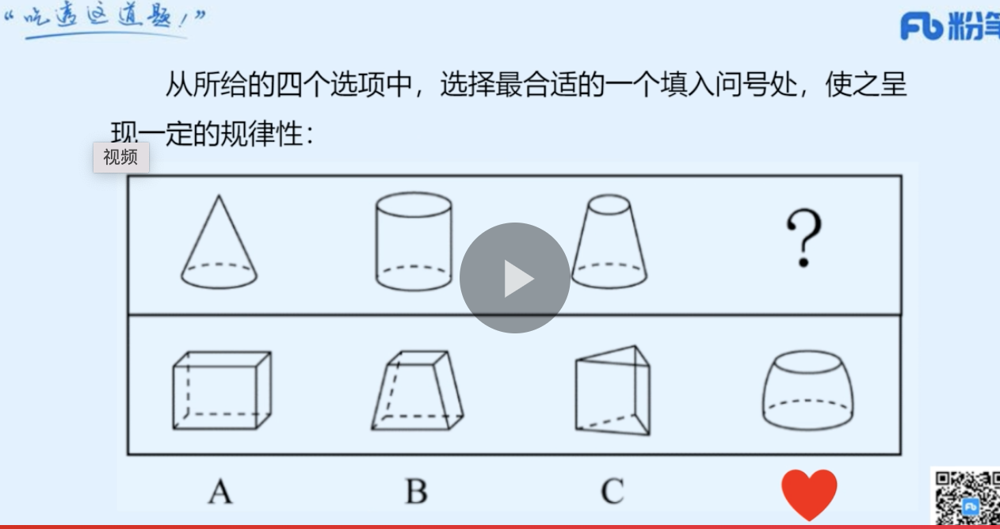
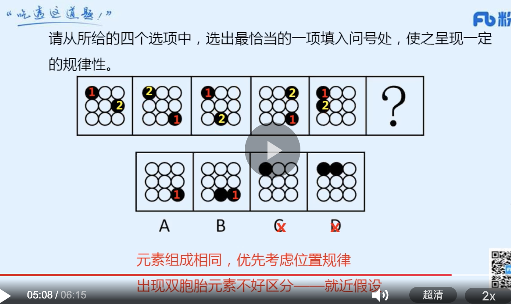
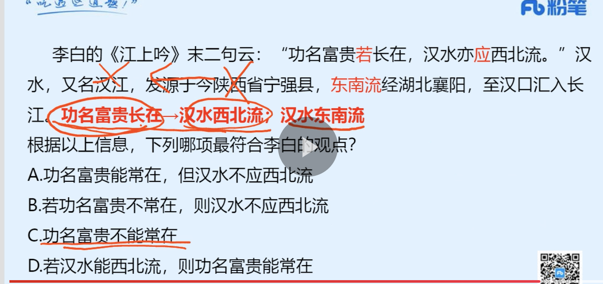

1. 早上判断40（完结）资料 10
2. 中午言语 40
3. 晚上判断20（新）
4. 晚上资料 10 
5. 晚上对答案（当天记录对答案）
6. 当天解决当天的。过去的不予解决。做好记录，周末解决。

### 言语
|  错误类型（为什么错）   | 统计次数  |
|  ----  | ----  |
|   | 1 |
|  | 1 |
|   | 1 |

- 1


```


```
### 判断

图推 》 类比 》逻辑 》定义
|  错误类型（为什么错）   | 统计次数  |
|  ----  | ----  |
|   | 1 |
|  | 1 |
|   | 1 |

- 1（立体图形：还可能看俯视图，截面的规律）



```
本题考查截面图。

观察发现，题干三幅立体图形水平截面都是圆，所以问号处立体图形的水平截面也应为圆，只有D项符合。
```
- 2（九宫格：图形组成相同，看位置。就近原则：找出其中一个黑球和下一副图的黑球，比较位置。发现规律。）



```

```
- 3（这道题错在没想到能翻译推理这样，嵌入古诗文做）



```
李白的《江上吟》末二句云：“功名富贵若长在，汉水亦应西北流。”汉水，又名汉江，发源于今陕西省宁强县，东南流经湖北襄阳，至汉口汇入长江。

根据以上信息，下列哪项最符合李白的观点？

A

功名富贵能常在，但汉水不应西北流

B

若功名富贵不常在，则汉水不应西北流

C

功名富贵不能常在

D

若汉水能西北流，则功名富贵能常在


正确答案是： C，你的答案是： D收起
解析
第一步：翻译题干。

①功名富贵常在汉水西北流；

②汉水是东南流向。

第二步：逐一分析选项。

A项：翻译为功名富贵常在 且 汉水不应西北流，该选项为条件①的矛盾命题，所以不符合李白的观点，排除；

B项：翻译为功名富贵不常在汉水不应西北流，否定了条件①的前件，否前得不到确定结论，排除；

C项：条件②汉水是东南流向，是对条件①的否后，否后必否前，应得到功名富贵不常在，符合李白的观点，当选；

D项：翻译为汉水能西北流功名富贵能常在，肯定了条件①的后件，肯后得不到确定结论，排除。

故正确答案为C。
```
- 4（1. C表达欠佳 并不一定是技术不好，可能就是表达不好 2，D项家长的质疑是对的，有理由的。3.可以这么理解，文章让排除以偏概全的。而D不属于以偏概全。）


```
碎片推理是指从只言片语或少量个案推导一般性结论的推理，这类推理往往以偏概全，缺乏说服力。

根据上述定义，下列不属于碎片推理的是：

A

有的家长让孩子“在家上学”，有的家长把孩子送到国外，这说明当下的应试教育很成问题

B

某位京剧名家想收—个关门弟子，挑了几次没有中意的，他很失望，认为现在的年轻人都比较怕吃苦

C

蔡某参加某企业的研发人员招聘面试，表达欠佳，面试官因此断定蔡某的技术能力有限，决定不予聘用

D

某教师在班级管理中采用了金钱奖励制度，想培养学生的经济意识，但有家长表示不满，认为不能让金钱污染孩子的心灵


正确答案是： D，你的答案是： C收起
解析
第一步：找出定义关键词。

“从只言片语或少量个案推导一般性结论的推理”、“以偏概全，缺乏说服力”。

第二步：逐一分析选项。

A项：让孩子“在家上学”或把孩子送到国外，只是部分家长的做法，属于少量个案，据此得出当下的应试教育很成问题，该观点是针对整个应试教育的判断，属于一般性结论，符合“从只言片语或少量个案推导一般性结论的推理”、“以偏概全，缺乏说服力”，符合定义，排除；

B项：某位京剧名家想收—个关门弟子，挑了几次没有中意的，这里挑选的几个人，属于少量个案，据此认为现在的年轻人都比较怕吃苦，该观点是针对整个年轻人群体的判断，属于一般性结论，符合“从只言片语或少量个案推导一般性结论的推理”、“以偏概全，缺乏说服力”，符合定义，排除；

C项：蔡某参加某企业的研发人员招聘面试，表达欠佳，面试官据此断定蔡某的技术能力有限，属于仅从一次面试的表达情况出发，来推断这个人的技术能力，符合“从只言片语或少量个案推导一般性结论的推理”、“以偏概全，缺乏说服力”，符合定义，排除；

D项：由于某教师在班级管理中采用了金钱奖励制度，家长表示不满并认为不能让金钱污染孩子的心灵，属于从制度本身出发，来推断该制度存在的问题，说明推出的是针对性结论，并非一般性结论，不符合“从只言片语或少量个案推导一般性结论的推理”，同时该推断具有一定的说服力，并非以偏概全，也不符合“以偏概全，缺乏说服力”，不符合定义，当选。

本题为选非题，故正确答案为D。
```
- 5


```

```
- 6


```

```
- 7


```

```
- 8


```

```
- 9


```

```
- 10


```

```
- 11


```

```
- 12


```

```
- 13


```

```
- 14


```

```
- 15


```

```
### 资料
|  错误类型（为什么错）   | 统计次数  |
|  ----  | ----  |
|   | 1 |
|  | 1 |
|   | 1 |

- 3


```

```