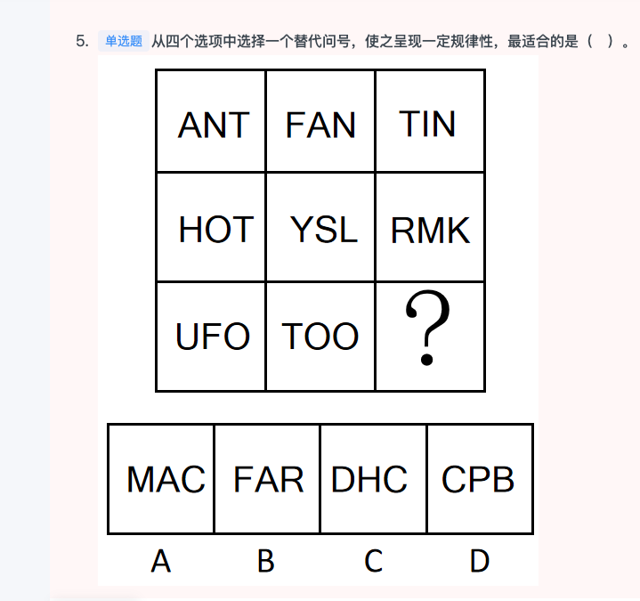
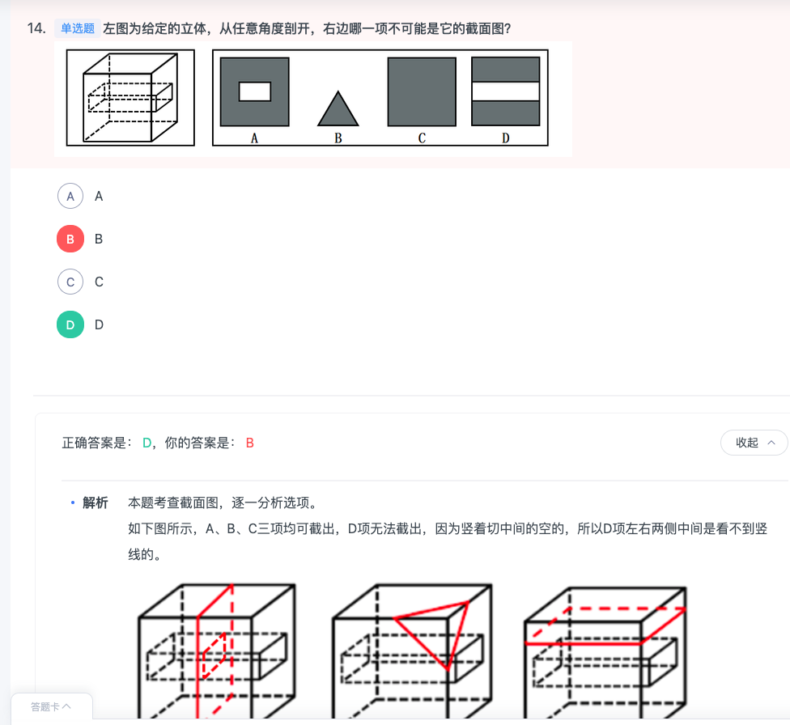
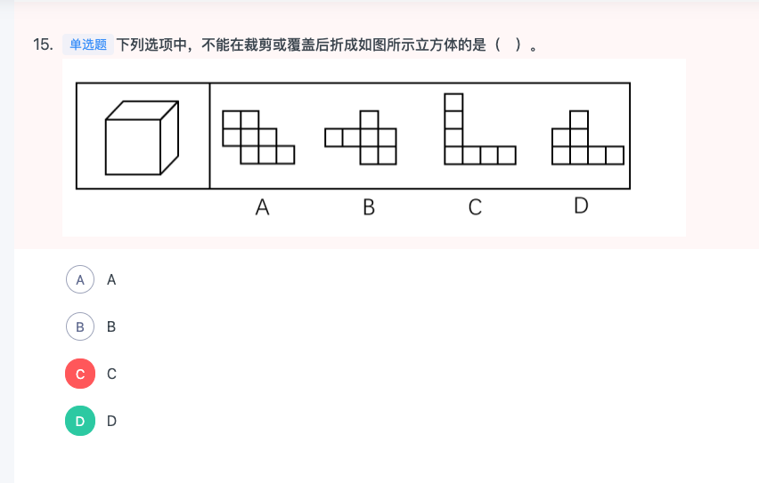
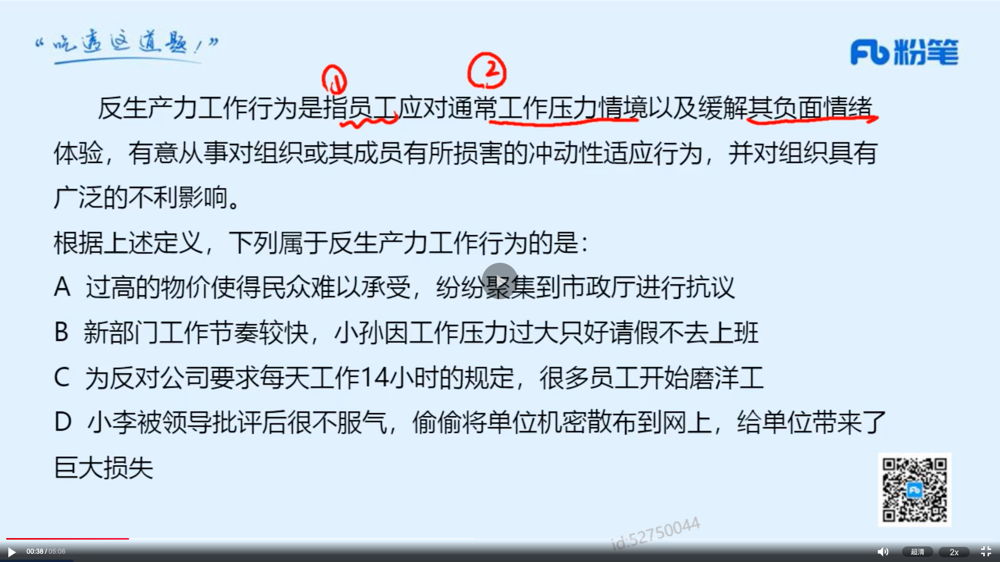

1. 早上判断40（完结）资料 10
2. 中午言语 40
3. 晚上判断20（新）
4. 晚上资料 10 
5. 晚上对答案（当天记录对答案）
6. 当天解决当天的。过去的不予解决。做好记录，周末解决。

### 言语
|  错误类型（为什么错）   | 统计次数  |
|  ----  | ----  |
|   | 1 |
|  | 1 |
|   | 1 |

- 1


```


```
### 判断
|  错误类型（为什么错）   | 统计次数  |
|  ----  | ----  |
|   | 1 |
|  | 1 |
|   | 1 |

- 1（没有。。。就不会。。。还是前推后，不是后退前。不。。不。。才是后推前）


```
某国一位经济学家指出：“除非该国采取大刀阔斧的举措来根治经济的顽疾，否则经济不可能稳健增长。没有经济稳健增长，公共债务就会不断攀升。”

由此可以推出：

A

如果公共债务不断攀升，则该国没有采取大刀阔斧的举措来根治经济的顽疾

B

只有该国不采取大刀阔斧的举措来根治经济的顽疾，公共债务才会不断攀升

C

如果该国采取大刀阔斧的举措来根治经济的顽疾，则公共债务就不会不断攀升

D

如果公共债务没有不断攀升，说明该国采取了大刀阔斧的举措来根治经济的顽疾


正确答案是： D，你的答案是： B收起
解析
第一步：翻译题干。

①经济稳健增长该国采取大刀阔斧的举措来根治经济的顽疾；

②经济稳健增长公共债务不断攀升。

将②进行逆否：公共债务不断攀升经济稳健增长，①②可串连为③公共债务不断攀升经济稳健增长该国采取大刀阔斧的举措来根治经济的顽疾。

第二步：逐一分析选项。

A项：翻译为公共债务不断攀升该国采取大刀阔斧的举措来根治经济的顽疾，是对③的否前，但否前得不到确定性的结论，无法推出，排除；

B项：翻译为公共债务不断攀升该国采取大刀阔斧的举措来根治经济的顽疾，是对③的否前，但否前得不到确定性的结论，无法推出，排除；

C项：翻译为该国采取大刀阔斧的举措来根治经济的顽疾公共债务不断攀升，是对③的肯后，但肯后得不到确定性的结论，无法推出，排除；

D项：翻译为公共债务不断攀升该国采取大刀阔斧的举措来根治经济的顽疾，是对③的肯前，肯前必肯后，可以推出，当选。

故正确答案为D。
```
- 2（1. 观察特殊性：两图形相交形成面。 2. 面的形状（几边形，对称，曲直，与原图相似）、面积）


- 3（1. 先属性 2. 后数量 3. 这道题就是横着看曲线个数，每排分别为0，1，2）



```
思路一：

元素组成不同，且无明显属性规律，优先考虑数量规律。观察发现，第一行中，三幅图分别有0个由曲线构成的图形；第二行中，三幅图分别有1个由曲线构成的图形；第三行中，前两幅图均有2个由曲线构成的图形，故“？”处要有2个由曲线构成的图形，只有C项符合。

故正确答案为C。

思路二：

元素组成不同，且无明显属性规律，优先考虑数量规律。观察发现，题干存在明显封闭面，考虑数面。观察发现，第一列中，三幅图的面数量相加为3；第二列中，三幅图的面数量相加为3；第三列中，前两幅图的面数量相加为1，故“？”处要找一个面数量为2的图形，使第三列的面数量相加恒等于3，只有B项符合。

故正确答案为B。

本题有两个规律，但九宫格优先看横行，故粉笔倾向于第一种规律。

故正确答案为C。
```
- 4（1. 两个成语主要是从语意上看，看它们形容的是不是同一个事物。2.崇洋媚外，意思是崇拜西方一切，谄媚外国人，指丧失民族自尊心，一味奉承巴结外国人；吃里扒外，是指接受这一方面的好处，却为那一方面卖力 ）


```
东施效颦：生搬硬套

A

崇洋媚外：吃里扒外

B

外强中干：徒有其表

C

大快人心：兴高采烈

D

十恶不赦：臭名昭著


正确答案是： B，你的答案是： A收起
解析
第一步：判断题干词语间逻辑关系。

东施效颦，比喻模仿别人，不但模仿不好，反而出丑；生搬硬套，指不顾实际情况，机械地运用别人的经验，照抄别人的办法，二者是近义关系。

第二步：判断选项词语间逻辑关系。

A项：崇洋媚外，意思是崇拜西方一切，谄媚外国人，指丧失民族自尊心，一味奉承巴结外国人；吃里扒外，是指接受这一方面的好处，却为那一方面卖力，也指将自己方面的情况告诉对方，二者不是近义关系，与题干逻辑关系不一致，排除；

B项：外强中干，形容外表强大而实际虚弱的事物；徒有其表，指空有外表，有名无实，二者是近义关系，与题干逻辑关系一致，当选；

C项：大快人心，指坏人受到惩罚，使人感到非常痛快；兴高采烈，形容兴致高，精神饱满，二者不是近义关系，与题干逻辑关系不一致，排除；

D项：十恶不赦，指罪恶极大，不可饶恕；臭名昭著，指坏名声人人都知道，二者不是近义关系，与题干逻辑关系不一致，排除。

故正确答案为B。
```
- 5（1. 定义：（1）回国或者故乡 （2）难以适应本土文化 2. C就是难以适应自己吃饭 但是D是不适应外国的的。）


```
逆向文化冲击：指旅居他乡者回到故国或故乡后，短时间内在生活、心理等方面难以适应本土文化的现象。

下列不属于逆向文化冲击的是：

A

大卫在中国从事英语培训工作10多年，回国后感到很不习惯。他在不久前的一段视频中抱怨说：半夜饿了，在中国拿出手机点个外卖，半个小时就送到了，而这里啥都没有，只能饿死在去超市的路上


B

在城里生活多年的老杨，今年春节回到农村老家后，亲戚朋友请他到附近饭店吃饭。开席后，他习惯性地让服务员去拿公筷、公勺，服务员惊讶地看着他，半天没反应过来，亲戚们也觉得他怪怪的


C

留学刚回国的小吴约朋友去青岛看海，因为没有12306账户，只得请朋友帮忙购票。上车后他惊讶地发现，高铁上不仅可以扫码点餐，还可以点外卖，自己头天准备的面包、饼干一点没用上。他感觉自己在朋友心目中简直就像个弱智


D

欧洲姑娘玛丽来华留学，虽然早已听说过中国的无现金支付，第一周她还是惊呆了：楼下卖红薯的大爷都在用“互联网”，菜市场的每个摊位上居然都有收款二维码，更不要说超市和商场了


正确答案是： D，你的答案是： C收起
解析
第一步：找出定义关键词。

“旅居他乡者回到故国或故乡后”、“短时间内在生活、心理等方面难以适应本土文化”。

第二步：逐一分析选项。

A项：大卫在中国从事英语培训，回国之后不习惯，符合“旅居他乡者回到故国后”，也符合“短时间内在生活、心理等方面难以适应本土文化”，符合定义，排除；

B项：老杨在城市生活多年，春节回老家，符合“旅居他乡者回到故乡后”，习惯性地让服务员去拿公筷、公勺，而服务员半天没反应过来，符合“短时间内在生活、心理等方面难以适应本土文化”，符合定义，排除；

C项：留学回国的小吴符合“旅居他乡者回到故国后”，不知道高铁上可以扫码点餐而准备了食物，符合“短时间内在生活、心理等方面难以适应本土文化”，符合定义，排除；

D项：欧洲姑娘玛丽来华留学，不适应中国的无现金支付，不符合“回到故国或故乡后”，不符合定义，当选。

本题为选非题，故正确答案为D。
```
- 6（1. 注意这是常考的题型。截面图。D不应该有中间的两条竖线，因为原图中间是等长并且镂空的。）



- 7（1. 两种方法，一种是找相对面，如果有其中一个没有相对面，说明无法盖住。宁愿相对面多了两组，也不愿意缺相对面 2. 靠脑袋想象也能想象到C没有相对面 3.往往看起来不对的答案不一定是错的，比如这道题的C ）





- 8（这道题是看题看错，问的是小确幸，我找的是小确丧）


```
“小确丧”是网络流行词语，指小而确定的沮丧，是持续发生在日常生活中却又摆脱不了的小烦恼，有专家提出，面对小确丧，人们不应无奈地接受或忍受，而应通过努力，将其转化为“小确幸”。小确幸是人们心中隐约期待的美好小事刚好发生在自己生活中，所产生的微小确实的幸运快乐感。

根据上述定义，下列属于小确幸的一项是：

A

小刘周末过得甭提多高兴了，但想到周一又要早起上班就有些莫名烦恼辗转难眠

B

小张决心购买某款心仪已久的5G手机，下单时发现该手机正好降价500元，爽了

C

小黄和小芳恋爱10年，今天终于在亲朋好友的见证和祝福中，走进了婚姻的殿堂

D

小李不爱做居所卫生，每天下班一想到又要回到乱糟糟的租住屋就感觉头痛和无奈


正确答案是： B，你的答案是： A收起
解析
第一步：找出定义关键词。

小确丧：“小而确定的沮丧”“持续发生”“摆脱不了的小麻烦”；

小确幸：“隐约期待的美好小事”“发生在自己生活中”“产生的微小确实的幸运快乐感”。

第二步：逐一分析选项。

A项：莫名烦恼是产生了负面的情绪，不符合“产生的微小确实的幸运快乐感”定义，排除；

B项：心仪已久说明早就想买了，符合“隐约期待的美好小事”定义，下单时降价开心，也符合“发生在自己生活中”与“产生的微小确实的幸运快乐感”定义，当选；

C项：恋爱10年走入婚姻，没有体现“隐约期待的美好小事”，不符合定义，排除；

D项：感到头痛和无奈，不符合“产生幸运快乐感”，排除。

故正确答案为B。
```
- 9（1. 定义：失信行为，没有与失信行为直接相关联的惩罚 2. B项被撤销了基于该论文直接的绩效奖励之类的。C拖欠农名工工资的包工头被被没有直接相关联的铁路，保险部门所限制购买票。）


```
社会性处罚：指存在失信行为的人员所受到的与自身失信行为没有直接关联的来自其他部门的限制和处罚。

下列属于社会性处罚的是

A

以“站不起来”为理由强占他人座位的高铁“霸座男”，当场受到了乘警的严肃批评，下车后被移送公安机关接受治安处罚。这一事件曝光后，当事人的恶劣行为又遭到了全国网民的一致谴责

B

由于数据造假，某教授在国际期刊上发表的论文被撤稿。在网民的谴责声中，该教授又被撤销了基于该论文所获得的绩效奖励、省部级科研项目、荣誉称号、社会兼职

C

春节前夕，恶意拖欠农民工工资的部分包工头，被有关部门和各种媒体曝光，引起社会各界密切关注。根据银行、保险、铁路等部门的规定，这些违规者申请信用卡、购买保险以及动车和高铁票时都将受到限制

D

长江沿岸的一家化工企业，多次不顾禁令向长江偷偷排污，最近被省有关部门通报批评，吊销了企业生产执照，它的上级主管部门及主要负责人也都受到了严厉的处罚


正确答案是： C，你的答案是： B收起
解析
第一步：找出定义关键词。

“存在失信行为的人员”、“所受到的与自身失信行为没有直接关联的来自其他部门的限制和处罚”。

第二步：逐一分析选项。

A项：以“站不起来”为理由强占他人座位的高铁“霸座男”，符合“存在失信行为的人员”，当场受到了乘警的严肃批评，被移送公安机关接受治安处罚，这是与自身失信行为有直接关联的限制和处罚，不符合“所受到的与自身失信行为没有直接关联的来自其他部门的限制和处罚”，不符合定义，排除；

B项：某教授数据造假，符合“存在失信行为的人员”，论文被撤稿，撤销了基于该论文所获得的绩效奖励、省部级科研项目、荣誉称号、社会兼职，均是与自身失信行为有直接关联的处罚，不符合“所受到的与自身失信行为没有直接关联的来自其他部门的限制和处罚”，不符合定义，排除；

C项：恶意拖欠农民工工资的包工头，符合“存在失信行为的人员”，申请信用卡、购买保险以及动车和高铁票时都将受到限制，符合“所受到的与自身失信行为没有直接关联的来自其他部门的限制和处罚”，符合定义，当选；

D项：长江沿岸的一家化工企业，多次不顾禁令向长江偷偷排污，不符合“存在失信行为的人员”，不符合定义，排除。

故正确答案为C。
```
- 10（1. 根据唐局的笔记，先属性 后数量，最后不行一笔画 2. 而这道题是九宫格的一笔画）


- 11（1. 主要是满足玩乐欲望。而又结合题目定义明显是玩具思维。是定义的重点 2. 错是因为觉得产品的定义比玩乐定义更重要。）


- 12（定义是：员工，冲动性行为，不利影响。对比择优。1. C比起D，更没有冲动性行为的定义。）


```

反生产力工作行为是指员工应对通常工作压力情境以及缓解其负面情绪体验，有意从事对组织或其成员有所损害的冲动性适应行为，并对组织具有广泛的不利影响。

根据上述定义，下列属于反生产力工作行为的是：

A

过高的物价使得民众难以承受，纷纷聚集到市政厅进行抗议

B

新部门工作节奏较快，小孙因工作压力过大只好请假不去上班

C

为反对公司要求每天工作14小时的规定，很多员工开始磨洋工

D

小李被领导批评后很不服气，偷偷将单位机密散布到网上，给单位带来了巨大损失


正确答案是： D，你的答案是： C收起
解析
第一步：找出定义关键词。

“员工”、“应对通常工作压力情境以及缓解其负面情绪体验”、“有意从事对组织或其成员有所损害的冲动性适应行为”、“对组织具有广泛的不利影响”。

第二步：逐一分析选项。

A项：过高的物价使得民众难以承受，民众不符合“员工”，不符合定义，排除；

B项：小孙因工作压力过大只好请假不去上班，不符合“有意从事对组织或其成员有所损害的冲动性适应行为”，不符合定义，排除；

C项：为反对公司每天工作14小时的规定，很多员工开始磨洋工，不符合“有意从事对组织或其成员有所损害的冲动性适应行为”，不符合定义，排除；

D项：小李由于被领导批评不服气，偷偷将单位机密散布到网上，符合“员工有意从事对组织或其成员有所损害的冲动性适应行为”，给单位带来了巨大损失，符合“对组织具有广泛的不利影响”，符合定义，当选。

故正确答案为D。
1. C比起D，更没有冲动性行为的定义。
```
- 13（1. 定义是：智能化填表 无需证件拿到审批文件 2. D错的是，定位的名词错了。客户登录公众号并通过人脸识别后，可完成查询、续费、转款等功能。但它没有提到审批文件。）


```
D错的是，定位的名词错了。客户登录公众号并通过人脸识别后，可完成查询、续费、转款等功能。但它没有提到审批文件。

无感审批是指通过智能技术强化身份认证、智能授权、自动填表等功能，企业群众无需出示证件、无需填写表单，“不知不觉”就拿到审批文件，实现“无感”审批、“省心”办事。

根据上述定义，以下属于无感审批的是：

A

某市旅游管理部门通过人脸识别等网络技术，实现了网上实名制购买全市公园门票。游客无需出示证件，可以直接出示购票二维码入园

B

某建设单位登录省投资在线监管平台，填写单位代码后，系统自动生成企业基本信息和申请表格，随后完成在线审核，获得建筑许可

C

某市提高政府办事效率，对企业或个人办理业务，只需要到综合服务大厅询问工作人员，工作人员会帮忙核对材料，帮助他们方便快捷地完成相关手续

D

某保险公司提供网上业务办理和查询功能，客户登录公众号并通过人脸识别后，可完成查询、续费、转款等功能，无需出示证件、无需填写表单


正确答案是： B，你的答案是： D收起
解析
第一步：找出定义关键词。

“通过智能技术强化身份认证、智能授权、自动填表等功能”、“企业群众无需出示证件、无需填写表单，‘不知不觉’就拿到审批文件”。

第二步：逐一分析选项。

A项：通过人脸识别等网络技术，实现了网上实名制购买全市公园门票，没有体现出拿到审批文件，不符合定义，排除； 

B项：系统自动生成企业基本信息和申请表格，符合“智能技术强化身份认证、智能授权、自动填表等功能”；随后完成在线审核，获得建筑许可，符合“企业群众无需出示证件、无需填写表单，‘不知不觉’就拿到审批文件”，符合定义，当选；

C项：对企业或个人办理业务，只需要到综合服务大厅询问工作人员，工作人员会帮忙核对材料，帮助他们方便快捷地完成相关手续。没有通过智能技术强化身份认证、智能授权、自动填表等功能，不符合定义，排除；

D项：客户登录公众号并通过人脸识别后，可完成查询、续费、转款等功能，无需出示证件、无需填写表单，没有涉及到审批，所以不符合“‘不知不觉’就拿到审批文件”，不符合定义，排除。

故正确答案为B。
```
- 14（写错了关系。选了A不该错）

```
人无精神则不立，国无精神则不强。精神是一个民族赖以长久生存的灵魂，唯有精神上达到一定的高度，一个民族才能在历史的洪流中奋勇向前。

根据以上陈述，可以得出以下哪项？

A

人有精神则立，国有精神则强

B

一个民族如果精神上没有达到一定的高度，就没有赖以长久生存的灵魂

C

一个民族若在历史的洪流中奋勇向前，则精神上已达到一定的高度

D

一个民族如果精神上达到一定的高度，就会在历史的洪流中奋勇向前


正确答案是： C，你的答案是： A收起
解析
第一步：翻译题干。

①人无精神不立，国无精神不强；

②一个民族在历史的洪流中奋勇向前精神上达到一定的高度。

第二步：逐一分析选项。

A项：翻译为人有精神立，国有精神强，是对①的否前，否前得不到确定性结论，排除；

B项：翻译为一个民族精神上没有达到一定的高度没有赖以长久生存的灵魂，但是题干并无精神与灵魂之间的推出关系，无法推出，排除；

C项：翻译为一个民族在历史的洪流中奋勇向前精神上已达到一定的高度，是对②的肯前，肯前必肯后，可以推出，当选；

D项：翻译为一个民族精神上达到一定的高度在历史的洪流中奋勇向前，是对②的肯后，肯后得不到确定性结论，无法推出，排除。

故正确答案为C。
```
- 15（1. 注意这道题只给了论点，所以我们要添加补充论据证明论点。肉鸡也挺好。其实土鸡或土猪并不比集中饲养的肉鸡和肉猪更有营养、更安全。2. A是无关选项。而C B都提到了一些肉鸡也挺好的额。）


```
很多人认为，农村家养的土鸡，土猪，采用传统方式喂养，吃的是粮食、蔬菜、青草，不吃饲料，生长周期长，运动量大，肌肉紧实，更有营养，味道更加鲜美，所以市场上的土鸡，土猪通常售价更高。但研究者指出，其实土鸡或土猪并不比集中饲养的肉鸡和肉猪更有营养、更安全。

以下各项如果为真，哪项不能支持研究者的结论？

A

大型饲养场的鸡和猪，集中饲养、集中喂食，产蛋量更多，体型也更大

B

土鸡的蛋白质含量略高于肉鸡，但肉鸡的维生素A和脂肪含量超过土鸡

C

因为饲料中会添加相应的营养物质，所以肉鸡的维生素E和某些矿物质含量更高

D

家养的鸡和猪，可以避免人为的污染，但无法避免污水、重金属等自然污染因素


正确答案是： A，你的答案是： C收起
解析
第一步：找出论点和论据。

论点：其实土鸡或土猪并不比集中饲养的肉鸡和肉猪更有营养、更安全。

论据：无。

只有论点，优先考虑补充论据加强。

第二步：逐一分析选项。

A项：该项只说了大型饲养场的鸡和猪，它的产蛋量多，体型大，和论点讨论的营养、安全的话题无关，当选；

B项：土鸡的蛋白质含量略高于肉鸡，但肉鸡的维生素A和脂肪含量超过土鸡，的确能够说明土鸡不比肉鸡更有营养、更安全，通过举例的方式加强，排除；

C项：在解释为什么土鸡不比饲养的肉鸡更有营养、更安全，通过解释原因的方式加强，排除；

D项：在说家养的鸡和猪无法避免污水、重金属等自然污染因素，也就是家养的鸡和猪并不是更安全，通过解释原因的方式加强，排除。

本题为选非题，故正确答案为A。
```

### 资料
|  错误类型（为什么错）   | 统计次数  |
|  ----  | ----  |
|   | 1 |
|  | 1 |
|   | 1 |

- 3


```

```