1. 早上判断40（完结）资料 10
2. 中午言语 40
3. 晚上判断20（新）
4. 晚上资料 10 
5. 晚上对答案（当天记录对答案）
6. 当天解决当天的。过去的不予解决。做好记录，周末解决。

### 言语
|  错误类型（为什么错）   | 统计次数  |
|  ----  | ----  |
|   | 1 |
|  | 1 |
|   | 1 |

- 1


```


```
### 判断（未）
|  错误类型（为什么错）   | 统计次数  |
|  ----  | ----  |
|   | 1 |
|  | 1 |
|   | 1 |

- 1（注意观察凹凸处，找特异性。看能不能拼合。）


- 2（相邻比较思维 后面比前面变化一根线短）

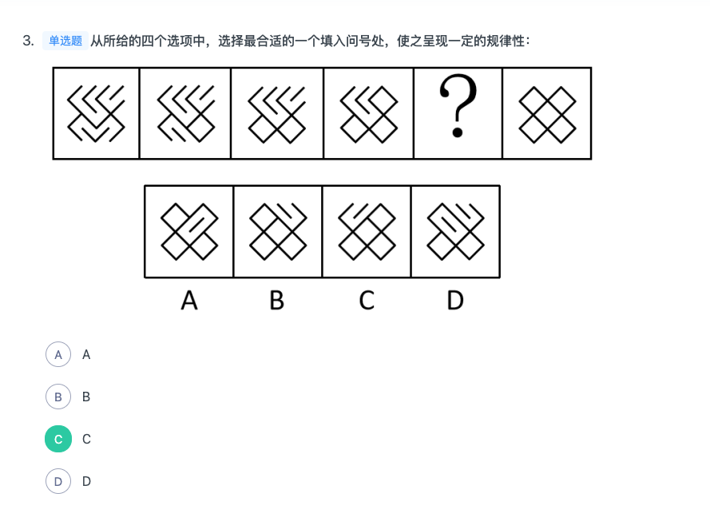
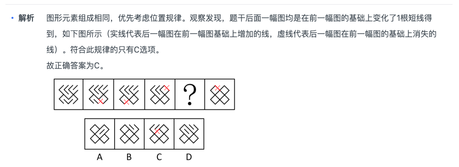


- 3（S N Z 平行四边形 注意是中心对称图形特征）

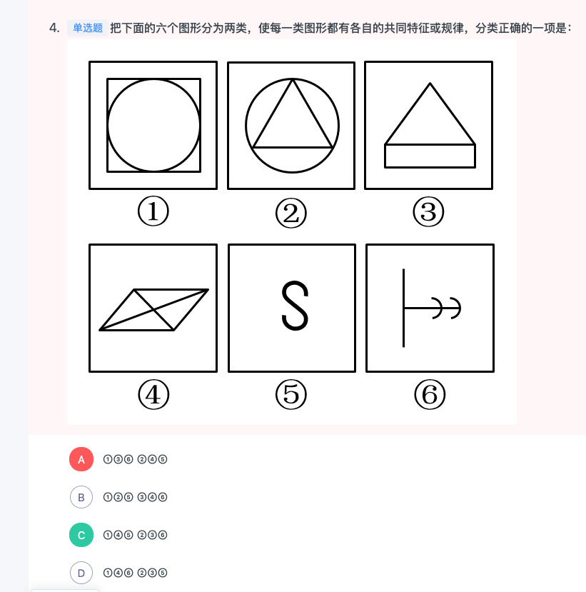


- 1（属性没有特征看数量，数量是占到面积的四分之一）

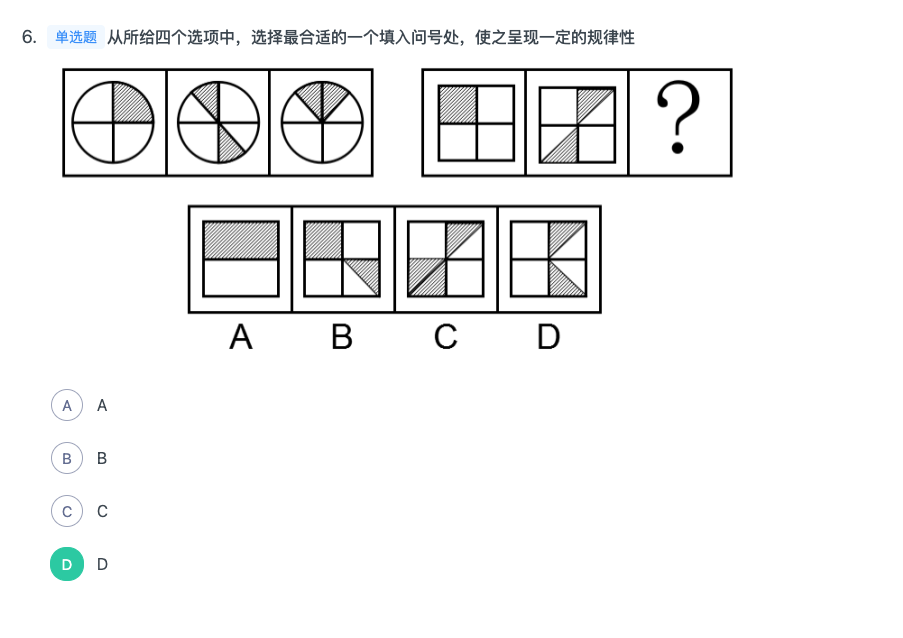


- 1（1. 排除法：A相对面不能同时出现 B：公共点被直线相连排除 D：多了一个不存在的面）

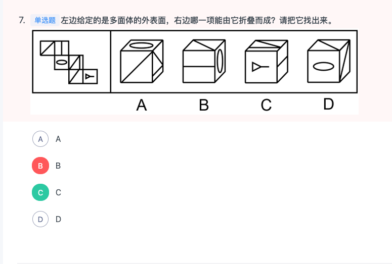


- 1（1. 观察到面有特征 2. 属数量发现2，3，4相同面的个数为6（3中有个图形和其他六个不一样））

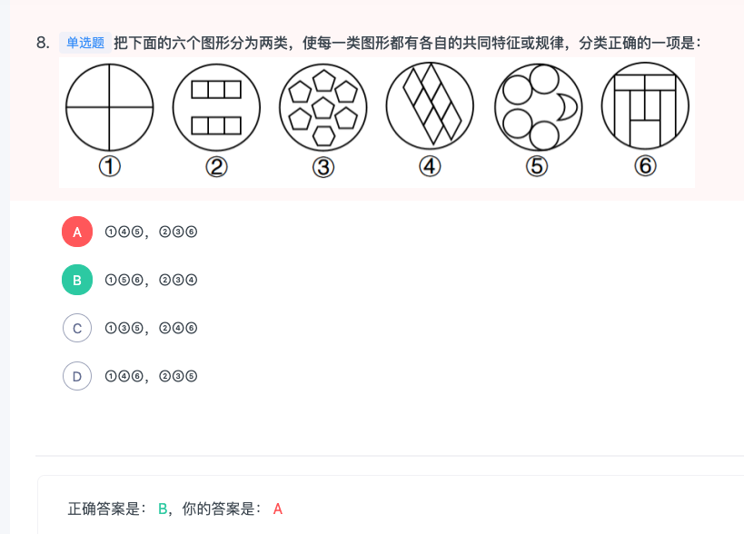

```

```
- 1（1. 发现上面的图都是同一个图 2. 观察到有两个面相接排除，观察到C是逆时针纵轴旋转。3.这种立体图形还可能考左视图是不是一样）

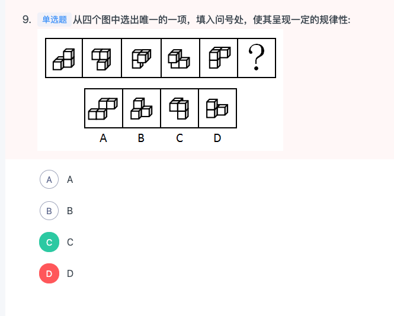

```

题干给出的图形均为四个正方体构成的立体图形，且每幅图的四个正方体均为同样的排列形式，即题干每幅图的立体图形都相同，只是每幅图立体图形的位置发生了旋转。据此规律，只有C项跟题干立体图形是同样的排列形式。

故正确答案为C。

```
- 1（黑球的数量成递增趋势）

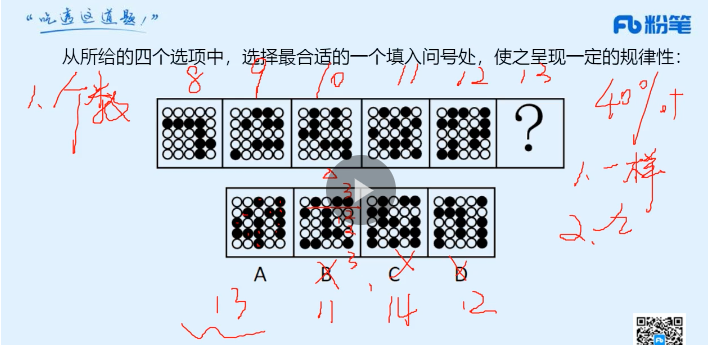


- 1（1. 注意有等腰元素，考对称轴的方向 2. 对称轴经过点）

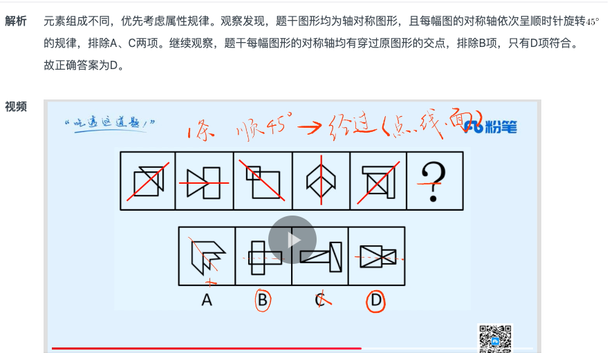


- 1（1. 注意数面的个数递增：1，2，3，4，5，6  2. 注意面的形状都不超过两个）

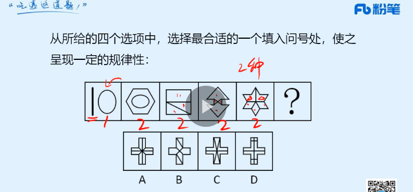


- 1（1. 看似正确的图形可能是错的，比如A，它少了个X。 B少了个0 ，D多了个【】）

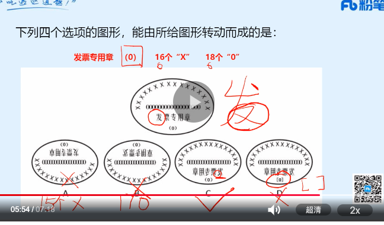

```
题干要求选“转动”，可以包括旋转或者翻转（上下翻转或左右翻转，类似于“翻书页”）两种形式。

首先观察题干图形特征，包括汉字“发票专用章”、“（0）”、16个“X”，以及18个“0”，共四类元素。

观察选项：

A项：图形包含15个“X”，比原图少一个“X”,故不可能是题干图形旋转180度而来，排除；

B项：图形包含17个“0”，比原图少一个“0”,故不可能是题干图形上下翻转而来，排除；

C项：所有元素齐全，为题干图形左右翻转而来，当选；

D项：将原图中的“（0）”改成了“[0]”，故不可能通过原图转动得到，排除；

故正确答案为C。
```
- 1（这道题考的是立体图形的俯视图是一致的。）

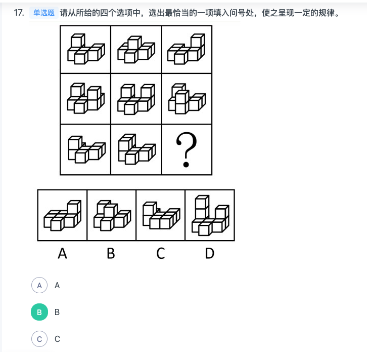


- 1（线的细化有：直线，曲线，平行线。考的是平行线组数）

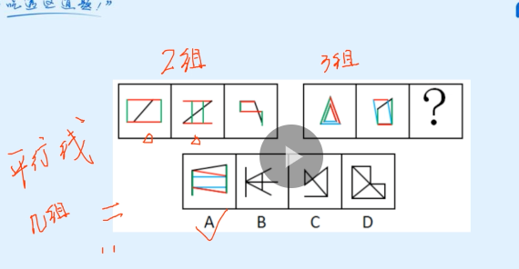


- 1（1. 注意可以顺着方向画箭头，并且下方有一个小正方形，在右边。 如果把小正方形放在上面，那么应该在左边，所以排除B.顺着肩箭头方向它在右边。）

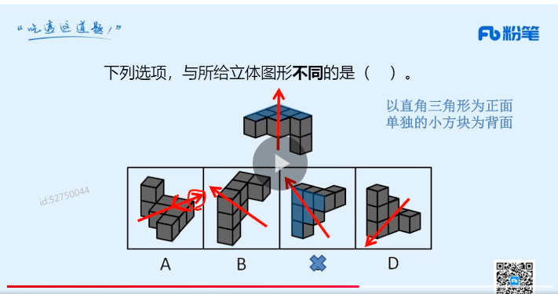


- 1（1. 曲线直线的规律除了可以看交点 2. 也可以看曲线和直线个数的差）

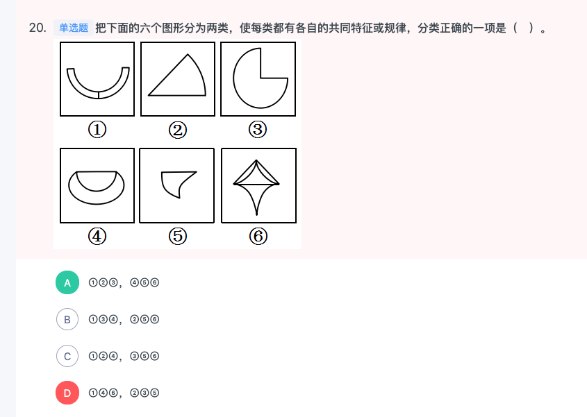
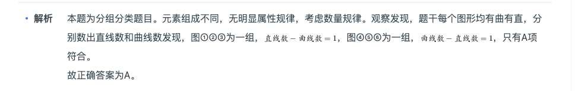


- 1（1. 数量有递减趋势 2. 每相邻两行只有一行不一致，其他都一致）

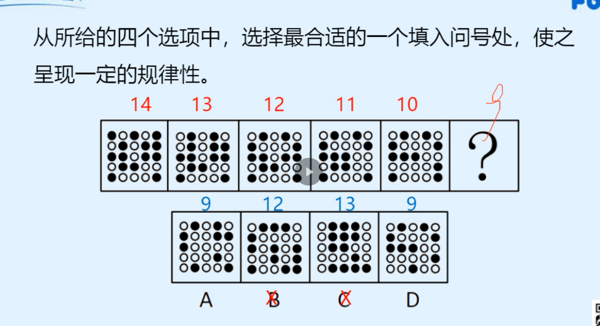
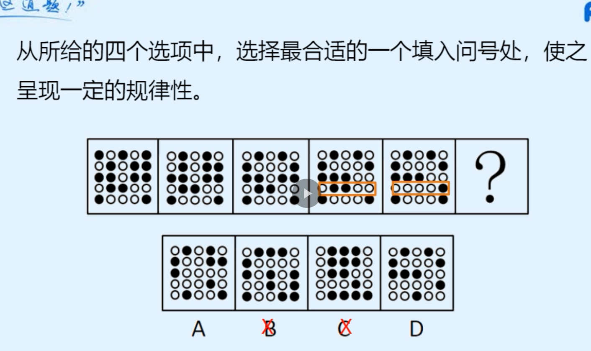

```
元素组成不同，每幅图都有小黑球，发现小黑球数量从图一到图五依次递减，分别为14、13、12、11、10，？处应选择一个9个黑球的，排除B、C两项。再次观察题干发现，图二和图一相比只有第一行颜色变动，其他行不变，图三和图二相比只有第二行颜色变动，其他行不变，图四和图三相比只有第三行颜色变动，其他行不变，图五和图四相比只有第四行颜色变动，其他行不变，因此问号处应该是第五行和前一幅图相比颜色变动，其他行不变。排除A项，只有D项符合。

故正确答案为D。
```
- 1（1. 通过数数排除选项 2. 找到最大的拼合。把3当作底子 3. D项目，2为底子但是，2，5拼不进去）

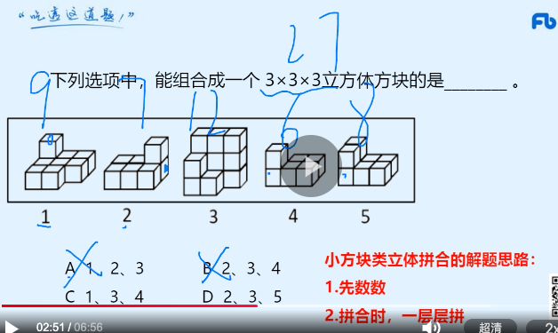
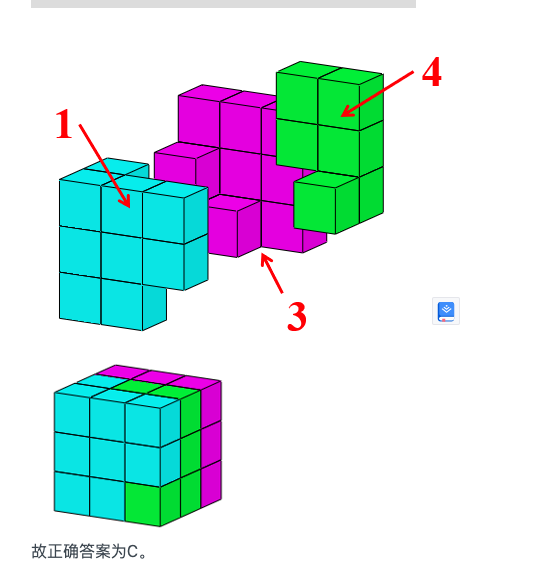

```
题干要求组成立方体方块，故小方块总数应该是27块。图1是9块，图2是7块，图3是12块，图4是6块，图5是8块，排除A、B两项；剩余C、D两项，都有图3，立方体每层有9块，图3已满足一层是9块，另一层有3块，故另外两图应满足某一层相加有6块。图2和图5均无法满足某一层相加有6块，而图1上层与图4下层相加为6块，即图1、3、4可组合成立方体方块（如下图所示）。


```
- 1（D选项找出两种情况，发现都不能拼合）

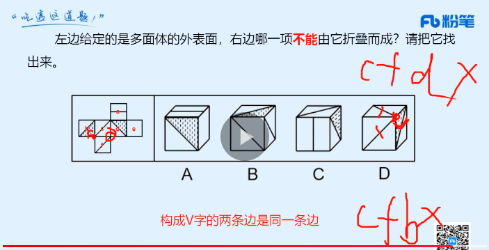
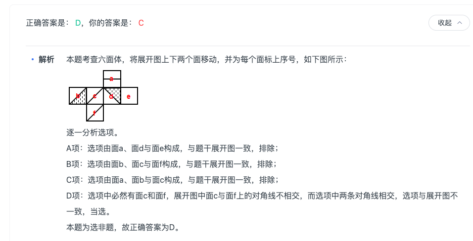

```

```
- 1（走投无路一笔画 并且属性都是直线组成）

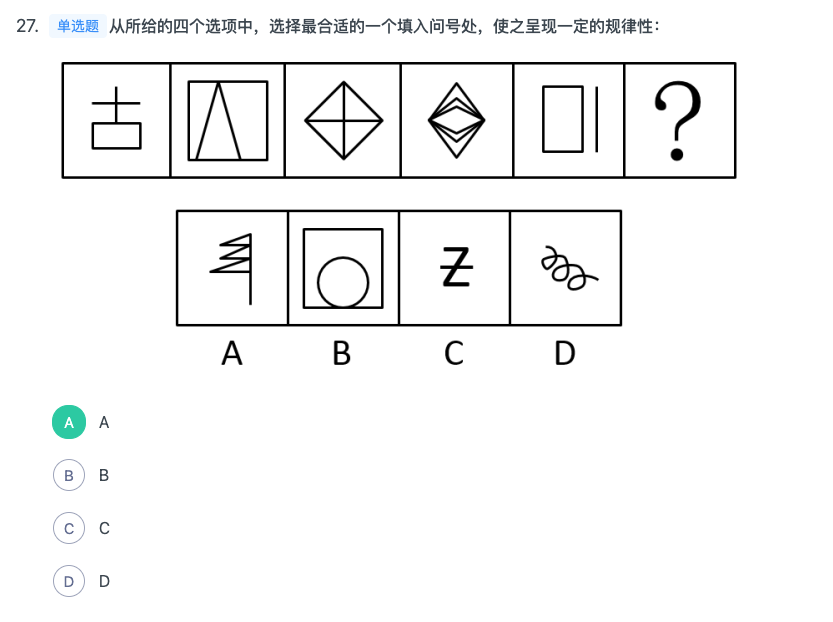

```
元素组成不同，且无明显属性规律，优先考虑数量规律。观察发现，第三幅图形为“田”字变形图，考虑笔画数。题干图形的笔画数依次为2、1、2、1、2，因此问号处图形的笔画数应为1。四个选项的笔画数分别为1、1、2、1，排除C项；再观察题干图形发现均为直线图形，因此排除B、D两项。

故正确答案为A。

视频


```
- 1（头尾两条线的状态是垂直还是平行）

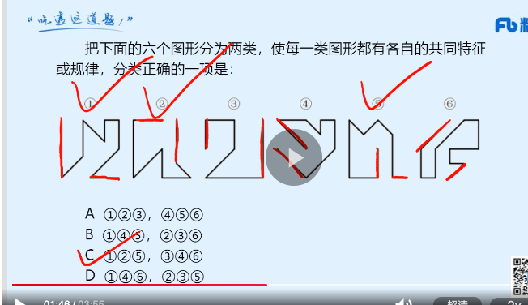


- 1


```

```
- 1


```

```
- 1


```

```
- 1


```

```
- 1


```

```
- 1


```

```
### 资料
|  错误类型（为什么错）   | 统计次数  |
|  ----  | ----  |
|   | 1 |
|  | 1 |
|   | 1 |

- 3


```

```