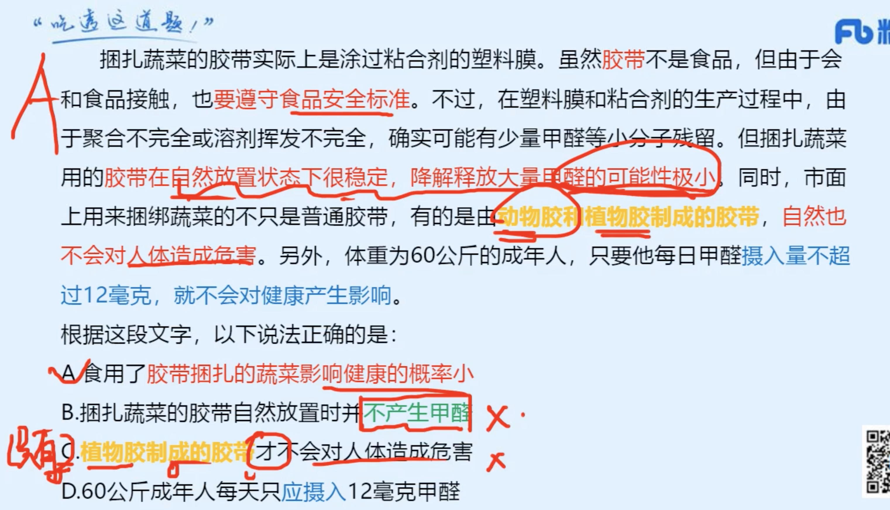

### 言语
|  错误类型（为什么错）   | 统计次数  |
|  ----  | ----  |
|   | 1 |
|  | 1 |
|   | 1 |

- 1(注意C，如果一个事物随着另外一个事物影响下降，但它不能说明，没有另一个事物影响，他就会提高，属于无中生有。2. C项，根据“COL17A1的表达会······也会因为应激（如氧化或紫外线辐射）而下降”可知，文段只是介绍了紫外线辐射可以使COL17A1表达水平下降，但并未提到防晒可以提高COL17A1的表达水平，无中生有，排除；)


```
某大学团队研究了“干细胞间竞争”在小鼠尾部皮肤老化中的作用。结果表明，“干细胞间竞争”由胶原蛋白COL17A1驱动。他们发现，COL17A1的表达在不同干细胞间存在差异，COL17A1表达水平较高的干细胞会牢固地锚定于基底膜，且对称分裂，并将附近COL17A1表达水平较低的细胞排挤出去。这样的细胞间竞争有助于维持皮肤的整体结构和完整性。研究同时显示，COL17A1的表达会随年龄增长而下降，也会因为应激（如氧化或紫外线辐射）而下降。最终，所有干细胞中的COL17A1表达水平都下降，皮肤随之老化。

根据这段文字，下列说法正确的是：

A

年龄与性别因素都会影响COL17A1的表达水平

B

COL17A1表达水平较低的细胞在竞争中更具优势

C

完备的防晒措施能有效提高COL17A1的表达水平

D

COL17A1的表达水平与皮肤组织的老化程度负相关


正确答案是： D收起
解析
A项，“性别因素”文段未涉及，无中生有，排除；

B项，根据“COL17A1表达水平较高的干细胞会······并将附近COL17A1表达水平较低的细胞排挤出去”可知，COL17A1表达水平较高的细胞更具优势，与文意相悖，排除；

C项，根据“COL17A1的表达会······也会因为应激（如氧化或紫外线辐射）而下降”可知，文段只是介绍了紫外线辐射可以使COL17A1表达水平下降，但并未提到防晒可以提高COL17A1的表达水平，无中生有，排除；

D项，根据“所有干细胞中的COL17A1表达水平都下降，皮肤随之老化”可知，COL17A1的表达水平越低，皮肤组织的老化程度越高，即二者呈负相关，表述正确，当选。

故正确答案为D。

```

- 2（1. ④句提出观点，指出古代的人口调查与今天的人口普查是不同的，⑥句论述早先调查户口的目的，根据逻辑顺序，应先引出话题“古代的人口调查”，再论述其目的和起源时间，2. 3应该在2前面。综合就是4在前面更好。引入话题。）

```
①由于没有必要调查所有的人口，所以统计数字和实际人口数量有很大的差距

②根据史料推断，中国第一次全国性的人口调查是在秦代完成的

③中国的原始人口调查始于公元前16世纪的商代，直到公元初才留下全国性的户口数字

④中国古代的人口调查不同于今天的人口普查，要求查到每一户，每一人

⑤这就使得相当一部分人口，包括妇女、享有特权的官僚贵族、老人与未成年人等，被排除在调查与统计数字之外

⑥早先调查户口的主要目的是征收赋税，因而登记的重点只是人口中与征税对象有关的部分

将以上6个句子重新排列，语序正确的一项是：

A

②③④⑥①⑤

B

③⑥①⑤④②

C

⑥③②①⑤④

D

④③②⑥⑤①


正确答案是： D收起
解析
观察选项，判断首句。②句论述中国第一次全国性人口调查的时间是秦代，③句论述中国原始人口调查的起源并指出全国性户口数字留下的大致时间是公元初，根据时间和逻辑顺序，应先论述③句再论述②句，故②句不适合作首句，排除A项。

继续观察，寻找线索。④句提出观点，指出古代的人口调查与今天的人口普查是不同的，⑥句论述早先调查户口的目的，根据逻辑顺序，应先引出话题“古代的人口调查”，再论述其目的和起源时间，故应先论述④句再论述⑥句和③句，锁定D项。

故正确答案为D。


```
- 3（1. 这道题要符合第二个空的语境，在博物馆中实现了对话，氛围凝重，平淡（博物馆平淡也不好有点贬义），沧桑都不合适。应该是用宁静比较好。）

```
文物看似没有生命、没有声音，但是它们        了历史的风云，寄托着先人的情怀，充满了生命的活力。在博物馆，我们通过对文物的瞻仰，与先人的生命接续了起来，在        中实现了与历史的对话、与先人的情感交流，这也是博物馆所追求的文化目标。

依次填入画横线部分最恰当的一项是：

A

经历 凝重

B

浸透 宁静

C

蕴含 平淡

D

折射 沧桑


正确答案是： B收起
解析
本题可从第二空入手，横线所在句子表示我们是在博物馆里通过观察文物，去达到“与历史对话”等目的，因此横线处填入的内容要与博物馆文物相关，根据“文物看似没有生命、没有声音”可知，博物馆处于十分安静的状态，“我们”也应是在安静的环境中实现对话、交流，故横线处应体现安静之意。B项“宁静”指环境安静，符合文意，保留。A项“凝重”指庄重、稳重或浓重，C项“平淡”指平常，D项“沧桑”比喻世事变化很大，均无法体现安静之意，不符合文意，排除。

第一空，代入验证，B项“浸透”有“饱含”的语义，“浸透了历史的风云”表明文物虽没有声音、生命，但本身的存在就是历史风云的体现之意，符合文意，当选。

故正确答案为B。

```
- 4（1. 第一句话就提出了观点。后面都是进一步解释，而治理也是强调治理。）

```
国家的制度变革和治理现代化与每个人息息相关。从“管理”到“治理”，一字之变，其内涵与外延都发生了巨大变化。“管理”更多强调的是自上而下的维度，而“治理”则具有更多平等和共治的意味，是公共事务相关主体对于国家和社会事务的有序参与，是各类主体围绕国家和社会事务的协商互动。“治理”理念的提出，本身就是一种现代化的转型，有利于促进社会参与、激发社会活力，更好吸纳群众有序政治参与。

下列选项最适合作为这一文段标题的是：

A

国家治理现代化的内涵与外延

B

“管理”和“治理”的一字之变

C

国家治理现代化，人人都是参与者

D

国家制度完善和发展，我们都是受益人


正确答案是： C收起
解析
文段首先提出观点，即“国家治理现代化与每个人息息相关”，紧接着从“管理”与“治理”的区别指出“治理”强调人人平等参与，尾句进一步指出“治理”理念的提出本身就是现代化转型，有利于吸纳群众政治参与。故文段重点强调国家治理现代化需要群众参与进来，与每个人都息息相关，对应C项。

A项，“内涵与外延”为解释说明部分，非重点，排除；

B项，“‘管理’和‘治理’”为解释说明部分，非重点，排除；

D项，文段主题词为“国家治理现代化”而非“国家制度”，且文段重点论述需要人人参与到国家治理现代化中，而非“人人受益”，与文意不符，排除。

故正确答案为C。

```
- 5（1. 对比AB，他们二者区别就是感情色彩。不要怕选贬义的感情色彩，文章需要贬义就放上去 ）

```
在多元共生的文化语境里，影视艺术            。然而，近年来一些有悖于主流价值观和审美观的作品混入其中，甚至大行其道。而一些观众尤其是年轻观众却对这些作品            ，并由此产生认同和效仿，让不良思想渐次蔓延。

依次填入画横线部分最恰当的一项是：

A

异彩纷呈 趋之若鹜

B

百花齐放 津津乐道

C

日新月异 乐此不疲

D

别具一格 奉若圭臬


正确答案是： A收起
解析
第一空，根据“多元共生的文化语境”可知，横线处所填成语需体现影视艺术多种多样之意。A项“异彩纷呈”比喻突出的成就或表现纷纷呈现，B项“百花齐放”比喻不同形式和风格的各种艺术作品自由发展，均符合文意，保留。C项“日新月异”指每天每月都有新的变化，形容发展、进步很快，D项“别具一格”比喻另有一种独特的风格，均与文意不符，排除。

第二空，根据“并由此产生认同和效仿”可知，横线处表达一些观众模仿、追捧这些有悖于主流价值观和审美观的作品，感情色彩偏消极。A项“趋之若鹜”比喻许多人争着去追逐，符合文意，当选。B项“津津乐道”形容对这件事十分地感兴趣，很感兴趣地谈论，是中性词，与文段感情色彩不符，排除。

故正确答案为A。

```
- 6（注意文章的观点就是食用胶带捆扎的蔬菜影响健康的概率小）




```
捆扎蔬菜的胶带实际上是涂过粘合剂的塑料膜。虽然胶带不是食品，但由于会和食品接触，也要遵守食品安全标准。不过，在塑料膜和粘合剂的生产过程中，由于聚合不完全或溶剂挥发不完全，确实可能有少量甲醛等小分子残留。但捆扎蔬菜用的胶带在自然放置状态下很稳定，降解释放大量甲醛的可能性极小。同时，市面上用来捆绑蔬菜的不只是普通胶带，有的是由动物胶和植物胶制成的胶带，自然也不会对人体造成危害。另外，体重为60公斤的成年人，只要他每日甲醛摄入量不超过12毫克，就不会对健康产生影响。

根据这段文字，以下说法正确的是：

A

食用了胶带捆扎的蔬菜影响健康的概率小

B

捆扎蔬菜的胶带自然放置时并不产生甲醛

C

植物胶制成的胶带才不会对人体造成危害

D

60公斤成年人每天只应摄入12毫克甲醛


正确答案是： A收起
解析
根据提问方式可知，本题为细节判断题。

A项，文段从自然放置状态下稳定、制作原料和摄入量三个角度论述了捆扎蔬菜的胶带的健康安全问题，即一般对人体健康不会产生影响，该项为对文段主旨的概括，表述正确，当选；

B项，根据“捆扎蔬菜用的胶带在自然放置状态下很稳定，降解释放大量甲醛的可能性极小”可知，在自然状态下胶带释放甲醛的可能性极小，但并非不产生，绝对表述，排除；

C项，根据“有的是由动物胶和植物胶制成的胶带，自然也不会对人体造成危害”可知，由动物胶、植物胶制成的胶带都不会对人体造成危害，但该项表述为“只有植物胶制成的胶带才是安全的”，与原文不符，排除；

D项，根据“另外，体重为60公斤的成年人，只要他每日甲醛摄入量不超过12毫克，就不会对健康产生影响”可知，不超过12毫克是每日甲醛摄入量的安全阈值，而非每日推荐摄入量，表述错误，排除。

故正确答案为A。


```
- 7（1. 不要被以前的题的选项给混淆还是要一道题针对一道题做。 2. 疫情导致之后战胜疫情，第一个空。只有浴火重生和凤凰涅槃才有遇到挫折逆风而行。但是脱胎换骨强调脱胎换骨”比喻思想得到彻底改造，但无法体现历经磨难。）

```
在讨论疫情会给经济社会带来什么变化时，有人认为一些企业会            ，一些行业会破茧成蝶。比如，远程协同办公软件迎来新机遇，网络视频步入发展的黄金时期，医疗健康网络应用            ，因此，可以说危机与风险中也蕴含着机遇。

依次填入画横线部分最恰当的一项是：

A

振翅高飞 方兴未艾

B

浴火重生 蓬勃发展

C

脱胎换骨 欣欣向荣

D

凤凰涅槃 愈挫愈勇


正确答案是： B收起
解析
第一空，根据“一些行业会破茧成蝶”可知，横线处要体现历经磨难，重获新生之意，B项“浴火重生”比喻经历劫难，重新获得生命或发现新的生命契机，D项“凤凰涅槃”指凤凰浴火燃烧，向死而生，在火中燃烧后重生重现并得到永生，均符合文意，保留。A项“振翅高飞”比喻飞黄腾达、前程无量，无法体现出重获新生之意，C项“脱胎换骨”比喻思想得到彻底改造，但无法体现历经磨难，均与文意不符，排除。

第二空，根据“远程协同办公软件迎来新机遇，网络视频步入发展的黄金时期”可知，横线处需体现发展势态良好之意，B项“蓬勃发展”指发展的势态很迅速、很积极，符合文意，当选。D项“愈挫愈勇”指越遇挫折斗志越坚强、勇往直前，文段中的“医疗健康网络应用”是一种在线的医疗方式，在疫情期间并未受到过多挫折，与文意不符，排除。

故正确答案为B。

```
- 8（1. 先看第二个空，这里要填看不见，所以只剩BC。2.对比第一个空，重视太过了，所以选B ）

```
在实际生活中，很多人并不        血型性格说的起源和原理，只是在直观感受上觉得“有些准”。其实无论从色彩、星座、笔迹还是血型看性格，所对应的性格描述都是如此，相信的人只看见说对的部分，却        了说不准的部分。

依次填入画横线部分最恰当的一项是：

A

清楚 否定

B

关心 忽略

C

重视 忽视

D

理解 屏蔽


正确答案是： B收起
解析
本题从第二空入手。由第二空横线前“却”可知，转折前后语义相反，转折前论述“只看见说对的部分”，故转折后的横线处要表达没看见的意思。B项“忽略”指疏忽，不在意，没注意到，C项“忽视”指不在意、不重视，均可表达没看见的意思，符合文意，保留。A项“否定”指对事物作不赞成的决定，D项“屏蔽”指遮蔽、遮挡，均无法表达没看见的意思，与文意不符，排除。

第一空，由后文“直观感受上觉得‘有些准’”、“无论从色彩、星座、笔迹还是血型看性格，所对应的性格描述都是如此”可知，血型性格说实际上是一种没有科学依据、没有价值的学说，针对这种没有价值的学说，对于其起源和原理人们是不在意、不会想去了解的，B项“关心”指留意、在意，当选。C项“重视”指认为重要而认真对待，文段并非认为血型性格说的起源和原理不重要，而是完全不在意、不想去了解，排除。

故正确答案为B。

```
- 9（1. 这道题光看首句选不出来 2。 接题的关键在于6，2关联词的连接，并且他们的主题词都是一致的。）

```

①学界一般认为美学是以美、美的本质为主要研究对象的学问

②尤其应该辩证综合地研究主客体之间即人与世界之间的审美关系，并以此作为美学研究的主要对象

③但对于美学研究对象问题，历来存在多种不同看法，迄今并无定论

④其实，我们关于美学研究对象的认识可以更加宽泛一些

⑤同所有学科一样，美学的研究对象在某种程度上决定着它的学科性质

⑥不仅要研究作为审美客体的美，同时要研究审美主体的美感

将以上6个句子重新排列，语序正确的是：

A

①⑤③④②⑥

B

①③④②⑤⑥

C

⑤①④②③⑥

D

⑤③①④⑥②


正确答案是： D收起
解析
首先对比选项，判断首句。首句有①⑤两句，①句指出美学的主要研究对象是什么，⑤句强调美学的研究对象和学科性质的关系。均可作为首句，不好判断。进一步观察文段发现，②句出现递进关联词“尤其”，通过“应该”提出对策，“应该辩证综合地研究主客体之间即人与世界之间的审美关系”，故前一句也应提出对策，并且话题与“主客体”相关。观察选项，②句前有④句和⑥句，⑥句通过“要”提出对策，强调要研究审美主客体的美，与②句话题一致且衔接紧密。④句强调关于美学研究对象的认识可以宽泛一些，不如⑥句与②句衔接紧密，故排除A、B、C三项，D项当选。

故正确答案为D。


```
- 10（1. 第二个语境，模仿。所以狗尾续貂模仿更合适。）

```
自上世纪70年代开始，悲观的        在西方学界兴起，迅速形成影响，反映到科幻电影中，就出现了《人猿星球》《后天》《终结者》之类的末世电影。当时，这些电影还有警世效果，能够催人反省，但现在这种题材的电影早已沦为套路，大部分属于            之作。

依次填入画横线部分最恰当的一项是：

A

历史观 照本宣科

B

审美观 拾人牙慧

C

世界观 狗尾续貂

D

未来观 东施效颦


正确答案是： D收起
解析
第一空，根据横线后“就出现了······之类的末世电影”，“末世”二字体现出对未来世界很悲观，说明横线处应体现出对未来世界的看法。C项“世界观”、D项“未来观”均符合文意，保留；A项“历史观”意为人们对社会历史的根本观点、总的看法，B项“审美观”意为审美主体对美的总的看法，均未能体现对未来世界的看法，排除。

第二空，根据横线前“但现在这种题材的电影早已沦为套路”，“套路”二字体现出现在的科幻电影模仿早年的科幻电影，所以横线处应体现出模仿、效仿之意。D项“东施效颦”比喻盲目模仿，效果很坏，符合文意，当选；C项“狗尾续貂”比喻拿不好的东西接在好东西的后面，显得好坏不相称（多指写文章），与“模仿”无关，排除。

故正确答案为D。

```
- 11（1. 注意这道题，第一个空，对应的是后面的这句话。尽管后面这句话还有第二个空，但是不要紧。对应对事物的          、困难的艰巨性认识不够。所以选AC。2. 复杂性比多样性语境更丰富当选。）

```
青年大学生思想比较活跃，充满激情和活力，接受新生事物快，参与意识强，但他们在认识和理解现实时也容易产生            的问题，对事物的          、困难的艰巨性认识不够。因此，我们应带领学生走出校门，走进丰富、生动的社会大课堂。

依次填入画横线部分最恰当的一项是：

A

管中窥豹 多样性

B

先入为主 曲折性

C

一叶障目 复杂性

D

自以为是 两面性


正确答案是： C收起
解析
第一空，根据“认识不够”“走出校门”“走进丰富、生动的社会大课堂”可知，横线处所填成语应体现出学生接触面小，对现实了解较少之意。A项“管中窥豹””比喻只见到事物的一小部分，指所见不全面或略有所得，C项“一叶障目”比喻被局部的或暂时的现象所迷惑，不能认清事物的全貌或问题的本质，均符合文意，保留。B项“先入为主”指先听进去的话或先获得的印象往往在头脑中占有主导地位，以后再遇到不同的意见时，就不容易接受，D项“自以为是”指总以为自己是对的，认为自己的观点、做法都正确，不接受别人的意见，均无法与后文构成因果关系，与文意不符，排除。

第二空，顿号表并列，故横线处所填词语应与“艰巨性”对应。C项“复杂性”指多而杂乱，可体现困难艰巨之意，当选。A项“多样性”指种类的多样，感情色彩为中性，无法与“艰巨性”对应，与文意不符，排除。

故正确答案为C。

```
- 12（1. 文章的行文脉络：先提出一个反面观点：深化监察与督查体制改革，以监察和督查提升治理效能。 然后提出作者观点：事实上，监察和督查只是强化制度执行的一种方式。2. 反对反面观点。是文章的主题。）

```
有人认为，“要强化制度执行力，加强制度执行的监督，切实把我国制度优势转化为治理效能”，就是深化监察与督查体制改革，以监察和督查提升治理效能。事实上，监察和督查只是强化制度执行的一种方式。将国家制度优势转化为治理效能是一个过程，至少包括制度创设、有效执行、监督和反馈等环节，强化制度执行力也不能局限于监察、督查和问责，还应采取法制保障、德治引领等手段。

这段文字意在：

A

分析提升制度执行力的必要路径和有效方法

B

说明如何将制度优势有效转化为国家治理效能

C

纠正对监察和督查在强化制度执行中的作用的错误认识

D

强调法制保障和德治引领在强化制度执行中的重要作用


正确答案是： C收起
解析
文段开篇引入别人对“要强化制度执行力······转化为治理效能”这句话的理解，即深化监察与督查体制改革，以监察和督查提升治理效能。接着通过转折词“事实上”强调，监察和督查只是强化制度执行的一种方式，即否定了前文中“有人认为”的观点，认为强化制度执行不能仅靠监察和督查。后文进行具体的解释说明，指出国家制度优势转化为治理效能要包括诸多环节，强化制度执行力也不能局限于监察、督查和问责。故文段重点在转折之后，强调强化制度执行不能仅靠监察和督查，对应C项。

A项，“必要路径”文段未提及，无中生有，排除；

B项，可以运用反推思维，文段并未提及将制度优势有效转化为国家治理效能的具体对策，尾句中“应采取法制保障、德治引领等手段”为强化制度执行力的对策，与文意不符，排除；

D项，根据“法制保障、德治引领等手段”可知，“法制保障和德治引领”只为其中部分手段，“重要作用”无中生有，且文段重点围绕“监察和督查”话题进行阐述，偏离文段重点，排除。

故正确答案为C。

【文段出处】《把制度优势转化为治理

```
- 13（1. 阪上走丸”比喻形势发展非常迅速或工作进行顺利。其他选项强调容易，而这个词语意更丰富可以有顺利的意思。 2. 旁观：有种置身事外。观望：有置身事内。区别）

```
事情的进展，并非            ，没有想象那么顺利。一户一户做工作，反反复复做工作，是镇村干部及驻村工作组采取的“笨办法”。但在做工作的过程中，发现不少村民持        态度，既不明确支持，也不明确反对，仿佛在等待着一个触发点。后来发现，这个触发点不是来自别处，而是潜藏在村“两委”干部中间。

依次填入画横线部分最恰当的一项是：

A

阪上走丸 观望

B

易如反掌 模糊

C

探囊取物 中庸

D

轻而易举 旁观


正确答案是： A收起
解析
本题从第二空入手，根据后文“既不明确支持，也不明确反对，仿佛在等待着一个触发点”可知，所填词语应体现村民态度不够明确之意。A项“观望”指静观事变，以待决定，B项“模糊”指不清楚，不明显，均符合文意，保留。C项“中庸”指儒家的道德标准，形容待人处事不偏不倚，无过无不及，并无态度不明确之意，排除；D项“旁观”指置身事外，在一旁观看，侧重强调事不关己，根据后文“仿佛在等待着一个触发点”可知，事情并非与村民毫无关联，而是态度不明确，与文意不符，排除。

第一空，搭配“事情的进展”，且根据横线前的“并非”以及横线后的“没有想象那么顺利”可知，横线处所填成语应体现顺利的意思。A项“阪上走丸”比喻形势发展非常迅速或工作进行顺利，符合文意且搭配恰当，当选。B项“易如反掌”比喻事情很简单，非常容易完成，与A项相比，侧重容易，而文段强调顺利，且与“事情的进展”搭配不当，排除。

故正确答案为A。


```
- 14（1. 找最后一句话的同义替换，需要有这三个词： 生产力，生产关系，生态文明2.其他不对要么是无中生有，要么他里面的关键词在最后一句之前的无关里面。 ）

```
建设生态文明，要在形成支持绿色发展、循环发展、低碳发展的机制上下真功夫、下大气力；主动抓住新一轮科技革命和产业变革带来的新机遇，掌握革命性、关键性绿色核心技术，进而带动生态技术和生态产业交叉融合、群体跃进。换言之，从“生产力与生产关系矛盾运动规律”来看，如同“铁和犁”于农业文明、“纺纱机和蒸汽机”于工业文明一样，只有实现绿色生产力和绿色生产关系的根本性变革，生态文明才会成为真正引领人类文明的新形态。

对上述文段理解最准确的是（    ）。

A

生态文明是人类文明形态中的最高级阶段

B

生产力和生产关系的辩证关系决定了生态文明的发展

C

实现绿色生产关系变革的关键是取得绿色核心技术突破性进展

D

形成支持绿色、循环和低碳发展的机制是生态文明建成的标志


正确答案是： B收起
解析
文段开篇提出建设生态文明的要求，即在形成支持绿色发展、循环发展、低碳发展的机制上下功夫，并要掌握绿色核心技术，尾句通过“换言之”对前文进行同义替换，并通过“只有······才”提出对策，即只有实现绿色生产力和绿色生产关系的根本性变革，生态文明才能真正实现。故文段主要围绕如何建设“生态文明”进行论述，并强调从根本上变革生产力和生产关系，对建设生态文明至关重要，对应B项。

A项，文段并未指出人类文明形态中的最高级阶段是生态文明，无中生有，排除；

C项，只提到“绿色核心技术”，没有体现“生产力”与“生产关系”之间的联系，也没有体现“生态文明”建设，且“突破性进展”无中生有，排除；

D项，“绿色、循环和低碳发展的机制”非重点，没有体现“生产力”与“生产关系”之间的联系，且表述片面，排除。

故正确答案为B

```
- 15（1. 根深蒂固”比喻基础深厚，不容易动摇，一般适用于较消极的语境，与文段语境不符。2. 牢不可破”指坚固、紧密不能摧毁或拆开，关系牢不可破。与“理念”搭配不当 3. 一脉相承 和 同向而行 比较起来前一个有继承关系，而文章没有。）

```
从“蓝天保卫战”到“史上最严”的新环境保护法，再到对“洋垃圾”说“不”，“绿水青山就是金山银山”的理念已            。对于中国而言，这是转变发展方式、破解资源环境瓶颈制约、提升国际竞争力的内在要求，与国家乃至全球的可持续发展目标            。

依次填入画横线部分最恰当的一项是：

A

众所周知 不谋而合

B

根深蒂固 一脉相承

C

深入人心 同向而行

D

牢不可破 相辅相成


正确答案是： C收起
解析
第一空，搭配理念。C项“深入人心”意思是指理论、学说、政策等为人们深切了解和信服，与“理念”搭配得当，符合文意，保留。A项“众所周知”指大家普遍知道，侧重强调知道，根据“从······到······，再到······”可知，理念不仅是被人知道，更是深切的了解和信服，并不是仅仅停留在知道层面上，因此程度较轻，排除；B项“根深蒂固”比喻基础深厚，不容易动摇，一般适用于较消极的语境，与文段语境不符，排除；D项“牢不可破”指坚固、紧密不能摧毁或拆开，与“理念”搭配不当，排除。

第二空，代入验证，横线处表明中国内在要求的“理念”与“国家乃至全球的可持续发展目标”是一致的。C项“同向而行”指向同一个方向前进，可体现其目标的一致性，符合文意，当选。

故正确答案为C。

```


### 判断

```
1. 这种选项很接近，又不好区分的。可以用同构看。2.在BC里面选，回头看题目细节有对比择优.
```
|  错误类型（为什么错）   | 统计次数  |
|  ----  | ----  |
|  图推-立体拼合 | 1 |
|  单定义-同构| 2 |
|   单定义-对应| 2|
|   单定义-对应| 1 |

- 1


```
1. 找特殊图形拼接
```


- 2（1. 这种选项很接近，又不好区分的。可以用同构看。2. B项可以理解为干瞪眼。其他都有做实验或者观察什么特定情况下的运动。3. 先排除A D,在BC里面选，回头看题目细节有对比择优，B好像是比C偏逻辑更多一些。）


```
经验假说是根据观察或实验的种种结果及已有的科学原理对事物现象及其规律所作出的推测性解释；而理论假说则是通过直觉、想象、抽象等思维过程对事物现象及其规律所作出的推测性解释。

根据上述定义，下列属于理论假说的是：

A

伽利略通过多次斜面实验，提出了惯性概念

B

哥德巴赫通过对数字规律的考察，提出了哥德巴赫猜想

C

贝塞尔发现天狼星的运动具有周期性偏差，提出了天狼星有伴星的猜测

D

哥白尼在不同的时间和地点观察行星，发现每颗行星运行情况都不相同，提出了日心说


正确答案是： B，你的答案是： D收起
解析
第一步：找出定义关键词。

经验假说：“根据观察或实验的种种结果及已有的科学原理”；

理论假说：“通过直觉、想象、抽象等思维过程”。

第二步：逐一分析选项。

A项：伽利略根据多次斜面实验的结果及已有的与重力相关的科学原理，提出了惯性概念，符合“根据观察或实验的种种结果及已有的科学原理”，符合经验假说，不符合理论假说，排除；

B项：哥德巴赫考察数字规律提出猜想，是一种抽象的思维过程，符合“通过直觉、想象、抽象等思维过程”，符合理论假说，当选；

C项：贝塞尔根据观察到的天狼星的运动及已有的与伴星相关的科学原理，提出了天狼星有伴星的猜测，符合“根据观察或实验的种种结果及已有的科学原理”，符合经验假说，不符合理论假说，排除；

D项：哥白尼根据在不同的时间和地点观察到的行星运行情况，结合已有的天体相关科学原理提出日心说，符合“根据观察或实验的种种结果及已有的科学原理”，符合经验假说，不符合理论假说，排除。

故正确答案为B。
```
- 2（1. 找出单定义：“在突发事件中”、“身处不同地区民众所呈现的不同心理状态”、“越靠近危机事件中心区域，人们对事件的风险认知和负性情绪越高”。2. A项不满足越靠近危机事件中心区域。）


```
涟漪效应是指在突发事件中，身处不同地区民众所呈现的不同心理状态，越靠近危机事件中心区域，人们对事件的风险认知和负性情绪越高。

根据上述定义，下列符合涟漪效应的是：

A

台风外围空气旋转剧烈，而处于中心的风力流动反而相对微弱，因此，灾民负性情绪从“暴风眼”区域向外逐渐增强

B

地震带上的重灾区民众在风险认知、心理健康水平及应对行为上都显著高于非重灾区民众

C

距离垃圾焚烧厂、核反应堆越近的民众，其风险认知程度越高，因而其忧虑感越强

D

距离大规模传染疫情爆发的时间越短，民众的焦虑情绪及恐慌程度就越高


正确答案是： B，你的答案是： A收起
解析
第一步：找出定义关键词。

“在突发事件中”、“身处不同地区民众所呈现的不同心理状态”、“越靠近危机事件中心区域，人们对事件的风险认知和负性情绪越高”。

第二步：逐一分析选项。

A项：灾民的负性情绪是从“暴风眼”区域向外逐渐增强的，不符合“越靠近危机事件中心区域，人们对事件的风险认知和负性情绪越高”，不符合定义，排除；

B项：地震符合“在突发事件中”，地震带上的重灾区民众在心理健康水平及应对行为上都显著高于非重灾区民众，符合“身处不同地区民众所呈现的不同心理状态”，虽未提及“负性情绪”，但也符合“越靠近危机事件中心区域，人们对事件的风险认知越高”，符合定义，当选；

C项：垃圾焚烧厂、核反应堆，不符合“在突发事件中”，不符合定义，排除；

D项：距离大规模传染疫情爆发的时间越短，是所有人都会面临的，没有体现身处不同地区，不符合“身处不同地区民众所呈现的不同心理状态”，不符合定义，排除。

故正确答案为B。
```
- 3（又是没有对应到定义：“以‘线上申请、线下服务’的方式”、“为老弱病残孕等行动不便的人上门提供慢病管理、康复护理或专项护理等延续性的便捷服务”。d项没有线上预约）


```
网约护士服务：指经过官方许可，以“线上申请、线下服务”的方式，为老弱病残孕等行动不便的人上门提供慢病管理、康复护理或专项护理等延续性的便捷服务。

下列不属于网约护士服务的是：

A

谭女士因治疗原因留置了PICC管，每周需要更换一次贴膜，家住得比较远，每次去医院换膜都要耗费大量时间。家人在线下单预约后，医院护士准备好护理用品，到谭女士家中为她更换PICC管专用贴膜，同时对其家人进行了护理指导

B

颜奶奶在医院进行了胆总管探查术，出院后需要定期进行T管维护，家属利用小程序预购了医院护理服务。接到订单后，肝胆外科护士上门为颜奶奶进行T管冲洗。家属感激地说：“护士上门服务真方便，以后再也不用发愁去医院了”

C

某民营医院最近推出了一项新的便民服务措施，慢病患者下载“医者仁心”术后护理APP，进入平台选择自己所需要的服务项目，只要详细填写服务需求，上传就医证明，完成预约后，就可以等待护士上门服务

D

刘爷爷平时独居在家，一天因高血压晕倒，被邻居及时送到医院才脱离危险。在外工作的子女急忙回家到医院为他申请定期看护服务，护士会在每次服务后将他的健康报告上传到系统中，以便子女了解刘爷爷的健康情况


正确答案是： D，你的答案是： C收起
解析
第一步：找出定义关键词。

“以‘线上申请、线下服务’的方式”、“为老弱病残孕等行动不便的人上门提供慢病管理、康复护理或专项护理等延续性的便捷服务”。

第二步：逐一分析选项。

A项：家人在线下单预约，符合“以‘线上申请、线下服务’的方式”，护士到谭女士家中为她更换PICC管专用贴膜，符合“为老弱病残孕等行动不便的人上门提供慢病管理、康复护理或专项护理等延续性的便捷服务”，符合定义，排除；

B项：家属利用小程序预购医院护理服务，符合“以‘线上申请、线下服务’的方式”，护士上门为颜奶奶进行T管冲洗，符合“为老弱病残孕等行动不便的人上门提供慢病管理、康复护理或专项护理等延续性的便捷服务”，符合定义，排除；

C项：慢病患者通过APP选择服务项目，符合“以‘线上申请、线下服务’的方式”，之后护士会上门服务，符合“为老弱病残孕等行动不便的人上门提供慢病管理、康复护理或专项护理等延续性的便捷服务”，符合定义，排除；

D项：刘爷爷的子女到“医院”申请定期看护服务，不符合“线上申请”，不符合定义，当选。

本题为选非题，故正确答案为D。
```
- 4(1. 对比择优，B项目明确提到了信用，还有多部门。但是D没有提到信用。直接是商家做了坏事。跟信用关系并不直接。)


```
信用联动奖惩：指有关部门或组织在法定范围内根据企业、个人信用记录，采取部门联动、社会协同等方式，对其依法联合实施奖励或惩戒的行为。

下列属于信用联动奖惩的是：

A

某市设立了无偿献血“五星级志愿者”、志愿服务终身荣誉奖，获奖市民可以免除市管公园门票，免费乘坐市内公交车，享受市属公立医院诊察费半价优惠

B

餐馆老板李先生在当地政务服务网提交了经营性临时占道申请，由于其信用等级为A级，可以享受审批绿色通道，第二天就收到了城管和其他相关部门的许可短信

C

阮先生在承租的公租房里开设棋牌室，违背了申请公租房时的诚信承诺，被住房保障部门扣罚了住房保证金，并纳入五年内不得申请公租房的名单。阮先生对自己的失信行为深感后悔，保证以后一定做一个诚信公民

D

某区政府接到媒体举报，辖区内一超市以次充好，将普通猪肉当黑猪肉售卖，区政府立即召集市场监管、税务等职能部门赶到超市，现场联合办公，对相关责任人进行查处


正确答案是： B，你的答案是： D收起
解析
第一步：找出定义关键词。

“根据企业、个人信用记录”、“部门联动、社会协同”、“依法联合实施奖励或惩戒”。

第二步：逐一分析选项。

A项：根据无偿献血的志愿行为来实施奖励，不符合“根据企业、个人信用记录”，不符合定义，排除； 

B项：由于李先生的信用等级为A级，符合“根据企业、个人信用记录”，可以享受审批绿色通道，且收到城管和其他相关部门的许可短信，符合“部门联动、社会协同”，也符合“依法联合实施奖励或惩戒”，符合定义，当选；

C项：阮先生在公租房开设棋牌室是违背了诚信承诺，符合“根据企业、个人信用记录”，扣罚住房保证金、纳入五年内不得申请公租房的名单均为惩戒手段，符合“依法联合实施奖励或惩戒”，但该行为均由住房保障部门实施，未提及其他有关部门，不符合“部门联动、社会协同”，不符合定义，排除；

D项：市场监管、税务等职能部门联合办公，符合“部门联动、社会协同”，但以次充好，将普通猪肉当黑猪肉售卖，属于不诚信经营的行为，并未提及商家的信用记录，不符合“根据企业、个人信用记录”，不符合定义，排除。

故正确答案为B。
```
- 5（走投无路一笔画）


- 6(1.全面调查：“一定范围内的情况普查”；

非全面调查：“从总体中抽取一部分对象进行情况调查”；

抽样调查：“根据随机原则选择样本”；

典型调查：“有意识选取若干样本”。 2. 注意全面调查指的是一定范围内的情况普查，所以B是对的，对省内1~3年级的全体学生进行体育活动时间的调查。3.而C。 进行学生就业情况调查，只选了规模较大的前30所医学院校。这是非全面调查里面的典型调查)


```

按调查范围来看，可将调查分为全面调查和非全面调查。全面调查指的是一定范围内的情况普查；非全面调查是指从总体中抽取一部分对象进行情况调查，又可分为：根据随机原则选择样本的抽样调查和有意识选取若干样本进行的典型调查。

根据上述定义，下列说法正确的是：

A

对某市幼儿园所有儿童进行口腔卫生检查，这属于非全面调查

B

对省内1~3年级的全体学生进行体育活动时间的调查，这属于非全面调查

C

规模较大的前30所医学院校进行学生就业情况调查，这属于典型调查

D

对某市中考数学成绩最好的几所学校进行调查，总结相关经验，这属于抽样调查


正确答案是： C，你的答案是： B收起
解析
第一步：找出定义关键词。

全面调查：“一定范围内的情况普查”；

非全面调查：“从总体中抽取一部分对象进行情况调查”；

抽样调查：“根据随机原则选择样本”；

典型调查：“有意识选取若干样本”。

第二步：逐一分析选项。

A项：对某市幼儿园所有儿童进行口腔卫生检查，符合“一定范围内的情况普查”，符合“全面调查”的定义，不符合“非全面调查”的定义，排除；

B项：对省内1~3年级的全体学生进行的调查，符合“一定范围内的情况普查”，符合“全面调查”的定义，不符合“非全面调查”的定义，排除；

C项：在医学院校里选取了规模较大的前30所院校进行调查，不是随机选择，是有意识地选取一部分进行调查，符合“有意识选取若干样本”，符合“典型调查”的定义，当选；

D项：对某市中考数学成绩最好的几所学校进行调查，不是随机选择，是有意识地选取一部分进行调查，符合“有意识选取若干样本”，符合“典型调查”的定义，不符合“抽样调查”的定义，排除。

故正确答案为C。
```
- 7(1. 看清楚细节：年末员工人数，是某个时刻，而其他的都是2016年内，1-5月份内平均，第一季度平均。更不能算作时刻。2.看清楚定义 ：时期数列：每个指标都表示社会经济现象在一定时期内发展过程的总量。时点数列：每个指标都表示社会经济现象在某一时点（时刻）上的数量)


```
正确答案是： B，你的答案是： C收起
解析
第一步：找出定义关键词。

总量指标动态数列：“将反映某种社会经济现象的一系列总量指标按时间先后顺序排列”；

时期数列：“每个指标都表示社会经济现象在一定时期内发展过程的总量”、“各指标值可以相加”、“指标数值的大小与时期长短有直接关系”；

时点数列：“每个指标都表示社会经济现象在某一时点（时刻）上的数量”、“各指标值不能相加”、“指标数值大小和‘时点间隔’长短没有直接关系，每个指标通常都是定期（间断）登记取得的”。

第二步：逐一分析选项。

A项：选项中每项指标表示的是每一年的税收情况，属于一定时期内的总量，符合“每个指标都表示社会经济现象在一定时期内发展过程的总量”，符合“时期数列”定义，不符合“时点数列”定义，排除；

B项：选项中每项指标表示的是每一年的年末员工人数，“年末”是个时点，符合“每个指标都表示社会经济现象在某一时点（时刻）上的数量”，指标是年末的人数，不能相加，符合“各指标值不能相加”，且和时间长短没有直接关系，统计每年的年末数据，说明其是间断取得的，符合“指标数值大小和‘时点间隔’长短没有直接关系，每个指标通常都是定期（间断）登记取得的”，符合“时点数列”定义，当选； 

C项：选项中每项指标表示的是每月的平均工资，是一整月的工资平均值，不是某一时点（时刻）上的数量，不符合“每个指标都表示社会经济现象在某一时点（时刻）上的数量”，不符合“时点数列”定义，排除；

D项：选项中每项指标表示的是每一季度的生产产量，属于一定时期内的总量，符合“每个指标都表示社会经济现象在一定时期内发展过程的总量”，符合“时期数列”定义，不符合“时点数列”定义，排除。

故正确答案为B。
```
- 8（1. 标出六个面序号 2. 找出选项的三个面序号 3. 看特定的边有没有错）


- 9（1. 元素组成相同首先考虑位置 。2.所有的黑球向左下方平移一格。再向右下方平移一格）


- 10（1.要找到B选项的对应关系，排除。B项：“法律”是判定是否“腐败”的依据，二者为对应关系；“癌症”是“疾病”的一种，二者为种属关系，前后逻辑关系不一致，排除； 2. 在“政治”中可能存在“腐败”，二者为对应关系；在“身体”中可能存在“癌症”，二者为对应关系，前后逻辑关系一致，当选；）


```
腐败 对于 （    ） 相当于 癌症 对于 （    ）

A

罪恶；风险

B

法律；疾病

C

政治；身体

D

铲除；病灶


正确答案是： C，你的答案是： B收起
解析
逐一代入选项。

A项：“腐败”是指制度、组织、机构、措施等混乱、黑暗；“罪恶”是指严重犯罪或作恶的行为，“腐败”是一种“罪恶”，二者为种属关系；“癌症”会对生命构成“风险”，二者为对应关系，前后逻辑关系不一致，排除；

B项：“法律”是判定是否“腐败”的依据，二者为对应关系；“癌症”是“疾病”的一种，二者为种属关系，前后逻辑关系不一致，排除；

C项：在“政治”中可能存在“腐败”，二者为对应关系；在“身体”中可能存在“癌症”，二者为对应关系，前后逻辑关系一致，当选；

D项：“铲除腐败”，二者为动宾结构；“病灶”是指机体上发生病变的部分，而“癌症”是指生有恶性肿瘤的病，二者不是动宾关系，前后逻辑关系不一致，排除。

故正确答案为C。
```
- 11（1. 选不属于。看错题目2.遂将内部报账相关事项交由出纳代为处理没有层级关系，但是其他选项有层级关系。 ）


```

授权是指领导者把部分处理问题的权限委派给某些下属的行为。

下列不属于授权的是：

A

某公司财务专员因事外出，遂将内部报账相关事项交由出纳代为处理

B

某公司为优化内部审批流程，部分需要董事长签字的文件由其秘书盖章予以处理

C

某公司总经理因病住院期间，公司各项工作由常务副总经理代为主持

D

某公司员工在出差期间，代表公司与客户签订了一项订单合同


正确答案是： A，你的答案是： B收起
解析
第一步：找出定义关键词。

“领导者把部分处理问题的权限委派给某些下属”。

第二步：逐一分析选项。

A项：财务专员将内部报账相关事项交给出纳，财务泛指财务活动和财务关系，财务专员不是出纳的领导，不符合“领导者把部分处理问题的权限委派给某些下属”，不符合定义，当选； 

B项：董事长将需要董事长签字的文件交给秘书，董事长是秘书的领导，符合“领导者把部分处理问题的权限委派给某些下属”，符合定义，排除；

C项：总经理将各项工作交给常务副总经理，总经理是常务副总经理的领导，符合“领导者把部分处理问题的权限委派给某些下属”，符合定义，排除；

D项：员工代表公司签订合同，签订合同的权利一般是公司领导的，所以可能是领导把代表公司签订合同的权利委派给了该员工，符合“领导者把部分处理问题的权限委派给某些下属”，符合定义，排除。

本题为选非题，故正确答案为A。
```
- 12（这道题又是看错题目）


```
战争中的随机是指战争主体随着战争情况和条件的改变，因时因地灵活机智地把握和应对已出现的有利于或不利于军事行动的时机。

根据上述定义，下列没有体现战争中的随机的是：

A

得时无怠，时不再来

B

知己知彼，百战不殆

C

待其来者而正之，因时之所宜而定之

D

兵无常势，水无常形，能因敌变化而取胜者，谓之神


正确答案是： B，你的答案是： C收起
解析
第一步：找出定义关键词。

“战争主体随着战争情况和条件的改变”、“因时因地灵活机智地把握和应对已出现的时机”

第二步：逐一分析选项。

A项：意思是“得到了机遇就不要懈怠，机遇一旦错过，就不会再度重来。”该项指出能否遇到机遇是随机的，要灵活地把握机遇，体现了随机性，符合“战争主体随着战争情况和条件的改变”、“因时因地灵活机智地把握和应对已出现的时机”，符合定义，排除；

B项：意思是“如果对敌我双方的情况都能了解透彻，打多少次仗都不会失败。”该项只说明了常胜之道在于了解自身和对方，未体现对于时机的灵活应对，不符合“因时因地灵活机智地把握和应对已出现的时机”，不符合定义，当选；

C项：意思是“等待时机到来时就把不利于自己的局面扭转过来，根据对自己最适宜的情况把已扭转的局面予以巩固。”该项指出要灵活地利用时机来扭转局面，体现了随机性，符合“战争主体随着战争情况和条件的改变”、“因时因地灵活机智地把握和应对已出现的时机”，符合定义，排除；

D项：意思是“用兵作战没有固定不变的方式，如同水流没有固定的形状，能够依据敌情的变化而取胜，可称得上用兵如神了”。该项指出需要根据敌情的变化来布置战术，体现了随机性，符合“战争主体随着战争情况和条件的改变”、“因时因地灵活机智地把握和应对已出现的时机”，符合定义，排除。

本题为选非题，故正确答案为B。
```
- 13（中间有个镂空的小圆。所以应该是虚线）


```
正确答案是： C，你的答案是： A收起
解析
本题考查俯视图。需要对立体图形从上往下看。从上往下看立体图形的最后一排只有三个面，排除D项。从上往下看立体图形的中间一排只有一个面，排除B项。比较A、C两项，均有中轴的虚线，但是C项比A项多两条短虚线，观察题干发现立体图形中间有中空的小圆，从上往下看看不到圆的轮廓，故应出现两条短虚线。

故正确答案为C。
```
- 14（1.注意A是否定论据 2.B否定论点,论点是书中人物刻画帮助他人理解别人。而B否定了名著里面有人物刻画而是说情节描述更多。 ）


```
某研究机构通过的一项实验证明喜欢阅读文学名著的人理解他人的能力更强。该实验让参与者阅读古典名著、通俗小说和纪实文学。然后进行一项“从眼睛中读懂别人心思"的测试。结果发现，读名著的参与者更容易读懂别人的感情。研究者认为，文学名著更注重人物角色的刻画而不是情节的描述，从而要求读者对人物角色进行细致思考和推理，因此文学名著有助于人们更好地感知他人。

以下各项如果为真，最能削弱上述结论的是：

A

“从眼睛中读懂别人心思”测试本身的设计缺乏科学性

B

相较于人物角色的刻画，许多文学名著更注重情节描述

C

许多善解人意的人具有理工科背景，很少阅读文学名著

D

另有研究证明，理解他人能力强的人更喜欢读科技著作


正确答案是： B，你的答案是： C收起
解析
第一步：找出论点和论据。

论点：文学名著更注重人物角色的刻画而不是情节的描述，从而要求读者对人物角色进行细致思考和推理，因此文学名著有助于人们更好地感知他人。

论据：读名著的参与者更容易读懂别人的感情。

论点和论据都提到了文学名著有助于人们更好地理解、感知他人，所以讨论的话题是一致的，削弱优先考虑否论点。

第二步：逐一分析选项。

A项：提到测试本身缺少科学性，是对题干论据的削弱，可以削弱，保留；

B项：论点说的是文学名著注重人物角色刻画而非情节描述，而该项指出许多文学名著更注重情节描述而非角色刻画，即文学名著无法帮助感知他人，举例子否定题干论点，可以削弱，保留；

C项：许多善解人意的人很少阅读文学名著无法说明文学名著能否帮助人们更好地感知他人，无关项，无法削弱，排除；

D项：理解他人能力强的人更喜欢读科技著作，说的是能力强后喜欢做什么，而论点讨论的是文学名著对于感知他人的作用，话题不一致，无关项，无法削弱，排除。

比较A、B两项，A项是否定题干论据，B项是举例子否定论点，B项的力度更强。

故正确答案为B。
```
- 15（1. 这种题不确定把握轻重的话，可以对比择优。 2. 比如同构。其他都是丧失意志都有体现，但是B没有说道意志这一方面，只有丧失主心骨。）


```

震慑是指利用各种手段造成足够强大的胁迫和强制力量，从而使对手慑于巨大的压力而丧失继续抵抗意志的一种军事战略形式。

根据上述定义，下列军事行动不属于震慑的是：

A

运用大规模毁灭性武器打击敌国重要设施，数天内即瓦解敌国的抵抗意志

B

对敌国主战派进行有选择的、迅速的斩首行动，使敌国主战派丧失主心骨

C

长时间使用经济禁运、骚扰等恶化敌人生存环境的手段胁迫使敌人崩溃

D

通过欺骗、误导、散布假情报等方式，使敌人相信自己不堪一击从而放弃抵抗


正确答案是： B，你的答案是： C收起
解析
第一步：找出定义关键词。

“利用各种手段造成足够强大的胁迫和强制力量”、“使对手慑于巨大的压力而丧失继续抵抗意志”。

第二步：逐一分析选项。

A项：运用大规模毁灭性武器打击敌国重要设施，符合“利用各种手段造成足够强大的胁迫和强制力量”，数天内即瓦解敌国的抵抗意志，也符合“使对手慑于巨大的压力而丧失继续抵抗意志”，符合定义，排除；

B项：对敌国主战派进行有选择的、迅速的斩首行动，符合“利用各种手段造成足够强大的胁迫和强制力量”，使敌国主战派丧失主心骨，不等同于丧失抵抗意志，不符合“使对手慑于巨大的压力而丧失继续抵抗意志”，不符合定义，当选； 

C项：长时间使用经济禁运、骚扰等恶化敌人生存环境，符合“利用各种手段造成足够强大的胁迫和强制力量”，胁迫使敌人崩溃，也符合“使对手慑于巨大的压力而丧失继续抵抗意志”，符合定义，排除； 

D项：欺骗、误导、散布假情报等方式，使敌人相信自己不堪一击从而放弃抵抗，符合“利用各种手段造成足够强大的胁迫和强制力量”，也符合“使对手慑于巨大的压力而丧失继续抵抗意志”，符合定义，排除。

本题为选非题，故正确答案为B。

备注：通过查询相关文献发现，其实ABCD项均在原文有所体现，但是出题人明显改动了B项的斩首行动，将原文中的目的进行了删减，从而使B项跟其他三项相比，关键词并不完全对应，本题问“不属于”，故小粉笔更倾向把答案给到B项。
```
- 16


```

```
- 17


```

```
- 18


```

```
### 资料
|  错误类型（为什么错）   | 统计次数  |
|  ----  | ----  |
|   | 1 |
|  | 1 |
|   | 1 |

- 3


```

```