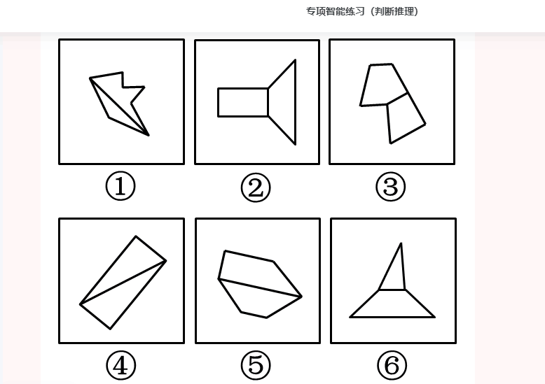

###  共40道，答对25道，正确率63%


- 1


```

阳春白雪 对于 （    ） 相当于 （    ） 对于 度日如年

A

曲高和寡；浮光掠影

B

余音绕梁；潜移默化

C

靡靡之音；如隔三秋

D

下里巴人；白驹过隙


正确答案是： D，你的答案是： C


阳春白雪”比喻高深的不通俗的文学艺术
“曲高和寡”原指知音难得，现比喻言论或作品不通俗，能了解的人很少，二者为近义关系
浮光掠影”比喻观察不细致，学习不深入，印象不深刻
靡靡之音”是指使人萎靡不振的音乐
如隔三秋”形容情人之间思慕殷切或是良师益友之间的思念之情
度日如年”是指过一天像过一年那样长，形容日子很不好过
下里巴人”比喻通俗的文学艺术，二者为反义关系

C项：“阳春白雪”比喻高深的不通俗的文学艺术，“靡靡之音”是指使人萎靡不振的音乐，比如使人颓废的、低级趣味的乐曲，二者无明显逻辑关系；“如隔三秋”形容情人之间思慕殷切或是良师益友之间的思念之情，“度日如年”是指过一天像过一年那样长，形容日子很不好过，二者无明显逻辑关系，前后逻辑关系不一致，排除；

D项：“阳春白雪”比喻高深的不通俗的文学艺术，“下里巴人”比喻通俗的文学艺术，二者为反义关系；“白驹过隙”形容时间过得极快，“度日如年”是指过一天像过一年那样长，形容日子很不好过，二者为反义关系，前后逻辑关系一致，当选。

故正确答案为D。
```

- 2(时间关系)


```
创作：印刷：发行

A

撒网：钓鱼：捕捞

B

生产：研发：采购

C

播种：开花：结果

D

拆除：安装：维修


正确答案是： C，你的答案是： D收起
解析
第一步：判断题干词语间逻辑关系。

先创作，再印刷，最后发行，三者是时间先后顺序的对应关系。

第二步：判断选项词语间逻辑关系。

A项：先撒网，再捕捞，二者和钓鱼没有明显的时间先后顺序，与题干逻辑关系不一致，排除；

B项：先研发，再生产，最后采购，研发应在生产之前发生，与题干逻辑关系不一致，排除；

C项：先播种，再开花，最后结果，三者是时间先后顺序的对应关系，与题干逻辑关系一致，当选；

D项：先安装，再拆除，安装应在拆除之前发生，与题干逻辑关系不一致，排除。

故正确答案为C。
```
- 3（注意关键词自己）


```
人们常常系统地高估自己对事件的控制程度或影响力，而低估机会、运气等不可控制因素在事件发展过程及其结果上所扮演的角色，这一现象被称为控制错觉。

根据上述定义，下列没有体现控制错觉的是：

A

人们想用骰子掷出“双6”时会在心中默念，用力揉捏骰子，相信这样做就会如愿

B

一些股民往往借助几个简单的因素预测大盘指数，结果常常是谬以千里

C

某企业经理认为今年当地举办的运动会对企业发展非常有利，预测今年营业额会有所上涨

D

景区某摆渡车驾驶员常年走山路，认为自己路况熟、技术好，所以在山路上开得非常快


正确答案是： C，你的答案是： A收起
解析
第一步：找出定义关键词。

“高估自己对事件的控制程度或影响力”、“低估机会、运气等不可控制因素在事件发展过程及其结果上所扮演的角色”。

第二步：逐一分析选项。

A项：掷骰子是随机事件，人们心中默念并用力揉捏骰子，相信这样做会掷出“双6”，符合“高估自己对事件的控制程度或影响力”，也低估了不可控因素的作用，符合定义，排除；

B项：一些股民仅借助“几个简单的因素”就认为自己能够预测大盘指数，符合“高估自己对事件的控制程度或影响力”，符合定义，排除；

C项：某企业经理认为运动会对企业发展有利，能够增加营业额，预测的是运动会对企业的影响，不符合“高估自己对事件的控制程度或影响力”，不符合定义，当选；

D项：某摆渡车驾驶员认为自己路况熟、技术好而在山路上开快车，体现了此人因为“高估自己对事件的控制程度或影响力”而进行了不安全的驾驶行为，符合定义，排除。

本题为选非题，故正确答案为C。
```
- 4（这次考得是相切线得长短）



```
特殊考点——考查图形内部组成特征。每组图形都是由两个图形连接而成，所以观察每组图形的内部特征。①④⑤中两个图形的交线是两个元素最长的线段，②③⑥中两个图形的交线是两个元素最短的线段。

故正确答案为D。
```
- 5（判断有时候会考多种关系。比如，同时考种数，并列，还加上二级辨析材料不同。）


```
檀香：麝香：香料

A

木材：钢筋：建材

B

日光：月光：光明

C

薯条：粉条：食物

D

鲸鱼：鲍鱼：海鱼


正确答案是： A，你的答案是： C收起
解析
第一步：判断题干词语间逻辑关系。

檀香取于檀香科乔木檀香树的木质心材，属于香料的一种；麝香为鹿科动物麝的雄性腺囊中的分泌物干燥而成，是一种高级香料；二者为并列关系且原料不同，同时二者均与香料构成种属关系。

第二步：判断选项词语间逻辑关系。

A项：木材是建材的一种，钢筋是建材的一种，二者为并列关系且原料不同，同时二者均与建材构成种属关系，与题干逻辑关系一致，当选；

B项：日光与月光都是光的一种，但不是光明的一种，二者与光明不构成种属关系，与题干逻辑关系不一致，排除；

C项：薯条与粉条一般都是由土豆作为原材料加工而成的食物，二者为并列关系但原料可以相同，与题干逻辑关系不一致，排除；

D项：鲸鱼属于哺乳动物，不属于鱼类，与题干逻辑关系不一致，排除。

故正确答案为A。
```
- 6(a属于直接否定论点)


```
聚苯乙烯泡沫塑料广泛用于制造一次性咖啡杯等用品，但其原料来自石油等不可再生能源，生成的聚苯乙烯高温条件下可能产生对人体有害组分，且无法自然降解，燃烧时还会造成环境污染。研究人员开发出一种源自特定植物的环保材料，这种环保材料质量较轻，可支撑自身重量200倍的物体而不变形，还可自然降解，燃烧不会产生污染性烟尘。研究人员认为，这种环保材料有望成为制造一次性咖啡杯等用品的重要材料。

以下哪项如果为真，最能削弱上述结论？

A

这种环保材料不具有一次性咖啡杯所需的良好隔热性能，盛装液体后也很难具有聚苯乙烯泡沫塑料的耐久性

B

这种环保材料大规模投入生产后，会挤垮生产聚苯乙烯泡沫塑料的厂家，减少市场上一次性咖啡杯等用品的供应量

C

对该植物有过敏反应的人群使用这种环保材料会产生过敏反应，该环保材料不适用于这类过敏人群

D

这种环保材料还不能完全替代聚苯乙烯泡沫材料，还有很多用品仍然需要使用聚苯乙烯泡沫材料生产


正确答案是： A，你的答案是： C收起
解析
第一步：找出论点和论据。

论点：这种环保材料有望成为制造一次性咖啡杯等用品的重要材料。

论据：聚苯乙烯泡沫塑料广泛用于制造一次性咖啡杯等用品，但其原料来自石油等不可再生能源，生成的聚苯乙烯高温条件下可能产生对人体有害组分，且无法自然降解，燃烧时还会造成环境污染。研究人员开发出一种源自特定植物的环保材料，这种环保材料质量较轻，可支撑自身重量200倍的物体而不变形，还可自然降解，燃烧不会产生污染性烟尘。

本题论据讨论的是研发出的特定环保材料比聚苯乙烯泡沫塑料更环保、更安全，论点讨论的是这种环保材料有望成为制造一次性咖啡杯等用品的重要材料，本质都是在说研发出的特定环保材料比聚苯乙烯泡沫塑料更好，更适合制造一次性咖啡杯等用品，论点论据话题一致，削弱优先考虑否定论点。

第二步：逐一分析选项。

A项：该项说这种环保材料不具有一次性咖啡杯所需的良好隔热性能且耐久性不如聚苯乙烯泡沫塑料，说明即使这种环保材料更环保，但也不能成为制造一次性咖啡杯等用品的重要材料，直接否定论点，可以削弱，保留；

B项：该项说的是这种环保材料大规模生产后，一次性咖啡杯等用品的供应量会减少，而论点说的是这种环保材料是否能够成为制造一次性咖啡杯等用品的重要材料，话题不一致，无法削弱，排除；

C项：该项说过敏人群无法使用这种环保材料，说明这种材料在适用范围上有缺陷，可能无法成为制造一次性咖啡杯等用品的重要材料，举例削弱论点，可以削弱，保留；

D项：该项讨论的是这种环保材料是否能够完全替代聚苯乙烯泡沫材料，而论点说的是这种环保材料是否能成为制造一次性咖啡杯等用品的重要材料，成为重要材料不代表要完全替代聚苯乙烯泡沫材料，话题不一致，无法削弱，排除。

比较A、C两项，A项直接否定论点的削弱力度强于C项举例削弱论点，A项当选。

故正确答案为A。
```

- 7(注意其中，签订具有权力义务的协议。而d不属于)

```
行政机关为了实现行政管理或者公共服务目标，与公民、法人或者其他组织协商订立的具有行政法上权利义务内容的协议，属于行政协议。

根据上述定义，下列不属于行政协议的是：

A

某县自然资源管理局与某矿业公司签订矿业权出让协议

B

某区人民政府与王某签订政府保障性住房租赁协议

C

县房屋征收部门与被征人某教育局签订国有土地上房屋征收补偿协议

D

某市公安机关和某市交通管理部门签订关于联合整治超限超载专项行动合作协议


正确答案是： D，你的答案是： C收起
解析
第一步：找出定义关键词。

“行政机关为了实现行政管理或者公共服务目标”、“与公民、法人或者其他组织协商订立”、“具有行政法上权利义务内容的协议”。

第二步：逐一分析选项。

A项：某县自然资源管理局与某矿业公司，符合“行政机关为了实现行政管理或者公共服务目标”、“与公民、法人或者其他组织协商订立”；签订矿业权出让协议，符合“具有行政法上权利义务内容的协议”，符合定义，排除；

B项：某区人民政府与王某，符合“行政机关为了实现行政管理或者公共服务目标”、“与公民、法人或者其他组织协商订立”；签订政府保障性住房租赁协议，符合“具有行政法上权利义务内容的协议”，符合定义，排除；

C项：县房屋征收部门与被征人某教育局，符合“行政机关为了实现行政管理或者公共服务目标”、“与公民、法人或者其他组织协商订立”；签订国有土地上房屋征收补偿协议，符合“具有行政法上权利义务内容的协议”，符合定义，排除；

D项：关于联合整治超限超载专项行动合作协议，不符合“具有行政法上权利义务内容的协议”，不符合定义，当选。

本题为选非题，故正确答案为D。
```

- 8(不该错)

```

贸易摩擦：出口下滑

A

醉酒驾驶：例行检查

B

行政处罚：违规生产

C

商业垄断：市场失灵

D

职务犯罪：谋取私利


正确答案是： C，你的答案是： D收起
解析
第一步：判断题干词语间逻辑关系。

因为贸易摩擦，所以出口下滑，二者为因果对应关系。

第二步：判断选项词语间逻辑关系。

A项：通过例行检查可以发现是否有人醉酒驾驶，二者并非因果对应关系，与题干逻辑关系不一致，排除；

B项：因为违规生产，所以遭受行政处罚，二者为因果关系，但词语顺序与题干相反，与题干逻辑关系不一致，排除；

C项：因为商业垄断，所以市场失灵，二者为因果关系，与题干逻辑关系一致，当选；

D项：职务犯罪的目的是谋取私利，二者为方式与目的对应关系，与题干逻辑关系不一致，排除。

故正确答案为C。
```

- 9

```
羔羊跪乳：乌鸦反哺

A

昙花一现：惊鸿一瞥

B

魂不附体：失魂落魄

C

锋芒毕露：锐不可当

D

朽木难雕：孺子可教


正确答案是： B，你的答案是： D收起


羔羊跪乳和乌鸦反哺出自古训《增广贤文》，原文是“羊有跪乳之恩，鸦有反哺之义”。羔羊跪乳和乌鸦反哺都有感恩父母、奉养长辈的意思，二者是近义关系。
昙花一现指美好的事物出现的时间很短，惊鸿一瞥的意思是人只是匆匆看了一眼，却给人留下强烈、深刻的印象，常用来形容身形轻盈娇艳的女子摄人心魄的目光，二者不是近义关系
魂不附体的意思是灵魂离开了身体，形容极端惊慌，失魂落魄的意思是魂魄离开了身体，也是形容惊慌忧虑，二者是近义关系
锋芒毕露的意思是刀锋和矛尖都露出来，比喻锐气和才干全都显露、透露出来，锐不可当形容勇往直前的气势不可抵挡，二者不是近义关系
朽木难雕是指腐烂的木头很难雕刻，人不可造就或事情无法挽救，孺子可教本义为小孩子是可以教诲的，后形容年轻人有培养前途，二者是反义关系
```

- 10 (关系找错了，大雁和海鸥都属于飞禽)

```
飞禽走兽：大雁：海鸥

A

珍馐美馔：山珍：海味

B

花鸟鱼虫：鹦鹉：画眉

C

锦衣玉食：蟒袍：霞帔

D

卧虎藏龙：猛虎：蛟龙


正确答案是： C，你的答案是： D收起
解析
第一步：判断题干词语间的逻辑关系。

飞禽走兽泛指鸟类和兽类，飞禽和走兽是并列关系；大雁和海鸥是并列关系，且都是飞禽的一种。

第二步：判断选项词语间的逻辑关系。

A项：珍馐美馔意思为好吃的食物，珍馐和美馔都是指食物；山珍是产自山野的名贵珍稀食品，海味是产自海洋的名贵珍稀食品，山珍和海味是并列关系，但二者都是珍馐美馔的一种，与题干逻辑关系不一致，排除；

B项：花鸟鱼虫是并列关系，鹦鹉和画眉是并列关系，且都是鸟类的一种，与题干逻辑关系不一致，排除；

C项：锦衣玉食指华美的衣服和美食，锦衣和玉食是并列关系；蟒袍和霞帔是并列关系，且都是锦衣的一种，与题干逻辑关系一致，当选；

D项：卧虎藏龙指隐藏着未被发现的人才或隐藏不露的人才，卧虎和藏龙是并列关系；猛虎和蛟龙是并列关系，但是分属于卧虎和藏龙，与题干逻辑关系不一致，排除。

故正确答案为C。

```


- 11

```

为满足乘客用餐多样化的需要，某地区推出了旅客列车的互联网订餐服务。该服务上线一年以来，通过线上渠道（官网、订票APP等）进行了大量的宣传，但订单量除了刚推出的前三个月有小幅增长外，其他月份并未增长，甚至下降。由此可见，该地区出行的旅客对列车提供的网上订餐服务需求量不高。

以下能够削弱上述结论的有几项？

①接受旅客列车网络订餐的餐厅数量较少，食物品种相对单一

②即使推出了互联网订餐，大部分乘客还是愿意去空间较大的餐车用餐

③该地区的短程列车数量较多，相比短程列车，长程列车的网上订餐量更大

④线上宣传缺少对用户的精准定位，许多订票用户并未注意到列车有网上订餐服务

A

1项

B

2项

C

3项

D

4项


正确答案是： B，你的答案是： C收起
解析
第一步：找出论点和论据。

论点：该地区出行的旅客对列车提供的网上订餐服务需求量不高。

论据：该服务上线一年以来，通过线上渠道（官网、订票APP等）进行了大量的宣传，但订单量除了刚推出的前三个月有小幅增长外，其他月份并未增长，甚至下降。

论点主要讨论该地区出行的旅客对列车提供的网上订餐服务需求量不高，论据主要讨论该地区出行的旅客的列车网上订餐的订单量不高，二者话题不一致，削弱优先考虑拆桥，其次考虑否定论点或否定论据。

第二步：逐一分析。

①项：指出订单量少的原因可能是由于餐厅数量少，而非需求量小，切断了论点和论据之间的关系，属于拆桥项；

②项：大部分乘客还是愿意去餐车用餐，说明人们对于网上订餐服务的需求量确实不高，属于加强项；

③项：该地区短程列车数量较多，短程列车比长程列车的网上订餐量更小，但是订餐量是否由需求决定不明确，因此无法说明该地区网上订餐服务的需求量情况，不能削弱；

④项：指出订单量少的原因可能是许多用户并未注意到网上订餐服务，而非需求量小，切断了论点和论据之间的关系，属于拆桥项。

综上所述，能够削弱结论的有2项。

故正确答案为B。
```

- 12

```


```

- 13

```


```

- 14

```


```