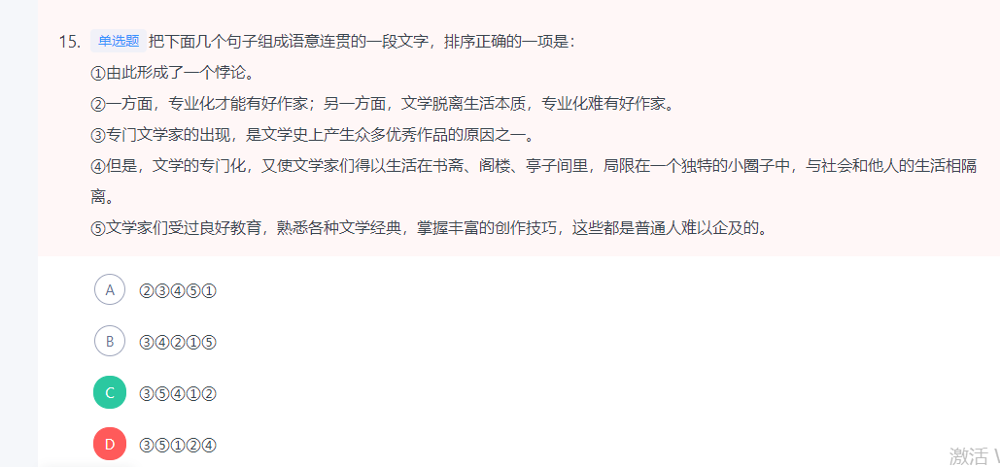
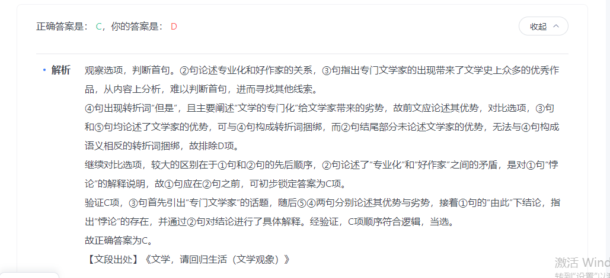

## 言语 语句表达
###  共15道，答对12道，正确率80%，用时22分钟

- 1

```
在哲学家看来，语言是存在的家园，语言代表物质的存在，代表人的存在。荷尔德林既是诗人，也是哲学家，他的名句“词语破碎处，无物可存在”通过海德格尔的阐释更加得到了升华，扩大了其影响力。在海德格尔看来，“语言乃是人的所有物”“唯有语言处，才有世界”“语言足以担保——也就是说，语言保证了人——作为历史性的人而存在的可能性”，语言“是那种拥有人之存在的最高可能性的本有事件”。所以，语言是人之存在的明证。难怪那么多哲学家都对语言研究感兴趣，甚至还有专门的语言哲学分支。

这段文字意在说明：(A没有提到关键词哲学)

A 语言即是存在

B 哲学思想的传承

C 语言深刻影响哲学

D 哲学家对语言的看法

文段开篇引出话题，指出哲学家眼中语言的重要性，接着通过“荷尔德林”及“海德格尔”两位哲学家的例子进行论证。随后通过结论词“所以”进行总结，说明语言是人存在的明证，依旧强调语言的重要性。最后尾句通过“难怪”进行总结，指出很多哲学家对语言研究感兴趣，还有专门的语言哲学分支。故文段为分总结构，重点在于尾句，强调语言对哲学的深刻影响，对应C项。

A项，没有提到文段的主题词“哲学”，且文段表述为哲学家看来“语言是存在的家园”，并不是语言是存在本身，偷换概念，排除；

B项，文段并未提及“哲学思想的传承”，无中生有，排除；

D项，“哲学家对语言的看法”对应文段开篇引出话题的部分，非文段重点，排除。

故正确答案为C。
```

- 2

```
正如卢梭所说，“规章只不过是穹隆顶上的拱梁，唯有慢慢诞生的风尚才最后构成那个穹隆顶上的不可动摇的拱心石”。管用而有效的法律，既不是铭刻在大理石上，也不是铭刻在铜表上，而是铭刻在公民的内心里。（B项目没有提到严谨性）

这段文字没有暗示的信息是：

A 没有了法治理念，法治就没了灵魂，成了无本之木、无源之水

B 法律条文的严谨性和民众对法律的深透了解是推行法治的前提

C 只有努力使法治成为全民信仰，才能推动法治，推动社会进步

D 人们法治精神的缺失必将导致法律悬空、制度空转、法治不兴

由“管用而有效的法律，既不是······，也不是······，而是铭刻在公民的内心里”可知，此处强调公民发自内心理解、认同、敬畏法律，法律才管用，A、C、D三项均可从文段中推知，排除。B项“法律条文的严谨性”无中生有，文段未涉及法律条文是否要严谨，当选。

本题为选非题，故正确答案为B。
```

- 3（文中的主题词为种子，在最后两句话里面有体现）

```
目前，我国自主选育品种播种面积占95%以上，良种对粮食增产贡献率已超过45%，为粮食连年丰收和重要农产品稳产保供提供了关键支撑。然而，我国种业自主创新水平与发达国家还有差距，一些品种、领域和环节会影响农业发展速度、质量和效益。这就要求我们加强农业种质资源保护利用，加快推进关键核心技术攻关，缩小玉米、大豆等品种和国际先进水平的差距，确保重要农产品种源自主可控。同时，打通种子生产、加工、销售、技术服务等环节，逐步完善产学研用深度融合的创新链条，加快提升种业产业化水平，让一粒粒好种子长成农民的致富希望。

最适合做这段文字标题的是：

A 打造种子这枚农业“芯片”

B 要让创新为中国农业赋能

C 种出农民致富的新希望

D 种业产业化发展的启示

文段首先介绍良种对于粮食丰收、农产品稳产保供的重要性，接下来通过“然而”进行转折，提出问题，我国种业自主创新水平与发达国家存在差距，随后通过指代词“这”进行总结，并通过并列关联词“同时”引导两方面对策，即加强农业种质资源保护利用，推进技术攻关、完善创新链条，提升种业产业化水平。故文段为提出问题+解决问题的结构，重点为对策，即提升种业产业化水平，助力农业发展，A项概括恰当，且“打造······芯片”的表述非常形象，当选。

B项，缺少主题词“种子”，偏离文段核心话题，排除；

C项，“种出新希望”的表述相较于文段主题词“种子”范围扩大，且选项强调的是“种”这个动作，而非“种子”这个核心名词，排除；

D项，“启示”表述不明确，且“产业化发展”表述片面，排除。

故正确答案为A。
```

- 4

```

```

###  共15道，答对10道，正确率67%

- 1 （后文连接的是社会的话题。D项话题不一致）

```
艺术生的培养目前存在一个很矛盾的现象：一方面学习艺术表演的学生人数很多，就业压力大；另一方面却是人民群众对文艺演出的需求越来越强烈，对好的文艺作品期待值很高，这是一个不争的事实。其实各大艺术院校每年的艺术创作成果并不少，其中不乏精品，但是，                    。因此，在艺术生的培养过程中可以给学生创造更多的社会演出机会。

填入画线部分最恰当的一项是：


C

艺术创作成果与人民群众生活之间缺少一个通畅的交流渠道

D

每个艺术人才的培养，都需要艺术理论和舞台实践的有机结合


正确答案是： C，你的答案是： D收起
解析
横线出现在文段中间，需结合前后文内容进行分析，做到承上启下。横线前介绍艺术生的培养目前存在两方面的矛盾：就业压力大和人民群众对好的作品期待高。接着论述各大艺术院校的创作成果很多，也有很多精品，属于比较积极的一方面，接着出现转折关联词“但是”，可知前后语义相反，横线处应该体现出存在的问题。并且根据后文总结词“因此”可知，要给学生创造更多的社会演出机会，故横线处应体现的内容为：虽然艺术院校有很多精品，但是学生缺少社会演出的机会，对应C项。


D项，“艺术理论和舞台实践的有机结合”文段并未提及，无中生有，且前文论述的话题是“艺术作品”，与前文话题不一致，衔接不当，排除。

故正确答案为C。
```

- 2（最后一句的关键词是电子跃迁）

```
原子钟在日常生活和科学研究中非常重要。它以原子内部的电子在两个能级间跳跃时辐射出来的电磁波为标准，去控制校准电子振荡器，实现精准的时间测量。与原子相比，高电荷离子的外层电子与原子核的结合更强，对外部场的波动更不敏感，狭义相对论和量子电动力学的效应也更显著。因此，高电荷离子是未来研发更精准原子钟的理想选择之一。然而，由于内部结构复杂，要在高电荷离子中识别适合于原子钟的电子跃迁非常困难，常用的光谱法测量这种跃迁也不够精准。

根据这段文字，接下来最可能讲的是：


B

测量电子跃迁的最新技术


D

光谱法在原子钟研发中的作用


正确答案是： B，你的答案是： D收起
解析
文段首先引出了“原子钟”的话题，并介绍了其工作原理，随后通过结论词“因此”总结前文，指出高电荷离子是未来研发更精准原子钟的理想选择之一。接着尾句通过转折词“然而”引出问题，指出在高电荷离子中识别适合原子钟的电子跃迁很困难，常用方法也不精准。结合全文及尾句内容，下文应该围绕解决“电子跃迁”这一问题提出对策，对应B项。


D项，文段尾句已经提及“常用的光谱法测量这种跃迁也不够精准”，故文段接下来不会围绕光谱法的作用进行展开，排除。

故正确答案为B。
```

- 3（提出了问题，后文应该讲解决措施）

```
目前的全球治理体系是现代文明的产物，是经过长时间博弈和磨合后逐渐形成的。当前的全球治理体系存在两方面问题：一是这一体系仍存在许多合理性，对人类和平与发展有十分重要的作用，但随着时代的发展，这一治理体系及其体制机制未能适应新情况，出现了许多问题，亟需进行改革；二是现代化先发国家在这一体系中仍占据主导地位，长期把控国际外交话语权，将以资本为中心的逻辑贯穿于全球治理体系和治理体制机制。因此，要将构建人类命运共同体理念融入既有的全球治理体系及其相应体制机制，就必须正视上述两方面。

这段文字接下来最可能讲的是：

A

我国参与全球治理体系改革的路径

B

人类命运共同体理念的形成与发展

文段开篇介绍当前全球治理体系如何形成，接下来指出当前全球治理体系存在两方面的问题，即“不适应新情况”以及“在现代化先发国家长期主导下，以资本为中心带来诸多弊端”。尾句“因此”总结前文提出“必须正视上述两方面”的问题。故接下来应围绕解决“当前的全球治理体系”存在的问题提出对策，即“全球治理体系改革”，对应A项。

B项，“人类命运共同体理念”偏离文段中心话题“全球治理体系”，排除；

C项，文段尾句主要强调如何正视问题，故下文不可能围绕“机遇”进行论述，排除；

D项，当前存在的“制度缺陷”文段已经论述过，排除。

故正确答案为A。

```

- 4 （文章提出了创新是重中之重。所以要有思想以及创新。）

```
  。党的历次集中教育活动，都以思想教育打头，着力解决学习不深入、思想不统一、行动跟不上的问题，既绵绵用力又集中发力，推动全党思想上统一、政治上团结、行动上一致。要把学习贯彻党的创新理论作为思想武装的重中之重，同学习马克思主义基本原理贯通起来，同学习党史、新中国史、改革开放史、社会主义发展史结合起来，同新时代我们进行伟大斗争、建设伟大工程、推进伟大事业、实现伟大梦想的丰富实践联系起来，在学懂弄通做实上下苦功夫，在解放思想中统一思想，在深化认识中提高认识，切实增强贯彻落实的思想自觉和行动自觉。

填入画横线部分最恰当的一项是：


C

理论创新每前进一步，理论武装就要跟进一步

D

一个民族要走在时代前列，一刻不能没有思想指引


横线出现在文段开头，需概括后文的核心内容。文段首先指出党的历次集中教育活动，都以思想教育打头，通过思想教育解决学习、思想、行动方面的问题，接着通过“要”“重中之重”强调思想武装的重点是学习贯彻党的创新理论，后文论述学习贯彻党的创新理论的具体展开方式，故文段重在强调学习贯彻党的创新理论对思想武装的重要性，把握核心话题“创新理论”“思想武装”，对应C项。


D项，重在强调“思想指引”，缺少文段主题词“创新理论”，排除。

故正确答案为C。
```

###  共15道，答对6道，正确率40%

- 1 （造纸的起源与中药学的关系，无中生有，文段只是提到用西汉纸包装中药，并未涉及到“中药学”。而且范围扩大，我国。）

```
这些年西汉纸不断出土，从材料上看，西汉纸大多夹带许多未被捣碎的纤维团，这种纸制作粗糙，组织松散，纸浆分布不匀，透眼较多，不太适于落笔着墨，书写起来也不顺畅。西汉纸大多不平整，像被揉搓过一样。出土的很多纸上都没有字，即便有字，也是写在纸的右下角，常见的字有“付子”“细辛”等。经考证它们基本都是汉代的药名。于是有学者推论，如果这类纸用于包装药材，那些写在纸角的字，恰好就会露在药包的表面。这样看来，                    。

填入画横线部分最恰当的一项是：


C

西汉的古纸极有可能主要用来包装东西

D

我国古代造纸起源与中药学发展不无关系


正确答案是： C，你的答案是： D收起
解析
横线处于文段结尾，并且横线前面出现“这样看来”，指代词是对前文的总结，故需要分析前文内容。文段开篇提到西汉纸从材料上看不太适合书写，又提到纸张不平整，像被揉搓过，大多没有字，即便有字也是写在右下角且多是药名，最后指出学者根据考证推论出这类纸是用于包药材的，由此可知西汉纸的作用可能是用来包东西，对应C项。


D项，造纸的起源与中药学的关系，无中生有，文段只是提到用西汉纸包装中药，并未涉及到“中药学”，排除。

故正确答案为C。
```

- 2 （正因为如此作为尾句比较好）

```
①压力面前，一些人声称理想很丰满、现实很骨感

②在他们看来，只有为个人利益而活着才是最现实和最有意义的

③还有一些人在理想与现实反差的所谓痛苦中不能自拔，迷茫和沉沦

④一些人甚至开始奚落崇高、嘲笑理想

⑤正因如此，那些真正为理想而活着的人，才显得格外难能可贵

⑥岁月的淘洗中，坚守理想并不是一件容易的事

将以上6个句子重新排列，语序正确的是：


B 614235

C 142356

对比选项，判断首句，1句指出一些人对理想、现实的看法，4句指出坚守理想并不容易，均可作为首句。

继续观察文段，寻找线索。4句中出现“甚至”递进词，根据关联词捆绑，对比4句前接1句还是5句，①句“一些人声称······”与4句“一些人甚至”主体一致，可以构成递进，5句指出为理想而活难能可贵，与4句“嘲笑理想”相违背，不能构成递进，故14两句捆绑，排除D项。

2句中出现“他们”指代词，寻找指代对象，对比2句前接3句还是4句，4句指出一些人奚落崇高、嘲笑理想，2句指出他们更重视个人利益，不在乎理想，42两句内容相呼应，4句可为②句指代对象，2句“在理想与现实······不能自拔”可知，这部分人是重视理想的，与2句态度不一致，无法作为2句指代对象，故42两句捆绑，排除A项。

对比B、C两项，区别在于尾句。5句中出现“正因如此”结论词，适合作为尾句，6句指出坚守理想并不容易，引出问题，更适合作为话题引入，排除C项。

故正确答案为B。
```

- 3 （媒体调查了什么事情，比较重要。就是诱导青少年消费。）

```

“办公室里三代人，70后存钱，80后投资，90后负债，而90后的父母在替孩子还贷。”这句话，道出了以90后乃至00后为主的部分年轻人超前消费、负债消费的典型现象。年纪轻轻，却早早背上了债务负担成为“负翁”。有媒体调查发现，越来越低的借钱门槛、过度消费的刻意诱导等，对涉世未深的年轻人负债消费推波助澜。

作者接下来最可能谈论的是

A

应该如何看待年轻人的透支消费


C

媒体对健康生活方式的引导作用


正确答案是： A，你的答案是： C收起
解析
根据提问方式可知，本题为接语选择题，重点关注文段尾句。尾句论述媒体发现，越来越低的借钱门槛、过度消费等等会对年轻人的负债消费产生影响，故后文也应围绕“年轻人负债消费”这一核心话题展开，对应A项，透支消费为负债消费的同义替换。

B项的“啃老现象”，C项的“健康生活方式”，D项的“单身人群的消费行为”三项均未提及年轻人过度消费这一核心话题，排除。

故正确答案为A。
```

- 4 （信息的确定性是为了安抚焦虑，所以如何安抚焦虑才是重点）

```

，是一个重要的议题。某种程度上，媒体为了传播效果，通常都希望获得一种“确定性”，比如确定某种药物有效、确定“拐点”何时到来等，这样的“重磅”报道自然也会迎来更多点击率。但是，一些报道引发的连锁反应，也让我们看到：不加辨别地去追求“确定性”，并不是抚平受众焦虑的办法，反而会进一步让人们产生不安，并影响媒体的公信力。因此，对于抗疫报道来说，应当接受疫情的“不确定性”，避免因不专业、不恰当的操作导致信息焦虑。

填入横线处最恰当的一项是：


B

如何避免引发信息焦虑

C

媒体不应一味地追求“确定性”


正确答案是： B，你的答案是： C收起
解析
横线出现在文段开头，且根据“议题”可知，需填入一个表示“议题”的句子。后文首先提到为了传播效果，媒体希望“确定性”，紧接着通过“但是”指出问题，即不加区分的追求“确定性”会让人们产生不安，尾句“因此”提出对策，要接受“不确定性”，避免导致信息焦虑。故横线处应为如何避免信息焦虑的议题，对应B项。


C项“不应一味地追求‘确定性’”、均为明确对策表述，而非讨论的议题，排除。

故正确答案为B。

```

- 5( 强调人的重要性，所以选D)

```

“黄河百害，唯富一套”是人们耳熟能详的俗语。这“唯富一套”的局面是如何形成的呢？                    ：两千多年前的秦汉先民们在这里兴修水利，开创了自流灌溉、无坝引水等水利工程奇迹，这些创造性的水利工程与举世闻名的都江堰相比也毫不逊色。

填入画横线部分最恰当的一项是：

A

自汉代以来，利用黄河灌溉的宁夏平原就成为西北最大的灌区

B

宁夏平原得天独厚的水利灌溉条件，自古就吸引了各个朝代的屯垦军民

C

流淌在宁夏境内的这不足400公里的黄河河段，几乎被视为宁夏的生存基础

D

除了自然的恩宠外，生活在宁夏这片土地上的人们也一直孜孜不倦地努力着


正确答案是： D，你的答案是： C收起
解析
本题为语句填空题，横线在文段中间，需结合上下文内容进行分析。横线前引出黄河这一话题，并提出问题，即黄河流域“唯富一套”的局面是如何形成的。由横线后的冒号可知，后文是对该句的解释说明，后文论述秦汉先民兴修水利工程收效显著，故横线处应体现“唯富一套”局面形成的原因与秦汉先民对自然的改造，与建筑水利工程密不可分，对应D项。

A项“利用黄河灌溉”、B项“得天独厚的水利灌溉条件”、C项“这不足400公里的黄河河段”，均为强调黄河的自然资源优势，而横线后强调秦汉先民通过兴修水利工程对自然的改造，与后文话题衔接不当，排除。

故正确答案为D。
```


- 6 (要牢牢把握主题词市场)

```
农民卖粮舒心，源于市场之“手”用得好。2020年的夏粮生产，不仅数量增加，质量也在提升。一个重要指标就是专用麦比例高，全国优质强筋弱筋小麦面积占比，比上年提高2.8个百分点。从目前收购市场情况看，每斤优质小麦要比普通品种高出0.1元左右。这背后，                    。如今，多元化市场主体入市收购，既让丰收粮有了更加多样化的销售渠道，也让优质粮食品种销路更好、价格更高，优粮优价成为种粮农民增收的“金钥匙”。

填入画横线部分最恰当的一项是：

A

说到底就是稳住这些农民的种粮收益，保护农民的种粮积极性

B

正是粮食收储制度改革持续推进，市场机制作用得到更好发挥

C

全国农户构成了粮食安全的坚强基石，稳住粮食生产的好形势

D

通过优化供给体系，拓展粮食产加销增值空间，分享增值收益


正确答案是： B，你的答案是： D收起
解析
本题为语句填空题，横线在文段中间，需联系前后文把握话题的一致性。横线前首先指出农民粮食卖的好得益于市场，紧接着指出全国优质强筋弱筋小麦面积占比不断提高且价格也高于普通品种，横线后论述“多元化市场主体入市收购”使得优质粮食品种销路好、价格高，故横线处所填句子应体现优质粮食销路好、价格高的原因在于“市场”发挥作用，对应B项。

A项，“稳住这些农民的种粮收益，保护农民的种粮积极性”，无法与后文“市场”衔接，排除；

C项，“全国农户构成了粮食安全的坚强基石”，强调农户的重要性，而文段围绕“市场”展开，无中生有，排除；

D项，“通过优化供给体系”强调“供给”，“供给”无中生有，并且未提及“市场”，排除。

故正确答案为B。
```

- 7 （这句话前文是职业有关，后文是教育有关。）

```
李克强总理勉励同学们说，①.国家不仅需要高端科研人才，也非常需要高技能人才，你们有真正的技术，就业门路就广，收入也会较高。②.希望大家注重培养专业精神、职业精神、工匠精神，这是成为人才很重要的素质。③.他叮嘱随行部门负责人，培养人才不能只在教室，也不能只在车间田野。④.要深化教育体制改革，支持企业和社会力量兴办职业教育，用高素质人力资源推动高质量发展。

“职业教育是教育和社会实际相结合的有效载体。”这句话是从上段文字中抽离出来的，它在文中最合适的位置是

A

①

B

②

C

③

D

④


正确答案是： D，你的答案是： C收起
解析
填入语句需要和上下文话题衔接恰当，填入语句围绕“职业教育”来展开，强调教育与社会实际相结合，文段④的位置前文指出“培养人才不能只在教室，也不能只在车间田野”，可知强调培养人才要结合使用多种方法，所填语句与前文衔接恰当。后文提及“支持企业和社会力量兴办职业教育”，与所填语句话题一致，D项当选。

A项、B项、C项，前后均未提及“职业教育”，故与所填语句话题不一致，排除。

故正确答案为D。
```
- 8(指代词，指的是欲望，而不是影响)

```

①如果能不肥胖、不生病，如果绝症能被消灭，就好了

②到了现代，科学让绝大多数人知道公然声称自己要追寻长生会显得很傻

③对生命延续的渴望是刻在骨子里的

④这些难被满足的欲望，是神话里生命树的果实，也是古代皇帝的丹药

⑤科学未到之处，就有机会酝酿出“造神运动”的狂欢，让消费者辨真伪的成本和难度前所未有地增加了

⑥但是假借科学之名的骗局也更高级、复杂

将以上6个句子重新排序，语序正确的是

A

314265

B 312465

因此④句之前一定要提到某些“欲望”，对应选项，可以发现①句“不肥胖、不生病，将绝症消灭”均为人类的欲望，与指代词对应得当；②句论述现代科学对人产生的影响，与欲望无关，无法构成指代词捆绑，排除B、C两项；
```


- 9 （最后一句是对倒数第二句的解释说明）


```


```

###  共15道，答对8道，正确率53%，用时18分钟

- 1 （指代词这，只得是细胞流动性，而文中只有3是讲细胞流动性。所以31连在一起。而4是对5的解释，5,4连在一起。）

```

①为应对这一问题，深海生物的对策是增加细胞膜中不饱和脂肪的比例，这些脂肪在低温下呈液态，能够保持细胞膜的流动性

②我们可以用吹气球作类比，在空气中吹气球很容易，但如果你在游泳池底部试着吹气球，就会发现这要困难得多，因为气体分子都被压缩了

③低温和高压对动物的身体会产生特别的影响，在这种环境下，生物细胞膜中的脂质会变为固态，细胞膜失去了流动性就无法行使正常生理功能

④蛋白质在生物体内承担了多种生理功能，为了发挥其作用，蛋白质分子必须能够自由地改变它们的大小和形状，但这在高压之下是很困难的

⑤压力还会对蛋白质造成严重的影响

将以上5个句子重新排列，语序正确的是：


B

35241

C 31542

本题考查语句排序，从选项入手，观察确定首句。

3介绍生物细胞膜中的脂质会变为固态的情况，4论证蛋白质在高压下很难发挥作用，3与4不好判断。另外根据1出现“这一问题”，提出的对策是能够保持细胞膜的流动性，3出现的问题为细胞膜失去流动性，和1对应，根据指代词捆绑，3在1前，排除B项。

接着5论述压力会对蛋白质产生影响，4具体论述蛋白质在高压下很难发挥作用，故5在4前，排除A、D两项，锁定C项。

故正确答案为C。

```

- 2（接语选择题要接着讲述最近的句子，而之后讲述的是风险掌控者却可能在负担风险之时“缺席”。）

```
在信息流动中，个体几乎居于风险的主要位置，即要承载由不确定风险所带来的所有后果。但是就信息获得、披露与结果承受等角度而言，个体基本上处于一种消极、被动的地位，而在很大程度上能够掌控相应风险或获得更为对称信息的，却是掌握个人信息的平台或企业一方。因此，往往是有风险者无法负担风险，而风险掌控者却可能在负担风险之时“缺席”。

这段文字接下来最有可能讨论的是：

A

如何规避个体在信息流动中产生的风险

B

如何让信息的获益方承担风险责任

C

信息流动中的风险究竟该如何掌控

D

信息平台与个人之间究竟由谁承担风险


正确答案是： B，你的答案是： C收起
解析
文段开篇论述信息流动中个体居于风险的主要位置，接着通过转折标志词“但是”指出个体处于消极被动地位，能够掌控相应风险的是掌握个人信息的平台或企业。最后通过结论词“因此”说明了个体无法负担风险，而风险掌控者却可能在负担风险之时“缺席”。这是一道接语选择题，故接下来应该围绕如何解决“风险掌控者”负担风险时“缺席”进行论述，对应B项。

A项，“如何规避个体在信息流动中产生的风险”，“规避”一词表述程度过重，排除；

C项，“信息流动中的风险究竟该如何掌控”，与尾句核心话题“负担风险”不一致，且主体不明确，排除；

D项，“信息平台与个人之间究竟由谁承担风险”，“究竟由谁”表述不明确，根据尾句重点强调“风险掌控者”在负担风险时“缺席”的问题可以大致推出作者的态度应该是与B项对应的明确答案，排除。

故正确答案为B。
```

- 3（没有读懂文章意思，说大面积植树造林不好，所以应首先保护现有的天然林）

```
虽然树种对水分的利用规律大同小异，但不同的森林类型涵养水源的作用大小不一。科学评估显示，长江上游天然林保护工程的实施为岷江上游的水生态安全做出了明显贡献，但大面积的人工植被覆盖可能加重区域生态用水，从而降低流域产水量，且大规模集中连片种植的人工纯林引发的外来物种入侵、病虫害、生态系统健康问题凸显。因此，应首先                    。

填入划横线部分最恰当的一句是：

A

保护现存的天然林植被


D

加强人工造林植被建设
横线出现在文段末尾，根据“因此”以及“应首先”可知，所填入句子为针对上文问题的解决对策。文段首先说明了不同森林类型涵养水源的作用大小不一，接下来指出长江上游天然林保护工程为岷江上游的水生态安全做出了贡献，随后通过转折词“但”强调大面积的人工植被覆盖会带来一些问题，影响生态系统健康。故横线处所填内容需解决“大面积的人工植被覆盖”的问题，即应首先保护现有的天然林，而非大面积栽种人工植被，对应A项。


故正确答案为A。

```

- 4（文章从三个方面讲述人工智能的好的影响。提高了公共服务水平和人民生活品质，以及对社会治理方面起到了突出作用。而B公共服务方面太过片面。）

```
    。我国正处于全面建成小康社会的决胜阶段，人口老龄化、资源环境约束等挑战依然严峻，人工智能在教育、医疗、养老、环境保护、城市运行、司法服务等领域广泛应用，将极大提高公共服务精准化水平，全面提升人民生活品质。人工智能技术可准确感知、预测、预警基础设施和社会安全运行的重大态势，及时把握群体认知及心理变化，主动决策反应，将显著提高社会治理的能力和水平，对有效维护社会稳定具有不可替代的作用。

划横线部分填入最恰当的是：

A

人工智能带来社会建设的新机遇

B

人工智能促进公共服务管理水平提升

此题为语句填空题，横线在开头，对下文进行概括。后文从两个角度分别介绍了人工智能带来的好处，即提高了公共服务水平和人民生活品质，以及对社会治理方面起到了突出作用，故后文重在强调人工智能对社会建设的有利影响。对应A项“社会建设”包含概括了后文内容，可作为首句统领全文。

B项，仅对应了人工智能在公共服务方面的作用，表述片面，排除；


故正确答案为A。
```

- 5（文章的话题是共享共治主题）
```
智慧城市在带动城市产业发展、转变城市发展模式、推动城市精细化治理等方面具有优势，而且能够在人口、空间、人工智能等方面发挥组合效应，带动政府各部门、城市居民、社会力量共同参与，                    。例如，深圳市确定了智能交通总体框架，既为治堵工作提供了精准的支撑，又通过互联网民意平台，推动了交通治理的共享共治。

填入划横线部分最恰当的一项是：

A

有助于打造共建共治共享的社会治理格局


C

形成信息早掌握、问题早解决的良好局面

解析
横线出现在文段中间，需要结合前后文内容进行分析。前文论述了智慧城市在城市治理方面具有诸多优势，接着“而且”论述智慧城市可以发挥组合效应，带动各个主体共同参与。后文通过“深圳市确定了智能交通总体框架”的例子，论述了智能交通带来的两方面意义，既为治堵工作提供了帮助，又推动了交通治理的共享共治。故结合例子，横线处应论述智慧城市通过带动多个社会主体，实现对城市治理工作的共享共治，对应A项。

B项“法治化”、C项“信息早掌握、问题早解决”、D项“信息基础设施的网络安全防护”均与文段论述的智能城市带来的“共享共治”话题不一致，排除。

故正确答案为A。
```

- 6(5更适合作为尾句)

```
把下面几个句子组成语意连贯的一段文字，排序正确的一项是：

①原因是，一个人永远不可能再是同一个人。

②一切社会理想都犯这种错误。

③一旦有可能通过强大的意志推翻整个世界，我们就会立刻加入独立的精神的行列。

④给全人类刻板地套上某种特殊的国家形式或社会形式是一种狭隘的做法。

⑤于是，世界历史对于我们来说只不过是一种梦幻般的自我沉迷状态。


B

35124


D

42135

观察选项，判断首句。④句提出观点，作者认为给全人类刻板地套上某种特殊的国家形式或社会形式的做法是错误的，③句引出话题，如果有强大的意志推翻世界我们会加入独立的精神的行列，对比两句可知，首句不易判断。

观察句子，②句出现指代词“这种错误”，故前文应提到某种错误做法，①句为原因解释，客观论述一个人不可能永远保持同一性，无法与②句指代词进行捆绑，排除A、C两项。④句“狭隘的做法”和⑤句“自我沉迷状态”均可理解为错误的做法，故④句和⑤句均可与②句指代词进行捆绑，故保留B、D两项。

对比尾句，⑤句通过结论词“于是”引导结论，而③句通过“一旦······就会······”进行假设论证，对比而言，从形式看，⑤句更适合作尾句，从内容看，⑤句“梦幻般的自我沉迷状态”是③句“加入独立的精神的行列”所带来的结果，故⑤句适合放在③句之后，锁定D项。

验证D项，④句开篇提出作者观点，认为给全人类刻板地套上某种特殊的国家形式或社会形式的做法是狭隘的，紧接着②句指出一切社会理想都会犯这种狭隘做法的错误，①句解释原因，③句假设论证作者观点，最后⑤句通过“于是”总结全文，强调世界历史对于我们来说是一种自我沉迷的状态，逻辑通顺，表述合理，当选。

故正确答案为D。

```

- 7（话题连接人）

```
网约车“合规”，说到底是为了促进网约车行业更良性的发展，为了保障和增进民众的福祉。网约车之规合不合理，民众的利益是最重要的标尺。换言之，如果“合规”有利于民众利益，那就是值得肯定和鼓励的，如果“合规”伤害了民众利益，那就是必须否定和摒弃的。概而言之，规矩是为“人”服务的，一味强调规矩而忘记了“人”，            。

填在文中空白部分比较恰当的是：

A

这无疑是舍本逐末


C

规矩就是形同虚设

横线出现在文段结尾，且由“概而言之”引导，可知是对前文的总结。文段开篇提出网约车“合规”是为了保障和增进民众福祉，其合规的合理性在于民众的利益，并用“换言之”进行正反两方面的解释说明，进一步介绍民众利益是网约车合规的根本所在。最后用“概而言之”总结前文，指出一味强调规矩忘了“人”就是忘记了根本、忽略了关键，对应A项“舍本逐末”。


故正确答案为A。
```
### 共15道，答对8道，正确率53%，用时18分钟

- 1 （并没有提到资本扩张的核心话题）

```
资本天然是逐利的，本身并没有好坏之分。有序、合规的资本扩张，对于促进中国经济高质量发展具有重要意义，也是政策面所持续支持推动的。资本扩张有利于串联起产业链上下游企业，然而也带来了严峻的垄断问题。实际上，在这些行业融合、产业链整合的背后，是数字要素与传统生产要素的结合，根本上的要素垄断规律并没有改变，占据要素优势的企业仍然会获得垄断地位。而垄断将严重影响市场经济的竞争机制，降低市场效率，侵犯消费者权益，同时还会阻碍行业整体的创新进步，挫伤其他小微企业的积极性。

接下来作者最有可能讲的是：


C

对数字经济中的资本扩张的监管

D

反垄断监管对保障经济发展的重要性

文段首先引出“资本扩张”的话题并指出其作用，随后通过转折指出其会带来垄断的问题。接下来阐述数字要素与传统生产要素的结合，占据要素优势的企业会获得垄断地位，尾句进一步论述资本扩张导致的垄断所带来的问题与危害。所以接下来应该根据文段的问题提出对策，即应对资本扩张进行监管，防止资本扩张导致的垄断问题，对应C项。


D项，强调的是反垄断监管的作用，但文段中强调的是资本扩张带来的垄断问题，且该项未提及“资本扩张”这一核心话题，排除。

故正确答案为C。
```

- 2（文章讨论的是距离的精确测量而不是范围扩大的距离测量）

```

大多数星系正在远离我们而去，其退行速度（红移）和星系的距离成正比。这一比例系数如今被称为哈勃常数，它表示着宇宙当前的膨胀速度。观测宇宙学的核心任务之一就是测量距离与红移的关系，它描述宇宙膨胀的历史，回答关于宇宙年龄、几何、组成成分等基本问题，甚至能够检验很多新物理预言。在天文观测中，遥远天体的红移可以精确获得，但距离的精确测量从来都是天文学家最大的难题。

接下来作者最有可能讨论的是：

A

天文学家如何精确测量距离


C

在距离测量方面遇到的困难

根据提问方式可知，本题为接语选择题，重点关注文段尾句，把握尾句的核心话题。尾句通过转折词“但”强调天文学家面临“距离的精确测量”的难题，因此文段接下来也应该围绕“天文学家”和“距离的精确测量”两个话题展开论述，可阐述解决方法，对应A项。 

B项，“精确测量红移”为尾句转折前的话题，并非尾句的核心话题，排除；

C、D两项，尾句强调的是“距离的精确测量”而非“距离测量”且未提到另一个核心话题“天文学家”，均排除。

故正确答案为A。


```

- 3（2中这种形式指的是1中的形式。4比6范围更大，更适合作为首句）

```
①服饰形式主要采用上衣下裳制，衣用正色，裳用间色

②这种形式一直延续到春秋战国时期，直到一种名为“深衣”的连体服饰出现，才得以改变

③当时的服饰依据穿着者的身份、地位，各有分别

④中国的衣冠服饰制度，大概在夏商时期初见端倪，到了西周渐趋完善，并被纳入礼制范围

⑤这种审美观念对中国妇女服饰观的影响竟长达千余年之久

⑥在商周前后，随着封建生产关系的形成与发展，这个时期的女性服装趋向完善和华丽，一袭长衫把女人的美发挥到极致

将以上6个句子重新排列，语序正确的一项是：

A 431265


D 642315
首先，根据选项判断首句，④句介绍了中国衣冠服饰制度的发展进程，⑥句介绍了女性服饰的发展变化，两句对比，④句所论述的“中国的衣冠服饰”更适合作为背景引入，⑥句论述的“女性服装”只是其中一方面，④句在⑥句之前，排除C、D两项。然后，观察题干，②句中出现指代词“这”，故利用指代词捆绑，②句中的“这”应指代①句中的“服饰形式”，故①②捆绑，排除B项，锁定A项。

故正确答案为A。
```

- 4（真问题对应c选项中的具体问题。）

```
中国刑法学要取得真正的发展，根本的出路在于密切关注司法实践和社会实践，                    。这一效果的达到与学术论争及对抗的出现须臾不可分离。在对抗中发现问题，从而讨论一些刑法学中的“真”问题，理论体系的合理建构才有可能。

填入画横线部分最恰当的一项是：


C

立足于解决有中国特色的具体问题

D

避免过多纠缠于浅层次的重复性问题

横线位于文段首句，起到总领后文的作用，横线处要体现出中国刑法学想要取得发展的根本出路。根据后文“讨论刑法学中的‘真’问题”可知，横线处应该围绕着“问题”这一话题进行论述，并要体现出“真”，C项“立足于解决有中国特色的具体问题”符合文意，当选。


D项“浅层次的重复性问题”与后文无法衔接，后文体现不出问题的深浅程度与是否重复，排除。

故正确答案为C。
```

- 5 (主题词是各级立法机关而不是宪法。)

```
  。各级立法机关要自觉在宪法和法律框架内履行职责，无论是审议修改法律案、开展立法调研，还是进行制度设计、研究重大问题，都应始终坚持以宪法为依据，把宪法确立的国家重大制度、重大事项转化为具体法律制度，形成一系列行之有效、相互衔接、密切配合的法律规定，完善中国特色社会主义法律体系。

填入画横线部分最恰当的一项是：

A

宪法将起到引领作用


C

科学立法是依法治国的前提

横线位于文段开头，起到总领全文作用。后文指出各级立法机关对于完善中国特色社会主义法律体系的一系列对策，即“要自觉在宪法和法律框架内履行职责”“应始终坚持以宪法为依据”，故后文旨在强调各级立法机关如何正确科学立法，对于完善中国特色社会主义法律体系的重要性，C项当选。

A项、D项，均强调宪法的重要性，而文段强调立法机关，即立法的重要性，偏离文段中心，排除；

B项，“执法”无中生有，排除。

故正确答案为C。

```

- 6（4,1都是垃圾分类作为主题词，但是4是首句，1是对他的解释，排除A,D选项。6不适合作为首句，排除D）

```
①世界上人居环境最好的部分发达国家及其城市，都是很早就实行垃圾分类、分类类别十分精细的地区

②道理人人都懂，但长期以来生活垃圾分类投放在我国难以真正落实，相关工作的推进一直无从入手

③往大处说，推进垃圾分类制度，实现垃圾减量化、资源化、无害化处理，关系到我国能否建成环境友好型、资源节约型社会

④垃圾分类是城市发展水平和社会文明水平的一个重要体现

⑤从小处看，推进垃圾分类工作关系广大人民群众的生活环境和城市的清洁美丽宜居程度

⑥事实上，垃圾分类看起来不起眼，却是城市生活方式和治理模式的一次革命，是践行生态与资源循环理念的关键举措

将以上6个句子重新排列，语序正确的一项是：


C 415326

D 536214

首先，根据选项判断首句，①句介绍了部分发达国家和城市很早就实行了垃圾分类，④句给垃圾分类做定性判断强调其重要性，按逻辑顺序可知，一情况下是先讨论垃圾分类很重要，然后用具体实例进行论证，因此④句大概率在①句之前。排除A、D两项。⑥句出现“事实上”为关联词语后半部分，一般不用于首句，排除B项，答案基本锁定C项。

验证C项，④句强调“垃圾分类”的重要性，①句以“人居环境最好的部分发达国家及其城市”对首句观点进行论证。⑤③两句分别从小处和大处两个方面介绍实行垃圾分类的意义，②句提出我国垃圾分类难以真正落实，⑥句转折再次强调垃圾分类的重要性，也就是强调我们要去实行垃圾分类，逻辑通顺，表述合理，当选。

故正确答案为C。
```

- 7(看4,6哪个更适合作为尾句。4代是强调重要性，6是强调对策。6比4更适合放在后面。)

```
①然而，监管执法的覆盖面毕竟有限，执法成本也相对较高

②但这毕竟只是消极的自我保护，被侵犯的合法权益没有得到弥补，违法违规者也没有受到应有惩戒

③过去，用脚投票是很多“小散”的无奈选择，“惹不起总还躲得起”

④要从根本上保障小投资者的利益，固然要有强有力的外部保护，而增强其自我保护能力也同样重要

⑤随着监管力度加强，很多损害中小投资者利益的违法行为受到严厉处罚

⑥在A股市场，由于个人投资者数量庞大，如何有效保护“股微言轻”的小股东，就显得尤其重要

将以上6个句子重新排列，语序正确的是：

A 325146


D 632514
首先对比选项判断首句，③句论述的话题是“过去，用脚投票是很多‘小散’的无奈选择”，⑥句重在强调保护小股东的重要性，没有明显的首句标志，无法直接确定首句。

进一步观察可知，①句通过转折关联词“然而”，强调“监管执法覆盖面有限，执法成本相对较高”，⑤强调的是“监管力度的加强使违法行为受到严厉处罚”，故①⑤构成关联词捆绑，排除B、C两项；

根据选项特征可知，需判断④、⑥两句谁更适合作为尾句，⑥句论述保护小股东的重要性，④句指出保护小投资者的具体办法，是对策的表述，因此④比⑥更适合作为尾句，对应D项。

故正确答案为D。
```


### 共15道，答对6道，正确率40%

- 1 （注意 6 是对3 的解释）

```
这不仅表明了工业社会对于文化生产的接管、改造和重新规划，而且，技术的意义开始占据前所未有的份额

②电影的诞生是技术介入艺术的里程碑事件

③技术始终是文化生产的组成部分

④尽管如此，技术从未扮演艺术的主角

⑤庄子、杜甫、苏东坡，《窦娥冤》《红楼梦》，这些经典令人敬重的原因是深刻的思想和洞察力，而不是由于书写于竹简，上演于舞台，或者印刷在书本里

⑥从青铜铸鼎、笔墨纸砚到瓦舍勾栏的兴盛、印刷时代的降临，艺术符号的制作及其传播从来没有离开技术的支持

将上述6个句子重新排列，语序正确的是：


C 364521

D 645321


正确答案是： C，你的答案是： D收起
解析
分析选项，判断首句，③句介绍技术始终是文化生产的组成部分，引出技术话题且⑥句中出现的“青铜铸鼎、笔墨纸砚到瓦舍勾栏的兴盛、印刷时代的降临，艺术符号的制作及其传播”都是文化生产中的代表，具体介绍技术对文化的重要性，对比可发现，⑥句是对③句进行的解释说明，③句更适合做首句，并且应③⑥两句捆绑，排除A、B和D三项。验证全文，文段开头论述技术对文化生产的重要性，之后由“尽管如此”表转折，强调技术虽然重要，但却从未扮演过艺术的主角，并进行解释说明，最后通过电影的诞生强调技术虽不是主角，但其作用却越来越凸显，符合文段的逻辑顺序。

故正确答案为C。
```
- 2 （正向举例用了，然而，并且，是一种递进关系。看并且的关系）
```
压缩空气储能属于一种物理方式的储能，即空气在整个过程中只存在温度、压强等状态的变化，而不会发生化学方面的变化。储存了众多电力的压缩空气需要放在一间封闭性极好的“屋子”里，而这间“屋子”的“主人”就是盐。食盐开采后会自然留下一个场所，学名叫做“盐穴”。“盐穴”是一种极其宝贵的不可再生资源，并且密封性能良好。然而，长期以来这种资源的利用系数很低。由于盐岩具有良好的蠕变特性、自愈合特性，渗透率极低，并且不会与空气中的氧气发生反应。因此，                    。

填入划横线部分最恰当的一项是：

A

要依托盐穴资源的优势发展储能产业

B

“盐穴”是储存高压空气的理想场所

C

应当利用盐穴储能改善发电与用电

D

要大力开发盐岩提高能源利用效率


正确答案是： B，你的答案是： A收起
解析
横线出现在文段结尾，且横线前出现“因此”，故需要结合前文内容进行分析。前文说压缩空气储能属于一种物理方式的储能，它需要放在一间封闭性极好的“屋子”里，即“盐穴”。后文接着分析“盐穴”密封性能良好、有良好蠕变特性、自愈合特性，渗透率极低，不会与空气中的氧气发生反应等优点。“因此”应该承接前文进行总结，所以横线上的内容应该围绕“盐穴”封闭性好，可以被用来存储高压空气展开，对应B项。

A项，“发展储能产业”在文段没有体现，无中生有，排除；

C项，“利用盐穴储能改善发电与用电”在文段没有体现，无中生有，排除；

D项，“大力开发盐岩”在文段没有体现，无中生有，排除。

故正确答案为B。
```

- 3（最后一句说道，其出发点是好的，说明也可能有不好的一面。）
```
圆梦顶尖名校、欧洲文化探秘、国际学生领导力峰会······各色名目赚足了家长的眼球。随着人们收入水平的提高、教育理念的改变以及出国政策的优化，海外游学热的出现可谓应时当令。游与学，本身就包含了寓教于乐的期望。在不少家长心中，与其把假期改造成为“第三学期”，不如用游学让孩子得一闲暇、放松身心，独自体验国外教育、了解风土人情也有助于开拓视野、锻炼能力，其出发点是好的。

作为一篇文章的引言，作者接下来最有可能介绍的是：

A

游学的价值

B

游学的市场状况

C

游学的内容

D

游学的历史发展


正确答案是： B，你的答案是： A收起
解析
接语选择题，重点关注尾句。

尾句重点围绕“游学”展开论述，最后提及其出发点是好的，即最初的想法是好的，接下来可能会讨论到实际中的运用。且由“出发点是好的”可推知，其言外之意是“游学”在实际运用中可能有不好之处，对应B项。

A项，“价值”属于前文论述过的内容，排除；

C项，“游学的内容”，对应文段首句“圆梦顶尖名校、欧洲文化探秘、国际学生领导力峰会”，属于已经论述过的内容，排除；

D项，文段尾句和前文并没有提到游学在历史上的发展情况，“游学的历史发展”无中生有，排除。

故本题答案为B。
```
- 4（1是对策，3是问题，问题在对策之前。）
```
①要坚定文化自信、把握时代脉搏、聆听时代声音

②坚持与时代同步伐、以人民为中心

③新时代呼唤着杰出的文学家、艺术家、理论家

④以精品奉献人民、用明德引领风尚

⑤文艺创作、学术创新拥有无比广阔的空间

将以上5个句子重新排列，语序正确的是：

A 35124


C 13542


正确答案是： A，你的答案是： C收起
解析
观察选项，对比首句，①“要坚定文化自信······聆听时代声音”提出对策，③“新时代呼唤······”也就是新时代缺少一些东西，问题表述，问题应在对策之前，③在①之前，排除BCD三项。基本确定A项。

另外观察题干，②④中都出现了“以······”相同句式表并列，且 “以人民为中心”，“以精品奉献人民”都在强调人民的重要性，话题一致，这两个分句连接，且②在④之前，也能锁定A项。

故正确答案为A。
```
- 5（”“从用户的角度认识和定义质量”，即关注需求方，选项中的“服务”只是用户需求中的一个方面，范围缩小，排除。）
```
早期人们对质量的认识并不清晰，质量管理专家给出的质量定义也不统一，比较有代表性的定义是“质量是产品符合规定要求的程度”，这是从生产角度来定义的质量，即强调产品要达到规定要求或标准。20世纪60年代美国质量管理专家提出，质量是产品的适应性，强调产品要适合用户的使用需要，任何产品如果不能满足顾客需要，不管它多么符合产品标准，也不是好的质量，这是人们首次从用户的角度认识和定义质量。                        ，这是质量观的一次重大转变。

填入画横线部分最恰当的一项是：

A

从满足生产需求转变到供给需求

B

从对产品的保量要求转变到保质要求

C

从强调产品转变到强调服务

D

从关注生产方转变到关注需求方


正确答案是： D，你的答案是： C收起
解析
横线位于文段结尾，是对前文的总结。前文首先指出早期人们对质量认识不清晰，专家是从生产角度定义质量，强调产品要达到规定要求或标准。接着指出20世纪60年代美国专家提出产品要适合用户的需求，即从用户角度认识和定义质量。由此可知，横线前主要强调人们对质量的定义从生产方的角度转向用户需求的角度，即“从关注生产方转变到关注需求方”，对应D项。

A项，偷换概念，“供给需求”是产品的供给方的需求，而文段说的是“从用户的角度认识和定义质量”，是关注用户的需求，排除；

B项，“保量要求”无中生有，排除；

C项，文段说的是“适合用户的使用需要”“从用户的角度认识和定义质量”，即关注需求方，选项中的“服务”只是用户需求中的一个方面，范围缩小，排除。

故正确答案为D。
```
- 6（可见对应前一句意味着，王孙贵族不是7寸，而私人是7寸）
```

除印文“大刘记印”四字之外，该印的尺寸也值得关注。从尺寸上看，长、宽各1.7厘米，约合汉尺七分四。湖南长沙收缴品“长沙王印”与之最接近，长1.65厘米、宽1.6厘米，约合汉尺七分。陕西咸阳征集品“皇后之玺”长、宽各2.8厘米，约合汉尺一寸二分，即《续汉书志·祭祀》所谓“方十二分”。诸侯王玺长、宽各2.3厘米，约合汉尺一寸，即《汉书·严助传》所说的“方寸之印”。“大刘记印”和“长沙王印”的尺寸接近，加之两印的主人都是上层贵族。可见，西汉私人用印应该是            见方的规制。

填入横线处最恰当的一项是：

A

七分

B

八分

C

一寸

D

一寸二分


正确答案是： A，你的答案是： D收起
解析
横线位于文段结尾，且横线所在句由结论词“可见”引导，故文段尾句是对前文的总结。前文首先指出“大刘记印”的尺寸为汉尺七分四，而后论述与之最接近的“长沙王印”约为汉尺七分，之后引出尺寸为一寸二分的“皇后之玺”和尺寸为一寸的“诸侯王玺”与前文两种印进行对比，最后通过“可见”总结私人用印的规制，私人用印对应前文“大刘记印”和“长沙王印”，即“七分四”和“七分”，与A项“七分”最为接近，当选。B项“八分”、C项“一寸”、D项“一寸二分”均与文意不符，排除。

故正确答案为A。
```
- 7（通过列数据指出“不太适应中国”的亚洲学生多于欧美学生。亚洲国家与我国之间的地理距离显然要小于欧美国家，故文段意在强调距离的远近并不会影响文化的适应）
```
在一项针对留学生的跨文化交际调查中，当被问及“你适应中国的生活吗”时，超过的亚洲学生和欧美学生都选择了“比较适应”，可见伴随汉语水平的提高和对中国了解程度的加深，大多数受访者已经逐渐步入了跨文化适应中的“恢复期”，正在更加理性地认识中国，并且寻找办法解决文化休克带来的交际问题。但是，仍然有的亚洲学生处于“危机期”，认为“不太适应中国，对中国文化还很困惑”，而仅有左右的欧美学生有同样的感受。这说明，                    。

填入画横线部分最恰当的一项是：

A

中国文化与亚洲文化有亲缘关系的说法似乎并不成立

B

文化距离的远近并不是影响跨文化适应的关键性因素

C

某种意义上讲，欧美学生比亚洲学生更能适应中国文化

D

对地域文化的了解程度决定其对该地域文化的接受程度


正确答案是： B，你的答案是： D收起
解析
横线在结尾，起到总结前文的作用，且根据“这说明”可知，后文应是根据前文调查反映的背后结论。文段开篇指出一项针对留学生跨文化交际的调查结果，即大多数留学生都能适应中国生活，并分析了原因。紧接着通过“但是”进行转折，通过列数据指出“不太适应中国”的亚洲学生多于欧美学生。亚洲国家与我国之间的地理距离显然要小于欧美国家，故文段意在强调距离的远近并不会影响文化的适应，对应B项。

A项，文段并未论述“中国文化与亚洲文化有亲缘关系”，无中生有，排除；

C项，“欧美学生比亚洲学生更能适应中国文化”符合文意，但与B项相比，仅是表面现象的概括，并非通过现象说明的背后结论，排除；

D项，文段并未论述“对地域文化的了解程度”，无中生有，排除。

故正确答案为B。
```
- 8 （需要结合前后文，且横线处前提到“标题党”，说明所填内容符合“标题党”特征，有夸大的成分且能够吸引大家眼球）
```
手机可能使一个孩子深陷其中不能自拔。近日，看到一个“标题党”：                    ，表达了人们的深深忧虑。因此，中小学都将大力治理学生手机问题纳入重难点，很多学校校规中明确规定禁止学生带手机进校园上课堂，违者将受重罚。即便如此，学生携带手机的现象还是依然呈现蔓延之势，拥有手机的学生越来越低龄化。

填入划横线部分最恰当的一项是：

A

未来让手机给毁了

B

别让手机危害孩子

C

恐怖的手机危害

D

手机，身边的炸弹


正确答案是： A，你的答案是： D收起
解析
横线出现在文段中间，需要结合前后文，且横线处前提到“标题党”，说明所填内容符合“标题党”特征，有夸大的成分且能够吸引大家眼球，以及通过连接的句子能够表达“人们的深深忧虑”。文段开篇的论述强调手机对孩子有危害，后文通过“因此”做总结，指出学校治理学生携带手机进入学校，但是仍然不能杜绝此类现象，且趋势还在继续蔓延。概括前后文语义即“手机对孩子有危害，学生携带手机问题呈蔓延趋势，令人担忧”，对应A项，且A项表述属于“标题党”的特征。

B项：是对问题的直接陈述，不能体现“标题党”的特征，排除。

C、D两项：仅指出手机危害，但未体现对孩子所造成的影响，与文意不符，排除。

故正确答案为A。
```
- 9（研究显示的后一句是对前一句的解释说明，解释说明不重要，而是前面一句重要。而且有关键词，那么）
```
沉浸在自然环境的多样性生物中，有助于维持肌肤不可或缺的健康微生物群系和肠道菌群。研究显示，如果儿童在很小的时候没有用足够的时间去亲近大自然，那么随着年龄的增长他们就不会形成适当的免疫功能来保护自我。沐浴在大自然中，可以摄取那些能产生大量健康微生物群系的东西。由于一些城市缺少公园，树木稀少，这种大自然赋予的免疫力不足，                    。

填入画横线处最恰当的是：

A

微生物群系和肠道菌群减少了

B

孩子们的免疫功能退化了

C

大自然中的生物多样性降低了

D

成年人的健康水平下降了


正确答案是： B，你的答案是： A收起
解析
横线出现在文段结尾，要注意与前文的关系。前文通过“研究显示”引出结论，儿童在很小的时候没有用足够的时间去亲近大自然，随着年龄的增长他们就不会形成适当的免疫功能来保护自我。之后的内容是对这一研究结论进行解释说明，横线前指出，大自然赋予的免疫力不足，故孩子们的免疫功能将受到影响，对应B项，当选；A项“微生物群系和肠道菌群”、C项“大自然中的生物多样性”均对应首句的内容，并非研究显示的结论，研究结论重点强调的是亲近大自然与儿童免疫力的关系，均排除；D项“成年人的健康水平”无中生有，前文强调的是“儿童”这一话题，排除。

故正确答案为B。
```

### 共15道，答对7道，正确率47%

- 01(也确定，是养在深闺人未识的同义句)

```
非遗曲艺周、非遗公开课、非遗影像展等3700多项活动在全国同步展开，400多项体验传承活动在20多个省区市推出······刚刚过去的“文化和自然遗产日”，一系列精彩的活动让人们走进“养在深闺人未识”的文化遗产，感知岁月积淀的文化魅力，也让人们意识到，                    。 

填入划横线部分最恰当的一项是：

A

文化遗产保护为先，还需要社会公众的高度参与

B

文化遗产可以摆脱高冷的标签，飞入寻常百姓家

C

如何让文化遗产“活”起来也是值得思考的话题

D

我国能有如此丰富的文化遗产，得益于保护管理


正确答案是： B，你的答案是： C收起
解析
横线出现在文段结尾，起到总结前文的作用。文段开篇以非遗的各种活动为例引出话题，随后通过介绍“文化和自然遗产日”的精彩活动，指出这一系列活动让人们走进文化遗产，感受文化魅力。横线前通过“也”表并列，故所填句子也应表达各种非遗的活动让平时“养在深闺”的文化遗产能与普通百姓接触的意思，对应B项。

A、D两项：文段未提及对文化遗产的“保护”，属无中生有，排除。

C项：选项中“让文化遗产‘活’起来”的表述不明确，文段强调的是让平时不常见的文化遗产走近普通百姓，排除。

故正确答案为B。
```
- 02（3,是1的举例子说明，放在1后面）

```
下列排序中，正确的一项是               。

①由于赵佶的大力扶持，画院成就斐然、硕果累累。

②除了自身酷爱书画之外，赵佶对画院的发展也是不遗余力。

③中国绘画史上的绝顶之作——张择端的《清明上河图》、王希孟的《千里江山图》都创作于这一时期。

④说赵佶是画院的“名誉院长”，一点也不过分。

⑤一方面提高画家的地位，另一方面大力加强画院的建设，创办“画学”，为画院培养了大量后备人才。

A
A
25134

B

③④②⑤①

C

25314

D

②④⑤①③
```
- 03（但是表转折之后的句子是重点，不要脑补无中生有c）

```
教育上有一个传统，就是在课程设计中把科学与文学、历史对立起来。这种对立是容易从历史上来解释的。在实验科学以前，文学、语言和哲学已经在所有高等学校占领了牢固的地位。实验科学自然必须奋力前进。没有一个筑有堡垒的和坚固的势力集团会轻易放弃它可能占有的垄断地位。但是，无论哪一方面，都认为语言和文学全部是人文主义性质的，而科学则纯粹属于自然界的。这是一个错误的观念。

接下来最可能要讲的是

A

文学、历史在高等学校的传统地位

B

实验科学是如何迅猛发展起来的

C

人文学科的垄断地位是如何被打破的

D

将科学与人文对立为什么是不应该的


正确答案是： D，你的答案是： C收起
解析
根据提问方式可知，本题为接语选择题，应重点关注文段尾句。文段尾句中的“但是”表示转折，强调“语言和文学全部是人文主义性质的，而科学则纯粹属于自然界的，这是一个错误的观念”，即将科学与人文对立是错误的。因此文段接下来最有可能讲述将科学与人文对立为什么是错误的，对应D项。

A项，前文“文学、语言和哲学已经在所有高等学校占领了牢固的地位”已经论述，且与尾句话题不一致，排除；

B项，文段并未提及“实验科学是如何迅猛发展起来的”，且与尾句话题不一致，排除；

C项，文段并未提及人文学科的垄断地位被打破，且与尾句话题不一致，排除。

故正确答案为D。
```
- 04（家庭教育表述的不准确，文章强调的是情商培养）

```
近来，多家情商教育机构针对不同年龄段推出相应套餐，“情商班”火爆家长圈。情商是控制和驾驭情绪的能力，对人的生活和工作有重要的作用。可是，在很多人的心里，情商的内涵已经被异化，最早的情商概念和如今流行的情商观念大相径庭。许多人对情商的理解，是圆滑世故、阿谀奉承的另一种说法。实际上，情商的核心既是对自身情绪的认识和控制能力，也包括与人交往、融入集体的能力。这两种能力的培养，需要在日常生活中实践。孩子能否培养出良好的情绪控制能力和社交能力，很大程度上取决于家长，任何情商培训都无法取代日常生活中的情商培养。

接下来最可能讲述的是：

A

情商补习应当引起家长高度关注

B

家长在家庭教育中的身体力行

C

家长要理性地看待情商培训班

D

需要培养和提高家长的情商


正确答案是： C，你的答案是： B收起
解析
根据提问方式可知，本题为接语选择题，重点关注文段尾句。

尾句提到孩子能否培养出良好的情绪控制能力和社交能力很大程度上取决于家长，不能过分依赖培训班，故接下来最有可能详细介绍家长面对情商培训班的态度，对应C项。

A项，与文意相悖，文段之前提到自身情绪的认识和控制能力需要在日常生活中实践，并非是靠补习，排除；B项，“家庭教育”表述不准确，文中强调的是情商的培养，排除；D项，“培养和提高家长的情商”并非尾句重点，排除。

故正确答案为C。
```
- 05（当前这句是作为背景引入，而1是对当前留守儿童状态进行了论述，3比1更适合作为首句。最后1的虽然要跟着4但是。）

```
①虽然农村留守儿童的生活状态令人担忧，所需的关爱力度更大

②长此以往，势必会加重城市留守儿童问题

③当前，留守儿童关爱措施主要是针对农村留守儿童

④但长期以来，城市留守儿童问题始终被边缘化

⑤从而给社会造成新的难题

⑥既无过多关注，也无相应关爱措施

将以上6个句子重新排列，语序正确的是：

A

314625

B

③①②⑥④⑤

C

①③④②⑤⑥

D

143265


正确答案是： A，你的答案是： D收起
解析
观察选项，判断首句。对比①句和③句，①句对农村留守儿童的生活状态进行了论述，而③句通过背景引入，引出农村留守儿童的话题。按照常规写作思路，通常先引出话题，再展开具体论述，即③句比①句更适合做首句，排除C、D两项。

观察①句中出现了“虽然”转折关系的前半部分，后面应接转折词，剩下AB两项，①后接④或者②，④中出现“但”转折词，①④转折关联词配套捆绑，锁定A项。

故正确答案为A。
```
- 06（文章前面讨论中国画的形象，后文讨论中国画的传神。文章的主题是中国画而不是中国画家）

```
用笔墨描绘，使理想的中国男人获得了一种完全不同于西方美男子的形象。或者轮廓柔和慈眉善目，或者高贵富态威风凛凛，或者瘦小精干骨骼清奇，                               。中国画家不对人写生，他们观察或想象，把性格特征牢牢记在心中，再画出来。他们想表现的不是生理特征和服饰外表，而是人的心相。工笔也好，写意也罢，重点在传神。

填入划横线部分最恰当的一句是

A

画的是人，表达的是画家的价值观

B

中式审美与帅气无关，与传神有关

C

国画中美髯？可以有；腹肌？不存在

D

画家心目中的理想男人与俊美无关


正确答案是： B，你的答案是： D收起
解析
横线出现在文段中间，需要结合前后文内容进行分析。前文说中国男人绘画形象与西方美男子不同，后文则指出中国画家绘画重在传神，横线处应承上启下，体现中国绘画的特点，即形象与美无关，重在传神，对应B项。

A项，“画家的价值观”文段未提及，无中生有，排除；C项，“美髯”、“腹肌”均与后文强调的“传神”无关，衔接不当，排除；D项，“画家”范围扩大，文段重在强调“中国画”，且与后文“传神”衔接不当，排除。

故正确答案为B。
```
- 07（正如有人指出的，是举例子，要找跟这个句子意思一样的句子捆绑，找到了6.趋于职业化。5即是要跟3捆绑。）

```
①交通的高速发展使人们感觉生活在 “地球村”， 空间成为虚拟符号或只意味着数字的变化。

②正如有人指出的， “在城市消费时代，艺术的接受者与创造者都趋向于职业化”。

③民俗是在特定地理环境下产生有明显地域性的文化，当地方性消弭时民俗也随之消失。

④大众传播媒介使时空缩小，网络瞬时传播的速度和广度超越以往任何时候。

⑤即由于地理气候等因素长期养成的生存智慧失去了优势，地方文化的多样性也不复存在了。

⑥一些传统民俗在当代被商家和政府征用，变成了量贩式的“工业产品”。

将以上6个句子重新排列，语序正确的是：

A

④⑤③①②⑥

B

⑥⑤③②①④

C

③⑤④①⑥②

D

①⑤⑥②④③


正确答案是： C，你的答案是： B收起
解析
观察选项，确定首句。首句分别是①③④⑥，对比首句。①句论述了“空间成为虚拟符号或只意味着数字的变化”，③句先给出了民俗的定义，再进一步论述了民俗受地理环境影响，地方性消弭时民俗随之消失，④句论述了大众传播媒介影响时空，⑥句论述了传统民俗被征用后变成量贩式“工业产品”。对比后无法确定首句。

观察句子特征，②句中出现“正如”，表示举例说明，按照逻辑，应先提出观点，再进行举例说明。②句论述了“艺术的接受者与创造者都趋向于职业化”，是对⑥句传统民俗被征用后变成量贩式“工业产品”的论证，故⑥②捆绑，排除A、B两项。

进一步观察可知，⑤句中出现“即”，属于解释说明，论述了地理气候因素会影响地方文化的多样性，是对③句民俗受地理环境影响，地方性消弭时民俗随之消失的解释说明，且③⑤存在共同话题“地理环境和地方文化”，话题一致，故③⑤捆绑，排除D项。

故正确答案为C。
```
- 08（后文出现了也字，后文在做比较。那么前文也在做比较。）

```
将不能量化的诗歌（以及纯文学）评价标准和人工智能的算法标准拼接在一起，本来就是一件不伦不类的事。人工智能在科学研究、生产劳动等方面的贡献，足以证明其本领之强，                    。人类也完全没必要拿自己的优势去跟人工智能的缺点比较，即使科技再发达，想必在未来很长的一段时间内，诗歌与文学的世界依然是人类情感和灵魂最佳的栖息地，守卫好我们的心灵家园，依然要靠人类自身的智慧与创造力。

填入划横线部分最恰当的一项是：

A

却不能弥补人类智慧在诗歌创作上的缺陷

B

完全可以取代人类智慧自主开展诗歌创作

C

没必要和人类智慧在诗歌创作上一决高下

D

毫无疑问将能够实现诗歌评价标准的量化


正确答案是： C，你的答案是： B收起
解析
本题为语句填空题，横线在中间，联系前后文把握话题的一致性。横线前阐述将诗歌评价标准与人工智能算法标准拼接，人工智能在科学方面存在的优势，结合横线后，介绍人类也没必要拿自己的优势去跟人工智能的缺点去相比，后文详细解释诗歌与文学同人类的关系，指明人类的智慧与创造力的优势，依据横线后句子出现“也”，横线处应该与后文形成并列关系，即人工智能没必要和人类的优势去比较，对应C项。

A项，“人类智慧在诗歌创作上的缺陷”属于无中生有，排除；

B项，根据后文，人类在诗歌创作领域是有优势的，因此人工智能不能取代，表述错误，排除；

D项，根据前文可知，诗歌评价标准是不能量化的，与文意相悖，排除。

故正确答案为C。
```

### 15
- 1(4是对1的解释)


```
①为了防止更高层次次级纠纷的发生，我国在传统的司法纠纷解决机制之外，进行了多种模式的纠纷解决机制创新

②文件指出，“完善调解、仲裁、行政裁决、行政复议、诉讼等有机衔接、相互协调的多元化纠纷解决机制”

③以此为改革与创新的依据，地方进行了如火如荼的制度改革，多元化的诉讼外纠纷解决机制得到法律规范的认可与发展

④党的十八届四中全会以正式文件的形式强调并确认了多元化纠纷解决机制的作用和地位

⑤基层社会当中存在许多初级关系，随之会产生一些初级纠纷，这是产生新纠纷或者更高层次次级纠纷的根本原因

⑥例如上世纪60年代的创造性解决基层群众纠纷的“枫桥经验”，迄今为止，我国基层法治社会建设工作仍然可以从中吸收有益经验

将以上6个句子重新排列，语序正确的一项是：

A

④③①⑥⑤②

B

④⑤⑥③②①

C

⑤④②①③⑥

D

⑤①⑥④②③


正确答案是： D，你的答案是： C收起
解析
首先根据选项判断首句。④句提到确认了多元化纠纷解决机制的作用和地位，即解决问题的对策，⑤句介绍纠纷如何产生，即提出问题，应先提出问题后解决问题，故⑤句适合作为首句，排除A、B两项；对比C、D两项，①句介绍多种模式纠纷解决机制的创新探索，④句提到确立多元化纠纷解决机制的作用和地位，按照逻辑顺序，应先探索创新后确定，故①句应在④句之前，排除C项。

故正确答案为D。

```

- 2（4句指出脊髓灰质炎是人类继天花之后的下一个目标，可知，4句先引出脊髓灰质炎这一话题，123句在对脊髓灰质炎的别称、原因以及病症详细展开，因此首句应为4句，对应B项。）


```
①后果严重的脊髓灰质炎，有着另一个更常用的名字——小儿麻痹症

②同天花一样，脊髓灰质炎也是一种由病毒引起的疾病

③80后的同龄人中，还偶尔可见脊髓灰质炎病毒的受害者，一侧或双侧腿部肌肉萎缩，是他们的特征

④人类已经消灭天花，下一个目标就是脊髓灰质炎

⑤他们的神经系统被病毒侵袭，导致肌肉发生不可逆的麻痹，造成瘫痪甚至死亡

⑥但与死亡率很高的天花不同，只有1%左右的脊髓灰质炎病毒感染者会被病毒毁掉一生

将以上6个句子重新排列，语序正确的是：

A

①⑤③②⑥④

B

④②⑥⑤①③

C

③①④⑤⑥②

D

②④①⑤③⑥


正确答案是： B，你的答案是： A收起
解析
对比选项，判断首句，①句讲述脊髓灰质炎的别称，②句强调脊髓灰质炎由病毒引起，③句介绍了脊髓灰质炎病毒的病症，④句指出脊髓灰质炎是人类继天花之后的下一个目标，可知，④句先引出脊髓灰质炎这一话题，①②③句在对脊髓灰质炎的别称、原因以及病症详细展开，因此首句应为④句，对应B项。

或根据⑥句出现转折词“但”，强调了脊髓灰质炎与天花的不同之处，⑥句转折前应提及脊髓灰质炎与天花的相同之处，对应②句，②⑥可构成转折词捆绑，保留A、B两项，排除C、D两项；再根据⑤句出现指代词“他们”，⑤句之前应提及指代对象，即“病毒感染者”，对应⑥句，⑥⑤可构成指代词捆绑，排除A项。

故正确答案为B。
```
- 3（因此后文应围绕如何保证手机成像效果进行进一步的说明，对应D项。）


```

人们在评判手机拍照功能时，总是直观地认为手机像素越高，拍照效果越好。事实真的是这样吗？从成像原理来看，像素值的大小对生成的图像会产生一定的影响。当手机的图像传感器面积一定的时候，像素值越高，单位像素面积就越小。而单位像素面积又直接影响到进光量，单位像素面积越小，图像传感器上进光量就越少，拍摄出的照片就会变得灰暗模糊；像素值越低，单位像素感光面积大，感光性能更好，因此在成像的高感光画质以及画面层次等方面都有更好的表现。

这段文字接下来最有可能：

A

阐述像素的定义及其提升途径

B

介绍提高手机拍照效果的技巧

C

揭示进光量与像素值间的关系

D

指出影响手机成像效果的因素


正确答案是： D，你的答案是： A收起
解析
由提问方式可知，本题为接语选择题。文段开篇指出人们通常认为手机像素越高，拍照效果越好，随后以提问回答的形式详细阐述，并非像素越高成像效果越好。因此后文应围绕如何保证手机成像效果进行进一步的说明，对应D项。

A项，“像素”与“手机成像效果”之间的关系在文段中已经论述过，因此后文基本不会再围绕“像素的定义及其提升途径”展开论述，排除；

B项，文中重点论述内容是手机的成像效果，“手机拍照效果”概念扩大，排除;

C项，“进光量与像素值间的关系”为文段中已详细展开说明的内容，后文不会再对其展开介绍，排除。

故正确答案为D。
```
- 4（话题一致：农业改革”、D项“生产环节的脱节”均与文段的核心话题“大规模农业生产”不一致）


```
规模化是工业现代化的重要方式之一，中国农业发展是否适应大规模农业生产模式还值得商榷。美国多年的大农场生产方式已经证明，集约化的农业生产会造成农业生态环境退化、生物多样性被破坏，进而影响到粮食安全。当前，我国人均耕地面积仅1.52亩，只有世界平均水平的，更远低于美国的人均水平，所以美国的大农场模式并不一定适合中国的发展。同时，我国农业现代化起步较晚，相较于美国等发达国家，无论是在农业科技还是经营管理方式上还存在一定差距，现代化的“步子”骤然迈得太大，很有可能造成上下层“脱节”。

这段文字接下来最可能说的是：

A

农业改革不应操之过急，而应稳扎稳打

B

发展大规模农业生产模式应吸取国外教训

C

农业生产的规模化应量体裁衣、因地制宜

D

生产环节的脱节是农业规模化发展的瓶颈


正确答案是： C，你的答案是： A收起
解析
文段开篇指出中国农业是否适应“规模化”生产有待商榷，即提出问题，接着指出美国进行大规模生产带来的消极影响，并由此强调这种大农场模式不适合中国的发展，并通过“同时”引导的并列关系，对这一问题继续进行分析，故整个文段为提出问题—分析问题的结构，下文应着重解决问题，即提出对策，即农业生产的规模化应结合具体情况，因地制宜，对应C项。

A项“农业改革”、D项“生产环节的脱节”均与文段的核心话题“大规模农业生产”不一致，排除；

B项“吸取国外教训”对应“美国的大农场模式并不一定适合中国的发展”，前文已详细阐述过，排除。

故正确答案为C。
```
- 5（5缺主语对比下来，1更适合做5的主语。所以51捆绑）


```
①人文关怀是一所大学最可爱的地方

②正直的情操、完满的人格，勇于担当责任，敢于坚守真理······到底该成为什么样的人，是远比学习具体知识更为重要的大学课程

③大学不仅要教书，更要育人，最高远的渴求除却知识，更应有智慧

④于细微处流露的真情与责任背后，是一所大学所秉持的价值观和所追求的精神气象

⑤虽然无形，却充盈各处，虽然柔软，却无比坚韧

⑥舆论场里热议的“清华温度”恰恰说明了今天人们对于“大学之道，在明明德”的向往与共识

将以上6个句子重新排列，语序正确的是：

A

②⑤⑥③①④

B

①⑤④⑥③②

C

③②⑥④⑤①

D

⑥②①③⑤④


正确答案是： B，你的答案是： C收起
解析
对比选项，确定首句，四个选项首句均不同，②“正直的情操······更为重要的大学课程”、①“人文关怀······最可爱的地方”、③“大学不仅······更要······”、⑥“恰恰说明了”，均无明显首句特征，不易辨析，保留。

整体浏览六个句子，发现⑤句首出现了转折词“虽然”，缺乏主语，故其前面句子应出现主语，且主语的特点是“无形、充盈各处、柔软、坚韧”，四个选项中⑤前分别是②、①、④、③，①出现明显的主语“人文关怀”，且⑤论述的特点符合“人文关怀”，①⑤衔接恰当，锁定B项。

②尾句出现“到底该成为什么样的人”，不可作为⑤的主语，二者衔接不当，排除A项。④“于细微处······背后······精神气象”在语法上与⑤衔接不当，排除C项。③论述“大学”的任务，主语是“大学”，“大学”的特点不是“无形、充盈各处、柔软、坚韧”，③⑤衔接不当，排除D项。

故正确答案为B。
```
- 6（观察选项发现，“竞相开放，争奇斗艳”是对菊花的整体开放进行描述，“花蕊嫩黄”“花瓣层层叠叠”是对菊花的组成部分分别进行描述，“光洁鲜亮，十分秀丽”是对菊花的评价。按照逻辑顺序，应先整体阐述“菊花的开放”，再具体描述“菊花的组成部分”，最后对菊花进行评价。对应B项。）


```
下列空缺处的句子衔接最恰当的一项是（  ）。

她登上山崖之巅，纵目四望，时值深秋，崖角的菊花      。

A

十分秀丽，光洁鲜亮。竞相开放，争奇斗艳，花蕊嫩黄，花瓣层层叠叠

B

竞相开放，争奇斗艳。花蕊嫩黄，花瓣层层叠叠，光洁鲜亮，十分秀丽

C

光洁鲜亮，十分秀丽。花蕊嫩黄，花瓣层层叠叠，竞相开放，争奇斗艳

D

花瓣层层叠叠，竞相开放。花蕊嫩黄，光洁鲜亮，争奇斗艳，十分秀丽


正确答案是： B，你的答案是： D收起
解析
横线出现在文段结尾，且为尾句中的一个分句，需与尾句话题保持一致。横线之前出现“菊花”，选项均是在介绍菊花的相关话题，内容相同，仅语序有变化，故在选择时需考虑选项的逻辑顺序。

观察选项发现，“竞相开放，争奇斗艳”是对菊花的整体开放进行描述，“花蕊嫩黄”“花瓣层层叠叠”是对菊花的组成部分分别进行描述，“光洁鲜亮，十分秀丽”是对菊花的评价。按照逻辑顺序，应先整体阐述“菊花的开放”，再具体描述“菊花的组成部分”，最后对菊花进行评价。对应B项。

A项，将“光洁鲜亮，十分秀丽”的评价置于“开放”前，逻辑混乱，排除；

C项，将“开放”置于最后，逻辑混乱，排除；

D项，将“开放”置于“花瓣”后，逻辑混乱，排除。

故正确答案为B。
```


### 共15道，答对9道，正确率60%，用时24分钟
- 1（无中生有，A项，文段侧重强调“氡观测仪无法实现全国统一校准”，未提及“氡观测仪器”难以在全国应用）


```
研究发现，地震前岩石中氡值会有明显变化，就此可对地壳活动作出研判。氡观测是国际上普遍认可的地震监测手段之一，氡值是我国地震观测台网中最重要的测项之一。地震行业氡观测仪主要采用固体氡源进行校准，但固体氡源属于受国家严格监管的放射类源。由于存在运输不便等问题，氡观测仪无法实现全国统一校准。由于监测仪器标准不统一，A地区测出的氡气含量可能跟B地区测出的不一样。这样的话，测出的数据就没有意义。因此，                    。

填入画横部分最恰当的一项是：

A

氡观测仪器难以在全国范围内广泛应用

B

地震监测手段需丰富和多元化

C

地震行业亟须统一氡观测仪器的标准

D

在不同地区应采用不同的地震监测


正确答案是： C，你的答案是： A收起
解析
文段开篇指出氡观测是受人们认可的地震监测手段，后指出地震行业氡观测仪主要采用固体氡源进行校准，但由于存在运输不便等问题，氡观测仪无法实现全国统一校准，即标准不统一。但如果氡观测仪器标准不统一，测出的数据就没有意义。故为了保证地震数据的有效性，应当统一氡观测仪器的标准，对应C项。

A项，文段侧重强调“氡观测仪无法实现全国统一校准”，未提及“氡观测仪器”难以在全国应用，排除；

B、D两项，文段侧重强调“氡观测仪无法实现全国统一校准”，B项“地震监测手段需丰富和多元化”和D项“在不同地区应采用不同的地震监测”均与前文侧重点无关，排除。

故正确答案为C。

```

- 2（前文已经说了不能孤立的静止看待后文要说影响）


```

虽然物质生产是社会生活的基础，但上层建筑也可以反作用于经济基础，生产力和生产关系、经济基础和上层建筑之间有着十分复杂的关系，有着作用和反作用的现实过程，并不是单线式的简单决定和被决定逻辑。世界上的事物总是有着这样那样的联系，不能孤立地静止地看待事物发展，                    。正所谓“有无相生，难易相成，长短相形，高下相倾，音声相和，前后相随”。在观察社会发展时，一定要注意这种决定和被决定、作用和反作用的有机联系。对生产力标准必须全面准确理解，不能绝对化，不能撇开生产关系、上层建筑来理解生产力标准。

填入画横线部分最恰当的一项是：

A

广袤的自然界是如此，丰富的精神世界也是如此

B

每一个事物各部分、要素之间都存在联系

C

否则往往会出现盲人摸象、以偏概全的问题

D

任何事物都与周围的其他事物相互联系着


正确答案是： C，你的答案是： D收起
解析
横线位于文段中间，需要结合上下文内容进行分析。前文指出物质生产是基础，然后通过转折关联词“但”强调上层建筑可以反作用于经济基础，并且论述了生产力和生产关系、经济基础和上层建筑的关系比较复杂。接着论述世界上的事物是联系的，不能孤立静止地看待，横线后的内容强调了万事万物相辅相成、相互依存，要全面理解，不能绝对化。可知，文段的逻辑是提出问题—分析问题—解决问题，首先论述万事万物不能孤立看待，接着分析孤立看待的后果，结尾则针对上文的问题给出对策即要全面看待，那么横线应填的内容为孤立看待事物的后果或者影响，对应C项。

A项，体现不出孤立看待的结果，且与后文联系不紧密，排除；

B项，“都存在联系”与横线前的内容“不能孤立地静止地看待”衔接不恰当，排除；

D项，与横线前内容“世界上的事物总是有着这样那样的联系”表意重复，衔接不当，体现不出孤立看待的结果，排除。

故正确答案为C。
```
- 3（4,1中，应该先有人物再有作品。）


```
下列空缺处句子排列最恰当的一项是（  ）。

在中国传统文化中，道家的老子与庄子常常两位一体；儒家的孔子与孟子也是形影相随的，      。

①既有《论语》，则有《孟子》

②孔子曰“成仁”，孟子曰“取义”，他们的宗旨也相配合

③冯友兰先生既把孔子比作苏格拉底，又把孟子比作柏拉图

④既有大圣，则有亚圣

⑤司马迁说：“孟子序诗书，述仲尼之意。”

A

④②①③⑤

B

④①②⑤③

C

①④②③⑤

D

①②④⑤③


正确答案是： B，你的答案是： C收起
解析
观察选项，①和④都是“既有……则有……”的句式，两句句式一致，故①④或者④①应紧密相连，排除A、D两项。

对比B、C 两项，区别在于①④的先后顺序，横线前语句提及了孔子、孟子二位人物，④中的“大圣”、“亚圣”分别是孔子及孟子的称号，①句中的《论语》、《孟子》则是他们的作品，按照逻辑顺序，应该先提出人物，再分析其代表作品，故顺序为④①，对应B项。

故正确答案为B。
```
- 4（表述错误，还是需要人脸识别，而不是不需要。重点还是围绕人脸识别进行展开。）


```
戴口罩等遮挡条件下的人脸识别其实是一项“老”技术，此前研究人员在解决军事刑侦和视频监控问题时就曾长期研究过该技术，并发展出诸多成熟应用。因此，                    。但是以往的技术基础并没有完全打消人们对戴口罩人脸识别“先天不足”的顾虑。相较于以往，口罩遮挡住面部，使得人脸识别系统收集到的面部信息大量减少。不过研究表明，人脸识别的关键信息集中于眉毛和眼睛，只要模型训练得当，戴口罩人脸识别的准确率并不会大幅下降。

填入画横线部分最恰当的一项是：

A

提高识别精度才是这一技术的难点所在

B

该技术的稳定性和准确率是有一定基础的

C

人脸识别技术已经被广泛应用于各个领域

D

人脸识别并不需要对全脸进行整体识别


正确答案是： B，你的答案是： D收起
解析
横线位于文段中间，应根据上下文内容进行分析。文段开头介绍了人脸识别技术是一项“老”技术，在之前已经经过长期研究并成熟应用，接下来通过结论词“因此”引出横线处所填内容。横线后用“但是”表示转折，强调以前的技术没有完全打消人们的顾虑，并对此进行具体说明，即转折后强调以前的技术存在不足。故横线处所填内容应阐述技术存在好的一面，B项“该技术的稳定性和准确率是有一定基础的”，且也能呼应横线前“‘老’技术”的说法，当选。

A项，“技术的难点所在”为问题的表述，不能与后文构成转折，排除；

C项，“广泛应用”与前后文话题无关，排除；

D项，重点还是围绕人脸识别进行展开，而根据横线前的“该技术”以及横线后的“对戴口罩人脸识别‘先天不足’的顾虑”都可知，整体是在围绕“戴口罩人脸识别”这一技术进行论述，表述不够准确，排除。

故正确答案为B。 
```
- 5（接语选择题，应通读全文，重点关注尾句）


```
蚯蚓在生态系统中扮演着多种角色，既是“消费者”，也是“创造者”。它通过取食、消化、排泄（蚯蚓粪）、分泌（黏液）和掘穴等活动对土壤的物质循环和能量传递做出贡献，可以对多个决定土壤肥力的过程产生重要影响，被称为“生态系统工程师”，也被认为是地球上的“第一劳动者”。它在土壤中的一切活动都是对土壤环境的“改造”，它的生命活动在土壤物质生物小循环中必不可少。

这段文字接下来最有可能讲的是：

A

生态系统的循环过程

B

影响土壤肥力的因素

C

蚯蚓对土壤的改造

D

蚯蚓的生活习性


正确答案是： C，你的答案是： A收起
解析
接语选择题，应通读全文，重点关注尾句。文段开篇提出蚯蚓在生态系统中的作用，接着强调了蚯蚓对土壤的重要影响，尾句提出蚯蚓的活动是对土壤的“改造”，它对土壤必不可少，通过尾句可知，其主要内容是围绕“蚯蚓”和“土壤”展开的，因此接下来应继续论述蚯蚓对土壤的具体改造情况，对应C项。

A项，“生态系统”范围扩大，尾句重在论述“蚯蚓”对“土壤”的作用，排除；

B项，未出现“蚯蚓”这一话题，且“土壤肥力”为前文论述过的内容，排除；

D项，未提及“土壤”，文段围绕蚯蚓对土壤的作用展开论述，并非单纯介绍蚯蚓的生活习性，排除。

故正确答案为C。
```
- 6


```
近代以来，中华民族遭受的苦难之重、付出的牺牲之大，在世界历史上都是罕见的，可谓“         ”。改革开放以来，我们不断艰辛探索，终于找到了实现中华民族伟大复兴的正确道路，正是“           ”。而现在，我们比历史上任何时期都更接近中华民族伟大复兴的目标，比历史上任何时期都更有信心、有能力实现这个目标，一定是“           ”。

依次填入划横线部分最恰当的是（  ）。

A

雄关漫道真如铁，人间正道是沧桑，长风破浪会有时

B

人间正道是沧桑，雄关漫道真如铁，长风破浪会有时

C

长风破浪会有时，人间正道是沧桑，雄关漫道真如铁

D

长风破浪会有时，雄关漫道真如铁，人间正道是沧桑


正确答案是： A，你的答案是： B收起
解析
第一空，横线处所填内容用来总结中华民族曾遭受过的巨大的苦难，“雄关漫道真如铁”可体现出道路艰险且长、难以跨越之意，符合文意；第二空，用来总结我国已找到了实现复兴的正确道路，“人间正道是沧桑”中的“正道”可对应“正确道路”，且能体现出中华民族找到这一道路的不易，符合文意；第三空，用来总结畅想我国实现伟大复兴的美好未来，“长风破浪会有时”指尽管前路障碍重重，但仍将会有一天会乘长风破万里浪，符合文意。

故正确答案为A。
```


### 共15道，答对10道，正确率67%
- 1（先框架再局部，先干细胞，再神经元细胞）


```

观察选项，判断首句。①句指出将正常的神经干细胞移植到碳纳米管中，②句论述用石墨烯模拟大脑的三维框架，根据前文可知，该框架就是指碳纳米管复合网络支架，按照逻辑顺序，应先有框架，再进行内容填充，先有了三维框架，才能将神经干细胞移植到其中，故②句应在①句前，排除A、C两项。

对比B、D两项，尾句均为③句，区别在于①句和④句的先后顺序，①句讲神经干细胞的移植，④句讲神经元细胞，按照逻辑顺序，应该先有神经干细胞，再分化为神经元细胞，故①句应在④句前，排除B项，锁定D项。

故正确答案为D。
```

- 2（横线处所填语句应为“……代替了……”的句式）


```
空缺处的句子衔接最恰当的一项是（  ）。

若要谈论中国的散文，有人非常认可朱自清，有人则赞赏宗白华，有人则喜欢余秋雨，但是我却更爱余光中，   ①  ，徐疾多致的节奏代替了平铺直叙的语序，   ②  ，幽默风趣的妙语代替了装腔作势的教训。

A

①簇新的意象代替了被嚼烂的少女和梦的俗喻②澎澎湃湃的谈吐代替了矫揉造作的伪情滥调

B

①被嚼烂的少女和梦的俗喻被簇新的意象代替了②矫揉造作的伪情滥调被澎澎湃湃的谈吐代替了

C

①簇新的意象代替了矫揉造作的伪情滥调②澎澎湃湃的谈吐代替了被嚼烂的少女和梦的俗喻

D

①被嚼烂的少女和梦的俗喻被澎澎湃湃的谈吐代替了②矫揉造作的伪情滥调被簇新的意象代替了


正确答案是： A，你的答案是： B收起
解析
观察已知题干，前后句式相同，构成并列关系，横线处所填语句应为“……代替了……”的句式，而B、D两项中，句式为“被……代替了”，均排除。

分析句子内容，“徐疾多致的节奏代替了平铺直叙的语序”中，“徐疾多致”意为快慢有次序， “平铺直叙”意为没有起伏，重点不突出，两者语义相反。故横线处①句前后也应构成语义相反的关系；“幽默风趣的妙语代替了装腔作势的教训”中，“幽默风趣的妙语”和“装腔作势的教训”都与言论有关，分句中前后话题一致，故横线处②句所填句子前后话题也应保持一致。

A项，①句，“被嚼烂的”“俗喻”意为陈旧，与“簇新”构成语义相反。第②句“澎澎湃湃的谈吐”和 “矫揉造作的伪情滥调”均与言论有关，前后话题一致，当选。

C项，①句，“簇新”和“矫揉造作”无法构成语义相反，②句，“澎澎湃湃的谈吐”和“被嚼烂的少女和梦的俗喻”话题不一致，排除。

故正确答案为A。
```
- 3（出现指代词“这一营商理念”，但横线前句子中没有体现出“营商理念”，故②指代不明，无法与前文连接。区别在于尾句是④还是⑥，横线后通过“可见”对前文中商业模式的问题进行总结，可知横线处应该是一种不太好的商业模式，⑥中介绍“低成本竞争”这种商业模式会引发问题，与后文衔接更紧密，当选）


```

为什么一些商品的供求关系会落入尴尬境地？为什么人们对中国品牌信心不足？                       可见，这种营商理念下的商业模式，迷失了产业优化升级的方向，破坏了我国经济的微观基础，造成了供求的不匹配。

①如果一种产品利润极低，则肯定无法投入资金进行创新和提升品牌形象

②这一营商理念的问题在哪里呢

③在过去很长一段时间里，我国企业实行的是低成本低利润扩张、追求市场份额最大化的做法

④我们知道，对于任何产品，只有存在合理利润，才有可能继续投入资金进行研发，促使产品更新换代，促使品牌深入人心

⑤这需要分析我国企业的营商理念与商业模式

⑥同时，极低利润基础上的低成本竞争极易导致假冒伪劣商品横行，这又进一步损害了品牌形象

将以上6个句子重新排列后插入横线中，语序正确的是：

A

②⑤③④①⑥

B

⑤③②④①⑥

C

⑤③②①⑥④

D

②⑤③①④⑥


正确答案是： B，你的答案是： D收起
解析
本题是语句排序题与语句填空题的杂糅题型，需将句子排列整齐后放于文段当中，所以还需要注意与前后文的衔接。

观察选项，判断首句，②出现指代词“这一营商理念”，但横线前句子中没有体现出“营商理念”，故②指代不明，无法与前文连接，⑤“这”对前文问题进行指代，并对前文的问题进行分析，与横线前句子衔接紧密，排除A、D两项。

对比B、C两项，区别在于尾句是④还是⑥，横线后通过“可见”对前文中商业模式的问题进行总结，可知横线处应该是一种不太好的商业模式，⑥中介绍“低成本竞争”这种商业模式会引发问题，与后文衔接更紧密，当选。④提出对策，合理利润是一种正确的好的商业模式，与文意相悖，排除C项。    

故正确答案为B。
```
- 4（句通过援引诗句引入文段话题，较适合做首句且①句是对②句内容的具体展开，故②句应在①句之前，排除B项。）


```

①雨水刚刚过去，春的气息便扑面而来

②“好雨知时节，当春乃发生。”

③窗外淅沥的春雨，正映衬着杜甫的诗句，原来这春，已经来了

④也是，季节交替总是不经意悄悄地进行着，当你感觉到了时其实早已浸润了大地

⑤那春的讯息最先是在冬时就已经吐露花蕊的梅，所以才会有梅是专门来报春之说

将以上5个句子重新排列，语序正确的是

A

⑤③④①②

B

①②③⑤④

C

②①③⑤④

D

③②①④⑤


正确答案是： C，你的答案是： B收起
解析
对比选项判断首句，②句为杜甫诗句，③句提到“正映衬着杜甫的诗句”，②③对比，②应在③句之前，排除A、D项。

观察选项，对比B、C两项差异，②句通过援引诗句引入文段话题，较适合做首句且①句是对②句内容的具体展开，故②句应在①句之前，排除B项。

故正确答案为C。

```
- 5（⑤“我国的海洋利益仍在不断地拓展”，“仍”说明前面应有内容，且“亟待维护”为对策表述，故⑤不适合做首句，排除B项）


```

①我国的GDP总量早已位居世界前列，我国既是最大的石油进口国，也是最大的货物贸易国

②它绝对是国家的核心武器，而且是不可或缺的战略武器

③具有中远海作战能力和标志意义的航空母舰、两栖攻击舰等大型战舰的建造与运用，对于发展我国海上力量已刻不容缓

④对于一个大国，特别是一个正从大国迈向强国的国家来说，航空母舰绝非可有可无的作战平台或大型武器

⑤我国的海洋利益仍在不断地拓展，越来越多的海外利益需要保护，越来越多的海上运输安全亟待维护

⑥无论是历史还是现实，众多大国（例如美国、俄罗斯、英国等）的实例，都已充分证明了这一点

将以上6个句子重新排列，语序正确的是：

A

④②⑥①⑤③

B

⑤①④⑥③②

C

①⑤⑥③④②

D

③④⑥②①⑤


正确答案是： A，你的答案是： B收起
解析
本题考查语句排序。根据选项，先对比①③④⑤确定首句，⑤“我国的海洋利益仍在不断地拓展”，“仍”说明前面应有内容，且“亟待维护”为对策表述，故⑤不适合做首句，排除B项。⑤提到“亟待维护”，后文应具体论述如何保护海上运输安全，③提出了具体的对策，是对⑤句的回答，故⑤在③前，排除D项。

对比A、C两项，③“对于发展我国海上力量已刻不容缓”为表对策的结论性的语句；②阐述了航空母舰的重要性，对比②③，③更适合做尾句，排除C项。对A项进行验证，逻辑通顺，语义连贯，当选。

故正确答案为A。
```


###  共15道，答对9道，正确率60%
- 1(文段通过例子以及“事实证明”想要强调的是食物浪费的情况严重，而非要引起人们的警觉和重视，无中生有，排除)


```
据中国农业大学调查，我国消费者每年在餐桌上浪费的食物总量价值高达2000亿元，被倒掉的食物约相当于两亿多人一年的口粮。德国和英国的统计显示，德国居民每年当作垃圾扔掉的可用或部分可用的食品高达1100万吨；英国每天有约700万片面包、130万罐酸奶、66万个鸡蛋被丢弃，其中相当一部分可以食用，这种“舌尖上的浪费”，触目惊心，令人心痛。无数的事实证明：      。

A

当前许多国家食物浪费严重

B

中欧食物浪费惊人

C

其他国家食物浪费没有中欧明显

D

人们对食物的浪费应引起人类的重视与警觉


正确答案是： A，你的答案是： D收起
解析
语句填空题，横线在结尾，并且横线前面出现无数事实证明，提示需要总结前文得出最终的结论，文段首先指出我国每年浪费的食物总量非常的大，其次又指出德国和英国的浪费也是非常严重的，紧接着指出“事实证明”，其实指的是前面提到的各种例子，可知，文段想强调食物浪费非常严重，对应到A项，“许多国家食物浪费严重”，符合文意，当选；

B项，“中欧”若理解为“中国”和“欧洲”，则范围扩大，文段只提到了“西欧（英国）”“欧洲中部地区（德国）”，并没有提及“北欧”。“中欧”如果理解为“欧洲中部”，表述也为片面，因为文段也提到了“中国”和“西欧（英国）”，排除；

C项，“其他国家没有中欧明显”文段没有提到其他国家与中欧的对比，无中生有，排除；

D项，文段通过例子以及“事实证明”想要强调的是食物浪费的情况严重，而非要引起人们的警觉和重视，无中生有，排除。

故正确答案为A。

```

- 2(全球网友只需轻点鼠标,足不出户,感受千年的文化,象征时间和空间。力求重建用户沉浸式体验属于无中生有)


```
敦煌研究院将与外部机构进一步合作，开展敦煌壁画的保护和修复，为这个文化宝藏的永续保存探讨更多可能性。保护和修复也为了更好地传播，依托数字化，“数字敦煌”资源库在2016年上线。资源库第一期的30个经典石窟，跨越北魏、西魏、北周、隋、唐等多个时期，其中绝大多数石窟都是未对游客开放的，全球网友只需轻点鼠标，就可以免费360度漫游洞窟，足不出户便能近距离感受千年的文化。千年敦煌石窟，正借助科技的手段，                    ，焕发出新的生命与活力。

填入划横线部分最恰当的一项是：

A

力求重建用户沉浸式体验

B

以虚拟世界代替现实场景

C

突破时间、空间上的限制

D

促进与传统文化深度融合


正确答案是： C，你的答案是： A收起
解析
横线在文段末尾，起总结概括的作用。横线所在句子意在表明敦煌石窟正在借助科技的手段解决了某些问题，使石窟重新焕发活力。文段开篇介绍敦煌研究院与外部机构合作探讨敦煌文化可永续保存，接着介绍依托数字化，全球网友只需轻点鼠标便可以漫游石窟文化，无需远行便可感受千年前的文化。由此可知，科技手段解决的是时间和空间上的限制，对应C项。

A项“重建用户沉浸式体验”、B项“虚拟世界代替现实场景”、D项“与传统文化深度融合”均无中生有，排除。

故正确答案为C。
```
- 3（这些经典，1句对应3才有这些民谣。）


```
①从民间采撷并传承来的这些经典，口口传诵，齿颊生香。

②承天而来的节气与地结合，是一部民间的《诗经》。

③“清明高粱谷雨花，立夏谷子小满薯”“立秋荞麦白露花，寒露荞麦收到家”······

④大地上劳作的农人，感恩节气，节气就像一粒粒珍珠，被风串起，被时光串起，照亮在农人的心头，温暖在农人的心窝。

⑤从民谣、谚语到诗词文赋，文人们被节气的风吹出万千感慨，饱蘸时令的墨迹，采撷节气的珍珠，描摹丹青，赋诗成诵。

将以上句子重新排列，语序正确的是：

A

⑤③②④①

B

②⑤③①④

C

④①③⑤②

D

③⑤①②④


正确答案是： B，你的答案是： D收起
解析
根据选项可知，首句不好判断，寻找其他线索，①句出现“从民间采撷并传承来的这些经典”指代词“这些”，故前一句可能为③④⑤，③句提到多句经典民谣，故③①捆绑，排除A、C、D三项，锁定正确答案为B项。

验证B项，衔接合适，正确。

故正确答案为B。
```
- 4（没有政策制度体系的改变，只有战略改变发展经济）


```
改革开放使我国走向繁荣富强，经济实力、科技实力、国防实力、综合国力快速提升。改革开放之所以能给我国带来翻天覆地的变化，一个重要原因是                                      ，主要体现为我们既坚持以经济建设为中心、把发展作为第一要务，又主动为发展营造安全环境。前者以改革开放解放和发展生产力，提高资源配置效率和发展水平；后者改变了我们处理自身与外部关系的方式，主动改善和发展与其他国家的关系，积极缓解外部安全威胁。

填入划线部分的句子，最恰当的是（  ）。

A

它推动了经济快速发展和综合国力的提高

B

它得到了人民群众的衷心拥护和支持

C

它优化了政策制度体系和施政方式

D

它带来了重大的理念和战略转变


正确答案是： D，你的答案是： C收起
解析
文段首先阐述了改革开放使我国各方实力得到了快速提升，接下来分析原因，后文通过“主要体现为”对此原因进行具体解释，根据“坚持以经济建设为中心、把发展作为第一要务”“改变了我们处理自身与外部关系的方式”可知，这是重大的理念和战略转变，对应D项。

A项，“推动了······的提高”不是原因，而是改革开放的成果，排除；

B项，“它得到了人民群众的衷心拥护和支持”，后文并未提及“人民群众”，排除；

C项，“它优化了政策制度体系和施政方式”，后文并未提及政策制度体系的优化，排除。

故正确答案为D。
```
- 5（文段转折后主要论述了“弱势群体”采取的行动，故“强势群体”的状况无法总结上文）


```
如果社会机制健全，社会弱势群体能够通过合法的制度化途径来表达自己的利益并均衡社会利益，那么社会冲突的频率、强度和烈度将大为降低。但在社会的转型加速期，由于某些结构性的原因，社会中的弱势群体最终通过社会冲突的方式来捍卫自身的权益。结果是，                。

填入划横线部分最恰当的一句是（  ）。

A

弱势群体利益表达的话语权缺失

B

转型加速期成为社会冲突的多发时期

C

弱势群体社会组织化程度低，谈判能力受限

D

强势群体操控媒介、干扰公共政策加剧了社会冲突


正确答案是： B，你的答案是： D收起
解析
横线设置在结尾，前文有“结果是”，可知需填入前文的结论。文段首先说明，如果社会弱势群体能通过合法制度化途径捍卫自己利益，则社会冲突的频率、强度和烈度将大为降低。接着文段通过“但”转折后强调转型加速期，社会弱势群体没有通过合法途径，而是通过社会冲突捍卫自身权益，故可知结果与转折前相反，即结果应为转型加速期的社会冲突频率、强度和烈度提高，对应B项。

A项，“话语权缺失”表述无中生有，文段仅表明弱势群体是通过社会冲突的方式解决问题，未提及“话语权”，故不足以总结上文，排除；C项，“社会组织化程度低、谈判能力受限”表述无中生有，文段没有相关阐述，故不足以总结上文，排除；

D项，文段转折后主要论述了“弱势群体”采取的行动，故“强势群体”的状况无法总结上文，排除。

故正确答案为B。
```
- 6（3,5都是讲城市的发展，话题一致，所以并列在一起。）


```

①一座生机勃勃的城市，必定汇集了各方面的资源与活力

②以全球化的视野来看，是城市把世界各地的人们紧紧联系在一起

③城市社会化的精细分工，促进了人与人之间的相互依赖、协调和交流，而创新与创造又促进了生产力的发展

④就像纽约、伦敦、巴黎等国际化大都市的发展历程所展示的那样，城市海纳百川，汇集各路精英，给人以无穷的梦想和希望

⑤城市的发展既是一部群居史，也是一部产业创新与大众创业史

⑥无论是工业时代初期的蒸汽机革命，还是今天的“互联网+”，都是以城市为代表的新生产方式的胜利

将以上6个句子重新排列，语序正确的是：

A

①③②⑤⑥④

B

214356

C

632145

D

⑤①③②⑥④


正确答案是： B，你的答案是： C收起
解析
从选项入手，确定首句，①②⑥⑤句均有成为首句的可能，不易判断。接着可从文段中找线索，④句中“就像······等国际化大都市的发展历程······城市海纳百川，汇集各路精英······”。④句作为举例，表达城市汇集了资源和人才，在举例之前应该是例子所支持的观点，观察选项，④之前是①或⑥，①提到了城市汇集了各方面的资源和活力，⑥提到城市代表了新生产方式的胜利，①为其论证的观点，因此④之前绑定①，排除A、D两项。对比B、C两项，③句提到“创新与创造”，⑤句提到“创新与大众创业史”，话题一致，可根据共同信息捆绑，排除C项，即可锁定正确答案为B项。对B项进行验证，逻辑通顺，当选。

故正确答案为B。

```

###  共15道，答对8道，正确率53%
- 1(5,1围绕着自然的声音，而4是对5,1的举例子说明。5,1,4捆绑)


```

①而除了目视，自然还提供各种声音，这种双重的组合才使自然超拔出人所能创造的境界。

②人能绘下长江万里图令人动容，但永远不如长江的真情实景令人感动；人能录下蝉的鸣唱，但永远不能代替看美丽的蝉在树梢唱出动人的歌声。

③自然是没有结局的，明白了这一点，艺术家就难免兴起“念天地之悠悠，独怆然而涕下”的寂寞之感。

④世上有无数艺术家，全是从自然中吸取灵感，但再好的艺术家，总无法完全捕捉自然的魂魄，因为自然是有声音有画面，还是活的，时刻都在变化的，这些全是艺术达不到的境界。

⑤失去对自然声音感悟的人是可悲的，当有人说“风景美得像一幅画”时，境界便低了，因为画是静的，自然的风景是活的、动的。

⑥最重要的是，再好的艺术一定有个结局。

将以上6个句子重新排列，语序正确的是：

A

②④⑤①⑥③

B

②⑤④⑥①③

C

⑤①④⑥③②

D

⑤③④⑥①②


正确答案是： C，你的答案是： A收起
解析
首先对比②⑤发现首句不好确定，进一步观察发现，⑤①两句围绕“自然的声音”这一核心话题展开论述，④句则是通过“艺术家”的例子对这一观点进行具体的解释说明，故应将⑤①④进行捆绑，基本锁定C项。

进一步验证答案，发现⑥③两句围绕“艺术的结局”这一话题展开论述，②句为具体解释说明，逻辑得当，当选。

故正确答案为C。
```

- 2（1是下定义nlr，1排在2,4前，排除c,d.3,5都是讲气候的温度，捆绑）


```

①近地表气温递减率（NLR）是将气温由站点向网络进行插值过程中的重要参数，是影响气温空间分布的重要因素

②研究发现MODIS的夜间地表温度LST与站点观测的气温有很好的一致性，而且有较高的空间分辨率便于计算NLR，适用于分布式水文模型的模拟

③在高寒地区，气温影响积雪融化、冰川消融、冻土转化以及陆气之间的水分和能量交换等过程，使得该区域水文过程对气温非常敏感

④通常可以采用观测站点数据来获取NLR，而在观测站点较为缺乏的青藏高原等高海拔地区，可以采用遥感卫星数据（如MODIS的地表温度LST）来进行推算

⑤因此，获取准确的气温空间分布对于寒区水文模拟至关重要

将以上5个句子重新排序，语序正确的是：

A

①③④⑤②

B

③⑤①④②

C

②①④③⑤

D

④②①③⑤


正确答案是： B，你的答案是： C收起
解析
首先根据选项判断首句，①句介绍NLR的概念及其重要性，②指出较高的空间分辨率便于计算NLR，③指出水文过程与气温的关系，④介绍获取NLR的方式，分析内容可知，①是对“NLR”下定义引出话题，②④是对“NLR”的具体表述，故①在②④之前，排除C、D两项。对比A、B两项，区别在于③、⑤是否捆绑，根据文意可知，③、⑤均讲述寒区水文与气温的关系，故话题一致，需捆绑，对应B项。

故正确答案为B。
```
- 3（5，说要看春晚，6，说春晚不能让所有人都满意。所以65语意相反排65）


```
①既然是团圆饭，春晚的味道如何显然已不是最重要的

②它年复一年地陪伴百姓迎接新年钟声，陪伴无数家庭包饺子、吃年夜饭，陪伴一代代孤独的海外游子感受浓浓的中国年味儿

③如今，春晚就像过年回家的车票、大年三十晚上的团圆饭一样，一样都不能少

④从1983年至今，从“全民联欢”到“全民吐槽”，春晚这桌“年夜饭”已经做了30多年

⑤相反，如果不看春晚，这个春节或许会让人觉得多少有些遗憾

⑥实际上，一道已经吃了30多年的大餐，要想年年有新意、场场有突破，要想让每一名观众都满意，根本没有可能

将以上6个句子重新排列，语序正确的是：

A

③②④⑥①⑤

B

③④②①⑤⑥

C

④②③①⑤⑥

D

④③②①⑥⑤


正确答案是： D，你的答案是： C收起
解析
首先，对比选项判断首句，③介绍如今的春晚，④介绍从1983年至今的春晚，根据时间顺序，④在③之前，④更适合作为首句，排除A、B两项。

观察选项发现，⑤中存在“相反”，可知前后语意相反，⑤指出大家不看春晚有些遗憾，即呼吁大家要看春晚。⑥“要想让每一名观众都满意，根本没有可能”即春晚不可能让每一个人满意，很多人也就不爱看了。⑥⑤语意相反，根据关联词捆绑，⑥⑤相连，且⑥在⑤之前，锁定D项。

故正确答案为D。
```
- 4（3是对补充句子的举例论证。所以放三而不是4）


```
①一些家长之所以对《安徒生童话》保持警惕，就在于他们担心孩子沉迷于童话建构的虚幻、完美的“想象世界”，失去了自力更生、自强自立的精神之“钙”。②那些被焦虑裹挟的家长，总是千方百计地去激励与鞭策孩子；当童话不能满足他们这些需求的时候，自然会对《安徒生童话》提出批评与质疑。③那些认为“安徒生童话是毒草”的家长，用成人眼光打量童话，显然并不合适；④经过简化、美化的童话固然有一些不完美的地方，却能够对儿童进行基本的美育与德育，丰盈他们的精神世界。

“法国思想家卢梭认为，‘在人生的秩序中，儿童有它的地位，应当把成人看作成人，把孩子看作孩子’。”这句话是从上段文字中抽离出来的，它在文中最合适的位置是

A

①

B

②

C

③

D

④


正确答案是： C，你的答案是： D收起
解析
此题为语句填空的变形题。句子位于文段中间，起到承上启下的作用，被抽离出的文字是一个观点，表明儿童不应该被当做成人对待，应该被当做孩子看待。①句介绍被焦虑裹挟的家长对童话故事持有批评和质疑的态度。②句指出被裹挟的家长因为不能满足自己的需求，所以对童话提出质疑。③④句介绍家长用成人的眼光打量童话是不合适的，童话可以丰盈儿童的精神世界。

这句话应放在②句与③句之间，承接②句中家长将自己的需求强加到孩子身上这一问题，③句是对这句观点进行了举例论证。

故正确答案为C。
```
- 5（3是举例说明，而1,2讲远古文名，所以3不适合做首句。而5,4捆绑。）


```
①远古文明，充满了悬念和玄机，其中的迷雾和疑团，尤其让人着迷，让人心驰神往

②人类的古代文明，时常使现代人感到炫目

③玛雅人的历史虽不如中国的历史那么古老，但因为缺乏足够的历史记载，又突然从南美丛林中销声匿迹，所以给现代人的印象扑朔迷离，神秘之极

④那些刻在龟甲和兽骨上，写在竹简上，刻在石碑上的文字，把数千年前的天地景象和人间故事留给了现代人

⑤中国人善于用文字记载历史

将以上5个句子重新排列，语序正确的是：

A

①②③④⑤

B

②①③⑤④

C

③⑤④②①

D

③⑤④①②


正确答案是： B，你的答案是： D收起
解析
分析选项，判断首句，①句论述远古文明很令人着迷，②句介绍人类的古代文明时常使现代人感到炫目，③句具体介绍玛雅人的历史给现代人的印象是神秘之极，对比发现，①句和②句都在介绍古代文明，③句论述了古代文明中的玛雅人历史，即具体的举例说明，故对比而言③句不适合作首句，排除C、D两项，①句和②句首句特征不明显，无法判断。观察文段的逻辑顺序，⑤句介绍中国人善于用文字记载历史，④句对该句进行了具体的解释说明，故应⑤④捆绑，排除A项。

故正确答案为B。
```
- 6（1的分号表示并列，分两方面进行假设论述，通常不做首句。3不时候放首句，看a,d。a的问句更适合作为首句。）


```
①如果把不同形态的花朵分别布置在不同的区域，那么蜜蜂就会持续选择一种花朵进行采集；当不同形态的花朵被均匀分散在一个区域的时候，蜜蜂的懒惰劲儿就上来了，变得不那么挑剔了。

②真相就是蜜蜂有着各自的记忆效应，有比较强的学习能力，它们会把之前采集花蜜的经验运用在后续的工作中。

③为了投其所好，于是植物们经常大片大片地开花了。

④可是即便有了工作经验的积累，蜜蜂还是喜欢偷懒，喜欢简单重复劳动。

⑤面对外面的花花世界，植物是怎样保证蜜蜂在采蜜过程中不会换口味的呢？

⑥蜜蜂在作出选择之前往往有4-5秒的考虑时间，如果在这段时间内发现了相同的花朵，那么蜜蜂一定会去采那朵相同的花朵，如果没有，只能退而求其次，不加选择地进行采集。

将以上6个句子重新排列，语序正确的是：

A

⑤②④①⑥③

B

①②⑥④⑤③

C

③⑥①④⑤②

D

⑥⑤④③①②


正确答案是： A，你的答案是： B收起
解析
首先对比选项判断首句，①句的“分号”表并列，分两方面进行假设论证，是解释说明部分的重要特征，通常不做首句，排除B项。③句中“投其所好”的“其”放在首句没有指代对象，且“于是”不适合放在句首，排除C项。⑤⑥两句不好确定，对比A、D两项，⑤句通过问句引出“植物是怎样保证蜜蜂在采蜜过程中不会换口味的呢？”这一话题，②句“真相就是”对问题进行解答，故⑤②两句捆绑，排除D项。

验证A项，⑤句提出问题，②句“真相就是”回答问题，且通过“经验”与④句捆绑，①⑥句进行详细的解释说明，③句“于是”给出结论，符合逻辑。

故正确答案为A。
```

- 7（文章是想讲经济学理性很难，而不是哲学）
```
经济学含有这样一种信念——人类当下的经济生活具有理性的基础。但是，只要我们承认货币是社会权力的物化形式，那么，人与人之间的感性斗争就是不可避免的。      。

填入划横线部分最适当的一项是：

A

利益是最讲究实际的

B

交换实际上是支配与被支配的关系

C

这一重大发现引导哲学走向一场革命

D

经济学对于理性的信念其实是一种幻想


正确答案是： D，你的答案是： C收起
解析
横线出现在文段尾句，横线内容可对上文进行总结，保证与前文话题衔接一致。前文先介绍了“经济学”的一种信念，即经济生活具有理性基础。随后利用转折词“但是”，强调人与人之间的感性斗争不可避免。故前文围绕“经济学信念”这一话题，指出了在经济学中，以理性为基础很难实现，对应D项。

A项，“利益讲究实际”与 “感性斗争”无关，排除；

B项，前文没有论述“交换”的实质，故话题衔接不一致，排除；

C项，文段讨论的是“经济学”，而非“哲学”，话题不一致，排除。

故正确答案为D。
```

###   共15道，答对7道，正确率47%
- 1(2,5中，浏览文段，仅有2,5提及“流量”，②论述了成为流量的意义，5论述了可能成为流量，按照逻辑顺序，应先成为流量，才会产生意义，故52构成特殊信息捆绑，52捆绑，对应D项。)


```


```

- 2（1中的我们，指代不明，而B,d中的中国，其实就是我们，所以先中国再我们。然后看2,4后面接啥。）


```

①在对外斗争中，我们要拿起法律武器

②全球治理体系正处于调整变革的关键时期

③占领法治制高点，敢于向破坏者、搅局者说不

④我们要积极参与国际规则制定

⑤中国走向世界，以负责任大国参与国际事务，必须善于运用法治

⑥做全球治理变革进程的参与者、推动者、引领者

将以上6个句子重新排列，语序正确的是： 

A

①③⑤②④⑥

B

⑤①③②④⑥

C

②①⑤③④⑥

D

⑤③②④①⑥


正确答案是： B，你的答案是： C收起
解析
首先，观察选项，对比首句，①出现指代词“我们”。而⑤提到“中国”，对比①和⑤，根据文意可知①中的“我们”指代“中国”，故⑤应在①之前更合适，排除A、C。对比B、D两项，⑤后接①，“拿起法律武器”是对“运用法治”的解释说明，可以。⑤后接③，都提到了“法治”话题一致，也可以。继续观察发现，②④都捆在一起，区别在于④接①还是⑥，④提到“我们要参与国际规则制定”，①当中的“拿起法律武器”与“我们要参与国际规则制定”无关，排除D项，而④与⑥连接，既然要参与“规则的制定”，所以要做“参与者、推动者、引领者”符合逻辑。

故正确答案为B。
```
- 3（4中的也，和青色并列，所以4作为开头.而结尾段提到草洲，只有1提到草洲，所以1结尾。）


```
按顺序排列下列句子，组合成语义连贯的一段话，正确的一项是        。

无边的青色草浪，在风中起伏。草是竹节草和黑麦草，簇拥着翻卷。

①这里是初夏的香油洲——鄱阳湖最大的草洲，有近200平方公里。

②我站在草浪中间远眺，不远的地平线下，是茫茫的湖水。

③远处的岛屿，像隐现在烟雨之中的帆船。

④晌午后的微雨，也是青黛色。

再过两个月，这里将一片江洋，草洲消失，被日渐上涨的湖水完全浸吞。水下的草甸将成为鱼类觅食的殿堂。

A

①②③④

B

4231

C

4123

D

②①③④


正确答案是： B，你的答案是： C收起
解析
文段开头“无边的青色草浪......”描述了青色的草原。观察选项，①、②和④充当首句，①“这”指代词指代前文，衔接恰当；②“我站在草浪中间远眺......”与前文草浪话题一致；④“晌午后的微雨，也是青黛色”，“也”表示并列，前文应该出现青色事物与其并列，衔接恰当，但是观察可知只有文段开头出现了青色草浪，故④作为首句衔接最恰当，排除A、D两项。

观察尾句，尾句①和③，后文提到“这里将一片汪洋，草洲消失”，①提到地点“草洲”，衔接恰当，B项当选。③将“岛屿”比喻为“帆船”，围绕岛屿展开论述，无法与后文衔接，排除C项。

故正确答案为B。
```
- 4（3,1,2均提到了防御系统，而1,2是对3的解释说明。所以捆绑312）


```
①为了抵抗感染，微生物进化出这种防御机制

②其中，CRISPR是微生物基因组的一个区域，也是这个防御系统的记忆部分

③CRISPR/Cas9来自细菌或古菌等微生物的防御系统

④微生物细胞被噬菌体感染后，会把噬菌体的一小段基因序列存放到基因组CRISPR区域

⑤与其他生物一样，微生物也会遭受各种病毒（即噬菌体）的感染

⑥可以说，CRISPR序列是一部微生物的“感染史”

⑦如果这个微生物细胞幸存下来，它的后代就对这种噬菌体有了记忆

将以上七个句子重新排列，语序正确的是：

A

3512476

B

5471326

C

⑥⑤④①②⑦③

D

⑤④⑦⑥③①②


正确答案是： A，你的答案是： B收起
解析
首先观察选项确定首句，⑥“可以说”表示对前文内容进行总结,不适合做首句,排除C项。③句与⑤句均可做首句，不好判断。接下来寻找提示信息,①、②均出现“这种”防御机制,③句尾出现“防御系统”,故①、②均指代③句内容,故③应在①、②之前,排除B项。继续对比选项，A、D两项区别在于④⑦⑥与②的顺序不同，②提到防御系统的记忆部分，④⑦详细解释是如何成为记忆的，故④⑦是对②详细的解释，应在②之后，对应A项。

故正确答案为A。
```
- 5（C项，文段谈论的话题为“植物油”，而非“油”，话题不一致，排除；）


```
植物油的不饱和脂肪酸很多，但“不饱和”也就意味着不稳定，在烹饪中很容易被氧化，生成很多黑色有害成分，具体表现就是，油色易发黑——油炸食物最明显，外皮不再金黄，而是棕褐色；有害成分进入体内，反而比饱和脂肪酸害处更大。所以                               ，它最适合温度不太高的烹饪，比如凉拌、快炒等。

根据上述文字，填入划横线部分最恰当的是：

A

植物油的健康是相对的

B

植物油不一定那么健康

C

要根据烹饪方式选择油

D

食用植物油有很多禁忌


正确答案是： A，你的答案是： C收起
解析
横线位于尾句，且为尾句的一个分句，应与尾句话题保持一致。根据横线前“所以”可知，横线处是对前文所有内容的总结。文段首先介绍植物油含有不饱和脂肪酸，接着介绍植物油在烹饪过程中容易生成有害物质，对人体有害，即不适合食用。横线之后“它”指代前文“植物油”，阐述植物油适合的食用方式。横线处内容应体现出食用植物油既有不适合的食用方式，也有适合的食用方式。对应A项“相对的”。

B项，强调植物油“不一定那么健康”，而空后表述的是植物油适合的食用方式，与文意相悖，排除；

C项，文段谈论的话题为“植物油”，而非“油”，话题不一致，排除；

D项的论述主体为“禁忌”，即“不应该做的事情”，但空后表述的是尾句强调的是植物油适合的食用方式，与文意相悖，排除。

故正确答案为A。
```
- 6（文章强调的是文明。生态与文明的关系。）


```
人因自然而生，人不能脱离自然而存在，人与自然的辩证关系构成了人类发展的永恒主题。然而审视人类文明历程，因为资源粗放利用、自然过度开发、污染疏于治理导致生态环境衰退，继而引发文明危机的教训极为深刻。无论是荒漠化导致古代埃及、古代巴比伦两大文明陨灭，还是西方国家工业化进程中发生的“世界八大公害事件”，无不说明      的深刻道理。

填入画横线部分最恰当的一项是：

A

取之思尽，用之思绝

B

保护生态环境就是保护生产力

C

生态兴则文明兴，生态衰则文明衰

D

生态文明建设功在当代、利在千秋


正确答案是： C，你的答案是： B收起
解析
横线出现在文段结尾，是对前文内容的总结。文段开篇提出人与自然的关系，即两者是辩证存在的。转折后指出人类文明因为不合理利用资源导致生态环境破坏，因此引发了文明的危机。后文用“埃及、古巴比伦以及世界八大公害事件”进行举例，论证转折之后提出的观点，即如果生态环境遭到破坏，就会引发文明危机，对应C项。

A项，意为“拿东西的时候要想到终会拿完，当用的时候要考虑它终会用完”，偏离文段话题“生态和文明”，且文段也并没有论述“取尽”“用绝”，无中生有，排除；

B项，“生产力”无中生有，文段并未论述，排除；

D项，意为“在今天建设生态文明，所产生的利益将惠及万代”，文段重在论述生态和文明之间的关系，并非“建设生态文明”，且“功在当代、利在千秋”无中生有，文段并未论述，排除。

故本题正确答案为C。
```

- 7

```
地理结构上，中国大陆是一个面积辽阔、平坦完整的区块，是自给自足的一大片土地。南方的寮、越、高棉等，有丘陵峡谷高原等相隔，历史上从来没有北侵并造成困扰过。西边有沙漠阻绝，形成天然的屏障。零星的商旅僧人，可能往返跋涉，但是很难发生大规模的军事行动。东边是大海，在坚船利炮之前，安全是不成问题的。剩下的，只有北方来的强敌。因此，只要能挡得住北方的威胁，                                         。

填入画横线部分最恰当的一项是：

A

中央政权就会有意识地排斥地方势力

B

中国大地便自成体系，唯我独尊

C

中原大地内部的诸多力量便取得平衡

D

大一统的思维便会应运而生


正确答案是： B，你的答案是： C收起
解析
横线出现在尾句，且由“因此”结论词引导，故横线处应对前文进行总结。文段首句提出中国大陆是自给自足的土地，后文通过中国东方、西方、南方的地形特点表明中国在这三个方位均比较安全，只有北方存在威胁，尾句总结全文，提出只要能抵挡住北方的威胁，中国大陆便不存在威胁，无所畏惧，不依靠外界，自己成为一个互相关联的整体，对应B项“自成体系，唯我独尊”。

A项的“中央政权”“地方势力”，C项的“诸多力量取得平衡”，D项的“大一统思维”，前文中均未提及，无中生有，排除。

故正确答案为B。
```

###  共15道，答对8道，正确率53%
- 1(紧接着话锋一转，出现转折关联词“然而”，可知前后语义相反，故横线处应体现“更新知识”也会带来一定的消极的影响)


```
科学就是不断接近真理的过程，所有理解这一点的人都明白：在发展过程中,不断更新知识才是科学进步的正道。然而，                           ：吸烟就从曾被医生推崇转变为被认为危害健康；吃肉曾被认为是有益的，后来又被说成是有害的，后来又变成有益的，现在又变成一个个人观点问题；女性应该接受乳房X光检查的年龄也提高了；地球曾被认为是宇宙的中心，后来又被发现不过是宇宙边缘的一颗行星。至于我自己，现在已经不知道喝红酒对健康究竟是有益还是有害了。

填入画横线部分最恰当的一项是：

A

这个过程有时会令人困惑和不安

B

不同知识的“有效期”是不同的

C

自然科学的前沿理论淘汰起来比社会科学更快

D

人们总是固执地认为头脑中的某些知识是正确的


正确答案是： A，你的答案是： B收起
解析
横线出现在文段中间，需结合前后文内容进行分析。前文首先介绍更新知识是好事，紧接着话锋一转，出现转折关联词“然而”，可知前后语义相反，故横线处应体现“更新知识”也会带来一定的消极的影响，由横线后的冒号可知，后文是对横线处内容的进一步解释说明，分析文意可知，后文通过“吸烟、吃肉、女性接受乳房X光检查年龄、地球是否为宇宙中心、喝红酒的利弊”等例子具体介绍人们在更新知识的过程中，由于接受的知识不断产生变化而感到疑惑和不知所措，对应A项，“这个过程”指代前文中“更新知识”的过程，且“令人困惑和不安”能够体现出在更新知识的过程中人们的心态，当选。

 B项“有效期不同”、C项“自然科学的前沿理论淘汰起来比社会科学更快”在文段中均没有体现，无中生有，排除；D项“认为某些知识是正确的”与后文“究竟是有益还是有害了”表述相悖，后文体现的是不确定带来的困惑，排除。

 故正确答案为A。

```

- 2(“中国古代”非文段的重点，排除。)


```
古时，驾车有“五驭”，《礼记》中有“入国不驰，入里必式”等要求，说的是古人的行车之德。今天，高速公路四通八达，私家车司空见惯，国人正加速驶入汽车社会，让观念和素养追上时代的车轮，显得日益迫切。

这段文字是一篇文章的结尾，文章最可能讲的是：

A

行车中的不文明行为

B

中国古代的行车礼仪

C

交通规则的演变过程

D

汽车社会的基本特征


正确答案是： A，你的答案是： B收起
解析
文段作为文章的结尾，是对整篇文章内容的总结。文段通过古今对比提出对策，即在当今的汽车社会，要让国人的观念和素养追上时代的车轮。因为前文内容重点阐述的应该是“国人的观念和素养”还没有追上时代的车轮，即阐述的应该是行车中的不道德行为，整篇文章为“提出问题解决问题”的结构，对应A项。

B项：“中国古代”非文段的重点，排除。

C、D两项：均与“行车之德”无关。偏离文段的中心，排除。

故正确答案为A。
```
- 3(由“科普故事”“百科知识”“寻找探索的乐趣”可知，文段在讨论科学在生活中的表现，对应到B选项，当选。A项“关注内心需求”表述不明确)


```
当我们不再为穿衣吃饭等基本需求发愁时，                        。我们不仅关注食品、安全、疾病、健康等离我们很近的东西，也开始关注那些离我们十分遥远、但又根植于内心深处的需求。它们或是短小精悍的科普故事，或是数据精准的百科知识，亦或就像中国人过春节，围观一场充满期待的科学盛宴。每一个普通人都可以从中寻找到探索的乐趣。

填入划横线部分最恰当的一句是：

A

关注内心需求将成为普遍的社会现象

B

科学将成为日常生活的重要组成部分

C

科普讲座将构成节日期间的亮丽风景

D

人们将开始享受探索深层心理的乐趣


正确答案是： B，你的答案是： A收起
解析
横线在文段的首句后半句位置，往往是起到总领全文的作用。文段提到，我们“开始关注那些离我们比较远但又根植于我们内心深处的需求”，下文又进行了解释，由“科普故事”“百科知识”“寻找探索的乐趣”可知，文段在讨论科学在生活中的表现，对应到B选项，当选。A项“关注内心需求”表述不明确，排除。C项“科普讲座”概念缩小，排除。D项“深层心理”无中生有，排除。

故正确答案为B。
```
- 4(B项“钻石永恒”虽然能体现“永远”的意思，但是“爱可倾城”无中生有，文段并未提及，排除。)


```
法国大革命前，化学家拉瓦锡用巨大的凸透镜把阳光聚焦在钻石上，结果钻石飘逸地烧掉了，和石墨一样。拉瓦锡有一颗坚硬的心，他的实验击穿了“________”这一美丽的谎言。

填入横线部分最恰当的广告词是

A

爱她就给她最好的

B

爱可倾城，钻石永恒

C

不在乎天长地久，只在乎曾经拥有

D

钻石恒久远，一颗永留传


正确答案是： D，你的答案是： B收起
解析
横线出现在文段尾句，需根据前文内容进行分析。根据前文拉瓦锡用凸透镜将钻石烧掉的实验可知，钻石是可以被毁灭的，即之前的谎言应是钻石不可毁灭、永远存在，对应D项“钻石恒久远，一颗永留传”。

A项“爱她就给她最好的”强调好，C项“不在乎天长地久，只在乎曾经拥有”强调曾经拥有，均与“钻石”无关，排除。B项“钻石永恒”虽然能体现“永远”的意思，但是“爱可倾城”无中生有，文段并未提及，排除。

故正确答案为D。
```
- 5(尾句通过“因此”引导结论，指出要做好纪检监察工作，重点在于纪检监察干部，后文应保持话题的一致，应继续围绕“纪检监察干部”来展开)


```
“治人者必先自治，责人者必先自责”，纪委是党风廉政建设的重要参与者和反腐败工作的组织协调者，纪检监察干部是党的纪律的执行者和捍卫者，手中掌握着监督执纪权力，更是时刻都面临着腐蚀与反腐蚀的考验。如若在作风和纪律问题上偏离一尺，党风廉政建设离党中央的要求就会偏离一丈。因此，要做好纪检监察工作，纪检监察干部首先就要加强自律、服从他律。

接下来最可能讲的是：

A

如何加强党风廉政建设

B

如何做好纪检监察工作

C

如何做好纪检干部队伍建设

D

如何加强纪委工作作风建设


正确答案是： C，你的答案是： D收起
解析
接语选择题重点关注文段尾句。尾句通过“因此”引导结论，指出要做好纪检监察工作，重点在于纪检监察干部，后文应保持话题的一致，应继续围绕“纪检监察干部”来展开，详细论述如何建设好纪检监察干部的队伍，对应C项。

A、B、D 三项：A 项“党风廉政建设”、B 项“纪检监察工作”、D项“纪委工作作风”均与文段尾句论述的核心话题“纪检监察干部”不一致，排除。

故正确答案为 C。
```
- 6(“小楼一夜听春雨”只涉及“雨”这一个方面，不能体现与哲学观之间的因果关系，排除)


```
一段中国的筝箫名曲，多有雨声中的幽远；一幅中国的山水古画，多有雨声中的迷蒙；一大堆中国古代的哲学，其所谓“自足”“求诸己”“尽其在我”一类的命题，作为几千年文明的意旨内核和情感基点，当然是事出有因，                        ，它们也许都来自作者们在雨声中的独处。

填入画横线部分最恰当的一项是：

A

雨声会让人心中安宁静谧

B

这是中国文化独有的意趣

C

所谓情由境生和感由事发

D

就好像“小楼一夜听春雨”


正确答案是： C，你的答案是： D收起
解析
分析文段，由两个分号可知，文段属于并列结构，首先分别指出“名曲”与雨声有关，“山水画”与雨声有关，故下文阐述的是“哲学”也与“雨声”有关。由横线之前的“事出有因”，与横线之后的“来自作者们在雨声中的独处”可知，横线上所填的句子应该表达古人的哲学观与雨之间存在着因果关系，对应C项，这里的“情”和“感”对应前文提到的哲学观，而“境”和“事”对应雨，当选。

A项：强调雨声让人内心宁静，没有体现出与哲学观之间的因果关系，排除；

B项：“中国文化”概念扩大，该句阐述的是“哲学”，排除；

D项：“小楼一夜听春雨”只涉及“雨”这一个方面，不能体现与哲学观之间的因果关系，排除。

故正确答案为C。
```

- 7(接下来对比A、B两项，看③和⑤的顺序，③描述良好的睡眠对“头脑和健康”的重要性，⑤介绍睡眠对“健康”的重要性，⑤是对③中的一个方面进行分析，所以③应该在⑤的前面。排除A项。)

```
①人的一生约时间是在睡眠中度过，睡眠是人的生命再生产的过程

②在睡眠日把睡眠作为一个“公共议题”，这本身就说明人们的健康意识在提升

③没有良好的睡眠，就没有清醒的头脑和健康的体魄

④放在以前，人们常认为失眠是一个隐私问题，说出来会被人认为“有心事”，因此往往羞于启齿

⑤对健康而言，睡眠与阳光、空气、食物和水一样重要

⑥而当很多人都遭遇失眠的困扰，就说明睡眠不仅是一个个人问题、健康问题，更是一个群体性和社会性的现象

将以上6个句子重新排列，语序正确的是：

A

153246

B

135426

C

⑤①③④⑥②

D

⑤③④①⑥②


正确答案是： B，你的答案是： A收起
解析
首先对比选项判断首句，①是对“睡眠”下定义的表述，引出文段的话题，⑤介绍“睡眠”对健康的重要性，文段应先引出“睡眠”的话题，之后在对其重要性展开论述，故①更适合作首句，排除C、D两项。

接下来对比A、B两项，看③和⑤的顺序，③描述良好的睡眠对“头脑和健康”的重要性，⑤介绍睡眠对“健康”的重要性，⑤是对③中的一个方面进行分析，所以③应该在⑤的前面。排除A项。

故正确答案为B。
```

###  共15道，答对10道，正确率67%
- 1(b没提及关键词，中国文化)


```


```

- 2（文章的主题是太阳活动，波段只是对前文的总结，并不能概括全文）


```

```
- 3（3，5捆绑，4与3，5构成转折关系，所以是4，3，5）


```

```
- 4（观察尾句，④句介绍“赋诗作文等而下之”，且出现“于是”引导一个结果，对上文做总结。⑥句中通过“通常”一词引出学而优则仕是文人的目标，希望实现自己的抱负，而一般“通常”后还要论述一些相关事情，所以④句和⑥句对比，④句更适合做尾句，排除A、D项。）


```

```
- 5(2中牛顿提出观念，4中解释2的观念)


```

①然而哲学家罗素对康德不无讽刺地说，这只是一个出生在柯尼斯堡（康德的家乡）平原的人的想法，一个出生在阿尔卑斯山区的人就不会这样想

②牛顿和康德都持有一种绝对空间的观念

③但这些事物与空间无关，对空间不产生影响，其实这是一种绝对的虚空观

④牛顿说，绝对的空间，它与一切外在事物无关，它处处均匀，永不迁移；康德说，我们可以设想一种绝对虚空，里面空无一物

⑤我们的常识也支持这种看法，即空间是空的，可以在里面装各种事物，或者说空间像一个舞台，让各种事物在上面亮相表演

⑥从空间的角度看首都，是一件很有意思的事，但在此之前，需要先讨论空间的观念

将上述6个句子重新排列，语序正确的是：

A

⑥④①②⑤③

B 625341

C 624135

D

④②⑤⑥①③


正确答案是： B，你的答案是： C收起
解析
语句排序题，需从选项入手。根据选项对比首句，⑥句引出“空间”的观念，④句阐述了牛顿和康德对于空间的看法，为对⑥句的具体阐述，⑥句更适合作为首句，排除D项。

继续观察选项，可知⑥句后可能衔接④句或②句，对比可知，④句为牛顿对于空间观念的具体阐述，②句说明牛顿和康德均对空间持有自己的观念，故④句为对②句的进一步解释说明，应置于②句之后，排除A项。

继续观察选项，先看顺承衔接，②句后可能衔接⑤句或④句，但通过阅读可知，⑤句中的“这种看法”可指代②句中的绝对空间观念，④句为解释牛顿对空间的观念，衔接均可，故从其他角度解题。观察选项不难发现，B、C两项的重大差别在于③句与⑤句顺序不同，③句中的“这些事物”可指代⑤句中的“各种事物”，故⑤应在③前，排除C项。

故正确答案为B。
```
### 
- 1


```


```

- 2


```

```
- 3


```

```
- 4


```

```
- 5


```

```
- 6


```

```