### test


- 1
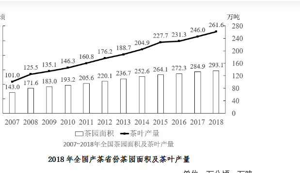
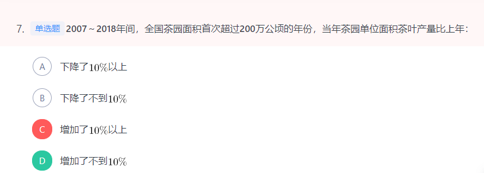
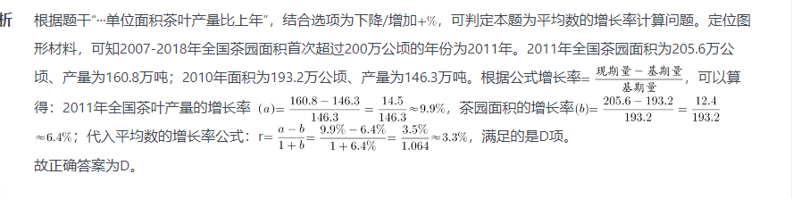
- 2
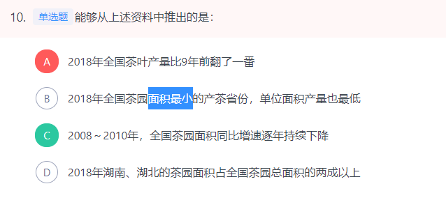
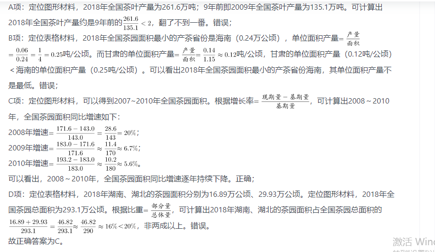
- 3
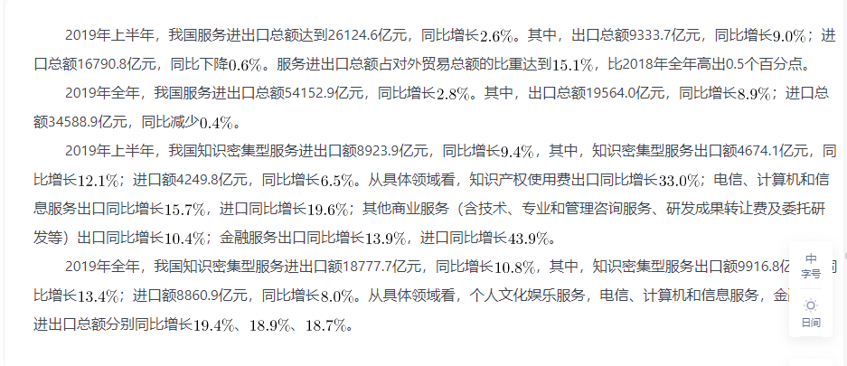
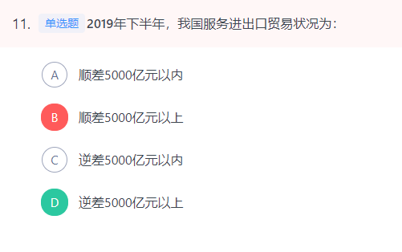
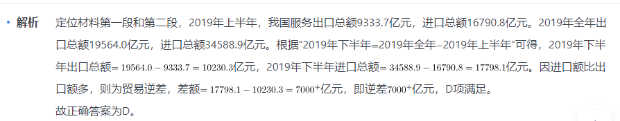
- 4
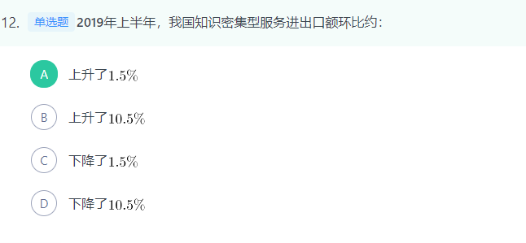
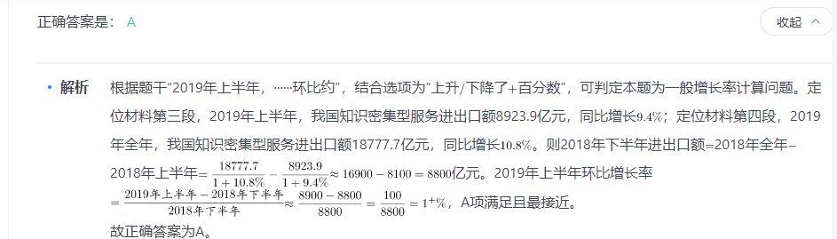

- 5
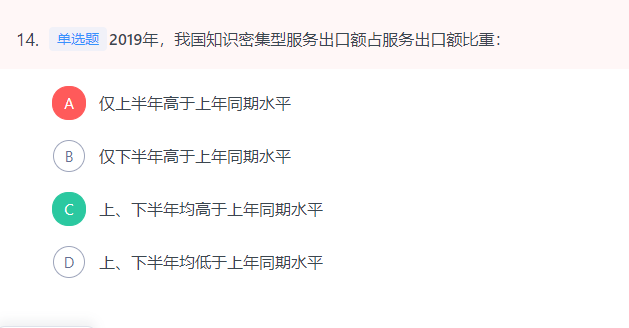
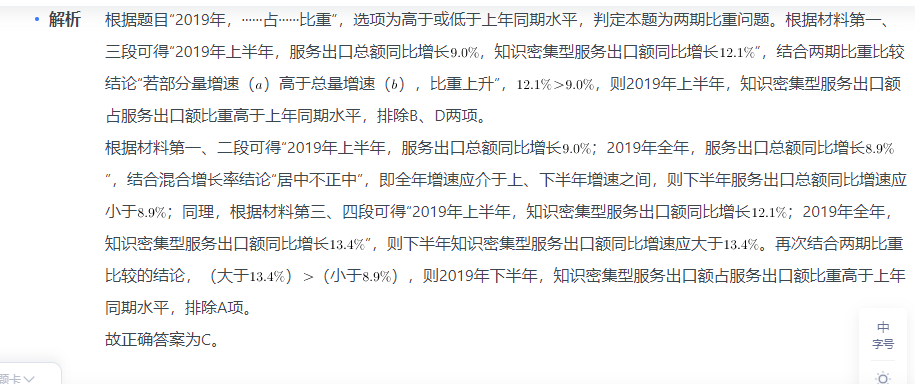
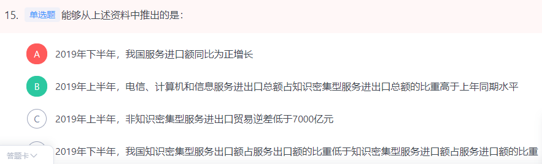

```
A项：根据材料第一、二段可得“2019年上半年，服务进口总额16790.8亿元，同比下降；2019年全年，服务进口总额34588.9亿元，同比减少”，则2019年下半年，服务进口额为亿元；2018年下半年，服务进口额为，因，则2018年下半年，服务进口额亿元。即2019年下半年，服务进口额低于上年同期，并非正增长，错误；

B项：根据材料第三段可得“2019年上半年，知识密集型服务进出口额同比增长；电信、计算机和信息服务出口同比增长，进口同比增长”，结合混合增长率结论“居中不正中”，即进出口同比增速应介于进口和出口同比增速之间，则电信、计算机和信息服务进出口额同比增速应大于，小于。再结合两期比重比较结论“若部分量增速（）高于总量增速（），比重上升”，（大于），则比重高于上年同期水平，正确；

C项：根据材料第一、三段可得“2019年上半年，服务出口总额9333.7亿元，进口总额16790.8亿元；知识密集型服务出口额4674.1亿元，进口额4249.8亿元”，则2019年上半年，非知识密集型服务进口额为亿元，出口额为亿元，贸易逆差为亿元，错误；

D项：根据材料第一、二段可得“2019年上半年，服务出口总额9333.7亿元，进口总额16790.8亿元；2019年全年，服务出口总额19564.0亿元，进口总额34588.9亿元”，则2019年下半年，服务出口额为亿元，进口额为亿元。

根据材料第三、四段可得“2019年上半年，知识密集型服务出口总额4674.1亿元，进口总额4249.8亿元；2019年全年，知识密集型服务出口总额9916.8亿元，进口总额8860.9亿元”，则2019年下半年，知识密集型服务出口额为亿元，进口额为亿元。则2019年下半年，知识密集型服务出口额占服务出口额比重为，知识密集型服务进口额占服务进口额比重为，前者应高于后者，错误。

故正确答案为B。
```