### test01

- 1 (走投无路就数笔画，不该错)
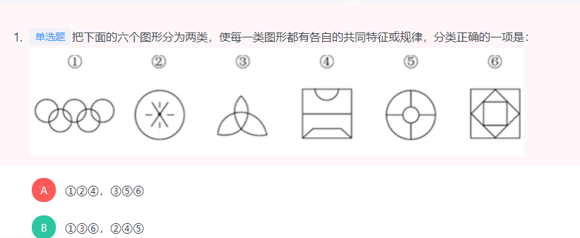
```
根据是一笔画还是多笔画分为：1，3，6一组，2，4，5一组。
```

- 2 （线相关）
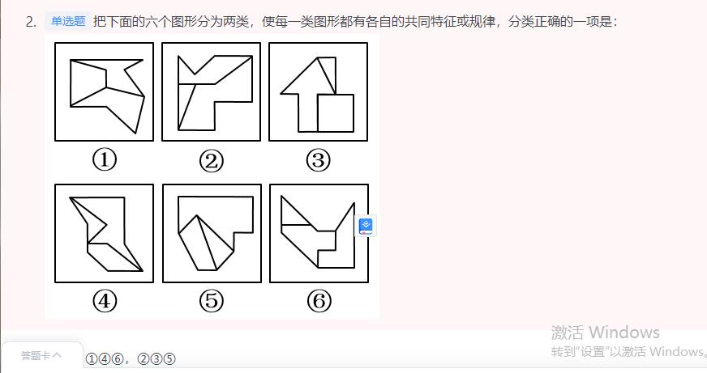
```
1,4,6:四条线相接，
2，3，5：三条线相接
```

- 3 （特殊图形，不该错。元素种类和数量）

```
题干中每幅图均由三种元素构成，B、C两选项均满足
可发现题干中每幅图中每种元素的个数分别为1、1、3，1、2、2，1、1、3，1、2、2，1、1、3，因此问号处三种元素的个数应分别为1、2、2。选项B为1、2、2，选项C为1、1、3。

故正确答案为B。
```
- 4 九宫格不改错
```

元素组成相同，优先考虑位置规律。观察发现，题干第一组图形中的两个白球在九宫格外圈整体顺时针平移2格，而两个“十字”在九宫格外圈整体顺/逆时针平移4格。第二组图形应遵循同样规律，只有D项满足。

故正确答案为D。
```

- 5
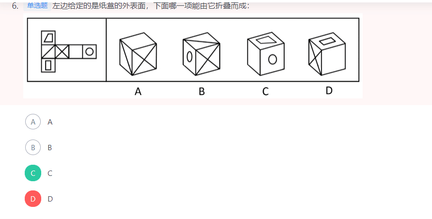
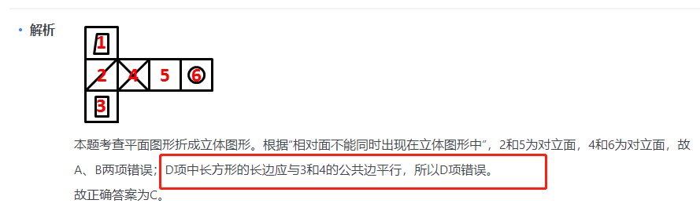

- 6
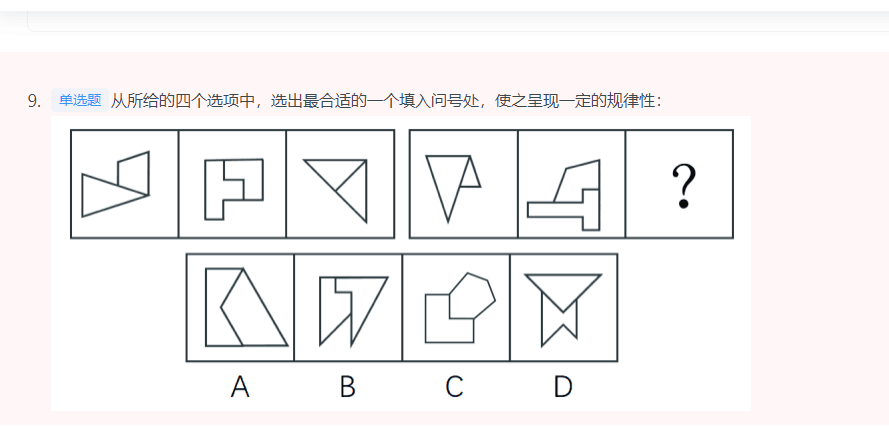
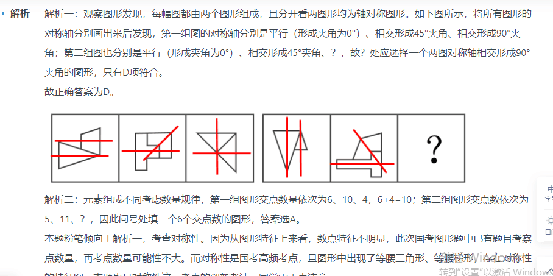

- 9

```
凹凸相合
```

### test02

- 1
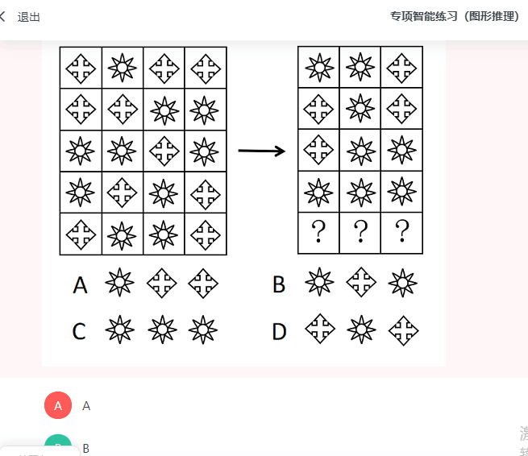

```
每两行图形相加减

方块+星星 -》 星星
星星+方块 -》星星
方块+方块-》方块
星星+星星 -》 方块

```

- 2

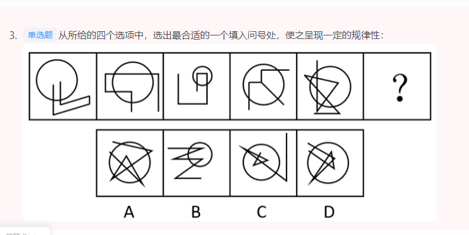

```
元素组成不同，无明显属性规律，考虑数量规律。题干每幅图均存在线线相交，优先考虑数交点，分别为6、8、6、6、13、？，并无明显规律。题干每幅图都有圆与直线相交叉，考虑曲直交点，分别是2、4、2、3、6、？，并无明显规律。再次观察发现每幅图都有圆，圆分内外，即可以分别数圆内外的交点，圆内部的交点分别为0、1、2、3、4、？，故？处应选择一个圆内部有5个交点的图形，A项是4个，B项是2个，C项是5个，D项是8个，只有C项符合。

故正确答案为C。
```
- 3

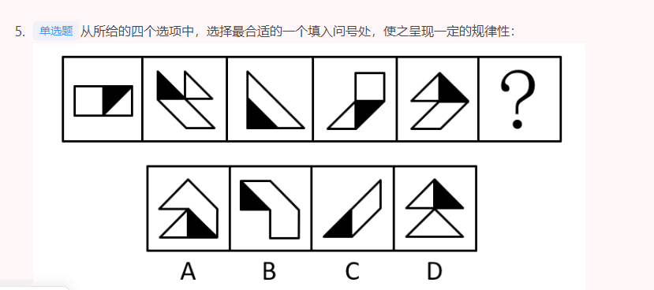

```
图形元素组成不同，考虑数量规律。每个图形中均存在一个黑色三角形和白色区域，并且题干所有图形中白色区域面积均为黑色区域面积的3倍，如下图所示，只有D项符合。

```
- 4

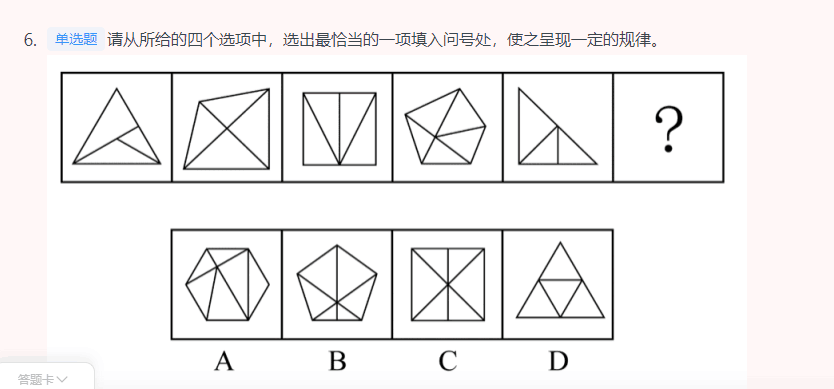

```
元素组成不同，无明显属性规律，考虑数量规律。观察发现，题干中的图形封闭区域明显，优先考虑数面，题干图形的面数量依次为3、4、4、5、3、？，单看无规律。再次观察发现，题干图形的外框均为多边形，且出现较多三角形、四边形，考虑外框直线数。外框直线数量依次为3、4、4、5、3、？。可知题干的规律为面数量外框直线数量，只有A项符合规律，当选。

故正确答案为A。
```
- 5

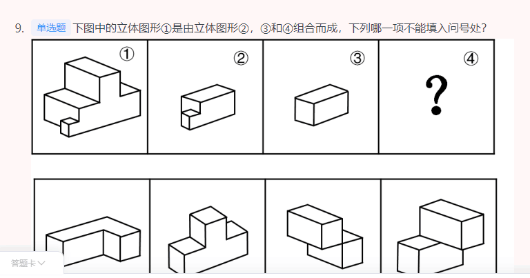

```
B
```
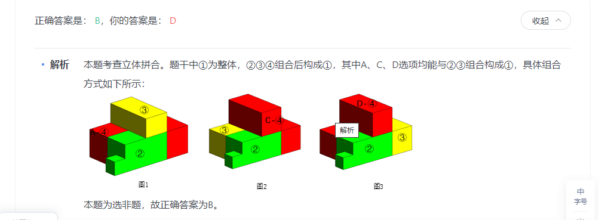
- 6


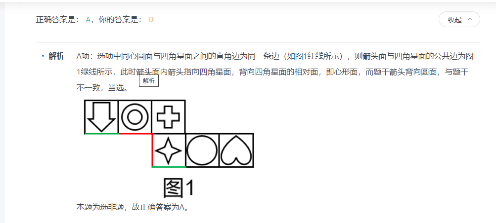

