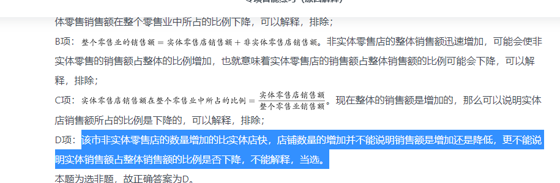

### 判断推理

- 1 呼吸系统：生殖系统（简牍公文是在竹简、木简、竹牍或木牍上书写的公文）


```

A

生产计划：年度计划

B

观赏花卉：药用花卉

C

水面舰艇：巡洋舰艇

D

简牍公文：纸质公文


正确答案是： D，你的答案是： C收起
解析
第一步：判断题干词语间逻辑关系。

呼吸系统和生殖系统是两种不同的人体系统，二者是并列关系。

第二步：判断选项词语间逻辑关系。

A项：年度计划是对一年的工作、活动等所做的规划，不同的人、不同的工作的年度计划不同，生产计划是企业对生产任务作出的规划，有的生产计划是年度计划，有的生产计划不是年度计划，有的年度计划是生产计划，有的年度计划不是生产计划，二者是交叉关系，与题干逻辑关系不一致，排除；

B项：观赏花卉是具有观赏价值的花卉，药用花卉是能够防病、治病的花卉，有的观赏花卉是药用花卉，有的观赏花卉不是药用花卉，有的药用花卉是观赏花卉，有的药用花卉不是观赏花卉，二者是交叉关系，与题干逻辑关系不一致，排除；

C项：巡洋舰艇是一种在远洋活动的大型水面舰艇，与水面舰艇是种属关系，与题干逻辑关系不一致，排除；

D项：简牍公文是在竹简、木简、竹牍或木牍上书写的公文，与纸质公文是并列关系，与题干逻辑关系一致，当选。

故正确答案为D。
```

- 2 国色天香 对于 （    ） 相当于 （    ） 对于 玉树临风(螓首蛾眉形容女性，玉树临风形容男性,明眸皓齿形容女性)


```
A

面如冠玉；螓首蛾眉

B

倾国倾城；明眸皓齿

C

一表人才；仪表堂堂

D

才高八斗；亭亭玉立


正确答案是： A，你的答案是： B收起
解析
逐一代入选项。

A项：国色天香原指色香俱美的牡丹花，后用以形容女性容貌美丽，面如冠玉形容男子面貌俊美，有如镶饰在帽上的美玉，二者是近义关系，且国色天香形容女性，面如冠玉形容男性；螓首蛾眉形容女子美丽的容貌，玉树临风形容人风度潇洒，秀美多姿，二者是近义关系，且螓首蛾眉形容女性，玉树临风形容男性，前后逻辑关系一致，当选；

B项：国色天香原指色香俱美的牡丹花，后用以形容女性容貌美丽，倾国倾城形容女子容貌极其美丽，二者是近义关系，且二者均用来形容女性；明眸皓齿形容面容美丽，玉树临风形容人风度潇洒，秀美多姿，二者是近义关系，但明眸皓齿形容女性，玉树临风形容男性，前后逻辑关系不一致，排除；

C项：国色天香原指色香俱美的牡丹花，后用以形容女性容貌美丽，一表人才形容人容貌俊秀端正，二者是近义关系，且国色天香形容女性，一表人才形容男性；仪表堂堂形容人容貌、风度庄严大方，玉树临风形容人风度潇洒，秀美多姿，二者是近义关系，但二者均用来形容男性，前后逻辑关系不一致，排除；

D项：国色天香原指色香俱美的牡丹花，后用以形容女性容貌美丽，才高八斗比喻人极有才华，二者无明显逻辑关系；亭亭玉立形容女子身材细长，也形容花木等形体挺拔，玉树临风形容人风度潇洒，秀美多姿，二者无明显逻辑关系，前后逻辑关系不一致，排除。

故正确答案为A。
```
- 3 城市公园：公共设施：休闲娱乐(“城市公园”是一种“公共设施”，二者为种属关系；)


```
A

国宾礼炮：电子礼炮：国事庆祝

B

医用口罩：卫生用品：过滤空气

C

升降舞台：露天剧场：演出空间

D

云服务器：虚拟技术：信息备份


正确答案是： B，你的答案是： A收起
解析
第一步：判断题干词语间逻辑关系。

“城市公园”是一种“公共设施”，二者为种属关系；“城市公园”具有“休闲娱乐”的功能，二者为功能对应关系。

第二步：判断选项词语间逻辑关系。

A项：有的“国宾礼炮”是“电子礼炮”，有的“国宾礼炮”不是“电子礼炮”，有的“电子礼炮”是“国宾礼炮”，有的“电子礼炮”不是“国宾礼炮”，二者为交叉关系；“国宾礼炮”和“电子礼炮”都有用于“国事庆祝”的功能，三者构成功能对应关系，与题干逻辑关系不一致，排除；

B项：“医用口罩”是一种“卫生用品”，二者为种属关系；“医用口罩”具有“过滤空气”的功能，二者为功能对应关系，与题干逻辑关系一致，当选；

C项：“升降舞台”是“露天剧场”的组成部分，二者为组成关系；“露天剧场”是一种“演出空间”，二者为种属关系，与题干逻辑关系不一致，排除；

D项：“云服务器”运用了“虚拟技术”，二者不是种属关系；“云服务器”具有“信息备份”的功能，二者为功能对应关系，与题干逻辑关系不一致，排除。

故正确答案为B。
```
- 4(群友的理解，可能是遗迹发掘就对了。)


```
健康监测：体检：疾病筛查

A

为国聚财：税收：调节分配

B

发掘遗迹：考古：考证年代

C

解决争议：审判：强制执行

D

太空飞行：航天：地质分析


正确答案是： A，你的答案是： B收起
解析
第一步：判断题干词语间逻辑关系。

健康监测和疾病筛查是体检的目的，三者为目的对应关系。

第二步：判断选项词语间逻辑关系。

A项：为国聚财和调节分配是税收的目的，与题干逻辑关系一致，当选；

B项：发掘遗迹和考证年代是考古的过程和内容，与题干逻辑关系不一致，排除；

C项：解决争议是审判的目的，但强制执行不是审判的目的，与题干逻辑关系不一致，排除；

D项：航天又被称为太空飞行，二者为全同关系，与题干逻辑关系不一致，排除。

故正确答案为A。
```
- 5（C项表意不明。不能当选。）

```

某网购平台发布了一份网购调研报告，分析亚洲女性的网购特点。分析显示，当代亚洲女性在网购服饰、化妆品方面的决定权为，在网购家居用品方面的决定权为。研究者由此认为，那些喜爱网购的亚洲女性在家庭中拥有更大的控制权。

以下哪项如果为真，最能反驳上述结论？

A

喜爱网购的亚洲女性的网购支出只占其家庭消费支出的


B

亚洲女性中，习惯上网购物的人数只占女性总人数的左右


C

亚洲女性在购买贵重商品时往往会与丈夫商量，共同决定


D

一些亚洲女性经济不独立，对家庭收入没有贡献


正确答案是： A，你的答案是： C收起
解析
第一步：找到论点论据。

论点：那些喜爱网购的亚洲女性在家庭中拥有更大的控制权

论据：当代亚洲女性在网购服饰、化妆品方面的决定权为，在网购家居用品方面的决定权为

第二步：逐一分析选项。
A项：喜爱网购的亚洲女性的网购支出只占其家庭消费的，说明女性网购部分的支出在家庭消费中比重不大，并不起控制性作用，即的消费不足以证明在家庭消费中起控制作用，削弱论证，当选；

B项：习惯上网购物的人数只占女性总人数的左右，说明喜爱网上购物的女性占比不高，但喜欢购物的女性的占比与喜爱网购的亚洲女性在家中的控制权情况无关，属于无关选项，排除；

C项：购买贵重物品会和丈夫商量，但不确定贵重物品占购买总物品的比例大小，属于不明确选项，排除；

D项：一些亚洲女性经济不独立，是否为喜爱网购的亚洲女性不确定，而经济不独立与控制权之间也没有必然的联系，属于无关选项，排除。

故正确答案为A。
```
- 6(A项没有说明有没有珊瑚，以及对珊瑚有没有危害。论点：为了保护珊瑚，在海滨浴场应该禁止使用防晒霜。
论据：羟苯甲酮是一种常见的紫外线吸收剂，多用于防晒护肤品中，全球3500种品牌的防晒霜中均含有该物质。研究表明，即使是极低浓度的羟苯甲酮也会给珊瑚带来致命的伤害。)


```
羟苯甲酮是一种常见的紫外线吸收剂，多用于防晒护肤品中，全球3500种品牌的防晒霜中均含有该物质。研究表明，即使是极低浓度的羟苯甲酮也会给珊瑚带来致命的伤害，有专家指出，为了保护珊瑚，在海滨浴场应该禁止使用防晒霜。

以下哪项如果为真，最能支持上述观点？

A

一些远离海岸的大洋中部分水域已检测到羟苯甲酮，但浓度较低

B

羟苯甲酮易引起皮肤过敏，长期使用会影响人体免疫力和生殖能力

C

羟苯甲酮会破坏、改变珊瑚的DNA，降低幼年珊瑚正常发育的几率

D

人们在很多场合都使用防晒霜，仅在海滨浴场限制使用效果有限


正确答案是： C，你的答案是： A收起
解析
第一步：找出论点和论据。

论点：为了保护珊瑚，在海滨浴场应该禁止使用防晒霜。

论据：羟苯甲酮是一种常见的紫外线吸收剂，多用于防晒护肤品中，全球3500种品牌的防晒霜中均含有该物质。研究表明，即使是极低浓度的羟苯甲酮也会给珊瑚带来致命的伤害。

本题的论点和论据话题一致，都在说明防晒霜中所含有的物质——羟苯甲酮会给珊瑚带来伤害，在浴场不能使用防晒霜。所以，我们需要以补充论据的方式来加强。

第二步：逐一分析选项。

A项：虽在远离海岸的大洋中部水域检测到了羟苯甲酮，浓度较低，但并没有说明该大洋中是否有珊瑚，以及是否给珊瑚带来了致命伤害，属于不明确选项，无法加强，排除；

B项：羟苯甲酮易引起皮肤过敏，长期使用会影响人体免疫力和生殖能力，都是在说羟苯甲酮对人体的伤害而非对珊瑚的伤害，话题不一致，无法加强，排除；

C项：羟苯甲酮会通过改变珊瑚的DNA来降低幼年珊瑚正常发育的几率，说明该项是在解释该物质如何对珊瑚产生致命伤害，补充论据，当选；

D项：仅在海滨浴场限制使用效果有限，只能说明措施使用效果一般，但与是否应该禁止使用防晒霜无关，话题不一致，无法加强，排除。

故正确答案为C。
```
### 共15道，答对8道，正确率53%


- 1(搭桥的转换)


```

不同的读者在阅读时，会对文章进行不同的加工编码，一种是浏览，从文章中收集观点和信息，使知识作为独立的单元输入大脑，称为线性策略；一种是做笔记，在阅读时会构建一个层次清晰的架构，就像用信息积木搭建了一个“金字塔”，称为结构策略。做笔记能够对文章的主要内容进行标注，因此与单纯的浏览相比，做笔记能够取得更优的阅读效果。

要使上述论证成立，还需基于以下哪一前提？

A

阅读效果的好坏取决于能否在阅读时抓住要点

B

用浏览的方式进行阅读属于知识加工的线性策略

C

做笔记涉及到了更加复杂的认知加工过程

D

与线性策略相比，结构策略能够让学习提升速度


正确答案是： A，你的答案是： B收起
解析
第一步：找出论点和论据。

论点：与单纯的浏览相比，做笔记能够取得更优的阅读效果。

论据：做笔记能够对文章的主要内容进行标注。

本题提问为“基于以下哪一前提”，优先考虑搭桥和必要条件。论点讨论的是做笔记能够取得更优的阅读效果，而论据讨论的是做笔记是在标注文章的主要内容，二者话题不一致，优先考虑搭桥，即建立“标注文章主要内容”和“阅读效果”的联系。

第二步：逐一分析选项。

A项：该项说阅读效果的好坏取决于能否在阅读时抓住要点，将“标注文章主要内容（抓住要点）”和“阅读效果”建立了联系，属于搭桥项，可以加强，当选；

B项：该项说的是浏览阅读属于知识加工的线性策略，而论点讨论的是笔记阅读的效果，话题不一致，无法加强，排除；

C项：该项说做笔记涉及到了更加复杂的认知加工过程，但通过这个复杂的认知加工过程能否取得更优的阅读效果并不明确，属于不明确项，无法加强，排除；

D项：该项说结构策略比线性策略更能提升学习速度，强调的是两种阅读方式在提升学习速度方面的差异，而论点讨论的是阅读效果，话题不一致，无法加强，排除。

故正确答案为A。

```

- 2（b是加强论据。a是无关选项，cd是另有他因）


```

自上世纪50年代以来，全球每年平均爆发的大型龙卷风的次数从10次左右上升至15次。与此同时，人类活动激增，全球气候明显变暖，有人据此认为，气候变暖导致龙卷风爆发次数增加。

以下哪项如果为真，不能削弱上述结论？

A

龙卷风的类型多样，全球变暖后，小型龙卷风出现的次数并没有明显的变化

B

气候温暖是龙卷风形成的一个必要条件，几乎所有龙卷风的形成都与当地较高的温度有关

C

尽管全球变暖，龙卷风依然最多地发生在美国的中西部地区，其他地区的龙卷风现象并不多见

D

龙卷风是雷暴天气（即伴有雷击和闪电的局地对流性天气）的产物，只要在雷雨天气下出现极强的空气对流，就容易发生龙卷风


正确答案是： B，你的答案是： D收起
解析
第一步：找出论点和论据。

论点：气候变暖导致龙卷风爆发次数增加。

论据：自上世纪50年代以来，全球每年平均爆发的大型龙卷风的次数从10次左右上升至15次。与此同时，人类活动激增，全球气候明显变暖。

第二步：逐一分析选项。

A项：全球变暖小型龙卷风出现的次数没有明显变化，而论点是气候变暖导致龙卷风爆发次数增加，该项削弱题干的论点，排除；

B项：气候温暖是龙卷风形成的一个必要形成条件，并且龙卷风的形成与较高温度有关。说明全球变暖有助于龙卷风的爆发，可以加强论点，不能削弱，保留；

C项：全球变暖，除了美国的中西部地区，其他地区的龙卷风现象并不多见。而题干说的是全球范围的变暖导致了龙卷风次数增加。该选项说有的地方并没有增多，削弱题干论点，排除；

D项：该项说的是雷暴天气也容易导致龙卷风，在几年来气温上升的条件下，如果雷暴天气增多的话那么龙卷风次数增多的原因就不能够确定是气温上升，因此该项为他因削弱，排除。

本题为选非题，故正确答案为B。
```
- 3（C项只能说明冷，而不是气候和环境）


```
5000多年前某地是大汶口文化，但在距今约4400年的时候，为龙山文化所替代。是什么原因导致这两种文化的更迭？考古人员发现，在距今约4400年的时候，发生了一次严重的“冷事件”，环境由原来的温暖湿润转变为寒冷干燥，植被大量减少，藻类、水生植物基本绝迹了，大汶口文化向南迁移，而龙山文化由北迁到此地。他们据此认为，距今4400年左右的极端气候变化，可能是导致这次文化变迁的主要原因。

以下哪项如果为真，最能支持上述论证：

A

大汶口文化有不断向南方迁移的传统

B

龙山文化刚迁来时，人口较多，但之后逐渐减少，在距今约4000年的时候消失了

C

大汶口文化的族群以藻类和水生植物作为食物的主要来源

D

不同生存方式的族群对气候和环境都有相对稳定的需求


正确答案是： D，你的答案是： C收起
解析
第一步：找出论点和论据。本题论点是距今4400年左右的极端气候变化，可能是导致这次文化变迁的主要原因。论据是在距今约4400年的时候，发生了一次严重的“冷事件”，环境由原来的温暖湿润转变为寒冷干燥，植被大量减少，藻类、水生植物基本绝迹了，大汶口文化向南迁移，而龙山文化由北迁到此地。第二步：判断加强方式。本题论点和论据间存在因果关系，所以需加强论点。第三步：逐一判断选项的作用。A项否定了大汶口文化是因为“冷事件”而向南迁移的，削弱了论点，排除；B项龙山文化迁到此地后的发展状况与文化变迁无关，属无关选项，排除；C项只能说明大汶口文化南迁是因为“冷事件”，不能说明龙山文化迁来此地也是因为“冷事件”，不能加强论点，排除；D项不同生存方式的族群对气候和环境都有相对稳定的需求，即此次文化的变迁是由于气候变化导致当地的气候不能适应族群的需要，不同的族群才开始迁移到适合自己生存的气候的地方，加强了论点，当选。

故正确答案为D。
```
- 4（C项是直接否定了论点，d项只是举例）


```
动物实验发现，和处于寒冷环境的同等大小的小鼠相比，温暖环境小鼠的骨密度明显增强，很少出现骨质疏松。与此同时，温暖环境中小鼠的肠道菌群更为活跃，当把这些小鼠的肠道菌群移植到寒冷环境的小鼠肠道后，后者骨密度也增强了。由此可见，只要改善肠道菌群活性就可以增强骨密度。

以下哪项如果为真，最能削弱上述论证？

A

肠道中不是所有的细菌都会引起成骨细胞的增加，从而增加骨密度

B

改善肠道菌群活性还须与生活环境和饮食习惯相结合才能增强骨密度

C

改善肠道菌群活性对于年老小鼠增加骨密度的作用不十分明显

D

接受菌群移植的小鼠若持续处于寒冷环境，骨密度会很快再次降低至原有水平


正确答案是： B，你的答案是： D收起
解析
第一步：找出论点和论据。

论点：只要改善肠道菌群活性就可以增强骨密度。

论据：动物实验发现，和处于寒冷环境的同等大小的小鼠相比，温暖环境小鼠的骨密度明显增强，很少出现骨质疏松。与此同时，温暖环境中小鼠的肠道菌群更为活跃，当把这些小鼠的肠道菌群移植到寒冷环境的小鼠肠道后，后者骨密度也增强了。

本题论点说的是只要改善肠道菌群活性就可以增强骨密度，论据说的是将温暖环境中小鼠的肠道菌群移植到寒冷环境的小鼠肠道后，后者骨密度增强了。论点论据话题一致，削弱优先考虑否定论点。

第二步：逐一分析选项。

A项：该项说肠道中不是所有的细菌都会增加骨密度，而论点说的是只要改善肠道菌群活性就可以增强骨密度，与是否所有细菌都能增强骨密度无关，话题不一致，无法削弱，排除；

B项：该项说的是改善肠道菌群活性还须与生活环境和饮食习惯相结合才能增强骨密度，说明不是只要通过改善肠道菌群活性就可以增强骨密度，直接否定论点，可以削弱，保留；

C项：该项说的是改善肠道菌群活性对于年老小鼠增加骨密度的作用不十分明显，不十分明显不意味着不能增加骨密度，无法削弱，排除；

D项：该项说的是接受菌群移植的小鼠若持续处于寒冷环境，骨密度会很快再次降低至原有水平，即改变实验中的温度条件会使得骨密度增强的效果消失，削弱论据，可以削弱，保留。

对比B、D两项，B项削弱论点力度更强，当选。

故正确答案为B。
```
### 共15道，答对10道，正确率67%

- 1(b是解释原因，而d是从反面论证论据，没有直接解释的好。)


```
应激本身没有致痛能力，但是流行病学调查发现，长期应激与疼痛慢性化的发生正相关，即长期处于巨大压力下的人群，其疼痛症状更易迁延，进而发展为慢性疼痛。

以下哪项如果为真，最能支持上述调查结果？

A

具有焦虑倾向的人，其应激水平往往较高，疼痛慢性化的发生率也会更高


B

长期应激可影响神经内分泌系统，使人的疼痛抑制系统的功能被削弱


C

吸烟使人体神经内分泌系统发生紊乱，对疼痛感知的影响与应激相似


D

如果能有效缓解应激，保持心态平和，疼痛慢性化的发生率将会降低


正确答案是： B，你的答案是： D收起
解析
第一步：找出论点和论据。

论点：长期处于巨大压力下的人群，其疼痛症状更易迁延，进而发展为慢性疼痛。

论据：无。

第二步：逐一分析选项。

A项：该项指出，具有焦虑倾向的人，其应激水平高，疼痛慢性化发生率也会高，举例子补充论据，可以加强，保留；

B项：长期应激会影响神经内分泌系统，进而削弱疼痛抑制系统，所以发展为慢性疼痛，解释原因补充论据，可以加强，保留；

C项：该项说吸烟对疼痛感知的影响和应激相似，不能说明应激与疼痛慢性化的关系，无法加强，排除；

D项：该项指出如果缓解应激后，疼痛慢性化的发生率会下降，举反面例子补充论据，可以加强，保留。

对比A、B、D项，B项解释原因力度大于A、D项的举例子。

故正确答案为B

```

- 2（这个属于另有他因而不是直接从论点上判断秋色比秋月更合适）


```
唐代大诗人刘禹锡《望洞庭》诗云：“湖光秋月两相和，潭面无风镜未磨。遥望洞庭山水翠，白银盘里一青螺。”然而，在一般不对原文做修改的宋清两朝的诸多类书中诗首句“秋月”皆作“秋色”，有专家据此指出，诗中首句的“秋月”其实应为“秋色”。

以下哪项如果为真，最能支持上述专家的观点？

A

《望洞庭》为经典名作，历朝历代众口传诵，期间难免出现不同的版本

B

月光下很难分辨山水的不同色彩，翠色，白银盘、青螺皆是白天的景观

C

洞庭秋色是历代文人所关注的美景，该诗强调秋色之美也在常理之中

D

学术界公认这首诗，描写了洞庭湖的优美景色，应是诗人对洞庭湖的实景描写


正确答案是： B，你的答案是： A收起
解析
第一步：找出论点和论据。

论点：刘禹锡《望洞庭》中首句的“秋月”其实应为“秋色”。

论据：在一般不对原文做修改的宋清两朝的诸多类书中诗首句“秋月”皆作“秋色”。

本题论点、论据都是在讨论“秋月”与“秋色”哪种用法更合理，论点论据话题一致，所以加强可以优先考虑补充论据。

第二步：逐一分析选项。

A项：指出该诗在传诵过程中出现了许多不同版本，而论点讨论的是“秋色”与“秋月”用法的合理性，这些不同的版本是否是在“秋色”一词上有所差异并不明确，不明确项，无法加强，排除；

B项：指出白银盘、青螺等景色仅能在白天观察到，说明在“秋月”的情况下无法观察到诗中描写的景色，因此该诗中的“秋月”应为“秋色”，补充论据，可以加强，当选；

C项：指出洞庭湖的秋色常被诗人们关注，该诗描写秋色有其合理性，但这仅能说明该诗可能描写了洞庭湖的“秋色”，但该诗中的“秋月”的表述是否合理，该项并未提及，不明确项，无法加强，排除；

D项：指出该诗是对洞庭湖的实景描写，讨论的是诗人所写景色的虚实，而论点讨论的是诗中“秋月”与“秋色”哪种用法更合理，话题不一致，无法加强，排除。

故正确答案为B。
```
- 3（这道题选的是削弱。你没看题目么）


```

开车斗气、胡乱变线、强行超车等“路怒症”是一种被称为间歇性、暴发性障碍(IED)的心理疾病。有研究发现，IED患者弓形虫检测呈阳性的比例是非IED组的两倍。研究者认为，弓形虫感染有可能是导致包括“路怒症”在内的IED的罪魁祸首。

以下哪项如果为真，无法支持研究者的观点？

A

感染了弓形虫的老鼠往往更大胆、更敢于冒险，也因此更容易被猫抓到

B

弓形虫使大脑中控制威胁反应的神经元受到过度刺激，易引发攻击行为

C

对弓形虫检测呈阳性的IED患者施以抗虫感染治疗之后，冲动行为减少

D

弓形虫是猫身上的一种原生动物寄生虫，但猫是比较温顺的动物


正确答案是： D，你的答案是： B收起
解析
第一步：找出论点和论据。

论点：弓形虫感染有可能是导致包括“路怒症”在内的IED的罪魁祸首。

论据：IED患者弓形虫检测呈阳性的比例是非IED组的两倍。

第二步：逐一分析选项。

A项：感染了弓形虫的老鼠更大胆冒险，举例支持感染弓形虫会更冲动冒险，可能导致IED，可以加强，排除；

B项：弓形虫使大脑神经元受到过度刺激，解释了弓形虫感染可能导致IED的原因，可以加强，排除；

C项：抗弓形虫感染治疗后，冲动行为减少，说明冲动行为就是因为弓形虫感染导致的，可以加强，排除； 

D项：弓形虫是猫身上的一种原生寄生虫，但猫性格温顺，举反例削弱论点，无法加强，当选。

本题为选非题，故正确答案为D。
```
- 4（b是对论点的加强，并且是比较的加强。但是C没有比较。表述不明确，没有说没有使用电子烟的会不会使用。）


```

最近有研究团队以问卷调查的方式，调查了519名从未吸过传统香烟，年龄在18岁至25岁间的年轻人，调查内容包括这些年轻人吸电子烟的情况和吸传统香烟的意向等，研究报告称，在从未吸过传统香烟的年轻人中，那些正在吸电子烟的人更可能尝试传统香烟，有关电子烟的监管政策要注意保护年轻人。

以下各项如果为真，最能支持上述结论的是：

A

受访者中有的人尝试过电子烟或未来很可能会尝试电子烟


B

即使只尝了两三口电子烟，也有可能提高吸传统香烟的可能性


C

受访者中正在吸电子烟的有表示未来一定会尝试传统香烟


D

电子烟对健康的危害比传统香烟小，但仍然含有很多有害物质


正确答案是： B，你的答案是： C收起
解析
第一步：找出论点和论据。

论点：在从未吸过传统香烟的年轻人中，那些正在吸电子烟的人更可能尝试传统香烟，有关电子烟的监管政策要注意保护年轻人。

论据：无。

本题只有论点，没有论据，优先考虑补充论据加强，而论点中表示“正在吸电子烟的人更可能尝试传统香烟”，从“更”字能体现出存在比较关系，即正在吸电子烟的人相比于不吸电子烟的人更可能尝试传统香烟，所以考虑加强时应体现出比较关系；另外，论点中已包含“更可能”这样的可能性表述，所以选项中若出现可能性表述不会影响加强力度。

第二步：逐一分析选项。

A项：论点说的是正在吸电子烟的人更可能尝试传统香烟，该项说的是有多少人尝试过电子烟，以及未来可能会尝试，话题不一致，无法加强，排除；

B项：该项表明吸过两三口电子烟的人会提高吸传统香烟的可能性，即表明吸电子烟的人相比于不吸电子烟的人而言，更可能吸传统香烟，该项是针对论点的比较关系进行加强，属于补充论据，当选；

C项：该项表明受访者中正在吸电子烟的有表示未来一定会尝试传统香烟，但未说明不吸电子烟的人对未来尝试传统香烟的情况及相关的数据占比，因此未体现出论点中的比较关系，属于不明确选项，排除；

D项：论点说的是正在吸电子烟的人更可能尝试传统香烟，该项说的是电子烟的危害，话题不一致，无法加强，排除。

故正确答案为B。
```
- 5（a选项是影响。d是解释，财富需要教育，教育需要知识。提供了必要条件）


```
扶贫必扶智。让贫困地区的孩子们接受良好教育，是扶贫开发的重要任务，也是阻断贫困代际传递的重要途径。

以上观点的前提是：

A

贫困的代际传递导致教育的落后

B

富有阶层大都受过良好教育

C

扶贫工作难，扶智工作更难

D

知识改变命运，教育成就财富


正确答案是： D，你的答案是： A收起
解析
第一步：找出论点和论据。

论点：扶贫必扶智。

论据：让贫困地区的孩子们接受良好的教育，是扶贫开发的重要任务，也是阻断贫困代际传递的重要途径。

第二步：逐一分析选项。

A项：贫困的代际传递导致教育的落后，该项是在讨论贫困的代际传递会导致什么样的后果，而论点讨论的是解决代际传递的办法，所以话题不一致，无法加强，排除；

B项：富有阶层大都受过良好的教育，那么良好的教育是否是导致他富有的原因，并不清楚，所以无法支持，排除；

C项：该项讨论的是扶智工作比扶贫工作更难，没有提到教育能否阻断贫困的代际传递，无关项，无法加强，排除；

D项：如果知识不能够改变命运，教育不能成就财富，那么教育就不可以让人不贫困，变得富有，补充必要条件，可以加强，当选。

故正确答案为D。
```
###  共15道，答对10道，正确率67%


- 1(论点和论据话题不一致，则考虑将话题联系在一起。搭桥)


```
假定有一个鱼缸，里面的金鱼透过弧形的鱼缸玻璃观察外面的世界，现在它们中的物理学家开始发展“金鱼物理学”了，它们归纳观察到的现象，并建立起一些物理学定律，这些物理学定律能够解释和描述金鱼们透过鱼缸所观察到的外部世界，这些定律甚至还能够正确预言外部世界的新现象。因此，这样的“金鱼物理学”可以是正确的。

要使上述论证成立，需要补充下列哪项作为前提？

A

我们看到的直线运动可能在“金鱼物理学”中表现为曲线运动

B

物理学理论正确与否依赖于其理论体系所得出的结论能否被反复验证

C

虽然金鱼的实在图像与我们的不同，但是我们的实在图像也可能是不真实的

D

当某理论的解释与观察者的观测吻合时，观察者往往认为这个理论就是正确的


正确答案是： D，你的答案是： B收起
解析
第一步：找出论点和论据。

论点：“金鱼物理学”可以是正确的。

论据：它们归纳观察到的现象，并建立起一些物理学定律，这些物理学定律能够解释和描述金鱼们透过鱼缸所观察到的外部世界，这些定律甚至还能够正确预言外部世界的新现象。

本题论点讨论的是“金鱼物理学”正确与否，论据讨论的是物理学定律能够解释外部世界，甚至能够正确预言外部世界。论点和论据话题不一致，优先考虑搭桥，在“正确”和“物理学定律能够解释和正确预言外部世界的新现象”之间建立联系即可。

第二步：逐一分析选项。

A项：该项说明我们实际看到的与“金鱼物理学”所体现的不一致，与论点话题“金鱼物理学”是否正确无关，无法加强，排除；

B项：该项指出物理学理论是否正确与反复验证的关系，但是题干只涉及解释和预言，与反复验证无关，无法加强，排除；

C项：该项说明金鱼观察到的与我们的不同，而我们观察到的也可能是不真实的，与论点话题“金鱼物理学”是否正确无关，无法加强，排除；

D项：该项说明当某理论的解释与观察者的观测相吻合的时候，观察者就认为这个理论是正确的，即建立了“正确”与“解释和正确预言外部现象”的联系，搭桥，可以加强，当选。

故正确答案为D。

```

- 2（c项目不能证明，则为不明确选项。d项为直接否认论点。）


```

慢性疲劳综合征危害极大，它使人在正常的工作后感到极度疲劳，怎么休息也无济于事。这种疾病过去不能通过验血或其他检查得出明确的生物指标，因此其病因历来被归为心理因素。最近，研究人员对诊断为慢性疲劳综合征的48名患者和39名健康志愿者的大便和血液样本进行研究后得出结论：肠道细菌和血液中的致炎因子可能与该疾病有关。

以下哪项如果为真，最不能支持上述结论？

A

该疾病患者的大便样本中肠道细菌的多样性较低且抗炎细菌较少

B

该疾病患者的血液样本中被检测出致炎因子，而健康志愿者没有

C

目前不确定肠道细菌是导致该疾病的原因还是该疾病导致的结果

D

最新研究表明饮食治疗和益生菌等无助于为该疾病患者缓解疲劳


正确答案是： D，你的答案是： C收起
解析
第一步：找出论点和论据。

论点：肠道细菌和血液中的致炎因子可能与慢性疲劳综合征有关。

论据：无。

首先注意本题问的是“······最不能支持上述结论？”，我们的做题思路是找出哪些是能支持的排除，如果不能支持的选项中出现无关选项，不明确选项和削弱选项，首选削弱项。

第二步：逐一分析选项。

A项：患者的肠道细菌多样性低且抗炎细菌较少，说明了肠道细菌可能与该疾病有关，为题干中论点补充了论据，属于加强选项。题干问的是最不能支持的，排除；

B项：患者的血液样本中有致炎因子，而健康志愿者没有，说明了血液中的致炎因子可能与该疾病有关，补充论据，属于加强选项。题干问的是最不能支持的，排除；

C项：不能证明肠道细菌和血液中的致炎因子是否与该疾病有关，为不明确选项。题干问的是最不能支持的，保留；

D项：饮食治疗和益生菌对缓解患者疲劳无用，举例削弱了肠道细菌与该疾病有关，可以削弱。题干问的是最不能支持的，保留。

对比C、D两项，由于C项是不明确选项，D项举例否定论点，选最不能加强的D项。

本题为选非题，故正确答案为D。
```
- 3（话题不一致，则搭桥）


```
与水和大气污染不同，土壤污染的隐蔽性较强。发达国家能用的土壤修复技术，在我国就不一定适用。目前，基于微生物细胞外呼吸的土壤原位修复技术已经成为我国华南地区土壤生物修复技术的生力军。与物理化学修复相比，这种修复方式具有高效率、低成本、非破坏、适用广等特点。

上述论述是建立在下列哪项的基础之上的？

A

发达国家的土壤和我国的有很大差异，并不适用土壤原位修复技术

B

土壤原位修复技术优于物理化学修复

C

土壤原位修复技术是在华南地区特点的土壤条件上开发起来的

D

发达国家的土壤修复主要采用物理化学修复


正确答案是： D，你的答案是： C收起
解析
第一步：找出论点和论据。

论点：发达国家能用的土壤修复技术，在我国就不一定适用。

论据：目前，基于微生物细胞外呼吸的土壤原位修复技术已经成为我国华南地区土壤生物修复技术的生力军。与物理化学修复相比，这种修复方式具有高效率、低成本、非破坏、适用广等特点。

本题的论点和论据话题不一致，论点是在论述发达国家土壤修复技术在我国未必适用，而论据是在说我国现有的土壤原位修复技术与物理化学修复技术相比的优势。论点、论据的话题不一致，加强优先考虑在发达国家土壤修复技术与物理化学修复技术进行搭桥。

第二步：逐一分析选项。

A项：论点是在论述发达国家的土壤修复技术是否适用于我国土壤，而非我国的土壤原位修复技术不适用于发达国家，属于无关项，无法加强，排除；

B项：选项指出我国土壤原位修复技术优于物理化学修复技术，但并未提及与发达国家的关系，属于无关项，无法加强，排除；

C项：选项在论述土壤原位修复技术完全适用于我国华南地区的土壤，但未与发达国家建立联系，属于无关项，无法加强，排除；

D项：选项指出发达国家运用的土壤修复技术就是物理化学修复技术，那么发达国家的土壤修复技术就不一定适用于我国，在论点和论据之间搭桥，可以加强，当选。

故正确答案为D。
```
- 4（搭桥：有蛇纹石才算海底大陆）


```

格陵兰岛是地球上最大的岛屿，形成于38亿年前，大部分地区被冰雪覆盖。有大量远古的岩石化石埋藏在格陵兰岛地下，它们的排列就像是一个整齐的堤坝，也被称为蛇纹石。通过这些蛇纹石，人们可以断定格陵兰岛在远古时可能是一块海底大陆。

补充以下哪项作为前提可以得出上述结论？

A

蛇纹石是两个大陆板块在运动中相互碰撞时挤压海底大陆而形成的一种岩石

B

这些蛇纹石化石的年代和特征与伊苏亚地区发现的一致，而后者曾是一片海底大陆

C

蛇纹石中碳的形状呈现出生物组织特有的管状和洋葱型结构，类似于早期的海洋微生物

D

由于大陆板块的运动才创造出了许多新的大陆，在板块运动发生之前，地球上绝大部分地区是一片汪洋大海


正确答案是： A，你的答案是： C收起
解析
本题属于加强题型。

第一步：找到论点论据。

论点：格陵兰岛在远古时可能是一块海底大陆。

论据：大量远古的岩石化石埋藏在格陵兰岛地下，被称为蛇纹石。

第二步：逐个分析选项。

A项，蛇纹石是两个大陆板块挤压海底大陆所形成的一种岩石，在蛇纹石和海底大陆之间建立了联系，说明这原来就是海底大陆，当选；

B项，年代和特征一致，但后者是海底大陆但是不代表前者的蛇纹石一定是海底大陆，排除；

C项，蛇纹石中的生物组织类似于早期海洋微生物不能证明一定就是海洋微生物，排除；

D项，没有提到蛇纹石的事，更不能证明这就是一个海底大陆，排除。

故正确答案为A。
```
- 5（BCD都是无关选项。）


```
某大学研究人员分析了该国生物医学库中50万名37岁至73岁男性和女性数据后发现，超重和心境平和显著相关。研究者认为，平和的心态有可能增加体重超标的风险。

以下各项如果为真，哪项最能支持研究者的上述观点？

A

甲状腺激素可以促进脂肪代谢、降低体重，放松的心态有助于降低甲状腺激素水平，热量容易以脂肪的形式储存起来

B

血糖下降时，脂肪可以转化为葡萄糖，使血糖维持在较高水平，消除低血糖引起的心情低落或焦虑

C

当体重超标到一定程度，心脑血管疾病和糖尿病等多种疾病的发生风险相应增加，个体会出现对健康的焦虑情绪

D

脂肪储存是生物进化过程中的生存策略之一，意味着遇到食物短缺或寒冷天气时生存几率更大，这种状态会记录在遗传信息中，有助于消除焦虑感


正确答案是： A，你的答案是： D收起
解析
第一步：找出论点和论据。

论点：平和的心态有可能增加体重超标的风险。

论据：某大学研究人员分析了该国生物医学库中50万名37岁至73岁男性和女性数据后发现，超重和心境平和显著相关。

本题论点和论据都是讨论体重和心境平和的关系，论点论据话题一致，加强可考虑补充论据。

第二步：逐一分析选项。

A项：指出甲状腺激素可以促进脂肪代谢、降低体重，而放松的心态可降低甲状腺激素水平，甲状腺激素水平低，就会使体重上升，该项说明心境平和是体重上升的原因，可以加强，当选；

B项：血糖下降时，脂肪可以转化为葡萄糖，使血糖维持在较高水平，消除低血糖引起的心情低落或焦虑，说的是血糖降低时，脂肪可以消除低落情绪，与平和的心态是否增加体重无关，无关项，无法加强，排除；

C项：说的是体重超标可能会引起焦虑情绪，与平和的心态是否增加体重无关，无关项，无法加强，排除；

D项：说的是脂肪储存有助于消除焦虑感，与平和的心态是否增加体重无关，无关项，无法加强，排除。

故正确答案为A。
```
### 共15道，答对11道，正确率73%


- 1（找出论点，论据->发现可以从削弱论点入手）


```
有学者认为，文化产品的生产者、消费者和市场管理者并非是导致文化产品低俗化的原因，文化产品的低俗化是由文化产品市场化导致的，因为市场的逐利性会导致文化产品的生产者、消费者和市场管理者忽视文化发展的社会效益，从而导致文化产品低俗化。

以下哪项如果为真，最能削弱上述论证？

A

文化产品市场化发展必然会引起文化体制改革和文化产业的发展

B

一些没有实行文化产品市场化的国家，并不存在文化产品低俗化的问题

C

文化产品市场化的决定因素是文化产品的生产者、消费者和市场管理者

D

文化产品的生产者、消费者和市场管理者均是以文化产品市场化为导向


正确答案是： C，你的答案是： D收起
解析
第一步：找出论点和论据。

论点：文化产品的生产者、消费者和市场管理者并非是导致文化产品低俗化的原因，文化产品的低俗化是由文化产品市场化导致的。

论据：因为市场的逐利性会导致文化产品的生产者、消费者和市场管理者忽视文化发展的社会效益，从而导致文化产品低俗化。

本题的论点和论据说的都是文化产品的低俗化与文化产品市场化之间的关系，二者话题一致，优先考虑削弱论点。

第二步:逐一分析选项。

A项：该项讨论的是文化产品市场化会引起文化体制改革和文化产业的发展，而论点讨论的是文化产品的低俗化是由文化产品市场化导致的，话题不一致，无法削弱，排除；

B项：该项通过举例说明文化产品低俗化与文化产品市场化之间存在关系，具有加强作用，无法削弱，排除；

C项：该项指出文化产品的生产者、消费者和市场管理者是造成文化产品市场化的决定因素，那么文化产品的低俗化是由文化产品市场化导致的意味着文化产品的生产者、消费者和市场管理者是导致文化产品低俗化的原因，直接削弱论点，当选；

D项：该项指出决定文化产品的生产者、消费者和市场管理者导向的是文化产品市场化，证明了文化产品市场化才是决定因素，具有加强作用，无法削弱，排除。

故正确答案为C。

```

- 2(要找出矛盾点，解释矛盾。)


```
近年来，国家从药品生产、流通和销售各环节发力，频频出台降低药价的相关政策。但是，让不少患者感到疑惑的是，一方面是国家降低药价的政策不断出台，另一方面却是诸多常用药价格不断上涨。

以下哪项如果为真，最能解释上述现象？

A

价格下降的药品占大多数，价格上涨的药品占少数，因此从整体上来说，药品价格仍然是下降了

B

常用进口药的需求增多，相关政策无法控制此类药品的价格上涨

C

国家虽然出台了降低药价的政策，但是其影响要经过―段时间才能显现出来

D

降低药价的政策可以有效控制药品市场中因制药原料涨价而导致的药价上涨


正确答案是： B，你的答案是： A收起
解析
第一步：找出题干矛盾。

一方面是国家降低药价的政策不断出台，另一方面却是诸多常用药价格不断上涨。

第二步：逐一分析选项。

A项：指出整体来说药品价格下降，没有说明为什么政策出台的同时诸多常用药价格却上涨，不能解释题干矛盾，排除；

B项：指出国家降低药价的政策无法控制常用进口药的价格上涨，又因为这些药的需求在增多，所以这些药物的价格在国家降低药价的政策不断出台时却不断上涨，可以解释题干矛盾，当选；

C项：指出降低药价的政策影响要经过一段时间才能显现，可以解释政策出台后短时间药价不下降的情况，但不能解释为什么政策出台的同时诸多常用药价格却上涨，不能解释题干矛盾，排除；

D项：指出降价政策可以有效控制因原料涨价而涨价的现象，说明政策有效，不能解释为什么政策出台的同时诸多常用药价格却上涨，不能解释题干矛盾，排除。

故正确答案为B。
```
- 3（c项不能解释矛盾，因为就算在全国不能被接受但是在当地也应该被接受）


```

农科院在一档农业电视节目中介绍了一种经济价值高的养殖动物——肉兔，强调肉兔有易于养殖、繁殖速度快等优点，节目播出后受到了大家的关注。但是，某村在养殖肉兔之后，发现肉兔在当地市场销路并不理想。

以下选项如果为真，最能解释这一现象的是（    ）。

A

电视节目播出后，当地许多大型养殖企业都开始养殖肉兔

B

该村的其他养殖企业同期推出了市场价格更高的黑毛乌骨鸡

C

虽然当地有食用兔肉的习俗，但在全国范围内兔肉并不被广泛接受

D

由于养殖技术成熟，肉兔养殖已成为最具经济效益的养殖产业之一


正确答案是： A，你的答案是： C收起
解析
第一步：找出题干矛盾。

农科院在某农业节目中介绍了一种经济价值高的养殖动物——肉兔，受到大家的关注，但是某村在养殖肉兔之后，发现肉兔在当地市场销路并不理想。

第二步：逐一分析选项。

A项：电视节目播出后，当地许多大型养殖企业都开始养殖肉兔，说明肉兔养殖量增加，供货量大于购买量，且人们会倾向于购买正规、大型企业的养殖动物，因此解释了为什么肉兔经济价值高、受关注度大，但是某村养殖的肉兔在当地市场销路不理想，可以解释题干矛盾，当选；

B项：该村的其他养殖企业推出了市场价格更高的黑毛乌骨鸡，但不明确黑毛乌骨鸡价格更高是否会影响肉兔的销售量，不能解释题干矛盾，排除；

C项：该项指出当地有食用兔肉的习俗，虽然在全国范围内兔肉并不被广泛接受，但既然当地有食用兔肉的习俗，就无法解释为什么肉兔受关注大但在当地市场的销路不理想，不能解释题干矛盾，排除；

D项：该项指出肉兔养殖是最具经济效益的养殖产业之一，只能说明肉兔是具有经济价值的，但不能解释为什么肉兔经济价值高、受关注度大，但是某村养殖的肉兔在当地市场销路不理想，不能解释题干矛盾，排除。

故正确答案为A
```
- 4（A选项能解释矛盾，C并不能有点勉强找理由的感觉）


```
一项调查显示：甲品牌汽车的购买者中，有8成都是女性，是最受女性青睐的汽车品牌。但是，最近连续6个月的女性购车量排行榜却显示，乙品牌汽车的女性购买量位居第一。

以下选项如果为真，最能解释上述现象的是（    ）。

A

甲品牌汽车的销量远低于乙品牌汽车


B

乙品牌汽车的女性买主所占比例为


C

排行榜设立的目的之一是引导消费者的购车意图


D

购买意愿和购买行为并不总是一致的，不可混为一谈


正确答案是： A，你的答案是： C收起
解析
第一步：找出题干矛盾。

甲品牌汽车的购买者中，有8成都是女性，但是最近连续6个月的女性购车量排行榜中，乙品牌位居第一。

第二步：逐一分析选项。

A 项：题干中，女性购买者占比是甲品牌高，但是女性购买量是乙品牌多，该项说明总销量上乙品牌要比甲品牌高很多，即使乙品牌的女性购买者占比低于甲品牌，但是女性购车量很可能高于甲品牌，可以解释题干矛盾，当选；

B 项：题干中，女性购买者占比是甲品牌高，但是女性购买量是乙品牌多，该项只是给出了乙品牌的女性购买者占比，并不知道甲、乙品牌的总销量分别是多少，不能解释题干矛盾，排除；

C项：该项只是说明了排行榜设立的目的，和题干中两个品牌汽车的女性购买比例或数量无关，不能解释题干矛盾，排除；

D项：该项说明购买意愿和购买行为存在差别，但是，在题干出现的矛盾中涉及的都是已经发生的购买行为，而不涉及购买意愿，不能解释题干矛盾，排除。

故正确答案为A。
```
###  共15道，答对12道，正确率80


- 1（论点和论据一致的话，要添加补充条件。）


```
人类的视觉功能包括察觉物体存在、分辨物体细节、觉察物体色彩、从视觉背景中分辨视觉对象的能力等。一项研究测查了133名年龄25-45岁的志愿者，其中63人每天吸烟超过20支，另外70人是非吸烟者。研究者测试了志愿者辨别对比度（阴影的细微差别）和颜色的能力，发现与非吸烟者相比，过量吸烟者辨别对比度和颜色的能力明显降低，或多或少有色盲或色弱的表现，红绿色和蓝黄色视觉存在缺陷。研究者提出，吸烟会损害视觉功能。

以下各项如果为真，哪一项最能支持研究者的观点？

A

调取的体检资料显示，这些志愿者小学毕业时视力指标均正常

B

测量显示，所有志愿者的视力或矫正视力，即人眼辨认细节的能力正常

C

调查发现，长期吸烟会导致与年龄相关的视网膜黄斑变性的风险成倍增加

D

该研究被试志愿者中，长期吸烟的群体的年龄明显大于不吸烟的群体


正确答案是： B，你的答案是： C收起
解析
第一步：找出论点和论据。

论点：吸烟会损害视觉功能。

论据：一项研究测查了133名年龄25-45岁的志愿者，其中63人每天吸烟超过20支，另外70人是非吸烟者。研究者测试了志愿者辨别对比度（阴影的细微差别）和颜色的能力，发现与非吸烟者相比，过量吸烟者辨别对比度和颜色的能力明显降低，或多或少有盲或色弱的表现，红绿色和蓝黄色视觉存在缺陷。

论点说的是吸烟会损害视觉功能，论据说的是过量吸烟者辨别对比度和颜色的能力明显降低，二者均讨论的是吸烟会损害视觉功能，论点和论据话题一致，加强考虑必要条件、补充论据等。

第二步：逐一分析选项。

A项：说的是志愿者小学毕业时视力指标均正常，但他们参加研究时年龄处于25-45岁，小学毕业时的视力情况与实验中志愿者视力情况无关，无法加强，排除；

B项：说的是志愿者的视力或矫正视力正常，即所有志愿者的视力基础是一致的，这是实验结论成立的必要条件。如果该条件不成立，那么辨别对比度和颜色的能力降低可能是因为视力不正常而非吸烟，该项保证了实验前提一致，是论点成立的必要条件，可以加强，保留；

C项：说的是长期吸烟会导致与年龄相关的视网膜黄斑变性的风险成倍增加，解释了为什么吸烟会损害视觉功能，补充论据，可以加强，保留；

D项：说的是长期吸烟的群体的年龄明显大于不吸烟的群体，那么辨别对比度和颜色的能力降低的原因也可能是年龄，他因削弱，排除。

对比B、C两项，B项必要条件的加强力度大于C项的补充论据，B项当选。

故正确答案为B。

```

- 2（A项，文章讨论的是治病而它讨论的是患病。C项是补充论据）


```

早期阿尔茨海默症患者由于记忆丧失，经常处于焦虑不安的状态中。近期科研人员通过实验发现，对患有早期阿尔茨海默症的小白鼠大脑进行光感刺激能够帮其找回失去的记忆。他们指出，光感刺激有助于早期阿尔茨海默症的治疗。

以下哪项如果为真，最能支持上述论证？

A

生活在日照时间长的地区的小白鼠比接受光感刺激的实验室小白鼠患早期阿尔茨海默症的比例低

B

有些接受过光感刺激的小白鼠患上了早期阿尔茨海默症

C

如果终止光感刺激，患早期阿尔茨海默症的小白鼠症状会加重

D

没有接受光感刺激的小白鼠患早期阿尔茨海默症的比例较低


正确答案是： C，你的答案是： A收起
解析
第一步：找出论点和论据。

论点：光感刺激有助于早期阿尔茨海默症的治疗。

论据：对患有早期阿尔茨海默症的小白鼠大脑进行光感刺激能够帮其找回失去的记忆。

论点和论据讨论的话题是一致的，想加强，优先考虑补充论据，即解释原因或举例。

第二步：逐一分析选项。

A项：论点讨论的是治病，选项讨论的是患病比例，二者话题不一致，无关项，排除；

B项：有些接受过光感刺激的小白鼠患上了早期阿尔茨海默症，在一定程度上，反而说明光感刺激可能不能治疗早期阿尔茨海默症，削弱项，不能加强，排除；

C项：终止光感刺激，患早期阿尔茨海默症的小白鼠症状会加重，说明光感刺激有助于缓解和治疗早期阿尔茨海默症，补充论据进行加强，当选；

D项：没有接受光感刺激的小白鼠患病比例低，与接受光感刺激能否治病无关，不能加强，排除。

故正确答案为C。
```
- 3（c项目是无关选项，不能说明有酶就用了。但是d选项解释说明，鲨鱼需要大量的这种植物）


```
鲨鱼一般都是肉食性的，但一些科学家称，他们在某海域发现了一种以植物作为食物重要组成部分的窄头双髻鲨鱼。

以下各项如果为真，最能支持这些科学家们发现的是：

A

研究人员分析其胃内食物发现，一些窄头双髻鲨鱼的食物组成中有一半是植物


B

以海草占比的特制饲料人工喂养的窄头双髻鲨鱼，在为期3周实验时间内体重均有增长


C

研究发现窄头双髻鲨鱼的肠道里存在一种能对植物进行高效分解的酶，该种酶在其他鲨鱼肠道里并不存在


D

窄头双髻鲨鱼的血液中含有大量的非自身合成的某种营养物质，在自然界中，仅海草含有少量的该营养物质


正确答案是： D，你的答案是： C收起
解析
第一步：找出论点和论据。

论点：窄头双髻鲨鱼以植物为其食物的重要组成部分。

论据：无。

本题只有论点，因此只能通过补充论据（如解释原因和举例子）的方式来加强。

第二步：逐一分析选项。

A项：一些窄头双髻鲨鱼胃内发现了植物，并且鲨鱼食物组成的一半是植物，说明鲨鱼以植物为食，通过举例子的方式加强，保留 ；

B项：用海草比例大的饲料喂养窄头双髻鲨鱼，鲨鱼体重增长，但这不代表这种鲨鱼就以植物为主要食物，无关项，不能加强，排除；

C项：该项说明窄头双髻鲨鱼体内有消化植物的酶，但是有酶不能说明窄头双髻鲨鱼会吃植物或者会用到这种酶，无关项，不能加强，排除； 

D项：这种鲨鱼体内有一种大量的、自己不能生产的营养物质，而自然界中只有海草中有少量的这种营养物质，说明窄头双髻鲨鱼体内的营养物质来自于大量的海草，这就说明海草是窄头双髻鲨鱼食物的重要组成部分，该项通过解释原因的方式加强，保留。

对比AD项，A是举例子，D是解释原因，D的加强力度强于A。

故正确答案为D。
```

##  共15道，答对9道，正确率60%，用时18分钟


- 1(没有削弱问的就是和论点一致。注意审题。)


```
一般来说，动物的蛋会通过土壤中微生物和堆肥分解有机物时产生的热量来孵化，但这些微生物（包含细菌）也会穿透蛋壳、感染胚胎，自然情况下这一比例高于。然而，在澳洲有一种名为丛冢雉的鸟类，其蛋发生感染的几率仅为，研究者发现其蛋壳中含有溶酶酵素，研究者据此认为这种物质很可能就是抵御细菌侵扰的关键因素。

以下哪项如果为真，没有削弱上述结论？

A

丛冢雉的蛋壳中所含的溶酶酵素量，与其他动物相比，含量大抵相当

B

丛冢雉的蛋壳被一层纳米级的碳酸钙层包裹，拥有了更强的防水性和抗细菌入侵能力

C

丛冢雉蛋散发一种特殊气味，会使附着在其蛋壳上的细菌数减少

D

与其他动物的蛋壳相比，丛冢雉的蛋壳要薄三分之一，更易受到微生物的入侵


正确答案是： D，你的答案是： B收起
解析
第一步：找出论点和论据。

论点：溶酶酵素这种物质很可能就是抵御细菌侵扰的关键因素。

论据：在澳洲有一种名为丛冢雉的鸟类，其蛋发生感染的几率仅为，研究者发现其蛋壳中含有溶酶酵素。

本题论点说的是溶酶酵素是抵御细菌侵扰的关键因素，论据说的是一种蛋壳中含有溶酶酵素的鸟类蛋发生感染的几率仅为，二者都是在说溶酶酵素与细菌感染之间的关系，话题一致，削弱优先考虑削弱论点，且论点为因果关系，也可以考虑因果倒置（能够抵御细菌侵扰使其出现溶酶酵素），还可以考虑他因削弱（其他原因导致该鸟类可以抵御细菌侵扰）。

第二步：逐一分析选项。

A项：指出丛冢雉的蛋壳中所含的溶酶酵素量与其他动物含量相当，这说明溶酶酵素并不是丛冢雉的蛋的感染率比其他动物的蛋低很多的原因，削弱论点，排除；

B项：指出纳米级的碳酸钙拥有了更强的防水性和抗细菌入侵能力，说明碳酸钙可能是丛冢雉的蛋的感染率比其他动物的蛋低很多的原因，提出了其他的原因可能是抵御细菌侵扰的关键因素，他因削弱，排除；

C项：指出丛冢雉散发一种特殊气味会使附着在其蛋壳上的细菌数减少，说明气味可能是丛冢雉的蛋的感染率比其他动物的蛋低很多的原因，提出了其他的原因可能是抵御细菌侵扰的关键因素，他因削弱，排除；

D项：指出丛冢雉的蛋壳很薄，更易受到微生物的入侵，讨论的是丛冢雉的蛋壳是否容易受到入侵，而论点讨论的是溶酶酵素是抵御细菌侵扰的关键因素，话题不一致，无法削弱，当选。

本题为选非题，故正确答案为D。
```

- 2（还是得注意论点论据，c是无关选项主题词不对。）


```
心理学家研究发现，一般情况下学生的注意力随着老师讲课时间的变化而变化。讲课开始时，学生的注意力逐步增强，中间有一段时间保持在较为理想的状态，随后学生的注意力开始分散。

以下哪项如果为真，最能削弱上述结论？

A

老师经过适当安排能够获得足够注意力

B

总有个别学生能够全程保持注意力集中

C

兴趣是影响注意力能否集中的关键因素

D

人能完全集中注意力的时间只有七秒钟


正确答案是： A，你的答案是： C收起
解析
第一步：找出论点和论据。

论点：一般情况下学生的注意力随着老师讲课时间的变化而变化。

论据：讲课开始时，学生的注意力逐步增强，中间有一段时间保持在较为理想的状态，随后学生的注意力开始分散。

第二步：逐一分析选项。

A项：老师能够获得足够注意力，说明学生的注意力不会随着老师讲课时间的变化而变化，否定了论点，当选；

B项：论点说的是一般情况，因此选项中个别学生的情况是无法削弱的，排除；

C项：论点说的是学生的注意力随着老师讲课时间的变化而变化，该项说的是兴趣是影响注意力能否集中的关键因素，兴趣是关键因素也不代表时间不会影响注意力，无法削弱，排除；

D项：论点说的是学生的注意力随着老师讲课时间的变化而变化，该项说的是人能完全集中注意力的时间短，不能说明注意力是否会随着时间变化而变化，无法削弱，排除。

故正确答案为A。
```
- 3(直接否定论点，植物油能改善疾病)


```
用植物油（主要成分：不饱和脂肪酸）代替动物油（饱和脂肪酸）可以改善心脏健康的说法可追溯到20世纪60年代——那时的研究发现，这种饮食转换可以降低血液胆固醇水平，因此可以降低心脏病发病率，有研究者曾经在文章中建议：如果人们采用植物油烹制的饮食可能更有利于心脏的健康。

以下哪项如果为真，最能削弱上述结论？（    ）

A

在长期食用植物油的人群中，男性患心脏病的风险比女性低左右


B

植物油包含很多种类，不是每个种类都能明显降低冠心病发生的风险


C

血清中低密度胆固醇高，高密度胆固醇低时，心血管疾病发生的几率才会增加


D

配合健康的饮食习惯，基于饱和脂肪酸的饮食也可有效降低心脏病的死亡风险


正确答案是： C，你的答案是： B收起
解析
第一步：找出论点和论据。

论点：如果人们采用植物油烹制的饮食可能更有利于心脏的健康。

论据：用植物油代替动物油可以降低血液胆固醇水平，因此可以降低心脏病发病率。

本题的论点与论据都在说明植物油（不饱和脂肪酸）与心脏健康之间的关系，话题一致，要想削弱首先考虑否定论点，即植物油烹制的饮食不会更有利于心脏的健康。

第二步：逐一分析选项。

A项：说明男性患心脏病的风险比女性低左右，但论点讨论的是植物油是否更有利于心脏健康，与男女无关，话题不一致，无法削弱，排除；

B项：说明植物油种类繁多，不是每种都能明显降低冠心病发生的风险，但是并不需要每一种都可以降低冠心病，如果能够降低其他心脏疾病也可以，并且选项强调明显降低，论点也并未涉及，只要能够降低即可，因此选项无法削弱，排除；

C项：说明低密度胆固醇高，高密度胆固醇低时心血管疾病发生率才高，那么植物油只可以降低血液胆固醇浓度，就不一定有助于心脏健康了，可以削弱，当选；

D项：基于饱和脂肪酸的饮食可降低心脏病的死亡风险，但没有提及不饱和脂肪酸（植物油），话题不一致，无法削弱，排除。

故正确答案为C。
```
- 4（注意看论点，是骨折引起是死亡。而D只是说明了骨折发生率没有说明死亡的关系）


```
1990年，W市70岁以上老人骨折发生率很高，同时，70岁以上老人的死亡率也很高，因此可以得知，骨折高发导致了70岁以上老人死亡率的上升。

以下哪项如果为真，最能削弱上述结论？

A

1990年，W市正在经历战乱

B

W市很多70多岁以上的老人都是独居老人

C

此后十年，W市70岁以上老人的骨折率和死亡率一直很高

D

W市60岁到65岁老人骨折发生率是70岁以上老人的2倍


正确答案是： A，你的答案是： D收起
解析
第一步：找出论点和论据。

论点：骨折高发导致了70岁以上老人死亡率的上升。

论据：1990年，W市70岁以上老人骨折发生率很高，同时，70岁以上老人的死亡率也很高。

本题论点论据都在讨论骨折高发和70岁以上老人死亡率之间的关系，论点论据话题一致，且论点中存在因果关系，可优先考虑因果倒置和他因削弱。

第二步:逐一分析选项。

A项：该项说的是1990年W市正在经历战乱，说明战乱也是70岁以上老人死亡率高的原因，提出了另外一个导致70岁以上老人死亡率上升的关键因素，属于他因削弱，可以削弱，当选；

B项：该项说的是W市很多70多岁以上的老人都是独居老人，而论点说的是骨折高发导致了70岁以上老人死亡率的上升，话题不一致，无法削弱，排除；

C项：该项说的是此后十年，W市70岁以上老人的骨折率和死亡率一直很高，强调数据高，而论点强调的是骨折高发导致了70岁以上老人死亡率的上升，话题不一致，无法削弱，排除；

D项：该项说的是W市60岁到65岁老人骨折发生率是70岁以上老人的2倍，只说了两个年龄段之间骨折发生率的关系，并没有涉及死亡率，而论点说的是骨折高发导致了70岁以上老人死亡率的上升，话题不一致，无法削弱，排除。

故正确答案为A。
```
- 5（注意论点的主题是甲公司而不是乙公司）


```
自从前年甲航运公司实行了经理任期目标责任制之后，公司的经济效益也随之逐年上升。可见，只有实行经理任期目标责任制，才能使甲公司经济效益稳步增长。

以下哪项如果为真，最能削弱上述论证？

A

近两年国家经济发展速度较快，航运行业的整体形势大好

B

没实行任期目标责任制的乙航运公司，近两年的经济效益也稳步增长

C

前年甲公司开始实行职工薪酬管理制度改革，极大地调动了公司员工的积极性

D

如果甲航运公司没有实行任期目标责任制，近两年的经济效益会增长得更快


正确答案是： D，你的答案是： B收起
解析
第一步：找出论点和论据。

论点：只有实行经理任期目标责任制，才能使甲公司经济效益稳步增长。

论据：甲航运公司实行了经理任期目标责任制之后，公司的经济效益也随之逐年上升。

第二步：逐一分析选项。

A项：该项指出可能是因为整个航运行业整体形势好，使得甲公司经济效益增长，是他因削弱，可以削弱，保留；

B项：该项讨论的是“乙航运公司”，与题干讨论的甲航运公司无关，无关选项，无法削弱，排除；

C项：该项指出前年甲公司也实行了职工薪酬管理制度改革，调动了公司员工积极性，可能是因为员工积极性高了，使得甲公司经济效益增长，是他因削弱，可以削弱，保留；

D项：如果甲航运公司没有实行任期目标责任制，近两年的经济效益会增长得更快，说明实行经理任期目标责任制反而限制了甲公司经济效益稳步增长，直接削弱论点，保留。

对比A、C、D项，D项削弱论点力度最强，大于A、C项的他因削弱。

故正确答案为D。
```

###  共15道，答对11道，正确率73%


- 1（A是否定论点，成绩跟老师的关注没有关系。c是无关选项。）


```

国内有研究发现，在小学阶段，春季出生的孩子比冬季出生的孩子学习成绩更好，在学业上获得成功的概率也更高。有人据此推测，这是由于春季出生的孩子年纪更大一些，而年纪大的孩子往往更成熟，更容易获得老师的关注。

以下选项如果为真，最能反驳上述判断的是（    ）。

A

得到老师更多关注并不意味着一定有更多在学业上取得成就的机会

B

教育部门规定，小学生必须在当年9月1日前年满6周岁才能入学

C

老师也会倾向于关注成绩不理想的学生

D

其他研究发现，成绩好的孩子普遍善于独立思考


正确答案是： A，你的答案是： C收起
解析
第一步：找出论点和论据。

论点：春季出生的孩子比冬季出生的孩子学习成绩更好，在学业上获得成功的概率也更高是因为春季出生的孩子年纪更大一些，而年纪大的孩子往往更成熟，更容易获得老师的关注。

论据：无。

本题只有论点没有论据，优先考虑削弱论点，即春季出生的孩子成绩更好，学业成功的概率更高不是因为春季出生的孩子更成熟，更容易获得老师的关注。

第二步：逐一分析选项。

A项：得到老师更多关注并不意味着一定有更多在学业上取得成就的机会，说明获得更多关注和学业上取得成就无关，否定了论点的因果关系，否定论点，可以削弱，当选；

B项：教育部门规定，小学生必须在当年9月1日前年满6周岁才能入学，说的是小学的入学年纪，与春季出生和冬季出生的学生相比，哪个季节出生的学生学习成绩更好，获得学业成功的概率更高无关，无关项，排除；

C项：老师也会倾向于关注成绩不理想的学生，与春季出生和冬季出生的学生相比，哪个季节出生的学生成绩更好，获得学业成功的概率更高无关，无关项，排除；

D项：其他研究发现，成绩好的孩子普遍善于独立思考，说的是成绩好和是否善于思考的关系，但是与出生的季节无关，无关项，排除。

故正确答案为A。
```

- 2（论点是：生活在三维环境中的蛇能遇到更多东西，所以遇到猎物的频率也更高，不需要毒性很强的毒液来确保每次捕猎都能成功.所以为了反驳论点，则还是要说蛇需要更多的食物。还是得需要更强的毒性。这个不算优点。而b项，猎物更难被捕捉。但是猎物足够多，就不需要更强的毒性。）


```
国外某大学的团队研究了102种不同的毒蛇，调查了这些蛇的毒液、食物以及栖息地状况，发现生活在树上或水中这样三维环境中的蛇，毒性低于二维环境中（即地面）的蛇。研究人员推测，这是因为生活在三维环境中的蛇能遇到更多东西，所以遇到猎物的频率也更高，不需要毒性很强的毒液来确保每次捕猎都能成功。

以下哪项如果为真，最能质疑研究人员的推测？

A

不同的毒蛇分泌的毒液，毒性差别很大

B

三维环境中的动物比二维环境中的更为灵活，更难捕捉

C

同一种毒蛇在不同季节分泌的毒液，毒性成分并不完全相同

D

树上或水中遇到的猎物比地面上的小很多，蛇需要捕食更多才能果腹


正确答案是： D，你的答案是： B收起
解析
第一步：找出论点和论据。

论点：生活在树上或水中这样三维环境中的蛇，毒性低于二维环境中（即地面）的蛇，这是因为生活在三维环境中的蛇能遇到更多东西，所以遇到猎物的频率也更高，不需要毒性很强的毒液来确保每次捕猎都能成功。

论据：无。

本题只有论点，优先考虑削弱论点。

第二步：逐一分析选项。

A项：题干讨论的是不同环境的毒蛇分泌的毒液差距大，该项讨论的是不同的毒蛇，讨论的话题不一致，无法削弱，排除；

B项：三维环境中的动物比二维环境中的更为灵活，更难捕捉，但是只要遇到的猎物足够多，就不需要更强的毒性，无法削弱，排除；

C项：题干讨论的是不同环境的毒蛇，该项讨论的是同一种毒蛇不同季节的情况，讨论的话题不一致，无法削弱，排除；

D项：树上或水中遇到的猎物比地面的小很多，蛇需要捕食更多才能果腹，说明即使遇到猎物频率高，但由于需要的量大，树上或水中的蛇还是需要很强的毒性，削弱论点，当选。

故正确答案为D。
```
- 3（D选项是加强选项，是为了低价商品而来。而d项从论点说明了不是为了低价商品而来。）


```

某国际连锁超市的中国大陆首店开业第一天，生意火爆程度令人瞠目结舌。当天新售会员卡即超16万张，因进店购物人数太多，超市入口处排起了长队，停车位至少要等3个小时。开业不到1小时，部分货架已挂上了商品售罄的牌子，分析人士认为，超市商品的低廉价格是引发抢购热潮的原因。

若以下各项为真，则最能削弱上述结论的是（    ）。

A

该超市实行会员制，必须购买会员卡才能购物

B

开业首日所售会员卡中，有相当部分是由超市管理层及其员工购入

C

低成本策略几乎是所有商家都会选择的经营策略，力求在价格上吸引消费者

D

大多数客人都是被超市开业首日的巨大优惠广告吸引而来


正确答案是： C，你的答案是： D收起
解析
第一步：找出论点和论据。

论点：超市商品的低廉价格是引发抢购热潮的原因。

论据：无。

本题只有论点，没有论据，优先考虑否定论点的削弱方式。

第二步：逐一分析选项。

A项：该项说明购物的前提是要购买会员卡，与引发抢购热潮的原因是否是商品价格低廉无关，与论点话题不一致，无法削弱，排除；

B项：该项说明超市会员卡的购买者都是哪些人，与引发抢购热潮的原因是否是商品价格低廉无关，与论点话题不一致，无法削弱，排除；

C项：该项表明几乎所有商家都会选择低成本策略，所以题干中的国际连锁超市引发抢购热潮的原因就不是商品的低廉价格，直接否定了论点，可以削弱，当选；

D项：该项说明超市商品的低廉价格确实是引发抢购热潮的原因，可以加强论点，排除。

故正确答案为C。
```
- 4（a是讲猴子，这个不是人类所以是无关选项。而C项的办法可以让人类不会消亡。）


```
有研究表明，要成为男性至少需要拥有一条Y染色体。3亿年前，男性特有的Y染色体在产生之际含有1438个基因，但现在只剩下45个。按照这种速度，Y染色体将在大约1000万年内消失殆尽。因此，随着Y染色体的消亡，人类也将走向消亡。

如果以下各项为真，最不能质疑上述论证的是：

A

恒河猴Y染色体基因确实经历过早期高速的丧失过程，但在过去的2500万年内则未丢失任何一个基因

B

男性即使失去Y染色体也有可能继续生存下去，因为其他染色体有类似基因可以分担Y染色体的功能

C

人类进化过程中，可以找到单性繁殖或无性繁殖后代的方法，从而避免因基因缺失引发的繁殖风险

D

Y染色体存在独特的回文结构，该结构具有自我修复功能，可以保持丢失基因的信息，实现基因再生


正确答案是： A，你的答案是： C收起
解析
第一步：找到论点和论据。

论点：随着Y染色体的消亡，人类也将走向消亡。

论据：成为男性至少需要拥有一条Y染色体，但人类男性Y染色体所含的基因在不断减少。

第二步：逐一分析选项。

A项：该项说的是恒河猴的Y染色体，与人类无关，属无关选项，当选；

B项：如果有其他染色体能够替代Y染色体的话，那么随着Y染色体的消亡，人类并不会消亡，直接削弱了论点，排除；

C项：如果能够找到其他繁殖后代的方法，那么随着Y染色体的消亡，人类也不会消亡，直接削弱了论点，排除；

D项：Y染色体的回文结构能够自我修复，也就是说Y染色体不会消亡，否定了论据，排除。

本题为选非题，故正确答案为A。
```
###  共15道，答对11道，正确率73%，


- 1（主题说是，美白不现实。问的是反驳，选美白现实。只有c是话题不一致，无法加强，其他都是可以美白的。）


```
碳酸钙是珍珠的主要成分，占珍珠比例的百分之九十，但是，想用皮肤来吸收碳酸钙，这几乎是不可能的，因为皮肤有多层结构，固体的珍珠粉很难渗入。珍珠粉外敷之后若有残留粉末，可能会反射出一定的光泽，显得皮肤变白了。其实这只是假象。所以，想靠着珍珠粉去美白是不太现实的。

下列选项除了哪项外，均能反驳上述论证？

A

现代技术能让珍珠粉的大小达到百纳米以下，可以被吸入皮肤

B

某明星有长期外用珍珠粉的习惯，年过60仍皮肤润泽柔滑，细腻白皙

C

珍珠粉外敷能部分隔绝空气，减缓空气对皮肤表层细胞的氧化，长期使用能延缓衰老

D

珍珠粉中的牛磺酸具有加强巨噬细胞吞噬的能力，黑色素进入表皮层之后部分会被巨噬细胞吞噬降解


正确答案是： C，你的答案是： A收起
解析
第一步：找出论点和论据。

论点：想靠着珍珠粉去美白是不太现实的。

论据：想用皮肤来吸收碳酸钙，这几乎是不可能的，因为皮肤有多层结构，固体的珍珠粉很难渗入。珍珠粉外敷之后若有残留粉末，可能会反射出一定的光泽，显得皮肤变白了。

本题论点说的是靠着珍珠粉去美白不现实，论据说的是碳酸钙无法被皮肤吸收。论点和论据话题不一致，削弱可以考虑拆桥，也可以削弱论点和削弱论据，因为本题为选非题，排除削弱项即可。

第二步：逐一分析选项。

A项：指出现代技术可以实现珍珠粉被吸入皮肤，说明珍珠粉中的碳酸钙可以渗入皮肤，削弱论据，排除；

B项：以某明星为例证明外用珍珠粉可以让皮肤白皙，从而证明珍珠粉可以美白，削弱论点，排除；

C项：指出珍珠粉外敷可以减缓皮肤表层细胞被氧化，缓解衰老，而论点讨论的是珍珠粉是否能起到美白的作用，话题不一致，无法削弱，当选；

D项：指出珍珠粉中的牛磺酸可以降解进入表皮层的黑色素，说明珍珠粉含有其他具有美白效果的成分，削弱论点，排除。

本题为选非题，故正确答案为C。

```

- 2（b项不明确，没有说明黑客能不能识别。但是c项就绝对一点，说明不能识别。）


```
许多人在拍照时喜欢摆出“剪刀手”动作。对此，有人认为，如果手离镜头足够近，相机分辨率足够高，拍出的照片一旦上网，黑客就能通过照片放大技术和人工智能增强技术将照片中的人物指纹信息还原出来。这会让指纹认证及个人身份信息无密可保。因此，拍照时摆出“剪刀手”动作存在安全风险。

以下哪项如果为真，最能质疑上述结论?

A

目前智能手机虽在高速发展，但是分辨率还不足以拍出清晰的指纹

B

即使是高清网传照片，通过它还原指纹信息也存在一定的技术门槛

C

实验证明，网络照片受自身清晰度影响不满足识别指纹信息的条件

D

从电子照片中提取到用户指纹信息的相关报道，实为愚人节新闻


正确答案是： C，你的答案是： B收起
解析
第一步：找出论点和论据。

论点：拍照时摆出“剪刀手”动作存在安全风险。

论据：如果手离镜头足够近，相机分辨率足够高，拍出的照片一旦上网，黑客就能通过照片放大技术和人工智能增强技术将照片中的人物指纹信息还原出来。这会让指纹认证及个人身份信息无密可保。

本题论点讨论的是拍照时摆出“剪刀手”动作存在安全风险，论据讨论的是拍照时摆出“剪刀手”动作会把指纹呈现在照片中，上传到网络后黑客会通过各种技术还原指纹信息，使得指纹认证和个人身份信息无密可保，都是在说手离镜头足够近，会带来安全风险，话题一致，削弱优先考虑削弱论点。

第二步：逐一分析选项。

A项：该项说的是智能手机的分辨率还不足以拍出清晰的指纹，但不明确黑客能否通过一系列技术把指纹信息还原出来并带来安全风险，属于不明确选项，无法削弱，排除；

B项：该项讨论的是通过高清网传照片还原指纹信息存在一定的技术门槛，说明还原指纹信息困难，但是没有明确黑客最终能否通过技术还原指纹并带来安全风险，属于不明确选项，无法削弱，排除；

C项：该项指出网络照片受自身清晰度影响不满足识别指纹信息的条件，从而说明拍照时摆出“剪刀手”动作不会存在安全风险，可以削弱题干论点，当选；

D项：该项说的是这些报道实为愚人节新闻，但不明确拍照时摆出“剪刀手”动作能否带来安全风险，属于不明确选项，无法削弱，排除。

故正确答案为C。
```
- 3（看题看的不仔细。论点是，吃太咸不一定得高血压。论据是，以前的年代大家都是咸的也没得。而a，c,d都是可能得高血压，可以加强。而bs是无关选项，无法加强。）


```
小李对小张说：“你少吃一点咸菜，平时吃得太咸，将来会得高血压。”小张反驳道：“吃得咸不咸跟高血压没有关系，你看五十年代的人，天天都吃咸菜疙瘩，也没有现在这么多人得高血压。”

以下哪项如果为真，不能帮助小李质疑小张的观点？

A

过去医疗条件落后，民众健康意识淡薄，即使得了高血压也不知道

B

吃太多盐会影响钙和锌的吸收，易患骨质疏松，还会加重肝肾代谢负担

C

五十年代的人作息更规律，运动量更大，有助于排出体内的钠，降低血压

D

吸烟、饮酒、高盐饮食、精神紧张都会导致高血压和心脑血管疾病风险增加


正确答案是： B，你的答案是： D收起
解析
第一步：找出论点和论据。

论点：吃得咸不咸跟高血压没有关系。

论据：五十年代的人，天天都吃咸菜疙瘩，也没有现在这么多人得高血压。

论点和论据话题一致，讨论的都是吃得咸不咸和高血压的关系，可以优先考虑否定论点或者否定论据。

第二步：逐一分析选项。

A项：该项表明过去的人可能得了高血压也不知道，削弱了论据中五十年代得高血压的人不多，可以削弱，排除；

B项：该项表明吃太多盐所产生的除了高血压以外的负面后果有哪些，但并没有提及吃得咸会不会得高血压，属于无关项，无法削弱，当选；

C项：该项表明五十年代的人作息规律和运动量大，有助于排出体内的钠，可以起到降低血压的作用，进而使人们得高血压的可能性减少，所以说明吃得咸不咸和高血压有一定的关系，否定论点，可以削弱，排除；

D项：该项表明吸烟、饮酒、高盐饮食、精神紧张都会导致高血压风险增加，说明高盐饮食确实和高血压有关，否定论点，可以削弱，排除。

本题为选非题，故正确答案为B。
```
- 4（开始走路也无法降低）


```
某研究将行走模式分为两类：一类是零星地短时间行走，另一类是不间断地行走10分钟以上。该研究追踪了某国16732名66岁至78岁女性，4年随访期间有804名女性去世。结果发现，不管是零星散步还是较长时间的不间断行走，步数更多的人寿命更长；在约4500步之后，这种效应趋于稳定。研究者提出，只要开始走路，就能降低老年女性死亡风险。

以下各项如果为真，哪项不能质疑研究者的结论？

A

中青年女性的生活方式和老年女性有很大不同，每天行走步数与死亡率没有显著关联

B

正确的走路方式，才能使身体变得健壮，不当的走路方式和姿势，会危害身体健康

C

在这个年龄段，每天能够自主行走达到一定步数，通常意味着有更好的整体健康状况

D

能够坚持走路的人，或者有更多的生活内容，或者有更好的健康意识，这两者均有益健康


正确答案是： A，你的答案是： D收起
解析
第一步：找出论点和论据。

论点：只要开始走路，就能降低老年女性死亡风险。

论据：该研究追踪了某国16732名66岁至78岁女性，4年随访期间有804名女性去世。结果发现，不管是零星散步还是较长时间的不间断行走，步数更多的人寿命更长；在约4500步之后，这种效应趋于稳定。

本题为选非题，找出三个削弱项排除，剩下的选项即为正确答案。

第二步：逐一分析选项。

A项：指出中青年女性和老年女性相比，每天行走步数和死亡率无显著关联，该项讨论的是中青年女性，而论点讨论的是老年女性，主体不一致，无法削弱，当选；

B项：指出不当的走路方式反而会危害健康，说明并不是只要开始走路就会降低死亡风险，否定论点，可以削弱，排除；

C项：指出老年女性是因为本来身体就健康才能够走路达到一定步数，而不是因为走路达到一定步数才身体健康，因果倒置，可以削弱，排除；

D项：指出能坚持走路的人，同时有更多的生活内容或更好的健康意识，这对健康有益，说明这些死亡风险低的女性除了走路之外，还有其他因素也对他们的健康有益，他因削弱，可以削弱，排除。

本题为选非题，故正确答案为A。
```

###  共15道，答对7道，正确率47%


- 1(找出论点：电商直播的商业模式在疫情过后仍会受到商家和消费者的追捧。但是b形象不利于商家形象，所以商家不会追捧。但是d选项是无关选项)


```
2020年疫情肆虐，但电商直播逆势崛起，一季度全国电商直播超过400万场，“万物可播、全民可播”成为一个响亮的口号。一项针对消费者和商家的调查显示，在电商直播中，许多消费者能以优惠的价格购买到心仪的商品，商家也能提升其销售额。有专家据此推断，电商直播的商业模式在疫情过后仍会受到商家和消费者的追捧。

以下各项如果为真，则除哪项外均能削弱上述专家的观点？

A

低价促销已经成为当前直播带货的常态，这种价格竞争让商家无利润可赚

B

直播带货往往造成线上线下的价格不一致，不利于商家维护企业品牌形象

C

许多消费者购买直播销售的商品后遇到了以次充好、售后维权困难等情况

D

个别带货主播为了利益常常夸大自己的销售数据，而消费者对此并不知情


正确答案是： D，你的答案是： B收起
解析
第一步：找出论点和论据。

论点：电商直播的商业模式在疫情过后仍会受到商家和消费者的追捧。

论据：在电商直播中，许多消费者能以优惠的价格购买到心仪的商品，商家也能提升其销售额。

第二步：逐一分析选项。

A项：该项讨论的是商品低价促销让商家无利润可赚，说明对于消费者来说是利好的，但是商家赚不到钱，对于商家来说是不利的，所以电商直播不能受到商家的追捧，可以削弱，排除；

B项：该项讨论的是商品线上线下的价格不一致，不利于商家维护企业品牌形象，说明直播带货不会受到商家的追捧，可以削弱，排除；

C项：该项讨论的是消费者通过直播购买商品后发现商品质量有问题和售后维权困难，说明直播带货有弊端，所以不会受到消费者的追捧，可以削弱，排除；

D项：该项讨论的是主播夸大销售数据，而消费者对此并不知情，但是题干论点讨论的是电商直播这种商业模式是否会被商家和消费者追捧，与论点讨论的话题无关，为无关选项，无法削弱，当选。

本题为选非题，故正确答案为D。


```

- 2（不明确选项不选。而d项是削弱的。）


```

研究表明，肉食中的化合物可能引发部分儿童气喘，进而导致哮喘或其他呼吸道疾病。这些化合物被称作“晚期糖基化终产物”，是肉类在高温烤炸烘焙时释放出的物质。所以，素食或者少吃肉可避免儿童患哮喘的风险。

以下哪项如果为真，最能质疑上述观点？

A

肉类在非高温烤炸烘焙情况下，不产生晚期糖基化终产物，与哮喘的关联性未知

B

科学家研究显示，体内的晚期糖基化终产物主要来自于但又并非仅仅来自于肉类

C

晚期糖基化终产物除导致哮喘外，还能加速人体衰老，引发各种慢性退化性疾病

D

晚期糖基化终产物作为一种蛋白质，在人体中自然生成，并随着年龄的增长不断积聚


正确答案是： D，你的答案是： A收起
解析
第一步：找出论点和论据。

论点：素食或者少吃肉可避免儿童患哮喘的风险。

论据：肉食中的化合物可能引发部分儿童气喘，进而导致哮喘或其他呼吸道疾病。这些化合物被称作“晚期糖基化终产物”，是肉类在高温烤炸烘焙时释放出的物质。

论据提出肉类烤炸烘焙时产生的晚期糖基化终产物可能引发部分儿童哮喘，论点认为素食或者少吃肉可避免儿童患哮喘的风险，二者话题一致，削弱优先考虑否定论点。

第二步：逐一分析选项。

A项：非高温烤炸烘焙肉类与哮喘关联性未知，因此素食或者少吃肉能否避免儿童患哮喘的风险并不明确，不明确选项，无法削弱，排除；

B项：选项前半句晚期糖基化终产物主要来自于肉类，说明儿童可以通过少吃肉来降低哮喘的风险，有一定的加强力度；但选项后半句并非仅仅来自于肉类，说明存在其他因素给人体带来晚期糖基化终产物，只是素食或者少吃肉并不能完全避免儿童患哮喘的风险，有一定削弱力度，保留；

C项：指出晚期糖基化终产物带来的副作用，与素食或者少吃肉可避免儿童患哮喘的风险无关，无法削弱，排除；

D项：指出晚期糖基化终产物在人体中自然生成，说明晚期糖基化终产物不是仅通过吃肉得到的，只是素食或者少吃肉不能避免儿童患哮喘的风险，削弱论点，与B项比较，削弱作用更加明显，当选。

故正确答案为D。
```
- 3（论点是人力资源管理部门更多的时候只是起到支持和辅助的作用。a是不明确选项，不能说明是否能管理高层，是否只有辅助作用。而C是直接否定论点，说明人力资源部很重要不仅是辅助功能。）


```
企业管理学认为，人力资源管理部门在现代企业管理过程中有着十分重要的作用，但调研发现，该部门并未全程参与公司发展规划的决策，而且公司聘请的高级经理都是由CEO决定。所以，人力资源管理部门更多的时候只是起到支持和辅助的作用。

以下哪项如果为真，将最能削弱上述论证？（  ）

A

人力资源管理部有权雇佣中层管理人员

B

个别大型公司，人力资源管理部经理有权参加公司最高决策会议

C

人才是公司发展的核心要素，而人力资源管理部门能为公司吸引并留住人才

D

世界500强企业中，人力资源管理部门都是从有一线工作经验的员工中选调人员


正确答案是： C，你的答案是： A收起
解析
第一步：找出论点和论据。

论点：人力资源管理部门更多的时候只是起到支持和辅助的作用。

论据：人力资源管理部门并未全程参与公司发展规划的决策，而且公司聘请的高级经理都是由CEO决定。

第二步：逐一分析选项。

A项：指出人力资源部门有权雇佣中层管理人员，但是否有资格雇佣管理高层，是否只起到了支持和辅助的作用，不得而知，属于不明确选项，无法削弱，排除；

B项：通过列举个别大型公司说明人力资源部门有机会全程参与公司发展规划的决策，削弱论据，保留； 

C项：既然人才是公司的核心，人力资源部门可以吸引并留住人才，说明人力资源部门非常重要，不再是辅助作用，直接削弱论点，保留；

D项：只是说人力资源部门的员工都有一线工作经验，但是论点讨论的是该部门是否只是起到支持和辅助的作用，二者讨论的话题不一致，属于无关选项，无法削弱，排除。

综上，B项和C项都有削弱力度，但是C项削弱论点的力度强于B项削弱论据，故择优选C项。

故正确答案为C。

注：此题和2013年国考第111题题干类似，但是选项有很大区别，因为那道题的B选项没有说到人才是核心，所以人力资源管理部门能留住人才，这是否是辅助作用，不明确，所以2013年国考第111题择优选的是C项的削弱论据。
```
- 4（论点：第一中学比市体育学院的训练质量高。A的话题与论点的话题不一致，b是否认论点。）


```
在某市学生运动会上，男女100米短跑冠军均来自第一中学的体育班，而不是市体育学院，很多家长都在说：“第一中学比市体育学院的训练质量高。”

下列        项最能反驳这些家长们的结论。

A

本次运动会上第一中学的冠军数量比市体育学院少很多

B

有没有出现短跑冠军并不是衡量学校训练质量的唯一标准

C

因为第一中学的老师待遇好，很多老师离开市体育学院去第一中学

D

第一中学的学生都住宿，所以他们在校训练的时间比市体育学院多


正确答案是： B，你的答案是： A收起
解析
第一步：找出论点和论据。

论点：第一中学比市体育学院的训练质量高。

论据：在某市学生运动会上，男女100米短跑冠军均来自第一中学的体育班，而不是市体育学院。

本题的论点讨论第一中学与市体育学院训练质量的比较，论据讨论100米短跑冠军均来自第一中学的体育班，而不是市体育学院，二者话题不一致，削弱优先考虑拆桥。

第二步：逐一分析选项。

A项：该项讨论冠军数量，论点讨论第一中学比市体育学院的训练质量高，二者话题不一致，为无关项，无法削弱，排除；

B项：该项说明有没有出现短跑冠军并不是衡量学校训练质量的唯一标准，说明衡量学校训练质量不是完全以出现短跑冠军为依据的，拆断了论点论据之间的关系，为拆桥项，可以削弱，当选；

C项：该项讨论市体育学院很多老师离开市体育学院去了第一中学，论点讨论第一中学比市体育学院的训练质量高，二者话题不一致，为无关项，无法削弱，排除；

D项：该项讨论第一中学在校训练的时间更多，论点讨论第一中学比市体育学院的训练质量高，二者话题不一致，为无关项，无法削弱，排除。

故正确答案为B。
```
- 5（论点是：完善与视频监控系统管理相关的法律法规即可以解决“摄像头乱象”。法律和摄像头乱象。而B没有提到摄像头乱象。话题不一致，无法削弱。但是d提到了摄像头乱象，而且说摄像头乱象产生的原因另有它因否认了论点，削弱了论点。）


```
日常生活中，摄像头几乎与我们如影随形。不同部门、单位甚至个人都安装了摄像头，出现了人们所到之处几乎处处都有摄像头的乱象。有专家指出，“摄像头乱象”的出现，主要原因是与视频监控系统管理相关的法律法规不健全、不完善，体现在使用主体的权限、设备的规格、监控人员的资质及素质要求、监控资料及数据的复制、传播等方面。因此，完善与视频监控系统管理相关的法律法规即可以解决“摄像头乱象”。

以下哪项如果为真，最能削弱上述结论？

A

在使用和管理方面，还存在视频监控资料未经合法程序即被复制、传播的现象

B

在解决其他社会问题上，法律法规的完善并没有起到立竿见影的作用

C

一些人对公共空间和个人空间的认识不清也是“摄像头乱象”产生的原因

D

视频监控系统的技术标准在行业内部已基本达成共识


正确答案是： C，你的答案是： B收起
解析
第一步：找出论点和论据。

论点：完善与视频监控系统管理相关的法律法规即可以解决“摄像头乱象”。

论据：“摄像头乱象”的出现，主要原因是与视频监控系统管理相关的法律法规不健全、不完善，体现在使用主体的权限、设备的规格、监控人员的资质及素质要求、监控资料及数据的复制、传播等方面。

本题的论点和论据都在讨论“摄像头乱象”和相关法律法规之间的关系，二者话题一致，优先考虑削弱论点，即完善与视频监控系统管理相关的法律法规不能解决“摄像头乱象”。

第二步：逐一分析选项。

A项：该项指出存在视频监控资料未经合法程序被复制、传播的现象，这与论点讨论的是否可以解决“摄像头乱象”无关，排除；

B项：该项指出在解决其他社会问题上，完善法律法规不能起到立竿见影的作用，而论点说的是“摄像头乱象”的问题，话题不一致，无法削弱，排除；

C项：该项指出一些人对公共空间和个人空间的认识不清也是“摄像头乱象”产生的原因，但完善相关法律法规不能解决“对公共空间和个人空间的认识不清”这一问题，证明了即使完善相关的法律法规也不能彻底解决“摄像头乱象”的问题，削弱论点，当选；

D项：该项指出视频监控系统的技术标准在行业内部已基本达成共识，但论点说的是完善相关法律法规是否能解决“摄像头乱象”的问题，话题不一致，无法削弱，排除。

故正确答案为C。
```
- 6（d项直接否认论点，生育对女性有好处。）


```
端粒是DNA片段，其长度在出生时很长，后逐渐变短，被视为衰老的标志。研究人员分析了多年的数据后发现：至少生育一个孩子的女性其端粒的平均长度比未生育的女性缩短。这个百分比相当于11年的细胞衰老结果，超过了吸烟和肥胖对细胞老化的影响速度。因此有人提出，生育孩子会让女人加速衰老。

以下哪项如果为真，不能驳斥上述观点？

A

细胞衰老并不代表个体衰老，细胞衰老是防止细胞发生癌变的重要方式

B

怀孕过程中妇女体内的雌激素水平持续剧烈上升，对细胞端粒具有保护作用

C

人体结构非常复杂，包括各类细胞、组织、器官，衰老不能通过“端粒”来简单解释

D

生育有助于女性健康，可降低多种疾病风险，母乳喂养一年，可使妇女患乳腺癌的风险降低三成


正确答案是： D，你的答案是： A收起
解析
第一步：找出论点和论据。

论点：生育孩子会让女人加速衰老。

论据：至少生育一个孩子的女性其端粒的平均长度比未生育的女性缩短。这个百分比相当于11年的细胞衰老结果，超过了吸烟和肥胖对细胞老化的影响速度。

题干论点说的是生育孩子会让女人加速衰老。论据说的是生育孩子使端粒缩短，细胞衰老。削弱可以考虑直接否定论点（生育孩子不会让女人加速衰老），也可以考虑切断二者间的联系（端粒缩短/细胞衰老不一定加速个体衰老），还可以否定论据或质疑论据的可靠性（生育孩子不一定会使女性的端粒缩短）。

第二步：逐一分析选项。

A项：细胞衰老并不代表个体衰老，拆断了论点的个体衰老和论据的细胞衰老的联系，可以削弱，排除；

B项：怀孕过程中妇女体内的雌激素水平持续剧烈上升，对细胞端粒具有保护作用，说明女性可能不会因为生育使端粒变短而加速衰老，否定论据，可以削弱，排除；

C项：人体衰老不能通过“端粒"来简单解释，说明端粒变短不一定代表个体衰老，切断了论点的个体衰老和论据的端粒缩短的联系，可以削弱，排除；

D项：说的是生育有助于女性健康，可降低多种疾病风险，但题干论点说的是生育孩子会让女人加速衰老，衰老和患病并不相同，偷换概念，话题不一致，无关项，当选。

本题为选非题，故正确答案为D。
```

- 7（不能削弱的意思并不一定是加强，可能也是无关。所以以后做这种题还是从可不可以削弱入手。A选项，说明机器不稳定所以可以削弱。但是b是无关选项所以它不能削弱）

```

图灵测试是图灵于1950年提出的一个著名试验，用于测试某机器是否能表现出与人相同或无法区分的智能。一个人（代号C）使用测试对象都能理解的语言去询问两个他无法看见的对象任意一串问题，对象分别为机器（代号A）和正常思维的人（代号B）。如果经过若干询问以后，C不能分辨A与B的实质区别，则此机器A通过图灵测试。

以下哪项如果为真，不能质疑图灵测试的有效性？

A

两个人面对同一台机器，测试结果可能不同；即便是同一个人面对同一台机器，两次测试的结果也会不同

B

即便图灵测试告诉了我们结果，我们还是会用一套人类的标准判断一个机器是否具备智能

C

通过测试的机器并不能感知或者掌握人类的隐藏情绪，比如反语、双关、讽刺和谎言

D

人类的智能要素可以分解为洞察力、逻辑推理能力等方面，而通过测试的机器只具备基于正确逻辑和策略做判断的能力


正确答案是： B，你的答案是： A收起
解析
第一步：找出论点和论据。

论点：图灵测试能够测试某机器是否能表现出与人相同或无法区分的智能。

论据：如果经过若干询问以后，C不能分辨A与B的实质区别，则此机器A通过图灵测试。

第二步：逐一分析选项。

A项：说明对于机器的测试是不可信的，可以削弱，排除；

B项：该项说的是得到结果后，我们还是会用一套人类的标准去判断一个机器是否具备智能，那图灵测试的结果是否有效，不确定，所以该项不能削弱，当选；

C项：该项说明图灵测试不能感知或者掌握人类的隐藏情绪，说明结果可能不靠谱，可以削弱，排除； 

D项：该项说明人类智能要素由多方面能力组成，而图灵测试的机器只具备基于正确逻辑和策略做判断的能力，说明根据结果不能判断机器是否能表现出与人相同或无法区分的智能，可以削弱，排除。

本题为选非题，故正确答案为B。
```

- 8（论点和论据之间的主体不一致，于是可以从否定论点和论据之间的逻辑进行削弱。选d.而c项因为得到的是平均所以不能确定2020是不是最冷的冬天。）

```
2020年的冬天似乎比往年更早到来。还没进入11月份，我国部分地区就出现了第一场降雪和气温降至零度以下的情况。有专家据此表示，2020年的冬天将成为我国60年来最冷的一个冬天。

以下哪项如果为真，最能削弱上述论述？

A

我国其他一些地区的气温并未出现较往年明显下降的迹象

B

11月前出现大雪天气的地区往年几乎没有出现过类似现象

C

在全球变暖的情况下，近年来我国冬季平均气温呈上升趋势

D

据统计，第一场降雪的时间与整个冬天的平均气温无明显相关


正确答案是： D，你的答案是： C收起
解析
第一步：找出论点和论据。

论点：2020年的冬天将成为我国60年来最冷的一个冬天。

论据：2020年的冬天似乎比往年更早到来。还没进入11月份，我国部分地区就出现了第一场降雪和气温降至零度以下的情况。

本题的论点说的是2020年冬天将是我国60年以来最冷的冬天，论据说的是第一场降雪和气温降至零下的时间，论点论据话题不一致，可以优先考虑拆桥。

第二步：逐一分析选项。

A项：选项指出其他一些地区气温并未明显下降，所以2020年的冬天不一定是60年来最冷的冬天，可以削弱，保留；

B项：选项指出一些地区往年几乎没有出现过11月前出现大雪天气的情况，只能说明2020年的天气反常，但是不能得出2020年的冬天是不是60年以来最冷的冬天，无法削弱，排除；

C项：选项指出近年来我国冬季平均气温呈上升趋势，无法得知2020年的冬天是不是60年以来最冷的冬天，无法削弱，排除；

D项：选项指出第一场降雪的时间与整个冬天的平均气温无明显相关，即不能由第一场降雪的时间得出整个冬天的气温情况，切断了论点与论据的联系，可以削弱，保留。

对比A、D两项，A项说的是其他一些地区气温未明显下降，这些地区有多少，对整个中国的平均气温的影响有多少，均不明确，即削弱力度比较弱，D项是拆桥削弱，说明由当前的论据推不出论点，力度比较强，因此，排除A项，D项当选。

故正确答案为D。
```