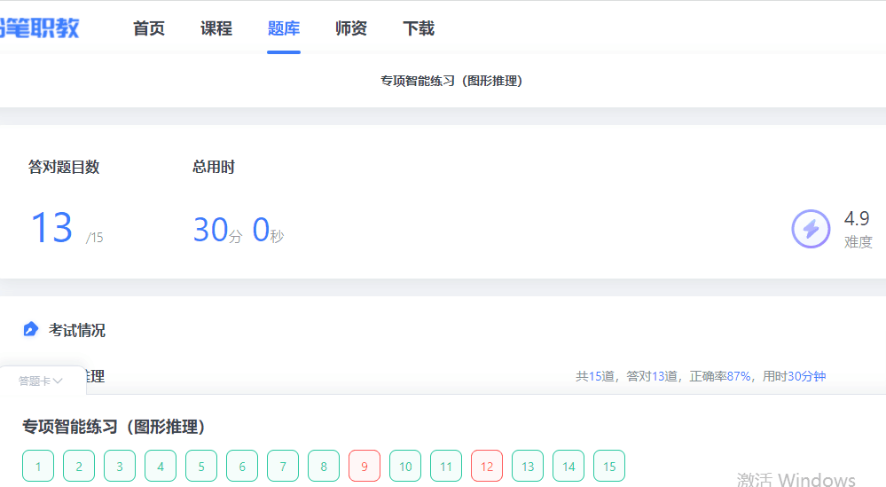
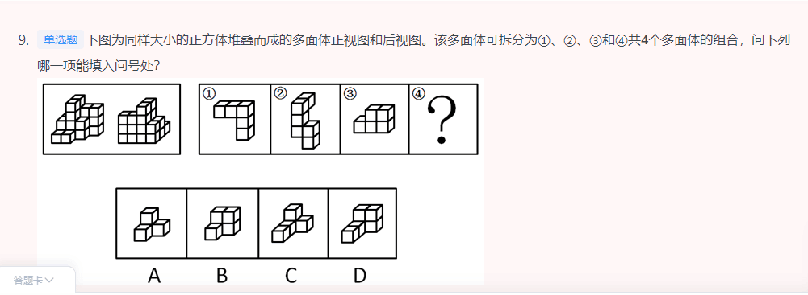
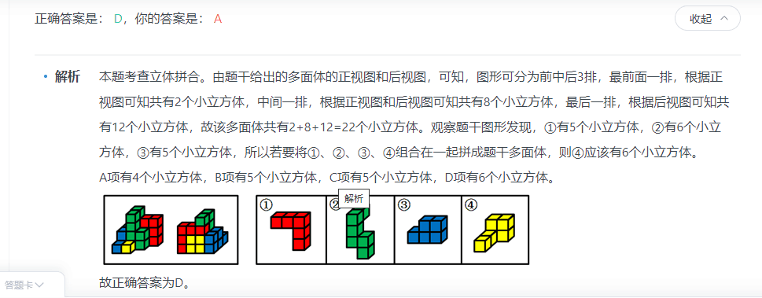
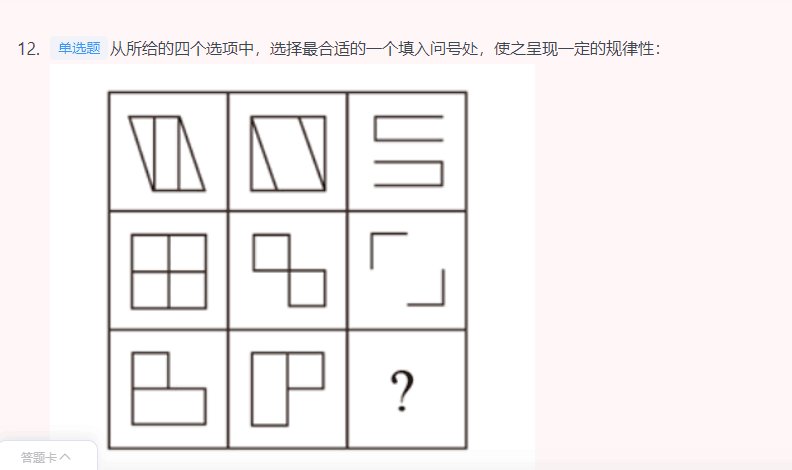
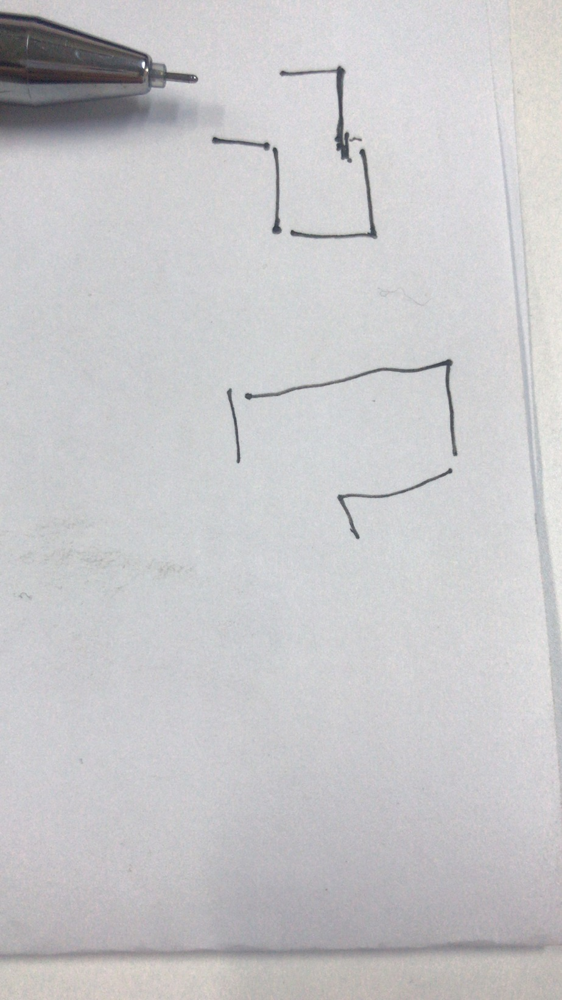

### 15道题做对13道，用时30min,正确率87%(国考的要求是一分钟一道题，注意提速！)



- 1



```
可以从数量角度，排除选项
```

- 2



```

元素组成相似，且相同线条重复出现，优先考虑样式规律中的加减同异。九宫格优先看横行，第一行中，图1和图2求异后再顺时针或者逆时针旋转得到图3；经验证，第二行也满足此规律；第三行应用此规律，故“？”处应选择一个图1和图2先求异再顺时针或者逆时针旋转得到的图形。观察选项发现，逆时针旋转无答案，只有顺时针旋转得到D选项。

故正确答案为D。

选错答案了，有几条线，选择几条线，数量不要变
```