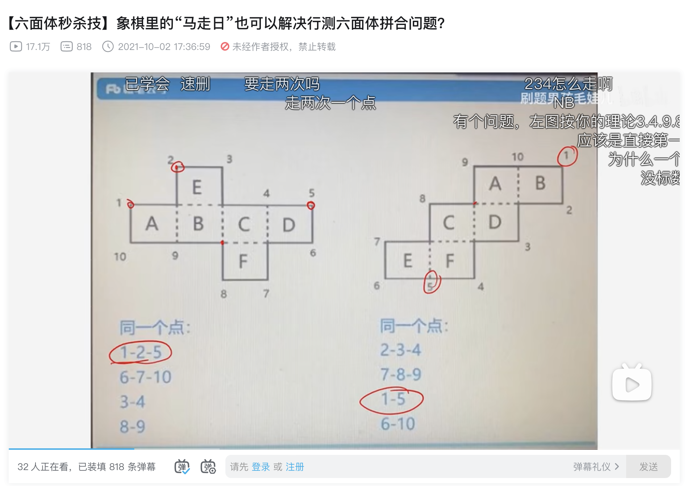
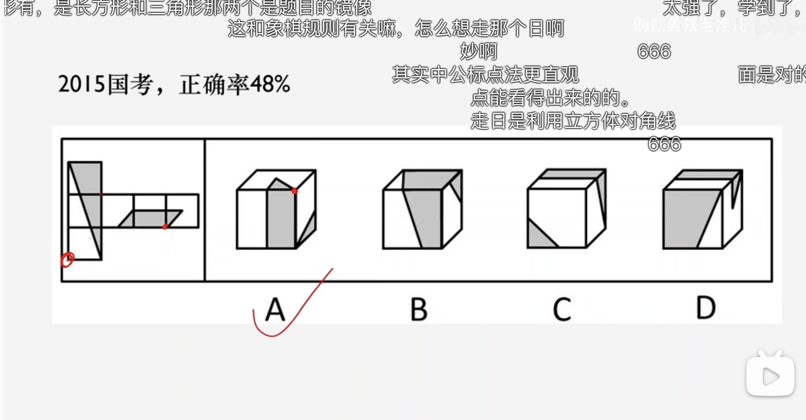
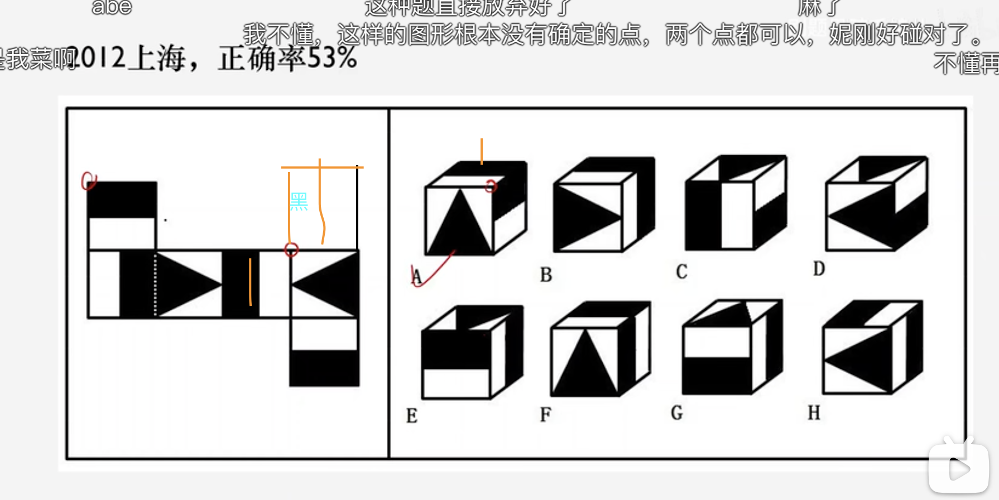

## 图形推理

- (https://www.bilibili.com/video/BV1zR4y1p7KX/?is_story_h5=false&p=1&share_from=ugc&share_medium=iphone&share_plat=ios&share_session_id=7E107F5D-1C46-43BB-BB9B-7C0EE000C59F&share_source=WEIXIN&share_tag=s_i&timestamp=1668079719&unique_k=0J4vv74)[立体拼合（马走日判断公共点]

- 马走日确定三个面，再和花生的旋转面配合很好用

## 加强削弱

## 逻辑判断

## 定义判断

## 类比判断