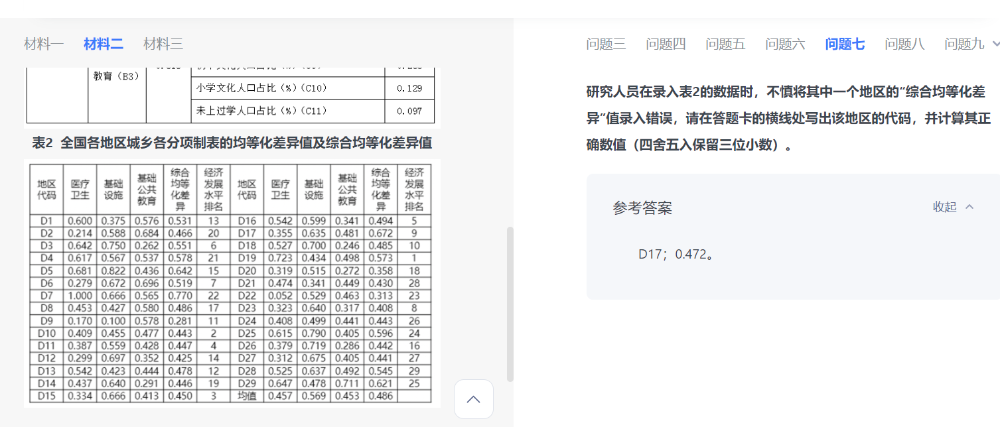

### 问题一
- 

```
解

极区电离层等离子体云块的形成机制

双子极光雷达网和GPS观测机制
```

```

第二段没概括完整的原因

1. 没有找到文章的关键词 等离子体块
2. 没有概括最后两端，那是讲意义。所以你概括的不完全
3. 做这种题要心平气和。要概括完整。找准主题词，找到所有方面。
答案

等离子体云块的来源及形成机制

等离子体云块的观测设备及成就
```
### 问题二
- 这道题做错，是因为否定论点。应该就直接从根源上先否定。比如问发生了作用。但是实际上是没发生作用。不要用别的没发生作用（全球性磁场）做回答。

```
解答
错误，偷换概念。文章说的是地球等行星具有的全球性磁场而不是两极地区的地球磁力线
```

```
答案

错误。根据段2，两级地区的地球磁力线无法起到阻挡作用，太阳风能够直接与两极的大气层相撞，与选项不符。

```
### 问题三
- 这道题选bc，容易错选A.

```
因为A错是因为，他不是句子本身有问题。而是他不符合题目问的。观测原理上的区别。而不是他们覆盖范围的区别。
```
### 问题四
- 请为本文写一篇内容摘要。要求：全面、准确，条理清楚，不超过250字

```

1. 概括不需要那么细致，直接说主题词就行。（不要把影响，机制，成就这种都写上去。）
2. 又忘记分层概括了。
3. 背景（概括成起因和结果就好。这里我忘记写了起因。太阳风携带超高速等离子体流撞入两极大气层，形成等离子体云块）
4. 第二段，概括少了。我只概括了形成机制。其实这大段先讲了原因（可能源自舌状电离区），再讲了行程机制。第一个行程机制概括错了。应该是（等离子体通过极隙区直接侵入极区大气层）影响也要加上（三种机制相互关联，但主导机制未知。）
5.观测设备及成就：SuperDARN可提供全域对流情况，GPS可获取密度分布，二者联合可观测完整演化过程，发现夜侧磁重联的重要性。（直接讲设备和成就。不需要讲太多他们如何实现的。）


本文主要离子体云块的形成影响行程机制以及观测和成就。离子体云块的形成引起极端天气环境，给人类的通信、导航、电力设施和航天系统等带来危害。它形成机制被归纳为以下三种：1.极隙区的对流模式受行星际磁场调制2、由新开放磁通管中增强的等离子体复合，引起爆发式对流通道。3.脉冲式日侧磁重联的发生。为此观测设备只有超级双子极光雷达网(SuperDARN)和全球定位系统(GPS)地面接收机网。超级双子极光雷达扫描并探测散射回波信号，主要探测等离子体的速度，GPS地面接收机利用信号折射效应，主要观测其密度。观测到等离子体云块的完整演化过程,发现夜侧磁重联扮演着重要的角色。
```

```
摘要：本文介绍了极区电离层等离子体云块。一、形成及影响：太阳风携带超高速等离子体流撞入两极大气层，形成等离子体云块，引起极端空间天气，对通信、导航等带来危害。二、来源及形成机制：可能源自舌状电离区，形成机制：等离子体通过极隙区直接侵入极区大气层；磁通管中等离子体复合，对流通道中等离子体耗散；脉冲式日侧磁重联，电离区被侵蚀，高密度等离子体向极盖区运动。三种机制相互关联，但主导机制未知。
```

### 问题六
- 第三个有几个都差不多，记得自己一个一个算一下。

```
C2 0.16 C3 0.12 C1 0.11165

 c6 0.114933
```
### 问题七

- 只能，先大致扫一下 看看有没有平均数错的。如果找不到就算了，毕竟30多个数据。这道题 其实错误还是蛮明显的。做题还是要有思路，不要一开始就上手。会花大把时间。



### 问题八

- 就拿第二，第三这种相近的做对比，不用找八杆子打不到一起的两个数字做对比。
```
  不呈正相关。城乡基本公共服务综合均等化差异值并未随着经济发展水平排名的降低而依次降低，如经济发展水平排名第2的综合均等化差异值为0.433小于经济发展水平排名第3的综合均等化差异值0.450。
```
### 问题九

```
原因 影响 对策 意义 危害 

相互依存，利于生存，大自然的规则
人也是，要与自然和谐相处
构建和谐共生，求同存异的人与自然关系
人对环境的影响 可能会摧毁部分生态系统

互利共生，构建和谐人与自然

举例子，意义。对策，引出论点

反面论证+引出对策

人与自然

人与人

展望未来危险
```

```
- 首段 解释+背景+引入论点
共生是指两种不同生物之间形成的紧密互利关系，其对人类的生存发展也会产生深远影响。追溯历史，我们经历了依赖自然、改造自然的阶段，到了后工业文明时代，人类对自然的干预导致生物种类减少，生态环境恶化等问题层出不穷。屡次教训让人类深刻认识到和谐共生才是人与自然的相处之道，只有走共生之路才能谋万世发展之福。

- 论点+举例子+意义+反面论证
 共生是生物演化的机制，生物的生存与延续离不开共生关系，生物的生存与延续离不开共生关系。牵牛花依靠篱笆墙生长，篱笆墙也因此被成就了一道风景，二者构成了一幅和谐共生的美好画卷。这样的现象在自然界中比比皆是，从花朵与蜜蜂到犀牛与牛鹭再到燕千鸟与鳄鱼，生物与生物之间存在着完整的生态链与共生关系。破坏其一方必会引起一系列的“多米诺骨牌效应”，北极冰川的不断融化，其影响的是生物的多样性以及人类栖居环境的变化。每一次引以为傲的征服自然，隐含的可能是人类难以预估、难以承受的可怕后果。

- 论点+引用名言+意义
  共生也存在于人类发展之中，把握好共生关系可以推动人类群体之间、人与自然、人与社会和谐共存。“地力之生物有大数，人力之成物有大限，取之有度，用之有节，则常足，取之无度，用之不节，则常不足。”这句话生动形象得道出了人与自然一荣俱荣、一损俱损的紧密关系。无论是人与人之间的互惠互利，还是人与禽畜、植物、环境之间的相互依存，都证明了共生关系的改变，影响着人类的生存与发展，人无法脱离自然资源而独立存活，只有和谐共生，才是发展之路。

- 论点+引用名言+对策
  和谐共生是万物生存和进化的法则，更是人类得以发展的原则，我们在享受自然馈赠的同时更应该学会如何保护自然。

       建构人与自然的关系就必须要做到求同存异，和谐共生。习总书记在十九大报告中指出：“人与自然是生命共同体，人类必须尊重自然、顺应自然、保护自然。”一方面，我们要深入学习生态文明理念，深刻认识人与自然的关系，积极践行“绿水青山就是金山银山”的绿色发展理念，在合理开发的基础上保护自然环境；另一方面，我们还要主动保护自然，构建生态廊道和生物多样性保护网络，提升生态系统的稳定性。让和谐共生在生物与生物之间、人类与自然之间持续留存。
- 结尾 提出呼吁
     古人云：人法地，地法天，天法道，道法自然。让我们共同构建人与自然生命共同体，共谋人与自然和谐共生之道！
```