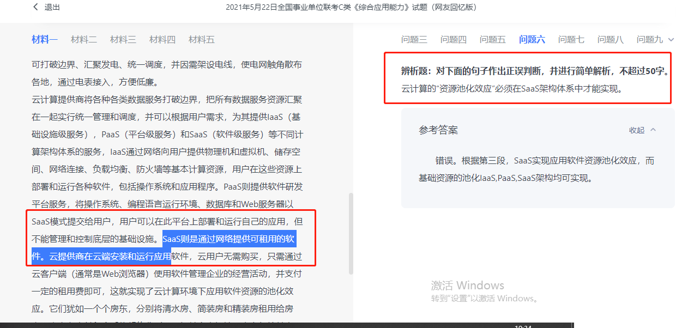
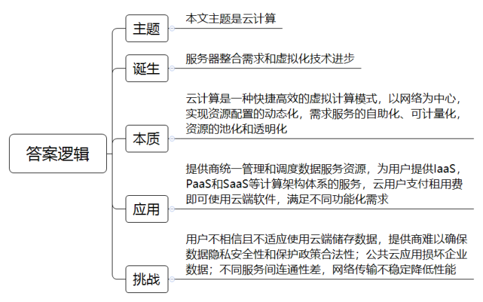
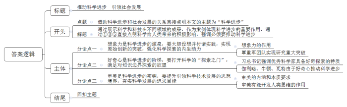

### 问题二

- 单选题找关键词

```
关于云计算实质的看法，下列表述符合文意的是（    ）。

A

自主计算使云计算的各组成部分均能实现自我管理

B

网格计算能够通过IT资源集群完成复杂的计算任务

C

效用计算按照IT资源的功能差别化地降低使用资费

D

分布式计算实现了网络数据中心资源配置的动态透明


错误原因：

1. 注意要找关键词（自主计算，网格计算，效用计算，分布式计算）

2. 找完关键词，看关键词后面的句子描述。其中选项有没有多加别的定义，无中生有。
比如：A 自主计算使云计算的各组成部分均能实现自我管理

但是文中描述 还有人认为其实质是自主计算，是一群具有自我管理功能的计算机系统。

没说到 计算机各组成部分

```

### 问题三
- 多选题（关键词难找，只能通过两字词语定位，或者概括文段内容定位，这道题定位很难）

```
比如 A硬件资源的跨地域连接是云计算得以发展的前提之一（概括文段内容定位）

在文中定位就是 第一段 随着高速网络连接的衍生，芯片和磁盘驱动器产品在功能增强的同时，价格也在变得更加低廉，拥有大量计算机的数据中心，也具备了快速为大量用户处理复杂问题的能力。技术上，分布式计算的日益成熟和应用，特别是网格计算的发展通过Internet把分散在各处的硬件、软件、信息资源连接成为一个巨大的整体，使得人们能够利用地理上分散于各处的资源，完成大规模的、复杂的计算和数据处理的任务。

比如 B.其提供者和使用者要对云端的设施和配置有专业了解（关键词难找，只能通过两字词语定位）

。事实上，云计算是具有效用计算和自主计算特点，依赖网格化、分布式计算机集群工作的一种快捷高效的虚拟计算模式，是多类计算和存储方式及网络技术发展融合的产物。它以网络为中心，实现资源配置的动态化，需求服务的自助化、可计量化，资源的池化和透明化，使用户不再需要了解“云”中基础设施的细节，不必具有相应的专业知识，也无需直接进行控制，便可以使用云计算技术为需求服务。

```


### 问题六



- 辨析题：对下面的句子作出正误判断，并进行简单解析，不超过50字。云计算的“资源池化效应”必须在SaaS架构体系中才能实现。

```
解题思路：这种题啊。全文没 资源池效应化 这个词，但是你要根据那一段谈sass的大意知道，分为软件和基础。 资源池效应化 还分为 软件资源池效应化 和 基础资源池效应化
```
### 问题七（1. 概括词太复杂（诞生，本质，应用，挑战） 2. 概括不准确（（1）第一段的倒数两句话概括出了诞生是服务器整合需求和虚拟化技术进步。（2）本质也找错了定义，找成了意义。（3）应用概括的不全面，应用应该包括定义，还有使用。我把如何使用掉了。即：云用户支付租用费即可使用云端软件，满足不同功能化需求。））
- 请为本文写一篇内容摘要。要求：全面、准确，条理清楚，不超过250字。



```

20世纪60年代，人工智能之父约翰·麦卡锡提出了把计算能力作为一种像水和电一样的公用事业提供给用户的理念，云计算由此起源，并催生了网格计算、公用计算的出现和发展。21世纪初期，崛起的Web2.0让网络技术和运用迎来了新的发展高峰。随着移动终端的智能化、移动宽带网络的普及，越来越多的移动设备进入互联网，这意味着与移动终端相关的IT系统会承受更多的负载，如何在用户数量快速增长的情况下快速扩展原有系统成为重要问题。由于资源的有限性，其电力成本、空间成本、各种设施的维护成本快速上升，直接导致数据服务企业的成本上升，如何有效地、更少地利用资源解决更多问题的需求日渐迫切。同时，随着高速网络连接的衍生，芯片和磁盘驱动器产品在功能增强的同时，价格也在变得更加低廉，拥有大量计算机的数据中心，也具备了快速为大量用户处理复杂问题的能力。技术上，分布式计算的日益成熟和应用，特别是网格计算的发展通过Internet把分散在各处的硬件、软件、信息资源连接成为一个巨大的整体，使得人们能够利用地理上分散于各处的资源，完成大规模的、复杂的计算和数据处理的任务。服务器整合需求的不断升温，推动了一系列虚拟化技术的进步。云计算最终应运而生，作为一种新兴的资源使用和交付模式逐渐为学界和产业界所认知。

新兴的云计算通常涉及通过互联网来提供动态易扩展而且经常是虚拟化的资源，它意味着计算能力也可作为一种商品通过互联网进行流通。目前，人们对于云计算的本质仍存有不同看法。有人认为，云计算的实质是一种网格分布式计算，由一群松散耦合的计算机组成一个超级虚拟计算机，用来执行一些大型任务；也有人认为，云计算实质是一种效用计算，按照计算、存储分别计量IT资源费用，像传统的电力等公共设施一样；还有人认为其实质是自主计算，是一群具有自我管理功能的计算机系统。事实上，云计算是具有效用计算和自主计算特点，依赖网格化、分布式计算机集群工作的一种快捷高效的虚拟计算模式，是多类计算和存储方式及网络技术发展融合的产物。它以网络为中心，实现资源配置的动态化，需求服务的自助化、可计量化，资源的池化和透明化，使用户不再需要了解“云”中基础设施的细节，不必具有相应的专业知识，也无需直接进行控制，便可以使用云计算技术为需求服务。云计算似一朵朵云彩，随风而动、似真似幻、四处散动、快捷灵便；又似一片片流动的公共可用水域，质性至柔，灵活涌动，无论你懂水与否，均可即用即取、多人共取；还似一个个综合性电厂，无论是火力、水力、风力，都可打破边界、汇聚发电、统一调度，并因需架设电线，使电网触角散布各地，通过电表接入，方便低廉。

云计算提供商将各种各类数据服务打破边界，把所有数据服务资源汇聚在一起实行统一管理和调度，并可以根据用户需求，为其提供IaaS（基础设施级服务），PaaS（平台级服务）和SaaS（软件级服务）等不同计算架构体系的服务，IaaS通过网络向用户提供物理机和虚拟机、储存空间、网络连接、负载均衡、防火墙等基本计算资源，用户在这些资源上部署和运行各种软件，包括操作系统和应用程序。PaaS则提供软件研发平台服务，将操作系统、编程语言运行环境、数据库和Web服务器以SaaS模式提交给用户，用户可以在此平台上部署和运行自己的应用，但不能管理和控制底层的基础设施。SaaS则是通过网络提供可租用的软件。云提供商在云端安装和运行应用软件，云用户无需购买，只需通过云客户端（通常是Web浏览器）使用软件管理企业的经营活动，并支付一定的租用费即可，这就实现了云计算环境下应用软件资源的池化效应。它们犹如一个个房东，分别将清水房、简装房和精装房租用给房客，房客在支付租金后依契约分别使用相关室内场地、水电气等基本设备、中低端家具家电或中高端家具家电、简易功能的家电套餐或复杂功能的家电套餐等。云设计师和云服务商们设想，借助IaaS、PaaS和SaaS，通过云链接与云处理的方式，可以有效地为用户实现云物联、云存储、云安全、云呼叫、云游戏、云教育、云会议、云社交等不同功能化需求的服务。比如，云安全服务通过网状的大量客户端对网络中软件行为的异常监测，获取互联网中木马、恶意程序的最新信息，推送到Server端进行自动分析和处理，再把病毒和木马的解决方案分发到每一个客户端；使用者越多，每个使用者就越安全——因为如此庞大的用户群，足以覆盖互联网的每个角落，只要某个网站被挂马或某个新木马病毒出现，就会立刻被截获。

不过，看上去很美味的东西，品尝起来却未必能顺利下咽。来自云安全联盟的调查表明，有88%的受访者担心自己在云端的敏感数据可能会丢失或者遭到破坏；有超过86%的受访者没有把敏感的业务数据存储在云中；甚至有51%的受访者根本不信任云存储，表示不会存储任何个人的资料。如何改变用户的使用习惯，使用户相信并适应网络化的软硬件应用是长期而且艰巨的挑战。实际上，云提供商也确实难以确保存储在云中的数据隐私会得到充分的安全保障，不被非法利用，更不能保证他们的数据保护政策能够通过安全审计或者是政府的监管检查。有些数据是企业的商业机密数据，安全性关系到企业的生存和发展。某专业机构也进行了类似的云安全研究，调查表明，超过一半的受访者认为数据的安全性是最大的云“抑制剂”。另有一项研究发现，各种规模的企业都受到过公共云应用的困扰，流氓的云备份、复杂的恢复过程以及低效的云存储程序都会对数据造成损坏。再者，一方面，由于缺乏统一的技术标准，尤其是接口标准，各厂商在开发各自产品和服务的过程中各自为政，这给将来不同服务之间的互连互通带来严峻挑战；另一方面，云计算服务高度依赖于网络技术，大量用户集中使用服务时网络传输的低速且不稳定，也会大大降低云应用的性能，失去吸引力。


本文介绍了云计算。一、云计算的背景以及起因。崛起的Web2.0让网络技术快速发展，云计算作为一种新兴的资源使用和交付模式，最终应运而生。二、云计算的概念。它使用户不再需要了解基础设施的细节，可即用即取、多人共取，打破边界、汇聚发电、统一调度，方便低廉。三、云计算是如何对数据服务资源进行调度管理。为其提供IaaS，PaaS和SaaS等服务。分别负责基础设施级服务，平台级服务，软件研发资源，实现不同功能化需求的服务。四、云计算面临的困境。数据隐私安全，受到政府以及安全审计监管。并且确实技术上也难以充分保障安全，数据会遭到破坏，缺乏统一技术标准。不同厂商难以互相连通。并且网络传输不稳定速度低。（465）
```

```
摘要：本文主题是云计算。一、诞生：服务器整合需求和虚拟化技术进步。二、本质：云计算是一种快捷高效的虚拟计算模式，以网络为中心，实现资源配置的动态化，需求服务的自助化、可计量化，资源的池化和透明化。三、应用：提供商统一管理和调度数据服务资源，为用户提供IaaS，PaaS和SaaS等计算架构体系的服务，云用户支付租用费即可使用云端软件，满足不同功能化需求。四、挑战：用户不相信且不适应使用云端储存数据，提供商难以确保数据隐私安全性和保护政策合法性；公共云应用损坏企业数据；不同服务间连通性差，网络传输不稳定降低性能。

```

### 问题七

- 阅读给定材料，指出其中存在的4处论证错误并分别说明理由。请在答题卡上按序号分条作答，每一条先将论证错误写在“A”处（不超过50字），再将相应理由写在“B”处（不超过50字）。

```
再生水是生活污水或工业废水等经过系列处理，达到城市污水再生利用标准，可以在非饮用领域替代自来水、地表水的水源，主要用于道路洒扫、园林绿化、环卫保洁、基建降尘、洗车冲厕、湖泊湿地补水循环以及工业冷却和部分生产过程。

随着水资源需求量急剧增加和水环境污染日益严重，我国部分地区和大中城市水资源短缺问题越发严峻，因此开发利用再生水就显得非常重要。首先，大力发展再生水回用，可以在一定程度上缓解供水紧张和缺水问题。如A直辖市中心城区2018年总用水量接近25亿吨，再生水占比32%，达8亿吨。其次，再生水回用促进了水资源循环利用，即污废水回收——再生处理——用户回用——再回收——再处理——再回用。B市洋湖是没有河流来水的市内湖泊，为解决湖区补水循环问题，B市建设了洋湖湿地公园，并吸引社会资本建成洋湖补水工程，从市郊的小镜河中引水补充到公园内，有效增加了水体流动性和循环自净能力。其三，由于再生水开发回用使自然水体环境质量得到改善，直接排放到自然水体的污染物大幅减少。

目前，再生水开发利用在各地发展不平衡。M市是个中等城市，虽三面环海，但严重缺乏淡水，只能盯住再生水。从上世纪80年代起，M市就开始推广再生水。近年来，M市仅企业单位和居民小区就建设单体再生水利用设施56座，每座日均处理回用能力达2000吨，也就是说这些企业单位和居民小区每天使用了总量达11.2万吨的再生水。

另有一些城市再生水推广利用尚处在起步阶段，多数市民不了解什么是再生水及其回用。例如，某研究机构在N市做了一次问卷调查，其中设置了对再生水“很了解”“基本了解”“不了解”三个选项，结果显示：选择“很了解”的有19人，“不了解”的有89人。

业内专家认为，针对再生水的开发利用和推广需做好以下工作：一是确保资金投入，完善生产加工设施和输水管网。二是通过技术创新和示范工程，加快推进再生水开发利用。三是建立完善再生水推广利用的政策机制。四是加大宣传推广力度，消除公众疑虑。


```

```

解答：
 1. 注意以偏概全
 2. 自净能力和循环利用词不一样，强拉因果
 3. 每座处理能力和每天使用总量多少的再生水，文章没说是一个东西。偷换概念

答案：
 1.A：第二段由“A市2018年用水的占比”推出“大力发展再生水回用可在一定程度上缓解供水紧缺”存在论证错误。

       B：论据中举了“A市2018年”的特例，不具有代表性，推不出“大力发展再生水回用”的一般性结论，属于以偏概全。

 2. A：第二段由“B市通过引水增加了水体的循环自净能力”推出“再生水回用促进了水资源循环利用”存在论证错误。

       B：“引水增加水体的循环自净能力”与“再生水回用促进水资源循环利用”没有必然的因果联系，属于强拉因果。    
3. A：第三段由“每座日均处理回用能力达2000吨”推出“每天使用了总量达11.2万吨的再生水”存在论证错误。
       B：论据中“日均处理回用能力”与结论中“每天使用再生水的总量”概念不同，不能等同，属于偷换概念。
4.A：第四段由“‘很了解’的有19人，‘不了解’的有89人”推出“多数市民不了解再生水及回用”存在论证错误。

  B：问卷三个选项只给出两个，并未给出“基本了解”的人数，推不出“多数市民不了解”的结论，属于论据不充分。       


```

### 问题九

```
上述材料从不同角度谈到了科学进步的助力因素，请围绕这个话题，参考给定材料，自拟题目，写一篇议论文。

要求：观点明确，内容充实，条理清晰，语言流畅，字数800～1000字。

复合材料 - 金属陶瓷
鹊桥 - 嫦娥四号”成功登陆月球背面并传回了世界第一张近距离拍摄的月背影像图。


物理学家麦克斯韦在前人研究的基础上得出一组方程，其含义是：变化的磁场产生电场，而变化的电场不产生磁场。这显然是不对称的。在审美意识的强烈驱使下，虽然缺乏实验数据支撑，他仍然把方程做了修正，使其对称起来，预言了电磁波的存在。

```


```
科学家探索推动进步

新需求，对材质的追求（想象力）
攻坚克难，（好奇心）
怀疑批判（审美）

```




```
推动科学进步  引领社会发展

想象力，好奇心，审美。

- 背景引入主题 近年来，我国在计算机、通讯、生物医药、新材料等高科技领域不断实现纵深式推进，科学已经为人类创造了巨大的物质财富和精神财富。

-  想象力是科学进步的源泉，要大胆设想并付诸实践，实现原始创新的突破，强化科学探索的内生动力。美国著名思想家杜威曾说过，“科学的伟大进步，来源于崭新与大胆的想像力。”诚哉斯言，发挥创造性和想象力能激发创新思维，打破固定模式的限制，收获更多的惊喜。中科院分子植物科学研究员覃重军通过多年前的一个疯狂猜想，与合作者在国际上首次人工创建了单条染色体的真核细胞，这被认为是继原核细菌“人造生命”之后的又一个重大突破，为人类对生命本质的研究开辟了新方向，实现了“人造生命”里程碑式的跨越。

- 好奇心是科学进步的阶梯，要打开科学的“探索之门”，满足对知识边界探索的欲望。习总书记曾在科学座谈会上讲过：“凡是取得突出成就的科学家都是凭借执着的好奇心、事业心，终身探索成就事业的。”好奇心能推动科学家主动探究、求知践行。从伽利略比萨斜塔验证重力加速度，到牛顿发现了万有引力定律，再到瓦特发明了蒸汽机，掀起了第一次工业革命……不难发现，一次次改变人类认知的科学发现，都是源于对事物的好奇之心。因此，我们应培养对科学的的好奇心，激发出求知的欲望。

- 审美是科学进步的密钥，要提升引领科学技术发展的思想境界，夯实科学发展的追求目标。审美意识是超越科学的，能决定科学发展的思想境界。勾股定理和化学元素原子结构是审美的内在探索，逐渐多元的太空服设计风格和层出不穷的科技产品是审美的外在完善，这都体现出科学的审美意识和由审美带来的生活趣味。审美不再是简单的身心愉悦，不再是表面的完美对称，更是高远的科技境界，是严谨的科技探寻。因此，正确运用审美意识能开发人类的思维，促进科学实践取得更大的成功。

- “工欲善其事必先利其器”，科学发展是大势所趋，这就需要我们把握好当前的良好时机，以大胆设想为动力、以好奇探索为抓手，用审美勇攀科学高峰，让科学进步为我国建设世界科技强国的奋斗目标保驾护航！

```