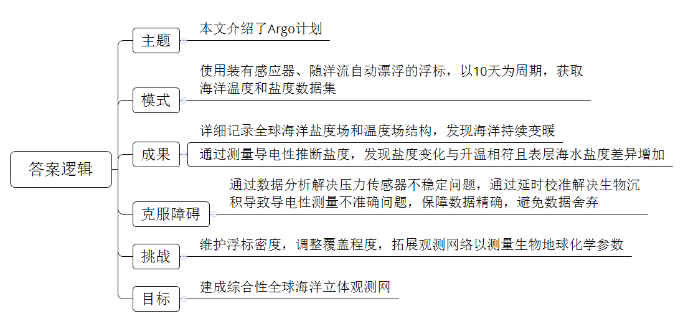
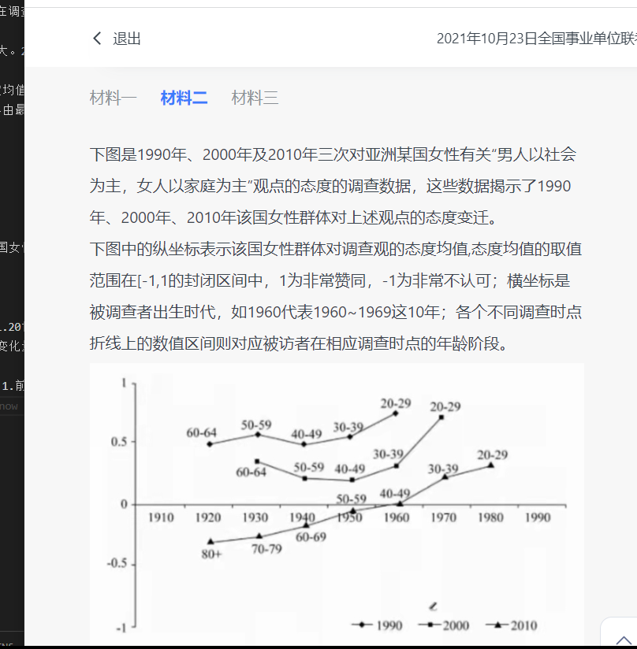
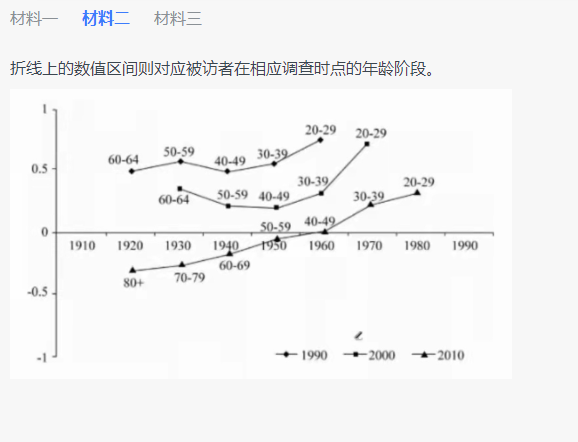

### 材料一

```
海洋是气候系统中关键的一环，要理解气候系统的变化并预测其动向，研究海洋是十分重要的。为了进行世界海洋环流实验，美国加利福尼亚大学斯克里普斯海洋研究所的研究人员开发了一种能够在海洋1000米深处随洋流自动漂航的浮标，并在浮标上安装温度和盐度感应器。这就是Argo计划在1998年时的雏形——全球性的浮标网络。

截至2018年3月，Argo计划的浮标数量达到了3784个。每个浮标高1.8米，直径25厘米。这种浮标不需要推进系统，能随着洋流水平前进，也能通过改变浮力实现上浮或下沉。每个浮标以10天为一个运作周期。浮标从海洋面下沉到1000米左右的初始深度，并在接下来的9天时间里在该深度处漂流。之后，浮标继续下沉，到达2000米的深度，并自动开始上浮，在上升过程中，浮标利用自身传感器对水体的温度和盐度进行连续剖面测量，当浮标到达海面后，通过卫星定位和数据传输系统自动将测量数据传送到地面接收站，这样就完成了一个运作周期。在深度2000米至海面区间内所通的温度和盐度组成了海洋的数据集，其中的每项数据都叫做“海洋学剖面资料”。温度测量的误差在0.005摄氏度之内，而盐度的测量误差在0.01个盐度实用单位之内(1“盐度实用单位”是指在1000克水中含有1克盐)。

Argo计划能够详细记录全球海洋盐度场和温度场的结构。2015年，斯克里普斯海洋研究所的研究人员发现，在过去的135年间，海洋表层1000米的水体温度平均升高了0.3摄氏度。靠近海平面处的海水升温幅度最大，达到了0.6摄氏度。Argo计划提供的数据还显示，跟几十年前相比，大多数表层海水的温度都升高了。

得益于Argo计划，我们能够从海洋热量存储方面解释海水温度的上升。通过研究过往的水文地理数据以及来自Argo计划的数据，我们发现在过去的40年里，距海面700米以内的海水的热含量升高了，那里的海水吸收了90%的气候系统在海洋中多存储的热量。而在过去10年间，海水热含量升高的情况大多发生在南冰洋。但是在Argo计划实施之前，科学家很少在那里采样。总的来说，Argo计划实施以来，科学家发现海洋确实在持续变暖，尤其是南纬20度至南极这一区域最为明显。

另一方面，Argo浮标通过测量海水的导电性来推断海水盐度，解决了以往测量盐度的难题。通过这些数据，日本国立海洋研究开发机构的细田滋毅及合作伙伴于2009年指出，在各个大洋主要流域的上层水体中，盐度发生了变化，这似乎与海洋表层水体的普遍升温相符。在中纬度地区，随着表层水体的温度升高，海洋的蒸发量增加，表层海水的盐度自然就会升高。此外，Argo计划还表明，表层海水的盐度差异也越来越大：盐度本来就高的海域的含盐量在增加，而盐度本来就低的海域的含盐量却在下降。

Argo计划经历了各种各样的障碍。从技术的角度来说，Argo浮标将在海上漂航3年多时间，这意味着，如果浮标出现了什么问题，很难立刻得到解决。在Argo网络的布置阶段，由于用来测量压力的传感器不够稳定而必须更换新的传感器。基于这种情况，研究人员被迫舍弃了一部分数据。尽管如此，在Argo计划的科研小组对数据进行了适当的分析和处理后，这些问题都得到了解决。目前，所有浮标的压力传感器都十分稳定、精确。

浮标是通过海水的导电性来确定盐度的，但测量海水的导电性并不容易，原因之一就是生物沉积，即感应器上出现的微小的有机物累积。虽然生物沉积的影响一般较小，但在浮标超过3年的漂航过程中，盐度变化的自然规律与生物沉积的规律基本吻合，这成了Argo计划自实施以来最主要的障碍之一。因此，科学家需要开发出一项技术来区分盐度的自然变化和生物沉积的影响。在Argo计划开始的头几年，来自美国马萨诸塞州伍兹霍尔海洋研究所的研究人员开发了一项技术，通过把浮标在某个深度测得的盐度与那里海水已知的稳定盐度进行对比，进而来确定海水盐度的自然变化。这种方法叫做“延时校准”，目前已经应用到了每一个浮标上，并且每6个月进行一次校准，以保证测量的准确性。另外，如果有些测量数据不符合历史记录，或者属于人们尚未发现的变化规律，“延时校准”还可以避免这些数据被舍弃。

在未来几年，Argo计划将面临多项挑战。首先是浮标自身的维护，要维持目前浮标在全球的覆盖密度，每年要重新布置750个浮标，其次，需要调整观测网络的覆盖程度，以适应海洋的动态变化。目前3784个浮标只观测了海域的一半，这是因为浮标最多只能下潜到2000米深处，而海洋的平均深度超过4000米，近期，西班牙的Argo团队在加那利群岛海域西北部布置了两个可达4000米的深海浮标，在进行了一年的连续观测后，这些深海浮标发现，在4000米处，海水温度变化了0.03摄氏度，盐度变化0.007个单位。只在某些区域的深海区进行一次测量是不够的，还需对深海进行持续追踪。最后，除了温度和盐度，海洋对气候系统的影响程度还取决于其留存二氧化碳的能力。从科技角度来看，把Argo观测网络拓展用于生物地球化学参数的测量方面，将是未来我们面临的一项巨大挑战。

2019年3月，第20次国际Argo指导会议在杭州召开，正式提出了Argo计划的未来发展目标——建成一个由2500个核心Argo浮标(观测0—2000米海水温度和盐度)、1200个深海浮标和1000个生物地球化学浮标组成的综合性全球海洋立体观测网。毫无疑问，这具有里程碑式的重要意义，将再次在海洋学领域掀起一场革命，从而帮助我们更好地理解地球正在发生的变化。
```

- 问题一，二，三要注意是单选还是多选题

- 问题四（否定论点不要找另有他因，因为这道题本来就不明确，直接否定论点就行）

```

（对下面的句子作出正误判断，并进行简单解析，不超过50字。要想提高 Argo 计划在全球海域的覆盖密度，其解决途径是尽快开发下潜深度更大的新型浮标。）

错误。因为提高密度主要因素是浮标的维护，每年还需要重新布置大量浮标。再其次才是开发下潜深度更大的浮标。

答案：错误。根据段8可知，开发下潜深度更大的新型浮标是提高观测网络覆盖程度的解决途径，选项和原文不符
```
- 请为本文写一篇内容摘要。要求：全面、准确，条理清楚，不超过250字（1.你的答案很大的问题就是条理不清楚。）



```

1. 先全文概括。（本文介绍了Argo计划）
2. 把全文分条理。1.模式2.成果3.克服障碍。4挑战 5.目标（我把挑战搞掉了，因为是文章自己划分的，不要给合并了。）
3. 概括不准确。（1.总体概括起因，经过，结果。2.成果：做了啥，得到了啥。3.障碍那块很明显，因为文章不会列1,2，3,4障碍让你去抄写。但是你要自己从问题推障碍。比如：“延时校准”还可以避免这些数据被舍弃。-->避免数据舍弃）

解：为了研究气候系统变化，研究人员发明了浮标。argo计划利用改变浮力，周期运作，用传感器对水体温度和盐度连续剖面测量，将数据传到地面接受站。得到了海洋学剖面资料。发现海洋在持续变暖。并且发现表层海水盐度差异越来越大。argo计划包含一些技术障碍，包括压力传感器是否稳定，生物沉积，自身浮标维护，浮标下潜高度。argo未来是简历深海浮标和生物地球化学浮标结合的综合性立体观测网。(160字数)

答案：本文介绍了Argo计划。


为了研究气候系统变化，研究人员发明了浮标。（本文介绍了Argo计划）argo计划利用改变浮力，周期运作，用传感器对水体温度和盐度连续剖面测量，将数据传到地面接受站。得到了海洋学剖面资料。（一、模式：使用装有感应器、随洋流自动漂浮的浮标，以10天为周期，获取海洋温度和盐度数据集。）发现海洋在持续变暖。并且发现表层海水盐度差异越来越大（二、成果：详细记录全球海洋盐度场和温度场结构，发现海洋持续变暖；通过测量导电性推断盐度，发现盐度变化与升温相符且表层海水盐度差异增加。）。argo计划包含一些技术障碍，包括压力传感器是否稳定，生物沉积，自身浮标维护，浮标下潜高度。（三、克服障碍：通过数据分析解决压力传感器不稳定问题，通过延时校准解决生物沉积导致导电性测量不准确问题，保障数据精确，避免数据舍弃。）（四、挑战：维护浮标密度，调整覆盖程度，拓展观测网络以测量生物地球化学参数。）argo未来是简历深海浮标和生物地球化学浮标结合的综合性立体观测网。（五、目标：建成综合性全球海洋立体观测网。）(160字数)
```

- 问题六（这种题应该找到底是怎么下降的。下降代表什么含义）

```

概括20世纪50年代出生的该国女性在1990年、2000年和2010年接受调查时对于调查观点的态度变化情况。（不超过25字）

解答：对这个观点是不赞同的。（注意看懂图，在横坐标为1950时候，从圆圈，到正方形，到三角形，对用的纵坐标在下降。并且三角形已经在-0.5.说明，20世纪50年代出生的该国女性在1990年、2000年和2010年接受调查时对于调查观点的态度变化是认可度逐渐下降）

答案：认可度逐次降低，2010年为不认可。均值从0.5到0.15再到-0.05。

```

- 问题七（注意问的是哪一调查时点，调查时点就只有3个，1990,2000,2010）

```

在哪一调查时点，该国女性在调查观点上的态度代际差异最大?并简要说明理由。（不超过100字）

在1920年代的态度关差异最大。2010年是-0.5,1990年是0.5

答案：2010年。理由:1.态度均值变化量最大。1990年由最低40年代0.5变为最高60年代0.75，变化0.25；2000年由最低50年代0.15变为最高70年代0.7，变化0.55；2010年由最低20年代-0.3变为最高80年代0.3，变化0.6。2.2010年由最低负值变为最高正值。

```

- 问题八（艹 这种题好难）




```
比较20世纪30年代出生的该国女性和20世纪40年代出生的该国女性在三次调查中对于调查观点的态度差异和变化趋势。（不超过150字）

解答：1930年与1940年代，

答案：一、态度差异比较。1.20世纪30年代和40年代态度均值均逐次下降，均在2010年变为负值；2.态度均值在2010年由30年代高于40年代变为低于40年代；3.态度均值变化量总体30年代高于40年代。

       二、变化趋势比较。1.前两次调查均呈现下降趋势，第三次调查呈现上升趋势；2.第一次调查变化幅度小于第二次和第三次调查变化幅度。

```

- 问题九（）

```
电脑软件领域中的“开源”即开放源代码。程序员将编好的一组源代码发布到网络平台上，任何人都可以自由下载、修改、使用和创新。

某源代码平台的用户可通过平台提供的图形交互界面分享和修订资源库中的代码。该平台2020年度报告称，源代码开发者数量已超过5600万,超6000万新项目被创建。在开源平台上，资源不受垄断而保持开放共享的状态。

每一款优秀开源软件的背后都有一批源代码贡献者，他们通过不断的优化更新，使开源软件的质量不断提升。正因如此，更多更好的开源软件被创造出来。如今，“开源”已经成为了一种精神、一种文化。

结合给定材料,以“‘开源’的价值”为题，写一篇议论文。

要求：观点明确，内容充实，条理清晰，语言流畅，字数800~1000
```

```
开源的价值

第一段：背景+意义+总论点

第二段：反面论证+意义+过渡句子

第三段：分论点+意义+对策

第四段：分论点+意义+对策

第五段：分论点+意义+对策

第六段：总论点观点叙述+意义+总结升华
```

```
人工智能、大数据、开源软件、中国的自主操作系统、从病毒全基因序列到医疗防控诊疗方案再到疫苗试剂的科研攻关，在抗疫技术的“开源”过程中


1. 深入发展的鲜明特点，能够汇聚众智，促进多方协同和技术更迭换新，使连接范围不断延伸、应用领域不断拓展、
2. “开源”的价值是无限的，因此我们要拥抱“开源”，享受“开源”，加快形成数字时代科技创新发展的新优势。
3. “开源”有利于打破垄断，促进资源开放共享，激发社会发展的“潜能”。
4. “开源”加速信息更新，提高软件创造的质量，为技术优化升级提供发展空间，为科技创新注入“动能”。从微软公司捕捉机会大步迈向开源世界，到谷歌借助安卓成为移动时代霸主，足以见得，有了现成的源代码可以参考，开发者可以大幅度提升软件开发的效率，通过信息更新、控制成本，企业也可以快速提高软件创造的质量。
5.  “开源”强化了分享精神，推动科技领域文化生态建设，夯实科技发展人性化的“本能”。
6. 习近平总书记曾指出：“全球数字经济是开放和紧密相连的整体，合作共赢是唯一正道。”顺应时代发展趋势，构建万物互联的模式，“开源”的未来，一定会更具扩展性、连接性和生态包容性！


```