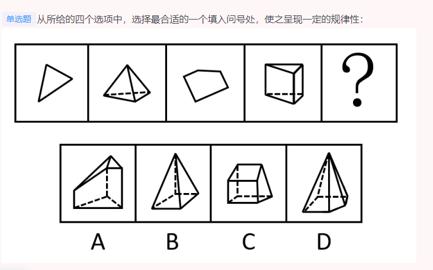

###  言语共35道，答对26道，正确率74%，用时36分钟

 #### 阅读理解(共14道，答对13道，正确率93%)
  1. 中心理解

    (1) 行文脉络-分总(共4道，答对3道，正确率75%)

  ```
    主要文章的层次。重点讲什么，此外的那种就不是重点。

  ```  

  2. 细节判断
  3. 标题填入

 #### 语句表达(共5道，答对3道，正确率60%)
  1. 语句排序
  2. 语句填空
    (1) 结尾(共2道，答对1道，正确率50%)

    ```

    1. 紧接的一句应该总结全文并且跟文章最后一句有关系，最后一句提到了空气。所以应该是“盐穴”是储存高压空气的理想场所
    2. 一定要注意最后一句的概括要全面，要注意选项的关键词。“竞争优势”针对的是企业而不是全社会。宁愿选模拟两可范围大的“智慧的源泉”
    3. 吐过没有关键句，一定要注意频繁的主题词。
    4. 不要读文段凭感觉选了一个中心句。但是分析文章的段落，可以发现文章分为两个部分。而且是以分号分开的。
    5. 不要凭着感觉，觉得是概括全文的意思，但是要注意，这句话前面是句号。下一句是逗号。所以这一句是对后文的概括，也就是要有感觉的意思。春江水暖鸭先知。
    6. 不要根据语感做题。但是这种接语题，标点符号很重要，上一句是个分号。意思跟上一句应该很相似。上一句讲的是总能吸引到眼球，而且群众也相信。所以这一句也是递进。那就更容易得到公众的普遍认同。
    7. 有时候文章也有重点强调的方面，会通过转折词，或者是层次结构，先强调什么，再举列子。注意到文章的重点。开头引入的是元朝。宋朝只是比较，而关键词却，也是强调元朝人。有时候就是考这个重点，填入句子。

    ```
  3. 接语选择(共1道，答对0道，正确率0%)

  ```
   1. 接语选择题，故需在阅读整个文段内容的基础上重点关注尾句。要注意主体信息，不能偏离主体信息。比如选项A主题是科学工作，但是尾句是读者。那么就不能选A.C项介绍一部生动的科普著作。既符合尾句，又复合文章主旨。
   2. 如果文章有重点句子强调，要结合最后一段的话题和重点句子。同样如果文章脉络是针对第一句话，然后举列子，然后对比，然后论述。也不能盲目迷信最后一句最重要，先要看文章脉络。因为后面都是对第一句的对比以及举例。最重要的还是第一句话。然后要围绕着现代化学展开论述。
   3. 下一段讲的内容，不要跟上面讲的两个方面的其中一个方面重复。
   4. 文章问的是文章最有可能讲什么。而不是转折之后讲什么。转折之后讲的是上文。转折之前讲的是前文。所以转折之前讲的是皇权
   5.这段没有重点脉络，就应该紧接后文。主题一致。最重要的还是最后一句。实在不知道选什么记得看最后一句。文段话题落在尾句上，接下来应该围绕最后一句的话题进行论述。而不是把前面的内容重复一遍。
   6. 有时候最后一句，无法判断有什么话题，可能是特殊题型。判别文段话题落脚点。文段先提出“中国古代是否都有城墙”这一话题，然后介绍了“人们印象中每个城市似乎都有城墙，和城墙的重要性。似乎表达作者的不确定，后面可以接着讲，没有城墙的朝代。
   7. 中国科学家的科普工作做得究竟如何？这种话题应该是科普工作，而不是科学家。而且文章整段说科普不行。接下来应该讲科普的重要性以及解释原因。
   8.如果文章有重点疑问句，并且后文对它进行解释。那么后文也可能跟这个疑问句相关。
  ```
 #### 逻辑填空(共16道，答对10道，正确率63%)
  1. 实词填空(共8道，答对4道，正确率50%)

  ```
   1. 词性：我错在第二个空。因为提供了丰富的滋养。滋养可做名词，但是不能说提供了丰富的润泽。润泽一般是做动词。

   2. 顺序：缺乏家庭监管，而不是家庭监管缺乏

   3. 有时候要知道，从哪个空入手，该排除的要排除。别觉得这个词很适合，就不管别的词适合不适合了。

   4. 有时候要看前面修饰它的词语。如果修饰用了过度，那么这个词也要用的词性比较程度大的。

   5. 我当时看重字意。破了茧成了碟。拖了胎才换了骨。不能从字面意思上考虑。而是要从含义上考虑，相似性。脱胎换骨”比喻思想得到彻底改造，但无法体现历经磨难。破茧成蝶：意思经历磨难重获新生。但是振翅高飞和脱胎换骨没有这个意思。

   6. 错是因为我完全就想当然。而没有真正结合语境，和实词后一个句子。语境分析。后文“如何通过差异化战略来获取竞争优势，如何达到旅游和地产的平衡”可知，横线处需体现文旅领域中的各主体是处于一种你追我赶的竞争环境当中。


  ```
  2. 成语填空((共5道，答对4道，正确率80%))

  ```
  1. 成语的含义以及积累，比如：皮里阳秋”指表面上不作评论但内心有所褒贬。
  ```
  3. 混搭填空((共3道，答对2道，正确率67%))
  4. 词的辨析(共8道，答对4道，正确率50%)
    (1)词义侧重(共2道，答对1道，正确率50%)
    (2)固定搭配(共6道，答对3道，正确率50%)
    (3)感情色彩(共2道，答对1道，正确率50%)
 
  5. 语境分析
    (1)对应关系：解释类对应(共4道，答对1道，正确25%)

    ```
     1. 对应关系-解释类对应:找到重点句子的对应：而“度量”是决定一幅唐卡价值的基本条件，一幅上乘的手绘唐卡，应该是完全按照《造像度量经》之规定绘制的、讲的就是标准化。

     2. 有时候要结合当句的语境，有因果关系的用内生。
    ```
    (2)对应关系：重点词语对应(共7道，答对5道，正确率71%)

###  判断共35道，答对22道，正确率66%，用时40分钟

  #### 图形推理（共5道，答对4道，正确率80%，用时8分钟）
    1. 位置规律
    2. 属性规律
    3. 数量规律（共1道，答对0道，正确率0%，用时44s）
    （1） 素


```
  元素组成不同，且无明显属性规律，考虑数量规律。观察发现，题干图形均由小三角形构成，尖角朝上的小三角形个数与尖角朝下的小三角形个数相同，只有D项符合。

  故正确答案为D。 
```
 
    4. 空间类
  #### 定义判断（共10道，答对6道，正确率60%，用时14分钟）！！

  1. 单定义（共5道，答对4道，正确率90%，用时9分钟）
    （1） 主客体 
    （2） 大前提 （共1道，答对0道，正确率0%，）
    （3） 方式目的 
    （4） 原因结果 

  4.1(A项目不符合从原所有人那里取得对某项财产的所有权。乙抵押的珠宝还是属于乙。错是因为态度问题，没有找到关键词1,2,3一个一个对。)

```
    继受取得，又称“传来取得”，是指通过一定法律行为或其他法律事实，从原所有人那里取得对某项财产的所有权，主要包括买卖、互易、赠与、继承、遗赠、消费借贷等。
    
    根据上述定义，下列丙取得物的所有权的方式属于继受取得的是：

    A
    甲将乙抵押的珠宝赠与丙

    B
    丙从某音乐网站购买的专辑

    C
    甲将丙未定稿的诗集送给乙

    D
    丙从自家果树上摘得的苹果

    正确答案是 B，你的答案是 A收起
    解析
    第一步：找出定义关键词。

    “通过一定法律行为或其他法律事实”、“从原所有人那里取得对某项财产的所有权”。

    第二步：逐一分析选项。

    A项：抵押期间，乙仍是珠宝的所有权人，故丙受赠得到珠宝不符合“从原所有人那里取得对某项财产的所有权”，不符合定义，排除；

    B项：丙从某音乐网站购买的专辑，符合“通过一定法律行为或其他法律事实”、“从原所有人那里取得对某项财产的所有权”，符合定义，当选；

    C项：甲将丙未定稿的诗集送给乙，故丙是原所有人，诗集不是丙的取得物，不符合“从原所有人那里取得对某项财产的所有权”，不符合定义，排除；

    D项：丙是自家果树的所有权人，对果树上结出的苹果仍然具有所有权，不符合“从原所有人那里取得对某项财产的所有权”，不符合定义，排除。

    故正确答案为B。
```
1.2（没想到，单定义还会考不确定选项。B项小丽要请外国友人去中文角，但是并不知道外国友人去没去）


```
        技能交换就是用自己掌握的技能交换别人掌握的技能，各取所需，以达到互相学习的目的，同时节省下高昂的培训费。

    根据上述定义，下列属于技能交换的是：

    A
    李老师在私教课上教学生小夏瑜伽，同时小夏也会在课间给她讲一些在手机上修图的技巧

    B
    小丽每周末都会去英语角和外国朋友们用英文对话强化口语，并在中文角开设后，邀请他们一起参加中文角的活动

    C
    在网友“维修大拿”的帮助下，小贾在7天内就破解了28个技能难题，随后小贾也向对方传授了编写代码的技能

    D
    小桃通过在平台发帖向网友学习烘焙技能，在持续性的互动中，她结识到了不同城市的美食达人，开阔了视野

    正确答案是 C，你的答案是 B收起
    解析
    第一步：找出定义关键词。

    “用自己掌握的技能交换别人掌握的技能”、“各取所需，以达到互相学习的目的”、“节省下高昂的培训费”。

    第二步：逐一分析选项。

    A项：李老师在私教课上教学生小夏瑜伽，说明小夏花费了高昂的培训费，不符合“节省下高昂的培训费”，不符合定义，排除；

    B项：小丽邀请外国朋友们参加中文角的活动，但外国朋友去没去未知，不符合“用自己掌握的技能交换别人掌握的技能”，不符合定义，排除；

    C项：小贾在网友的帮助下解决难题，也向对方传授了编写代码的技能，符合“用自己掌握的技能交换别人掌握的技能”、“各取所需，以达到互相学习的目的”、“节省下高昂的培训费”，符合定义，当选；

    D项：小桃通过发帖向网友学习烘焙技能，只体现了自己的学习，不符合“用自己掌握的技能交换别人掌握的技能”、“各取所需，以达到互相学习的目的”，不符合定义，排除。

    故正确答案为C。
```
1.3（这道题错是因为c不满足，边民个人之间买卖行为的。而且C选项有说是划定的集市内。一定要对着重点句子揣摩）

```
边民互市贸易是基于边民个人之间买卖行为的一种贸易方式，两国双方边境居民在规定的开放点或指定的集市上，以不超过规定的金额，买卖准许交换的商品。

根据上述定义，下列最有可能符合边民互市贸易的是：

A
居住在黑龙江省黑河市的晓莉用抖音拍摄平时的生活情况，并通过网络将土特产卖给顾客

B
在中尼边境的吉隆县举办首届边贸文化旅游节，通过文艺表演、特色产品展示等活动全方位、多角度地展现和推介吉隆

C
在中印尼边境普兰县生活的尼泊尔人巴琼，总是喜欢溜达到中国境内划定的集市上，从当地商人李某手中购买他喜欢喝的茶叶

D
东兴边民互市贸易区集聚了300多户越南商家，东兴的厂家与越南商家谈妥交易后，可以在店铺刷卡或通过网络支付完成商品进口报关的环节

正确答案是 C，你的答案是 D收起
解析
第一步：找出定义关键词。

“基于边民个人之间买卖行为的一种贸易方式”、“两国双方边境居民在规定的开放点或指定的集市上”、“以不超过规定的金额，买卖准许交换的商品”。

第二步：逐一分析选项。

A项：晓莉通过网络将土特产卖给顾客，不符合“两国双方边境居民在规定的开放点或指定的集市上”，不符合定义，排除；

B项：吉隆县通过文艺表演、特色产品展示等活动展现和推介吉隆，不符合“基于边民个人之间买卖行为的一种贸易方式”、“以不超过规定的金额，买卖准许交换的商品”，不符合定义，排除；

C项：巴琼是边民，溜达到中国境内划定的集市上购买当地商人的茶叶，符合“基于边民个人之间买卖行为的一种贸易方式”、“两国双方边境居民在规定的开放点或指定的集市上”、“以不超过规定的金额，买卖准许交换的商品”，符合定义，当选；

D项：东兴的厂家与越南商家谈妥交易后，可以在店铺刷卡或通过网络支付完成商品进口报关的环节，不符合“基于边民个人之间买卖行为的一种贸易方式”，不符合定义，排除。

故正确答案为C。

```
  2. 多定义（共5道，答对2道，正确率40%，用时6分钟）！！！！！
     
      （1） 常规问法 （共5道，答对2道，正确率40%，用时6分钟）

  
 
#### 逻辑判断（共10道，答对6道，正确率60%，用时15分钟）！！！
   1. 加强题型（共4道，答对3道，正确率75%，用时3分钟）
    （1） 搭桥
    （2） 补充论据 （共2道，答对1道，正确率50%，）
    2.1（经典的排除他因加强，前提是b选项虽然主题词一致，但是造成的影响不全面。体内存在过量的甲醛会对小鼠的中枢神经系统产生影响，但是这个影响不确定是否会影响小鼠的平衡能力）
  ```
          
    在一项研究中，研究人员对8只成年小鼠进行了2周的后肢悬吊，借此模拟微重力的环境。他们发现，后肢悬吊后的小鼠在平衡木上的协调能力与之前相比更差了。与此同时，后肢悬吊后的小鼠的小脑中甲醛水平也更高。因此，研究人员认为小脑中过高的甲醛水平会降低小鼠在平衡木上的协调能力。

    以下哪项如果为真，最能支持上述结论？

    A
    未成年小鼠后肢悬吊后，在平衡木上的停留时间会有差异

    B
    体内存在过量的甲醛会对小鼠的中枢神经系统产生影响

    C
    小脑中甲醛分解酶含量更高的小鼠的协调能力更差

    D
    后肢悬吊与小鼠在平衡木上的协调能力不存在任何关联

    正确答案是 D，你的答案是 B收起
    解析
    第一步：找出论点和论据。

    论点：小脑中过高的甲醛水平会降低小鼠在平衡木上的协调能力。

    论据：后肢悬吊后的小鼠在平衡木上的协调能力与之前相比更差了。与此同时，后肢悬吊后的小鼠的小脑中甲醛水平也更高。

    本题论点和论据的话题一致，加强优先考虑补充论据。

    第二步：逐一分析选项。

    A项：指出未成年小鼠后肢悬吊后，在平衡木上的停留时间有差异，但不明确停留时间是变长还是变短，与小脑中甲醛水平是否有关系，为不明确项，无法加强，排除；

    B项：指出体内存在过量的甲醛会对小鼠的中枢神经系统产生影响，但不明确是否是关于协调能力方面的影响，为不明确项，无法加强，排除；

    C项：指出小脑中甲醛分解酶含量更高的小鼠的协调能力更差，小脑中甲醛分解酶含量较高，则小脑中甲醛水平应相对较低，说明小脑中甲醛水平越低，小鼠在平衡木上的协调能力越差，为削弱项，无法加强，排除；

    D项：指出后肢悬吊不会影响小鼠在平衡木上的协调能力，那么小脑中过高的甲醛水平很有可能是降低小鼠在平衡木上的协调能力的原因，可以加强，当选。

    故正确答案为D。
  ```

  2. 削弱题型（共3道，答对1道，正确率33%，用时3分钟）
     
  （1） 削弱论点（共2道，答对0道，正确率0%）！！！！！
  1.1（做这种题千万不要偏离大前提比如主题。这里主题就是跟着博主打卡。不能起作用。不要老是惯性思维！！！！！！1不知道错了好几次了！！！！！）

  ```
    短视频的快速发展，使得大众在某平台观看、交流运动健身已成常态，崇尚运动、昂扬向上的“健儿风尚”蔚然成风。同时，随着“三分钟告别肌肉腿”“一个月挑战好身材”等标语的出现，越来越多的观众认为，跟着博主持续打卡锻炼，可以成功减肥瘦身。

    以下哪项如果为真，最能对上述观点提出质疑？

    A
    流量扶持决定了热度，该平台没有特地为相关博主的运动视频提供流量扶持

    B
    任何减肥都以热量消耗为前提，运动有效果，但三五天速成更多是博人眼球

    C
    18至23岁的观众观看健身视频最积极，其他年龄段人群的观看数据不突出

    D
    大多观众对视频中的动作一知半解，需要专人亲临对动作指导才能起到效果

    正确答案是 D，你的答案是 B收起
    解析
    第一步：找出论点和论据。

    论点：跟着博主持续打卡锻炼，可以成功减肥瘦身。

    论据：无。

    本题只有论点，没有论据，削弱优先考虑削弱论点。

    第二步：逐一分析选项。

    A项：指出平台没有特地提供流量扶持，与论点讨论的跟着博主持续打卡锻炼能不能起到减肥瘦身效果无关，为无关项，无法削弱，排除；

    B项：指出三五天速成更多是博人眼球，与论点讨论的跟着博主持续打卡锻炼能不能起到减肥瘦身效果无关，为无关项，无法削弱，排除；

    C项：指出18至23岁的观众观看健身视频最积极，与论点讨论的跟着博主持续打卡锻炼能不能起到减肥瘦身效果无关，为无关项，无法削弱，排除；

    D项：指出需要专人亲临对动作指导才能起到效果，即跟着博主持续打卡锻炼没用，削弱论点，可以削弱，当选。

    故正确答案为D。
  ```

  1.2（话题不一致，A说的是斑马，而文中说的是雪豹）

  ```
  雪豹被誉为雪山之王，是青藏高原的旗舰物种，主要在雪线附近的高山裸岩等区域活动。针对目前青藏高原野生动物园雪豹因近交，而产生隐性基因重合进而引发疾病的情况，专家建议可以通过建立它的DNA条形码来避免。因为建成后，每一只雪豹将只对应一个特殊的DNA条形码，专家可以通过检查两只雪豹间的DNA条形码来确定是否算近交，提前避免风险。

    以下哪项如果为真，最能削弱上述结论？

    A
    科学家对斑马建立DNA条形码后发现，因近交产生的疾病依然广泛存在

    B
    雪豹是一种比较特殊的猫科动物，近交在雪豹种群中发生的概率不算高

    C
    雪豹在亚洲中部的高山地带均有分布，关于其繁育及保护研究工作还有很长的路要走

    D
    建立DNA条形码有助于身份识别，但DNA条形码只能覆盖本区域的部分雪豹

    正确答案是 D，你的答案是 A收起
    解析
    第一步：找出论点和论据。

    论点：通过建立雪豹的DNA条形码来避免因近交而产生隐性基因重合进而引发疾病的情况。

    论据：每一只雪豹将只对应一个特殊的DNA条形码，专家可以通过检查两只雪豹间的DNA条形码来确定是否算近交，提前避免风险。

    本题论点和论据话题一致，削弱优先考虑削弱论点。

    第二步：逐一分析选项。

    A项：选项说的是斑马，而题干说的是雪豹，主体不一致，无法削弱，排除；

    B项：指出近交在雪豹种群中发生的概率不算高，与论点讨论的通过建立雪豹的DNA条形码来避免因近交而引发疾病的情况无关，为无关项，无法削弱，排除；

    C项：指出雪豹的繁育及保护研究工作还有很长的路要走，与论点讨论的通过建立雪豹的DNA条形码来避免因近交而引发疾病的情况无关，为无关项，无法削弱，排除；

    D项：指出DNA条形码无法覆盖本区域所有的雪豹，所以通过建立雪豹的DNA条形码来避免因近交而引发疾病的情况无法实现，削弱论点，可以削弱，当选。

    故正确答案为D。
  ```

  

  （2） 拆桥 
  （3） 他因削弱 
  3. 翻译推理
  （1）组合排列单题（共1道，答对0道，正确率0%）
  1.1（ 这道题要学习，它翻译的文字，很简介清晰。并且可以从条件推出。）

  ```
      甲、乙、丙、丁、戊分别住在自左向右依次排列的1-5号房间。已知：

    （1）如果甲住在3号房间，那么丙住在1号房间；

    （2）如果乙既没有住在1号房间，也没有住在2号房间，则甲住在3号房间；

    （3）甲住在丙的左边，且二人的房间相邻，但甲不与乙相邻；

    （4）1号房间和5号房间里住的不是甲。

    根据以上信息，可以得出以下哪项结论？

    A
    甲住在4号房间

    B
    丙住在2号房间

    C
    丁不住在2号房间

    D
    戊不住在3号房间

    正确答案是 A，你的答案是 D收起
    解析
    第一步：分析题干条件。

    （1）甲3丙1；

    （2）乙1 且 乙2甲3；

    （3）甲丙 且 甲乙不相邻；

    （4）甲不住1和5。

    第二步：根据题干条件进行推理。

    根据条件（3）甲住在丙的左边可知，丙不可能住在1号房间，此时根据条件（1）的逆否可知，甲不住在3号房间，再根据条件（2）的逆否可知，乙住在1号或者2号房间；根据条件（3）甲乙不相邻和条件（4）可知，此时甲不住在1、2、3、5号房间，故甲只能住在4号房间，此时丙住在5号房间，其他人的房间号不能确定。

    故正确答案为A。

  ```
  #### 类比推理（共10道，答对26道，正确率60%，用时5分钟）
  1. 语义关系

  2. 逻辑关系（共9道，答对5道，正确率50%）！！！！
     
  （1）全同 
  （2） 并列 
  （3） 包容 （共3道，答对2道，正确率67%，）
  （4） 交叉
  4.1（比如婴儿的手推车 就是手推车和三轮车的交叉）
  ```
    
    工具：三轮车：手推车

    A
    燃气：液化气：天然气

    B
    药品：生物药：进口药

    C
    图书：电子书：纸质书

    D
    钳子：老虎钳：钢丝钳

    正确答案是 B，你的答案是 A收起
    解析
    第一步：判断题干词语间逻辑关系。

    三轮车和手推车为交叉关系，均为工具，后两个词与第一个词均为种属关系。

    第二步：判断选项词语间逻辑关系。

    A项：天然气可以用来制作液化气，二者为原材料的对应关系，与题干逻辑关系不一致，排除；

    B项：生物药和进口药为交叉关系，均为药品，后两个词与第一个词均为种属关系，与题干逻辑关系一致，当选；

    C项：电子书和纸质书为并列关系，与题干逻辑关系不一致，排除；

    D项：老虎钳又称钢丝钳，二者为全同关系，与题干逻辑关系不一致，排除。

    故正确答案为B。
  ```
  
  （5） 对应 （共5道，答对2道，正确率40%，）！！！！！！

  4.1（错是因为，猴头菇是自然物。但是猫耳朵是人造物。鸡心果也是自然物所以当选）

```
猴头：猴头菇

A
鸭舌：鸭舌帽

B
珍珠：珍珠粉

C
猫耳：猫耳朵

D
鸡心：鸡心果

正确答案是 D，你的答案是 C收起
解析
第一步：判断题干词语间逻辑关系。

猴头菇因其远远望去似金丝猴的头而命名，二者为对应关系。

第二步：判断选项词语间逻辑关系。

A项：鸭舌帽因其帽沿扁如鸭舌而命名，二者为对应关系，与题干逻辑关系一致，保留；

B项：珍珠是珍珠粉的原料，二者为原材料的对应关系，与题干逻辑关系不一致，排除；

C项：猫耳朵因其形如猫耳而命名，二者为对应关系，与题干逻辑关系一致，保留；

D项：鸡心果因其外形如鸡心而命名，二者为对应关系，与题干逻辑关系一致，保留。

比较A、C、D三项，题干的猴头菇和D项的鸡心果都是自然物，A项的鸭舌帽和C项的猫耳朵都是人造物，D项与题干逻辑关系更为一致，当选。

故正确答案为D。

```
  3. 语法关系（共2道，答对0道，正确率0%） ！！！！！   
  3.1（这道题是方式目的，与动宾结构一起考）

  ```
        节能减排：环境

    A
    改革开放：发展

    B
    简政放权：效能

    C
    加强科研：实力

    D
    监督执纪：问责

    正确答案是 B，你的答案是 A收起
    解析
    第一步：判断题干词语间逻辑关系。

    通过节能减排来保护环境，二者为方式目的对应关系，且节能和减排均为动宾结构。

    第二步：判断选项词语间逻辑关系。

    A项：通过改革开放来促进发展，二者为方式目的对应关系，但改革和开放均为动词，与题干逻辑关系不一致，排除；

    B项：通过简政放权来提升效能，二者为方式目的对应关系，且简政和放权均为动宾结构，与题干逻辑关系一致，当选；

    C项：通过加强科研来提高实力，二者为方式目的对应关系，但加强科研整体是动宾结构，与题干逻辑关系不一致，排除；

    D项：不能说通过监督执纪来问责，二者不是方式目的对应关系，与题干逻辑关系不一致，排除。

    故正确答案为B。

  ```
  3.2（虽然c是因果关系，但是他们不是主谓结构。D项不仅是因果关系还是主谓结构。注意现在考题都不止考一种关系。就算对应关系也考的很细化）

  ```
    
    风吹 对于 （    ） 相当于 （    ） 对于 霾散

    A
    稻香；雾起

    B
    雨打；晴朗

    C
    麦浪；强风

    D
    草动；雨降

    正确答案是 D，你的答案是 C收起
    解析
    逐一代入选项。

    A项：风吹和稻香没有必然联系，雾起和霾散没有必然联系，前后逻辑关系不一致，排除；

    B项：风吹和雨打为并列关系，霾散后可能会天气晴朗，二者为时间先后的对应关系，前后逻辑关系不一致，排除；

    C项：风吹引起麦浪，强风导致霾散，二者均为因果关系，但麦浪和强风均不是主谓结构，前后逻辑关系不一致，排除；

    D项：风吹引起草动，雨降导致霾散，二者均为因果关系，且词语均为主谓结构，前后逻辑关系一致，当选。

    故正确答案为D。

  ```
###  资料共20道，答对15道，正确率75%，用时42分钟 