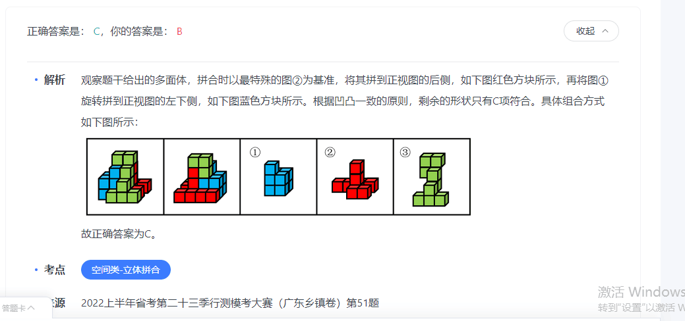
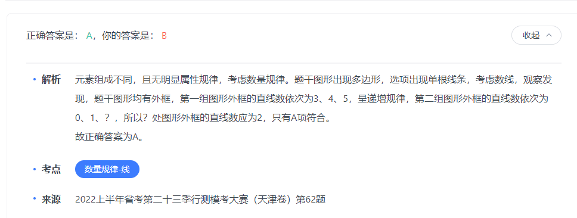
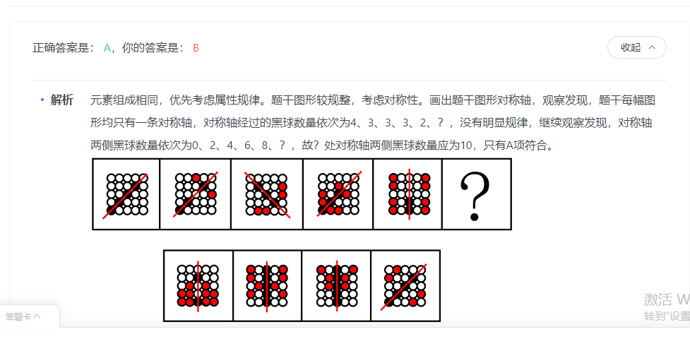
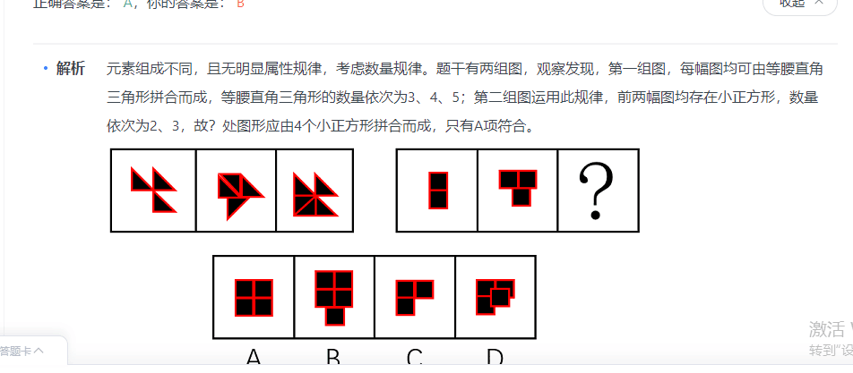

###  言语共35道

 #### 阅读理解(共14道，答对13道，正确率93%)
  1. 中心理解

  (1) 行文脉络-分总(共4道，答对3道，正确率75%)

  ```
    主要文章的层次。重点讲什么，此外的那种就不是重点。

  ```  
  1.1（其中，优化科研经费管理制度是为科研人员松绑、激发创新活力的托底保障，但相关政策仍存在落实不到位的问题。科研经费的管理如果不能适应科研创新的特点，注意：这里转折前对应的是B选项。但是转折后可以笼统归纳为C）
  ```
    让科研人员轻装上阵，心无旁骛地开展科研攻关，是推进我国科技自立自强的必要选择。其中，优化科研经费管理制度是为科研人员松绑、激发创新活力的托底保障，但相关政策仍存在落实不到位的问题。科研经费的管理如果不能适应科研创新的特点，采用更灵活的管理模式，而仅仅沿用一般性公务活动经费管理制度，就很容易增加科研人员的负担，增加科研活动的成本，甚至出现正常科研活动搞“歪门邪道”的现象。在现实生活中，因为过于僵化和繁琐的科研经费管理制度，有些科研人员甚至不得不“逾越”制度，“找票据”成为没有办法的办法。

    这段文字意在说明：

    A

    公务经费管理制度不适用于科研领域

    B

    需优化科研经费管理制度为科研松绑

    C

    科研经费管理制度需灵活化、创新化

    D

    科研经费报销乱象产生的原因及影响


    正确答案是： C，你的答案是： B收起
    解析
    文段首句指出要让科研人员轻装上阵，心无旁骛地开展科研攻关，随后强调了优化科研经费管理制度的重要性，并通过“但”指出我国科研经费管理方面存在政策落实不到位的问题。接下来指出科研经费管理如果不能“适应科研创新的特点，采用更灵活的管理模式”，就会导致不良后果，并举例说明。故文段通过反面论证，指出科研经费管理需要“适应科研创新的特点，采用更灵活的管理模式”，对应C项。

    A项，文段指出“公务活动经费管理制度”不好，意在强调科研经费管理需“采用更灵活的管理模式”，“公务经费管理制度”非重点，排除；

    B项，“优化科研经费管理制度”对应转折之前的内容，非重点，排除；

    D项，文段强调的是“科研经费管理”，“科研经费报销”非重点，排除。

    故正确答案为C。

  ```
  1.2（B项，仅对应“专业性的阅读”，表述片面，排除；）

  ```
    
    当进行非专业性的阅读时，我们的目的是获取信息，因此往往需要采用更方便、更有效率的阅读方式，此时电子阅读便愈发重要了。大量的信息内容依靠电子媒介得以更快速地传播，使我们获取相关的信息更加容易。当进行专业性的阅读时，我们一定会采用与之相匹配的阅读方式进行，此时纸质阅读的效果应该是优于电子阅读的。然而，科技发展中形成了以用户需求为导向的服务理念，使得负载内容的电子介质更加友好，只要用户养成专业的阅读习惯，电子读物在服务专业化阅读需求方面，甚至优于纸质读物。

    这段文字意在说明：

    A

    应结合阅读需求选择恰当的阅读方式

    B

    电子阅读更能满足专业化的阅读需求

    C

    改变阅读习惯是提高阅读品质的关键

    D

    电子阅读功能强大、应用前景可观


    正确答案是： D，你的答案是： B收起
    解析
    “当进行非专业性的阅读时”“当进行专业性的阅读时”为相似句式，引导并列结构。文段先介绍了当进行非专业性的阅读时，电子阅读愈发重要，并详细阐述了电子阅读的好处。随后分析当进行专业性的阅读时，纸质阅读的效果应该优于电子阅读，接着通过转折关系强调电子阅读在服务专业化阅读需求方面优于纸质阅读。故文段分为两部分阐述了电子阅读的好处，D项是对文段的概括，当选。

    A项，文段两部分均论述了电子阅读的好处，缺乏文段主题词“电子阅读”，排除；

    B项，仅对应“专业性的阅读”，表述片面，排除；

    C项，文段仅在“专业性的阅读”部分提到了“阅读习惯”，表述片面，排除。

    故正确答案为D。
  ```
  1.3（错因：文中应该是提出问题，然后提出对策。对策最后落脚点是保护消费者权益，而不是选择更加稳健的发展模式。）

  ```
    近年来，消费信贷搭上金融科技的快车加速发展，为消费者提供种类繁多的新型信贷产品，在提升人们生活品质的同时，也缓解了即期付款的压力。然而，一些消费信贷机构降低准入门槛，用一些小优惠吸引年轻消费者使用信贷产品，一旦消费者想退出产品，就设置种种障碍。还有一些机构在消费场景中诱导、刺激超前消费，没有提醒年轻消费者应当承担的还款义务。这些行为短期内或许能“激活”市场，但从长远看是在透支行业自身的发展前景，侵蚀行业根基，损害消费者权益。

    这段文字意在说明：

    A

    消费信贷机构应立足长远选择更加稳健的发展模式

    B

    金融平台应积极倡导消费者适度借贷理性消费的理念

    C

    消费信贷机构应主动承担金融消费者权益保护的责任

    D

    年轻消费者应树立合理的信贷消费观做到理性借贷


    正确答案是： C，你的答案是： A收起
    解析
    文段开篇提出问题，讲述当前存在消费信贷机构吸引年轻消费者使用信贷产品或诱导、刺激年轻消费者超前消费的行为，然后以指代词“这”总结前文，分析这些行为会给行业本身和消费者造成负面影响，整个文段为提出问题+分析问题的结构，文段重在强调对策，对应C项。

    A项，“稳健的发展模式”文段并未提及，无中生有，排除；

    B项，未包含文段的主题词“消费信贷机构”，偏离文段中心，排除；

    D项，对策不具有针对性，文段谈论的问题是消费信贷机构诱导、刺激年轻消费群体使用信贷产品超前消费，而非年轻消费者没有理性借贷，排除。

    故正确答案为C。

  ```
  1.4（错因：文中强调的是成人的作用，而不是联动。并且成人包括，家长和老师）
  ```
    儿童哲学教育，不是一般意义上的哲学知识，更多的是儿童思考问题的方式、行为处事的态度以及在认识世界过程中形成的情感，成人角色在此过程中的作用显而易见。美国教育家布鲁纳曾说“教师不仅是知识的传播者，而且是模范”，儿童哲学课程要求教师能在课堂中完成引导对话、参与探究的基本职责，教师的哲学素养至关重要。虽然于20世纪90年代就已经传入中国大陆，但是目前国内缺乏专门的儿童哲学师资，教研力量薄弱。从对幼儿园开设儿童哲学课程的热议中不难看出，大多数家长对儿童哲学一知半解，简单的将其等同于哲学知识传授，对儿童哲学课程抱有疑惑的态度。凡此种种，皆不利于儿童哲学教育的普及与后续发展。

    这段文字意在强调：

    A

    成人的尊重理解对儿童教育愿景达成意义重大

    B

    推动儿童哲学教育进步有赖于家庭与学校联动

    C

    儿童哲学课程的本土化发展面临诸多现实掣肘

    D

    儿童哲学教育效果的实现关键在于教师和家长


    正确答案是： D，你的答案是： A收起
    解析
    文段开篇论述在儿童哲学教育中，成人的作用显而易见，然后通过美国教育家布鲁纳的话说明教师的哲学素养至关重要，接着通过“但是”强调目前国内缺乏专门的儿童哲学师资，教研力量薄弱，然后指出大多数家长对儿童哲学一知半解也是影响儿童哲学教育发展的问题，最后通过“凡此种种”说明以上两个问题“皆不利于儿童哲学教育的普及与后续发展”，故文段的重点即在强调师资的缺乏和家长的态度影响了儿童哲学教育在中国的发展，对应D项。

    A项，“儿童教育”范围扩大，文段论述的是“儿童哲学教育”，排除；

    B项，文段重在强调“成人”的作用，而非“家庭与学校”，表述错误，排除；

    C项，“面临诸多现实掣肘”为问题表述，非重点，排除。

    故正确答案为D。
  ```
  1.5(错因：偏离了主题词。非遗剪纸i)
  ```
    近年来，在剪纸非遗界，刮起一股“创新现代剪刻纸”之风，脱离中国传统民间剪纸基因，推销“去民间化”的所谓专业“西洋化”等创作理念，造成了剪纸非遗界在传承与创新关系等理念上的混乱。非遗剪纸的传承，应强调“原汁原味”地传承，而不是创作。这种整体性的传承是守正的真正含义。对于非遗剪纸来说，传承要守的“正”是什么？它不是泛指一般的艺术创作规律，而是非遗传承的规律。传承要“传”的是什么？有人认为，传承就是把自己的手艺教给徒弟。但这种认识过于片面。也就是说，这种“原汁原味”传承，不仅是技艺，更多的是一种艺术精神，将这种精神“不走样”地复原并传下去。

    这段文字主要强调的是：

    A

    “原汁原味”是传承中不能丢弃的灵魂

    B

    技法中深藏的艺术精神是非遗传承的生命

    C

    “守正”是非遗进行传承与创新的底线

    D

    如何将非遗剪纸“不变味”地传承下去


    正确答案是： D，你的答案是： A收起
    解析
    文段开篇介绍了在剪纸非遗界刮起一股“创新现代剪刻纸”之风，并指出这种风气造成了剪纸非遗界在传承与创新关系等理念上的混乱，接着指出非遗剪纸的传承应强调“原汁原味”地传承，并指出这种传承就是守正的真正含义，接着对守的“正”进行了解释，然后指出将自己的手艺教给徒弟的传承过于片面，尾句通过“也就是说”进行总结，并通过指代词“这种”引出文段的重点，即“原汁原味”传承更多的是将艺术精神“不走样”地复原并传下去，对应D项。

    A、B、C三项均缺少文段核心话题“非遗剪纸”，排除。

    故正确答案为D。
  ```
  2. 细节判断
  1.3（注意细节判断题，不是要你选中心题目。要找出是不是不对的。已初步建成、并正在逐步完善国家温室气体观测网络。A不是完备的。c项不是卫星遥控技术，但卫星成像监测也受到轨道、天气等诸多因素的影响，无法实现连续动态观测。d项，碳源汇文中没提到。）
  ```
    尽管下一代碳卫星比第一颗碳卫星有巨大的飞跃和进步，但卫星成像监测也受到轨道、天气等诸多因素的影响，无法实现连续动态观测且分辨率不高，仅凭卫星遥感难以取得满意效果。因此，必须结合地基监测、航空遥感等多源数据，才能实现点源、城市、国别尺度的温室气体排放的精确估算。目前，生态环境部、中国气象局、中国科学院等机构正在组织和实施大范围地基温室气体观测任务，已初步建成、并正在逐步完善国家温室气体观测网络，温室气体卫星星座与地基网络的协同，为中国碳达峰、碳中和行动成效的科学评估与碳排放核算提供了重大机遇。

    根据上述文段，下列说法正确的是：

    A

    完备的气体观测网络将助力我国实现碳中和

    B

    温室气体排放的精确估算需要结合多源数据

    C

    卫星遥控技术因天气影响无法实现连续观测

    D

    航空遥感技术为碳源汇的评价提供重要数据


    正确答案是： B，你的答案是： A收起
    解析
    A项，根据文段“已初步建成、并正在逐步完善国家温室气体观测网络”可知，“完备”表述有误，且“气体观测网络”范围扩大，排除；

    B项，根据文段“必须结合地基监测、航空遥感等多源数据，才能实现点源、城市、国别尺度的温室气体排放的精确估算”可知，表述正确，当选；

    C项，根据文段“但卫星成像监测也受到轨道、天气等诸多因素的影响”可知，“卫星遥控技术”偷换概念，排除；

    D项，文段并未提及“对碳源汇的评价”，无中生有，排除。

    故正确答案为B。

  ```
  3. 标题填入

  3.1（1. 错因：垃圾网只是一方面，后文还有也能解决另外的方面。所以C更合适。）

  ```

  ```

 #### 语句表达(共5道，答对3道，正确率60%)
  1. 语句排序
  1.1(错因：也这个关联词。43，比13更合适、③句包含关联词“也”，介绍了教育元宇宙的应用情况，故前文也应该介绍元宇宙的其他领域应用，比较①句和④句，①句介绍元宇宙的技术基础，并非应用情况，①③两句无法构成捆绑，排除B项。④句介绍元宇宙在多个领域的应用情况，与③句构成并列关系，④③两句可以构成捆绑，锁定A项。)
  ```
   ①这一数字技术是Web3.0时代的核心产物，其技术底座主要包括人工智能、数字孪生、区块链、云计算、拓展现实、机器人、脑机接口，以及5G网络等

    ②近来，“元宇宙”成为热门话题，频繁地出现在人们的视野中，技术界关于“元宇宙”的定义很多，且在不断完善丰富

    ③毫无疑问，教育也在元宇宙产业生态的版图中，作为元宇宙技术与学生教育的融合形态，教育元宇宙更侧重寓教于乐式的学习

    ④目前，元宇宙已经开始被应用于多个领域，并衍生出政务元宇宙、体育元宇宙、影院元宇宙、游戏元宇宙等产业生态

    ⑤但总的来说，元宇宙的本质是虚拟和现实相融合的“第三时空”

    将以上5个句子重新排序，语序正确的一项是：

    A

    ②⑤①④③

    B

    ②①③④⑤

    C

    ④②③⑤①

    D

    ④⑤②①③


    正确答案是： A，你的答案是： B收起
    解析
    对比选项，确定首句，②句引出“元宇宙”的话题并指出其定义很多，④句介绍元宇宙在多个领域的应用情况，应先引出话题再具体论述应用情况，故②句更适合作首句，排除C、D两项。

    比较A、B两项，③句包含关联词“也”，介绍了教育元宇宙的应用情况，故前文也应该介绍元宇宙的其他领域应用，比较①句和④句，①句介绍元宇宙的技术基础，并非应用情况，①③两句无法构成捆绑，排除B项。④句介绍元宇宙在多个领域的应用情况，与③句构成并列关系，④③两句可以构成捆绑，锁定A项。

    故正确答案为A。
  ```
  1.2(错因：捆绑2,3.这种。 并且时间顺序先有远古时代，再有殷商)
  ```
    
    ①殷商时期，随着青铜冶炼技术的提高，青铜针开始作为针灸工具被广泛使用

    ②这种被称为砭石的石器是目前有考古实证的最早的针灸工具

    ③针灸的发展始终与当时所处时代的科技紧密结合

    ④针灸的起源可追溯至新石器时代，中国考古工作者曾发现一种由特殊石头做成的工具，可以消减病痛、按摩排毒

    ⑤原始社会主要采用砭石、竹针等针灸工具治疗病痛

    ⑥针灸是中华民族在几千年医疗、生活生产实践中产生的传统医学方法

    将以上6个句子重新排列，语序正确的一项是：

    A

    ⑥④②③⑤①

    B

    ③④①②⑥⑤

    C

    ⑥⑤②④①③

    D

    ③①⑤④②⑥


    正确答案是： A，你的答案是： C收起
    解析
    对比选项，确定首句。③句指出针灸的发展与当时所处时代的科技是紧密结合的，⑥句指出针灸是中华民族在几千年实践中产生的传统医学方法，均可作首句，无法排除。

    观察发现，②句出现指代词“这种”并指出目前有考古实证的最早的针灸工具是石器，故②句前应介绍由石头做成的针灸工具，观察可知，④句介绍了中国考古工作者曾发现一种由特殊石头做成的针灸工具，故④②两句可构成指代词捆绑，排除B、C两项。

    继续寻找解题线索，①句介绍了殷商时期，青铜针开始作为针灸工具被广泛使用，⑤句介绍的是原始社会的针灸工具，按照时间顺序，应先介绍原始社会的情况，再介绍殷商时期的情况，故⑤句应在①句前，排除D项。

    故正确答案为A。
  ```

  2. 语句填空
  (1) 结尾(共2道，答对1道，正确率50%)

  ```


  ```
  3. 接语选择(共1道，答对0道，正确率0%)

  3.1（1. 主题词对了，破壁。但是话题错了。全文都是围绕着青年。）
  ```
    
    从网络受众的角度看，“圈层”指人们信息的接受、文娱产品的选择以及社交，在某一相对固定的群体范围内进行。青年文化圈层化，主要表现在根据人生经历、教育背景、兴趣爱好等多方面的共同取向，用户被划定为若干个群组，并由此形成对特定信源的偏好，这无形中为面向青年人的理论传播造成了极大障碍。一方面，年轻人对“个性化”的追求加固了圈层的壁垒，另一方面，各种移动端应用借助所谓“算法”精准推送，又进一步强化了这一趋势。因为圈层化而造成传播学上的“信息茧房”效应，使得圈层内部与文化整体相隔膜，缺乏对社会整体的认知，大众化理论传播于是遭遇了接受障碍。

    这段文字接下来最可能讲的是：

    A

    如何打破不同文化“圈层”的信息壁垒

    B

    面向青年的理论传播存在哪些现实难题

    C

    我国规范“算法”精准推送的相关举措

    D

    针对青年人的理论传播何以“破壁出圈”


    正确答案是： D，你的答案是： A收起
    解析
    文段先引出“圈层”的概念，随后阐述了青年文化圈层化的表现，并指出青年文化圈层化阻碍了面向青年人的理论传播。接下来通过“一方面······另一方面”详细解释造成青年文化圈层愈加强化的原因，最后强调了圈层化导致的“信息茧房”效应会使圈层内部缺乏对社会的整体认知，难以接受到大众化理论传播。故文段重在提出问题，D项针对问题给出对策，与文段衔接紧密，当选。

    A项，文段提出的问题是“面向青年人的理论传播”面临障碍，而非强调不同圈层之间存在信息壁垒，排除；

    B项，文段已详细阐述了面向青年人的理论传播面临什么障碍，后文无需赘述，排除；

    C项，文段重点论述“面向青年人的理论传播”，而非“规范‘算法’精准推送”，话题不一致，排除。

    故正确答案为D。
  ```
  3.2(A错因为原文：我们沉浸在文学的“风景”中，并从中窥见时代、生活和人性的缤纷投影，体会一个时代现实的风云际会。A项只讲了时代。片面。)

  ```
  ```
 #### 逻辑填空(共16道，答对10道，正确率63%)
  1. 实词填空(共8道，答对4道，正确率50%)
  1.1（1. 错因：注解只能做为名词，不能当做动词。是用文字来解释字句；泛指解释；解释字句的文字；神鬼名。民间传说指阴司第一阎王殿中职掌解送鬼魂并令其注册者。2.勾勒只是描绘的意思。而打通脉络，是打开隔断，而文中没有隔断的意思。）
  ```

      4月16日，依托陕西省考古研究院建成的集“科学发掘——保护利用——展示阐释”三位一体的陕西考古博物馆建成并完成布展，将文物与出土背景结合、以考古的视角        遗址，讲述属于考古和考古人自己的故事。陕西考古博物馆通过一件件文物、一个个遗址，        中国考古和陕西考古的发展脉络，展示中华文明多元一体、相融并蓄的总体特征，使考古知识不再典藏在象牙塔中。

      依次填入画横线部分最恰当的一项是：

      A

      注解 梳理

      B

      解读 勾勒

      C

      诠释 打通

      D

      演绎 明晰


      正确答案是： B，你的答案是： A收起
      解析
      第一空，根据“讲述属于考古和考古人自己的故事”可知，以考古的视角来分析遗址，并进行解说，故横线处所填词语应体现理解、分析之意，B项“解读”指对事物进行理解的过程，C项“诠释”指解说、解释、阐明，均符合文意，保留。A项“注解”指解释字句的文字，置于此处用法不当，排除；D项“演绎”指铺陈、表现，与文意不符，排除。

      第二空，搭配“脉络”，B项“勾勒”形容用线条描画出轮廓，置于此处表示描画出中国考古和陕西考古的发展脉络，符合文意，当选。C项“打通”指除去阻隔使相贯穿通连，文段并未表示中国考古和陕西考古之间有阻隔，与文意不符，排除。

      故正确答案为B。
  ```
  1.2（1. 错因：搭配“利益”，文意横线处的感情色彩偏消极。牟取：非法获取利益。谋取：中性词。撷取：指的是采取精华。语出宋·陆游《东篱记》放翁日婆娑其间,掇其香以嗅,撷其颖以玩。 2. 买椟还珠”比喻没有眼力，取舍不当。3.大浪淘沙”比喻在激烈的斗争中经受考验、筛选，与“市场”搭配恰当 ）

  ```
    国内临期食品行业有基础，但也有一定乱象和风险，一些商超平台和商家，对于临期食品的商品标注、保质信息等缺乏明确提示，还有将临期食品与正期食品混放混卖，企图            ，        利益。针对市场乱象，入局者当有清醒认识。临期食品这一新的业态，需要市场优胜劣汰、            ，无论是行业自身，还是市场监管都应促进行业规范，方能实现互赢。

      依次填入画横线部分最恰当的一项是：

      A

      滥竽充数 谋取 去粗取精

      B

      鱼目混珠 撷取 物竞天择

      C

      浑水摸鱼 牟取 大浪淘沙

      D

      买椟还珠 攫取 适者生存


      正确答案是： C，你的答案是： A收起
      解析
      第一空，根据“一些商超平台和商家······将临期食品与正期食品混放混卖”，可知横线处应体现一些商超平台和商家企图通过临期食品与正期食品混放混卖捞取利益之意。A项“滥竽充数”比喻拿次的东西混在好的里面充数，B项“鱼目混珠”形容以假乱真、以次充好，C项“浑水摸鱼”比喻趁混乱时机获取不正当的利益，均符合文意，保留。D项“买椟还珠”比喻没有眼力，取舍不当，与文意无关，排除。

      第二空，搭配“利益”，根据文意可知，横线处的感情色彩偏消极。C项“牟取”指赚取非法的利益，感情色彩偏消极，与文段感情色彩相符，保留。A项“谋取”指设法取得，是中性词，B项“撷取”指采择精华，感情色彩偏积极，均与文段感情色彩不符，排除。

      第三空，代入验证，搭配“市场”，C项“大浪淘沙”比喻在激烈的斗争中经受考验、筛选，与“市场”搭配恰当，当选。

      故正确答案为C。
  ```
  2. 成语填空((共5道，答对4道，正确率80%))
  
  2.1(1. 错在未雨绸缪好过__ , 此处应该填写未雨绸缪的反义词的意思。事前没有做好准备 2. 不明白选项的意思。有些成语你没背过，但是也应该可以猜测一下。3. 第二个空应该填防范的意思。曲突徙薪:《汉书·霍光传》记载：有一家人家炉灶的出烟口是直的，旁边还堆积着很多柴草。有人劝主人把出烟口改弯，把柴草搬走，以免引起火灾。主人不听，不久，家中果然失火（突：出烟口）。后来用「曲突徙薪」比喻事先做好防范工作，避免灾祸发生。江心补漏:船驶到江水中央才修补漏洞。比喻错过时机，事情已无法补救。临渴掘井”比喻不早些准备，事情就要发生了才想办法)

  ```
    缺乏风险意识和底线思维、城市建设“重面子、轻里子”、预警与响应联动机制不健全等教训和问题短板，需要高度重视、自警自省。未雨绸缪好过            ，防范危机好过应对危机。时刻绷紧防灾减灾这根弦，才能        重大风险，切实保障好人民群众生命财产安全。

        依次填入画横线部分最恰当的一项是：

        A

        曲突徙薪 抵御

        B

        临渴掘井 防范

        C

        江心补漏 化解

        D

        事后诸葛 预判


        正确答案是： B，你的答案是： D收起
        解析
        第一空，根据“防范危机好过应对危机”可知，横线处所填成语应与“未雨绸缪”构成对应关系，且与“未雨绸缪”意思相反，表达事情发生后才开始补救的意思。B项“临渴掘井”比喻不早些准备，事情就要发生了才想办法，符合文意，保留；C项“江心补漏”比喻补救已迟，无法挽回差错或败局，符合文意，保留。A项“曲突徙薪”比喻事先采取预防措施，以免发生灾祸，不符合文意，排除；D项“事后诸葛”指事后自称有先见之明的人，不符合文意，排除。

        第二空，根据“防范危机好过应对危机”可知，文段强调的是对重大风险进行预防。B项“防范”符合文意，当选。C项“化解”指消除，解除，不符合文意，排除。

        故正确答案为B。
  ```

  2.2(1. 错因：不明白披霜冒露：指的是日夜星辰赶路。并且前仆后继和筚路蓝缕都可以形容，人的奋斗精神。皓首穷经：形容勤勉好学，活到老学到老。并且第二个空，通过后文可知是动力作用。所以填引擎比基石好)

  ```
    中国作为世界文明古国，很早就有学者进行古代遗迹的考察和古代遗物的研究，20世纪20年代，仰韶村、周口店、殷墟等遗址的发掘，标志着中国考古学的诞生。此后的百年间，几代人            ，如今业已形成具有自己特色的现代学科体系。理论是学科发展的        ，理论的完善与创新可有效带动、推动学科的进步。

      依次填入画横线部分最恰当的一项是：

      A

      披霜冒露 源泉

      B

      前仆后继 基石

      C

      筚路蓝缕 引擎

      D

      皓首穷经 动力


      正确答案是： C，你的答案是： A收起
      解析
      第一空，根据文意可知，横线处所填成语体现出几代人为考古工作付出了艰辛努力。B项“前仆后继”指前边的倒下了后边的紧跟上来，形容英勇奋战，C项“筚路蓝缕”指驾着柴车，穿着破衣去开辟山林，形容创业的艰辛，均符合文意，保留。A项“披霜冒露”形容星夜兼程赶路，D项“皓首穷经”形容勤勉好学，活到老学到老，均与文意无关，排除。

      第二空，根据后文“理论的完善与创新可有效带动、推动学科的进步”可知，文段重在强调理论是学科发展的动力，对学科发展有促进作用。C项“引擎”泛指动力源泉，符合文意，当选。B项“基石”比喻基础或中坚力量，不符合文意，排除。

  故正确答案为C。

  ```

  2.3（1. 错在不知道蹑足其间：参与其中（【出处】《史记·秦始皇本纪》：“非有仲尼墨翟之贤，陶朱猗顿之富，蹑足行伍之间而崛起阡陌之中。）救经引足：搶救上吊的人，卻去拉他的腳。比喻所做的事與目的背道而馳。）
  ```
  作为一个知识的基础设施与公益平台，知网设置的初衷应该也必须体现出一定的公益属性，但            ，目前，知网的牟利冲动，在某种程度上，正在使其由原本便利学术发展的“垫脚石”角色，转向阻碍学术发展的“绊脚石”角色。在技术日益发达的今天，知识的共享成本不断降低，作为知识中介的知网却不断提高收费价格，结果导致中科院这样的顶尖学术科研机构都要            ，无异于开时代倒车。

    依次填入画横线部分最恰当的一项是：

    A

    适得其反 退避三舍

    B

    救经引足 望而却步

    C

    事与愿违 蹑足其间

    D

    矫枉过正 敬而远之


    正确答案是： B，你的答案是： C收起
    解析
    第一空，根据“作为一个知识的基础设施与公益平台，知网设置的初衷应该也必须体现出一定的公益属性”“目前，知网的牟利冲动，在某种程度上，正在使其由原本便利学术发展的‘垫脚石’角色，转向阻碍学术发展的‘绊脚石’角色”可知，横线处所填成语表达实际结果与期待中相反的意思。A项“适得其反”指恰恰得到与愿望相反的结果，B项“救经引足”比喻做的事与愿望相违背，C项“事与愿违”指事情的发展结局与主观愿望相违背，形容事情不能称心如意，均符合文意，保留。D项“矫枉过正”比喻纠正错误超过了应有的限度，文段论述的不是纠错话题，排除。

    第二空，根据“知网却不断提高收费价格”可知，横线处所填成语表达中科院作为知网的用户面对知网的高收费而不敢再使用，B项“望而却步”指看到了可怕的或力不能及的事而往后退缩，可以表达在知网的高收费面前不敢再继续使用的态度，当选。A项“退避三舍”比喻退让和回避，避免冲突，中科院和知网不存在竞争关系，无需退让和回避，排除；C项“蹑足其间”比喻参加进去，与文意相悖，排除。

    故正确答案为B。
  ```
  2.4(1.横线处强调反腐重点在于从小处入手，见微知著和防微杜都行。但是，惩前毖后”指批判以前所犯的错误，吸取教训，防止以后再次发生。以儆效尤”指处理一件错事、坏事来警告那些还有此项行为的人、 均与文意无关 2. 小行为不仅要放在心上，还要极为重视，不可“等闲视之”比不可“不以为意”词义更重)
  ```

  ```

  3. 混搭填空((共3道，答对2道，正确率67%))
  4. 词的辨析(共8道，答对4道，正确率50%)
  (1)词义侧重(共2道，答对1道，正确率50%)
  1.1(1. 探寻，探究都可以搭配渊源。但是“探绎”指探索演绎，D项“探察”指寻求察访，均与“渊源”搭配不当)

  ```
    有观点认为，人类尚未产生语言的蒙昧时期，音乐就已经        了，贾湖骨笛的发现，使我国音乐历史可追溯至距今八千七百年前，奉节石哨的出土，又可能会把人类原始音乐活动的历史向前推至14万年以前。中国音乐史古老而丰富，从古籍中        音乐与劳动的渊源，        中国音乐的历史，品味华夏文明灿烂的文化韵律，对于认知劳动在人类文明演进中的价值意义重大。

    依次填入画横线部分最恰当的一项是：

    A

    肇始 探究 弘扬

    B

    发轫 探绎 认识

    C

    萌芽 探寻 管窥

    D

    滥觞 探察 通晓


    正确答案是： C，你的答案是： D收起
    解析
    本题从第二空入手，搭配“渊源”，A项“探究”表示探索研究，C项“探寻”指探求、寻找，均可搭配“渊源”，保留。B项“探绎”指探索演绎，D项“探察”指寻求察访，均与“渊源”搭配不当，排除。

    第三空，根据文意可知，横线所在句子应体现从古籍中寻找音乐与劳动的渊源，从而发现中国音乐的历史，C项“管窥”指通过竹管子的孔看天，比喻从观察到的部分，可以推测到全貌，与文段中“音乐与劳动的渊源”和“音乐的历史”的部分和整体关系对应准确，符合语境，保留。A项“弘扬”指发扬光大，与文意不符，排除。

    第一空，代入验证，C项“萌芽”比喻事物刚发生，置于此处可表示人类尚未产生语言的蒙昧时期，音乐就已经开始出现了，符合文意，当选。

    故正确答案为C。
  ```

   
  (2)固定搭配(共6道，答对3道，正确率50%)
  2.1（1. 消弭一般用于清除不好的事物，如“消弭风险”“消弭隐患”等，与“责任意识”搭配不当，排除 2. 第二个空根据语境排除，需要找并列，跟平面化差不多的意思的词语：“狭隘化”指不宽阔，范围小，符合文意，当选。B项“边缘化”指向人或事物发展主流的反方向移动、变化，与文意不符）

  ```
    近年来，人文社会科学领域出现的一些泡沫化、市场化学术研究的趋利行为，正在        人文学者的学术责任意识。现代文学经典研究要努力超越学科          、思想平面化，以当代学者的人文关怀回应当代社会改革发展与思想文明建设的需要。

    依次填入画横线部分最恰当的一项是：

    A

    消弭 片面化

    B

    弱化 边缘化

    C

    淡化 狭隘化

    D

    消遁 单一化


    正确答案是： C，你的答案是： A收起
    解析
    第一空，搭配“责任意识”，B项“弱化”意思是使变弱，C项“淡化”指减轻或者减弱，均与“责任意识”搭配恰当，保留。A项“消弭”指清除不好的事物，如“消弭风险”“消弭隐患”等，与“责任意识”搭配不当，排除；D项“消遁”指消失逃跑，与“责任意识”搭配不当，排除。

    第二空，由顿号可知，横线处词语与“平面化”构成并列，“思想平面化”表示思想不够深入，C项“狭隘化”指不宽阔，范围小，符合文意，当选。B项“边缘化”指向人或事物发展主流的反方向移动、变化，与文意不符，排除。

    故正确答案为C。

  ```
  (3)感情色彩(共2道，答对1道，正确率50%)
 
  5. 语境分析
  (1)对应关系：解释类对应(共4道，答对1道，正确25%)

  ```
    1. 对应关系-解释类对应:找到重点句子的对

    2. 有时候要结合当句的语境，有因果关系的用内生。
  ```
  (2)对应关系：重点词语对应(共7道，答对5道，正确率71%)

  5.1（1.错因：没有结合文中最后一句话语境：就像两双锐利的眼睛，一刻不停地紧盯火箭的飞行。所以第一个空应该填眼睛有关的词语。凝望，窥探，注视都可以。但是探测不行。 2. 即刻的意思，可以选，及时，实时，但是适时不行。3. 第三个空精确比精细更好。精细形容细致。）
  ```

  在长征五号B遥二运载火箭发射升空期间，两部固定式脉冲测量雷达一直        火箭的轨迹。该雷达能为指控中心        提供火箭距离、方位、俯仰等        坐标信息和径向速度数据，一旦飞行出现偏移轨道的状况，即刻就能发现，就像两双锐利的眼睛，一刻不停地紧盯火箭的飞行。

    依次填入画横线部分最恰当的一项是：

    A

    凝望 即时 精细

    B

    窥探 适时 精准

    C

    注视 实时 精确

    D

    探测 及时 准确


    正确答案是： C，你的答案是： D收起
    解析
    第一空，根据“就像两双锐利的眼睛，一刻不停地紧盯火箭的飞行”可知，横线处词语应体现眼睛的功能。A项“凝望”、C项“注视”均可体现眼睛的功能，保留。B项“窥探”指暗中察看，与文意无关，排除；D项“探测”无法对应文段中的形象化表达，排除。

    第二空，根据“即刻就能发现”可知，横线处词语应体现即时性。A项“即时”、C项“实时”均符合文意，保留。

    第三空，搭配“坐标信息”和“速度数据”。C项“精确”强调误差小，常搭配数据，“坐标信息”和“速度数据”均为数据，搭配恰当，当选。A项“精细”指精密细致，与“速度数据”搭配不当，排除。

    故正确答案为C。
  ```
  5.2（1.错因：没有结合文中最后一句话语境：反思现代性的标志是去传统化,后面的空填的应该是使消失，消退。A项“退却”指畏难后退，文段并未体现“畏难后退”之意，排除；C项“让步”指在争执中部分地或全部地放弃自己的意见和利益，文段并未体现“放弃意见和利益”之意，排除。）

  ```
    历史是        的，文化传统已经渗透到我们的衣食住行。现代性并不是        地否定传统，而是对传统进行重写、重构。反思现代性的标志是去传统化，但这不意味着传统信仰和实践要从社会中        。换句话说，传统与现代，二者并不是截然对立的。

    依次填入画横线部分最恰当的一项是：

    A

    延续 盲目 退却

    B

    连续 简单 消失

    C

    前进 机械 让步

    D

    现实 彻底 消退


    正确答案是： B，你的答案是： A收起
    解析
    本题可从第三空入手，根据横线前转折词“但”可知，横线前后语义呈转折关系，前文表示“去传统化”，后文应表示“传统信仰和实践”不会消失之意，B项“消失”、D项“消退”均符合文意，保留。A项“退却”指畏难后退，文段并未体现“畏难后退”之意，排除；C项“让步”指在争执中部分地或全部地放弃自己的意见和利益，文段并未体现“放弃意见和利益”之意，排除。

    第二空，根据“不是······而是”可知，横线前后呈反义并列关系，横线处所填词语与“重写、重构”对应，B项“简单”程度较轻，符合文意，保留。D项“彻底”形容深透、完全而无所遗留，与“重写、重构”程度相似，与文意不符，排除。

    第一空，代入验证，历史是“连续”的，强调文化传统对当下的影响，B项符合文意，当选。

    故正确答案为B。
  ```

###  判断共35道，答对22道，正确率63%，用时53分钟

  #### 图形推理（共5道，答对3道，正确率60%，用时16分钟）！！！！
  1. 位置规律

  1.1(九宫格平移，可能不是某个元素平移。也可能是所有黑色元素平移。)

  

    2. 属性规律
    2.1（考复合考点，属性对称属性。但是又考了黑点的个数。成0,2,4,6,8规律）

     
     
    3. 数量规律（共2道，答对1道，正确率50%，用时10分钟）
      （1） 点
      1.1（明显端点和相切，数一笔画，1，4,6都是一笔画）
      
      （2） 线 （共1道，答对0道，正确率0%，用时5分钟）
       2.1（数量的规律，数外边框的直线数，成递增趋势。）
      
      
      (3) 面（）
      3.1（数量规律：左边直角三角形数量：3,4,5 右边正方形的数量：2,3,4）
      
      
      3.2（视图：只有主视图，俯视图，左视图）
      
    4. 空间类（共1道，答对0道，正确率0%，用时2分钟）
    4.1（找到特殊的图形作为基准，然后拿别的图形拼凑试试。）

    
    
  #### 定义判断（共10道，答对6道，正确率60%，用时14分钟）！！

  1. 单定义（共5道，答对4道，正确率90%，用时9分钟）
  （1） 主客体 
  （2） 大前提 （共1道，答对0道，正确率0%，）
  （3） 方式目的 
  （4） 原因结果 
  4.1（药效增强，我没考虑到。而不是药效减弱。）
  ```
    药物协同作用是指两种或两种以上药物同时应用（包括不同途径）所产生的效应，包括药效增强或不良反应减轻。

    根据上述定义，下列选项属于药物协同作用的是：

    A

    氨茶碱为茶碱与乙二胺复盐合成，适用于哮喘等疾病，可缓解喘息症状

    B

    多巴胺与硝酸酯类同用，可减弱硝酸酯的抗心绞痛及多巴胺的升压效应

    C

    去甲肾上腺素与全麻药如氯仿、环丙烷等同用，容易发生室性心律失常

    D

    磺胺类药物与抗菌增效剂合用，可使药物的抗菌作用增强数倍


    正确答案是： D，你的答案是： B收起
    解析
    第一步：找出定义关键词。

    “两种或两种以上药物”、“同时应用（包括不同途径）所产生的效应，包括药效增强或不良反应减轻”。

    第二步：逐一分析选项。

    A项：氨茶碱为茶碱与乙二胺复盐合成，给出了氨茶碱的原材料，主体只有一个，不符合“两种或两种以上药物”，不符合定义，排除；

    B项：多巴胺与硝酸酯类同用，可减弱硝酸酯的抗心绞痛及多巴胺的升压效应，说明同时应用之后的药效反而减轻了，不符合“同时应用（包括不同途径）所产生的效应，包括药效增强或不良反应减轻”，不符合定义，排除；

    C项：去甲肾上腺素与全麻药如氯仿、环丙烷等同用，容易发生室性心律失常，说明同时应用之后的不良反应增强了，不符合“同时应用（包括不同途径）所产生的效应，包括药效增强或不良反应减轻”，不符合定义，排除；

    D项：磺胺类药物与抗菌增效剂合用，可使药物的抗菌作用增强数倍，符合“两种或两种以上药物”、“同时应用（包括不同途径）所产生的效应，包括药效增强或不良反应减轻”，符合定义，当选。

    故正确答案为D。
  ```
  2. 多定义（共5道，答对2道，正确率40%，用时6分钟）
     
      （1） 常规问法 （共5道，答对2道，正确率40%，用时6分钟）

  #### 逻辑判断（共10道，答对7道，正确率70%，用时18分钟）！！！
   1. 加强题型（共4道，答对3道，正确率75%，用时7分钟）
    （1） 搭桥
    （2） 补充论据 （共2道，答对1道，正确率50%，）
     2.1(必要条件强度 大于 解释原因)

     ```
       
        每逢节日，人们的应酬也逐渐增多，其中免不了喝酒助兴。很多人认为醉酒后喝一杯热蜂蜜水可以解酒。

        为使上述论证成立，需补充的前提是：

        A

        热蜂蜜水之所以能解酒是因为含有果糖，果糖会加速血液对酒精的代谢速度，分解体内酒精

        B

        喝热蜂蜜水会提高体内的尿酸水平，进而诱发痛风

        C

        用热水冲调蜂蜜不会使蜂蜜中的解酒成分丧失活性

        D

        蜂蜜营养丰富，人们在醉酒后用温水进行冲泡饮用，以便更好地吸收养分


        正确答案是： C，你的答案是： A收起
        解析
        第一步：找出论点和论据。

        论点：醉酒后喝一杯热蜂蜜水可以解酒。

        论据：无。

        本题问“需补充的前提”，且没有论据，优先考虑必要条件。

        第二步：逐一分析选项。

        A项：指出喝热蜂蜜水能解酒的原因是热蜂蜜水含有果糖，从原理上解释了论点成立的原因，可以加强，保留；

        B项：指出喝热蜂蜜水会诱发痛风，与论点讨论的话题不一致，无法加强，排除；

        C项：指出用热水冲调蜂蜜不会使蜂蜜中的解酒成分丧失活性，这是论点成立的必要条件，可以加强，保留；

        D项：指出蜂蜜营养丰富，在醉酒后用温水进行冲泡饮用，以便更好地吸收养分，与论点讨论的话题不一致，无法加强，排除。

        比较A、C两项，A项是原因解释，C项是必要条件，在加强力度方面，必要条件>原因解释，C项当选。

        故正确答案为C。
     ```
  2. 削弱题型（共3道，答对1道，正确率33%，用时5分钟）
     
      （1） 削弱论点
        1.1（文章的主题词是火星。而不是地球上的碳12）

        ```
          长期以来，尽管人们制造的望远镜倍数越来越大，但是仍然不足以看清火星表面的细节。所以火星上是否存在生命，目前仍是科学家的难解之谜。但一项最新的研究显示，“好奇号”火星探测器在火星上探测到一些岩石，其碳中含有大量的轻碳同位素（碳-12），因此人们推测火星上是有生命的。

          以下哪项如果为真，最能质疑上述推断？

          A

          “好奇号”火星探测器探测到的样本中有四分之一，其碳-12的含量比地球的参考标准高70%

          B

          火星大气稀薄，这导致阳光中的紫外线会直接照射到土壤中，与大气中的二氧化碳结合从而形成碳-12

          C

          火星可能曾穿过含有碳的星际云，大气与尘云阻挡阳光，使火星上的降水冻结形成冰川，阻止碳被稀释

          D

          地球上的碳-12有多种来源，有的是有机体在新陈代谢过程中形成的，有的则是自然形成的


          正确答案是： B，你的答案是： D收起
          解析
          第一步：找到论点和论据。

          论点：火星上是有生命的。

          论据：“好奇号”火星探测器在火星上探测到一些岩石，其碳中含有大量的轻碳同位素（碳-12）。

          本题论点讨论的是火星上有生命，论据讨论的是火星上有大量的碳-12，话题不一致，削弱优先考虑拆桥。

          第二步：逐一分析选项。

          A项：选项说明部分火星样本中的碳-12含量比地球的参考标准高，但含量高是否意味着有生命并不明确，为不明确项，无法削弱，排除；

          B项：选项说明火星上的碳-12是由紫外线同二氧化碳结合形成的，因此无法通过碳-12证明火星上有生命，为拆桥项，可以削弱，当选；

          C项：选项说明火星可能曾穿过含有碳的星际云，因此火星上的碳可能来自星际云，但火星上的碳来自哪里与火星上是否有生命无关，为无关项，不能削弱，排除；

          D项：选项说的是地球上的碳-12有多种来源，与火星上是否有生命存在无关，为无关项，无法削弱，排除。

          故正确答案为B。
        ```
      （2） 拆桥 （共1道，答对0道，正确率0%）
      （3） 他因削弱 （共1道，答对0道，正确率0%）
       3.1(A项偏离主题词了。本文的话题是职场人士，而A却是校园年轻人。所以不符合。)
       ```
         
        社交媒体已成为我们生活中不可或缺的一部分。一项针对毕业后职场人士的研究显示，每天浏览社交媒体平台超过3小时的人，情绪低落的概率要比非职场人士高出60%，由此专家认为过多浏览社交媒体会使他们变得沮丧。

        以下选项如果为真，最能反驳上述观点的是：

        A

        刚步入大学校园的年轻人也会长时间浏览社交媒体，但他们并没有出现沮丧的情绪

        B

        偶尔在社交媒体上积极地与人沟通、交谈，有助于人们更好地放松自己的心情

        C

        调查中的这些职场人士还面临着巨大的工作压力

        D

        有调查显示，在心情愉悦时浏览社交媒体确实会影响人们的情绪


        正确答案是： C，你的答案是： A收起
        解析
        第一步：找到论点和论据。

        论点：过多浏览社交媒体会使毕业后的职场人士变得沮丧。

        论据：一项针对毕业后职场人士的研究显示，每天浏览社交媒体平台超过3小时的人，情绪低落的概率要比非职场人士高出60%。

        论点论据都是讨论过多浏览社交媒体会使毕业后的职场人士变得沮丧，话题一致，并且论点中包含因果关系，除了削弱论点，还可以用因果倒置或他因削弱的方式进行削弱。

        第二步：逐一分析选项。

        A项：选项讨论的是刚步入大学校园的年轻人，而论点讨论的是毕业后的职场人士，主体不一致，无法削弱，排除；

        B项：选项说明偶尔在社交媒体上积极地与人沟通、交谈会让人心情放松，而论点讨论的是过多浏览社交媒体会使毕业后的职场人士变得沮丧，话题不一致，无法削弱，排除；

        C项：选项说这些职场人士还面临着巨大的工作压力，说明可能是工作压力大使他们变得沮丧，而不是浏览社交媒体，他因削弱，可以削弱，当选；

        D项：选项说在心情愉悦时浏览社交媒体会影响人们的情绪，但情绪是沮丧还是开心并没有明确说明，属于不明确项，无法削弱，排除。

        故正确答案为C。
       ```

  3. 翻译推理
  #### 类比推理（共10道，答对26道，正确率60%，用时5分钟）
   1. 语义关系

  2. 逻辑关系（共8道，答对4道，正确率50%）
     
  （1）全同 
  （2） 并列 （共4道，答对0道，正确率0%，）
  （3） 包容 （共2道，答对0道，正确率0%，）
  3.1（错因：固定资产属于有形资产。有形资产通常是公司拥有的有形资产或财产，如设备、建筑物和存货。有形资产是公司用来生产产品和服务的主要资产类型。无形资产是具有货币价值的非实物资产，因为它们代表潜在收入。无形资产包括专利、版权和公司品牌。）
  ```
  

      A

      无人航天器：载人航天器

      B

      新冠疫苗：灭活疫苗

      C

      爬行动物：脊椎动物

      D

      高层楼房：多层洋房


      正确答案是： C，你的答案是： B收起
      解析
      第一步：判断题干词语间逻辑关系。

      固定资产是公司用以经营的具有较长生命周期的有形资产，固定资产是有形资产，二者为种属关系。

      第二步：判断选项词语间逻辑关系。

      A项：无人航天器与载人航天器都是航天器，二者为并列关系，与题干逻辑关系不一致，排除；

      B项：有的新冠疫苗是灭活疫苗，有的新冠疫苗不是灭活疫苗，有的灭活疫苗是新冠疫苗，有的灭活疫苗不是新冠疫苗，二者为交叉关系，与题干逻辑关系不一致，排除；

      C项：爬行动物是脊椎动物的一种，二者为种属关系，与题干逻辑关系一致，当选；

      D项：高层楼房与多层洋房为并列关系，与题干逻辑关系不一致，排除。

      故正确答案为C。
  ```
  （4） 对应 
  4.1（功能对应：摇篮曲对应催眠）

  ```
    
      软水剂：软化

      A

      火箭筒：作战

      B

      黑板报：绘画

      C

      金钱树：栽培

      D

      摇篮曲：睡觉


      正确答案是： A，你的答案是： D收起
      解析
      第一步：判断题干词语间逻辑关系。

      软水剂具有络合无机盐的功能，把水中的盐类生成络合物析出，使硬水软化，二者是功能对应关系。

      第二步：判断选项词语间逻辑关系。

      A项：火箭筒是一种发射火箭弹的便携式反坦克武器，用来作战，二者是功能对应关系，与题干逻辑关系一致，当选；

      B项：黑板报是在黑板上绘画而成的作品，二者并非功能对应关系，与题干逻辑关系不一致，排除；

      C项：金钱树是树木，功能不是栽培，二者并非功能对应关系，与题干逻辑关系不一致，排除；

      D项：摇篮曲是用来抚慰小儿入睡的歌曲，睡觉不是其功能，二者并非功能对应关系，与题干逻辑关系不一致，排除。

      故正确答案为A。
  ```
  4.2（主客体对应。主体，客体，客体。）

  ```
   挂号：检查：做手术

    A

    预售：观影：写影评

    B

    报名：参赛：奏国歌

    C

    和面：剁馅：包饺子

    D

    出警：逮捕：做笔录


    正确答案是： A，你的答案是： D收起
    解析
    第一步：判断题干词语间逻辑关系。

    先挂号，再检查，最后做手术，且挂号的主体是患者，检查与做手术的主体均是医生，后两词主体一致，与第一词主体不一致。

    第二步：判断选项词语间逻辑关系。

    A项：先预售，再观影，最后写影评，且预售的主体是影院，观影与写影评的主体均是观众，后两词主体一致，与第一词主体不一致，与题干逻辑关系一致，当选；

    B项：先报名，再参赛，最后奏国歌，报名与参赛的主体均是选手，奏国歌的主体是主办方，前两词主体一致，与第三词主体不一致，与题干逻辑关系不一致，排除；

    C项：和面与剁馅没有明显先后顺序，与题干逻辑关系不一致，排除；

    D项：先出警，再逮捕，最后做笔录，但三个词的主体均是警察，与题干逻辑关系不一致，排除。

    故正确答案为A。
  ```
  4.3（注意原材料的对应关系，以及什么是功能什么是属性）
  ```
    （    ） 对于 海苔 相当于 （    ） 对于 汽油

      A

      紫菜；石油

      B

      抗癌；可燃

      C

      维生素；原油

      D

      海带；燃油


      正确答案是： A，你的答案是： B收起
      解析
      逐一代入选项。

      A项：海苔是紫菜经过调味处理之后而成，二者为原材料对应关系；将石油进行蒸馏加工，可以制成汽油，二者为原材料对应关系，前后逻辑关系一致，当选；

      B项：海苔具有抗癌的功效，二者为功能对应关系；汽油具有可燃性，二者为属性对应关系，前后逻辑关系不一致，排除；

      C项：海苔中含有维生素，二者为组成关系；汽油是由原油蒸馏而来，二者为原材料对应关系，前后逻辑关系不一致，排除；

      D项：海带和海苔是两种不同的食物，二者为并列关系；汽油是一种燃油，二者为种属关系，前后逻辑关系不一致，排除。

      故正确答案为A。

  ```
###  资料共20道，答对15道，正确率75%，用时42分钟 