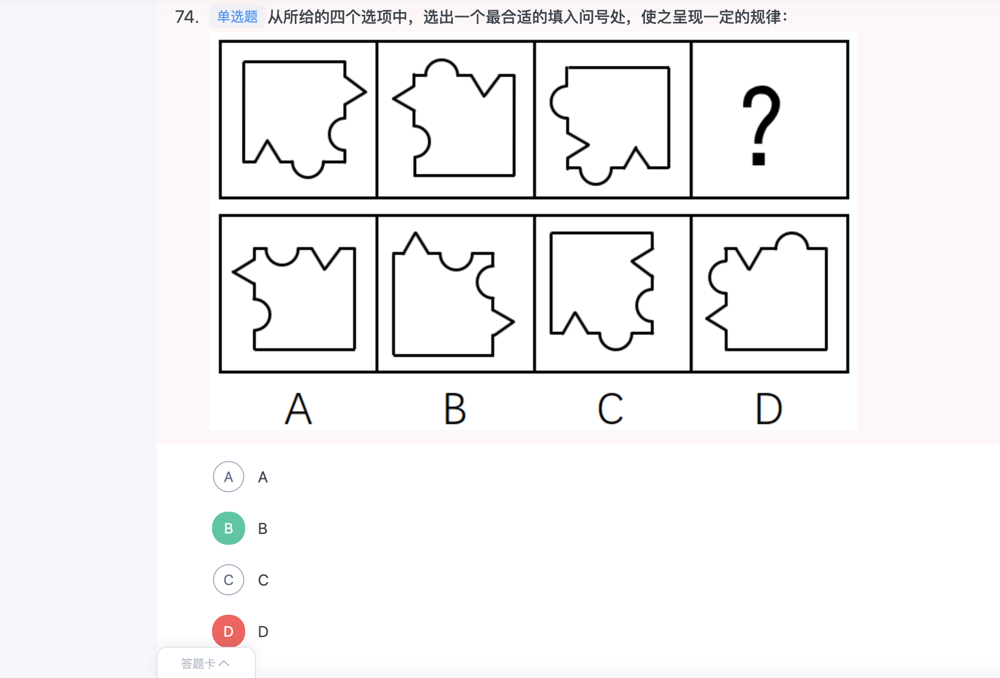
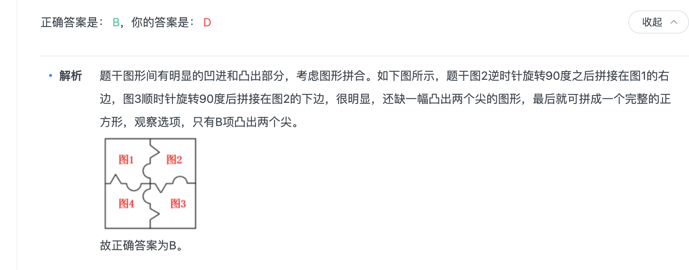
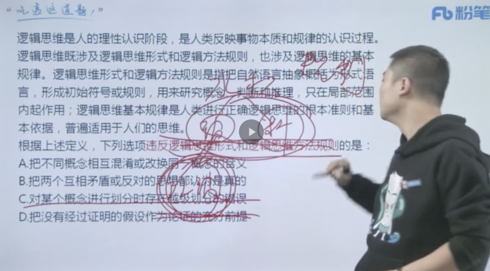
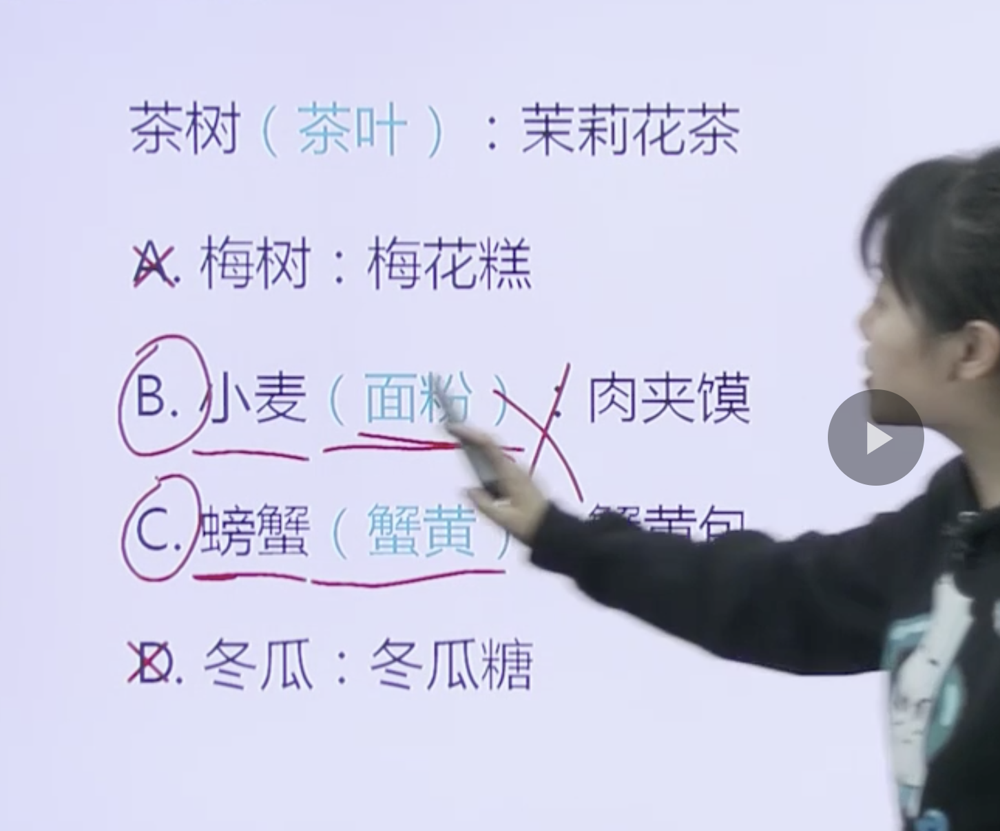
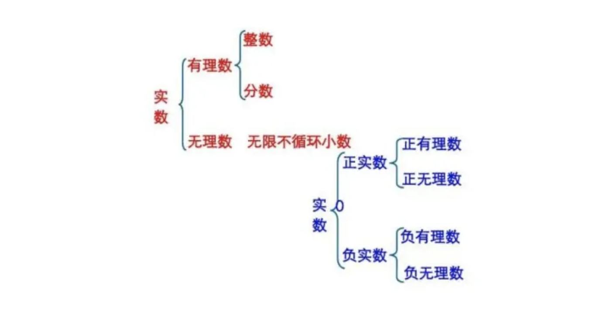
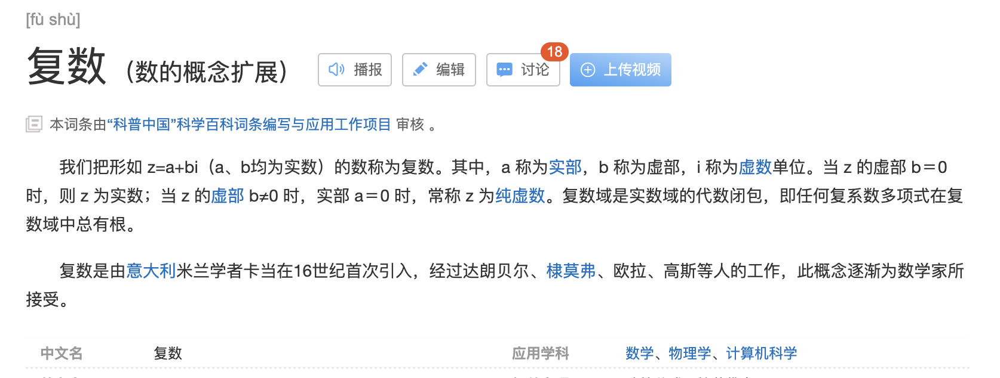

###  言语共35道，答对26道，正确率74%，用时44分钟

|  错误类型   | 统计次数  |
|  ----  | ----  |
| 固定搭配  |  |
| 固定搭配- 虚拟一般后面搭配情况、技术、世界等，一般不与“故事”搭配。虚构故事  | 1 |
| 固定搭配-充沛精力而不是充沛思想。并且此处与前文一致，填写动词。高尚，高贵没有动词的意味)  | 1 |
| 固定搭配-妨碍**，而不是造成了阅读的妨碍。造成了阅读的障碍。太阿倒持:比喻把大权交给别人，自己反受其害。以一持万:形容抓住关键，可以控制全局。  | 1 |
| 固定搭配-智慧结晶能否与这个词搭配。长期发展的智慧结晶不合适，应该是长期积淀的智慧结晶。  | 1 |
| 中心理解 - 主题词对了，但是主题句子（主语宾语没对）  | 1 |
| 关联词-并列-造词。行业 ，要素。可以造词语。科技业，创意业。。总不如要素好   | 1 |
| 语句排序(对策不做首句，先引出话题，再正面反面论证。尾句一般提对策更好。) | 1 |

 #### 阅读理解(共12道，答对9道，正确率75%)
1. 中心理解

  (1) 关联词-转折(共3道，答对2道，正确率67%)
  1.1(比如，传统汉语中的新词一般是通过入选词典而被加以确认，从而逐渐被推广、使用，然而网络词汇更多源自自发式生长。这是举列子，说明网络语言没有生命力，所以不能选。并且这道题偏离了传统词汇纳入词典这个中心话题。)
  
```
  超过一半的人要求将有意义和创意的网络词汇收入词典，代表的是对网络词汇的肯定与重视。但在今天，重视网络词汇，是否非得通过将之纳入词典的方式来表现？毕竟，相较于传统词汇的变化速度和路径，网络词汇已有很大的不同。比如，不少网络词汇可能火过一阵就开始被遗忘；比如，传统汉语中的新词一般是通过入选词典而被加以确认，从而逐渐被推广、使用，然而网络词汇更多源自自发式生长。

这段文字意在说明：

A

我们对网络词汇需要有开放的态度

B

网络词汇相较于传统词汇没有生命力

C

将某些网络词汇纳入词典，确有必要

D

网络词汇是否纳入词典，要谨慎对待


正确答案是： D，你的答案是： B收起
解析
文段首句指出“超过一半的人要求将有意义和创意的网络词汇收入词典”，后文提出问题——是否非得通过将之纳入词典的方式来表现对它的肯定与重视，后文通过两个例子进行详细的解释说明，即考虑到网络词汇的变化速度和路径，是否将网络词汇纳入词典并没有那么重要，对应D项。

A项，文段讨论的是网络词汇是否需要纳入词典，而不是我们对网络词汇的态度，排除；B项为“比如”之后的内容，非重点，且表述片面，排除；C项为文段转折前的表述，非重点，排除。

故正确答案为D。  

```  
  (2) 关联词-对策(共2道，答对1道，正确率50%)
  2.1(反面论证推对策，应该保障创业主体的人的价值)

  ```
    近年来，我国推行了一系列改革，为双创营造制度环境。大学生、海归、大企业高管和连续创业者、科技人员这支“新四军”的崛起，可以看作是创业主体从精英走向大众的一个强有力的信号。不过，因为机制体制不健全，一些法律、法规、政策存在矛盾，人的价值的最终实现还存在着不少障碍。倘若人的价值迟迟不能得到充分保障，创新创业者才能的释放势必会受到影响，诸多科技成果就可能烂在抽屉里，诸多科技企业就可能因为缺乏创新而死去。

这段文字意在强调：

A

改革要为双创营造制度环境

B

创业主体将从精英走向大众

C

机制体制阻碍人的价值实现

D

保障人的价值是双创的前提


正确答案是： D，你的答案是： C收起
解析
文段首先交代背景，指出我国通过改革为“双创”营造制度环境及创业主体发生变化，随后通过“不过”进行转折，提出“人的价值的最终实现还存在不少障碍”的问题，尾句通过反面论证提出对策，强调要充分保障人的价值，故文段重点强调保障人的价值对于双创的必要性，对应D项。

A项为转折前的表述，且“要”时态错误，根据文段首句可知，我国已经为双创营造了制度环境，排除；

B项为转折前的表述，且没有提到主题词“人的价值”，排除；

C项为问题的表述，非重点，且没有提到“双创”这一话题，排除。

故正确答案为D。

  ```  
  (3) 关联词-并列(共1道，答对0道，正确率0%)

  3.1(行业”是工商业中的类别，泛指职业.如果概括就找到挑不出问题的要素比行业好点，也可以造词语。科技业，创意业。。总不如要素好)

```
    目前，以“文化科技”“文化金融”“文化创意”等为代表的融合模式，已经得到广泛应用。“文化科技”，主要是促使高新技术成果向文化领域转化应用，强化文化对信息产业的内容支撑和创意提升。“文化金融”，重在引导各类社会资本投资文化领域，利用互联网金融模式，发挥金融创新对文化消费的刺激作用。“文化创意”，更多的是以文化为资源，以创意为手段，以产业为目的，发展文化创意产业，同时实现与其他产业的深度融合。

从宏观层面看，以上三个内容同属于“文化”融合趋势的哪一种形态：

A

跨平台融合

B

跨行业融合

C

跨路径融合

D

跨要素融合


正确答案是： D，你的答案是： B收起
解析
文段分别具体介绍了三种融合模式“文化科技”“文化金融”“文化创意”，形成并列结构，需概括全面、提取共性，结合“科技”“金融”“创意”三者，均属于文化产业当中的一个组成部分，即产业要素，对应D项“跨要素融合”。

A项“平台”指发展的空间、环境，如客户端、网站等均是现在文化发展常常会搭建的平台，而文段没有提及，无中生有，排除；

B项“行业”指的是对同类经济活动划分类别，如制造业、旅游业等等，对应原文仅能对应“金融”一个方面，表述片面，排除；

C项“路径”即发展的道路，往往涉及过去现在未来等时间维度，与文段无关，排除。

故正确答案为D。

```  
  (4) 关联词-分总(共4道，答对3道，正确率75%)


 #### 语句表达(共5道，答对4道，正确率80%)
1. 语句排序(对策不做首句，先引出话题，再正面反面论证。尾句一般提对策更好。)
1.1(3是对策不适合做首句。④通过下定义引出“自然界”这一核心话题，⑥为反面论证的表述，强调大自然很重要，可以应先引出大自然的话题再强调其重要，故⑥应在④之后，⑥不适合作首句，排除A项。其次来对比C、D两项尾句，③提出对策，⑤指出大自然很重要，故③更适合作为文段的尾句，对应D项。

)


```

①我们要感恩大自然造就我们的生命，给我们来到世界的机会，感恩大自然赋予我们丰富的生活所需资源

②宋代张载指出：“乾曰父，坤曰母”。就是说，天就是我们的父亲，地就是我们的母亲

③我们要树立人与天地万物同属一个生命世界、生死与共的天人观，树立感恩自然、爱护自然的大自然观、大环境观和大生态观

④大自然是我们生命所来与所归的地方，人人来自自然，在自然中生息，最后又回归自然

⑤阳光、空气和水，人们须臾不可离，没有大自然，人就无法生活和生存，人与自然生死攸关

⑥没有自然界，就没有我们的一切

将上述6个句子重新排列，语序正确的是：

A

⑥④②⑤①③

B

③①⑤④②⑥

C

②④③①⑥⑤

D

④②⑥①⑤③


正确答案是： D，你的答案是： B收起
解析
首先观察选项确定首句。②通过古人的话指出“天就是我们的父亲，地就是我们的母亲”，强调天地很重要，③提出对策指出要树立大自然观，不适合作为首句，排除B项；④通过下定义引出“自然界”这一核心话题，⑥为反面论证的表述，强调大自然很重要，可以应先引出大自然的话题再强调其重要，故⑥应在④之后，⑥不适合作首句，排除A项。

其次来对比C、D两项尾句，③提出对策，⑤指出大自然很重要，故③更适合作为文段的尾句，对应D项。

故正确答案为D。

【文段出处】《孝敬自然的追问》
```
 #### 逻辑填空(共18道，答对13道，正确率72%)
1. 实词填空(共9道，答对5道，正确率56%)


  3. 混搭填空((共6道，答对5道，正确率83%))
  4. 词的辨析(共13道，答对8道，正确率62%)
    (1)词义侧重(共5道，答对2道，正确率40%)
    (2)固定搭配(共11道，答对6道，正确率55%)

  2.1(考固定搭配，虚构故事比虚拟故事更好。虚拟一般后面搭配情况、技术、世界等，一般不与“故事”搭配)
  ```
      在动画片的题材中，童话、神话、民间故事占了很大的比例，就是因为这些题材都是带有浓厚幻想色彩的        故事，具有鲜明的        、假定与象征的因素。神奇虚幻的故事借助动画的假定性不仅可以得到淋漓尽致的表现，而且动画艺术的特征也能够得以充分发挥。

  依次填入画横线部分最恰当的一项是：

  A

  虚构 寓意

  B

  虚幻 含义

  C

  虚假 含意

  D

  虚拟 喻义


  正确答案是： A，你的答案是： D收起
  解析
  第一空，搭配“故事”，由前文“带有浓厚幻想色彩”可知，这类故事是凭借想象创造出来的。C项“虚假”侧重假，强调不真实，是贬义词，排除；D项“虚拟”，用于搭配情况、技术、世界等，一般不与“故事”搭配，排除。

  第二空，形容这类故事的特点，与后文的“假定”“象征”并列。A项“寓意”表示寄托或蕴含的意思，B项“含义”指包含的意义（一般是表面上的），由文段可知，动画片中神奇虚幻的故事，需要从故事本身领悟故事所蕴含的深层内涵，而非故事表面表达的意思，A项更符合文意。 
  ```
  2.2(考遏制和遏止的固定搭配：遏止”强调用力阻止，侧重强调停止，对象多是战争、暴动、洪流等来势凶猛而突然发生的重大事件，且常见用法为“对暴动进行遏止”，后面基本不接宾语；B项“遏制”是指制止、控制，使不发作，侧重强调控制在一定范围内，后面常直接接宾语，如“遏制不良风气蔓延”。本题横线后直接搭配“网络谣言”，因此B项“遏制”更加准确。)

  ```
    近年来，一些不负责任的网络谣言泛滥成灾，极大地        着社会成本，        着世道人心。         网络谣言，净化网络环境，已经成为包括广大网民、互联网企业和管理部门等在内的全社会的共识。

    依次填入画横线部分最恰当的一项是：

    A

    耗费 扰乱 遏止

    B

    消耗 损害 遏制

    C

    耗尽 蛊惑 禁绝

    D

    侵蚀 破坏 杜绝


    正确答案是： B，你的答案是： A收起
    解析
    第一空，填入的词语与“社会成本”搭配，A项“耗费”与B项“消耗”与之搭配均可。C项“耗尽”是指消耗完毕、用尽所有，与“极大地”和横线后的“着”搭配不当，排除；D项“侵蚀”是指逐渐侵害使变坏，与“社会成本”搭配不当，排除。

    第二空，搭配“世道人心”，A项与B项填入均可。

    第三空，填入的词语与“网络谣言”搭配。A项“遏止”强调用力阻止，侧重强调停止，对象多是战争、暴动、洪流等来势凶猛而突然发生的重大事件，且常见用法为“对暴动进行遏止”，后面基本不接宾语；B项“遏制”是指制止、控制，使不发作，侧重强调控制在一定范围内，后面常直接接宾语，如“遏制不良风气蔓延”。本题横线后直接搭配“网络谣言”，因此B项“遏制”更加准确。

    故正确答案为B。
  ```
  2.3(搭配不当，充沛精力而不是充沛思想。并且此处与前文一致，填写动词。高尚，高贵没有动词的意味)

  ```
  书法一旦离开了文字所表达的思想内涵和精神境界，就如同艺术只剩下技术而毫无风骨气韵，书法艺术唯有思想上的        ，文学上的滋润，文化上的        ，心灵上的寄托，才能        出打动人心的魅力。

  依次填入画横线部分最恰当的一项是：

  A

  高尚 传承 展现

  B

  充沛 弘扬 展示

  C

  充盈 传承 彰显

  D

  高贵 弘扬 突显


  正确答案是： C，你的答案是： B收起
  解析
  第一空，根据文段中相同句式的并列可知，横线处词语与“滋润”“寄托”形成并列，故需填入动词，C项“充盈”指充满、丰富，为动词，填入文段合适。A项“高尚” 、D项“高贵”均为形容词，与文段不符，且根据文意可知，横线处表达思想要丰富，有内容，“高尚”、“高贵”均无此义，B项“充沛”与“思想”搭配不当，排除。

  第二空，代入验证，“传承”指一代一代的往下传，填入文段语义合适，且与“文化”搭配恰当。

  第三空，代入验证，“彰显”指鲜明地显示，与“魅力”搭配得当，符合文意。

  故正确答案为C。
  ```

  2.4(搭配不当：妨碍**而不是造成了阅读的妨碍。太阿倒持:比喻把大权交给别人，自己反受其害。以一持万:形容抓住关键，可以控制全局。)

  ```
      
    所谓类文本，指的是出版物中所有作者文字之外的部分。尽管类文本也是阅读对象，但它们            地成为阅读的主体，甚至造成了对于文本的阅读            ，实在有            之嫌。

    依次填入画横线部分最恰当的一项是：

    A

    反客为主 困难 以一持万

    B

    主客颠倒 妨碍 舍本逐末

    C

    太阿倒持 艰难 轻重倒置

    D

    喧宾夺主 障碍 本末倒置


    正确答案是： D，你的答案是： B收起
    解析
    第一空，根据文意可知，类文本成为了阅读的主体，A项“反客为主”指客人反过来成为了主人；B项“主客颠倒”比喻事物轻重大小颠倒了位置；D项“喧宾夺主”比喻外来的或次要的事物占据了原有的或主要事物的位置。此三项均符合文意。C项“太阿倒持”比喻把大权交给别人，自己反受其害，不符合文意，排除。

    第二空，B项“妨碍”填入横线处搭配不当，如填“妨碍”，应表述为“妨碍阅读”，排除。

    第三空，D项“本末倒置”比喻把主次、轻重的位置弄颠倒了，类文本成了阅读主体属于“本末倒置”，当选。A项“以一持万”形容抓住关键，可以控制全局，不符合文意，排除。

    故正确答案为D。
  ```

  2.5(总觉得都合适，没想到考固定搭配：长期——的智慧。强调结果而不是过程，但是演进，发展都是强调过程。排除。遗留痕迹，比留存痕迹更好，B项“留传”指留下并向下传，文段并无代代相传的意思，排除；D项“遗留”指遗落下来的，与“痕迹”对应恰当，当选)

  ```
    语言本身就是人类文化长期            的智慧结晶。一切人类创造的思想文化成果都需要通过语言来深度表达和精彩            ，如果将文化视为人类精神或思维自觉            的形形色色的神奇“痕迹”，那么，语言就是这种“痕迹”中最鲜活、最深邃和最久远的核心部分。

    依次填入画横线部分最恰当的一项是：

    A

    演进 描述 保存

    B

    培育 演绎 留传

    C

    发展 诠释 存留

    D

    积淀 阐释 遗留


    正确答案是： D，你的答案是： C收起
    解析
    第一空，横线处所填词语与前文“文化”搭配且修饰后文“智慧结晶”，A项“演进”、C项“发展”均侧重强调变化，而“智慧结晶”表示智慧的凝聚而非变化，故排除。

    第二空，出现并列关联词“和”，故横线处与前文的“表达”意思相近，B项“演绎”、D项“阐释”填入文段均可。

    第三空，B项“留传”指留下并向下传，文段并无代代相传的意思，排除；D项“遗留”指遗落下来的，与“痕迹”对应恰当，当选。

    故正确答案为D。
    
  ```

  (3)感情色彩(共2道，答对0道，正确率0%)
 
  5. 语境分析
    (1)对应关系：解释类对应(共13道，答对11道，正确85%)
    1.1 转折关系
    ```
  
    ```
    1.2 解释类对应
    ```
  
    ```
    1.3 重点词语对应
  1.3.1(第一个空，我错是因为没有想到智慧结晶能否与这个词搭配。长期发展的智慧结晶不合适，应该是长期积淀的智慧结晶。)

  ```
  言本身就是人类文化长期            的智慧结晶。一切人类创造的思想文化成果都需要通过语言来深度表达和精彩            ，如果将文化视为人类精神或思维自觉            的形形色色的神奇“痕迹”，那么，语言就是这种“痕迹”中最鲜活、最深邃和最久远的核心部分。

  依次填入画横线部分最恰当的一项是：

  A

  演进 描述 保存

  B

  培育 演绎 留传

  C

  发展 诠释 存留

  D

  积淀 阐释 遗留


  正确答案是： D，你的答案是： C收起
  解析
  第一空，横线处所填词语与前文“文化”搭配且修饰后文“智慧结晶”，A项“演进”、C项“发展”均侧重强调变化，而“智慧结晶”表示智慧的凝聚而非变化，故排除。

  第二空，出现并列关联词“和”，故横线处与前文的“表达”意思相近，B项“演绎”、D项“阐释”填入文段均可。

  第三空，B项“留传”指留下并向下传，文段并无代代相传的意思，排除；D项“遗留”指遗落下来的，与“痕迹”对应恰当，当选。
  ```
      

###  判断共35道，答对24道，正确率69%，用时45分钟
|  错误类型   | 统计次数  |
|  ----  | ----  |
| 图推  | 图形平移 |
| 单定义判断-不明确选项  | 1 |
| 单定义判断-不符合定义  | 1 |
| 多定义，定义难的话需要对比，找出最符合本定义的  | 1 |
| 多定义，不符合其中的定义  | 1 |
| 类比推理-材料成分对应，原材料  | 1 |
| 类比推理- 进士：包括状元、榜眼、探花  | 1 |
| 类比推理 - 成语对应 | 1 |
| 类比推理 - 实数包括虚数和复数   | 1 |
| 加强类型 - 解释原因 | 1 |
| 削弱类型 - 否定论点，另有他因 | 1 |

  #### 图形推理（共5道，答对4道，正确率80%，用时9分钟）！！！！
    1. 特殊规律
    1.1(四张图可以拼合成一张图)

    
    
   
  #### 定义判断（共10道，答对6道，正确率60%，用时16分钟）！！

  1. 单定义（共8道，答对5道，正确率63%，用时13分钟）
    （1） 方式目的 
    （2） 其他 （共1道，答对0道，正确率0%，）

     2.1(这道题错还是因为没有看到大前提，困难任务。而睹物兴悲，睹物兴悲”是指见到与故人有关的东西而引起悲伤，是一种触景生情，没有任何任务时，也可以发生)

```
      自我效能感是个体对自己能否成功操作某一行为达到某种预期效果的主观预期和推断。当面临困难任务时，低自我效能感的人比高自我效能感的人更集中于问题存在的障碍、失败影响以及个人缺陷上。

     根据上述定义，下列选项属于低自我效能感表现的是：

A

破釜沉舟

B

画饼充饥

C

心急如焚

D

睹物兴悲


正确答案是： C，你的答案是： D收起
解析
第一步：找出定义关键词。

“能否成功操作某一行为达到某种预期效果的主观预期和推断”、“当面临困难任务时”、“低自我效能感的人……更集中于问题存在的障碍、失败的影响以及个人缺陷上”。

第二步：逐一分析选项。

A项：“破釜沉舟”比喻不留退路，非打胜仗不可，下决心不顾一切地干到底。这是决心很大的表现，不符合关键词“更集中于问题存在的障碍、失败的影响以及个人缺陷上”，不符合定义，排除；

B项：“画饼充饥”比喻用空想来安慰自己。当面对困难时，采取了“画饼”，虽然不能解决实际问题，但可以给人一定程度的心理安慰，东汉末年也有曹操“望梅止渴”的典故，与画饼充饥类似，都可以提振士气，没有将问题只集中到障碍和个人的缺陷上，不符合定义，排除；

C项：“心急如焚”形容非常着急，比喻当面临困难任务时，急于克服，一味地关注现状的问题和自身的缺陷，符合关键词“更集中于问题存在的障碍、失败的影响以及个人缺陷上”，符合定义，当选；

D项：“睹物兴悲”是指见到与故人有关的东西而引起悲伤，是一种触景生情，没有任何任务时，也可以发生，所以不能体现“面临困难任务”，也不是对“达到某种预期效果的主观预期和推断”，不符合定义关键词“更集中于问题存在的障碍、失败的影响以及个人缺陷上”，不符合定义，排除。

故正确答案为C。
```
   
2.2(注意，除了主语，动作，结果，等，还要看重点看定语。比如：健康人类机体功能)

```
人类增强就是利用生物医学技术、智能技术、神经科学技术、信息技术和纳米技术等高新技术手段使健康人类的机体功能或能力超出其正常范围，从而使人类的体貌、寿命、人格、认知和行为等能力发生根本性变化并具有全新能力的一种技术手段，其目的是显著提高人类生活的质量。

根据上述定义，下列选项不属于人类增强的是：

A

演员赵某用药剂延缓衰老

B

医生建议老张去做心脏搭桥手术

C

医生将传感器植入老陈大脑提高其记忆力

D

小王为了增加自己的身高服用类增高药物


正确答案是： B，你的答案是： D收起
解析
第一步：找出定义关键词。

方式：利用高新技术手段使健康人类机体功能或能力超出正常范围，使人类的体貌、寿命、人格、认知和行为等能力发生根本性变化并具有全新能力。

目的：显著提高人类生活质量。

第二步：逐一分析选项。

A项：药剂属于一种生物医学技术，延缓衰老是人类机体功能超出正常范围的表现，使寿命发生了变化，符合定义，排除；

B项：老张做心脏搭桥手术说明老张的心脏有问题，是从不健康变为健康，而不是从健康变为超出正常范围，不符合定义，当选；

C项：传感器是一种高新技术手段，利用传感器提高记忆力使老陈的认知功能发生变化，符合定义，排除；

D项：服用类增高药物属于一种生物医学技术手段，利用该药物使小王的体貌发生变化，符合定义，排除。

本题为选非题，故正确答案为B。
```
1.3(注意将定义框出来，一个一个带进去验证。找出定义关键词。“人们在心里无意识地把财富划归不同的账户进行管理”、“对结果（尤其是经济结果）加以编码、分类和估价”、“不同的心理账户有不同的记账方式和心理运算规则”、“个体的决策违背最简单的理性经济法则”。第二步，逐一分析选项。且D项中没有涉及小刘的决策“违背最简单的理性经济法则”)

```

心理会计是指人们在心里无意识地把财富划归不同的账户进行管理，并对结果（尤其是经济结果）加以编码、分类和估价的过程，且不同的心理账户有不同的记账方式和心理运算规则。小到个体、家庭，大到企业集团，都有一套或隐或显的心理账户系统，其心理记账方式与经济学和数学的运算方式都不相同，因此经常以非预期的方式影响着决策，使个体的决策违背最简单的理性经济法则。

根据上述定义，下列选项最能体现心理会计现象的是：

A

整日忧心忡忡的小李将自己全部存款的四分之三用于购买人寿保险

B

小陈已经攒够购买相机的钱，但他一定要等领到年底奖金再买相机

C

小王在两家不同银行都有储蓄卡，但他总是去离家更近的银行取款

D

小刘因公司奖励出游某地感觉不错，后来自费重游此地却感觉不佳


正确答案是： B，你的答案是： D收起
解析
第一步，找出定义关键词。

“人们在心里无意识地把财富划归不同的账户进行管理”、“对结果（尤其是经济结果）加以编码、分类和估价”、“不同的心理账户有不同的记账方式和心理运算规则”、“个体的决策违背最简单的理性经济法则”。

第二步，逐一分析选项。

A项：小李将自己存款的四分之三用于购买人寿保险，这是有意识对财富进行支出和管理，并未体现“人们在心里无意识地把财富划归不同的账户进行管理”，不符合定义，排除；

B项：小陈已经攒够购买相机的钱，但他一定要等领到年底奖金再买相机，无论是现在的存款还是年终奖都是小陈自己的财富，而且无论是现在买还是之后买都是等价的商品。但是工资和年终奖金性质有所不同，所以小陈在心里上认为有差别，“心理账户”就不一样了，符合“人们在心里无意识地把财富划归不同的账户进行管理”，而且也“违背最简单的理性经济法则”，符合定义，当选；

C项：小王选择去哪家银行根据的是距离远近而非财富本身，不符合定义，排除；

D项：小刘对公司奖励的出游某地感觉很满意，但是对自费出游某地感觉不佳，第二次出游是小刘自费，涉及了对自己财富的管理，而第一次出游是公司的奖励，不涉及小刘对自己财富的管理，无法体现“人们在心里无意识地把财富划归不同的账户进行管理”，且D项中没有涉及小刘的决策“违背最简单的理性经济法则”，不符合定义，排除。

故正确答案为B。
```
  2. 多定义（共2道，答对1道，正确率50%，用时3分钟）
     
      （1） 常规问法 （共5道，答对2道，正确率40%，用时6分钟）
      1.1(这种定义难的，需要找到其中是概念。一个是局部一个是普遍的。而苹果就是苹果，如果说苹果为梨就违反了逻辑思维基本规律。除了C都是违反了普遍规律。只在局部范围内起作用,普遍适用于人们的思维。所以这题找，就算违反了，也不那么重要的。只有c不那么严重一些，因为划分规则是人类定的，无关紧要。可以用个更大得范围包括。)
      
```
       逻辑思维是人的理性认识阶段，是人类反映事物本质和规律的认识过程。逻辑思维既涉及逻辑思维形式和逻辑方法规则，也涉及逻辑思维的基本规律。逻辑思维形式和逻辑方法规则是指把自然语言抽象概括为形式语言，形成初始符号或规则，用来研究概念、判断和推理，只在局部范围内起作用；逻辑思维基本规律是人类进行正确逻辑思维的根本准则和基本依据，普遍适用于人们的思维。

根据上述定义，下列选项违反逻辑思维形式和逻辑方法规则的是：

A

把不同概念相互混淆或改换同一概念的含义

B

把两个互相矛盾或反对的思想都认为是真的

C

对某个概念进行划分时存在越级划分的错误

D

把没有经过证明的假设作为论证的充分前提


正确答案是： C，你的答案是： D收起
解析
第一步：找到定义关键词。

“把自然语言抽象概括为形式语言”、“研究概念、判断和推理”、“局部范围内起作用”。

第二步：逐一分析选项。

A项：把不同概念混淆或改换同一概念的含义，这违反了逻辑的基本规律——同一律，排除；

B项：把两个互相矛盾或反对的思想都认为是真的，这违反逻辑的基本规律——矛盾律，排除；

C项：对某个概念进行划分是人们制定的规则，是可变的，因此这种越级划分的错误只是在局部范围内犯的错误，并不具有普适性，因此违反了逻辑思维形式和逻辑方法规则，当选；

D项：把没有经过证明的假设作为论证的充分前提，这违反逻辑的基本规律——充足理由律，排除。

故正确答案为C。

附：

同一律： 

一、同一律的内容和要求： 

１.内容：同一个思维过程中，每一思想与其自身是同一的；即“Ａ就是Ａ”。 

２.要求：同一个思维过程中，概念都要确定，并保持自身的同一，不得随意变更。 

二、违反同一律要求的逻辑错误： 

１.混淆概念或偷换概念：把两个不同的概念混淆起来，并用一个概念代替已经使用的另一个概念。 

２.转移论题或偷换论题：在同一思维过程中，改变原来的断定内容，或者用另一断定代替之。

矛盾律： 

一、矛盾律的内容和要求： 

１.内容：同一思维过程中，两个互相否定的思想不能同真，必有一假；即“非（既Ａ又非Ａ）”； 

２.要求：同一思维过程中，不能对不能同真的命题（矛盾关系、反对关系）同时加以肯定。

二、违反矛盾律要求的逻辑错误： 

１.自相矛盾：同时肯定了互相矛盾的命题。 

２.悖论：一种特殊的逻辑矛盾，即通过一个命题的真，可以推假，而通过它的假，又可推真。

充足理由律：

“充足理由律”包含有两方面意思：

第一，一切事物都有一个成因，这个成因决定了这个事物为什么会存在，为什么它是真实的，为什么它是这个样子而不是另外的样子。人们认识了这个成因，也就认识了这个事物，也就可以改变这个事物。正如莱布尼兹所说的：“如果不具有充足的理由，或者没有确定的理由，就什么也不能达到”。

第二，事物的感性存在，直观存在并不重要，只有事物背后的成因才是最为重要的，最真实的。
```

  
  #### 逻辑判断（共10道，答对8道，正确率80%，用时12分钟）
   1. 加强题型（共5道，答对4道，正确率80%，用时6分钟）
     1.1 补充论据 (错误原因是论点不一致，主体是数据被动分享，而不是数据分享。D项讲数据分享的重要性，但是B项是讲数据被动分享造成的影响，也算是解释原因。)
     ```

     ```

  2. 削弱题型（共2道，答对1道，正确率50%，用时3分钟）
     
      （1） 削弱论点

      1.1(这道题的隐藏论点稍微有点深，只是列举出了20世纪最伟大的100名艺术家中没有一个FTD患者，而除了这100名之外的其他艺术家中FTD患者有多少并不清楚，属于不明确选项.D项：明确说明了FTD患者的艺术能力来源于家族遗传，而不是这个疾病，削弱论点，当选)

```
正常情况下，人的大脑左前颞叶及眶频皮层会抑制位于大脑后部、负责处理眼部信号的视觉系统的神经活动，而在FTD（额颞叶痴呆）患者中，这两个区域可能无法发出抑制性信号，如此，大脑就能以一种全新的方式来处理视觉和声音，尽管额叶的损伤可能会导致患者出现一些病态的异常行为，但也会将患者的艺术敏感性或其他创造力释放出来。可以说，FTD是通向艺术殿堂的一扇窗。

如果以下各项为真，最能质疑上述结论的是：

A

只有不到的FTD患者在患病期间能成为杰出艺术家


B

20世纪最伟大的100名艺术家里，没有一个是FTD患者


C

冥想或苦练能让右脑更具创造性进而开发出潜在艺术才能


D

FTD患者患病后所获得的艺术才能只能是家族遗传的结果


正确答案是： D，你的答案是： B收起
解析
第一步：找出论点和论据。

论点：FTD是通向艺术殿堂的一扇窗。

论据：FTD（额颞叶痴呆）患者的大脑能以一种全新的方式来处理视觉和声音，尽管额叶的损伤可能会导致患者出现一些病态的异常行为，但也会将患者的艺术敏感性或其他创造力释放出来。

第二步：逐一分析选项。

A项：“只有不到的FTD患者”说明还是有患者在这个期间成为杰出艺术家，但这并不能证明是否因为FTD导致的他成为了杰出的艺术家，属于不明确选项，排除；

B项：只是列举出了20世纪最伟大的100名艺术家中没有一个FTD患者，而除了这100名之外的其他艺术家中FTD患者有多少并不清楚，属于不明确选项，排除；

C项：右脑更具创造性进而开发出潜在艺术才能，并未涉及到FTD是否能将患者的艺术敏感性或其他创造力释放出来，无关项，排除；

D项：明确说明了FTD患者的艺术能力来源于家族遗传，而不是这个疾病，削弱论点，当选。

故正确答案为D。
```
   

  #### 类比推理（共10道，答对6道，正确率60%，用时9分钟）

  2. 逻辑关系（共8道，答对4道，正确率50%）
2.1(错是因为没想到还有间接成分，这种东西。)

```

茶树：茉莉花茶

A

梅树：梅花糕

B

小麦：肉夹馍

C

螃蟹：蟹黄包

D

冬瓜：冬瓜糖


梅花糕，并不是用梅花做的，只是形状像

茶树 间接成分（茶叶） 茉莉花茶是由茉莉花和茶叶组成的

茶叶是茶树的组成部分，但是面粉不是小麦的组成部分

但是 蟹黄是螃蟹的组成部分
```
 2.2（这道题错是因为，不知道进士包含状元、榜眼、探花等，状元是进士中名次第一的称谓。二者为种属关系。宪法是国家的根本法，民法是调整平等主体的公民、法人之间财产关系和人身关系的法律规范。民法的制定必须以宪法为基础，宪法的效力要高于民法，宪法属于上位法，民法属于下位法）

 ```
进士：状元

A

河水：海水

B

银河：天文

C

学位：博士

D

宪法：民法


正确答案是： C，你的答案是： A收起
解析
第一步：判断题干词语间逻辑关系。

进士包含状元、榜眼、探花等，状元是进士中名次第一的称谓。二者为种属关系。

第二步：判断选项词语间逻辑关系。

A项：河水、海水是两种不同的水域，二者是并列关系，与题干逻辑关系不一致，排除；

B项：银河是天文领域的概念，二者是对应关系，与题干逻辑关系不一致，排除；

C项：学位包含学士、硕士、博士，博士是学位中等级最高的学术称号，二者为种属关系，与题干逻辑关系一致，当选；

D项：宪法是国家的根本法，民法是调整平等主体的公民、法人之间财产关系和人身关系的法律规范。民法的制定必须以宪法为基础，宪法的效力要高于民法，宪法属于上位法，民法属于下位法。与题干逻辑关系不一致，排除。

故正确答案为C。

 ```   
2.3(这道题错是因为不知道斗折蛇行是指像北斗星一样弯曲，像蛇一样曲折行进。形容道路曲折蜿蜒。与转移没有明显的逻辑关系，与题干逻辑关系不一致，排除。)

```
救援：围魏救赵

A

进攻：风声鹤唳

B

防守：草木皆兵

C

追击：穷寇勿追

D

转移：斗折蛇行


正确答案是： C，你的答案是： D收起
解析
第一步：判断题干词语间逻辑关系。

围魏救赵，原指战国时齐军用围攻魏国的方法，迫使魏国撤回攻赵部队而使赵国得救。后指袭击敌人后方的据点以迫使进攻之敌撤退的战术。围魏救赵是救援的一种策略。二者是对应关系，同时在语义上有相关性。

第二步：判断选项词语间逻辑关系。

A项：风声鹤唳形容惊慌失措，或自相惊忧。与进攻没有明显的逻辑关系，与题干逻辑关系不一致，排除；

B项：草木皆兵是指把山上的草木都当做敌兵，形容人在惊慌时疑神疑鬼。与防守没有明显的逻辑关系，与题干逻辑关系不一致，排除；

C项：穷寇勿追是指不追无路可走的敌人，以免敌人情急反扑，造成自己的损失。也比喻不可逼人太甚。穷寇勿追是追击的一种策略，与题干逻辑关系一致，当选；

D项：斗折蛇行是指像北斗星一样弯曲，像蛇一样曲折行进。形容道路曲折蜿蜒。与转移没有明显的逻辑关系，与题干逻辑关系不一致，排除。

故正确答案为C。
```
2.4(复数包括实数部分和虚数部分，所有的虚数都是复数，二者是包容关系中的种属关系。)



```
虚数：复数

A

法律：刑法

B

麦子：水稻

C

祥林嫂：《祝福》

D

人工智能：计算机科学


正确答案是： D，你的答案是： B收起
解析
第一步：判断题干词语间逻辑关系。

虚数是指不实的数字或并非表明具体数量的数字，而复数包括实数部分和虚数部分，所有的虚数都是复数，二者是包容关系中的种属关系。

第二步：判断选项词语间逻辑关系。

A项：刑法是法律的一种，二者是包容关系中的种属关系，但是词的顺序反了，与题干逻辑关系不一致，排除；

B项：麦子和水稻是并列关系，与题干逻辑关系不一致，排除；

C项：祥林嫂是小说《祝福》中的人物，是逻辑关系中的对应关系，与题干逻辑关系不一致，排除；

D项：人工智能是计算机科学的一种，二者是包容关系中的种属关系，与题干逻辑关系一致，当选。

故正确答案为D。
```

###  资料共20道，答对15道，正确率75%，用时42分钟 