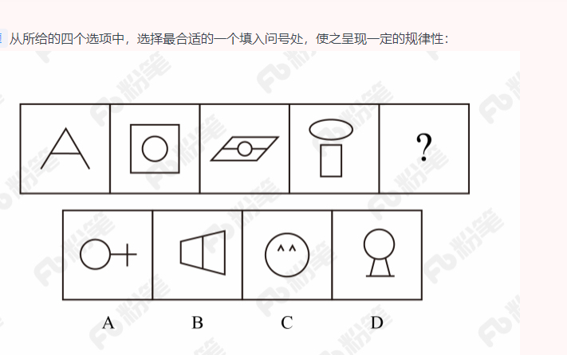

###  资料共20道，答对18道，正确率90%
###  言语共35道，答对21道，正确率60%
 #### 阅读理解(共13道，答对9道，正确率69%)
  1. 中心理解

    (1) 关联词-对策

  ```


  ```  
    (1) 关联词-并列

  ```


  ```  
    (1) 主题词

  ```


  ```  
    (1) 行文脉络-分总

  ```


  ```  
    (1) 细节判断题

  ```


  ```  

  2. 细节判断


 #### 语句表达(共7道，答对4道，正确率57%)
  1. 语句排序
  2. 语句填空
    (1) 结尾(共3道，答对1道)

    ```


    ```

 #### 逻辑填空(共15道，答对8道，正确率53%)
  1. 实词填空(共11道，答对7道，正确率64%)

  ```

  ```
  2. 成语填空((共2道，答对0道，正确率0%))

  ```
  
  ```
  3. 混搭填空((共2道，答对1道，正确率50%))
  4. 词的辨析(共12道，答对7道，正确率58%)

    (2)固定搭配(共11道，答对6道，正确率55%)
    (3)程度轻重(共2道，答对1道，正确率50%)
 
  5. 语境分析
    (1)对应关系：解释类对应(共2道，答对0道，正确0%)

    ```
    
    ```
    (2)对应关系：重点词语对应(共10道，答对5道，正确率51%)
    (2)对应关系：因果关系对应()
    (2)对应关系：并列对应()

###  判断共35道，答对20道，正确率57%

  #### 图形推理（共5道，答对4道，正确率80%）


  3. 数量规律（共1道，答对0道，正确率0%，用时10分钟）
  
    （1） 线 （共1道，答对0道，正确率0%，用时5分钟）

  

  ```
    元素组成不同，无明显属性规律，考虑数量规律。观察发现，图一出现端点较多，B项为日字变形图，都是笔画数特征图，考虑笔画数。题干都是两笔画图形，？处也应该是两笔画图形。A项两笔画，B项一笔画，C项三笔画，D项三笔画，只有A项符合。
  ```

  #### 定义判断（共10道，答对6道，正确率60%）！！

  ```
     1. 有时候并不是需要对上所有的条件，而是满足最重要的，比如保护环境为目的。就可以排除.然后根据产品设计，排除不是产品的选项。
     2. 还有一种是细微差别的概念，比如精准化。要比较得出最优。
  ```
  1. 单定义（共5道，答对4道，正确率90%，用时9分钟）
    （1） 主客体 
    （3） 方式目的 
    （4） 原因结果 
    （2） 其他句式

      2.1 （有时候并不是需要对上所有的条件，而是满足最重要的，比如保护环境为目的。就可以排除A,D。重要价值没有产品。就排除B）

      ```
        绿色设计是指在整个产品周期内，着重考虑产品的环境属性，如可拆卸性、可回收性、可维护性、可重复利用性等，并将其作为设计目标，在满足环境保护条件的同时，保证产品的质量达到最优状态。

          根据上述定义，下列选项符合绿色设计理念的是：

          A

          迪拜太阳村巧摆太阳能收集器以实现日照时间最大化

          B

          荷兰某化学品公司将健康环保作为公司重要的价值观

          C

          巴西流行利用绿色植物代替砖、石、钢筋水泥来砌墙

          D

          某学校将教室背景设计为浅绿色来保护孩子们的眼睛


          正确答案是： C，你的答案是： B收起
          解析
          第一步：找出定义关键词。

          “着重考虑产品的环境属性并将其作为设计目标”、“可拆卸性、可回收性、可维护性、可重复利用性等”、“满足环境保护条件的同时，保证产品的质量达到最优状态”。

          第二步：逐一分析选项。

          A项：巧摆太阳能收集器，只是改变了太阳能收集器的摆放位置，并未体现在产品周期考虑环境属性，且目的是实现日照时间最大化，不是为了环境保护，也不是为了产品质量达到最优，不符合定义，排除；

          B项：将健康环保作为公司的价值观，没有提及设计产品时是否“着重考虑产品的环境属性，并将其作为设计目标”，不符合定义，排除；

          C项：利用绿色植物代替砖、石、钢筋水泥来砌墙，属于在产品周期考虑了环境属性，符合“着重考虑产品的环境属性并将其作为设计目标”，符合定义，当选；

          D项：将教室背景设计为浅绿色的目的是保护孩子们的眼睛，不符合“满足环境保护条件，保证产品的质量达到最优状态”，不符合定义，排除。

          故正确答案为C。
      ```
  2. 多定义（共5道，答对2道，正确率40%，用时6分钟）
     
      （1） 常规问法 （共5道，答对2道，正确率40%，用时6分钟）

       1.1(只能说b没有精准化。比较模拟两可，但是D还是有精准化的。差别很细微。)

       ```
       精准医疗是指以个体化医疗为基础，通过基因组、蛋白质组等技术，对大样本人群与特定疾病类型进行生物标记物的分析与鉴定、验证与应用，从而精确寻找到疾病的原因和治疗的靶点，最终实现对疾病和特定患者进行个性化精确治疗。

        根据上述定义，下列选项不属于精准医疗的是：

        A

        甲某罹患癌症，医生对其基因进行全面检测并确定治疗方案

        B

        乙某近期反常头晕，医生询问症状后就给其开了非处方药物

        C

        丙某在就医时称自己对某种药物过敏，医生根据其过敏情况设计用药方案

        D

        丁某患失眠症到中医院就诊，医生据“同病异治，异病同治”的理念施治

        正确答案是： B，你的答案是： D收起
        解析
        第一步：找出定义关键词。

        “以个体化医疗为基础”、“通过基因组、蛋白质组等技术”、“对大样本人群与特定疾病类型进行生物标记物的分析与鉴定、验证与应用”、“寻找到疾病的原因和治疗的靶点”、“实现对疾病和特定患者进行个性化精确治疗”。

        第二步：逐一分析选项。

        A项：医生对甲某的基因进行全面检测，符合“以个体化医疗为基础”、“通过基因组、蛋白质组等技术”、“寻找到疾病的原因和治疗的靶点”，制定治疗方案符合“实现对疾病和特定患者进行个性化精确治疗”，符合定义，排除；

        B项：乙某出现反常头晕症状，医生仅通过询问症状就开了非处方药，不符合“以个体化医疗为基础”、“实现对疾病和特定患者进行个性化精确治疗”，不符合定义，当选；

        C项：“医生根据其过敏情况设计用药方案”符合“以个体化医疗为基础”、“实现对疾病和特定患者进行个性化精确治疗”，符合定义，排除；

        D项：“同病异治”是指同一病症，因时、因地、因人不同，或由于病情进展程度、病机变化，以及用药过程中正邪消长等差异，治疗上应相应采取不同治法。“异病同治”指不同的疾病，在其发展过程中，由于出现了相同的病机，因而采用同一方法治疗的法则。中医治病的法则，不是着眼于病的异同，而是着眼于病机的区别。异病可以同治，既不决定于病因，也不决定于病证，关键在于辨识不同疾病有无共同的病机。病机相同，才可采用相同的治法。因此“同病异治，异病同治”符合“实现对疾病和特定患者进行个性化精确治疗”，符合定义，排除。

        本题为选非题，故正确答案为B。
        个性化医疗（Personalizedmedicine），又称精准医疗，是指以个人基因组信息为基础，结合蛋白质组，代谢组等相关内环境信息，为病人量身设计出最佳治疗方案

       ```

  #### 逻辑判断（共10道，答对4道，正确率40%）！！！
   1. 加强题型（共5道，答对1道，正确率20%，用时7分钟）
    （1） 必要条件
    （2） 补充论据 （共3道，答对0道，正确率0%，）

  2. 削弱题型（共2道，答对1道，正确率33%，用时5分钟）
     
      （1） 削弱论点

  3. 翻译推理
  #### 类比推理（共10道，答对6道，正确率60%）
   1. 语义关系

   （1）近意关系

  2. 逻辑关系（共8道，答对4道，正确率50%）
     
     
      （1） 并列 
      （1） 包容 
      （1） 对应 
