###  共35道，答对26道，正确率74%，用时33分钟

 #### 阅读理解(共14道，答对13道，正确率93%)
  1. 中心理解

    (1) 行文脉络-分总(共4道，答对3道，正确率75%)

    1.1 (文段核心话题“DNA”，蛋白质且属于并列中的一部分.蛋白质也是DNA影响得)

    ```
      水熊被认为是世界上最顽强的动物，其显著特征是能在各种极端环境中存活下来。科学家曾经将水熊冰冻在冰层之中，暴露在放射线之下，甚至将它们发送至太空，但令人惊奇的是，水熊仍能从假死状态中复活。最近，科学家揭示了水熊复活的秘密，其DNA兼具动物和细菌成分，使其成为“弗兰肯斯坦”混合体。此外，科学家们在研究水熊复活过程中哪些基因会被激活时，还发现了一组特殊蛋白质。这组蛋白质能够快速替换体内损耗的水分，并修复受损细胞，致使这种动物接近于不可毁灭状态。

      这段文字旨在说明：

      A

      水熊的显著特征是能在各种极端环境中存活

      B

      水熊是一种能复活的“弗兰肯斯坦”混合体

      C

      水熊拥有神秘DNA使它接近于不可毁灭

      D

      水熊拥有的特殊蛋白质能修复受损的细胞


      正确答案是： C，你的答案是： D收起
      解析
      文段首先介绍水熊是世界上最顽强的动物，随后从将水熊“冰冻”、“暴露在放射线之下”、“发送至太空”，水熊依然能够复活等方面进行解释说明。后文通过介绍科学家的发现引出文段重点，介绍水熊复活的秘密究竟是什么，根据“此外”前后两部分的内容可知，因为特殊的DNA，使得水熊接近于不可毁灭的状态，对应C项。

      A项，“能在各种极端环境中存活”为文段引出话题部分，非重点，排除；

      B项，偏离文段核心话题，文段重点围绕“DNA”的作用展开，排除；

      D项，“特殊蛋白质”偏离核心话题“DNA”，且未指出水熊生命力顽强这一观点，排除。

      故正确答案为C。
    ```


  2. 细节判断
  3. 标题填入

 #### 语句表达(共5道，答对3道，正确率60%)
  1. 语句排序
  2. 语句填空
    (1) 结尾(共2道，答对1道，正确率50%)

  - 1.1 （错是因为没找到文章重点句子。可是，在很多人的心里，情商的内涵已经被异化。所以结合下文家长得态度。应该说家长应端正自己得情商培训班得态度。）
  ```

    近来，多家情商教育机构针对不同年龄段推出相应套餐，“情商班”火爆家长圈。情商是控制和驾驭情绪的能力，对人的生活和工作有重要的作用。可是，在很多人的心里，情商的内涵已经被异化，最早的情商概念和如今流行的情商观念大相径庭。许多人对情商的理解，是圆滑世故、阿谀奉承的另一种说法。实际上，情商的核心既是对自身情绪的认识和控制能力，也包括与人交往、融入集体的能力。这两种能力的培养，需要在日常生活中实践。孩子能否培养出良好的情绪控制能力和社交能力，很大程度上取决于家长，任何情商培训都无法取代日常生活中的情商培养。

    接下来最可能讲述的是：

    A

    情商补习应当引起家长高度关注

    B

    家长在家庭教育中的身体力行

    C

    家长要理性地看待情商培训班

    D

    需要培养和提高家长的情商


    正确答案是： C，你的答案是： B收起
    解析
    根据提问方式可知，本题为接语选择题，重点关注文段尾句。

    尾句提到孩子能否培养出良好的情绪控制能力和社交能力很大程度上取决于家长，不能过分依赖培训班，故接下来最有可能详细介绍家长面对情商培训班的态度，对应C项。

    A项，与文意相悖，文段之前提到自身情绪的认识和控制能力需要在日常生活中实践，并非是靠补习，排除；B项，“家庭教育”表述不准确，文中强调的是情商的培养，排除；D项，“培养和提高家长的情商”并非尾句重点，排除。

    故正确答案为C。
  ```
  
  - 1（错是因为我没读懂这段话。他有一方面二方面。这两个方面都是讲原因。所以A不对。）

  ```

  人们对隐私泄露的担忧正在发生变化。相对于前网络时代人们担心自己的私事被不正当披露，现在的担忧更多来自网络用户数据大规模泄露或过度收集事件、大数据交易、地图应用软件对个人位置的精准定位。一方面个人对于某信息的掌控能力不断弱化，由此引发了对于隐私乃至个人自由的担忧；另一方面很难证明某些干预或处理个人信息的行为确实对个人造成了实质性损害，以至于很少有人在浏览网页时会注意服务商的隐私条款。

    这段文字接下来最可能讨论的是：

    A

    网络时代隐私泄露风险增加的原因

    B

    个人信息泄露的管理责任与技术漏洞

    C

    隐私权保护在网络时代需应对的问题

    D

    提升个人信息掌控能力的基本路径


    正确答案是： C，你的答案是： A收起
    解析
    文段开篇指出人们对隐私泄露的担忧正在发生变化，进而指出现在网络时代的担忧来自于数据大规模泄露或过度收集等，然后通过两方面解释原因，一是个人对某类信息的掌控能力正在减弱，二是侵害个人隐私的行为很难定性。因此，文段接下来应围绕网络时代如何避免个人隐私受到侵害进行论述，对应C项。

    A项，“风险增加的原因”文段已论述过，后文不会再论述，排除；

    B项，“管理责任与技术漏洞”无中生有，无法和文段内容衔接，排除；

    D项，“提升个人信息掌控能力”仅对应原因解释的一方面内容，表述片面，排除。

    故正确答案为C。

    ```

  - 2（我当时没有注意主题一致，全文是围绕着个人信息写的。）

  ```
    对个人数据信息的抓取和使用，的确有助于金融机构更准确地把握消费者需求，全面识别风险，设计出更符合消费者需求的产品和服务。因而有观点认为，大数据时代，消费者只要享受了信息互联互通的便利，就必须付出信息让渡的代价，这是一种公平交易。这一观点实际上忽视了信息的价值，忽略了信息的所有权。

    作者在后文应该不会谈论：

    A

    互联网时代个人信息的价值及获取方式

    B

    个人信息被泄露或者滥用所带来的危害

    C

    通过法律规范个人信息交易的必要性

    D

    整顿信息交易对数字经济发展的影响


    正确答案是： D，你的答案是： B收起
    解析
    根据提问方式可知，本题为接语选择题。文段开篇指出对个人数据信息的抓取和使用对金融机构有一定的好处，接着论述有观点认为“大数据时代，消费者只要享受了信息互联互通的便利，就必须付出信息让渡的代价”，最后尾句通过指代词“这”总结前文，强调前文论述的是忽视信息价值、忽略信息所有权的错误观点。根据话题一致原则，下文应继续围绕“个人信息”这一话题展开具体论述，A、B、C三项，均围绕“个人信息”这一话题，分别从“价值及如何获取”“泄露或者滥用危害”及“如何规范交易”的角度展开论述，可能作为接下来讨论的内容，排除。D项，“信息交易”范围扩大，与文段核心话题不一致，且按照逻辑顺序，“整顿信息交易对数字经济发展的影响”应该在分析危害及如何规范交易之后再进行论述，当选。

    本题为选非题，故正确答案为D。
  ```

  - 3（思考方向不对，文章问的是文章最有可能讲什么。而不是转折之后讲什么。转折之后讲的是上文。转折之前讲的是前文。所以转折之前讲的是皇权。）

  ```
    然而，随着经学日益变成章句之学和庸俗的谶纬，情况便大不一样了。光武、章帝就因不满经学的烦琐多次命人“省减五经章句”；曾使王莽、刘秀荣登皇帝宝座的谶纬，后来也变成了篡权、谋反的工具，这表明一切都走到了专制王权期望的反面。因此，到东汉中期以后，皇权对经学和儒生的依赖开始变小，加上外戚、官宦专权，大封党羽、排挤士人，进一步拆散了经学与官僚政治的联盟。

    本文段上文最有可能讲述的是：

    A

    经学的理论来源与后续发展状况

    B

    经学的特点和对官僚政治的影响

    C

    经学的光辉历史与儒生的联系

    D

    经学的主要内容与皇权的关系


    正确答案是： D，你的答案是： B收起
    解析
    本题问“上文最有可能讲述的是”，应该重点看首句，首句出现“然而”，表转折，转折之后介绍经学日益变成了章句之学，并走到了专制王权期望的反面，根据转折前后语义相反可知，转折前应该讲述经学的主要内容与皇权的关系，故D项符合文意，当选。

    A项“后续发展情况”为文段中已经介绍过的内容，前文介绍的应该是文段中未出现的内容，排除。

    B项没有强调“皇权”，文段重点介绍了“皇权”不再依靠经学，故转折前应当强调“皇权”对经学的依赖，选项与文意不符，排除。

    C项“儒生”非转折之后的重点强调内容，上文不可能围绕该话题展开论述，排除。

    故正确答案为D。
  ```
  - 4（粉笔和华图对这道题有争议b,d）

  ```
    社会主要矛盾内涵的转化，表现为供给和需求两侧的结构都逐步发生变化。其实，几年前中央提出我国进入发展新常态，随后又提出供给侧结构性改革，就表明已经认识到社会主要矛盾内涵的变化，但并没有超越供给不能满足需求的总框架。而且应当认识到，党的十九大报告讲了主要矛盾的转化，而转化前后的主要矛盾不是相互排斥和对立的关系。“人民日益增长的美好生活需要和不平衡不充分的发展之间的矛盾”是原有主要矛盾内涵的拓展与提高；“落后的生产”提升为“不平衡不充分的发展”，“人民日益增长的物质文化需要”提升为“人民日益增长的美好生活需要”。

    接下来最可能讲述的是我国社会主要矛盾内涵转化的：

    A

    原因

    B

    动力

    C

    表现

    D

    机制


    正确答案是： A，你的答案是： C收起
    解析
    接语选择题，在把握整个文段意思的前提下重点关注尾句。文段先论述“社会主要矛盾内涵转化”的表现，即供给和需求两侧的结构都发生变化。“其实”表示转折，后提出认识到了社会主要矛盾的变化，并对其进行解释说明，因此接下来最可能谈论的是为什么我国社会主要矛盾内涵会转化，即分析矛盾转化的原因，对应A项。

    B项“动力”为强干扰项，动力是指一切力量的来源，一般比喻对事业前进和发展起促进作用的力量，文段接下来不是单纯强调是什么促进了矛盾转化，而是要分析为什么我们要在社会主要矛盾基本不变的前提下，将其内涵进行拓展与提高，因此“动力”只是属于“原因”的一个方面，相较于“原因”较为片面，排除。

    C项“表现”对应文段首句的内容，为已经论述过的内容，接下来不可能再论述，排除。

    D项“机制”指各要素之间的结构关系和运行方式，可对应文段“主要矛盾不是相互排斥和对立的关系······提升为‘人民日益增长的美好生活需要’”，为已经论述过的内容，排除。

    故正确答案为A。
  ```
  - 5（我错了是因为，我觉得要联系上文总结。但是实际上，应该重点关注尾句。尾句说当然很好，但是下文应该接但是。）

  ```
    几十年来，史学研究最大的变化之一，就是研究越做越细，课题越做越小，也越做越深。当然，这种越做越细、越做越小、越做越深的现象本身确实很好，历史学是应该做细、做小、做深——不细、不小、不深、大而不当，不接地气，从空到空，这样的历史学是没有出路的，也看不到发展的前景。

    本文段接下来最有可能讲述的是：

    A

    历史学做细、做小、做深可能的原因

    B

    历史学做细、做小、做深创造的价值

    C

    历史学做细、做小、做深带来的问题

    D

    历史学做细、做小、做深开创的前景


    正确答案是： C，你的答案是： B收起
    解析
    根据提问方式可知，本题为接语选择题，重点关注文段尾句。尾句开头讲到“当然，这种越做越细、越做越小、越做越深的现象本身确实很好，历史学是应该做细、做小、做深”，后面用破折号引出解释说明的内容。尾句的重点词句是“本身确实很好”，根据其所要表达的语气可知，下文很可能讲的就是其他方面可能并没有那么好，也是存在一些问题的，对应C项。

    A项，“历史学做细、做小、做深可能的原因”即为尾句“大而不当，不接地气，从空到空，这样的历史学是没有出路的，也看不到发展的前景”谈论的内容，下文不会继续谈论，排除；

    B项“创造的价值”和D项“开创的前景”均为支持历史学做细、做小、做深的表述，而根据文段前面“本身确实很好”可知，下文应该反驳前文的观点，排除。

    故正确答案为C。
  ```
  - 6（这道题同样也不应该瞎猜，而是通过最后一句，看关键句子：文段话题落在尾句上，接下来应该围绕“寻找基因以及获得数据”进一步描述。）

  ```
        
    人的身高是生物学性状之一。一直以来，人们认为身高主要是遗传、饮食和环境因素综合决定的。但是，在人类认识了基因的作用后，开始认为基因在决定身高中占主要作用，于是在人类基因组计划完成后，开始寻找与身高相关的基因，并获得其与健康、疾病等有关的信息和知识。

    接下来最可能讲述的是：

    A

    身高差距大的人在外貌、健康状态上差异也大

    B

    饮食、环境及个人健康状况对基因有影响

    C

    寻找与身高基因有关的数据并实证分析

    D

    决定身高的基因还影响着健康、疾病等


    正确答案是： C，你的答案是： D收起
    解析
    根据提问方式可知，本题为接语选择题，重点关注文段尾句。尾句通过结论词“于是”得出结论，强调人们寻找与身高相关的基因，并获得其与健康、疾病等有关的信息和知识。尾句引出的核心话题为“寻找与身高相关的基因，并获取相关信息”，根据核心话题一致的原则，下文应围绕这一话题具体展开论述，对应C项。

    A项，文段尾句并未涉及“外貌”,与文段尾句话题不符，排除。

    B项，“饮食、环境”与文段尾句话题不一致，排除。

    D项，“健康、疾病”虽在文段尾句提及，但尾句分为两部分内容，“寻找与身高相关的基因，并获得其与健康、疾病相关的信息”，根据论述逻辑，应先论述“身高基因”这一话题，其次再论述“健康、疾病等”，故D项不是下文最有可能讲述的内容，排除。

    故正确答案为C。
  ```
  - 7（下文应该讲的不应该与前文重复，我就和前文重复了。把前文的含义讲了一遍。后面应该跟着最后一句扩展讲开。）

  ```
    一位科学家用玻璃板把大鲨鱼和小鱼隔开，大鲨鱼欲捕食小鱼但屡屡撞到玻璃隔板；一段时间后悄悄移开隔板，大鲨鱼却不再攻击小鱼了。

    这段文字接下来最可能讲述的是：

    A

    不同种族之间完全可以和谐相处

    B

    因循守旧者，只会一再品味失败

    C

    固化的经验对我们的思维影响不大

    D

    适应新环境，把握新机遇需要新思维


    正确答案是： D，你的答案是： B收起
    解析
    由文段可知，开始大鲨鱼屡屡撞到玻璃板，后来随着撤掉隔板，情境发生变化，但是大鲨鱼因为形成已有的思维定势，不会因势而变，最后不再攻击小鱼。故下文应围绕该故事所蕴含的哲理继续论述，即对于新环境应尽快适应，打破固化经验的束缚展开论述。D项最为合适。

    A项，内容流于故事表面偏离核心观点，而且“和谐相处”与文段讨论话题无关，排除。

    B项，“因循守旧者，只会一再品味失败”对应第二个分句表述的内容，后文不会再论，排除。

    C项，“对我们的思维影响不大”与文段寓意不符，“大鲨鱼却不再攻击小鱼”所蕴含的观点正是思维容易受到固化经验的影响，排除。

    故正确答案为D。
  ```
  - 8（这道题倒不是紧接后文讲了，说明还是得根据文章重点句子找。找到提出问题，分析问题，举例子。说明还是分析问题更重要。判别文段话题落脚点。文段先提出“中国古代是否都有城墙”这一话题，然后介绍了“人们印象中每个城市似乎都有城墙，和城墙的重要性”，并以“明清北京城、元大都……”进行举例，最后一句“这些城内”仍然属于例子的内容。通过分析文段可知，文段话题落在第二句，即“人们印象中每个城市似乎都有城墙”。根据“似乎”一词可知，作者质疑人们“以往”的观点，即古代某些城市可能没有城墙。那么根据话题一致，接下来应该介绍“古代哪些城市没有城墙”）

  ```
    中国的古代城市都有城墙吗？在人们以往的印象中，古代的城市似乎必然有城墙，尤其是都城，高耸的城墙彰示着皇权的至高无上，城墙的失守往往意味着帝国的末日。明清北京城、元大都、北宋汴梁城、隋唐长安城与东都洛阳城……这些城内的里坊格局，外围的高大城郭，构成了帝国都城最鲜明的物化表征。

      这段文字接下来最有可能讲的是：

      A

      帝国都城的发展演变

      B

      古代都城城墙的作用

      C

      皇权与城市格局的关系

      D

      没有城墙的中国古代城市


      正确答案是： D，你的答案是： A收起
      解析
      文段开篇提出疑问“中国的古代城市都有城墙吗？”显示出作者对此的怀疑态度，接着提到“似乎必然有城墙”亦反映了作者对此的不确定，接下来介绍了都城都有城墙并进行了详细解释说明，后文应具体描述不存在城墙的城市，与作者态度保持一致，故D项衔接得当，当选。

      文段都在围绕“城墙”论述，故排除未提及“城墙”的A、C两项。B项“古代都城城墙的作用”在文段中已有体现，即“彰示着皇权的至高无上”，故后文不会再次论述，排除。

      故正确答案为D。
  ```
  - 9（这道题应该注意常识。改善中国科学家不热衷于科普”文段说的是中国科普的情况不好，并非科学家，话题不一致）

  ```
    由于在科普和科学传播方面的贡献，中国科学院国家天文台郑永春博士前段时间获得了美国天文学会行星科学分会颁发的卡尔·萨根奖，令人高兴，但面对这一新闻，不少科学界朋友都谈到：中国科学家的科普工作做得究竟如何？观察和思考告诉我们，中国科普工作其实不是做得多，而是太少；不是做得好，而是很不够；不是强于，而是输于世界同行，至少比发达国家差得多。

      作者接下来最有可能讲述的是：

      A

      中国科普比发达国家少的原因

      B

      中国科普的现实

      C

      科普的重要性

      D

      改善中国科学家不热衷于科普的途径


      正确答案是： C，你的答案是： D收起
      解析
      重点关注文段最后一句话，通过三个并列的句子描述了中国科普工作的现状，即科普工作做的还是太少、远远不够，真的是不好，顺应话题，中国的科普情况不好，故后文应该强调科普工作的重要性以改善现状，对应C项。

      A项，“中国科普比发达国家少”是并列的一个方面，下文不应只针对这一方面分析原因，表述片面，排除；B项，“中国科普的现实”最后一句话就是在分析现状不好，文段阐述过的内容，排除；D项，“改善中国科学家不热衷于科普”文段说的是中国科普的情况不好，并非科学家，话题不一致，排除。

      故正确答案为C。
  ```
  - 10（注意保持上下文主题一致，应该也是读者有关。句通过转折关联词“但”，引出“读者”与“物理学事实”之间的关系，即因为“事实枯燥无味”所以读者走开了，故接下来最可能讲的便是如何提升物理学事实的趣味性以便让读者喜欢，对应B项“介绍一部生动的科普著作”。）

  ```
    最近几年，人们对近代物理学的兴趣不断增长，对“新”物理学的报道不断涌现。现在许多人都知道有数亿的星系，每一个星系又含有数亿的星体。我们知道世界可以通过亚核粒子来理解，其中的多数只存活几亿分之一秒。是的，近代物理的世界真是千奇百怪。带有希腊字母名称的粒子随着量子的音乐狂舞，毫不遵守经典物理的决定论。但最终读者会带着失望的心情走开，虽然这些事实确实很新奇，但它们也确实枯燥烦人。

    作者接下来最有可能会

    A

    强调科学工作的艰难

    B

    介绍一部生动的科普著作

    C

    澄清读者对物理学的误解

    D

    展示新奇的物理成果


    正确答案是： B，你的答案是： A收起
    解析
    本题为接语选择题，故需在阅读整个文段内容的基础上重点关注尾句。文段前半部分介绍了人们对近代物理学的兴趣增长，通过近代物理学人们获取了一些新的认识，尾句通过转折关联词“但”，引出“读者”与“物理学事实”之间的关系，即因为“事实枯燥无味”所以读者走开了，故接下来最可能讲的便是如何提升物理学事实的趣味性以便让读者喜欢，对应B项“介绍一部生动的科普著作”。

    A项陈述的话题为“科学工作”，而文段尾句的话题为“读者、科学事实”，话题不一致，排除。C项“读者对物理学的误解”文段中并没有提及，“确实枯燥烦人”并非一种误解，与前文无法衔接，排除。D项“新奇的物理成果”对应文段首句中的“对‘新’物理学的报道不断涌现”，为前文已经论述过的内容，排除。

    故正确答案为B。
  ```
  - 11（有时候后文接着讲的不一定是，措施。重点是文章脉络结构。重点句。尤其是最后一句，要保持话题一致。）

  ```
    
    国家机关、政党组织和其他社会成员必须按照特定的规则运行和活动，这是法治的应有之义。在当代中国，规范国家权力运行和社会成员活动的各类规则可谓浩如烟海，但国家法律体系和党内法规体系显然是最有影响力和最为重要的规则体系。十八届四中全会审议通过的《中共中央关于全面推进依法治国若干重大问题的决定》将形成“完备的法律规范体系”和“完善的党内法规体系”纳入建设中国特色社会主义法治体系，确立了全面推进依法治国的总目标。

    这段文字之后作者最有可能阐述的是：

    A

    中国特色社会主义法治体系的建构

    B

    依法治国建设全面小康社会的构想

    C

    党内法规与国家法律的衔接和协调

    D

    建立健全党内法规体系的对应措施


    正确答案是： C，你的答案是： D收起
    解析
    文段首先介绍当代中国各类规则浩如烟海的背景，接着通过转折关联词“但”引出重点内容，最重要的规则体系就是“国家法律体系”和“党内法规体系”，接下来通过举出十八届四中全会的例子进一步强调“形成完备的法律规范体系和完善的党内法规体系” 的重要性。因此后文也应围绕文段引出的这两个核心概念进行阐述，C项符合题意，当选。 

    A、B两项：均与文段核心话题“法律规范体系”“党内法规体系”不符，且B项“建设全面小康社会”为无中生有，排除。 

    D项：仅提到“党内法规体系”，未涉及“法律规范体系”，表述片面，排除。 

    故正确答案为C。 
  ```
  - 12（首先找出上文一致的选项，并且如果有两个选项的话。记得要选之前没有论述过的。因为A选项上文论述过了。）

  ```
    
    数十年以来，科学家认为发现外星生命的最重要信息是这颗行星与主恒星的距离。在太阳系中，金星距离太阳最近，火星距离太阳较远，液态水无法存在。地球处于合适位置，存在着液态水和各种生命形式。然而，目前最新一项研究表明，仅凭借距离很难断定该行星是否具备生命存在的条件，宜居行星还必须具备适当的内部温度。

    接下来最可能说的是：

    A

    外星生命和行星内部适宜温度的关系

    B

    科学家关于行星适宜距离的最新研究

    C

    什么样的行星能具备适当的内部温度

    D

    人们对行星的宜居条件存在认识误区


    正确答案是： C，你的答案是： A收起
    解析
    文段尾句重点强调“宜居行星还必须具备适当的内部温度”，根据话题一致原则，接下来应该围绕“内部温度”继续阐述，即接下来应该论述什么样的行星才能够具备适宜的内部温度，进而发现生命，对应C项。

    A项：“外星生命和行星内部适宜温度的关系”指有了适宜的内部温度才可能有生命，尾句已经点明论述过，排除。

    B、D两项：不符合，且此二者的内容均为文段已经论述过的，排除。

    故正确答案为C。
  ```
  - 13（也不能盲目迷信最后一句最重要，先要看文章脉络。因为后面都是对第一句的对比以及举例。最重要的还是第一句话。然后要围绕着现代化学展开论述）

  ```
    现代化学与炼金（炼丹）的相同点是从分子层面创造新事物，至于创造新元素其实是核物理学家的任务，由他们拿一些回旋加速机把新元素轰出来然后再填到元素周期表中作为化学家的胜利果实。古典炼金术实际上已经有了元素、原子这样的理念，但并不具备理性思维，例如中世纪的欧洲人认为，轻、重、干、湿是基本的物理性质，干而轻的是火，干而重的是土，湿而轻的是气，湿而重的是水，因此，任何物质均是由水、火、土、气这四种基本元素按不同比例合成的结果，这与目前可知世界的观念显然不同，而同时期其他文明中对物质本质的认识同样也是介于神秘与理性之间。

    接下来最可能讲的是：

    A

    现代化学理性思维的起点

    B

    物理学家如何创造新元素

    C

    古典炼金术对欧洲文明的影响

    D

    可知世界中关于元素的各种观念


    正确答案是： A，你的答案是： D收起
    解析
    文段开头把“现代化学”与“炼金”进行对比，先指出现代化学与炼金的相似之处，接下来应是指出两者的区别，通过转折词“但”说明炼金技术不具备理性思维，随后通过“例如”进行举例说明，接下来即是强调现代化学是有理性思维的，因此下文应该谈论现代化学的理性思维是如何产生的，对应A项，当选。B项“物理学家如何创造元素”是前文已经提到过的内容，后文不做论述，排除。C项的“欧洲”属于无中生有，排除。D项对应文段最后一句的表述，是举例论证的内容，非重点，且没有包含“理性思维”这个关键词，排除。

    故正确答案为A。
  ```
  - 14（这也要看文章脉络。首先是文章重点是说文章两岸很美，然后先解释西岸美的原因，然后又回到两岸。紧接着应该讲另一岸，选D不好是因为，太突兀，文章没有提到主人公。）

  ```
    河的两岸风光旖旎，西岸草原一望无际：绿色的波浪逶迤而去，在天际同蓝天连成一片。三四千头一群的野牛在广阔无垠的草原上漫游。有时，一头年迈的野牛劈开波涛，游到河心小岛上，卧在高深的草丛里。看它头上的两弯新月，看它沾满淤泥的飘拂的长髯，你可能把它当成河神。它踌躇满志，望着那壮阔的河流和繁茂而荒野的两岸。

    作者接下来最有可能讲的是：

    A

    叙述“河神”野牛的传说

    B

    描写草原上的其他野生动物

    C

    描写位于河岸上自己的家乡

    D

    描写河另一岸的美丽风光


    正确答案是： D，你的答案是： C收起
    解析
    文段首先说河的两岸风光旖旎，西岸草原一望无际，接着是对西岸草原风光的描述，文段末尾以野牛的视角把画面引向两岸，“它踌躇满志，望着那壮阔的河流和繁茂而荒野的两岸。”前面说两岸风光，描述完西岸之后又转向两岸说明接下来应该描述的是另一岸的风光，对照选项可知D项符合题意。

    A项“河神”只是文段描述的可能产生的错觉，传说属于无中生有，排除；B项开篇只说了一群野牛，并未提到其他生物，衔接不当，排除；C项文段没有提到主人公，更没有主人公的家乡，过于突兀，排除。

    故正确答案为D。
  ```
  - 15（快速浏览文段，重点分析尾句，判别文段话题落脚点。文段主要介绍目前进行大气污染索赔的现实困境，尾句通过反面论证提出如果公民真的起诉一长串的可能的污染企业那是没有效果的，也就是说不应该这样做。所以文段接下来最有可能衔接该话题讲述怎样索赔才是正确的做法。）

  ```
    相对于影响范围较小、较方便找到污染源头的水污染、噪音污染，大气污染的成因复杂，往往是跨地域的工业污染、汽车排放乃至烹饪油烟等等，再加上特定的天气因素共同造成了雾霾等灾害性天气。这就很难将某天的雾霾归因于具体的哪个、哪几个企业的污染，那么受大气污染损害的公民该向谁索赔？又如何抗辩自身罹患的疾病等是由大气污染造成，而不是其他原因造成的？如果公民真的起诉一长串的可能的污染企业，那么结果就是众多污染企业摊薄了赔偿款，不能起到震慑污染企业的作用。

    作者接下来最有可能讲述的是：

    A

    介绍大气污染索赔的成功案例

    B

    如何规制企业的大气污染行为

    C

    进行大气污染索赔的法律依据

    D

    进行大气污染索赔的现实困境


    正确答案是： A，你的答案是： B收起
    解析
    文段主要介绍了目前进行大气污染索赔的现实困境，这些困境使此类索赔案件无法起诉或成功率低，那么下文最有可能介绍的就是如何破解这一困境的策略。而参考以往的成功案例是找到解决问题方法的重要环节。A项与文段衔接最为紧密，当选。B项没有提到“大气污染索赔”，与文段主题不一致，且“规制企业的行为”也并不能对企业起到震慑作用，排除。C项与原文衔接不够紧密，从原文可知现实困难并不在于法律依据，而在于具体实施过程，排除。D项为文段已经提到的内容，不是下文介绍的重点，排除。

    故正确答案为A。
  ```
  - 16（紧接现代 医学得话题。）

  ```
    如果说“长生不老”目前还是人类遥不可及的梦想，那么活的更久些，比如活上个一二百年，应该算是一个非常现实的理想。飞速发展的现代医学和智能技术等在生命领域的不断探索，令人类对“长生不老”有了更多的憧憬。 

    作者接下来最有可能讲述的是：

    A

    延缓衰老的研究进展

    B

    延长生命的经验总结

    C

    延缓衰老的多个期待

    D

    延长生命的偏方秘诀


    正确答案是： A，你的答案是： B收起
    解析
    文段末句讲到“人类对‘长生不老’有了更多的憧憬”，接下来最应讲述的是对使人产生更多憧憬的“现代医学和智能技术等在生命领域的不断探索”的详细介绍，与“不断探索”对应，A项“研究进展”比B项“经验总结”更恰当。

    C项，文段最后一句已经提到了有更多的憧憬，故后文不会重复描述，排除。

    D项，文段讲的是医学和智能技术对“长生不老”的贡献，而非偏方秘诀，排除。

    故正确答案为A。
  ```
  - 17（文章最重要得一句，是北京何来？问的是地脉）

  ```
    
    北京何来？王光镐在其新著《北京——人类文明的圣殿》中，以一位老考古人的睿智，为我们细细讲述了北京的地脉、人脉、城脉、文脉及气脉诸类，分述北京的地理特征，北京史前的悠久年代，文明早期的持续发展，帝都从无到有的递进拓展，民族多元一统格局的形成，以及承续传统的信仰体系。

    这段文字是一篇文章的引言，文章接下来最可能讲述的是：

    A

    北京文脉的多元融合

    B

    北京人脉的古老悠远

    C

    北京地脉的特别之处

    D

    北京城脉的底蕴深厚


    正确答案是： C，你的答案是： A收起
    解析
    根据文段“为我们细细讲述了北京的地脉、人脉、城脉、文脉及气脉诸类等”可知，接下来要分别从“地脉、人脉、城脉、文脉、气脉”这几方面进行介绍，故接下来最先论述的应该是北京地脉的特别之处，对应C项。

    A项“文脉”、B项“人脉”、D项“城脉”均不是接下来最先论述的内容，排除。

    故正确答案为C。
  ```
  - 18（这段没有重点脉络，就应该紧接后文。主题一致）

  ```
    大唐帝国的开放品格和强盛国力，对周边国家产生了强大影响。作为唐朝手工业产品的各种生活用品和工艺品，对海外诸国都有着磁石般的吸引力。域外对从唐朝舶来的丝绸、瓷器等物品的追逐，就好比时下潮人对苹果手机和iPad的垂青一样，唐三彩也裹挟在这种洪流中漂洋过海，生根发芽。

    这段文字接下来最有可能论述的是：

    A

    唐朝对周边国家的巨大影响力

    B

    域外崇尚唐朝物品的各种表现

    C

    唐朝货品的运输路径和方式

    D

    唐三彩在域外的流传和影响


    正确答案是： D，你的答案是： B收起
    解析
    接语题重点关注文段尾句。文段从帝国的影响具体到唐朝的生活用品和工艺品，最后提出更为微观具体的“唐三彩”这一核心概念，作为对下文的引出，有且仅有D项提及“唐三彩”。

    故正确答案为D。
  ```
  3. 接语选择(共1道，答对0道，正确率0%)

  - 3.1(我错的原因是想当然，结合全文，觉得应该是作为储能产业。但是文章根本没提到储能产业。而且最后一句应该总结全文并且跟文章最后一句有关系，最后一句提到了空气。所以应该是“盐穴”是储存高压空气的理想场所)

      ```
    压缩空气储能属于一种物理方式的储能，即空气在整个过程中只存在温度、压强等状态的变化，而不会发生化学方面的变化。储存了众多电力的压缩空气需要放在一间封闭性极好的“屋子”里，而这间“屋子”的“主人”就是盐。食盐开采后会自然留下一个场所，学名叫做“盐穴”。“盐穴”是一种极其宝贵的不可再生资源，并且密封性能良好。然而，长期以来这种资源的利用系数很低。由于盐岩具有良好的蠕变特性、自愈合特性，渗透率极低，并且不会与空气中的氧气发生反应。因此，                    。

    填入划横线部分最恰当的一项是：

    A

    要依托盐穴资源的优势发展储能产业

    B

    “盐穴”是储存高压空气的理想场所

    C

    应当利用盐穴储能改善发电与用电

    D

    要大力开发盐岩提高能源利用效率


    正确答案是： B，你的答案是： A收起
    解析
    横线出现在文段结尾，且横线前出现“因此”，故需要结合前文内容进行分析。前文说压缩空气储能属于一种物理方式的储能，它需要放在一间封闭性极好的“屋子”里，即“盐穴”。后文接着分析“盐穴”密封性能良好、有良好蠕变特性、自愈合特性，渗透率极低，不会与空气中的氧气发生反应等优点。“因此”应该承接前文进行总结，所以横线上的内容应该围绕“盐穴”封闭性好，可以被用来存储高压空气展开，对应B项。

    A项，“发展储能产业”在文段没有体现，无中生有，排除；

    C项，“利用盐穴储能改善发电与用电”在文段没有体现，无中生有，排除；

    D项，“大力开发盐岩”在文段没有体现，无中生有，排除。

    故正确答案为B。```

  - 1(我错的原因是觉得，大数据应该对整个整体人类有好处，但是我没思考主语。B项的主语是网络行为。但是人类带来的方便，并不一定是网络上面的还有可能是生活上面的。大数据将信息从知识的载体进化为智慧的源泉。强调的是智慧的进步，倒是可以。)

    ```
    大数据时代，正是通过挖掘个人选择偏好、生活轨迹、金融信用等数据，把握社会整体的需求、供给和趋势，进而更好地造福社会。有了大数据，企业可以据此实现颠覆式创新，创造个性化、定制化的产品。政府部门可以据此提高治理效能，相关政策可以更好辨证施治。对于个人而言，大数据带来的是更方便、更精准、更有效率。可以说，                            ，正在成为现代社会最重要的进步动力之一。

      填入画横线部分最恰当的一项是：

      A

      大数据使得统计上显著的相关关系越来越多

      B

      大数据日益改变着人类日益普及的网络行为

      C

      大数据利用信息技术创造持久有力的竞争优势

      D

      大数据将信息从知识的载体进化为智慧的源泉


      正确答案是： D，你的答案是： B收起
      解析
      文段首先阐述了大数据的积极作用，即可以利用数据更好造福社会，接着从企业、政府部门、个人三个角度分析了利用大数据带来的好处，最后以“可以说”表示总结，故横线处是对前文的概括，强调大数据的重要作用。

      A项“统计上显著的相关关系”无中生有，文中并未涉及，排除；

      B项“改变······网络行为”表述错误，文段中的“定制化的产品”及“给个人带来的方便”均是现实行为，排除；

      C项“竞争优势”仅能对应企业，表述片面，排除；

      D项“进化为智慧的源泉”恰好体现前文大数据的作用，且“进化”与后文“进步”对应恰当，符合文意，当选。

      故正确答案为D。
    ```
  - 1(这道题我错是因为我凭感觉。看到第一句是风，就选了风能平衡的作用。但是这里关键词。可见。这句话是重点句子。所以应该是沙尘是主题词。)

    ```
      风是地球上空的传送带，它将大陆沙尘吹向海洋，又将海洋的水汽吹向大陆，沙尘和水汽相遇，便能结合为云，最终化为降水，可见沙尘不仅在土壤的分布和补充上扮演着重要的角色，而且在全球的水循环上也扮演着重要的角色。可以说，_________________。

      填入划横线部分最恰当的一句是：

      A

      决定全球生态的平衡因子是沙尘

      B

      风使得全球生态达到了平衡状态

      C

      全球生态的平衡因子取决于风向

      D

      沙尘也是决定全球生态的平衡因子


      正确答案是： D，你的答案是： B收起
      解析
      横线出现在文段结尾，且横线之前出现“可以说”，故横线处所填内容应对前文进行总结。文段先讲述了沙尘与水汽结合为云最终化为降水，随后通过“可见”总结强调沙尘在土壤分布和水循环上均扮演重要角色，即强调核心话题“沙尘”。文段末尾的“可以说”对全文进行总结概括，强调“沙尘”对全球生态的重要作用，对应D 项。

      A 项：“决定”表述过于绝对，排除；

      B、C 两项：重点强调的是“风”，而文段重点强调的核心话题是“沙尘”，均排除。

      故正确答案为D。
    ```
  - 2(我做错是因为我想当然，觉得应该从分析问题的角度解题。但是这道题的结构是，提出问题，分析问题，解决问题。而且解决问题是以一个反面论述的。这里应该用反推“以不文明对抗不文明”-》 以文明对抗不文明。)

    ```
        据媒体报道，在某火车站，一名男子因随地吐痰竟被人推下站台。随地吐痰固然不妥，但制止要讲究方式方法，不能扛着正义的大旗对其进行“武力声讨”。类似情况并不少见，诸如以人肉搜索、网络暴力的方式治理乱涂乱画，用拳头“惩罚”交通违法行为等。这种以暴制暴、以不文明对不文明的对抗思维，非但抵制不了不文明，反而还会失去治理行为的合理性根基，滋生更多不文明。所以说，_________________。

        填入横线处恰当的一项是：

        A

        以暴制暴应有正义之名

        B

        公德意识培养不能靠“武力”

        C

        倡导文明的方式更应文明

        D

        对不文明行为不可一推了之


        正确答案是： C，你的答案是： B收起
        解析
        横线出现在尾句，且由“所以说”引导，那么可知横线处的内容应起到总结的作用。前文首先通过例子引出问题，即“以暴制暴、以不文明对不文明的不良现象经常发生”，后文进一步分析论证，那么可知文段的结构为提出问题—分析问题—解决问题，故尾句应为解决问题的对策，反推可得对策为“用文明的方式来解决不文明的现象”，对应选项为C项，当选。

        A项表述有误，文段论述即使有正义之名也不能以暴制暴，排除；

        B项“公德意识”在文段中未体现，无中生有，排除；

        D项只是针对文段中的例子提出的，不是重点，且表述不明确具体，排除。

        故正确答案为C。
    ```
  - 3(我做错是没有把三个主要内容缕清。上文概括的是，上文先表述房产税和城镇土地使用税合并成为新的房地产税，接着表述对家庭基本需求免税，对房地产企业的持有、开发土地行为征收房地产税。而C选项中免税只有家庭但是房地产没有免税，所以不全面。B选项既可以概括合并为简化，而且针对性提高是分别针对家庭和企业的。)

    ```
      根据房地产税立法改革总体思路，拟把现有的房产税和城镇土地使用税合并成为新的房地产税，增加房地产保有环节的税负，以房地产的评估值为征税基础。土地增值税、契税等税种暂不纳入房地产税。税改还拟制定对家庭基本需求的免税政策，同时对房地产企业持有的土地和正在开发项目征收房地产税，抑制囤地、闲置土地等行为。税则的_____，也有利于增强税收政策在房地产市场的调控效果。

        根据本段文字的关键词填入画横线部分，最恰当的一项是：

        A

        明确和修订

        B

        简化和针对性提高

        C

        免税和合并政策

        D

        删减和导向


        正确答案是： B，你的答案是： C收起
        解析
        此题为语句填空题，空在结尾，后接“有利于”为意义表述，故填空部分即为前文对房地产税改革内容的概括。B项“简化”即为前文房地产税将房产税和城镇土地使用税“合并”的概括，“针对性”即为对“家庭”、“企业”税收政策区别的概括，符合文意，当选。

        A项“明确和修订”表述不明确，不能阐明前文内容，排除；C项“免税”只为后半部分对家庭的政策，表述片面，排除；D项“删减”与“合并”概念不一致，房产税和城镇土地使用税只是被纳入房地产税种，并未取消，排除。

        故正确答案为B。
    ```
  - 4(我是读文段凭感觉选了一个中心句。但是分析文章的段落，可以发现文章分为两个部分。而且是以分号分开的。前面是要改善民生为主题。而分号后面强调依靠人民群众，所以要联系人民群众。所以选B最全面，由此可以发现。最后一段有时候概括全文的用法用的很多。要把主体概括，或者文章段落概括为几个方面。)

    ```
      历史的经验告诉我们穷则思变，这里的穷就是人们生活饥寒交迫、艰难困苦，就是民生问题没有保障，没有改善。历史上的改朝换代从根本上说都是人民群众为保障和改善民生而奋争的结果。90多年来，无论是新民主主义的胜利，还是社会主义革命的胜利；不论是社会主义建设取得的成就，还是改革开放取得的成功，都是我们党员团结和依靠人民群众而取得的，都是因为人民群众相信只有跟党走，才能够使他们生活得更好，才支持我们党的，因此，________________。填入横线处最恰当的一项是：
      A. 维护人民群众根本利益，改善群众的生活条件是我们党开展一切工作的根本目的
      B. 密切联系群众，解决民生问题是我们加强社会建设各项工作的出发点和落脚点
      C. 解决群众的生产生活困难，走共同富裕的道路是我们党重视民生的充分体现
      D. 不断解放和发展社会生产力，保持党同人民群众的血肉联系是我们党前进的重要法宝
      正确答案 B
      解析
      第一步，分析横线处的上文语境。由横线前“因此”可知，此空总结前文。第一句及第二句通过“穷则思变”“改朝换代”来说明保障民生的重要性。接下来又通过“无论……不论……”反复强调“依靠群众和团结群众”的必要性。最后根据文末提示性关联词“因此”可知，此处所填句子要对前文做总结，既要强调“保障民生”，又要强调“依靠群众”。
      第二步，对比选项。B项提及了“联系群众”和“解决民生”，是对上述语境的总结。
      因此，选择B选项。
    ```
  - 5(和道题我是被文章A选项的，意义世界迷惑了。其实有时候主语也很为重要。注意主语是下层百姓。但是文章讨论的是消失在过去的人呢。所以应该是前任的日常生活探寻意义的意思。同样CD选项，主语一个是改造社会，一个是人类生活方式。所以应该择优选B)

    ```
      很多貌似过时的史学争论所代表的其实是一种力求接触人类最大多数的努力。想想有多少人已经消失在过去，他们在人数上远比如今生存在地球上的后代更多。最令人激动、最有创意的历史研究应该挖掘出事件背后那些人们所经历和体验过的人类生存状态。这类研究有过不同的名字――心态史、社会思想史、历史人类学或文化史，不管什么标签，目的只有一个，即理解生活的意义：不是去徒劳地寻找这一伟大哲学之谜的终极答案，而是                                 。 

      填入画横线部分最恰当的一句是：

      A

      将研究聚集于下层百姓的日常生活及其意义世界

      B

      要到前人的日常生活与思想观念中去探求和了解他们对这一问题的回答

      C

      寻找和掌握社会发展必然规律并以这种“客观真理”来解释和改造社会

      D

      相信过去的人们以自己特殊的生存策略开辟了人类生活方式的无限可能性


      正确答案是： B，你的答案是： A收起
      解析
      本题为语句填空题，根据“不是······而是······”可知，填入语句要与“去徒劳地寻找这一伟大哲学之谜的终极答案”语意上存在转折，但形式上要相对应。A 项中的“下层百姓”在文中未体现，并且与前句不搭配，排除；“去徒劳地寻找”和“到前人的日常生活与思想观念”在语意上转折，“探求和了解”与“寻找”呼应，“这一问题的回答”与“这一伟大哲学之谜的终极答案”呼应，故形式上相对应，B项符合；C 项中的“改造社会”和D 项中的“生活方式”与前文概念衔接不当，且句式不对应，排除。

      故正确答案为B。
    ```
  - 6(我错了是因为我想当然了。总会犯这种错误。性格”属于无中生有，与前文话题不一致。情商决定态度，态度决定结果。所以情商决定结果。)

    ```
      我们身处的社会，是由无数人组成的，不管是大学生村官，还是白领实习生，都得和不同的人，不同的事情打交道，也必然会遭遇各种挫折、挑战。在这个过程中，采取什么态度来对待这些挫折、挑战，往往对最终结果具有决定性作用，而情商又决定了人们采取何种态度。从这个角度来看，情商极其重要，如果用一句话加以概括的话，那就是_______。

        填在横线上最恰当的一项是：

        A

        情商决定结果

        B

        情商决定态度

        C

        性格决定命运

        D

        态度决定结果


        正确答案是： A，你的答案是： C收起
        解析
        语句填空题，最后一句总结前文观点，文段论述情商决定态度，而态度决定结果，最终观点为情商决定结果即情商重要，因此A项符合前文观点。“情商决定态度”“态度决定结果”表述片面，排除B、D项；C项“性格、命运”，无中生有，排除。

        故正确答案为A。
    ```
  - 7(这道题错是因为我没注意状语。提高了中国服务业的国际竞争力。而前文又说，不利于服务业的发展，所以这个提高面太小了。而营业税对服务业的营业额全额征税，不可避免地会产生重复征税，并会导致服务生产内部化。这是文章的主旨句，用影响更好。)

    ```
      目前，国内增值税的征税范围仅包括建筑业外的第二产业和第三产业中的商品批发零售以及加工、修理装配业，对第三产业的大部分行业则课征营业税。而营业税对服务业的营业额全额征税，不可避免地会产生重复征税，并会导致服务生产内部化，不利于服务业的专业化分工和服务外包的发展；又由于在出口时无法进行退税，导致服务含税出口，使得中国的服务出口在国际竞争中处于劣势，因此，               。

      填入划横线部分最合适的一项是：

      A

      扩大增值税的征税范围被提上了日程

      B

      取消营业税可减轻第三产业的负担

      C

      增值税与营业税的分立对服务业的发展造成了不利影响

      D

      调整增值税的征收范围有利于提高中国服务业的国际竞争力


      正确答案是： C，你的答案是： D收起
      解析
      首先，首句交代了增值税和营业税分别的征税范围这一客观情况，接着引出文段重点——对服务业征收营业税的弊端，不利于服务业的发展，使之处于劣势。由“因此”可知，空格处应为该段的总结句，文段重点强调的是对服务业的征税方式对其的影响，那么能准确概括文段的重点意思的选项，为C项。A项，没有提到“服务业”这一话题，没有抓住重点且“提上了”是一个完成时态，属于时态偷换；B项，同样没有提到“服务业”，且“取消营业税”说法过于绝对；D项，“提高中国服务业的国际竞争力”，“国际竞争力”这一概念仅是前文阐述给服务业带来的弊端的一个方面，是并列结构的一部分，较片面，排除。

      故正确答案为C。
    ```
  - 8(这道题我是凭着感觉，觉得是概括全文的意思，但是要注意，这句话前面是句号。下一句是逗号。所以这一句是对后文的概括，也就是要有感觉的意思。)

    ```
        根据技术发展周期理论，一项新技术在经历萌芽期、过热期、幻想破灭期之后将迎来复苏期和成熟期，换言之，让人眼花缭乱的“乱云飞渡”时代已经过去，云计算技术正在走向复苏期和成熟期，可谓“化云为雨正当时”。“______________”，浸淫在云计算产业中的高管们对行业春天的来临已有实实在在的感觉。

        填入画横线部分最恰当的一项是：

        A

        小荷才露尖尖角

        B

        春江水暖鸭先知

        C

        千呼万唤始出来

        D

        随风潜入夜，润物细无声


        正确答案是： B，你的答案是： C收起
        解析
        本题为语句填空题。

        空格在末尾，由后面的分句“浸淫在云计算产业中的高管们对行业春天的来临已有实实在在的感觉”可知，此行业的高管们已经提前感知到了行业春天的来临，观察选项，有“提前感知”之意的是B项。

        A项，“小荷才露尖尖角”比喻刚刚开始展露自己的才华；C项，“千呼万唤始出来”指大众都很期待看到的某种东西终于出现了；D项，“随风潜入夜，润物细无声”比喻潜移默化地影响，均无“提前感知”之意，排除。

        故本题答案为B。

    ```
  - 9(这道题错也是因为，我又是根据语感做题。但是这种接语题，标点符号很重要，这一句是个分号。意思跟上一句应该很相似。上一句讲的是总能吸引到眼球，而且群众也相信。所以这一句也是递进。那就更容易得到公众的普遍认同)

    ```
      人类的平均寿命越来越长，但是人类所观察到的癌症发生率也越来越高。在分析这种趋势的时候，很多人会把它归结为现代食物的品质越来越差，于是时不时有人发出“某某食物致癌”的言论，总能吸引一堆眼球；如果指出这种“致癌的食物”跟现代技术有关，__________________。

        填入画横线部分最恰当的一句是（  ）。

        A

        那就更容易得到公众的普遍认同

        B

        那就应该分析其关联性到底有多大

        C

        那也不能作为反对现代技术的理由

        D

        那么据此得出的结论就往往只是初步的


        正确答案是： A，你的答案是： C收起
        解析
        本题属于语句填空题。文段最后两个分句，以分号连接，且已知信息部分与“食物致癌”或“致癌食物”相关，所以两个分句在整体结构上应相似。分号前的分句指出只要发出食物致癌的言论，就能吸引眼球；分号后的分句指出如果把致癌食物与现代技术联系起来，横线处应填入表示结论的语句。比较两个分句，后一个分句关于致癌食物的表达是对前一分句的递进，所以可推断得出的结论也应是对前一分句结论的递进，即“能够引起更广泛的关注”。结合选项，只有A项符合此意，当选。

        B、C、D三项的表述在文段中没有相对应的基础铺垫，不符合文意，故排除。

        故正确答案为A。
    ```
  - 10(错是因为我觉得凭借语感，其实这应该分为两段。上半段讲的是法治，下半段讲的是立法。)

    ```
      
    经济法法治理论的构建，需要关注法治理论的一般问题，包括法治理念、法治价值、法治目标、法治手段、法治运行、法治实效等，并应当探讨法的稳定性与变易性、确定性与模糊性等问题。在此基础上，应结合经济法的特殊性和经济法治的特殊问题，深化经济法的立法理论特别是法律优化理论的研究，以促进经济法从“法”到“良法”的发展，                    。

    填入画横线处最恰当的是：

    A

    从而提升立法质量和法治水平

    B

    提升经济法基本理论研究水平

    C

    提高经济法的法治理论水平

    D

    进而构建高水平经济法理论


    正确答案是： A，你的答案是： D收起
    解析
    前文阐述经济法的法治理论的构建需要关注以及探讨的一些问题，后文“在此基础上······”阐述了如何深化经济法的立法理论，以促进其向“良法”发展，故横线处应阐述提升其立法质量和法治水平，A项“提升立法质量”对应“从‘法’到‘良法’的发展”，“法治水平”对应开篇“经济法法治理论的构建”，符合文意，当选。

    B、D两项均未提及“法治”，表述片面，排除；

    C项，只提及“法治”，前文“深化经济法的立法理论······”也阐述了立法相关的内容，表述片面，排除。

    故正确答案为A。
    ```
  - 11(b项我选错是因为我确实觉得美是对三者的超越。但是d说的是，最高人生价值。文章每提到人生价值的事情，应该是一种境界。)

    ```
      “真”侧重于人掌握客观规律，“善”侧重于掌握人的需要，人只有满足自己和社会的需要才能达到“善”。而“美”则侧重于在前两者的前提下，超越“真”和“善”各自的局限性，比较自由地把握客体，从而充分地达到自我实现的境界。

        因此，                    。

        A

        “美”是最自由的

        B

        “美”是人生最高境界

        C

        “真”“善”和“美”是一体的

        D

        “美"的人生应该成为人生追求的最高价值目标


        正确答案是： B，你的答案是： D收起
        解析
        横线出现在文段结尾，起到总结前文的作用，前文首先介绍了“真”“善”两个不同的侧重点，并表示人需要满足相应条件才能达到，紧接着引出“美”的侧重，并通过“从而”引导结论，表明“美”可以超越“真”和“善”的局限“达到自我实现的境界”，整个前文通过“美”与“真”“善”的对比，凸显出“美”的境界是这三者中最高的，是对“真”和“善”的超越，对应B项。

        A项“最自由”对应“比较自由的把握客体”，属于“从而”引导结果之前的内容，非重点，排除；

        C项“一体的”表述错误，文段强调的是“美”与“真”“善”不一样，而非一个整体，与文意相悖，排除；

        D项“人生追求的最高价值目标”无中生有，文段没有阐述“美”给人带来什么价值，排除。

        故正确答案为B。
    ```
  - 12(我只是凭借语感做的。觉得要填写一个供暖的。但是应该看下文说的。统筹规划，稳妥推进。说明要因地制宜。)

    ```
        我国是一个多煤、少气的国家。进入供暖季以来，国内天然气供应十分紧张。事实上，我国燃煤供暖技术成熟稳定，通过普及清洁煤技术可以实现煤炭的清洁化利用。改善空气质量，控制散煤是关键。但控制散煤后选择哪种方式实现清洁供暖，必须                 ，统筹规划，稳妥推进。

        以下最适合填在划线处的是（  ）。

        A

        建立天然气战略储备制度

        B

        推广清洁煤技术，采用成熟稳定的燃煤供暖技术

        C

        因地制宜，因时制宜，以保障群众生活供暖为前提

        D

        尽可能利用清洁能源，加快提高清洁供暖比重


        正确答案是： C，你的答案是： B收起
        解析
        文段开篇介绍我国进入供暖季，天然气供应紧张。紧接着通过转折关联词“事实上”指出我国燃煤供暖技术成熟稳定，而后说明控制散煤是改善空气质量的关键。尾句说明控制散煤后选择哪种方式实现清洁供暖的对策，根据横线后所述“统筹规划，稳妥推进”可知，横线中应体现出面对多地情况采取措施之意，由此才能对应“统筹规划”，对应C项，“因地制宜，因时制宜”可体现出面对多地情况采取措施之意。

        A项，“建立天然气战略储备制度” B项，“采用成熟稳定的燃煤供暖技术” D项，“加快提高清洁供暖比重”均体现不出面对多地情况采取措施之意，与后文对应不当，排除；

        故正确答案为C。
    ```
  - 13(这里我是没有区分CD两者的区别，是主题不一样。因为然而强调的是重要性。转折词“然而”引出前文重点，只有善念而不去行动是不好的。也就是前文重点侧重于要有“善行”。)

    ```
      善念如花，善举似果。善念之花常开，善举之果却不易结。心怀善念，是有善端，这就像是水之源、火之星，正是善的基础。然而，如果徒有善念而不为，也不过停留在“想”的层面，既不能给陷入困境的人以帮助，也不能给社会风气注入正能量，最终难免水源枯竭、火星熄灭。就此而言，         。

      填入划横线部分最恰当的一句是（  ）。

      A

      善念和善行是相辅相成、彼此促进的

      B

      善念对善行起到了驱动和引导作用

      C

      善行比善念更重要，行动比观念更重要

      D

      只有落实到善行的善念才是真正的善念


      正确答案是： C，你的答案是： D收起
      解析
      横线位于文段尾句，横线前“就此而言”表示总结，可知需填入对上文进行概括总结的句子。文段首先表明善念容易有，但是真正付出行动的善举不容易有，接着文段通过转折关系强调，如果只有善念却不行动，不付出善举的话，便不会产生帮助他人、提供正能量等好的效果。可知文段意在表明，有了善念还不够，切实的付出行动更加重要，这样才能达到帮助他人等的目的。C项，转折之后强调“善念”只是停留在想的层面，不能产生实际影响，要想落实还得靠“善举”，所以“行动比观念重要”，当选。

      A项，文段仅体现了善念需要善行，未体现善念与善行相互存在影响，故“相辅相成、彼此促进”表述无中生有，排除；

      B项，“驱动和引导作用”表述无中生有，无法总结上文，排除；

      D项，在解释“什么是真正的善念”，落脚点还是在“善念”上，而文段突出的是“善举”的重要性，排除。

      故正确答案为C。
    ```
  - 14(这道题我错在每注意到文章的重点。开头引入的是元朝。宋朝只是比较，而关键词却，也是强调元朝人。)

    ```
      元朝人画山水的基本态度发生了改变，不像宋朝人那么追求真山真水，却注意自己的“有笔有墨”，大家所称的“宋人丘壑”和“元人笔墨”正是指此。换言之，宋朝人爱大自然胜过笔墨，而元朝人爱自己的笔墨胜过大自然，                    。

      填入画横线部分最恰当的一句是：

      A

      由此反映出宋元艺术家或刚或柔的不同情怀

      B

      由此可见元代画家造诣成就之非凡

      C

      这种求变的主张遂弥漫于整个元代画坛

      D

      这就是元朝画家重笔墨趣味的原因所在


      正确答案是： D，你的答案是： A收起
      解析
      本题为语句填空题。根据文段的含义，填入的句子应该对文段起到总结的作用。文段开篇提出元朝人画山水画的态度发生改变，并与宋朝人追求真山真水的态度进行对比，进而通过转折词“却”引出元朝人注重对笔墨的运用，故D项的表述与此一致，可以放在段尾起到总结作用。

      A项，文段重点强调的是元朝注重笔墨的做法，故横线处填入的是对元朝做法的总结，而不是宋元的对比，排除；B项中的“造诣成就之非凡”和C项中的“求变的主张”在文段中均未体现，排除。

      故正确答案为D。
    ```
  - 15(这种题目不能整体概况而是要找到就近原则的句子。全文围绕真理由少数人掌握到公众认可的过程，强调多数人并不是发现真理的有识之士，仅仅是受众和传播者。)

    ```
      我们总以为真理掌握在多数人手里，事实是这样的吗？不是，多数人掌握的是舆论，当真理被发现之前，公众有谁会掌握呢？而一旦被有识之士发现了，又有几个人能很快接受呢？伽利略在比萨斜塔证明自由落体速度与质量无关前，谁又不是认为重的物体比轻的落得快呢？一旦大家接受了伽利略的观点，就形成了公众的舆论。所以，舆论包含有真理和谬论的双重成分。真理总是在不断地被少数有识之士发现，进而推广为公众舆论，从而掌握到多数人手里。因此，                    。

        填入画横线部分最恰当的一句是：

        A

        公众舆论是真理生根发芽的土壤

        B

        真理演变为舆论的过程是曲折而又漫长的

        C

        社会公众只是真理的被动接受者和推广者

        D

        “少数服从多数”的原则阻碍了真理的诞生


        正确答案是： C，你的答案是： D收起
        解析
        文段首先提出大部分人所持有的观点，即真理掌握在多数人的手里，接着通过一系列的反问句和伽利略的例子质疑了这个观点，认为真理在诞生之初只是掌握在少数人手中，继而才被广大公众接受。全文围绕真理由少数人掌握到公众认可的过程，强调多数人并不是发现真理的有识之士，仅仅是受众和传播者。横线前的“因此”说明所填句子为全文的结论，可见C项提出的公众对于真理的作用符合文意，且与文段首句呼应。

        A项强调舆论催生真理，该因果关系为无中生有，排除；B项中的“曲折而又漫长”并非文段论述重点，重点在于正确认识公众在真理产生过程中的作用，排除；D项“阻碍”词义过重，且“少数服从多数”、“阻碍真理诞生”均为无中生有，排除。

        故正确答案为C。

        考点
        结尾
    ```
  - 16(同样 ，要紧扣文段，进阶上一句的改革。讲。)

    ```
      
    中国已经是全球智库大国，但很多机构并不是真的智库。从国内外经验来看，成功的智库大都具有独立性、专业性和有效性等特点。独立性表示政策主张不受资助者、利益集团的影响；专业性要求政策建议既有严谨的学术基础，又有很强的可操作性；而有效性则是指研究人员能够真正影响政府的决策。为了让“中国特色新型智库”发挥应有的作用，政府应该考虑在决策程序、税收政策和智库体制等方面进行一些改革，智库需要          。

    填在横线处最恰当的语句是：

    A

    把质量问题放在首位

    B

    采取相对灵活的综合评估方法

    C

    特别防范一些错误的认识和倾向

    D

    逐步建立一些必要的行业规范与准则


    正确答案是： D，你的答案是： B收起
    解析
    文段首句提出目前存在的问题，即“很多机构并不是真的智库”，随后介绍了成功智库应具备的特点。尾句提出应对策略“政府应该考虑在决策程序、税收政策和智库体制等方面进行一些改革”，应针对前文提及的问题进行有效解决，即使其不再受资助者影响，政策严谨可操作，研究人员能够真正影响决策，填入横线处的句子应与这一含义相对应，即为D项中的“必要的行业规范与准则”。

    A、B、C三项中的“质量问题”、“评估方法”、“错误认识”均为无中生有，与上文衔接不当，排除。

    故正确答案为D。
    ```
  - 17()

    ```

    ```
  - 18()

    ```

    ```
  - 19()

    ```

    ```
 #### 逻辑填空(共16道，答对10道，正确率63%)
  1. 实词填空(共8道，答对4道，正确率50%)
  2. 成语填空((共5道，答对4道，正确率80%))
  3. 混搭填空((共3道，答对2道，正确率67%))
  4. 词的辨析(共8道，答对4道，正确率50%)
    (1)词义侧重(共2道，答对1道，正确率50%)
    (2)固定搭配(共6道，答对3道，正确率50%)
    (3)感情色彩(共2道，答对1道，正确率50%)
 
  5. 语境分析
    (1)对应关系：解释类对应(共4道，答对1道，正确25%)
    (2)对应关系：重点词语对应(共7道，答对5道，正确率71%)

#### 逻辑填空语境分析（转折，因果，并列，解释类，重点词语）对应

```里首先要跟大家强调的是，做逻辑填空题目，一定不能忽略整体文段的语义，更不能断章取义。我们需要在理解整体语义的前提下，结合语境，真正找到能够帮我们选出正确答案的提示信息。

这部分有点难，正确率都在60%左右。有时间再刷下题目。
```

- 5.1（对应关系-解释类对应:找到重点句子的对应：而“度量”是决定一幅唐卡价值的基本条件，一幅上乘的手绘唐卡，应该是完全按照《造像度量经》之规定绘制的、讲的就是标准化。）


```
从某种意义上来说，唐卡是藏文化中第一个走产业化的门类。文化产业化的指标之一是        ，早在数百年前，唐卡就已经有了《造像度量经》，而“度量”是决定一幅唐卡价值的基本条件，一幅上乘的手绘唐卡，应该是完全按照《造像度量经》之规定绘制的。

填入划横线部分最恰当的一项是：

A

类型化

B

标准化

C

数据化

D

规模化


正确答案是： B，你的答案是： A收起
解析
根据后文“一幅上乘的手绘唐卡，应该是完全按照《造像度量经》之规定绘制的”可知，横线处所填词语强调唐卡因为有自己的统一标准，所以才具备走产业化的条件。B项“标准化”指为适应科学技术发展和合理组织生产的需要，在产品质量、品种规格、零件部件通用等方面规定统一的技术标准，符合文意，当选。

A项“类型化”指将具有共同特征的事物划到一个种类，C项“数据化”指用数值的形式将各种参数进行呈现，D项“规模化”指事物的规模大小达到了一定的标准，在文段中均未体现，排除。

故正确答案为B。

```

- 5.2(我错在第二个空。因为提供了丰富的滋养。滋养可做名词，但是不能说提供了丰富的润泽。润泽一般是做动词。沉淀”表示凝聚积累、 B项“积淀”指积累沉淀，两项均可体现积累的意思，保留。C项“积聚”指逐渐聚集，常搭配物资、钱财，D项“积蓄”指积攒聚存，常搭配力量、钱财，均与“精神追求”搭配不当)

```
中华文化绵延5000年，有其独特的价值体系，已成为中华民族的基因。中华优秀传统文化是中华民族的突出优势，        着中华民族最深沉的精神追求，为中华民族生生不息、发展壮大提供了丰厚        ，潜移默化地影响着中国人的思想方式和行为方式，至今仍然具有鲜活的时代价值。

依次填入划横线部分最恰当的一项是：

A

沉淀 润泽

B

积淀 滋养

C

积聚 滋润

D

积蓄 滋补


正确答案是： B，你的答案是： A收起
解析
第一空，所填词语搭配“精神追求”，根据前文“中华文化绵延5000年”、“中华优秀传统文化是中华民族的突出优势”可知，此处表达中华优秀传统文化中积累包含最深沉的精神追求的意思，A项“沉淀”表示凝聚积累、 B项“积淀”指积累沉淀，两项均可体现积累的意思，保留。C项“积聚”指逐渐聚集，常搭配物资、钱财，D项“积蓄”指积攒聚存，常搭配力量、钱财，均与“精神追求”搭配不当，排除。

第二空，所填词语搭配“提供”，需要填一个名词，B项“滋养”可做名词，表示养分、养料的意思，与“提供”搭配恰当，当选。A项“润泽”指的是滋润、使滋润的意思，一般不做名词使用，与“提供”“丰厚”均搭配不当，排除。

故正确答案为B。
```
- 5.3（我错在第二个空。皮里阳秋”指表面上不作评论但内心有所褒贬。第二空要取一个自负的成语。所以 孤芳自赏最合适）
```
国学如果停留在如此浅层次的形式复古，无异于             ，甚至会把国学弄成与现代文明相对抗的姿态，凡事不问好坏对错，一切以东西古今划界。凡是古人的都是好的，哪怕骑驴；凡是现代的都是“非我族类”，都该保持距离。如此下去，国学非但不会被这些人“发扬光大”，相反可能会走入狭隘化、极端化、边缘化的境地，钻进狭小天地里            ，与文明发展割断脉络，把自己变成了一块“化石”。

依次填入划横线部分最恰当的一项是：

A

缘木求鱼 蓬荜生辉

B

掩耳盗铃 纤尘不染

C

刻舟求剑 皮里阳秋

D

买椟还珠 孤芳自赏


正确答案是： D，你的答案是： C收起
解析
此题第一空不易判断，可先从第二空入手，由文段“凡是古人的都是好的······凡是现代的都是‘非我族类’”、“钻进狭小天地里”可知，所填词语应体现出贬义色彩，表达国学比较“自负”的意思。D项“孤芳自赏”指自命清高，自我欣赏，符合文意，保留。A项“蓬荜生辉”指有客来临或别人的恩德使居所等增添光辉，B项“纤尘不染”指一点灰尘也没有，形容非常的干净，这两项均不符合文意，且与文段感情不符，排除。C项“皮里阳秋”指表面上不作评论但内心有所褒贬，不符合文意，排除。

第一空，代入验证。由文段可知，国学停留在“浅层次”的形式复古、“凡事不问好坏对错，一切以东西古今划界”的做法是没有眼光，不恰当的。D项“买椟还珠”比喻没有眼光，取舍不当，符合文意，当选。

故正确答案为D。
```
- 5.4（这道题应该从第三个空看，但是当时其实AD都可以，但是我没有细心比较。结合文段，此处需表达智能科技和经济能够在中国得以发展是由于有经济转型升级中所创造的智能化需求，即横线要表达智能科技和经济的发展与智能化需求之间存在因果关系。D项，“内生”指的是靠自身发展，智能这一领域的科技和经济之所以发展靠的是自身领域的需求——智能化的需求，在此能够体现同一领域的两者之间的因果关系，保留；A项“产生”指的是由已有的事物中生出新的事物，更多形容两个不同领域之间的因果关系，与文意不符，）


```

随着智能科技和产业的发展，数据和计算正在成为            经济增长和发展的关键            。作为第四次工业革命的引擎，智能科技和经济在中国的发展            于经济转型升级中所创造的智能化需求。

依次填入划横线部分最恰当的一项是：

A

推动 因素 产生

B

驱使 要点 内化

C

触动 质素 生长

D

驱动 要素 内生


正确答案是： D，你的答案是： A收起
解析
 第一空，此处需分别搭配“经济增长”和“发展”，A项“推动”指的是使事物推进，D项“驱动”指的是使动起来，均可与“经济增长”、“发展”构成搭配，保留A、D两项；B项“驱使”指的是强迫人按照自己的意志行动，一般搭配为“在……驱使下”“利益驱使”等，与“经济增长”、“发展”搭配不当，排除；C项“触动”指的是碰、撞，因某种刺激而引起（感情变化、回忆等），与“增长”、“发展”搭配不当，排除；

第二空，搭配“关键”，A项“因素”、D项“要素”均可构成搭配，保留；

第三空， 结合文段，此处需表达智能科技和经济能够在中国得以发展是由于有经济转型升级中所创造的智能化需求，即横线要表达智能科技和经济的发展与智能化需求之间存在因果关系。D项，“内生”指的是靠自身发展，智能这一领域的科技和经济之所以发展靠的是自身领域的需求——智能化的需求，在此能够体现同一领域的两者之间的因果关系，保留；A项“产生”指的是由已有的事物中生出新的事物，更多形容两个不同领域之间的因果关系，与文意不符，排除。

故正确答案为D。
```

- 5.5（逻辑填空 > 混搭填空。这道题也应该从第三个空分析。因为强调的是在这种背景下出现了这种现象。所以用应运而生更合适。蔚为大观”指事物美好而繁多，多指文物、盛大的景象等）

```
近年来，人们的生活条件越来越好，对旅游        的要求也越来越高，从前到此一游、            的旅游方式已逐渐被深度体验、注重文化与互动的旅游方式所替代。正是在这种背景下，文化与旅游融合的发展方式            ，并成为热点。

依次填入划横线部分最恰当的一项是：

A

质量 浮光掠影 脱颖而出

B

环境 浅尝辄止 蔚然成风

C

品质 走马观花 应运而生

D

生态 蜻蜓点水 蔚为大观


正确答案是： C，你的答案是： A收起
解析
本题可从第三空入手，根据“这种背景下”指代前文，前文指出近年来人们的旅游方式“已逐渐被深度体验、注重文化与互动的旅游方式所替代”，故横线处应体现在这样的背景下，“文化与旅游融合的发展方式”随着人们的需要开始兴起。C项“应运而生”指随着某种形势而产生，符合文意，保留。

A项“脱颖而出”本意指锥尖透过布袋显露出来，也指人的本领全部显露出来，体现不出“开始兴起”的含义，与文意不符，排除；

B项“蔚然成风”指事物盛极一时，成为风气，体现不出“开始兴起”的含义，与文意不符，排除；

D项“蔚为大观”指事物美好而繁多，多指文物、盛大的景象等，与“发展方式”搭配不当，排除。

第一空，代入验证，“旅游品质的要求”搭配恰当，保留。

第二空，代入验证，横线处与“到此一游”构成并列，“走马观花”指粗略地观察一下，与“到此一游”语义相近，当选。

故正确答案为C。
```

- 5.6 （对应关系-重点词句对应.注意词性。缺失”可做名词或动词，指缺少，失去的意思，“家庭监管缺失”搭配恰当薄弱”为形容词，指容易破坏或动摇、不雄厚、不坚强，一般搭配“兵力”“意志”“基础”等，与“家庭监管”搭配不当不力”为形容词，指不尽力、不得力的意思，文段并非表达留守儿童在家庭监管方面不得力的意思
缺乏”为动词，指（所需要的、想要的或一般应有的事物）没有或不够，应放在宾语“家庭监管”之前，一般表述为“缺乏家庭监管”，置于此处用法错误）
```
业内专家建议建立国家营养日或营养周，开展“食育进农村”等活动，加大公益广告投入，发布适宜不同人群的膳食指南。针对农村留守儿童多的现状，在家庭监管        的情况下，政府可通过购买服务，让相关社会组织走进农村，帮助农村孩子健康成长。

填入划横线部分最恰当的一项是：

A

缺失

B

薄弱

C

不力

D

缺乏


正确答案是： A，你的答案是： D收起
解析
横线处所填词语修饰农村留守儿童“家庭监管”的情况，由文段可知，所填词语应体现“留守儿童”缺少家庭监管的意思。A项“缺失”可做名词或动词，指缺少，失去的意思，“家庭监管缺失”搭配恰当，符合文意，当选；B项“薄弱”为形容词，指容易破坏或动摇、不雄厚、不坚强，一般搭配“兵力”“意志”“基础”等，与“家庭监管”搭配不当，排除；C项“不力”为形容词，指不尽力、不得力的意思，文段并非表达留守儿童在家庭监管方面不得力的意思，不符合文意，排除；D项“缺乏”为动词，指（所需要的、想要的或一般应有的事物）没有或不够，应放在宾语“家庭监管”之前，一般表述为“缺乏家庭监管”，置于此处用法错误，排除。

故正确答案为A。

```

- 2（选是因为第二空我以为要有一个状态的动词。但是实际上是从搭配不当考虑。词语：延宕”指拖延，偏消极。迤逦”指曲折连绵，通常搭配为“山水迤逦。与“极光”搭配不当。）


```
极光多姿多彩，变化万千，任何彩笔都很难绘出那在严寒的两极空气中嬉戏无常、变幻莫测的炫目之光。在自然界中还没有哪种现象能与之        。极光有时出现时间极短，犹如节日的焰火，在空中闪现一下就消失得无影无踪；有时却可以在苍穹之中        几个小时；有时像一条彩带，有时像一团火焰，有时像一张五光十色的巨大银幕，仿佛上映一场球幕电影，给人视觉上极美的享受。

依次填入划横线部分最恰当的一项是：

A

匹敌 延宕

B

相较 迤逦

C

媲美 辉映

D

抗衡 映照


正确答案是： C，你的答案是： A收起
解析
第一空，表达没有哪种现象能比得上极光，A项“匹敌”，指双方地位平等、力量相当，B项“相较”指相比较，C项“媲美”美好的程度可以相比，类似比美之意，A、B、C三项均符合语境，保留；D项“抗衡”指彼此对抗，对立，与文意不符，排除。

第二空，文段搭配极光，C项“辉映”光辉映照、照耀，搭配恰当，当选；A项“延宕”指拖延，偏消极，与文段的感情色彩不符，排除；B项“迤逦”指曲折连绵，通常搭配为“山水迤逦”、“风景迤逦”，与“极光”搭配不当，排除。

故正确答案为C。
```
- 3(选错是因为我不理解，手到擒来：比喻做事有把握，不费力就做好了，形容“吃盐”不恰当。理所应当：指应该是这样的，合乎情理。形容吃盐是正常的。一以贯之：做人做事，按照一个道理，从一而终不会改变。)


```


现代社会获取盐分轻而易举，以至于人们认为吃盐是            的事情。而事实上，由于盐在地理上的分布不均以及交通不畅等原因，其在古代一直都属于        之物。在人类历史上的绝大部分时间里，人们都在寻找盐，甚至令盐业成为了历史上第一个由国家垄断的产业。可以说，盐贯穿着整个人类历史，并在人类文明的发展中起到了            的作用。

依次填入画横线部分最恰当的一项是：

A

稀松平常 必需 举足轻重

B

理所当然 稀缺 至关重要

C

天经地义 关键 承上启下

D

手到擒来 珍贵 一以贯之


正确答案是： B，你的答案是： D收起
解析
第一空，由“现代社会获取盐分轻而易举”可知，人们认为吃盐是很方便、容易的事情。A项“稀松平常”指事情很平常，并没有特别的地方，B项“理所当然”指应该是这样的，合乎情理，D项“手到擒来”指做事有把握，不费力，均符合文意，保留。C项“天经地义”指非常正确、不容置疑的道理，程度过重，排除。

第二空，根据“盐在地理上的分布不均以及交通不畅等原因”以及“人们都在寻找盐”可知，食盐在古代一直是较为稀少、罕见的物品。A项“必需”指一定要有，不可缺少，D项“珍贵”指价值大、意义深刻，均无法体现“罕见”的意思，与文意不符，排除。B项“稀缺”指稀少、短缺，符合文意，保留。

第三空，代入验证，由文段可知，横线想要表明盐对人类文明的发展起到了重要作用，B项“至关重要”指对于某人或某事起着关键性作用，符合文意，当选。

故正确答案为B。

```
- 4（这道题选C是因为，我觉得第二个空自以为是的觉得要防范风险。但是理解中心句才知道。文章说的是要自己承担风险。与此同时，民营企业也需要管理自己的风险，要对自己负责。）


```
金融的本质特征之一是风险管理，金融机构控风险            。与此同时，民营企业也需要管理自己的风险，要对自己负责。因为，通过市场化的方案解决企业融资难未来将越发成为应对问题的主流，风险        才是市场化。这是一种挑战和约束，有利于在实体经济和金融体系之间，树立一个正向的“市场化预期”。

依次填入划横线部分最恰当的一项是：

A

理所当然 自担

B

势在必行 均摊

C

大势所趋 防控

D

情有可原 规避


正确答案是： A，你的答案是： C收起
解析
第一空，根据前文“金融的本质特征之一是风险管理”可知，控风险是金融机构本应要做的事情，A项“理所当然”意为从道理上说应当这样，B项“势在必行”指从事情发展的趋势看，必须采取行动，C项“大势所趋”指整个局势发展的必然趋向，均符合文段语境，保留。D项“情有可原”指在情节或情理上有可以原谅之处，文段并无可以原谅的语境，排除。

第二空，根据“因为”可知，横线处对应“民营企业也需要管理自己的风险，要对自己负责”，A项“自担”指自己承担，符合文段语境，当选。B项“均摊”指平均分摊，文段并无多家企业平均分摊风险之意，排除；C项“防控”，不能体现自己管理自己的风险之意，排除。

故正确答案为A。
```
- 5（这道题错，是因为我顺利成章的只想着词性而没有看语境。第二空我随便想的推动。而结合下文，这里需要制约的意思。势在必行”指某事根据事物的发展趋势必须做，即尚未有行动，与文段中猪肉价格已经暴涨的事实不符。水到渠成”比喻条件成熟了，事情自然会成功，文段并无“成功”之意）


```
不必讳言，近期猪肉价格暴涨，固然与农产品供给周期性        有关，也与生猪生产供应在一些地方存在政策性收紧是分不开的。一个简单例子是，因为环保        ，很多地方不仅纷纷强力取缔养殖场，也禁止农村散户养猪，当规模性养殖受到猪瘟袭击时，供给侧渠道顿时收窄，猪肉涨价自然            。

依次填入画横线部分最恰当的一项是：

A

波动 约束 毫无疑问

B

变化 制约 势在必行

C

影响 推进 顺理成章

D

规律 要求 水到渠成


正确答案是： A，你的答案是： C收起
解析
本题从第二空入手，根据前文的“政策性收紧”以及下文“强力取缔”“禁止农村散户养猪”可知，“环保”因素是限制性的，A项“约束”、B项“制约”D项“要求”三项均可。C项“环保推进”体现的是环保政策的实施，而非环保硬性要求，故与文意无关，排除。

第三空，横线处体现“猪肉供给侧渠道顿时收窄”，“猪肉涨价”的必然性结果，A项“毫无疑问”没有一点疑问，十分肯定，语义合适。B项“势在必行”指某事根据事物的发展趋势必须做，即尚未有行动，与文段中猪肉价格已经暴涨的事实不符，排除。D项“水到渠成”比喻条件成熟了，事情自然会成功，文段并无“成功”之意，排除。

第一空代入验证，“农产品供给周期性波动”为固定搭配，语义合适，当选。

故正确答案为A。
```
- 6(错误的原因是第二空，要结合词语对应以低价为噱头，轻视质量。应该是装看不到问题。而不是用错误的方法解决困境。这里没有困境的意思所以排除)


```
商品或服务没有质量的保障，就像生命失去了健康一样，一切都                。人们进行网络消费时，能够一眼看到价格，却很难发现是否存在质量问题。这种情况下，质量因素便更加关键。如果商家在营销环节耍小聪明，以低价为噱头，轻视质量，就如同                ，等到“东窗事发”，注定会收到消费者的差评。

依次填入画横线部分最恰当的一项是：

A

无从谈起 掩耳盗铃

B

无济于事 饮鸩止渴

C

徒劳无功 作茧自缚

D

黯然失色 买椟还珠


正确答案是： A，你的答案是： B收起
解析
第一空，文段首句通过“就像”将商品与质量的关系比作生命与健康的关系，商品没有质量则没有保障，生命失去了健康，同样一切都没了、都失去了，故横线处词语表意为没了、失去了的含义。A项“无从谈起”指因为条件不足事情没法办成；B项“无济于事”指对于事情没有帮助或益处；C项“徒劳无功”指白费力气，没有成就或好处，均符合文意，保留。D项“黯然失色”多比喻相比之下很有差距、远远不如，文中没有和谁比较之后显出差距之意，排除。

第二空，由“如同”可知，横线处是对前句的总结，所填词语形容商家在营销环节耍小聪明，以低价为噱头，轻视质量的行为。A项“掩耳盗铃”比喻自己欺骗自己，说明商家明知质量不行，却避而不谈，大打营销牌，的确是一种“掩耳盗铃”的行为，符合文意，当选；B项“饮鸩止渴”比喻用错误的办法来解决眼前的困难而不顾严重后果，文中没有提及眼下存在困难，与文意不符，排除；C项“作茧自缚”比喻自己使自己陷入困境，第二空是对前句的总结，而前文没有体现出任何一点使自己陷入困境之意，与文意不符，排除。

故正确答案为A。
```
- 7（错误的原因是：C

阳奉阴违 是思想和行为不一致。这里只强调思想和语言不一致。）


```
嫉妒心强的人常常言辞讽刺，他们            ，有时还喜欢过度        对方。嫉妒者对目标者的攻击以恭维为烟幕，这不仅是因为需要维持其妒意披着的赞美外衣，同时也出于对引发其嫉妒的美事的强烈渴望。

依次填入画横线部分最恰当的一项是：

A

言不由衷 赞美

B

口是心非 表扬

C

阳奉阴违 夸奖

D

心口不一 褒奖


正确答案是： D，你的答案是： C收起
解析
第一空，根据后文可知，嫉妒之人表面上恭维，但内心却对彼此差距强烈不满，因此横线处应体现“表里不一”之意。B项“口是心非”与D项“心口不一”均指说法与想法并不一致，且多作贬义，形容人虚伪诡诈，保留；A项“言不由衷”意为并不是说的真心话，虽也有表里不一之意，但侧重于为了妥协现实的无奈之举，排除；C项“阳奉阴违”指表面遵从，暗里违背，指说法与做法不一，文段侧重于言辞和想法的不一致，而非“行为”，与文意不符，排除；

第二空，根据“过度”、“强烈渴望”可知，横线处所填词语程度较重，B项“表扬”与D“褒奖”都有称赞之意，但后者较前者程度更重，更符合嫉妒者极端的心态，当选。

故正确答案为D。
```
- 8（这道题错是因为第一个空。破茧成蝶：意思经历磨难重获新生。但是振翅高飞和脱胎换骨没有这个意思。我当时看重字意。破了茧成了碟。拖了胎才换了骨。不能从字面意思上考虑。而是要从含义上考虑，相似性。脱胎换骨”比喻思想得到彻底改造，但无法体现历经磨难）


```

在讨论疫情会给经济社会带来什么变化时，有人认为一些企业会            ，一些行业会破茧成蝶。比如，远程协同办公软件迎来新机遇，网络视频步入发展的黄金时期，医疗健康网络应用            ，因此，可以说危机与风险中也蕴含着机遇。

依次填入画横线部分最恰当的一项是：

A

振翅高飞 方兴未艾

B

浴火重生 蓬勃发展

C

脱胎换骨 欣欣向荣

D

凤凰涅槃 愈挫愈勇


正确答案是： B，你的答案是： C收起
解析
第一空，根据“一些行业会破茧成蝶”可知，横线处要体现历经磨难，重获新生之意，B项“浴火重生”比喻经历劫难，重新获得生命或发现新的生命契机，D项“凤凰涅槃”指凤凰浴火燃烧，向死而生，在火中燃烧后重生重现并得到永生，均符合文意，保留。A项“振翅高飞”比喻飞黄腾达、前程无量，无法体现出重获新生之意，C项“脱胎换骨”比喻思想得到彻底改造，但无法体现历经磨难，均与文意不符，排除。

第二空，根据“远程协同办公软件迎来新机遇，网络视频步入发展的黄金时期”可知，横线处需体现发展势态良好之意，B项“蓬勃发展”指发展的势态很迅速、很积极，符合文意，当选。D项“愈挫愈勇”指越遇挫折斗志越坚强、勇往直前，文段中的“医疗健康网络应用”是一种在线的医疗方式，在疫情期间并未受到过多挫折，与文意不符，排除。

故正确答案为B。
```
- 9（这里错，是因为我完全就想当然。而没有真正结合后一个句子。语境分析。后文“如何通过差异化战略来获取竞争优势，如何达到旅游和地产的平衡”可知，横线处需体现文旅领域中的各主体是处于一种你追我赶的竞争环境当中。）


```
文旅地产从字面上是“文化旅游地产”，但其本质和核心是“文旅”而非“地产”。文旅领域      ，如何通过差异化战略来获取竞争优势，如何达到旅游和地产的平衡，是开发商们需持续思考的问题。

A

百花齐放

B

如火如荼

C

群雄逐鹿

D

齐头并进


正确答案是： C，你的答案是： A收起
解析
根据后文“如何通过差异化战略来获取竞争优势，如何达到旅游和地产的平衡”可知，横线处需体现文旅领域中的各主体是处于一种你追我赶的竞争环境当中，C项“群雄逐鹿”形容各派势力争夺最高统治地位，符合文意，当选。

A项“百花齐放”比喻各种不同风格的艺术自由发展，也形容艺术界的繁荣景象，与“文旅地产”发展的语境不符，排除。B项“如火如荼”形容气势旺盛，气氛热烈，D项“齐头并进”形容多方面同时进行，二者均无法体现“竞争”之意，排除。

故正确答案为C。
```
- 10(没有仔细看后面的文字。文章要找同意替代句。而不是过轻的语句。在艺术观念与表现样式上有意融合甚至直接“迎合”。找迎合这一句的同义句那就是迁就。而不是比他考虑太轻的词语。)


```
面对异质文化间的交流，特别是走出国门的艺术展示，我们常会想当然地选择      受众，在艺术观念与表现样式上有意融合甚至直接“迎合”，而这样做的结果往往得不到理想的效果。艺术风格的坚持、纯化与适度包容，更有利于我们向世界更好地展现中国艺术的精华，同时接收当地受众的文化      。

A

尊重 评论

B

迁就 反馈

C

考虑 主张

D

顾及 观念


正确答案是： B，你的答案是： C收起
解析
第一空，横线后的“在艺术观念与表现样式上有意融合甚至直接‘迎合’”为横线处的解释说明，故横线处应表达出迎合对方受众之意，“迎合”指想方设法奉承讨好别人。B项“迁就”指完全屈从于他人的愿望，而忽视自身的利益，符合文意，保留。A项“尊重“为积极感情色彩，与文意不符，排除；C项“考虑”、D项“顾及”均体现不出“迎合”之意，程度过轻，排除。

第二空，代入验证，接收当地受众的文化“反馈”搭配恰当，符合文意，当选。

故正确答案为B。
```
- 11


```

历史城区、历史文化街区和文物建筑都是        历史信息的资源，是历史的“活化石”，对待历史文化遗存，要使其“            ”，而不是“返老还童”。一些古城区成片拆除、全迁居民另建仿古街，这不是名城保护，也不是棚户区改造的正确方法，既丢了人气，文化传承也无从说起。

依次填入画横线部分最恰当的一项是：

A

包含 老当益壮

B

囊括 焕然一新

C

蕴藏 方兴未艾

D

饱含 延年益寿


正确答案是： D，你的答案是： A收起
解析
本题可从第二空入手。根据文段“要……而不是……”可知，第二空应与“返老还童”构成反义并列，“返老还童”指老年人恢复了青春的状态，对应后文的“成片拆除”“另建”等，因此横线处应体现出“老年”的另一种状态，保持文化原貌。A项“老当益壮”侧重于年老志气不减、D项“延年益寿”即延长寿命，均能表示出老年的另一种不同状态，保留；B项“焕然一新”指改变旧面貌，出现崭新的气象、C项“方兴未艾”指事物正在发展，尚未到达止境，多用于形容新生事物，均与文意不符，排除。

对比A、D两项，由后文“古城区成片拆除……不是名城保护……文化传承也无从说起”可知，文段强调要让历史遗迹长久的保存下去，侧重遗迹的“长寿”，未涉及“志气”，且首空D项“饱含”语义较A项“包含”更为丰富，D项更符合文意。

故正确答案为D。
```
- 12（错在第二个空。一定要注意关联词。而不是返老还童。文段中的双引号表示强调，意思为恢复青春和年轻时的状态，与之相反相对的文意应该是保持原来的状态，放在否定的语境中，对应的是D项“延年益寿”指的是增加岁数，延长寿命。A项“老当益壮”指人到老年依然威猛，强调的是“壮”，而不是“衰老”，不符合文意，排除）


```
历史城区、历史文化街区和文物建筑都是        历史信息的资源，是历史的“活化石”，对待历史文化遗存，要使其“            ”，而不是“返老还童”。一些古城区成片拆除、全迁居民另建仿古街，这不是名城保护，也不是棚户区改造的正确方法，既丢了人气，文化传承也无从说起。

依次填入画横线部分最恰当的一项是：

A

包含 老当益壮

B

囊括 焕然一新

C

蕴藏 方兴未艾

D

饱含 延年益寿


正确答案是： D，你的答案是： A收起
解析
本题可从第二空入手。根据文段“要……而不是……”可知，第二空应与“返老还童”构成反义并列，“返老还童”指老年人恢复了青春的状态，对应后文的“成片拆除”“另建”等，因此横线处应体现出“老年”的另一种状态，保持文化原貌。A项“老当益壮”侧重于年老志气不减、D项“延年益寿”即延长寿命，均能表示出老年的另一种不同状态，保留；B项“焕然一新”指改变旧面貌，出现崭新的气象、C项“方兴未艾”指事物正在发展，尚未到达止境，多用于形容新生事物，均与文意不符，排除。

对比A、D两项，由后文“古城区成片拆除……不是名城保护……文化传承也无从说起”可知，文段强调要让历史遗迹长久的保存下去，侧重遗迹的“长寿”，未涉及“志气”，且首空D项“饱含”语义较A项“包含”更为丰富，D项更符合文意。

故正确答案为D。
```

- 13(错误的原因是，荟萃”指英俊的人物或精美的东西汇集、聚集，与后文“精粹”语意重复，且通常用法为“人才荟萃、群英荟萃”)

```

短期来看，日趋激烈的竞争必将导致相应区域的主题公园            ；而从中长期来看，        了国内外主题公园精粹的集群区域将更有助于吸引来自国内外的增量游客，这对身处其中的本土主题公园而言，将是难得的机遇。

A

此消彼长 会聚

B

弱肉强食 荟萃

C

优胜劣汰 聚集

D

物竞天择 融汇


正确答案是： C，你的答案是： B收起
解析
第一空，根据前文“竞争”及后文“精粹集聚区的公园将更多的吸引国内外游客”可知，横线处要体现出由于竞争使得主题公园有的生存下来，有的被淘汰。B项“弱肉强食”比喻弱的被强的吞并，C项“优胜劣汰”指生物在生存竞争中适应力强的保存下来，适应力差的被淘汰，两项均符合文意，保留。A项“此消彼长”意为这个下降，那个上升，与文意不符，排除。D项“物竞天择”意为生物相互竞争，能适应者生存下来，“竞”与前文“竞争”语意重复，排除。

第二空，由后文“集群区”可知，横线处要体现出汇集、集合之意，C项“聚集”指集合、凑在一起，符合文意，当选。B项“荟萃”指英俊的人物或精美的东西汇集、聚集，与后文“精粹”语意重复，且通常用法为“人才荟萃、群英荟萃”，排除。

故正确答案为C。
```
- 14（这道题错在没有找到文章重点。对大千世界的变动进行舆论监督。所以起到监督作用。C项“巡夜人”指在夜间巡逻的人，媒体并非只在夜间活动，不符合文意，排除）

```

媒体一直被认为是社会的        ，通过新闻事实选择、新闻价值判断等新闻生产机制，对大千世界的变动进行舆论监督，进而        公众对大部分人所无法亲身经历和体验的事实的了解和认知，发挥着议程设置和社会协调的功能。

依次填入画横线部分最恰当的一项是：

A

守望者 影响

B

掌控者 引导

C

巡夜人 激发

D

代言人 左右


正确答案是： A，你的答案是： B收起
解析
第一空，横线处形容媒体和社会的关系，根据后文“对大千世界的变动进行舆论监督”可知，横线处表达媒体可以进行监督之意。A项“守望者”指在城墙上昼夜看守城池，为城内的人提供危险预警的人，能够体现监督之意，保留。B项“掌控者”指能够掌握、控制局面的人，文段仅表达媒体能够起到监督作用，并未提及媒体能够完全控制社会，程度过重，排除；C项“巡夜人”指在夜间巡逻的人，媒体并非只在夜间活动，不符合文意，排除；D项“代言人”指代表某方面（阶级、集团等）发表言论的人，文段并未提及代表社会发言，不符合文意，排除。

第二空，代入验证，横线处与“了解”和“认知”搭配，A项“影响”指对他人或周围事物起作用，语义恰当，且“影响了解”“影响认知”均搭配恰当，当选。

故正确答案为A。

```
- 15（这种对应关系有种需要前后语境推测的思维。首先搭配不当。催化”指的是促使化学反应的速率发生改变，与“产业”搭配不当。让自动驾驶起步的过程更加平稳、安全”可知，横线处表达要提前做好准备的意思，A项“未雨绸缪”指事先做好准备，符合文意）

```
近年来，自动驾驶成为汽车产业的制高点，各国纷纷加快立法，推动路面测试，加速产业        。国内有关部门和地方应                ，加强对自动驾驶车辆上路测试的全方位监管，让自动驾驶产业        起步的过程更加平稳、安全。

依次填入画横线处最恰当的一项是

A

孵化 未雨绸缪 摸索

B

催化 有的放矢 创新

C

发展 出谋划策 创业

D

成长 奋起直追 探索


正确答案是： A，你的答案是： B收起
解析
第一空，搭配“产业”，根据“自动驾驶成为汽车产业的制高点”、“各国纷纷加快立法”可知，横线所填词语要体现出加速产业的前进发展，A项“孵化”、C项“发展”、D项“成长”符合，B项“催化”指的是促使化学反应的速率发生改变，与“产业”搭配不当，排除。

第二空，根据“让自动驾驶起步的过程更加平稳、安全”可知，横线处表达要提前做好准备的意思，A项“未雨绸缪”指事先做好准备，符合文意。C项“出谋划策”指出主意，定计策，D项“奋起直追”形容振作起来，奋勇赶上，紧紧的追赶上去，均无法体现出提前做好准备保障产业发展更平稳之意，排除。

第三空，代入验证，自动驾驶产业才开始的一个产业，A项“摸索”符合，当选。

故正确答案为A。
```
- 16(错在第二个空，面对婚姻望而却步。语义重复。面对婚姻畏缩不前是可以的。“畏缩不前”指因为害怕或有顾虑而退缩，可表达因顾虑高额费用而不敢结婚的意思)

```
现在社会上有这样一种观点：经济压力逐渐成为        年轻人结婚的主要因素。即便是有结婚意愿的年轻人，他们也常常因为置办房产、子女教育和赡养老人等费用过高，面对婚姻            。

依次填入画横线部分最恰当的一项是：

A

阻碍 畏缩不前

B

妨害 望而生畏

C

妨碍 望而却步

D

阻止 知难而退


正确答案是： A，你的答案是： C收起
解析
第一空，分析文意可知，横线处表示经济压力已经成为年轻人不结婚的主要因素，A项“阻碍”指使不能顺利通过或发展，C项“妨碍”指干扰、阻碍，使事情不能顺利进行，均符合文意，保留。B项“妨害”指有害于、阻碍，侧重的是损害的结果，语义程度过重，排除；D项“阻止”指使不能前进，使行动停止，侧重停止的意思，语义程度过重，排除。

第二空，根据“置办房产、子女教育和赡养老人等费用过高”可知，有结婚意愿的年轻人也会被经济压力劝退，A项“畏缩不前”指因为害怕或有顾虑而退缩，可表达因顾虑高额费用而不敢结婚的意思，符合文意，当选。C项“望而却步”指远远望见了就害怕得后退，虽也能满足题意，但“望”与“面对”均有“看”之意，有语义重复嫌疑，排除。

故正确答案为A。
```
- 17（我当时只看到了韬光养晦，于是自以为是觉得应该是韬光养晦这个词，但是不应该是这个第二空作为入口。而是虚无主义”表意正确，指对于客观世界或生命的认识是没有任何目的、条件和意义的，文段无条件、无底线、无边界地认识美方，即为“虚无主义”的表现，引而不发”比喻做好准备暂时不行动，等待时机。实力深浅”为中性词，包含“深浅”两个方面，排除）

```
那种抽象地用对技术先进性的讨论取代对实际贸易情况的讨论的分析，意味着将具体的生产过程简化成技术体系中的上游和下游的关系，抽象地谈论哪一方具有创新优势，不提及具体的产业能力和制造体系，得出的结论因此形成了巨大的        。那种简单地将所谓          等同于对美方无条件、无底线、无边界让步的认识，则是典型的        的表现。

依次填入划横线部分最恰当的一项是（    ）。

A

反差 实力深浅 妥协退让

B

落差 引而不发 投降主义

C

扭曲 韬光养晦 虚无主义

D

漏洞 涵养蓄积 绥靖主义


正确答案是： C，你的答案是： B收起
解析
从第二空入手，根据前后文可知，第二空应体现出与“对美方无条件、无底线、无边界让步的认识”不是等同的，而是相反关系，故横线处应填入积极感情色彩的词语。A项“实力深浅”为中性词，包含“深浅”两个方面，排除；B项“引而不发”比喻做好准备暂时不行动，等待时机；C项“韬光养晦”指隐藏才能不使外露；D项“涵养蓄积”指积蓄储存能量，三项均符合文意，保留。

第三空，根据“是典型的······的表现”可知，前文是对横线处的解释说明，对应“对美方无条件、无底线、无边界让步的认识”，C项“虚无主义”表意正确，指对于客观世界或生命的认识是没有任何目的、条件和意义的，文段无条件、无底线、无边界地认识美方，即为“虚无主义”的表现，C项正确，当选。B项“投降主义”指违背民族或阶级利益，向敌人投降、屈服的思想或行为，文段并未体现投降之意，排除；D项“绥靖主义”指对侵略者姑息、退让，牺牲别国利益以求暂时的和平与苟安的妥协政策，与文段意思不符，排除。

验证第一空，根据前文“抽象地讨论取代实际情况的分析”、“抽象简化技术体系”等，得出的结论形成“扭曲”符合文意。

故正确答案为C。
```
- 18（我当时是觉得要他们两者有关系，但是我没把这个含义深想。根据前文“互联网新技术新应用对文化产业进行全方位、全角度、全产业链的改造”可知，所填词语表示“互联网、移动网与文化”紧密结合，融为一体的状态。D项“水乳交融” 比喻感情很融洽或结合十分紧密，“交融”有融为一体之意，符合语境，当选。）

```
互联网新技术新应用对文化产业进行全方位、全角度、全产业链的改造，释放数字化对文化产业发展的放大、叠加和倍增作用，推动互联网、移动网与文化之间形成      的新形态。

A

唇齿相依

B

休戚与共

C

同舟共济

D

水乳交融


正确答案是： D，你的答案是： C收起
解析
横线处搭配“新形态”，根据前文“互联网新技术新应用对文化产业进行全方位、全角度、全产业链的改造”可知，所填词语表示“互联网、移动网与文化”紧密结合，融为一体的状态。D项“水乳交融” 比喻感情很融洽或结合十分紧密，“交融”有融为一体之意，符合语境，当选。

A项“唇齿相依”比喻关系密切，相互依存，B项“休戚与共”形容关系密切，利害相同，这两项均体现不出融为一体之意，排除；C项“同舟共济” 比喻团结互助，同心协力，战胜困难，文段并没有出现“有困难”的语境，与文意不符，排除。

故正确答案为D 。
```
- 19（这道题第一个空微弱的看起来是没有时间的意思。所以选BD,断档”（1）指某种商品脱销或某种物品用完，（2）指某一方面或某一年龄段的人严重缺乏，文段并非强调缺少剧种与题材，与文意不符）

```
当下一系列重大纪念活动为革命历史题材剧提供了创作契机，但有些创作者只是迎合活动而草就，使得剧目            ，不能成为保留剧目。究其原因，其中最大问题就是选材，选材不当直接会导致剧种与题材的        。我们一定要考虑该题材是否适合做成戏曲，是否适合该剧种。

依次填入画横线部分最恰当的一项是：

A

鱼目混珠 脱节

B

稍纵即逝 断档

C

粗制滥造 偏离

D

昙花一现 分裂


正确答案是： D，你的答案是： A收起
解析
第一空，“保留剧目”指某个剧团或者主要演员演出获得成功的并保留下来以备经常演出的戏剧，那么根据文段“不能成为保留剧目”以及“只是迎合活动而草就”可知，横线处应体现剧目因迎合活动而不能长久保留下来的意思。B项“稍纵即逝”形容时间或机会等很容易过去，D项“昙花一现”比喻美好的事物或景象出现了一下，很快就消失，均符合题意，保留；A项“鱼目混珠”比喻拿假的东西冒充真的东西，文段强调“时间短”而非“真与假”，排除；C项“粗制滥造”指制作粗劣，不讲究质量，也指工作不负责任，草率从事，与“时间短”无关，排除。

第二空，根据“要考虑该题材是否适合做成戏曲，是否适合该剧种”可知，选材不当会导致题材和剧种不符，即题材不适合剧种。D项“分裂”指裂开，可以体现题材与剧种是不相符的，当选；B项“断档”（1）指某种商品脱销或某种物品用完，（2）指某一方面或某一年龄段的人严重缺乏，文段并非强调缺少剧种与题材，与文意不符，排除。

故正确答案为D。
```
- 20(没有想到是第三个空，我没有找到关键句子。与其，不如表示并列。需要找一个跟磨砺淘洗意思一样的)

```

古人云，腹有诗书气自华。这“气”        就是浩荡的学养之气。套用        的说法，对学者来说，“颜值”是学历，“气质”则是学养。芳华易逝，浩气永驻，老学者身上散发的人性之光，与其说是人生阅历的磨砺淘洗，不如说是学识涵养的        。

依次填入划横线部分最恰当的一项是（  ）。

A

大概 时髦 日积月累

B

大约 时下 深厚积累

C

大抵 流行 千锤百炼

D

大致 通俗 博大精深


正确答案是： C，你的答案是： D收起
解析
本题可从第三空入手，根据文意可知，横线处所填词语对应“磨砺淘洗”，与其意思相近，比喻经受磨练或锻炼。C项“千锤百炼”比喻经历多次艰苦斗争的锻炼和考验，符合文意。A项“日积月累”指一天天的不断积累，越积越多，B项“深厚积累”指长久大量的积累，D项“博大精深”形容思想和学术广博高深，三项都没有体现出“磨砺”之意，排除。

第一空代入验证，C项“大抵”指大约、大概，这“气”大概就是浩荡的学养之气，符合文意。

第二空代入验证，“颜值”、“气质”都是当下的流行语，故“套用流行的说法”符合文意。

故正确答案为C。
```
- 21（第一个空，我就填错了，我还以为飘逸符合气质。文段想表达谢灵运的词句是符合“缥瓷”的特点的，B项“气质”有个性特征，风格之意，符合文意，当选）

```
东瓯的泥土与水色与魏晋名士的        清俊之风最是相契。山水诗鼻祖谢灵运留给东瓯的“山水含清晖，清晖能娱人”，正暗合了“缥瓷”的        。

A

孤傲 风骨

B

隐逸 气质

C

脱俗 内涵

D

飘逸 风格


正确答案是： B，你的答案是： D收起
解析
第一空，与“清俊”连用，修饰一种风格，并且应符合“魏晋名士”的身份特点，B“隐逸”指避世隐居，C项“脱俗”均符合“魏晋名士”的特点，保留。A项“孤傲”指性情高傲，D项“飘逸”指洒脱、自然，均不能体现“魏晋名士”的特征，排除。

第二空，文段想表达谢灵运的词句是符合“缥瓷”的特点的，B项“气质”有个性特征，风格之意，符合文意，当选。C项“内涵”多是指内容，文中并未探讨“缥瓷”所包含的内容范畴，排除。

故正确答案为B。
```
- 23（我错是因为，这个词义侧重太难了。我只是凭借语感，考察”指实地观察调查，文段并未体现出去实地调查，不符合文意，排除；C项“查证”指调查情况以求证实，文段并非表示调查情况。文章只是 审核，考核的意思。而且恒河沙数”形容数量很多，D项“浩如烟海”形容典籍、图书等极为丰富，“恒河沙数”搭配对象较为广泛，不如“浩如烟海”与文段中“古代文献”的搭配更加准确）

```
考古学研究要充分结合文献记载，在历史时代考古学的研究中尤其如此。中国古代文献            ，自当按个人的专业需求，择要阅读，要紧的是必须懂得文献史、目录学等，以便在繁多的古籍中寻取确切相关的记载，加以        。

A

比比皆是 考察

B

恒河沙数 审核

C

汗牛充栋 查证

D

浩如烟海 考核


正确答案是： D，你的答案是： C收起
解析
本题可从第二空入手，根据语境提示，横线处表示在繁多的古籍中寻找相关的记载对于考古学的研究发现进行核对，B项“审核”指审查核定、D项“考核”指研究考证，符合考古学做法，两项均能够体现出核对之意，符合文意；A项“考察”指实地观察调查，文段并未体现出去实地调查，不符合文意，排除；C项“查证”指调查情况以求证实，文段并非表示调查情况，排除；

第一空，搭配“文献”， B项“恒河沙数”形容数量很多，D项“浩如烟海”形容典籍、图书等极为丰富，“恒河沙数”搭配对象较为广泛，不如“浩如烟海”与文段中“古代文献”的搭配更加准确，排除B项。

故正确答案为D。
```
- 24（这道题我的搭配错误。陷入尴尬可以，陷入狼狈不可以。挥之不去”指一些事情在心中难以排解，难以忘怀，常用作“在脑海中或在心里……挥之不去”）

```
随着暑期结束，携娃出游的家长已陆续回到家中，但暑期旅游遭遇的种种窘境却依然            。据报道，暑期学生旅游带动家庭出行，致使许多地方的热点景区纷纷“爆棚”，酒店“爆满”，假期“恶补式旅游”让不少家庭陷入进退两难的        。

依次填入画横线部分最恰当的一项是：

A

历历在目 狼狈

B

挥之不去 境地

C

不寒而栗 抉择

D

记忆犹新 尴尬


正确答案是： D，你的答案是： A收起
解析
第一空，横线与“窘境”搭配，且表示对旅途中不好的经历难以忘记，A项“历历在目”指过去事物清楚地重现眼前，D项“记忆犹新”指印象非常深刻，两项均能体现出记忆深刻的意思，保留；B项“挥之不去”指一些事情在心中难以排解，难以忘怀，常用作“在脑海中或在心里……挥之不去”，此处用法不当，排除；C项“不寒而栗”指因恐惧而发抖，文段没有体现害怕的意思，排除。

第二空，所填词语与“陷入”搭配，且根据文意应体现出“进退两难”之意，感情色彩偏消极。D项“尴尬”指处境困难，不好处理，且与“陷入”搭配得当，当选；A项“狼狈”形容非常困顿窘迫的样子，此处形容家长程度过重，且与“陷入”搭配不当，排除。

故正确答案为D。
```
- 25（这道题错是因为，我只看到了最后一个词强化。但是D不比c，c是每个程度都比d深。因为语境强调落实最后环节。吃透，用好，担起，优化。都程度很深。）

```
给科研人员减负，更需要从基层做起。很多好政策之所以落地效果大打折扣，就是因为卡在了“最后一公里”。科研院所等单位是抓落实的最后环节，要进一步解放思想，      政策，      政策，      主体责任，      管理。

填入划横线部分最恰当的一项是：

A

理解 利用 发挥 强化

B

学习 运用 强化 优化

C

吃透 用好 担起 优化

D

分析 用好 明确 强化


正确答案是： C，你的答案是： D收起
解析
第一空，搭配“政策”，根据前文“落地效果大打折扣”、“抓落实的最后环节”可知，横线处应体现对于落实政策的作用，C项“吃透”指了解透彻，填入文段表达在透彻了解了政策之后，更有助于落实政策，语义恰当，保留。A项“理解”、B项“学习”、D项“分析”，均无法体现充分了解政策之意，故不及C项契合文意，排除A、B、D三项。

第二、三、四空，代入验证，“用好政策”、“担起主体责任”、“优化管理”均搭配合适，语义恰当，当选。

故正确答案为C。
```
- 26（文章应该从第二空入手，而我从第一空入手，但是后文搭配不当了、）

```

如果初创企业一味盲目地追求产品开发和获取早期客户的速度，而忽略了产品质量的话，到时往往会      。虽然表面看来产品是出来了，但是支撑产品的代码或硬件可能会变得难以维护和扩展，就算公司短期内看上去获得了成功，但产品里面的技术债务却积少成多，隐患也随之倍增，到时可能就会      。 

A

过犹不及 功亏一篑

B

事与愿违 积重难返

C

欲速不达 作茧自缚

D

得不偿失 于事无补


正确答案是： B，你的答案是： C收起
解析
本题从第二空入手，横线处与“技术债务却积少成多，隐患也随之倍增”构成对应，要体现出不好的事情越积越多，对应B项“积重难返”指经过长时间形成的思想作风或习惯很难改变，多指恶习、弊端发展到难以革除的地步，符合文意。A项“功亏一篑”比喻做事情只差最后一点没能完成；C项“作茧自缚”比喻自己给自己找麻烦；D项“于事无补”指对于解决问题没有帮助，均体现不出不好的事情越积越多之意，与前文对应不当，排除。

第一空代入验证，“事与愿违”指事情的结果不能称心如意，放在此处体现出如果初创企业一味追求产品开发和获取早期客户速度，是达不到最初目的的，符合文意。

故正确答案为B。
```
- 27（这道题应该从第三个空看。此处应该是成为大家不再喜欢的，放在一边。这个含义。而不是光有阳春白雪含义的意思。所以。要理解语境作答。）

```
文学只不过是文学，并不等同于文化，也不约等于。但文学是其它各艺术门类的酵母，“文艺”二字        了此种关系。若将文艺从文化中        出来，文化便很容易成为            的学问，结果对于最广大的人民失去了感染力。用时下最流行的说法那就是“不接地气”了。

依次填入画横线部分最恰当的一项是：

A

解释 分离 阳春白雪

B

注脚 分解 曲高和寡

C

阐释 拆解 高高在上

D

注释 剥离 束之高阁


正确答案是： D，你的答案是： A收起
解析
第一空，“文艺”两字是“文学”与“艺术”的结合，故可知为前文“文学是其他各艺术门类的酵母”的解释。A项“解释”指合理地说明事物变化的原因，事物之间的联系，或者是事物发展的规律；C项“阐释”指说明、表明；D项“注释”指解释字句的文字，也指用文字解释字句，均符合文意。B项“注脚”指解释字句的文字，也泛指解释、说明，但用于此处语法错误，“注脚”后一般不接宾语，比如秦俑展成为“文明交流互鉴”的最好注脚，排除。

第二空，搭配“文艺”，根据后文解释可知，意在表明文化中不再有文艺的部分，A项“分离”意为分开、离开、隔离、分别之意，符合文意，C项“拆解”指拆开、拆散，符合文意；D项“剥离”指使脱落、分开，可用于具体事物与抽象事物，符合文意。

第三空，根据后文解释可知，当文化中不再包含“文艺”的部分后，文化对人们失去了感染力，不再容易被人们喜欢和接受。D项“束之高阁”指把东西捆起来，放在高高的楼阁上。比喻放在一旁，不去管它，符合人们不再喜欢文化，将它弃置一边的语境。A项，“阳春白雪”比喻高深的不通俗的文学艺术，文段并非意在夸赞没有了文艺的文化变得十分高雅，而意在表明人们不再喜欢这样的文化，将其弃置一边，故与文意不符，排除；C项“高高在上”指领导者脱离实际，脱离群众，一般搭配人，故与“文化”搭配不当，排除。

故正确答案为D。
```
- 28（本文从第二个空入手。我只是没有理解语境。觉得城市就要生机勃勃，但是文段描述的是感情。于是用情深意长”形容感情真挚深切绵长，城市的情深意长，更合适。）

```
依次填入划横线部分最恰当的一组是

让城市温暖起来，无须轰轰烈烈。每一种安顿都来自家园的呼唤，那些让人嫣然一笑的都市情愫，无论白天黑夜，都会在心头热乎乎地弥漫。就像芦苇或者巴茅，生在水乡泽国或深山老林，那叫        ；生在闹市区，那就有了表情，会笑，会唱歌，会舞蹈，会流露出一座城市的                。

A

天然 情之所钟

B

原味 生机勃勃

C

纯净 丰富多彩

D

本色 情深意长


正确答案是： D，你的答案是： B收起
解析
第一空，芦苇或巴茅，生在水乡泽国或深山老林，体现出的是原始的自然风光。A项“天然”指事物不加修饰的本色，B项“原味”指事物本来特有的、没有经过人为添加的味道，D项“本色”指本来面目，均符合文意。C项“纯净”指无污染的，单纯洁净的，与文段想要体现的“原始的自然风光”无关，排除。

第二空，根据“让城市温暖起来”、“都市情愫”以及“那就有了表情，会笑”可知，横线处所填词语表达芦苇或者巴茅生在闹市区就会有情愫，有温度。D项“情深意长”形容感情真挚深切绵长，与前文对应得当，当选。A项“情之所钟”指痴情所向，十分专注，侧重点在于“钟情某物”，排除；B项“生机勃勃”形容生命力旺盛的样子，无法与前文的“情愫”对应，排除。

故正确答案为D。
```
- 29（这道题也是从第一个空，而我只是凭借语感。但是结合文章的缠绵悱恻强调了两次，应该是形容感情深刻。所以缠绵悱恻，才能一往情深。而我找错了关键词句，找的第二空。）

```
中国传统文人重视意境。美学家宗白华先生说过，中国艺术意境的创成，既须得屈原的缠绵悱恻，又须得庄子的超旷空灵。缠绵悱恻，才能            ，深入万物的核心，所谓“得其环中”。超旷空灵，才能为镜中花，水中月，            ，无迹可寻，所谓“超以象外”。

依次填入画横线部分最恰当的一项是：

A

一往情深 羚羊挂角

B

一如既往 雪泥鸿爪

C

一气呵成 神来之笔

D

一见倾心 天马行空


正确答案是： A，你的答案是： B收起
解析
第一空，根据后文“深入万物的核心”可知，需填入表示深入程度之深、之透彻的词语。A项“一往情深”表示对人或对事物倾注了很深的感情，可体现程度深，符合文意。B项“一如既往”指态度或做法没有任何变化，还是像从前一样；C项“一气呵成”指文章的气势首尾贯通；D项“一见倾心”指初次见面就十分爱慕，均不能体现深入程度之深，故不符合文意，排除。

验证第二空，根据前文“镜中花，水中月”及后文“无迹可寻”可知，这种意境是很难找到踪迹的、超脱物外的。A项“羚羊挂角”指诗的意境超脱，符合文意，验证合适。

故正确答案为A。
```
- 30（这道题也是结合语境分析。杨树坚韧、庄重、威严等特点。所以用雄视”指骄傲地或豪迈地看着，能够体现出文中杨树的特点，符合文意）

```
日复一日，年复一年，杨树默默地孤守着一块养育自己的故土，高昂着不屈的头颅，坚挺着伟岸的身躯，      着沙漠瀚海，狂风恶浪。神情是那么的庄重威严，姿态是那么的动人浪漫，生命是那么的强大旺盛。真令人望而生敬，      。

填入划线部分最恰当的一项是：

A

雄视 叹为观止

B

傲视 拍案叫绝

C

凝视 望而生畏

D

注视 高山仰止


正确答案是： A，你的答案是： C收起
解析
第一空，所填词语对应“神情是那么的庄重威严”，能体现“庄重威严”之感，且与“高昂”“坚挺”并列。A项“雄视”谓称雄、压倒，B项“傲视”骄傲地对待、傲慢地看待，两者填入恰当。C项“凝视”指聚精会神地观看；D项“注视”指注意地看，也指犹重视、关注，两者均与语境不符，排除。

第二空，所填词语与“望而生敬”并列。“望而生敬”指看到了就心生敬意，形容非常崇敬。A项“叹为观止”指赞美看到的事物好到极点；B项“拍案叫绝”拍着桌子叫好，形容非常赞赏。其中A项“叹为观止”的“观”恰与“望而生敬”的“望”都表示视觉上的观看，呼应更恰当，所以排除B项。

故正确答案为A。
```
- 31（错，是因为我理解错了。语境分析人家强调的是便捷。我以为是直观，根据后文“只要把那个字、那个词放入搜索框，轻点一下鼠标，古音、今音，古义、今义，例句乃至翻译，都可以同时呈现在眼前”可知，横线处所填词语应表达很方便、效率很高之意）

```
辞书的“互联网基因”，似乎是            的。对于网络阅读，人们常常有“碎片化”的忧虑，而辞书恰是由众多“碎片化”的条目组成的，并且也是供人们“碎片化”检索使用的。因为有了数字化和互联网，辞书检索变得空前        ：只要把那个字、那个词放入搜索框，轻点一下鼠标，古音、今音，古义、今义，例句乃至翻译，都可以同时呈现在眼前。

依次填入画横线部分最恰当的一项是（    ）。

A

得天独厚 高效

B

与生俱来 简便

C

有目共睹 直观

D

不容置疑 流畅


正确答案是： B，你的答案是： A收起
解析
本题可从第二空入手，“：”后的文字是对横线处所填词语的解释说明，根据后文“只要把那个字、那个词放入搜索框，轻点一下鼠标，古音、今音，古义、今义，例句乃至翻译，都可以同时呈现在眼前”可知，横线处所填词语应表达很方便、效率很高之意。C项“直观”指用感观直接接受或直接观察、D项“流畅”指流利通畅，与文意不符，排除。A项“高效”、B项“简便”符合文意，保留。

第一空，横线处所填成语搭配“基因”。A项“得天独厚”指独具特殊优越的条件，也指所处的环境特别好，一般搭配“条件”“环境”，与“基因”搭配不当，排除，B项“与生俱来”指从一生下来就有，与“基因”搭配恰当，当选。

故正确答案为B。
```
- 32(第二个空，我没仔细看最后的时代发展所需。与需求重复了。所以第二个空用供给比较好。供给就是需求。)

```
中国特色社会主义进入新时代，文艺创作、学术创新拥有无比（    ）的空间。而高质量的文化（    ），是满足人民美好生活向往的重要组成部分，也是时代发展所需。

A

浩瀚 需求

B

悠长 创作

C

广阔 供给

D

宽敞 库存


正确答案是： C，你的答案是： A收起
解析
第一空，所填词语搭配“空间”，且形容“文艺创作”、“学术创新”，A项“浩瀚”、C项“广阔”用在此处均可。B项“悠长”仅表示长度，与“空间”搭配不当，排除；D项“宽敞”搭配具体的实物，与“文艺创作”、“学术创新”等抽象的概念搭配不当，排除。

第二空，括号后“是满足人民美好生活向往的重要组成部分”是对括号处词语进行解释，说明人民有需求，要提供给人民高质量的文化作品，C项“供给”符合语境。A项“需求”与语境不符，括号处不是表达有需求可以满足人民，而是要提供给人民高质量的作品，排除。

故正确答案为C。
```
- 33（这里第一个空我填了谦让，但是文章没有强调谦让的意思。但同时排除第二个空辛劳。第三个空，坚韧比坚持形容滴水穿石更好）

```
成熟的麦穗在阳光下低垂着头，那是在教我们        ；忙碌的蜜蜂在田野里采集花粉，那是在教我们        ；柔弱的水珠在四季轮回中穿透顽石，那是在教我们        。

A

谦逊 辛劳 坚守

B

谦让 辛勤 坚持

C

谦卑 勤奋 执着

D

谦虚 勤劳 坚韧


正确答案是： D，你的答案是： B收起
解析
第一空，根据“成熟的麦穗在阳光下低垂着头”可知，横线处需体现出谦恭的态度。A项“谦逊”、C项“谦卑”、D项“谦虚”语义均可。B项“谦让”侧重礼让、退让，与文意不符，排除。

第三空，通过“柔弱的水珠在四季轮回中穿透顽石”可知，横线处需体现出坚持不懈、坚韧不拔的意志。D项“坚韧”指坚定的毅力，不放弃，符合文意；A项“坚守”指坚定地遵守或保持，与文意不符，排除；C项“执着”指不放弃，不如“坚韧”更能体现水滴石穿的韧性，排除。

第二空代入验证，忙碌的蜜蜂在田野里采集花粉体现的是“勤劳”，符合文意。

故正确答案为D。
```
- 34（我从第一个空入手。但是第一个空其实没有语境分析。但是第二个空，文段的意思说他包容。那么我们要找包容类似的词语。折中就是开明。）

```
大连人直面历史，表现出了应有的        ，采取了极为        的做法，他们没有“砸碎一个旧世界，建立一个新世界”，而是完好地保留了那些欧式建筑、广场和绿地。

依次填入画横线部分最恰当的一项是：

A

气度 睿智

B

理智 开明

C

魄力 大胆

D

胸襟 另类


正确答案是： B，你的答案是： A收起
解析
本题可从第二空入手，后文是对横线处的解释说明，根据后文“没有砸碎旧世界”和“完好保留欧式建筑、广场、绿地”，体现出大连人在面对历史时“不守旧”、“包容”的做法，对应B项“开明”。A项“睿智”指聪颖明智，C项“大胆”指不畏惧困难，二者均体现不出“包容”的含义，排除；D项“另类”偏消极，和文段积极的感情色彩不符，排除。

第一空，代入验证，“理智”对应后文“没有砸碎旧世界”，语义相符。

故正确答案为B。
```
- 35（这是三个空都要考虑，第一个空要显示深刻。所以排除携带和留存。第二个空要考虑对手，所以扬长避短比明察秋毫好。俯首贴耳”形容卑屈驯服的样子。用于验证。我错是因为我只是考虑了第一个词语的语境但是没有考虑第二三两个空的语境。）

```

只是欣赏花容玉颜、海誓山盟，是欣赏者的肤浅。只是欣赏      、拍马溜须，是欣赏者的低劣。平庸者的欣赏只在有字处读书有声中听乐。深刻者的欣赏在于欣赏纹络里      的思想无声处滚动的惊雷。要善于欣赏他人——善于欣赏对手，他才可以襟怀磊落，      。

填入划线部分最恰当的一项是：

A

百依百顺 携带 知己知彼

B

俯首贴耳 镌刻 避短扬长

C

唯命是从 留存 心中有数

D

人云亦云 雕刻 明察秋毫


正确答案是： B，你的答案是： A收起
解析
先看第二空，深刻者所欣赏的思想应当是比较深的，非浅显的，B项“镌刻”和D项“雕刻”均能体现思想之深刻，保留。A项“携带”和C项“留存”排除。

再看第三空，此处的语境是“对手”。B项“扬长避短”指发扬长处，回避短处，符合语境。D项“明察秋毫”指任何细小的事物都能看得很清楚，后多形容人能洞察事理，不适用于“对手”的语境，排除。

验证第一空，顿号表并列，所填词语与“拍马溜须”意思相近，且对应“低劣”。B项“俯首贴耳”形容卑屈驯服的样子，填入恰当。

故正确答案为B。
```
- 36（这道题错是因为我没有考虑到第二个空的语境。因为第二个空：去世后由他人整理成《徐霞客游记》。说明他本人没有著作的。著述”指著作和编撰的成品。第三个空要写详细的意思。）

```

明末地理学家徐弘祖经34年旅行，写有天台山、雁荡山、黄山、庐山等名山游记17篇和《浙游日记》《江右游日记》等著作，除部分        外，遗有60余万字游记        ，去世后由他人整理成《徐霞客游记》。此书是以日记体为主的中国地理名著，对地理、水文、地质、植物等现象，均作        记录。

依次填入划横线部分最恰当的一项是：

A

散落 素材 审慎

B

流失 文稿 周密

C

散佚 资料 详细

D

缺失 著述 完备


正确答案是： C，你的答案是： D收起
解析
从第二空入手，对应后文“由他人整理成《徐霞客游记》”，说明前面遗留下来的只是一些游记的材料，D项“著述”指著作和编撰的成品，排除。

第三空，搭配“记录”，对应“地理、水文、地质、植物等现象”，表示记录得全面细致，C项“详细”搭配恰当，符合语境，保留。A项“审慎”表示周密而谨慎，B项“周密”表示周到缜密、严密无缝，这二者常搭配“思考、考虑”，用在此处搭配不当，排除。

第一空代入验证，“散佚”表示散失，符合文意，当选。

故正确答案为C。
```
- 37(我是看重第二个空觉得投资更好，其实应该根据语境第一句过程，文化素质。与日俱增”指随着时间的推移而不断增长，文段没有时间推移的对应，且与“素质”搭配不当)

```

我国艺术品拍卖市场异常火爆，大多数人看重的并非艺术品的文化价值，而是它的经济价值。所以，在这个过程中，并不能说明国民文化素质            。这更多只是表明艺术品的        价值而非文化价值受到了一些有钱人的重视。

依次填入画横线部分最恰当的一项是：

A

与日俱增 投资

B

突飞猛进 市场

C

水涨船高 商业

D

相形见绌 收藏


正确答案是： C，你的答案是： A收起
解析
第一空，横线处所填成语与“国民文化素质”搭配，由文意可知，国民文化素质并没有随着拍卖市场的火爆而提升，B项“突飞猛进”形容事业、学问等进展非常迅速，C项“水涨船高”比喻事物随着它所凭借的基础的提高而提高，均符合文意，保留。A项“与日俱增”指随着时间的推移而不断增长，文段没有时间推移的对应，且与“素质”搭配不当，D项“相形见绌”指跟另一人或事物比较起来显得远远不如，文段并未将国民文化素质跟其他国家进行比较，排除。

第二空，横线处所填词语搭配“价值”，由前文“大多数人看重的并非艺术品的文化价值，而是它的经济价值”可知，横线处所填词语应与“经济价值”形成对应，故C项“商业”更符合文意，当选。B项“市场”与“商业”相比，语义太宽泛，市场价值也包含文化价值等，而文段强调的是商业价值，排除。

故正确答案为C。
```
- 38（我当时选第二个空，是以微弱的预感选的，其实这里需要一个成功的意思的词语。有所作为”指可以做事情，并能取得较大的成绩，符合文意，当选。C项“崭露头角”比喻突出地显露出才能和本领，无法体现成功之意，排除。）

```
韩愈云：“千里马常有，而伯乐不常有。”这里说的伯乐，就是千里马的“贵人”，如果没有伯乐出现，千里马也会淹没于芸芸众“马”之中虚耗宝贵年华。古往今来，很多功成名就者都是在关键时刻遇上            的“贵人”，加之自身的实力和努力没有辜负“贵人”所赐予的机遇，终得以            。

填入划横线部分最恰当的一组是：

A

火眼金睛 脱颖而出

B

慧眼识珠 有所作为

C

独具慧眼 崭露头角

D

明察秋毫 出人头地


正确答案是： B，你的答案是： C收起
解析
第一空，由前文“如果没有伯乐出现，千里马也会淹没于芸芸众‘马’之中虚耗宝贵年华”可知，横线处表达“贵人”能够在众多马之中找出千里马，体现其眼光敏锐之意。B项“慧眼识珠”指具有独到眼光，高明的见解，C项“独具慧眼”指能看到别人看不到的东西，形容眼光敏锐，见解高超，B、C两项均符合文意，保留。A项“火眼金睛”形容人的眼光锐利，能够识别真伪，与文意不符，排除；D项“明察秋毫”原形容人目光敏锐，任何细小的事物都能看得很清楚，现多形容人能洞察事理，与文意不符，排除。

第二空，由前文“功成名就者”可知，横线处表达其最终取得了成功，B项“有所作为”指可以做事情，并能取得较大的成绩，符合文意，当选。C项“崭露头角”比喻突出地显露出才能和本领，无法体现成功之意，排除。

故正确答案为B。
```
- 39（这道题应该从第二个空入手。我当时根据这句话，未来谁在人工智能的研发和应用中落后，谁就会被淘汰。我以为是替代。可是替代强调替代，淘汰强调可能没有人替代，说不定根本没有占到位置就没了。强调竞争。）

```

接纳人工智能是今天社会发展、经济增长、人类演化的        ，更是人们生活的需求。其实，很多人每天离不开的智能手机就是低端人工智能的应用。更应当看到的现实是，人工智能的发展极具            ，未来谁在人工智能的研发和应用中落后，谁就会被淘汰。

依次填入画横线部分最恰当的一项是：

A

趋势 替代性

B

必然 竞争性

C

方向 优越性

D

途径 倾向性


正确答案是： B，你的答案是： A收起
解析
本题可从第二空入手，根据后文“未来谁在人工智能的研发和应用中落后，谁就会被淘汰”可知，人工智能竞争激烈，对应B项“竞争性”。A项“替代性”强调可被取代，文段未体现，排除；C项“优越性”指占优越的特性，与文意不符，排除；D项“倾向性”泛指对于某方面的爱憎、褒贬倾向，与文意不符，排除。

第一空验证，B项“必然”指客观事物联系和发展的合乎规律的、确定不移的趋势，放入文段可体现接纳人工智能对于当前社会的意义和重要性，符合文意。

故正确答案为B。
```
- 40（我也从第二个空入手，但是我觉得反应乱象可以，但是文中说不可以，应该是折射乱象。）

```
不实宣传、随意承诺，招生的时候夸下海口，等学生要毕业了才发现升学和就业都会被耽误。部分民办学校            的表象之下，        出一些地方民办学校缺乏有力监管的乱象。

依次填入划横线部分最恰当的词语是：

A

冠冕堂皇 反射

B

光鲜亮丽 反应

C

唯利是图 折射

D

徒有虚名 映射


正确答案是： C，你的答案是： B收起
解析
先看第二空，所填词语搭配“乱象”。A项“反射”指光线、声波等从一种介质到达另一种介质的界面时返回原介质，或指机体通过神经系统，对于刺激所发生的反应，一般搭配“光线”等，不能搭配“乱象”，排除。B项“反应”指因为事件所引发的回应，如化学反应、光学反应等，同样不能搭配“乱象”，排除。比较C、D两项，C项“折射”比喻把事物的表象或实质表现出来，D项“映射”指映照、照射。由“······表象之下······一些地方民办学校缺乏有力监管的乱象”可知，此处强调一些民办学校的表象下体现出其缺乏有力监管的实质问题，用“折射”恰当，排除D项。

验证第一空，C项“唯利是图”指只贪图利益，不顾及其他，用于形容一些民办学校不实宣传、随意承诺的行为恰当。

故正确答案为C。
```
- 41（这道题从第三个空入手，因为寒酸久了，再怎么说自己“出身高贵”也难取信于人。是大家不相信的意思。胡说八道，无稽之谈。都是这个意思。天方夜谭”比喻虚诞夸饰的议论，荒诞不经的说法，程度过重）

```
某些意义上讲，与现代白话文一道_______于20世纪初的中国科幻文学，起点是很高的，因为当初在中国力推科幻文学的“科幻粉”中，有着不少文学史上的“大腕”级人物。然而因科幻文学今日之_______，以至于许多实实在在的事例，在今天不熟悉文学史的人听来，反倒像是_______了，因为，寒酸久了，再怎么说自己“出身高贵”也难取信于人。

依次填入画横线部分最恰当的一组是：

A

发端 凋敝 低人一等

B

滥觞 式微 无稽之谈

C

起源 衰落 天方夜谭

D

发轫 衰败 胡说八道


正确答案是： B，你的答案是： D收起
解析
本题可以从第三空入手，由后文的“寒酸久了，再怎么说自己‘出身高贵’也难取信于人。”可知横线处的成语表达难以让人相信之意。B项“无稽之谈”、D项“胡说八道”都可以指没有根据或没有道理地瞎说，填入此处语义均可，二者的区别在于前者比较书面化，后者表述过于口语化。通过文段中“力推”、“取信”，以及前面两个空格可能用到的“滥觞”、“发轫”、“式微”等词，可以得出，文段整体风格偏书面化，因此排除D项；A项“低人一等”指社会地位低下，与文意不符，排除；C项“天方夜谭”比喻虚诞夸饰的议论，荒诞不经的说法，程度过重，排除，正确答案锁定B项。

第一空代入验证，“滥觞”指事物的起源，与后文的时间搭配得当，当选。

第二空代入验证，“然而”表示转折，前文讲述中国科幻文学有很多，转折之后说明中国科幻文学发展势头减弱，“式微”指由盛而衰，符合文意，当选。

故正确答案为B。
```
- 42（这道题是我看错题目了。）

```
我国每年因为泥石流和滑坡损失达数十亿元，特别是公路和铁路附近的泥石流和滑坡。每年造成几百乃至上千人伤亡，损坏农田、铁路和公路等设施，造成严重的后果，而这一问题与路边、山坡的设备损坏有直接关系。“（  ）”，我们应该避免哪怕是很小的破坏行为，同时提倡植树种草，护路护坡，美化我们的生存空间。

下列选项哪项与空缺处语意不相符？

A

有备无患

B

祸患常积于忽微

C

防微杜渐

D

千里之堤，溃于蚁穴


正确答案是： A，你的答案是： D收起
解析
文段首先介绍了“泥石流和滑坡造成的巨大损失”，之后出现空格，空格后提到“我们应该避免哪怕是很小的破坏行为”，那么可知文段在强调“有时很细小的事情可能会造成巨大的损失”，那么对应选项，B项的“微”、C项的“微”以及D项的“蚁穴”，都体现了文段强调的细节，而只有A项的“有备无患”指的是事先有准备，就可以避免祸患，显然未提到“细节”，故可选到A项。

本题为选非题，故正确答案为A。
```
- 43（从第一个空，可以得知需要一个表示原因的，所以选A,D。相比下D比A好）

```
       古猿本身结构具有与人相接近的形状，在一定的外界环境的作用下，古猿       有可能离开猿的体统而向着人的方向发展。

依次填入画横线部分最恰当的一项是：

A

因为 所以

B

只有 才

C

如果 就

D

因为 才


正确答案是： D，你的答案是： A收起
解析
第一空，“古猿本身结构具有与人相接近的形状”是其可以“向着人的方向发展”的原因，故横线处所填词语应为表示因果关系的关联词。A、D两项“因为”符合文意，保留。B项“只有”为表示条件的关联词，与文意不符，排除。C项“如果”为表示假设的关联词，与文意不符，排除。

第二空，“一定的外界环境的作用”是古猿“离开猿的体统而向着人的方向发展”的前提条件，故横线处所填词语需为必要条件引导词。D项“才”符合文意，当选。A项“所以”为因果关系关联词，且一般位于尾句的句首，不能位于一句话的中间位置，排除。

故正确答案为D。
```
- 44（这道题应该看第二个空，因为贴金了。D项“金碧辉煌”的“金”恰与“金箔”“金粉”呼应，填入最恰当。A、B、C三项和文段均没有对应，排除。）

```
潮州木雕最大的特色，就在于      后由匠人贴上金箔或涂抹金粉，使成品展现出      的效果，尽显潮汕人功利性与实用性相结合的思维模式。

填入划线部分最恰当的一项是：

A

精挑细选 活灵活现

B

精心琢磨 匠心独具

C

精雕细凿 不同凡响

D

精雕细刻 金碧辉煌


正确答案是： D，你的答案是： B收起
解析
从第二空入手，所填词语表示“贴上金箔或涂抹金粉”后展现出来的效果，D项“金碧辉煌”的“金”恰与“金箔”“金粉”呼应，填入最恰当。A、B、C三项和文段均没有对应，排除。

验证第一空，所填词语表示潮州木雕的制作过程。D项“精雕细刻”形容创作艺术品时的苦心刻画，符合文意，当选。

故正确答案为D。
```
- 45（这道题错在没有找到重点词句。世界民族之林。说明应该跟树林的形容有关。根基说明跟基础有关，树高叶茂，系于根深”，强调国家和民族的强大是源于其自身的深厚根基，与后文对应恰当，当选。百舸争流，勇立潮头”强调奋勇前进，有进取精神；B项“锲而不舍，金石可镂”强调坚持不懈的精神；D项“天道酬勤，春华秋实”强调勤奋的人会得到更多的回报，多一份耕耘多一份收获，三项均不强调根基深厚）

```
      ，      。自力更生是中华民族自立于世界民族之林的奋斗基点，自主创新是我们攀登世界科技高峰的必由之路。

依次填入画横线部分最恰当的一项是：

A

百舸争流 勇立潮头

B

锲而不舍 金石可镂

C

树高叶茂 系于根深

D

天道酬勤 春华秋实


正确答案是： C，你的答案是： A收起
解析
根据“自力更生是中华民族自立于世界民族之林的奋斗基点，自主创新是我们攀登世界科技高峰的必由之路”可知，后文强调“自力更生、自主创新”是国家和民族强大的根本和基础，C项“树高叶茂，系于根深”，强调国家和民族的强大是源于其自身的深厚根基，与后文对应恰当，当选。

A项“百舸争流，勇立潮头”强调奋勇前进，有进取精神；B项“锲而不舍，金石可镂”强调坚持不懈的精神；D项“天道酬勤，春华秋实”强调勤奋的人会得到更多的回报，多一份耕耘多一份收获，三项均不强调根基深厚，与后文对应不当，排除。

故正确答案为C。
```
- 46（这道题应该从第一个空入手。作者去过很多地方，应该用辗转比较好。迁徙”指从一个地区迁移到另一个地区，通常规模较大，如动物迁徙、人口迁徙等，与文意不符，排除；B项“游走”指短暂地在一个地区游玩行走，而文段中并非强调作者在这些地区游玩，与文意不符，排除；C项“流连”指依恋而舍不得离去，无法体现出经过了很多地方，排除）

```
母亲一生始终未离开武陵山区，我也随着她和父亲在武陵山水间         。当我从武陵边镇来到乌江边的县城，被大家称为来自小河的人；当我从乌江来到长江边的涪陵区，仍被称为小河的边民。后来我明白，到了沿海，你来自内地；到了海外，你来自大陆，一个人一生就是载着家乡山水的           。

依次填入画横线部分最恰当的一项是：

A

迁徙 漂泊

B

游走 流浪

C

流连 远足

D

辗转 漂流


正确答案是： D，你的答案是： A收起
解析
第一空，根据文段“从武陵边镇来到乌江边的县城”“从乌江来到长江边的涪陵区”可知，作者在武陵山区经过很多地方，D项“辗转”指经过很多地方，填入文段语义合适。A项“迁徙”指从一个地区迁移到另一个地区，通常规模较大，如动物迁徙、人口迁徙等，与文意不符，排除；B项“游走”指短暂地在一个地区游玩行走，而文段中并非强调作者在这些地区游玩，与文意不符，排除；C项“流连”指依恋而舍不得离去，无法体现出经过了很多地方，排除。

第二空，代入D项“漂流”验证，“漂流”指漂泊，行踪无定，填入文段语义恰当。

故正确答案为D。
```
- 47（从第一个空入手，第一空并不是有两个选项都写了方兴未艾说明这个词可用，要结合意思。几千年来，春节庙会、清明祭祖、端午赛龙舟、重阳登高等传统民俗活动存在几千年了。所以应该是如火如荼，轰轰烈烈。而且踌躇满志”形容对自己取得的成就非常得意不合适）

```
传统文化是中华民族的灵魂，几千年来，春节庙会、清明祭祖、端午赛龙舟、重阳登高等传统民俗活动        ，展现了乡土文化旺盛顽强的生命力。乡村旅游大发展，传统村落成为人们        的旅游胜地，民俗体验、乡村写生等成为消费热点。景德镇陶瓷、淄博琉璃、潍坊风筝等乡土工艺品以及泰山皮影、日照农民画等乡土民间艺术纷纷走出国门，中国乡村文化正        地走向世界，挺立于世界文化之林。实践证明，中国乡土文化历经劫难而不亡，        而新生，我们完全有理由树立对乡土文化的自信，这是文化自信的核心构成，决定着文化自信的深度和广度。

依次填入划横线部分最恰当的一项是（    ）。

A

方兴未艾 趋之若鹜 从容不迫 沧海桑田

B

如火如荼 纷至沓来 踌躇满志 饱经风雨

C

轰轰烈烈 接踵而至 胸有成竹 饱经沧桑

D

方兴未艾 心驰神往 信心百倍 饱经沧桑


正确答案是： B，你的答案是： D收起
解析
第一空，所填词语搭配“传统民俗活动”，根据“几千年来”、“展现了乡土文化旺盛顽强的生命力”可知，所填词语表示传统民俗活动依然发展良好，B项“如火如荼”原比喻军容之盛，现用来形容旺盛、热烈或激烈；C项“轰轰烈烈”形容事业的兴旺，也形容声势浩大，气魄宏伟，两项符合语境。A、D项“方兴未艾”是指事物正在发展，尚未达到止境或还没有停止，多形容新生事物正在蓬勃发展，“传统民俗活动”存在了几千年，并非新生事物，与文意不符。排除A、D两项。

第二空，根据“乡村旅游大发展”、“消费热点”可知，传统村落成为非常热门的旅游地点。B项“纷至沓来”形容纷纷到来，连续不断地到来；C项“接踵而至”指人们前脚跟着后脚，接连不断地来，均符合文意。

第三空，根据“我们完全有理由树立对乡土文化的自信”可知，中国乡村文化应是很有自信地走向世界，B项“踌躇满志”形容对自己取得的成就非常得意，C项“胸有成竹”比喻熟练有把握，均符合文意。

第四空，横线前后句式一致，表示并列，所填词语对应“历经劫难”。B项“饱经风雨”指经历过许多艰难困苦，符合文意。C项“饱经沧桑”指经历过多次的世事变化，生活经历极为丰富，这里并非经历“世事变化”，而是经历“苦难”，排除。

故正确答案为B。
```
- 48（这道题从第二个空看，怀疑”指心中存疑，也指猜测，文段并未体现出人们怀疑他的发明，而是不敢用所以用抗拒而不是用怀疑。）

```
1796年，英国医生爱德华·詹纳偶然发现，大多数得过牛痘的挤奶工不会再得天花。为了证明这个发现，他大胆地在一个男孩身上做了实验，幸运的是，实验成功了，世界上的第一支疫苗就这么产生了。但是令人_______的是，最初人们非常______他的发明，因为他们相信接种牛痘之后会长出牛角。

依次填入画横线部分最恰当的一项是：

A

始料未及 怀疑

B

啼笑皆非 抗拒

C

匪夷所思 敌视

D

痛心疾首 憎恨


正确答案是： B，你的答案是： A收起
解析
此题可从第二空入手，根据后文“因为他们相信接种牛痘后会长出牛角”可知，横线处应表示人们害怕长出牛角而不敢使用疫苗的意思， B项“抗拒”指抵抗并拒绝，符合文段意思，保留；

A项“怀疑”指心中存疑，也指猜测，文段并未体现出人们怀疑他的发明，而是不敢用，排除；

C项“敌视”指当做敌人看待，仇视，文段并未体现出仇视的意思，且与“发明”搭配不当，排除；

D项“憎恨”指厌恶痛恨，文段表达的意思是人们不使用疫苗，但并未提到憎恨、厌恶，排除。

第一空代入文段验证，“啼笑皆非”形容处境尴尬或既令人难受又令人发笑的行为，可以跟后文“因为他们相信接种牛痘后会长出牛角”形成对应，体现出最初人们的想法让人哭笑不得的心情。

故正确答案为B。
```
- 49（我做题没相当绑的意思，也没想到言语的有趣性。）

```
细胞表面的磷脂酰丝氨酸是促进HIV与细胞融合的重要辅因子，是HIV入侵细胞过程中的“        ”目标，若这一目标不存在了，则会影响HIV的入侵。因此，        外源性磷脂酰丝氨酸，或抑制TMEM16F蛋白，就会抑制病毒蛋白的介导融合，从而阻止HIV对细胞的感染。

依次填入画横线部分最恰当的一项是：

A

捆绑 阻隔

B

锁定 阻拦

C

绑定 阻止

D

绑架 阻断


正确答案是： D，你的答案是： A收起
解析
第一空，根据文段“细胞表面的磷脂酰丝氨酸是促进HIV与细胞融合的重要辅因子”、“若这一目标不存在了，则会影响HIV的入侵”可知，横线处所填词语表达HIV在入侵细胞过程中需要和磷脂酰丝氨酸绑在一起，否则无法入侵的含义，A项“捆绑”、C项“绑定”、D项“绑架”均符合文意。B项“锁定”指使固定不动，体现不出“绑”的意思，排除。

第二空，搭配“外源性磷脂酰丝氨酸”，A项“阻隔”、D项“阻断”能体现出隔在外面的意思，C项“阻止”体现停下来的意思，但是停在什么地方不清楚，并且文段后面出现“阻止HIV细胞的感染”语义上略显重复，排除。

对比A、D两项，第一空出现双引号，体现形象化的表达，A项“捆绑”仅仅体现绑在一起，D项“绑架”更能形象的体现磷脂酰丝氨酸对HIV入侵的作用性，填入文段更合适，择优选择D项。

故正确答案为D。
```
- 50（不太懂第一个空的意思：先锋队”指先进、走在前列的人火车头”比喻起带头领先作用的人排头兵”指带头的人或最优秀者
马前卒”比喻为人奔走效力的人，多面手”指擅长多种技艺的人。排除BC选D）

```

大脑的衰老和疾病已经成为影响社会发展的巨大负担。中国的脑科学计划需要攀登高峰的            ，也需要“接地气”的先锋队。在社会资源有限的当下，如何        两者，在不忘攀登高峰搞好基础研究的同时，造福社会大众，做好转化研究，是国家科技政策的决策者和基础研究的工作者都需要深思的问题。

依次填入划横线部分最恰当的一项是：

A

火车头 整合

B

马前卒 协调

C

多面手 兼顾

D

排头兵 平衡


正确答案是： D，你的答案是： B收起
解析
第一空，由“也”可知，横线前后构成并列关系，所填词语与“先锋队”对应，“先锋队”指先进、走在前列的人，A项“火车头”比喻起带头领先作用的人、D项“排头兵”指带头的人或最优秀者，均符合文意，保留。B项“马前卒”比喻为人奔走效力的人、C项“多面手”指擅长多种技艺的人，均无法与“先锋队”构成并列，排除。

第二空，根据“在不忘攀登高峰搞好基础研究的同时，造福社会大众，做好转化研究”可知，横线处所填词语应表达兼顾“搞好科学研究”和“造福社会大众”之意，D项“平衡”符合文意，当选。A项“整合”指把零散的东西彼此衔接，从而实现信息系统的资源共享和协同工作，不如“平衡”更能体现两者兼顾之意，排除。

故正确答案为D。
```
- 51(南辕北辙的用法用错了。南辕北辙”指行动和目的相反，文段并没有关于行动的表述。)

```
技术的工具价值只有在正确的人文理性、目标价值引导下，才能发挥最佳功效。否则，技术也可能________，成为负能量的滋生场。

填入画横线部分最恰当的一项是：

A

南辕北辙

B

变本加厉

C

为虎作伥

D

小题大做


正确答案是： C，你的答案是： A收起
解析
横线后文对横线内容起解释说明作用，根据后文解释，“成为负能量的滋生场”可知技术会产生负能量，造成不好的影响。

A项“南辕北辙”指行动和目的相反，文段并没有关于行动的表述，故与文意无关，排除；B项“变本加厉”指情况变得比原来更加严重，文段并未表明之前情况是严重的，故不符合文意，排除；C项“为虎作伥”指帮助坏人做坏事，符合文意，当选；D项“小题大做”指不恰当地把小事当作大事来处理，有故意夸张的意思，产生“负能量”并非小事，故与文意不符，排除。

故正确答案为C。
```
- 52（无的放矢”比喻说话做事没有明确目的，或不切合实际，与“成为”搭配不当、 这些话都是无的放矢的谣言，你又何必在意呢.众矢之的”比喻大家攻击的对象，符合题意）

```
制定一项公共政策时就算再            、未雨绸缪，也不能无视广大基层民众的心声，无视“公平”二字，否则只能成为            了。

依次填入划横线部分最恰当的一项是（  ）。

A

管中窥豹 众叛亲离

B

居安思危 无的放矢

C

高谈弘论 千夫所指

D

高瞻远瞩 众矢之的


正确答案是： D，你的答案是： B收起
解析
第一空，通过顿号表示并列，所填成语应与“未雨绸缪”意思相近，用来形容“制定一项公共政策”事先做好准备工作。B项“居安思危”指随时有应付意外事件的思想准备，D项“高瞻远瞩”指站得高，看得远，比喻眼光远大，两者均符合题意，保留。A项“管中窥豹”比喻只看到事物的一部分，指所见不全面或略有所得，和文段意思不相符，排除；C项“高谈弘论”指高深空洞不切实际的谈论，不符合题意，排除。

第二空，所填成语形容“无视‘公平’二字”所带来的后果，”D项“众矢之的”比喻大家攻击的对象，符合题意。B项“无的放矢”比喻说话做事没有明确目的，或不切合实际，与“成为”搭配不当，排除。

故正确答案为D。
```
- 53(抵御”与“诱惑”为常见搭配，当选。C项“抗衡”与“诱惑”搭配不当.)

```
技术的进步，带来了一种逼真的假象：躲在屏幕后的我们，并不需要为自己的行为负责。隐匿在网名背后的网友，就可以            地暴露平日里不敢见光的恶。我们都知道，互联网不是法外之地，但要        这一假象带来的诱惑。并不容易。

依次填入划横线部分最恰当的词语是：

A

肆无忌惮 抵御

B

堂而皇之 抵制

C

无所顾忌 抗衡

D

专横跋扈 抵抗


正确答案是： A，你的答案是： C收起
解析
第一空，根据“躲在屏幕后的我们，并不需要为自己的行为负责”可知，横线处所填成语表达没有任何忌惮之意。A项“肆无忌惮”指任意妄为，没有一点儿顾忌，C项“无所顾忌”指没有什么可顾虑的，均符合文意，保留。B项“堂而皇之”形容公开或不加掩饰，与前文“躲在屏幕后”“不敢见光”的“隐蔽”语义相矛盾，排除。D项“专横跋扈”指专断蛮横，恣意妄为，很不讲理，与文段“躲在屏幕后暴露自己”无法对应，排除。

第二空，横线处所填词语与“诱惑”搭配。A项“抵御”与“诱惑”为常见搭配，当选。C项“抗衡”与“诱惑”搭配不当，排除。

故正确答案为A。
```
- 54

```

```
- 55

```

```
- 56

```

```
- 57

```

```
- 58

```

```
- 59

```

```
- 60

```

```


###  共35道，答对22道，正确率63%，用时53分钟
  #### 图形推理（共5道，答对3道，正确率60%，用时16分钟）！！！！
  1. 位置规律
  2. 属性规律
  3. 数量规律（共2道，答对1道，正确率50%，用时10分钟）
    （1） 点
    （2） 线 （共1道，答对0道，正确率0%，用时5分钟）

      1. (考面的细化。面中某图形的大小。分类。图135中最小的面均为正方形，图245中最大的面均为正方形，)

      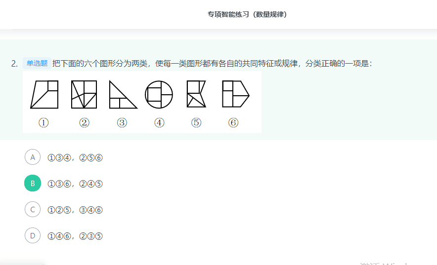
      ```

      ```
      2. (考点的数量：这种九宫格如果横着加，竖着加没有规律，那就试试斜着加，看看数量是不是相同)

      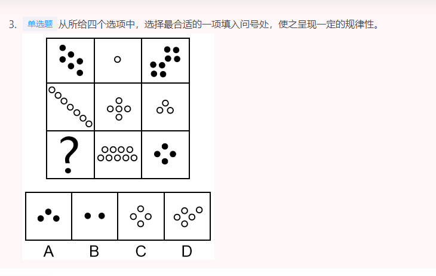
      
      ```
        备注：本题的框架参照我国古代文明图案“河图洛书”所命制（如下图），在河图上，排列成数阵的黑点和白点，蕴藏着无穷的奥秘；在洛书上，纵、横、斜三条线上的三个数字，其和皆等于15。本题选取的即是洛书的排列形式，因此考虑横向、纵向、斜向相加均为15也是可以的。
      ```
      3. (元素组成不同，出现多个独立小元素，优先考虑元素种类和数量规律：数量相加，相减，都可以试试)

      
      ```
        元素组成不同，出现多个独立小元素，优先考虑元素种类和数量规律。每幅图都是由正方形和圆两种元素组成，且每幅图正方形的数量比圆的数量多1个，只有C项符合。

        故正确答案为C。
      ```
      4. (面的细化，发现题干每幅图都包含两个相同面)

      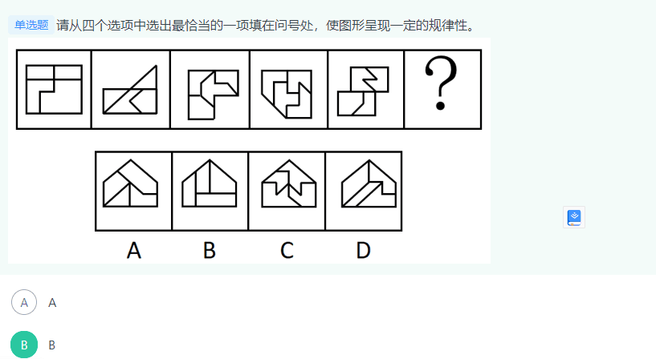
      ```
      元素组成不同，且无明显属性规律，优先考虑数量规律。观察发现，题干图形明显被分割，优先考虑面数量。整体数面发现，题干和选项都为4个面，继续考虑面的细化，发现题干每幅图都包含两个相同面，观察选项，只有B项符合。

      故正确答案为B。
      ```
      5. (点的数量规律：两个点两两相加 等于第三个数的值。)

      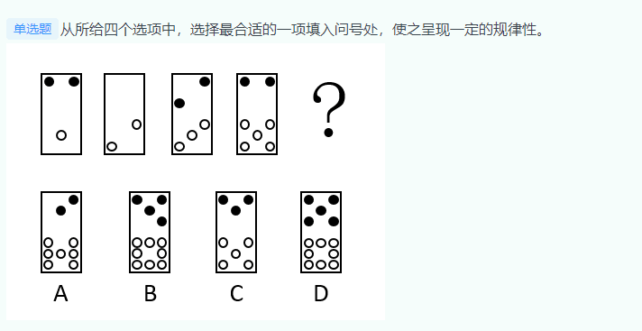
      ```
        元素组成不同，且无明显属性规律，优先考虑数量规律。题干由若干小元素构成，考虑素的数量，其中白元素的个数分别为：1、2、3、5、？，没有明显的规律，再次观察发现存在、的运算规律，？处应该为，排除A、C两项；黑元素的个数分别为：2、0、2、2、？，同样存在、的运算规律，？处应该为，对应B项。

        故正确答案为B。
      ```
      6. (面的细化，发现九宫格每行面的数量相加都等于同一个数字)

      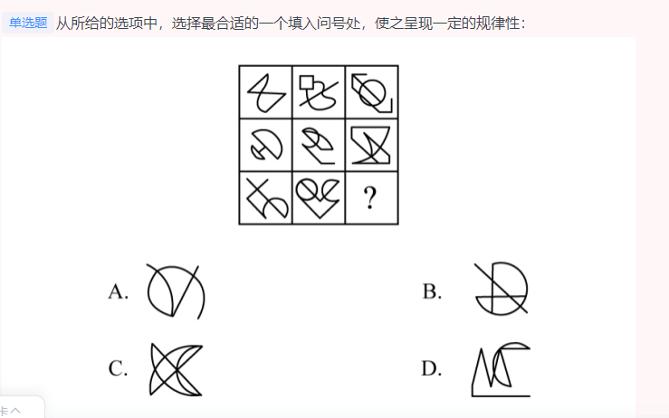
      ```
        解析一：元素组成不同，且无明显属性规律，考虑数量规律。九宫格优先横行看，观察发现题干图形出现若干空白区域，考虑面数量。第一行中面数量分别为2、3、4，第二行分别为2、3、4，第三行分别为2、4，单独看没有规律，但是每一行面数量和均为9，故“？”处应选择有3个面的图形，只有D项符合。

        解析二：元素组成不同，且无明显属性规律，考虑数量规律。九宫格优先横行看，观察发现题干图形有曲有直，优先考虑曲直交点，但并无明显规律，再次观察发现，题干图形出现多组平行线，考虑数平行线数量。第一行中平行线的数量分别为一组、两组、三组，经验证第二行符合此规律。故第三行的“？”处应选择有三组平行线的图形。只有D项符合。
      ```
      7. (如果图形有干扰图形又有很明显的横线竖线，可以数一下横线竖线的数量。)

      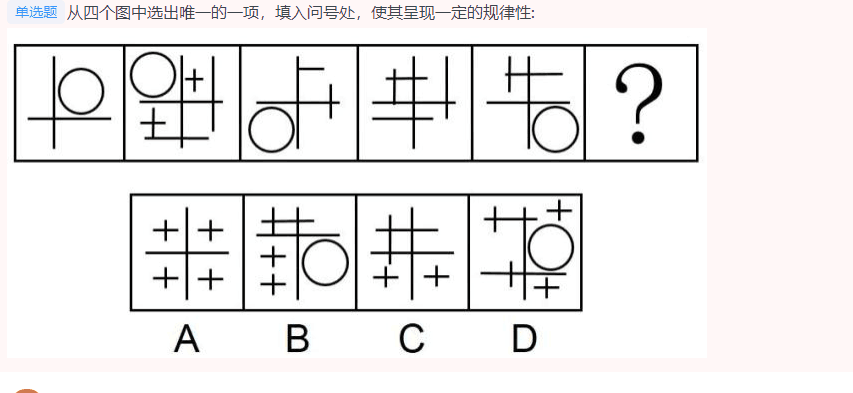
      ```
        元素组成不同，且无明显属性规律，优先考虑数量规律。观察发现，题干图形中的线条较多，并且均为横线和竖线，考虑数横线和竖线。横线数依次为：1、4、2、3、2，竖线数依次为1、4、2、3、2，即横线和竖线的数量相等，排除D项；再观察图形，发现题干图形都是有1个面，排除A、B项，符合此规律的只有C项。

        故正确答案为C。
      ```
      8. (面的复合考点，面的数量和多边形的边数是否相等)

      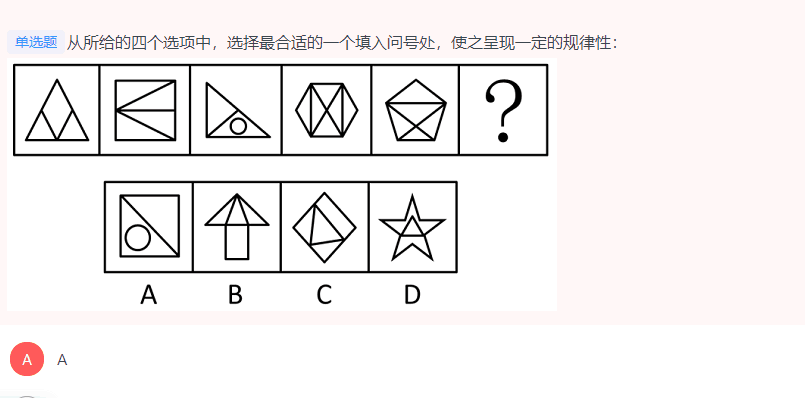
      ```
        元素组成不同，且无明显属性规律，优先考虑数量规律。观察发现，题干图形封闭区域明显，优先考虑数面，题干图形的面数量依次为3、4、3、6、5、？，单独数面无规律；继续观察发现，题干图形的外框均为多边形，考虑数外框直线数，外框直线数依次为3、4、3、6、5、？，规律为面数量=外框直线数量，只有C项符合此规律。

        故正确答案为C。
      ```
      9. (面的复合，如果光数面没有规律，则可以考虑其他因素，比如面的里面的直角数量有没有规律。)

      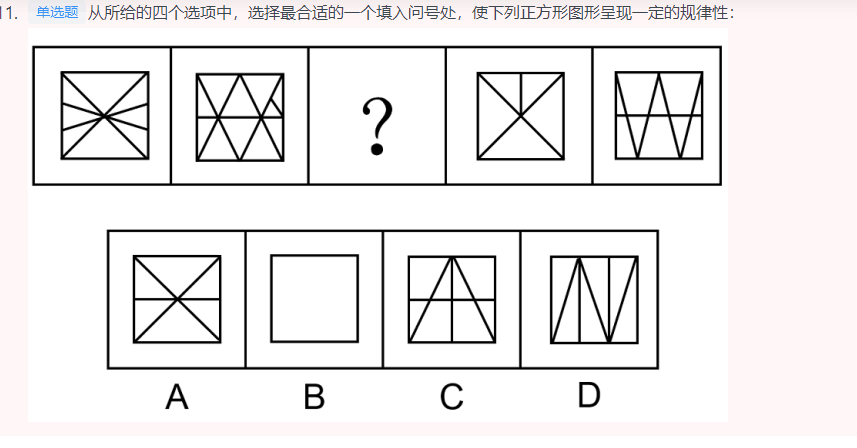
      ```
        元素组成不同，且无明显属性规律，优先考虑数量规律。观察题干图形，发现图形分割明显，可考虑面数量，但面数量无规律。再次观察发现，分割后的图形三角形较多，且明显存在直角，可考虑单一直角数。题干图形的单一直角数分别为2、3、？、5、6，故？处图形的单一直角数应为4，只有B项符合。

        故正确答案为B。
      ```
      10. (素的考点，包括小元素和部份数。 素不一定是很生活化的图形，作为考点。像百分号这种也算。除号这种也可以考虑。)

      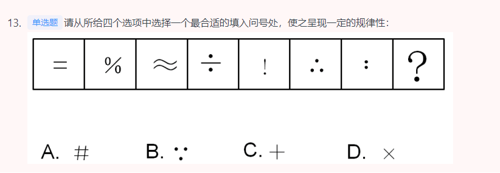
      ```
        观察图形特征，元素组成不同，发现题干图形部分数分别为：2、3、2、3、2、3、2，因此？处应该是一个三部分的图形，ACD都是一部分图形，故选B选项。

        故正确答案为B。
      ```
      11. (汉字规律：面无规律，则考虑横竖规律。横的数量等于竖的数量)

      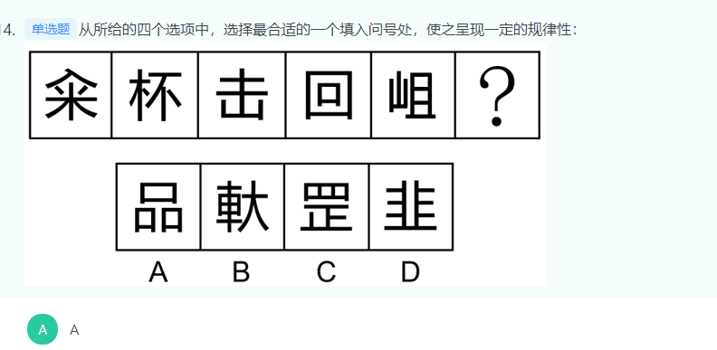
      ```
        元素组成不同，且无明显属性规律，优先考虑数量规律。题干汉字比较简单且存在窟窿面，但笔画数和面数量均无规律。观察题干发现，“回”字存在明显的横线和竖线，题干其他汉字也具备相同特点，优先考虑横线和竖线的数量。题干图形横线数依次为：1、2、3、4、5，竖线数依次为1、2、3、4、5，即横线和竖线的数量相等，只有A项符合。

        故正确答案为A。
      ```
      12. (走投无路笔画数)

      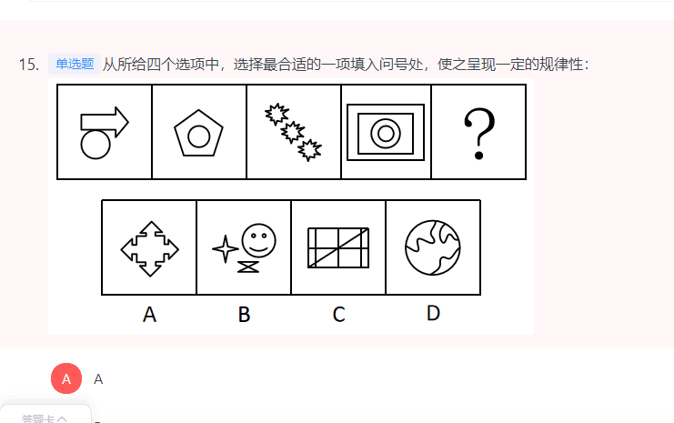
      ```
        元素组成不同，且无明显属性规律，考虑数量规律。观察发现，题干第一幅图为两个图形相切，其他几幅图均由多个部分构成，可以考虑部分数和笔画数，但考虑部分数无答案，题干四幅图形的笔画数依次为1、2、3、4，故“？”处选一个5笔画的图形，只有C项符合。
      ```
      13. (素：考的是合并起来的规律。)

      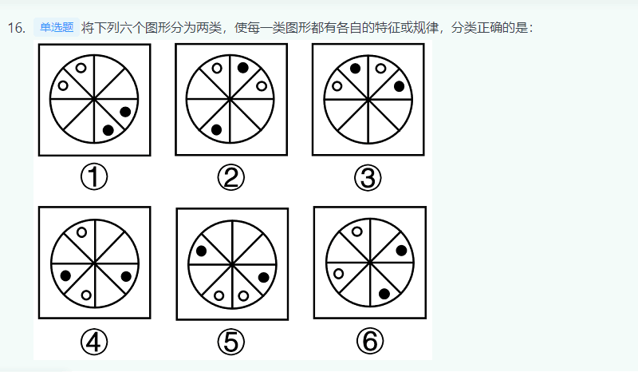
      ```
        本题为分组分类题目。元素组成相同，但无明显位置规律，观察发现，题干图形均由2个白球和2个黑球组成，考虑相同元素的位置。图156中白球到白球无需经过黑球，图②③④中白球到白球必须经过黑球，且黑球满足同样的规律，故图①⑤⑥为一组，图②③④为一组。

        故正确答案为B。
      ```
      14. (出现三种元素，就算是九宫格出现三种素，也记得要数数量。)

      
      ```
        题干所有图形中均出现黑块、白块、阴影3种元素，单独看黑块和阴影元素的个数并无明显规律，考虑白块个数，题干依次是1、2、3、4、？，故？处应选择白块个数为5的选项，对应C项。

        故正确答案为C。
      ```
      15. (考直角个数的情况也挺多。)

      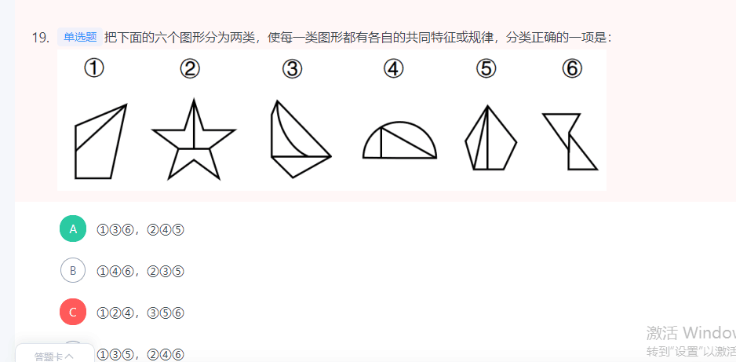
      ```
        本题为分组分类题。元素组成不同，且无明显属性规律，考虑数量规律。观察题干图形发现，每个图形均存在两条直线垂直相交，考虑直角数。图136有一个直角，图②④⑤有两个直角，即图①③⑥为一组，图②④⑤为一组。

        故正确答案为A
      ```
      16. (部分数+黑球数量：图形元素组成相同，但无位置规律，且无属性规律，考虑数量规律。观察发现，题干图形的黑球数均为3，排除B项；继续观察发现，题干图形的黑白球被分隔开，因此考虑部分数。黑球的部分数依次是1、3、2、2、2，无规律；再观察白球的部分数，发现白球的部分数均为2，故？处应选择白球的部分数为2的图形，只有D项符合)

      

      17. (走投无路数奇点)

      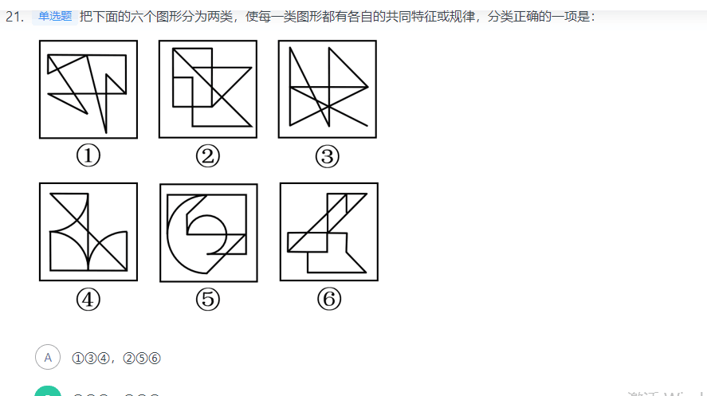
      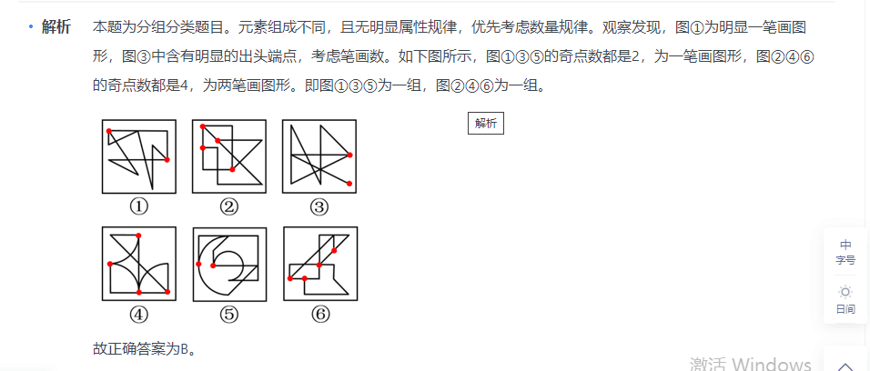

    
      18. (考到了切点数)

      
      ```
        元素组成不同，且无明显属性规律，考虑数量规律。观察发现，题干每幅图形均存在明显的圆和直线，且圆与直线多存在相切，优先考虑切点数。第一组图切点数分别为0、1、2，数量递增；第二组图切点数分别为2、3、？，故问号处图形的切点数应为4，只有D项满足规律。

        故正确答案为D。
      ```
      19. (甚至可以看图形平行线的数量)

      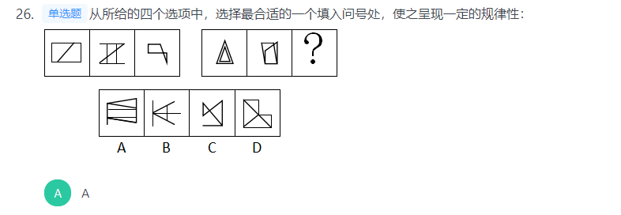
      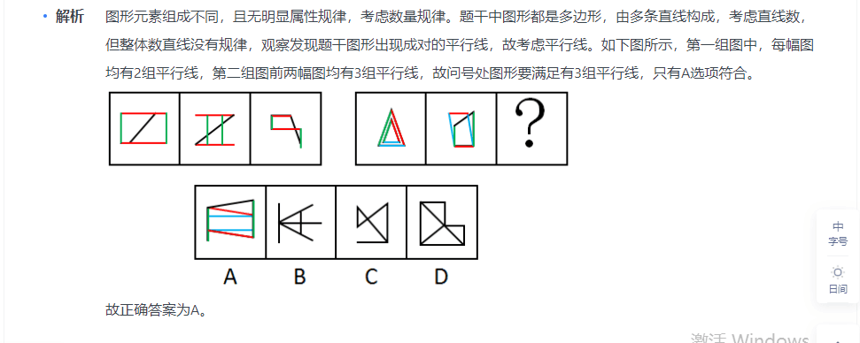
      ```
        图形元素组成不同，且无明显属性规律，考虑数量规律。题干中图形都是多边形，由多条直线构成，考虑直线数，但整体数直线没有规律，观察发现题干图形出现成对的平行线，故考虑平行线。如下图所示，第一组图中，每幅图均有2组平行线，第二组图前两幅图均有3组平行线，故问号处图形要满足有3组平行线，只有A选项符合
      ```
      20. (有时候九宫格可以一列一列的观察数量变化。)

      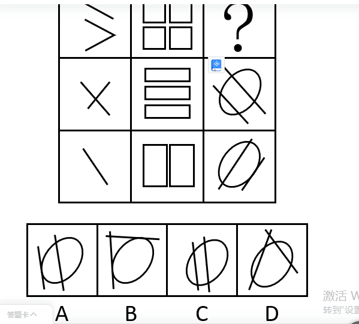
      ``` 
        元素组成不同，且无明显属性规律，考虑数量规律。第一列图一中出现了单一直线，考虑数直线，第一列直线数分别为3、2、1；第二列封闭面明显，考虑面数量，分别为4、3、2；第三列线条交叉明显，考虑交点数，分别为？、4、3。所以问号处交点数应该为5，只有D项符合。

        故正确答案为D。

        注：第三列数面也可以，选4个面的图形，也只有D项符合。
      ```
      21. (记得数直角)

      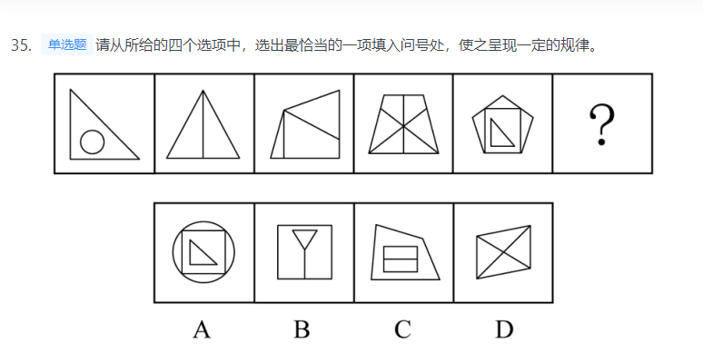
      ```
          元素组成不同，且无明显属性规律，优先考虑数量规律。题干图1和图5有明显的单一直角三角形，且图2是一个三角形被分割成两个明显的直角三角形，考虑直角数量。观察发现，题干图形的直角数量分别为1、2、3、4、5，故？处图形的直角数量应为6。B项直角数量为6，当选；A项直角数量为5，C项直角数量为8，D项直角数量为0，均排除。

          故正确答案为B。
      ```
      22. (题干图形均有4个尖角朝上的正三角形)

      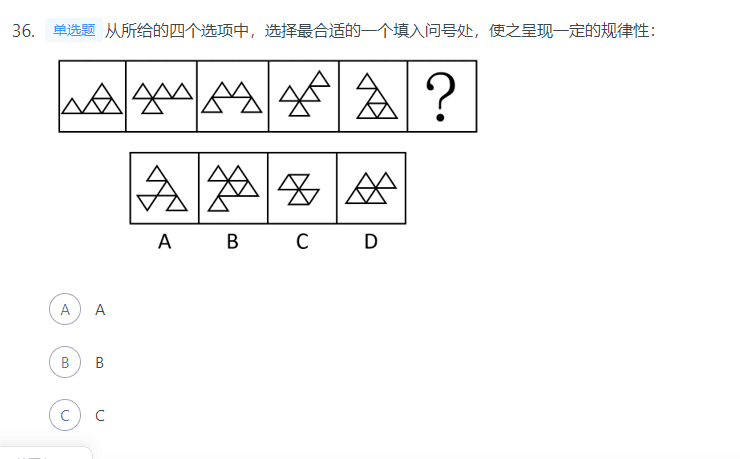
      ```
        观察发现，题干图形均由小三角形构成，优先考虑素。题干图形均有4个尖角朝上的正三角形，只有D项符合规律。

        故正确答案为D。
      ```
      23. (有时候觉得是生活的图案，其实要数笔画。)

      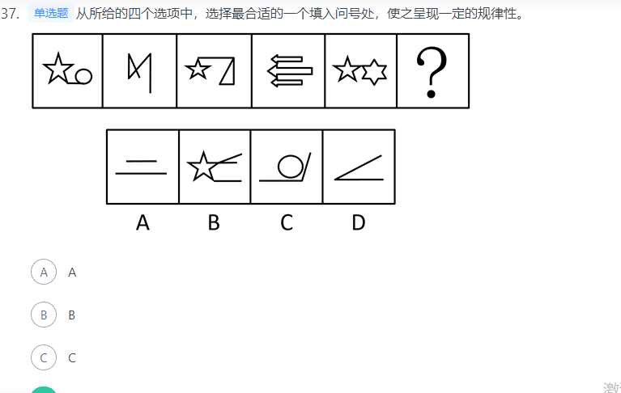
      ```
        元素组成不同，且无明显属性规律，考虑数量规律。图2出现端点，且明显为一笔画图形，图4、图5都是封闭图形相切，为切圆变形，优先考虑笔画数，题干均为一笔画图形，故问号处图形也应该为一笔画，A、B、C均为两笔画，只有D项为一笔画。

        故正确答案为D。
      ```
      24. (考素，一部分 和多部分图形)

      
      ```
        本题为分组分类题目。元素组成不同，且无明显属性规律，考虑数量规律。观察发现，图①③④中相同的图形均相连，为1个部分；图②⑤⑥中相同的图形均不相连，为多个部分。即图①③④为一组，图②⑤⑥为一组。

        故正确答案为B。       
      ```
    

  4. 空间类（共1道，答对0道，正确率0%，用时2分钟）
  #### 定义判断（共10道，答对6道，正确率60%，用时14分钟）！！

  1. 单定义（共5道，答对4道，正确率90%，用时9分钟）
    （1） 主客体 
    （2） 大前提 （共1道，答对0道，正确率0%，）
    （3） 方式目的 
    （4） 原因结果 
  2. 多定义（共5道，答对2道，正确率40%，用时6分钟）
     
      （1） 常规问法 （共5道，答对2道，正确率40%，用时6分钟）
      内涵和外延的反变关系是指具有属种关系的概念之间所具有的一种相互联系、相互制约的关系。
    1. (有时候看不懂的题型要记得是何种关系。比如这道题就是种属关系。)
    ```
      概念的内涵是指概念所反映的事物具有的本质属性（或特有属性），它是从质的方面反映概念的。概念的外延是指具有概念所反映的本质属性（或特有属性）的那些事物，它是从量的方面反映概念的。内涵和外延的反变关系是指具有属种关系的概念之间所具有的一种相互联系、相互制约的关系。一个概念的外延越大，它的内涵越少；一个概念外延越小，它的内涵越多。反之，一个概念的内涵越多，它的外延越小；一个概念内涵越少，它的外延越大。根据上述定义，下列哪组概念体现了概念内涵与外延的反变关系？

      A

      司法机关，最高审判机关，最高人民法院

      B

      水杯，热水杯，大号热水杯

      C

      中国，新疆，乌鲁木齐

      D

      中国人，文学家，鲁迅


      正确答案是： B，你的答案是： D收起
      解析
      第一步：判断题干中的关键词。

      内涵和外延反变关系的关键词：属种关系的概念。

      第二步：逐一分析选项。

      A项：最高审判机关和最高人民法院所指相同，是全同关系，不符合定义，排除。

      B项：从水杯到热水杯到大号热水杯，内涵依次增多，外延依次减少，且三者是种属关系，符合定义，当选。

      C项：中国、新疆和乌鲁木齐三者是组成关系，不符合定义，排除。

      D项：文学家有中国人也有外国人，二者是交叉关系，不符合定义，排除。

      故正确答案为B。
    ```
    2.  (著录：在编制文献目录时，对文献内容和形式进行分析、选择和记录。所以A不是。这种题要把要求拿笔写个123出来然后对比)
    ```
    一次文献，又称原始文献，指以作者本人的工作经验、观察或者实际研究成果为依据而创作的具有一定发明创造和一定新见解的原始文献。二次文献是对一次文献进行加工整理后的产物，即对无序的一次文献的外部特征如题名、作者、出处等进行著录，或将其内容提炼压缩成提要或文摘，并按照一定的学科或专业加以有序化而形成的文献形式。

      根据上述定义，下列属于二次文献的是：

      A

      小刘摘抄优美词句的“好词好句”手册

      B

      小李整理实验记录、处理数据后写出的文章

      C

      小郭从出版社拿到的经济类新书目录和简介

      D

      小赵购买的急救手册


      正确答案是： C，你的答案是： A收起
      解析
      第一步：找出定义关键词。

      一次文献：“以作者本人的工作经验、观察或者实际研究成果为依据”、“创作的具有一定发明创造和一定新见解的原始文献”；

      二次文献：“对一次文献进行加工整理后的产物”、“对无序的一次文献的外部特征如题名、作者、出处等进行著录”、“将其内容提炼压缩成提要或文摘”、“按照一定的学科或专业加以有序化”、“文献形式”。

      第二步：逐一分析选项。

      A项：小刘自己摘抄“好词好句”手册，既不符合“进行著录”，也不符合“将其内容提炼压缩成提要或文摘”，不符合二次文献的定义，排除；

      B项：整理实验记录、处理数据后写出的文章是小李根据实际研究成果而创作的原始文献，属于一次文献，而不属于二次文献，不符合二次文献的定义，排除；

      C项：经济类新书是一次文献，经济类新书目录和简介符合“将其内容提炼压缩成提要或文摘”，也符合“按照一定的学科或专业加以有序化”的“文献形式”，符合二次文献的定义，当选；

      D项：小赵购买的急救手册不明确符不符合“对一次文献进行加工整理后的产物”，不符合二次文献的定义，排除。

      故正确答案为C。
    ```
    3. (混合物是由两种或多种物质混合而成的物质。而分子是由原子组成的。具有不同数量质子的原子不是同一类元素。因为质子数目不同代表原子数目不同。)
    ```

    元素指自然界中一百多种基本的金属和非金属物质，它们由一种原子组成，其原子中的每一个核子具有同样数量的质子，用一般的化学方法不能使之分解，并且能构成一切物质。原子是化学反应不可再分的基本微粒，原子在化学反应中不可分割，但在物理状态中可以分割，由原子核和绕核运动的电子组成。分子由原子构成，是构成物质的一种基本粒子的名称，是单独存在、保持化学性质最小的粒子。

      根据上述定义，下列选项正确的是：

      A

      原子是构成物质的最小粒子

      B

      空气由各种细小的原子构成

      C

      具有不同数量质子的原子不是同一类元素

      D

      一氧化碳分子（CO）由一个氧元素和一个碳元素构成


      正确答案是： C，你的答案是： B收起
      解析
      第一步：找出定义关键词。

      “元素是指自然界中一百多种基本的金属和非金属物质”，“元素由一种原子组成，其原子中的每一个核子具有相同数量的质子”，“原子用一般的化学方法不能使之分解，并且能构成一切物质”，“原子是化学反应不可再分的基本微粒，原子在化学反应中不可分割，但在物理状态中可以分割，由原子核和绕核运动的电子组成”，“分子由原子构成，是构成物质的一种基本粒子的名称，是单独存在，保持化学性质最小的粒子”。

      第二步：逐一分析选项。

      A项：原子是构成物质的最小粒子，不符合“在物理状态中可以分割”，不符合定义，排除；

      B项：空气是一种混合物，不可能是由细小的原子构成，不符合定义，排除；

      C项：具有不同数量质子的原子不是同一类元素，符合“元素由一种原子组成，其原子中的每一个核子具有相同数量的质子”，符合定义，当选；

      D项：选项不符合“分子由原子构成，是构成物质的一种基本粒子的名称，是单独存在，保持化学性质最小的粒子”，一氧化碳分子（CO）应该是由一个氧原子和一个碳原子构成，不符合定义，排除。

      故正确答案为C。
    ```
    4. (我感觉多定义还是得所有定义都看一下，因为有时候你会错过一种关系以为他就属于另种关系。b属于反对称关系。)
    ```

    对于特定论域中的任意两个对象a、b而言，当对象a与对象b之间具有关系R时，对象b与对象a之间是否也具有关系R？基于此，对称性关系命题可分为正对称关系、反对称关系和半对称关系。（1）正对称关系：若对象a与b之间具有关系R，则对象b与a之间也具有关系R；（2）反对称关系：若对象a与b之间具有关系R，则对象b与a之间一定不具有关系R；（3）半对称关系：若对象a与b之间具有关系R，则对象b与a之间不一定具有关系R。

      根据上述定义，下列关系属于半对称关系的是：

      A

      学生之间的同学关系

      B

      两个分数之间的小于关系

      C

      人与人之间的帮助关系

      D

      城市与城市之间的相邻关系


      正确答案是： C，你的答案是： B收起
      解析
      第一步：找出定义关键词。

      正对称关系：“若对象a与b之间具有关系R，则对象b与a之间也具有关系R”；

      反对称关系：“若对象a与b之间具有关系R，则对象b与a之间一定不具有关系R”；

      半对称关系：“若对象a与b之间具有关系R，则对象b与a之间不一定具有关系R”。

      第二步：逐一分析选项。

      A项：若学生a与学生b之间具有同学关系R，则学生b与学生a之间也具有同学关系R，符合“若对象a与b之间具有关系R，则对象b与a之间也具有关系R”，符合“正对称关系”定义，不符合“半对称关系”定义，排除；

      B项：若分数a与分数b之间具有小于关系R，则分数b与分数a之间一定不具有小于关系R，而是具有大于关系，符合“若对象a与b之间具有关系R，则对象b与a之间一定不具有关系R”，符合“反对称关系”定义，不符合“半对称关系”定义，排除；

      C项：若一个人a帮助了另一个人b（即a与b之间具有帮助关系R），不能确定b是否也帮助了a（即b与a之间不一定具有帮助关系R，可能有也可能没有），符合“若对象a与b之间具有关系R，则对象b与a之间不一定具有关系R”，符合“半对称关系”定义，当选；

      D项：若城市a与城市b之间具有相邻关系R，则城市b与城市a之间也具有相邻关系R，符合“若对象a与b之间具有关系R，则对象b与a之间也具有关系R”，符合“正对称关系”定义，不符合“半对称关系”定义，排除。

      故正确答案为C。
    ```
    5. (错是因为，没有代入想想对不对。没有对比。立遗嘱肯定是因为凭借法律效应才写的，但是撰写论文，一开始并不是为了法律效应写的，只是写完了才有法律效应。)
    ```

    根据行为人是否进行意思表示，可以将民法上的行为分为表意行为和非表意行为。表意行为，是指行为人通过意思表示进行的行为；非表意行为是指当事人无须意思表示而实施的行为，主要包括事实行为、违法行为。事实行为是指行为人主观上并没有产生民事法律关系的意思，而是依照法律的规定引起民事法律关系后果的行为。

    根据上述定义，下列属于事实行为的是：

    A

    张三和李四签订房屋租赁合同

    B

    李大爷感觉自己时日无多，立下遗嘱

    C

    王教授撰写了一篇论文，获得该论文的著作权

    D

    赵老板把自己的财产赠与伺候自己多年的保姆


    正确答案是： C，你的答案是： B收起
    解析
    第一步：找出定义关键词。

    表意行为：“通过意思表示”；

    非表意行为：“无须意思表示”；

    事实行为：“主观上没有产生民事法律关系的意思”、“引起民事法律关系后果”。

    第二步：逐一分析选项。

    A项：张三和李四签订租赁合同，主观上有产生民事法律关系的意思，不符合“主观上没有产生民事法律关系的意思”，不符合定义，排除； 

    B项：李大爷感觉自己时日无多，立下遗嘱，主观上有产生民事法律关系的意思，不符合“主观上没有产生民事法律关系的意思”，不符合定义，排除；

    C项：王教授撰写论文，主观上没有产生民事法律关系的意思，而是依照法律的规定，获得该论文的著作权，引起了民事法律关系后果，符合定义，当选；

    D项：赵老板把财产赠与保姆，主观上有产生民事法律关系的意思，不符合“主观上没有产生民事法律关系的意思”，不符合定义，排除。

    故正确答案为C。
    ```
    6. (不知道为啥错，A是不确定而不是一定。B项，你想加就可以得到结果。)
     
  
    7. (这道题最好用对比择优。我选D就是因为没有对比。国家关系很复杂，不是通过，简单造桥，限制游客数量，销量进货，可以判断出来的。)
    ```

    结构化决策是对某一决策过程的环境及规则，能用确定的模型或语言描述，以适当的算法产生决策方案，并能从多种方案中选择最优解的决策。非结构化决策是指决策过程复杂，不可能用确定的模型和语言来描述其决策过程。更无所谓最优解的决策。

    根据上述定义，下列属于非结构化决策的是：

    A

    某国确定将与周边国家大力发展伙伴关系

    B

    某市要再建造一座长江大桥

    C

    某景点限制游客进入数量

    D

    某网店根据销量确定进货品类


    正确答案是： A，你的答案是： D收起
    解析
    第一步：找出定义关键词。

    结构化决策：“对某一决策过程的环境及规则”、“能用确定的模型或语言描述”、“以适当的算法产生决策方案”、“并能从多种方案中选择最优解的决策”。

    非结构化决策：“决策过程复杂”、“不可能用确定的模型和语言来描述其决策过程”、“更无所谓最优解的决策”。

    第二步：逐一分析选项。

    A项：某国确定将与周边国家大力发展伙伴关系，伙伴关系比较抽象的，符合“不可能用确定的模型和语言来描述其决策过程”，符合“非结构化决策”定义，当选；

    B项：某市要再建造一座长江大桥，大桥的方案是可以确定描述的，不符合“不可能用确定的模型和语言来描述其决策过程”，不符合“非结构化决策”定义，排除；

    C项：某景点限制游客进入数量，游客的数量是可以具体描述的，可以有最优解的决策，不符合“不可能用确定的模型和语言来描述其决策过程”，不符合“非结构化决策”定义，排除；

    D项：某网店根据销量确定进货品类，进货品类可以用确定的模型和语言来描述其决策过程，不符合“不可能用确定的模型和语言来描述其决策过程”，不符合“非结构化决策”定义，排除。

    故正确答案为 A。
    ```
    8. (这道题最好也对比，选，因为A,b,d都是前提为真，然后结论为真。但是C不是)
    ```

    演绎推理是指结论已经蕴含在前提中；前提为真，结论也必然为真的推理。归纳推理是指结论并不完全蕴含在前提中；前提为真，结论不必然为真的推理。

      根据上述定义，下列属于归纳推理的是：

      A

      如果并且，那么


      B

      所有天鹅都是白的，因此在南极发现的天鹅也是白的


      C

      样品的合格率是，因此这批产品的合格率也是


      D

      甲生于1980年，而乙生于1981年，因此甲和乙不是同一个人


      正确答案是： C，你的答案是： D收起
      解析
      第一步：找出定义关键词。

      演绎推理：“结论已经蕴含在前提中”、“前提为真，结论也必然为真”；

      归纳推理：“结论并不完全蕴含在前提中”、“前提为真，结论不必然为真”。

      第二步：逐一分析选项。

      A项：该项中“如果”所在句子为前提，,，蕴含着这一结论，符合“结论已经蕴含在前提中”，属于演绎推理，不属于归纳推理，排除；

      B项：该项“所有天鹅都是白的”为前提，强调的是所有天鹅，所以无论在哪发现的天鹅都是白的，符合“前提为真，结论也必然为真”，属于演绎推理，不属于归纳推理，排除；

      C项：该项“样品的合格率是”为前提，强调的是全部的产品中的一部分，一部分产品的合格率为，并不能说明所有产品的合格率是，符合“前提为真，结论不必然为真”，符合归纳推理，当选；

      D项：该项中“甲生于1980年，而乙生于1981年”为前提，出生年份不一样，那说明一定不是同一个人，符合“前提为真，结论也必然为真”,属于演绎推理，不属于归纳推理，不符合定义，排除。

      故正确答案为C。
    ```
    9. (打招呼是没完成的注意，所以不选。)
    ```
    定义：

    （1）无意注意：是指没有预定目的、不需要意志努力、不由自主地对一定事物所产生的注意。

    （2）有意注意：是指自觉的、有预定目的的，必要时还需要付出一定意志努力的注意。

    根据上述定义，下列选项同时包含了无意注意和有意注意的是（    ）。

    A

    小昕在上班时看到路过的领导很不高兴，认为是自己工作出了错

    B

    小晖想买一本时尚杂志，上网搜索了很久都没有满意的

    C

    小妍下班时看到了临街橱窗里的一件裙子，她立即到店里试穿并察看面料和样式

    D

    小军在外吃饭时看到了高中同桌，正准备打招呼看到领导走了过来


    第一步：找出定义关键词。

    无意注意：“没有预定目的、不需要意志努力、不由自主”、“对一定事物所产生的注意”。

    有意注意：“自觉的、有预定目的的，必要时还需要付出一定意志努力”。

    需要强调，题干两个定义都有提到“注意”一词，“注意”的意思是：


    即“注意”既要有感官上的视觉、听觉、味觉等，又要有思维的处理。

    第二步：逐一分析选项。

    A项：小昕在上班时看到路过的领导，符合“没有预定目的、不需要意志努力、不由自主”，“对一定事物所产生的注意”，且既有视觉，又有思维，符合无意注意，“认为是自己工作出了错”，只有思维，没有感官上的视觉、听觉、味觉，不属于题干的任何一个定义，所以选项中只有“无意注意”，排除；

    B项：小晖想买一本时尚杂志，上网搜索了很久都没有满意的，上网搜索符合“自觉的、有预定目的的，必要时还需要付出一定意志努力”，且既有视觉，又有思维，符合有意注意，但选项里面不包含无意注意，排除；

    C项：小妍下班时看到了临街橱窗里的一件裙子，符合“没有预定目的、不需要意志努力、不由自主”，“对一定事物所产生的注意”，且既有视觉，又有思维，符合“无意注意”定义；她立即到店里试穿并察看面料和样式，符合“自觉的、有预定目的的，必要时还需要付出一定意志努力”，且既有视觉，又有思维，符合“有意注意”定义，当选；

    D项：小军在外吃饭时看到了高中同桌，符合“没有预定目的、不需要意志努力、不由自主”，“对一定事物所产生的注意”，且既有视觉，又有思维，符合无意注意；正准备打招呼，说明还没来得及打招呼，不存在“有意注意”和“无意注意”；看到领导走了过来，也不需要意志努力，符合“没有预定目的、不需要意志努力、不由自主”，“对一定事物所产生的注意”，且既有视觉，又有思维，也符合“无意注意”。但选项里面不包含有意注意，排除。

    故正确答案为C。
    ```
    10. (要注意通过明确的规章制度结成正规关系。所以选c)
    ```
    初级群体指的是由面对面互动所形成的、具有亲密的人际关系和浓厚的感情色彩的社会群体；次级群体指的是其成员为了某种特定的目标集合在一起，通过明确的规章制度结成正规关系的社会群体。

      根据上述定义，下列涉及次级群体的是：

      A

      亲友团来到比赛现场为小李助威

      B

      小赵要到大城市上学了，山里的乡亲们都到村口为他送行

      C

      小王考上了研究生，公司的同事一起为他庆贺

      D

      20年之后，小张儿时的玩伴建立了一个微信群


      正确答案是： C，你的答案是： D收起
      解析
      第一步：找到关键词。

      关键词为初级群体是由“面对面互动所形成”、“具有亲密的人际关系和浓厚的感情色彩”，次级群体是为了“某种特定的目标”、“通过明确的规章制度”。

      第二步：逐一分析选项。

      A项：亲友团来到比赛现场为小李助威，群体为亲友团，是通过血缘关系或共同爱好结成的，而不是通过“明确的规章制度”，不符合定义，排除；

      B项：小赵考上大学山里乡亲为他送行体现的是一种人际关系和感情色彩，属于初级群体，没有涉及到特定的目标和规章制度，排除；

      C项：小王考上研究生，同事为他庆祝，这个群体指的是公司群体，大家的共同目标就是努力工作，把公司搞好，同时这个关系群中有严格的公司规章制度，属于次级群体，当选；

      D项：小张的玩伴建立了微信群体现的是亲密的人际关系，属于初级群体，没有涉及到特定的目标和规章制度，排除。

      故正确答案为C。
    ```

    11. (错是因为我没看到大前提。要注意层级，社会经济干旱也属于农业干旱。水分缺失；)
    ```

    农业干旱是指在作物生育期内，由于土壤水分不足而造成作物体内水分亏缺，影响作物正常生长发育。水文干旱是指由于降水的长期短缺而造成某段时间内地表水或地下水收支不平衡，出现水分短缺，使江河流量、湖泊水位、水库蓄水等减少的现象。社会经济干旱是指由自然系统与人类社会经济系统中水资源供需不平衡造成的异常水分短缺现象，如果需大于供，就会发生社会经济干旱。

      根据上述定义，下列选项属于社会经济干旱范畴的是：

      A

      一月未雨，某著名河流流域出现大规模的河床裸露现象

      B

      地铁建设施工队不慎挖破水管，导致几个小区停水一天

      C

      常年少雨致使某工业区推行按时段浮动征收水费的办法

      D

      半月不曾下雨，某地水稻出现穗长缩短、穗粒减少现象


      正确答案是： C，你的答案是： B收起
      解析
      第一步，提取定义关键词句。

      题干中出现三个定义，均为原因结果类句式。

      农业干旱的原因是“土壤水分不足”，结果是“作物体内水分亏缺，影响作物正常生长发育”；

      水文干旱的原因是“降水的长期短缺”，结果是“水分短缺，使江河流量、湖泊水位、水库蓄水等减少的现象”；

      社会经济干旱的原因是“自然系统与人类社会经济系统供需不平衡”，结果是“异常水分短缺现象”。

      第二步：逐一分析选项。

      A项：一月未下雨，原因为“降水的长期短缺”，导致河流流域出现大规模的河床裸露现象，符合“水分短缺，使江河流量、湖泊水位、水库蓄水等减少的现象”，属于水文干旱，排除；

      B项：地铁施工建设不属于三个定义中的任何一个原因，小区停水不是干旱，不符合定义，排除；

      C项：自然系统为常年少雨，人类社会经济系统是工业区，是由于“自然系统与人类社会经济系统供需不平衡”而导致了异常水分短缺现象，因此进行了按时段浮动征收水费，属于社会经济干旱，当选；

      D项：半月不曾下雨导致“土壤水分不足”，水稻穗长缩短、穗粒减少现象符合“作物体内水分亏缺，影响作物正常生长发育”，属于农业干旱，排除。

      故正确答案为C。
    ```

    12. (这道题错是因为乜有细想。因为溯源法是要将来源。枕头咋会有来源。还是诗句有来源。比喻友情很深。)
    ```

    谜语有多种猜法。比较法是将字形、字义相近或相反的词放在一起，加以比较而扣合谜底；溯源法是追溯谜面的来源及其与原出处的上下关联，然后再扣合谜底；拟物法是将人或人体某部分物化，将谜面字词语义或所言之事物化，扣合谜底。

      ①谜面：枕头。要求打一成语。谜底：置之脑后

      ②谜面：桃花潭水深千尺。要求打一成语。谜底：无与伦比

      ③谜面：加一笔不好，加一倍不少。要求打一字。谜底：夕

      关于①②③谜语的猜法，下列判断正确的是

      A

      ①溯源法，②比较法，③拟物法

      B

      ①溯源法，②拟物法，③比较法

      C

      ①比较法，②溯源法，③拟物法

      D

      ①拟物法，②溯源法，③比较法


      正确答案是： D，你的答案是： B收起
      解析
      第一步：找出定义关键词。

      比较法：“将字形、字义相近或相反的词放在一起，加以比较而扣合谜底”。

      溯源法：“追溯谜面的来源及其与原出处的上下关联，然后再扣合谜底”。

      拟物法：“将人或人体某部分物化，将谜面字词语义或所言之事物化，扣合谜底” 。

      第二步：逐一分析三个谜语。

      谜语①：“枕头。要求打一成语。谜底：置之脑后”

      分析：“枕头”指躺着的时候，垫在头下使头略高的卧具，“置之脑后”是说放在脑袋后面，符合“将人或人体某部分物化，将谜面字词语义或所言之事物化，扣合谜底”，属于拟物法。

      谜语②：“桃花潭水深千尺。要求打一成语。谜底：无与伦比”

      分析：“桃花潭水深千尺”出自于李白的《赠汪伦》，原句为：“桃花潭水深千尺，不及汪伦送我情”，含义是：桃花潭千尺深的水都比不上汪伦和我的友情，诗人用潭水深千尺比喻汪伦与他的友情。该谜面通过“追溯谜面的来源及其与原出处的上下关联，然后再扣合谜底”，属于溯源法。

      谜语③：“加一笔不好，加一倍不少。要求打一字。谜底：夕”

      分析：“加一笔不好”，“夕”加一笔是“歹”，“歹”是不好的意思；“加一倍不少”，“夕”再加一倍，也就是两个夕，即“多”，“多”也就是不少的意思。谜面是根据谜底“夕”的字形以及字义相近或相反的词来扣合谜底的，因此属于比较法。

      因而谜语①对应拟物法，谜语②对应溯源法，谜语③对应比较法。

      故正确答案为D。
    ```

    13. (愚公锲而不舍地挖掘太行山，这个是事例子。错是因为想当然没有跟条件一个一个比对。)
    ```

    论据通常可分为事实性论据和理论性论据两种。事实性论据是指用来证明论点的事例、史实和统计数据等。理论性论据是指用来证明论点的、被社会大众所接受或者公认的道理、名言、俗语等。

    根据上述定义，下列论证使用了理论性论据的是：

    A

    人是可以依靠自己的毅力克服困难，走向成功的。尽管命运让贝多芬失去了听觉，但是他最终还是成为了一个伟大的作曲家


    B

    一项研究发现，人平均每隔十分钟就要撒一次谎。所以在我们的日常生活中，没有不撒谎的人，只是谎言有大有小罢了


    C

    只要有恒心，就没有做不成的事情。愚公锲而不舍地挖掘太行、王屋二山，他的精神感动了神灵，终于将山移走


    D

    爱迪生曾说过：“天才是的汗水加上的灵感。”因此要想成功，后天的努力至关重要


    正确答案是： D，你的答案是： C收起
    解析
    第一步：找出定义关键词。

    事实性论据：“指用来证明论点的事例、史实和统计数据等”；

    理论性论据：“指用来证明论点的、被社会大众所接受或者公认的道理、名言、俗语等”。

    第二步：逐一分析选项。

    A项：贝多芬失去了听觉却依然成为了一个伟大的作曲家，属于“用来证明论点的事例”，符合“事实性依据”定义，不符合“理论性依据”定义，排除；

    B项：一项研究发现，人平均每隔十分钟就要撒一次谎，属于“用来证明论点的统计数据”，符合“事实性依据”定义，不符合“理论性依据”定义，排除；

    C项：愚公锲而不舍地挖掘太行、王屋二山，他的精神感动了神灵，终于将山移走，属于“用来证明论点的事例”，符合“事实性依据”定义，不符合“理论性依据”定义，排除；

    D项：爱迪生曾说过：“天才是的汗水加上的灵感”，属于“用来证明论点的、被社会大众所接受或者公认的道理、名言、俗语等”，符合“理论性依据”定义，当选。

    故正确答案为D。
    ```

    14. (最合适的做法是一个一个拿上去比对。会发现4最不合适。不要靠感觉，要比对)
    ```

      主观唯心主义认为人的主观精神（如目的、意志、感觉、经验、心灵等）是世界的本原，客观唯心主义认为上帝、理念等客观精神是先于物质世界并独立于物质世界而存在的本体，而物质世界不过是这种客观精神的外化，前者是本原的、第一性的，后者是派生的、第二性的。

      根据上述定义，下列思想属于客观唯心主义的是：

      A

      相由心生，境由心转

      B

      一花一世界，一草一灵魂

      C

      一切事物的存在是因为它们被我们所感知到

      D

      理是世界万事万物存在的根据


      正确答案是： D，你的答案是： A收起
      解析
      第一步：找出定义关键词。

      主观唯心主义：“人的主观精神（目的、意志、感觉、经验、心灵等）是世界的本原”、“本原的、第一性”；

      客观唯心主义：“上帝、理念等客观精神是先于物质世界并独立于物质世界”、“派生的、第二性”。

      第二步：逐一分析选项。

      A项：“相由心生，境由心转”的意思是环境的美好与恶劣是由心境的快乐与否而决定的，符合主观精神中的“心灵”为世界的本原，符合主观唯心主义，不符合客观唯心主义，排除；

      B项：“一花一世界，一草一灵魂”的意思是每个自我都有一个世界，而且每个世界都是平等且相对独立的，每个世界都互相影响，每个世界的发展方向都取决于其意识体本身，符合“人的主观精神（目的、意志、感觉、经验、心灵等）是世界的本原”，符合主观唯心主义，不符合客观唯心主义，排除；

      C项：一切事物的存在是因为被我们所感知到，符合主观精神中的“感觉”为世界的本原，符合主观唯心主义，不符合客观唯心主义，排除；

      D项：理是世界万事万物存在的根据，符合“理念是先于物质世界并独立于物质世界”，符合客观唯心主义定义，当选。

      故正确答案为D。
    ```

    15. (建议直接把选项带上去和定义作对比，不一个一个细细看，真的不好选)
    ```

    能指和所指是索绪尔语言学的一对术语。索绪尔认为，任何语言符号都是由能指和所指构成的。其中，能指是指符号的物质形式，由声音和形象两部分构成；所指是指语言所反映的事物的概念。而意指则代表了能指与所指之间的关系。意指有两个层次，第一层是直接意指，即语言符号形象具有直接的表现性；第二层是含蓄意指，语言符号形象本身没有直接的表现性，如文学创作中的隐喻、象征、引申等。

      根据上述定义，下列表述错误的是（  ）。

      A

      孩子在公园游玩，看到了五彩缤纷的花朵，喊出了“花”这个字。在这里，被喊出的“花”这个字就是能指

      B

      如果所指是“木本植物的总称”，那么简体中文里的“树”、繁体中文里的“樹”和英语里的“tree”都是对应这一事物的能指

      C

      在网络语言中，网民喜欢用“杯具”来代替“悲剧”。因此，在这里“杯具”二字体现了意指的第一个层次

      D

      在“硕鼠硕鼠，无食我黍”这句诗中具有含蓄意指


      正确答案是： C，你的答案是： B收起
      解析
      第一步：找出定义关键词。

      能指的定义条件是“物质形式”；所指的定义条件是“概念”；意指第一层是语言符号形象具有直接的表现性；第二层是含蓄意指，语言符号形象本身没有直接的表现性。

      第二步：逐一分析选项。

      A项：孩子看到的花，是花的形象，属于物质形式，符合能指的定义条件，表述正确，排除。

      B项：“木本植物的总称”是概念，符合所指的定义条件，而“树”“樹”以及“tree”指的是具体的物质形象，符合能指的定义条件，表述正确，排除。

      C项：“杯具”表达“悲剧”的含义，并不是语言的直接表现性，不符合意指第一层，表述错误，当选。

      D项：“硕鼠硕鼠，无食我黍”是以硕鼠喻剥削者，并不是语言的直接表现性，符合含蓄意指，表述正确，排除。

      本题为选非题，故正确答案为C。
    ```

    16. (看错了，问的是被动求医，而不是强制求医。)
    ```

    
    求医行为，是指人们在感到躯体不适或产生病感时寻求医疗帮助的行为。根据求医的决定是由谁做出的，可以分为主动求医、被动求医和强制求医。主动求医是指当个体产生不适感或病感时，自觉做出决定。被动求医指的是由病人的家属或他人做出求医的决定，病人配合就医。强制求医是指本人不愿求医，但因疾病对本人或社会人群健康构成危害而强行要求其就医。

    根据上述定义，以下属于被动求医的是

    A

    老张的体检报告显示他有轻度脂肪肝，建议可进一步检查和治疗，老张拿到报告后很紧张，赶紧到医院去挂号

    B

    小张牙疼好几天了，一直没有去医院治疗，直到牙疼引发面部肿胀，连张口吃饭都困难了，才不得不去牙科诊治

    C

    刘阿姨最近无缘由地开始说自己没有用了，干脆死了更好，她不愿去医院看病，她的丈夫和儿女苦劝无果，只好硬带她去医院就诊

    D

    中学生小梅放学回家，跟妈妈说今天拉肚子，上了五次厕所，除此之外没有别的不舒服，用不用去医院？妈妈决定带她去医院挂号


    正确答案是： D，你的答案是： C收起
    解析
    第一步：找出定义关键词。

    主动求医：“当个体产生不适感或病感时，自觉做出决定”。

    被动求医：“由病人的家属或他人做出求医的决定，病人配合就医”。

    强制求医：“本人不愿求医，但因疾病对本人或社会人群健康构成危害而强行要求其就医”。

    第二步：逐一分析选项。

    A项：老张在体检报告中发现自己患有轻度脂肪肝后，赶紧到医院去挂号，说明老张是自己主动做出的就医决定，符合“主动求医”定义，不符合“被动求医”定义，排除；

    B项：小张由于牙疼导致面部肿胀无法正常进食，最后去牙科诊治，说明小张是自己做出的就医决定，符合“主动求医”定义，不符合“被动求医”定义，排除；

    C项：刘阿姨的丈夫和女儿苦劝刘阿姨无果后，硬带着她去医院就诊，说明刘阿姨本人是不愿就医的，是家属强行要求她就医，符合“强制求医”定义，不符合“被动求医”定义，排除；

    D项：中学生小梅在告诉妈妈自己拉肚子后，妈妈决定带她去医院，说明小梅就医的决定是由她的家属做出的，符合“被动求医”定义，当选。

    故正确答案为D。
    ```

    17. ()
    ```
    ```

    18. ()
    ```
    ```

    19. ()
    ```
    ```

    20. ()
    ```
    ```

    21. ()
    ```
    ```
  #### 逻辑判断（共10道，答对7道，正确率70%，用时18分钟）！！！
   1. 加强题型（共4道，答对3道，正确率75%，用时7分钟）
    （1） 搭桥
    （2） 补充论据 （共2道，答对1道，正确率50%，）

  2. 削弱题型（共3道，答对1道，正确率33%，用时5分钟）
     
      （1） 削弱论点
      （2） 拆桥 （共1道，答对0道，正确率0%）
      （3） 他因削弱 （共1道，答对0道，正确率0%）
      1. (其实削弱类题型，带着以上三点找选项，正确不会低的。就怕没有带着框架去找选项。错是因为，没有想清楚削弱论点，有时候答案给了你模糊不清，但是你不敢选，却选了否定论据.论点：进入了听时代。否认就要，说这是多维度的时代，而不是只是听时代。)

      ```
        
        在全球范围内，各类有声读物成为一些音频平台快速成长的业务板块，主打声音的娱乐节目不断增加。与此同时，耳机销售正在强劲增长，有估算显示：2019年全球耳机销售额接近210亿美元。据此，有人认为，一个“听时代”正在到来。

        以下哪项如果为真，最能质疑上述结论？

        A

        不爱“看”而爱“听”的听觉型学习者群体人数众多

        B

        “听”为越来越多喜欢利用碎片时间的现代人提供了多线程工作的可能

        C

        从趋势来看，从文本到广播，从视频到VR，媒介形态与时俱进、不断立体化

        D

        世界卫生组织指出，全球12岁至35岁人群中的近半数，即11亿人因经常戴耳机收听音频信息正面临听力损伤的风险


        正确答案是： C，你的答案是： D收起
        解析
        第一步：找出论点和论据。

        论点：一个“听时代”正在到来。

        论据：在全球范围内，各类有声读物成为一些音频平台快速成长的业务板块，主打声音的娱乐节目不断增加。与此同时，耳机销售正在强劲增长，有估算显示：2019年全球耳机销售额接近210亿美元。

        本题论点说的是“听时代”正在到来，论据说的是各类有声读物、主打声音的娱乐节目增加和耳机销售量上涨，论据可以合理推出论点，话题一致，削弱优先考虑削弱论点。

        第二步：逐一分析选项。

        A项：指出听觉型学习者群体人数众多，说明爱“听”的人多，有利于“听时代”的到来，具有加强作用，不能削弱，排除；

        B项：指出“听”对现代人的好处，可以提供更多工作上的便利，有利于“听时代”的到来，具有加强作用，不能削弱，排除；

        C项：指出媒介形态的趋势不断立体化，“立体化”意味着不仅包括“听”，也包括“看”等其他多种形式，证明了新时代并不是单一的“听时代”，削弱论点，当选；

        D项：指出11亿人因经常戴耳机面临听力受损的危险，证明耳机可能会让听力受损，不利于“听时代”的到来，但“听力受损”不代表会“不听”，且戴耳机只是“听”的一种方式，削弱力度不如C项，排除。

        故正确答案为C。
      ```
      2. (有时候，削弱论点。话题一致，且论点为因果关系，削弱可优先考虑因果倒置或他因削弱。如果论点是因果关系。可考虑从，因果倒置或者他因削弱。本文就属于因果论点的削弱。)
      ```
        为加强对青少年的健康监测，科学家分析了4257名青少年的数据，这些孩子在12岁、14岁和16岁的时候，戴着加速计，在至少3天的时间里跟踪他们至少10个小时并随访6年。加速计客观记录佩戴者是否正在进行轻度活动，是否正在进行中度体力活动，或者是否久坐。研究发现，在12岁、14岁和16岁时，每天每增加1个小时的久坐时间，到18岁时抑郁评分分别增加11.1%、8%、10.5%。科学家据此得出结论，青少年久坐，不运动会增加抑郁症风险。

        以下哪项如果为真，最能质疑上述结论？

        A

        这些久坐的青少年大多数沉迷恐怖类游戏，对他们精神造成严重影响

        B

        这些孩子中，家境不好、长期奔波兼职的青少年也会患上抑郁症

        C

        这些孩子中，长期久坐的青少年最终学习成绩普遍好于同龄学生

        D

        与成年人相比，经常久坐不运动的青少年所占比例事实上很低


        正确答案是： A，你的答案是： D收起
        解析
        第一步：找出论点和论据。

        论点：青少年久坐，不运动会增加抑郁症风险。

        论据：研究发现，在12岁、14岁和16岁时，每天每增加1个小时的久坐时间，到18岁时抑郁评分分别增加11.1%、8%、10.5%。

        本题论点和论据都在讨论“青少年久坐”和“抑郁症风险”的关系，话题一致，且论点为因果关系，削弱可优先考虑因果倒置或他因削弱。

        第二步：逐一分析选项。

        A项：“大多数”证明这些久坐的青少年大多存在“沉迷恐怖类游戏”这个因素，且该因素会对他们精神造成严重影响，而抑郁症与精神密切相关，即削弱了题干“久坐”这个原因的唯一性，他因削弱，当选；

        B项：指出题干实验中家境不好、长期奔波兼职的青少年也会患上抑郁症，但并不明确家境不好、长期奔波兼职的青少年身上是否同时存在“久坐”这个因素，不明确项，没有A项直接，排除；

        C项：选项说的是长期久坐的青少年最终学习成绩如何，而论点说的是抑郁症风险，二者话题不一致，无关项，排除；

        D项：选项说的是经常久坐不运动的青少年所占比例低于成年人，而论点讨论的是久坐带来的危害，二者话题不一致，无关项，排除。

        故正确答案为A。
      ```
      3. (这道题错是因为我没分清楚，论点的结构。先后性是因，重要性是果。而C只讲了因果性，没有讲重要性。)
      ```
        在一场关于“传承和创新哪个更重要”的辩论赛中，正方和反方进行了激烈的辩论。正方二辩在发言中提出一种观点：“先后性就等于重要性。”

        作为对上述观点的反驳，以下最为有力的是

        A

        吃一碗面，加点醋是必要的。但你说是以吃面为主，还是以吃醋为主？

        B

        我必须先拧开瓶盖，才能喝到水。这不正说明拧瓶盖是必要的步骤吗？

        C

        正所谓“雄鸡一唱天下白”，但你总不能说天白就是雄鸡唱出来的吧！

        D

        我穿鞋时总习惯先穿左脚，再穿右脚，这就说明左脚比右脚更重要吗？


        正确答案是： D，你的答案是： C收起
        解析
        第一步：找出论点和论据。

        论点：先后性就等于重要性。

        论据：无。

        第二步：逐一分析选项。

        A项：选项讨论的是吃醋与吃面哪个为主，没有体现先后性，话题不一致，无法削弱，排除；

        B项：先拧开瓶盖，后能喝上水，强调了先后顺序，但拧开瓶盖是喝上水的必要环节不能说明拧开瓶盖就比喝上水更重要，无法削弱，排除；

        C项：雄鸡一唱，天就白了，体现了先后顺序，但是天白不是雄鸡唱出来的，而且也没有涉及重要性的问题，与论点话题不一致，无法削弱，排除； 

        D项：我穿鞋先穿左脚，再穿右脚，体现了先后性，选项用反问的方式说明先穿哪个脚并不重要，说明先后性并不等于重要性，削弱论点，当选。

        故正确答案为D。
      ```

      4. (削弱题型，不明确选项不要选。因为不确定他到底不吃早餐，体重到底增加不增加，同样这道题也是因果论点，找的是因果置换或者另有他因)
      ```
        科学家对19岁以上的1524名男性和2008名女性共3532人进行了调查。结果显示，不吃早餐的男性在1年内体重增加3公斤以上的比重是吃早餐的1.9倍之多；不吃早餐的女性在1年内体重增加3公斤以上的比重是吃早餐的1.4倍之多。因此，他们得出结论：如果不吃早餐，无论男女，体重增加的概率都会比较高。

          以下哪项如果为真，最能削弱上述结论？

          A

          不吃早餐，男女体重不一定都会增加

          B

          男女体重增加主要是早上睡懒觉造成的

          C

          18岁以下的人群不一定会出现研究中的结果

          D

          相比男性，不吃早餐对女性体重增加的影响并不大


          正确答案是： B，你的答案是： A收起
          解析
          第一步：找出论点和论据。

          论点：如果不吃早餐，无论男女，体重增加的概率都会比较高。

          论据：不吃早餐的男性在1年内体重增加3公斤以上的比重是吃早餐的1.9倍之多；不吃早餐的女性在1年内体重增加3公斤以上的比重是吃早餐的1.4倍之多。

          本题的论点讨论的是不吃早餐，且无论男女体重增加的概率都会比较高，论据讨论的是通过对19岁以上的男性和女性吃早餐情况的调查得出的研究结果，论点论据主体范围不一致，削弱可以优先考虑拆桥，也可以考虑削弱论点。

          第二步：逐一分析选项。

          A项：该项说的是不吃早餐，男女体重不一定都会增加，并没有明确说明不吃早餐后体重的具体变化情况，不明确选项，无法削弱，排除；

          B项：该项说的是男女体重增加主要是早上睡懒觉造成的，可以直接指出男女体重增加不是因为不吃早餐而是因为睡懒觉，直接削弱论点，保留；

          C项：该项说的是18岁以下的人群不一定会出现研究中的结果，指出了论据可能因为研究对象的范围不够充分导致得不出结论，可能性拆桥，保留；

          D项：该项说的是不吃早餐对女性体重增加的影响比男性小，但在不吃早餐的人群中男性与女性的比较并不能说明不吃早餐后男女体重增加的概率会不会比较高，无关项，无法削弱，排除。

          对比B、C两项，B项直接给出了男女体重增加的真因，直接否定了论点，而C项虽然指出了论据与论点中主体范围不一致的问题，能够拆桥，但表述中出现了“不一定”这种可能性的字眼，为可能性削弱，因此，B项的削弱力度比C项更强。

          故正确答案为B。
      ```

      5. (同样论点找错了重点，虽然论点是一句话，但是它分为前后。论点就是星座预测是对的。我们要否认论点就是星座预测不对。)
      ```
        星座预测就是根据星辰的位置及其各种变化来预测人世间的各种事物。有很多人相信并依照星座预测制定每天的日程。因此，有人认为星座预测是正确的，否则也不会有这么多人相信。

          以下哪项如果为真，最能反驳上述观点？

          A

          星座确实存在

          B

          有更多的人不相信星座预测

          C

          未成年人才相信星座预测

          D

          会有很多的人相信非常不科学的事情


          正确答案是： D，你的答案是： B收起
          解析
          第一步：找出论点和论据。

          论点：星座预测是正确的，否则也不会有这么多人相信。

          论据：无。

          本题只有论点，没有论据，优先考虑否定论点的方式来削弱。

          第二步：逐一分析选项。

          A项：指星座确实存在，但是论点讨论的是星座预测是否是正确的，存在不代表预测一定是正确的，属于不明确选项，无法削弱，排除；

          B项：指出有更多的人不相信星座预测，与论点讨论的星座预测到底是不是正确的无关，无法削弱，排除；

          C项：指出未成年人才相信星座预测，与论点讨论的星座预测到底是不是正确的无关，无法削弱，排除；

          D项：指出会有很多人相信不科学的事情，即不能根据很多人相信，就认为星座预测是正确的，否定论点，当选。

          故正确答案为D。
      ```

      6. (降低猝死率和吃饭时间没有关系。至少文章没有说。不要脑补。d项是另有他因因为，它把主题词crp率带了进去)
      ```
          当心脏发生“停工”时，很可能导致心源性猝死，而身边如果有同伴懂得心肺复苏术( CPR) 并迅速实施，就有抢救的机会。美国某大学查阅过去三年的人口资料，发现心脏骤停导致心源性猝死的高发街区，CPR 的实施率通常偏低。为降低猝死发生率，他们建议针对这些街区的居民推出一项 CPR 培训计划。

            以下哪项如果为真，最能严重影响这一计划的实际效果？

            A

            心脏骤停主要发生在晚间，特别是吃晚饭的时候

            B

            发生心源性猝死的老年人一般都有基础疾病在先

            C

            CPR的学习并不只是理论学习，还需要反复地练习

            D

            CPR实施率低的社区通常是地广人稀的低密度社区


            正确答案是： D，你的答案是： A收起
            解析
            第一步：找出论点和论据。

            论点：为降低猝死发生率，他们建议针对这些街区的居民推出一项 CPR 培训计划。

            论据：美国某大学查阅过去三年的人口资料，发现心脏骤停导致心源性猝死的高发街区，CPR 的实施率通常偏低。

            第二步：逐一分析选项。

            A项：心脏骤停发生的时间与CPR培训计划是否能够降低猝死发生率无关，无法削弱，排除；不明确项。指出心脏骤停的发生时间主要在晚间，特别是吃晚饭的时候，但不确定周围是否有人能够及时提供帮助，是否会影响效果也不确定，不具有削弱作用，排除。

            B项：心源性猝死的老人一般有基础疾病在先，但是基础疾病是否会影响CPR培训的效果无法得知，无关，排除；

            C项：强调CPR的学习不只是理论学习还需要反复练习，但题干论点中并没有明确指出该培训计划只有理论学习而不会进行反复练习，不明确选项，排除；

            D项：社区低密度说明社区人少，那么在心脏骤停后很可能导致身边没有同伴及时实施CPR，从而影响了CPR的实际效果，可以削弱，当选。

            故正确答案为D。
      ```

      7. (这属于另有他因，寒暑假小孩本来就不上学。)
      ```
      许多大城市的中小学校门口，在每天早晚交通高峰期，都能看到接送孩子的车队长龙。有人认为，开车接送孩子上学是导致交通严重拥堵的原因。

      以下哪项如果为真，最能削弱上述观点？

      A

      由于中小学校车的使用率很低，大量家长都选择驾车接送孩子上学


      B

      寒暑假期间早高峰的交通拥堵程度降低，并且空气污染程度也降低


      C

      大城市的中小学校多位于城市的核心区，车流量和人流量本身就很大


      D

      国家出台了划分学区的政策后，许多孩子可以就近上学


      正确答案是： C，你的答案是： B收起
      解析
      第一步：找出论点和论据。

      论点：开车接送孩子上学是导致交通严重拥堵的原因。

      论据：许多大城市的中小学校门口，每天早晚交通高峰期，都能看到接送小孩的车队长龙。

      第二步：逐一分析选项。

      A项：校车的使用率低，导致大量家长选择驾车接送小孩上学，解释了开车接送孩子上学的原因，没有涉及到交通拥堵的原因，话题不一致，排除；

      B项：寒暑假期间不用接送小孩上学，早高峰的交通拥堵降低，说明了开车接送小孩上学确实加强了交通拥堵，加强结论，排除；

      C项：大城市的中小学校多位于城市的核心区，车流量和人流量本身就很大，可能是造成拥堵的其他原因，他因削弱，当选； 

      D项：划分学区政策可以让小孩就近上学，与交通拥堵的原因无关，属于无关选项，排除。

      故正确答案为C。
      ```

      8. (没读懂提，这里应该用否定论点。就算不再生成这种受体蛋白。依旧会感染别的流感病毒)
      ```
        
      据媒体报道，近日，某学者完成了一项人类基因编辑实验。基因编辑婴儿已健康出生。该项实验的理论依据是，人类基因中的某个片段会在细胞表面产生一种特殊的受体蛋白，因为它的存在，使得流感病毒得以侵袭细胞；通过对这段基因进行编辑，使得人体不再生成这种受体蛋白，从而可以免疫流感。

      下列说法如果为真，最能削弱实验预期效果的是（    ）。

      A

      基因编辑婴儿的存活率极低，理论上平均三百个婴儿中只有一个存活

      B

      实践证明，及时接种流感疫苗并加强体育锻炼，可有效预防流感

      C

      流感病毒变异极快，新的病毒亚型可侵袭其他受体蛋白

      D

      编辑人类基因不仅有违医学伦理，还会污染人类基因库，引发其他不可预料的病症


      正确答案是： C，你的答案是： A收起
      解析
      第一步：找出论点和论据。

      论点：人类基因中的某个片段会在细胞表面产生一种特殊的受体蛋白，使得流感病毒得以侵袭细胞；通过对这段基因进行编辑，使得人体不再生成这种受体蛋白，从而可以免疫流感。

      论据：无。

      本题没有论据，考虑否定论点进行削弱。

      第二步：逐一分析选项。

      A项：题干论述基因编辑是否能预防流感，而该项是在论述基因编辑婴儿的存活率问题，话题不一致，无法削弱，排除；

      B项：题干论述基因编辑是否能预防流感，而该项是在说预防流感的其他方法，话题不一致，无法削弱，排除；

      C项：该项说明流感病毒变异快，新的病毒亚型会侵袭其他受体蛋白，通过基因编辑方式仅仅是一种特殊的受体蛋白不再生成，但还是存在其他受体蛋白，因此无法做到免疫流感，直接否定了论点，可以削弱，当选；

      D项：该项说明编辑人类基因的一些弊端，并未提到是否能预防流感，与题干讨论话题无关，无法削弱，排除。

      故正确答案为C。
      ```

    


  3. 翻译推理
  #### 类比推理（共10道，答对6道，正确率60%，用时5分钟）
   1. 语义关系

  2. 逻辑关系（共8道，答对4道，正确率50%）
     
      （1）全同 
      （1） 并列 （共4道，答对0道，正确率0%，）
      （1） 包容 （共2道，答对0道，正确率0%，）
      （1） 对应 
###  共20道，答对15道，正确率75%，用时42分钟 


