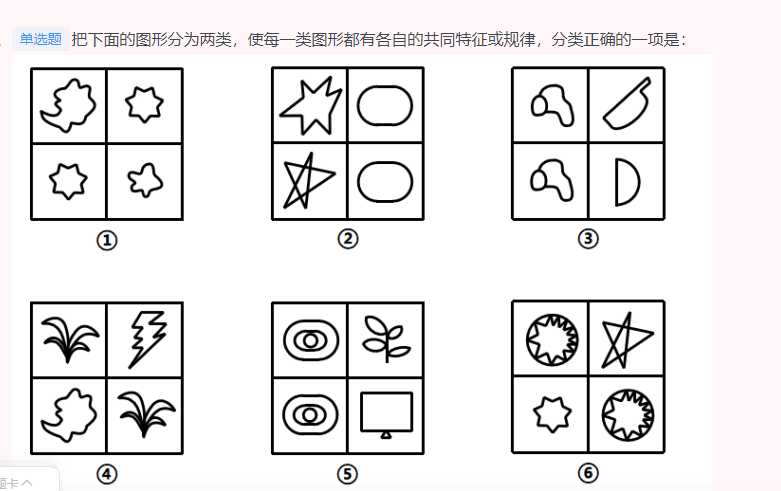

## 言语理解只有四种题型：一，自己能做对的；二，虽然做错了，但一对答案便恍然大悟的；三，做错了，但对答案能想明白，想想确实应该是那么回事；四，做错了，却百思不得其解，甚至对答案产生了深深的怀疑。

对以上四种题型，策略就是：忽略一，放弃四，减少二，主攻三

### 共20道，答对13道，正确率65%，用时48分钟


###  共35道，答对20道，正确率57%，用时39分钟


- 71 题目不该错


- 2（属于3，先看有没有组成相同看位置，组成相似看样式，组成不同看属性：对称曲直开闭。没有的话看数量。点线面角素。这道题就属于数量，因为直线明显，交点明显，数交点的个数。）


```
元素组成不同，且无明显属性规律，考虑数量规律。观察发现，图形线条交叉明显，考虑交点数。题干图形的交点数分别为：3、4、5、6，所以？处图形的交点数应为7个，选项图形的交点数分别为7、5、8、6，只有A项符合规律。

故正确答案为A。
```
- 3(属于3，属于数量。相邻和对立，相同两个图形的位置。)



```
本题为分组分类题目。元素组成不同，无明显属性规律，考虑数量规律。观察发现，每幅图均有4个元素，且均存在两个相同元素，图①④⑥中相同元素都是相对的，图②③⑤中相同元素都是相邻的。即①④⑥为一组，②③⑤为一组。
```
- 4（属于3，人合公司：“以股东的个人信用为公司信用基础”；而且这句话差分为股东个人信用为公司信用的基础。不能有别人的信用。但是公司聘请多位经验丰富的职业经理人分管不同业务，不符合“以股东的个人信用为公司信用基础”，不属于人合公司）


```

人合公司是指以股东的个人信用为公司信用基础的公司；资合公司是指由公司股东分别出资而形成的财产作为信用基础的公司；人资兼合公司则同时具备上述两种性质的信用基础。

根据上述定义，下列哪个公司属于人合公司：

A

某公司注册资本为全体股东缴纳股本的总和，股东的出资以现金及财产为限，根据出资对公司负责

B

某公司的全部股份由公司独立创立者百分百持有，公司聘请多位经验丰富的职业经理人分管不同业务

C

某公司由于经营不善导致资金链断裂，在申请破产时以全部注册资本作数，股东个人财产并不受影响

D

某公司的资产以股东个人的所有财产为抵押，股东对公司经营负无限责任，并且不能任意地转让股份


正确答案是： D，你的答案是： B收起
解析
第一步：找出定义关键词。

人合公司：“以股东的个人信用为公司信用基础”；

资合公司：“由公司股东分别出资而形成的财产作为信用基础”；

人资兼合公司：同时以“股东的个人信用”和“股东分别出资而形成的财产”作为信用基础。

第二步：逐一分析选项。

A项：某公司注册资本为全体股东缴纳股本的总和，符合“公司股东分别出资而形成的财产”，属于资合公司，不属于人合公司，排除；

B项：某公司的全部股份由公司独立创立者百分百持有，但是公司聘请多位经验丰富的职业经理人分管不同业务，不符合“以股东的个人信用为公司信用基础”，不属于人合公司，排除；

C项：股东个人财产并不受影响，说明不符合“以股东的个人信用为公司信用基础”，不属于人合公司，排除；

D项：以股东个人的所有财产为抵押，股东对公司经营负无限责任，符合“以股东的个人信用为公司信用基础”，属于人合公司，当选。

故正确答案为D。
```
- 5（属于2，C项：惯性与物体的质量有关，物体的质量越大则惯性越大，而汽车核载重量与汽车质量成正比，所以惯性的大小与汽车的核载重量存在因果关系，不符合关键词“两个没有因果关系的事件”，且惯性和物体重量之间的关系可通过实验来证实，不符合关键词“引致两个事件是‘有所联系’的假象，但这种联系并不能通过客观的试验来证实”，不符合定义，当选；）


```
虚假相关指的是两个没有因果关系的事件之间，基于一些其他未见的因素（潜在变量）而推断出因果关系，引致两个事件是“有所联系”的假象，但这种联系并不能通过客观的试验来证实。

根据上述定义，下列选项不属于虚假相关的是:

A

童鞋的大小与孩子的语言能力

B

冷饮的销量与泳池溺水的人数

C

惯性的大小与汽车的核载重量

D

网民的数量与房屋的折旧程度


正确答案是： C，你的答案是： A收起
解析
第一步：找出定义关键词。

“两个没有因果关系的事件”、“基于一些其他未见的因素（潜在变量）而推断出因果关系”、“引致两个事件是‘有所联系’的假象，但这种联系并不能通过客观的试验来证实”。

第二步：逐一分析选项。

A项：童鞋的大小与孩子的语言能力不存在直接联系，二者没有因果关系，符合关键词“两个没有因果关系的事件”，但二者可能都与“年龄”相关，年龄大可能导致童鞋大，同时导致语言能力较强，基于“年龄”这一潜在变量，二者之间“有所联系”，符合关键词“基于一些其他未见的因素（潜在变量）而推断出因果关系”、“引致两个事件是‘有所联系’的假象，但这种联系并不能通过客观的试验来证实”，符合定义，排除；

B项：冷饮的销量与泳池溺水的人数不存在直接联系，二者没有因果关系，符合关键词“两个没有因果关系的事件”，但二者可能都是由于“天气炎热”引起的，基于“天气炎热”这一潜在变量，二者之间“有所联系”，符合关键词“基于一些其他未见的因素（潜在变量）而推断出因果关系”、“引致两个事件是‘有所联系’的假象，但这种联系并不能通过客观的试验来证实”，符合定义，排除；

C项：惯性与物体的质量有关，物体的质量越大则惯性越大，而汽车核载重量与汽车质量成正比，所以惯性的大小与汽车的核载重量存在因果关系，不符合关键词“两个没有因果关系的事件”，且惯性和物体重量之间的关系可通过实验来证实，不符合关键词“引致两个事件是‘有所联系’的假象，但这种联系并不能通过客观的试验来证实”，不符合定义，当选；

D项：网民的数量与房屋的折旧程度不存在直接联系，二者没有因果关系，符合关键词“两个没有因果关系的事件”，但二者可能都与“时间”相关，随着时间推移，网民数量逐渐增多，同时房屋折旧程度越高，基于“时间”这一潜在变量，二者之间“有所联系”，符合关键词“基于一些其他未见的因素（潜在变量）而推断出因果关系”、“引致两个事件是‘有所联系’的假象，但这种联系并不能通过客观的试验来证实”，符合定义，排除。

本题为选非题，故正确答案为C。
```
- 6（属于3，要结合定义，看。B项：音爆云不仅在跨音速飞行时才能出现，意味着音爆云可能在非跨音速飞行时产生，而音爆只有在突破音速即超音速飞行时才会产生，因此可能出现有音爆云但没有音爆的情况，因此“音爆云出现标志着音爆产生”的说法不正确，排除；）


```
音爆是飞行器在突破音障时，由于对空气的压缩无法迅速传播，会逐渐形成激波面，激波面上高度集中的声学能量引起巨大响声，让人耳感受到短暂而极其强烈的爆炸声。音爆只有在突破音速即超音速飞行时才会产生。音爆云则是以飞行器为中心轴、从机翼前段开始向四周均匀扩散的圆锥状云团。其产生主要是由于气流流速突破音速时比空气传导速度更快，无法有效向下拉气流，导致密度减小，气压降低，水气凝结成微小的水珠，肉眼看来就像是云雾般的状态。音爆云在跨音速飞行时常常出现，但不仅在跨音速飞行时才能出现。

根据上述定义，下列说法正确的是：

A

音爆产生时就会出现音爆云

B

音爆云出现标志着音爆产生

C

音爆云出现说明突破了音障

D

音爆产生时是超音速飞行


正确答案是： D，你的答案是： B收起
解析
第一步：找出定义关键词。

音爆：“飞行器在突破音障时”、“对空气的压缩无法迅速传播，会逐渐形成激波面”、“激波面上高度集中的声学能量引起巨大响声，让人耳感受到短暂而极其强烈的爆炸声”、“只有在突破音速即超音速飞行时才会产生”；

音爆云：“以飞行器为中心轴、从机翼前段开始向四周均匀扩散的圆锥状云团”、“产生主要是由于气流流速突破音速时比空气传导速度更快，无法有效向下拉气流，导致密度减小，气压降低，水气凝结成微小的水珠，肉眼看来就像是云雾般的状态”、“在跨音速飞行时常常出现，但不仅在跨音速飞行时才能出现”。

第二步：逐一分析选项。

A项：音爆云在跨音速飞行时常常出现，说明在跨音速飞行时也可能不会产生音爆云，而音爆只有在突破音速即超音速飞行时才会产生，说明音爆产生时也有可能不会产生音爆云，因此“音爆产生时就会出现音爆云”的说法不正确，排除；

B项：音爆云不仅在跨音速飞行时才能出现，意味着音爆云可能在非跨音速飞行时产生，而音爆只有在突破音速即超音速飞行时才会产生，因此可能出现有音爆云但没有音爆的情况，因此“音爆云出现标志着音爆产生”的说法不正确，排除；

C项：说的是音爆云出现说明突破了音障，音爆是飞行器在突破音障时产生的，而音爆云的出现并不能说明突破了音障，因此“音爆云出现说明突破了音障”的说法不正确，排除；

D项：说的是音爆产生时是超音速飞行，符合音爆“只有在突破音速即超音速飞行时才会产生”，符合定义，当选。

故正确答案为D。
```

- 7（望梅止渴意思是梅子酸，人想吃梅子就会流涎，因而止渴，比喻愿望无法实现，用空想安慰自己。与渴望不是近义关系，与题干逻辑关系不一致，排除；彩衣娱亲意思是传说春秋时有个老莱子，很孝顺，七十岁了还穿着彩色衣服扮成幼儿，引父母发笑，后作为孝顺父母的典故。与孝顺是近义关系，）


```
顿悟：醍醐灌顶

A

渴望：望梅止渴

B

移交：完璧归赵

C

消费：坐吃山空

D

孝顺：彩衣娱亲


正确答案是： D，你的答案是： A收起
解析
第一步：判断题干词语间逻辑关系。

醍醐灌顶意思是将牛奶中精炼出来的乳酪浇到头上，比喻灌输智慧，使人得到启发，彻底醒悟，与顿悟是近义关系。

第二步：判断选项词语间逻辑关系。

A项：望梅止渴意思是梅子酸，人想吃梅子就会流涎，因而止渴，比喻愿望无法实现，用空想安慰自己。与渴望不是近义关系，与题干逻辑关系不一致，排除；

B项：完璧归赵意思是蔺相如将完美无瑕的和氏璧，完好地从秦国带回赵国，后比喻把物品完好地归还给物品的主人。与移交不是近义关系，与题干逻辑关系不一致，排除；

C项：坐吃山空意思是只坐着吃，山也要空，指光是消费而不从事生产，即使有堆积如山的财富，也要耗尽。与消费不是近义关系，与题干逻辑关系不一致，排除；

D项：彩衣娱亲意思是传说春秋时有个老莱子，很孝顺，七十岁了还穿着彩色衣服扮成幼儿，引父母发笑，后作为孝顺父母的典故。与孝顺是近义关系，与题干逻辑关系一致，当选。

故正确答案为D。
```

- 8（按照事物的顺序关系排列，属于3，专攻！）


```

戊：己：庚

A

钠：镁：铝

B

寅：卯：巳

C

牛：虎：龙

D

秦：汉：隋


正确答案是： A，你的答案是： B收起
解析
第一步：判断题干词语间逻辑关系。

天干是中国古代的一种文字计序符号，其包括：甲、乙、丙、丁、戊、己、庚、辛、壬、癸，被称为“十天干”。戊、己、庚是“十天干”中的三个，三者是并列关系，且三者在天干中排列紧密连续。

第二步：判断选项词语间逻辑关系。

A项：钠、镁、铝是元素周期表中的三个元素，三者是并列关系，且三者在元素周期表中排列紧密连续，与题干逻辑关系一致，当选；

B项：寅、卯、巳是古代十二地支中的三个地支，三者是并列关系，但三者在十二地支中的排列并不是紧密连续的，与题干逻辑关系不一致，排除；

C项：牛、虎、龙是十二生肖中的三个生肖，三者是并列关系，但三者在十二生肖中的排列并不是紧密连续的，与题干逻辑关系不一致，排除；

D项：秦、汉、隋是我国古代的三个朝代，三者是并列关系，但三者在古代朝代中的排列并不是紧密连续的，与题干逻辑关系不一致，排除。

故正确答案为A。
```
- 9（路由器是连接两个或多个网络的硬件设备，在网络间起网关的作用；隔离卡是一种应用在计算机上的硬件，使得计算机在完全安全状态下联结内网和外网，二者均为电脑硬件设备，为并列关系。且路由器和隔离卡都可以运用在网络连接上，为对应关系）


```
超声波：次声波：军事

A

处女作：代表作：文学

B

路由器：隔离卡：网络

C

潜水艇：核潜艇：科技

D

北极星：北斗星：星辰


正确答案是： B，你的答案是： D收起
解析
第一步：判断题干词语间逻辑关系。

超声波是指频率高于20000赫兹的声波，次声波是指频率小于20赫兹的声波，二者为并列关系；且超声波和次声波都可以运用在军事上，为对应关系。

第二步：判断选项词语间逻辑关系。

A项：有的处女作是代表作，有的处女作不是代表作，有的代表作是处女作，有的代表作不是处女作，二者为交叉关系，与题干逻辑关系不一致，排除；

B项：路由器是连接两个或多个网络的硬件设备，在网络间起网关的作用；隔离卡是一种应用在计算机上的硬件，使得计算机在完全安全状态下联结内网和外网，二者均为电脑硬件设备，为并列关系。且路由器和隔离卡都可以运用在网络连接上，为对应关系，与题干逻辑关系一致，当选；

C项：核潜艇是潜水艇的一种，二者为种属关系，与题干逻辑关系不一致，排除；

D项：北极星又称北辰、紫微星，指的是最靠近北天极的一颗恒星；北斗星又称北斗七星，是大熊座的组成部分，属于紫微垣的一个星官。二者不是并列关系，但二者都是星辰，前两词分别与第三词构成种属关系，与题干逻辑关系不一致，排除。

故正确答案为B。
```
- 10（3，攻克！高屋建瓴意思是把瓶子里的水从高层顶上倾倒，形容居高临下的形势，高屋建瓴形容形势；目无全牛意思是眼中没有完整的牛，只有牛的筋骨结构，形容人的技艺高超，得心应手，已经到达非常纯熟的地步，目无全牛形容技艺，前后逻辑关系一致，当选）


```
高屋建瓴 对于 （    ） 相当于 （    ） 对于 技艺

A

格局 左支右绌

B

形势 目无全牛

C

气势 天造地设

D

地势 逆水行舟


正确答案是： B，你的答案是： C收起
解析
逐一代入选项。

A项：高屋建瓴意思是把瓶子里的水从高层顶上倾倒，形容居高临下的形势，与格局无必然联系；左支右绌意思是力量不足，应付了这一方面，那一方面又有了问题，与技艺无必然联系，前后逻辑关系不一致，排除；

B项：高屋建瓴意思是把瓶子里的水从高层顶上倾倒，形容居高临下的形势，高屋建瓴形容形势；目无全牛意思是眼中没有完整的牛，只有牛的筋骨结构，形容人的技艺高超，得心应手，已经到达非常纯熟的地步，目无全牛形容技艺，前后逻辑关系一致，当选；

C项：高屋建瓴意思是把瓶子里的水从高层顶上倾倒，形容居高临下的形势，与气势无必然联系；天造地设意思是自然形成而合乎理想，不必再加工，与技艺无必然联系，前后逻辑关系不一致，排除；

D项：高屋建瓴意思是把瓶子里的水从高层顶上倾倒，形容居高临下的形势，与地势无必然联系；逆水行舟意思是比喻学习或做事就好像逆水行船，不努力就要退步，与技艺无必然联系，前后逻辑关系不一致，排除。

故正确答案为B。
```
- 11（属于3，没有否定论点的选项。去找拆桥。找出论点。论点：地球生命来自彗星。

论据：一块坠落到斯里兰卡的陨石里找到了微观硅藻化石，该石头有着疏松多孔的结构，密度比在地球上找到的所有东西都低。他推断这是一颗彗星的一部分，并指出样本中找到的微观硅藻化石与恐龙时代留存下来的化石中的微观有机体类似。本题的论据说的是对陨石里找到的微观硅藻化石的研究，而论点说的是地球生命来自彗星，二者讨论话题不一致，优先考虑拆桥。

C项：选项只是说配图中的东西本质是硅藻细胞断片，但并未质疑题干成果，不能削弱，排除；

D项：该成果根本无法证明该石头是陨石，拆断了论点和论据之间的联系，可以削弱题干论点，当选。
）


```
某科学家在一个宇宙科学网站上刊载了一项成果，该成果宣称找到了地球生命来自彗星的“证据”，引发了广泛关注。他声称在一块坠落到斯里兰卡的陨石里找到了微观硅藻化石，该石头有着疏松多孔的结构，密度比在地球上找到的所有东西都低。他推断这是一颗彗星的一部分，并指出样本中找到的微观硅藻化石与恐龙时代留存下来的化石中的微观有机体类似，从而为彗星胚种论提供了强有力的证据。

以下哪项如果为真，最能反驳该科学家的观点？

A

发表该成果的网站缺乏可信性，所载论文良莠不齐，有些曾沦为笑柄

B

该科学家是彗星胚种论的狂热支持者，曾宣称SARS和流感来自彗星

C

该成果配图中被标示成“丝状硅藻”的东西实际上只是硅藻细胞断片

D

该成果根本无法证明该石头是碳质球粒陨石，甚至难以确定其是陨石


正确答案是： D，你的答案是： C收起
解析
第一步：找出论点和论据。

论点：地球生命来自彗星。

论据：一块坠落到斯里兰卡的陨石里找到了微观硅藻化石，该石头有着疏松多孔的结构，密度比在地球上找到的所有东西都低。他推断这是一颗彗星的一部分，并指出样本中找到的微观硅藻化石与恐龙时代留存下来的化石中的微观有机体类似。

本题的论据说的是对陨石里找到的微观硅藻化石的研究，而论点说的是地球生命来自彗星，二者讨论话题不一致，优先考虑拆桥。

第二步：逐一分析选项。

A项：该成果的网站缺乏可信性，所载论文良莠不齐，代表不了这次实验成果的可靠性，属于无关项，排除；

B项：只是说该科学家是彗星胚种论的狂热支持者，支持者说的话无法辨别真假，无法削弱题干，排除；

C项：选项只是说配图中的东西本质是硅藻细胞断片，但并未质疑题干成果，不能削弱，排除；

D项：该成果根本无法证明该石头是陨石，拆断了论点和论据之间的联系，可以削弱题干论点，当选。

故正确答案为D。
```
- 12（只要就，就前推后。）


```
如果一片森林的树木物种多样性非常丰富，那么这时缺失一个物种对于整个森林的生产力来讲，影响还并不是太大；但在物种多样性越稀缺的时候，树的种类继续变少，对整个森林生产力产生的打击就会越来越大。

由此可以推出：

A

除非树木物种多样性锐减，整个森林的生产力不会受到影响

B

只要森林的树木物种减少，整个森林的生产力就会受到影响

C

如果森林的生产力下降，那么森林的树木物种多样性就已经受损

D

要么森林的树木物种多样性非常丰富，要么森林的生产力非常可观


正确答案是： B，你的答案是： A收起
解析
第一步：翻译题干。

①物种多样性丰富 且 缺失一个物种对森林生产力影响不大

②物种多样性稀缺 且 树的种类变少对森林生产力影响大

第二步：逐一分析选项。

A项：翻译为森林生产力受影响物种多样性锐减（即“物种多样性丰富”），仅根据“森林生产力受影响”无法判断影响的大小，无法根据①②推出结论，排除；

B项：翻译为树木物种减少森林生产力受影响，根据条件①②可知，无论森林物种丰富还是稀缺，物种的减少都会对森林生产力产生影响，只是影响大不大的问题，因此可以得出选项的关系，可以推出，当选；

C项：翻译为森林的生产力下降树木物种多样性受损，仅根据“森林的生产力下降”无法判断下降幅度的大小，即无法判断受影响的大小，无法根据①②推出结论，排除；

D项：“要么······要么······”表示两者之间只能成立一个且必须成立一个，题干中没有直接涉及物种多样性和森林生产力的关系，无法判断两者是否只能二选一，排除。

故正确答案为B。
```
- 13(属于3不要想当然，要记住题目中的有可能。高剂量的全氟辛酸铵有可能导致胆固醇水平升高。所以B太绝对)


```

不粘锅常见的不粘涂层为特氟龙涂层。全氟辛酸铵是特氟龙生产过程中使用的含量极微的一种加工助剂。数据表明，高剂量的全氟辛酸铵有可能导致胆固醇水平升高、甲状腺疾病及不育。特氟龙在常温及常态下具有非常稳定的理化性质，使用特氟龙不粘涂层的炊具在常温至的温度范围内都不会发生任何变化，但是当温度超过时，涂层逐渐向不稳定状态转变，当温度超过时会发生分解。正常烹调时，水的沸点是，温度较高的爆炒通常也只是左右，即使采用油炸的方式，油温也不会超过。然而，如果在炒菜时喜欢把锅烧干、烧红后再加油，锅内温度就容易超过。

由此无法推出的是：

A

日常生活中，可以用不粘锅来烧开水和煮粥

B

烹饪时不粘涂层分解会导致胆固醇水平升高

C

炒菜时应避免把不粘锅烧干、烧红后再加油

D

正常烹调通常无需担心不粘锅释放有害物质


正确答案是： B，你的答案是： A收起
解析
日常结论题，根据题干信息逐一分析选项。

A项：根据题干“正常烹调时，水的沸点是，温度较高的爆炒通常也只是左右，即使采用油炸的方式，油温也不会超过”，可知烧水等正常烹调不会超过，说明特氟龙不粘涂层不会发生分解，可以推出可以用不粘锅来烧开水和煮粥，排除；

B项：题干中指出高剂量的全氟辛酸铵有可能导致胆固醇水平升高、甲状腺疾病及不育，但是题干中也指出“全氟辛酸铵是特氟龙生产过程中使用的含量极微的一种加工助剂”，因此涂层中的全氟辛酸铵剂量是否达到了能够导致胆固醇水平升高的剂量不明确，同时“高剂量的全氟辛酸铵有可能导致胆固醇水平升高”，也不是一定会导致胆固醇水平升高，无法推出，当选；

C项：根据题干“如果在炒菜时喜欢把锅烧干、烧红后再加油，锅内温度就容易超过”，可知炒菜时把不粘锅烧干、烧红后再加油会导致锅内温度超过，此时特氟龙不粘涂层会向不稳定状态转变，因此应避免此做法，可以推出炒菜时应避免把不粘锅烧干、烧红后再加油，排除；

D项：根据题干“正常烹调时，水的沸点是，温度较高的爆炒通常也只是左右，即使采用油炸的方式，油温也不会超过”，可知正常烹调不会超过，说明特氟龙不粘涂层不会发生分解，可以推出正常烹调通常无需担心不粘锅释放有害物质，排除。

本题为选非题，故正确答案为B。
```
- 14（属于3，C项：不能证明肠道细菌和血液中的致炎因子是否与该疾病有关，为不明确选项。题干问的是最不能支持的，保留；

D项：饮食治疗和益生菌对缓解患者疲劳无用，举例削弱了肠道细菌与该疾病有关，可以削弱。题干问的是最不能支持的，保留。）


```
慢性疲劳综合征危害极大，它使人在正常的工作后感到极度疲劳，怎么休息也无济于事。这种疾病过去不能通过验血或其他检查得出明确的生物指标，因此其病因历来被归为心理因素。最近，研究人员对诊断为慢性疲劳综合征的48名患者和39名健康志愿者的大便和血液样本进行研究后得出结论：肠道细菌和血液中的致炎因子可能与该疾病有关。

以下哪项如果为真，最不能支持上述结论？

A

该疾病患者的大便样本中肠道细菌的多样性较低且抗炎细菌较少

B

该疾病患者的血液样本中被检测出致炎因子，而健康志愿者没有

C

目前不确定肠道细菌是导致该疾病的原因还是该疾病导致的结果

D

最新研究表明饮食治疗和益生菌等无助于为该疾病患者缓解疲劳


正确答案是： D，你的答案是： C收起
解析
第一步：找出论点和论据。

论点：肠道细菌和血液中的致炎因子可能与慢性疲劳综合征有关。

论据：无。

首先注意本题问的是“······最不能支持上述结论？”，我们的做题思路是找出哪些是能支持的排除，如果不能支持的选项中出现无关选项，不明确选项和削弱选项，首选削弱项。

第二步：逐一分析选项。

A项：患者的肠道细菌多样性低且抗炎细菌较少，说明了肠道细菌可能与该疾病有关，为题干中论点补充了论据，属于加强选项。题干问的是最不能支持的，排除；

B项：患者的血液样本中有致炎因子，而健康志愿者没有，说明了血液中的致炎因子可能与该疾病有关，补充论据，属于加强选项。题干问的是最不能支持的，排除；

C项：不能证明肠道细菌和血液中的致炎因子是否与该疾病有关，为不明确选项。题干问的是最不能支持的，保留；

D项：饮食治疗和益生菌对缓解患者疲劳无用，举例削弱了肠道细菌与该疾病有关，可以削弱。题干问的是最不能支持的，保留。

对比C、D两项，由于C项是不明确选项，D项举例否定论点，选最不能加强的D项。

本题为选非题，故正确答案为D。
```

- 15

```


```
###  共35道，答对20道，正确率57%，用时46分钟


- 1(属于四。放弃。根据“随着人类对挑战自身的执着追求”以及“竭尽全力”可知，现在的体育成绩越来越接近人的极限。刷线不一定接近极限。逼近极限这个词搭配更好。)


```
现代体育比赛不仅是各国运动员速度与力量的竞技场，也是世界各国展示形象、尖端科技与体育融合的大舞台。随着人类对挑战自身的执着追求，各竞技项目的成绩不断        人体能力的极限，要想进一步提高比赛成绩，哪怕是提高百分之一甚至千分之一，教练与运动员都要竭尽全力采用各种方式和技术去实现，科技的赋能作用也就愈发重要。

填入划横线部分最恰当的一项是：

A

刷新

B

挑战

C

考验

D

逼近


正确答案是： D，你的答案是： A收起
解析
根据“随着人类对挑战自身的执着追求”以及后文“要想进一步提高比赛成绩······都要竭尽全力······去实现”可知，横线处要体现在人类的执着追求下，竞技项目的成绩被不断地提高，越来越接近“人体能力极限”。A项“刷新”意思是刷洗之后使之变新，“刷新”成绩不一定能接近人体能力极限，与文意不符，排除；B项“挑战”一般搭配人，“人挑战极限”或“人挑战自身”等等，一般不与“成绩”搭配，排除；C项“考验”的常见搭配为“考验能力”，与“极限”搭配不当，排除；D项“逼近”意思是向前靠近，接近，能体现出成绩不断接近人体能力极限，符合文意，当选。

故正确答案为D。

```

- 2（属于三，主攻。词语的辨析。要深刻领悟词语的含义。再结合文段。看看有没有这种意思。顺理成章：顺着条理就能做好，也指某种情况合乎情理，自然产生某种结果。水到渠成”比喻条件成熟，事情自然成功。文段并未体现“条件成熟”之意，事情自然会成功，即功到自然成。题干中未提及“功到”）


```
周书》曰：“小满之日苦菜秀。”小满时节，麦类、谷物等农作物子粒开始饱满，但尚未成熟，恰是青黄不接的时候。而田间地头的野菜正蓬勃生长，采食野菜来度过饥荒，自是            。

填入划横线部分最恰当的一项是：

A

不容置疑

B

顺理成章

C

水到渠成

D

理所当然


正确答案是： B，你的答案是： C收起
解析
由“麦类、谷物······尚未成熟······而田间地头的野菜正蓬勃生长”可知，人们在谷物青黄不接时可食用野菜充饥，故横线处应表达在没有食物可吃的情况下，人们采食田间地头的野菜是自然而然发生的事情。B项“顺理成章”既指写文章或做事情，顺着条理就能做好，也指某种情况合乎情理，自然产生某种结果，符合文意，当选。A项“不容置疑”指不允许加以怀疑，形容绝对真实可信，强调论证严密，无可怀疑，程度过重，排除；C项“水到渠成”比喻条件成熟，事情自然成功，文段并未体现“条件成熟”之意，与文意不符，排除；D项“理所当然”指从道理上讲应当这样，强调应当如此，文段并未强调理应如此，而是强调顺应某种情况自然发生的结果，与文意不符，排除。

故正确答案为B。
```
- 3（属于二，要减少犯错。词语的重复成语不要选。）


```
早在商汤时代，浴盘上就镌刻有“苟日新，日日新，又日新”的铭词，旨在激励自己澡身而浴德，澡雪而精神，既要盥洗身体，更要涤荡心灵，保持向新求新的精神，产生            的进步。

填入划横线部分最恰当的一项是：

A

与日俱进

B

日新月异

C

竿头日上

D

突飞猛进


正确答案是： B，你的答案是： A收起
解析
根据横线前“保持向新求新的精神”可知，空缺处要表达出向新求新的进步，体现“新”的意思，且和后文“进步”搭配。B项“日新月异”形容每天都在更新，每月都有变化，能体现出“新”的意思，也能和进步搭配，符合文意，当选。

A项“与日俱进”意思是随着时间一天天地进步，形容不断进步或提高。“与日俱进”侧重“提高进步”，且“与日俱进”与“进步”存在语义上的重复，搭配不当，排除；

C项“竿头日上”比喻学业进步很快，体现不出“新”的意思，排除；

D项“突飞猛进”形容进步和发展特别迅速，文段并未体现“进步和发展特别迅速”，且“突飞猛进”与“进步”重复，搭配不当，排除。

故正确答案为B。

```
- 4（属于三，专攻！词语的辨析轻重。因为云本身就存在。塑造是重新塑造。但是其他的都是从无到有的引申意思。）


```
在高山相夹的谷底，有时能直观地看到地形对云的        ：气流翻山越岭被抬升形成波动气流，在气流的波峰与波谷之前，云也随之上下扭曲。在一些情况下，大气温度和高度呈反比，处于波谷处的温度更高，达不到云        的温度，而波峰处的温度可以形成云，这样就形成了有云和无云条带反复交错的波状云天空。

依次填入划横线部分最恰当的一项是：

A

塑造 凝结

B

制造 凝集

C

打造 凝聚

D

创造 凝固


正确答案是： A，你的答案是： B收起
解析
第一空，横线后出现冒号提示解释类对应，根据“气流翻山越岭被抬升形成波动气流，在气流的波峰与波谷之前，云也随之上下扭曲”可知，文段意在说明地形对云的形状产生影响。A项“塑造”指改变原来的样子，可体现“影响”之意，保留。B项“制造”、C项“打造”、D项“创造”均强调从无到有的过程，而文段中云已然存在，强调的是地形对云的形状产生影响，与文意不符，排除。

第二空，代入验证，A项“凝结”能体现水蒸气变成云的过程，搭配恰当，符合文意，当选。

故正确答案为A。
```
- 5（属于3，专攻！大而化之：做事不谨慎。文章此处确实需要贬义词而不是褒义词。）


```

当前，构建中国特色文艺理论体系已渐成学界共识，但在推进建设的道路上，            易，具体而微难；空喊口号易，付诸实践难。中国特色文艺理论体系建设，除了宏观维度的考量，更需要大功细作，从概念、范畴、术语及具体议题设置等微观层面入手，            ，聚沙成塔，一砖一瓦搭建大厦。

依次填入划横线部分最恰当的一项是：

A

大而化之 条分缕析

B

坐而论道 步步为营

C

小题大做 集腋成裘

D

通观大局 精雕细琢


正确答案是： A，你的答案是： D收起
解析
第一空，由分号后的句子“空喊口号易，付诸实践难”可知，横线处所填词语应与“具体而微”构成反义并列，表达不具体、不细致的含义。A项“大而化之”形容做事情不小心谨慎，粗枝大叶，符合文意，保留；B项“坐而论道”指坐着空谈大道理，强调口头说说，不见行动，与文段想要表达的是否具体细致无关，排除；C项“小题大做”指拿小题目作大文章，比喻不恰当地把小事当作大事来处理，有故意夸张的意思，也与文意想表达的不具体不细致无关，排除；D项“通观大局”指通盘筹划，综合看待问题，侧重的是看待事情全面，有统筹协调的意识，文意想表达的是不够具体不够细致，与文意不符，排除。

第二空，代入验证，前文论述中国特色文艺理论体系建设需要大功细作，需要从微观层面入手，强调从细处入手，A项“条分缕析”指有条有理地细细分析，置于此处表达我们做事情需要有条有理地仔细地去分析梳理，符合文意，当选。

故正确答案为A。
```
- 6（属于3，需要专攻！从第三入手。也是从词性上入手。惬意”形容心情感到愉快畅快，愉悦、舒畅或者是满意，均符合文意，保留；A项“肆意”指不顾一切由着自己的性子，C项“恣意”指放纵，不加限制，任意，均与后文的“低语”“吟唱”无法对应）


```

野草属于乡间大地。在城市里被水泥丛林挤得难有            的野草，即便得到了点滴瘠薄的土地，也生长得            ，茎叶上积满了灰尘，一副失魂落魄的样子。那些生长在乡间大地上的野草，则        地在风中低语，在雨中吟唱。

依次填入划横线部分最恰当的一项是：

A

一席之地 没精打采 肆意

B

弹丸之地 垂头丧气 适意

C

一隅之地 奄奄一息 恣意

D

栖身之地 萎靡不振 惬意


正确答案是： D，你的答案是： C收起
解析
本题可从第三空入手，由“野草属于乡间大地”“在城市里······那些生长在乡间大地上的野草”可知，“则”在此处表达转折关系，第三空所填词语应与前文的“失魂落魄”语义相反，体现出野草在乡间大地生长得比较舒适自在的含义。B项“适意”指自在合意，D项“惬意”形容心情感到愉快畅快，愉悦、舒畅或者是满意，均符合文意，保留；A项“肆意”指不顾一切由着自己的性子，C项“恣意”指放纵，不加限制，任意，均与后文的“低语”“吟唱”无法对应，程度过重，排除。

第二空，搭配“生长”，且由“一副失魂落魄的样子”可知，野草在城市中生长得并不好，D项“萎靡不振”形容精神不振，意志消沉，符合文意，保留；B项“垂头丧气”形容因失败或不顺利而情绪低落的样子，多与情绪搭配，置于此处与“生长”搭配不当，排除。

第一空，代入验证，根据“被水泥丛林挤得”可知，野草在城市中很难有生存之地，D项“栖身之地”指暂时居住的地方，符合文意，当选。

故正确答案为D。
```


- 7（这个属于3.专攻！A项。原文说但如果一个人在遇到困难时，总利用退行心理去逃避现实问题或博取别人的同情，就很有可能发展成为某种心理疾病。。但是A项过于绝对了。同样沉溺也是程度过重，文章说了总是的话就不好。）


```
退行心理是一种心理防御机制，是指人们在遭受挫折、面临困难时，以比较幼稚的态度，选择早期生活阶段的某种行为方式来应对当前情况。对于二三十岁的成年人来说，经常要面临来自各个方面的多重压力，于是在比较自由的环境中，很多人都会通过退行心理来调节情绪、释放压力，自称宝宝便是一种具体表现。事实上只要无伤大雅，这种暂时性的退行心理不仅是正常的，而且在某些情况下是极其有必要的。但如果一个人在遇到困难时，总利用退行心理去逃避现实问题或博取别人的同情，就很有可能发展成为某种心理疾病。

根据这段文字，下列说法正确的是：

A

经常自称宝宝会发展为某种心理疾病

B

时常回忆年幼时光是退行心理的表现

C

人不应沉溺于用退行心理来逃避现实

D

二三十岁的成年人自称宝宝极有必要


正确答案是： C，你的答案是： A收起
解析
A项，根据尾句“总利用退行心理去逃避现实问题或博取别人的同情，就很有可能发展成为某种心理疾病”可知，经常自称宝宝不一定会发展为某种心理疾病，表述过于绝对，排除；

B项，根据首句退行心理的定义“人们在遭受挫折、面临困难时，以比较幼稚的态度，选择早期生活阶段的某种行为方式来应对当前情况”可知，“回忆年幼时光”不一定是在“遭受挫折、面临困难”时的选择，且“回忆年幼时光”也不属于“幼稚的态度”“早期生活阶段的某种行为方式”，表述错误，排除；

C项，根据尾句“总利用退行心理去逃避现实问题或博取别人的同情，就很有可能发展成为某种心理疾病”可知，人不可过分沉溺于用退行心理逃避现实，表述正确，当选；

D项，根据文段后文介绍的退行心理的利弊影响可知，过于依赖退行心理逃避现实可能引发某种心理疾病，故“极有必要”表述错误，排除。

故正确答案为C。

```

- 8（这个属于3，专攻！对策之前不重要。它属于问题。原文在很前面有过这句话。规定很明确，但执行中常常出现各种盲区。所以b是但好的出发点也要有完善的配套制度。健身器材建设好了，服务和管理工作也应跟上。同意思替代。）


```

公共健身器材主要由政府采购、体育部门赠予、开发商自行购置后投放。按规定，受赠单位负责管理和日常维护并承担经费；各单位自行购置的则由各单位负责管理、维修和承担费用。规定很明确，但执行中常常出现各种盲区。首先，受赠方往往无配套资金，需要维修时也一问三不知；其次，日常使用和维护往往需要出厂厂家，然而对厂家缺少专门监管，厂家常常敷衍售后服务；最后，公共健身器材超出使用期，未明确拆除更换的责任方。公共健身器材的设置本是便民利民的好事，但好的出发点也要有完善的配套制度。健身器材建设好了，服务和管理工作也应跟上。

这段文字意在强调：

A

受赠单位疏于管理公共健身器材

B

公共健身器材不能“重建轻管”

C

维护管理公共健身器材存在盲区

D

公共健身器材能让百姓切实受益


正确答案是： B，你的答案是： C收起
解析
文段开篇引出公共健身器材这一话题，接着具体介绍不同情况下负责管理维护公共健身器材的责任主体。随后通过转折标志词“但”指出问题，即执行中出现盲区，并通过“首先”“其次”“最后”多角度分析问题。接着通过转折标志词“但”说明公共健身器材的设置缺少完善的配套制度。尾句则通过“应”提出对策，即要做好服务和管理工作，故文段意在强调对于公共健身器材要做好服务和管理工作，对应B项。

A项，“受赠单位”对应文段“首先”之后的内容，为解释说明的部分，且“疏于管理”为问题表述，非重点，排除；

C项，“存在盲区”为问题表述，非重点，排除；

D项，“让百姓切实受益”对应文段“便民利民”，为转折前内容，非重点，排除。

故正确答案为B。
```
- 9（3，属于3犯了转折之前不重要的问题。结论句这就要求业内学者努力译介并尽快研究英语学术谱系外的相关权威学术资料，包括专题资料和通史资料，扩展我们对世界法治现代化进程的理解。对应的B）


```
传统的西方法律思想史研究存在“吃偏食”的现象，即研究的范围、题材的主次、对象的脉络等受制于英语学术谱系，这种单一的考察重心限制了研究者的视角。而实际上，在非英语学术谱系中存在大量有价值的材料。这要求研究者把目光投向先前不够重视的领域，比如“一带一路”建设参与国众多，对它们的法律思想史进行研究，可以发现新的史料，找到新的研究关注点。这就要求业内学者努力译介并尽快研究英语学术谱系外的相关权威学术资料，包括专题资料和通史资料，扩展我们对世界法治现代化进程的理解。

这段文字旨在强调：

A

法律思想史研究受制于英语学术谱系

B

法律思想史研究须重视非英语学术谱系

C

西方法律思想史研究存在“吃偏食”现象

D

非英语学术谱系中存在大量有价值的材料


正确答案是： B，你的答案是： D收起
解析
文段开篇引出话题，指出传统的西方法律思想史研究存在受制于英语学术谱系的现象，接着通过转折词“实际上”强调非英语学术谱系中存在大量有价值的材料，并强调研究者应该把目光投向先前不够重视的领域，之后通过“比如”进行举例论证，最后通过指代词“这”总结强调业内学者应该研究英语学术谱系外的相关权威学术资料，对应B项。

A项，“受制于”为问题表述，且为文段话题引入部分内容，非重点，排除；

C项，“西方法律思想史研究存在‘吃偏食’现象”为文段话题引入部分内容，非重点，排除；

D项，“非英语学术谱系中存在大量有价值的材料”为结论前内容，且非对策表述，非重点，排除。

故正确答案为B
```
- 10（属于3，专攻！注意主题词。不能缺少）


```
为了进一步探索乌龙茶香气的酶促形成，团队成员系统研究了乌龙茶香气的酶促形成与胁迫的关联性。通过筛选各类胁迫因子，发现在乌龙茶加工过程中，损伤和低温胁迫是诱导茶叶香气酶促形成的关键胁迫因子。乌龙茶加工过程中做青阶段的连续损伤可诱导来自不同生物合成路径的香气物质合成关键基因的表达水平升高，进而促使这些香气物质的蓄积。此外，低温和损伤双胁迫对这些香气物质的合成具有显著协同效应。

这段文字意在说明：

A

乌龙茶香气的酶促形成主要与胁迫相关

B

做青阶段连续损伤可诱导香气物质的蓄积

C

胁迫使香气物质合成关键基因表达水平升高

D

损伤和低温是香气酶促形成的关键胁迫因子


正确答案是： A，你的答案是： D收起
解析
文段开头指出团队成员系统研究了乌龙茶香气的酶促形成与胁迫的关联性以探索乌龙茶香气的酶促形成，接着介绍了研究发现的内容，指出在“损伤和低温胁迫是诱导茶叶香气酶促形成的关键胁迫因子”，然后指出“连续损伤可促使香气物质的蓄积”以及“低温和损伤双胁迫对这些香气物质的合成具有显著协同效应”，都在说明胁迫因子中的“损伤和低温威胁”对乌龙茶的香气物质形成有一定的作用，故文段是通过后文的研究来说明乌龙茶香气的酶促形成与胁迫有关，对应A项。

B、C、D三项均为后文解释部分的内容，未包含文段主题词“乌龙茶”，排除。

故正确答案为A。
```
- 11（属于3，专攻！故横线处所填内容需解决“大面积的人工植被覆盖”的问题，即应首先保护现有的天然林，而非大面积栽种人工植被，对应A项。反面推对策。B项“发挥森林涵养水源功能”、D项“加强人工造林植被建设”均无法解决“大面积的人工植被覆盖”的问题，排除）


```
虽然树种对水分的利用规律大同小异，但不同的森林类型涵养水源的作用大小不一。科学评估显示，长江上游天然林保护工程的实施为岷江上游的水生态安全做出了明显贡献，但大面积的人工植被覆盖可能加重区域生态用水，从而降低流域产水量，且大规模集中连片种植的人工纯林引发的外来物种入侵、病虫害、生态系统健康问题凸显。因此，应首先                    。

填入划横线部分最恰当的一句是：

A

保护现存的天然林植被

B

发挥森林涵养水源功能

C

保障水资源和生态安全

D

加强人工造林植被建设


正确答案是： A，你的答案是： B收起
解析
横线出现在文段末尾，根据“因此”以及“应首先”可知，所填入句子为针对上文问题的解决对策。文段首先说明了不同森林类型涵养水源的作用大小不一，接下来指出长江上游天然林保护工程为岷江上游的水生态安全做出了贡献，随后通过转折词“但”强调大面积的人工植被覆盖会带来一些问题，影响生态系统健康。故横线处所填内容需解决“大面积的人工植被覆盖”的问题，即应首先保护现有的天然林，而非大面积栽种人工植被，对应A项。

B项“发挥森林涵养水源功能”、D项“加强人工造林植被建设”均无法解决“大面积的人工植被覆盖”的问题，排除；

C项，“保障水资源和生态安全”没有提及具体的保护对策，表述不明确，排除。

故正确答案为A。
```
- 12（属于3，专攻！B项，文段强调的是在儒家思想影响下形成古代科技，而非儒家思想得以实现，排除；无中生有。但是传统思想确实对科技有积极的影响。）


```
孔子以“有教无类”“因材施教”“教学相长”为方针，以培养“博学通才之士”为目标，对学生进行礼、乐、御、射、书、数“六艺”教育，其中，数即数学，乐和声学有关，御和力学有关，射和机械有关。《中庸》上说，“博学之，审问之，慎思之，明辨之，笃行之”，学、问、思、辨、行，完全符合认识过程和研究科学的方法，即获取信息、提出问题、思维推理、检验结果、躬身实践。在儒家崇尚务实和“经世致用”思想影响下，中国古代科技具有强烈的实用性，形成了以农、医、天、算四大学科和以“四大发明”为代表的技术发明创造。

这段文字意在说明：

A

中华古代文明具有文理交融的包容性

B

古代科技是传统儒家思想的实现途径

C

传统文化和古代科技存在必然的联系

D

传统文化对古代科技发展有积极影响


正确答案是： D，你的答案是： B收起
解析
文段开篇指出孔子的教学方针和目标都具有一定的实用性，接着描述《中庸》中的思想也与实际实践中的认识过程和研究科学息息相关，最后“在······思想影响下”指代前文提到的思想，且引出结论，强调在传统文化的影响下中国古代科技形成“四大学科”和“四大发明”等技术的发明创造，故文段重点在尾句结论，强调传统文化对古代科技发展产生的积极影响，对应D项。

A项，文段并未提及“文理交融”，属无中生有，排除；

B项，文段强调的是在儒家思想影响下形成古代科技，而非儒家思想得以实现，排除；

C项，“必然的联系”表述不明确，文段强调产生了积极影响，排除。

故正确答案为D。
```

- 13（属于2，需要减少。要求职业院校准确把握专业方向，根据制造业产业链的变化对专业链进行及时调整和更新。这是对问题的解决方法。岗位快速更迭要求专业动态调整）


```
制造业智能时代在创造出大量新的产品和服务的同时，也衍生出例如机器人操作和维护、工业数据工程师等全新的职业方向，就业形式上出现了更多自由职业者和兼职岗位，工作内容上也更加体现专业协作。制造业智能化产生的新兴岗位巨大供需差，要求职业院校准确把握专业方向，根据制造业产业链的变化对专业链进行及时调整和更新，以实现智能化产品在性能、质量和生产效率方面质的飞跃。

上述文字意在强调的是：

A

岗位快速更迭要求专业动态调整

B

技术技能人才培养目标发生变革

C

制造业智能化衍生出全新职业方向

D

职业教育为制造业智能化升级助力


正确答案是： A，你的答案是： C收起
解析
文段围绕制造业智能时代的岗位更迭展开，首句介绍制造业智能时代衍生出许多全新职业，就业形式与内容也发生变化，接下来通过“要求”，就新兴岗位的巨大供需差提出应对措施，即职业院校需要对专业进行及时调整。文段为分析对策的结构形式，重在强调对策，即面对岗位更迭变化，职业院校要对专业进行及时调整，对应A项。

B项，“人才培养目标”在文段中并未提及，无中生有，排除；

C项，“衍生出全新职业方向”为对策前的内容，非重点，排除；

D项，“职业教育为制造业智能化升级助力”并非对策表述，与文段重点形式不符，且文段尾句已交代了具体助力的对策即调整专业，相比A项，表述不明确，排除。

故正确答案为A。

```

- 14(属于3,2是对6的解释。并且53这个顺序)

```
①当泰勒斯面对宇宙万物说“一切来自于水，也复归于水”的时候，他不再被眼中的万事万物所迷惑，而是达到了和本原同一的境界，这种境界是一种超然物外、自由安宁的崇高境界

②在遥远的古希腊城邦中，哲学是一种生活方式，而不是单纯的理论或者学问

③他相信依靠数学可使灵魂获得净化和升华，从而摆脱轮回，进入永恒极乐的世界

④不论是前苏格拉底哲学家、古典哲学家还是后期希腊哲学家，都把哲学作为一种特立独行的生活方式

⑤毕达哥拉斯则认为数是万物的本原，数的特点就是可知而不可见

⑥如果我们要理解“什么是哲学，哲学何为”的问题，需要追根溯源，回到哲学诞生之初

将以上6个句子重新排列，语序正确的是：

A

②④⑥①③⑤

B

⑥②④①③⑤

C

②④①⑥⑤③

D

624153


正确答案是： D，你的答案是： C收起
解析
对比选项，确定首句，⑥句指出想要理解什么是哲学，需要回到哲学诞生之初，②句指出“在遥远的古希腊城邦中，哲学是······”，回答了⑥句的问题，故⑥句在②句之前，排除A、C两项。

继续观察，寻找线索，③中出现指代词“他”，根据指代词捆绑，对比选项，判断③句前接①句还是⑤句，③句指出“他相信依靠数学可使······”，前面应该论述某个人对于数学的看法，⑤句指出“毕达哥拉斯则认为数是······”，提到了某个人对于数学的看法，⑤③两句可以构成捆绑，对应D项。①句没有提到某个人对于数学的看法，①③两句无法构成捆绑，排除B项。

故正确答案为D。

```

- 15（属于3.专攻！根据这一句找出线索来。而“美”则侧重于在“真”“善”的前提下，超越二者的局限性。所以这句在介绍真，善两句之后。而美的介绍又在这句之前。）

```

①获得相对的自由，从而充分地达到自我实现的境界

②“美”是人生的最高境界

③人只有满足自己和社会的需要才能达到“善”

④“善”侧重于掌握人的需要

⑤而“美”则侧重于在“真”“善”的前提下，超越二者的局限性

⑥“真”侧重于人掌握客观规律

将以上6个句子重新排列，语序正确的是：

A

⑥④⑤③②①

B

④③⑥⑤①②

C

②④③⑤⑥①

D

264351


正确答案是： D，你的答案是： C收起
解析
根据选项判断首句，⑥句介绍了“真”的侧重，④句介绍了“善”的侧重，②句对美下定义，三者均可以作为首句，选择其他方法。⑤句强调“美”在“真”“善”的前提下能超越二者的局限性，因此⑤句在④句和⑥句之后，排除C项。②句最先引出“美”的定义，因此②句在⑤句之前，排除A项和B项。

故正确答案为D。

```

- 16 (属于3.另有他因的感觉。C项：选项说明该计算模型如果与其他天气预报模型结合，能有效预测出的恶劣天气事件，但是有效地预测情况是否为该计算模型的作用，不能确定，不是上述结论的必要前提，当选)

```


气象研究团队开发出一种基于人工智能的计算模型，用以检测云的旋转运动。研究人员鉴定并标记了逗点状云系的形态和运动，并利用计算机视觉和机器学习技术，“教会”计算机自动识别和检测卫星图像中的逗点状云系，以帮助人们更高效地在海量天气数据中及时发现恶劣天气的“端倪”。该计算模型有助于更快、更准确地预测恶劣天气。

以下各项如果为真，不属于上述结论必要前提的是：

A

该计算模型能检测出逗点状云系，准确率达，甚至在其完全形成前就能检测到


B

从卫星图像中看，逗点状云系因其外形类似于逗号而得名，与气旋的形成密切相关


C

该计算模型如与其他天气预报模型相结合，将能有效地预测出的恶劣天气事件


D

气象学认为气旋的形成可导致冰雹雷暴、大风和暴风雨等各种恶劣天气事件发生


正确答案是： C，你的答案是： D收起
解析
第一步：找出论点和论据。

论点：基于人工智能的计算模型有助于更快、更准确地预测恶劣天气。

论据：研究人员鉴定并标记了逗点状云系的形态和运动，并利用计算机视觉和机器学习技术，“教会”计算机自动识别和检测卫星图像中的逗点状云系，以帮助人们更高效地在海量天气数据中及时发现恶劣天气的“端倪”。

本题论点和论据都在讨论该计算模型有助于发现、预测恶劣天气，二者话题一致，必要前提优先考虑必要条件。本题为选非题，找出结论成立的必要条件排除即可。

第二步：逐一分析选项。

A项：选项说明该计算模型准确率达，甚至在其完全形成前就能检测到，若该计算模型准确率低或者不能检测出逗点状云系，则该计算模型就无法预测恶劣天气，是上述结论的必要前提，排除；

B项：选项说明逗点状云系与气旋形成密切相关，若逗点状云系与气旋形成无关，则不能根据逗点状云系预测恶劣天气，是上述结论的必要前提，排除；

C项：选项说明该计算模型如果与其他天气预报模型结合，能有效预测出的恶劣天气事件，但是有效地预测情况是否为该计算模型的作用，不能确定，不是上述结论的必要前提，当选；

D项：论点是通过检测气旋的形成来预测恶劣天气的，选项说气旋的形成可导致恶劣天气，是上述结论的必要前提，排除。

本题为选非题，故正确答案为C。
```