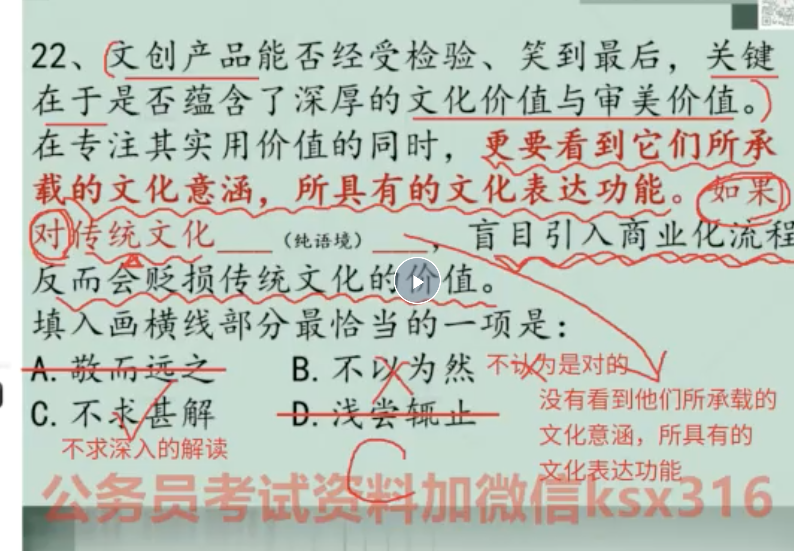
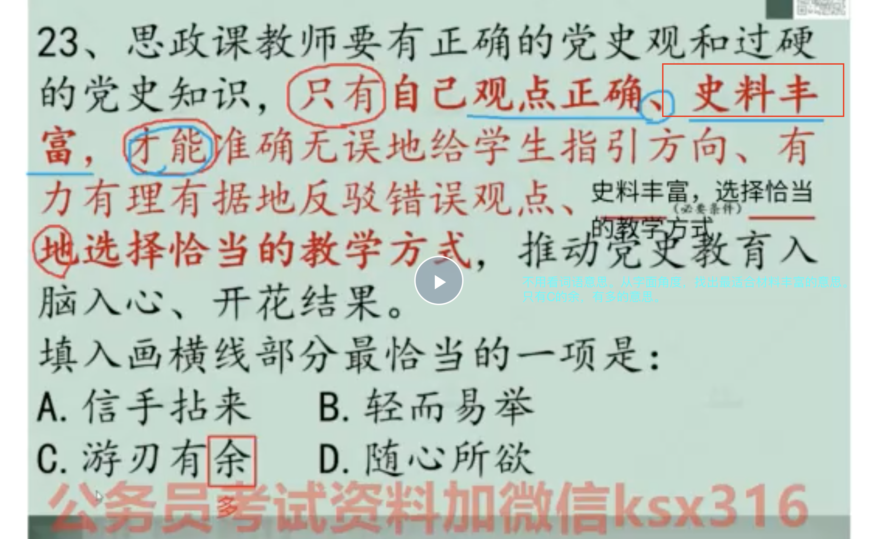
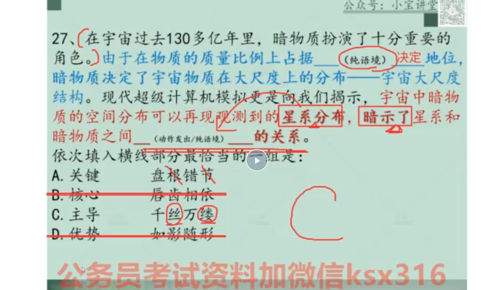
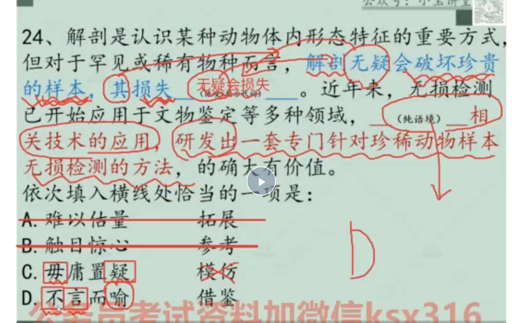
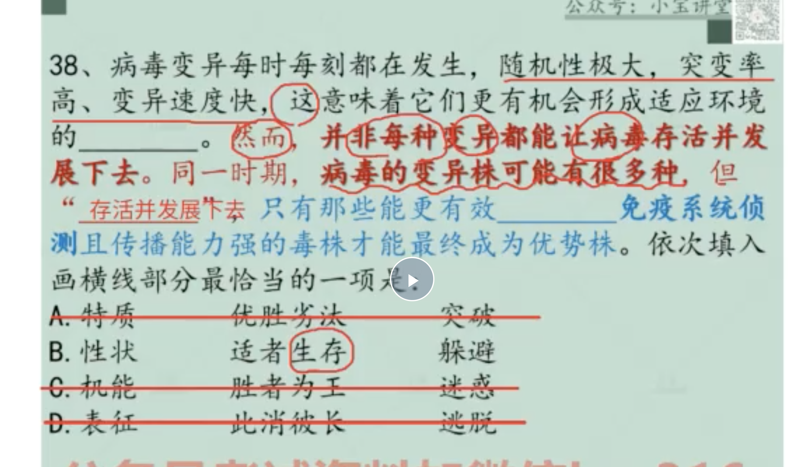
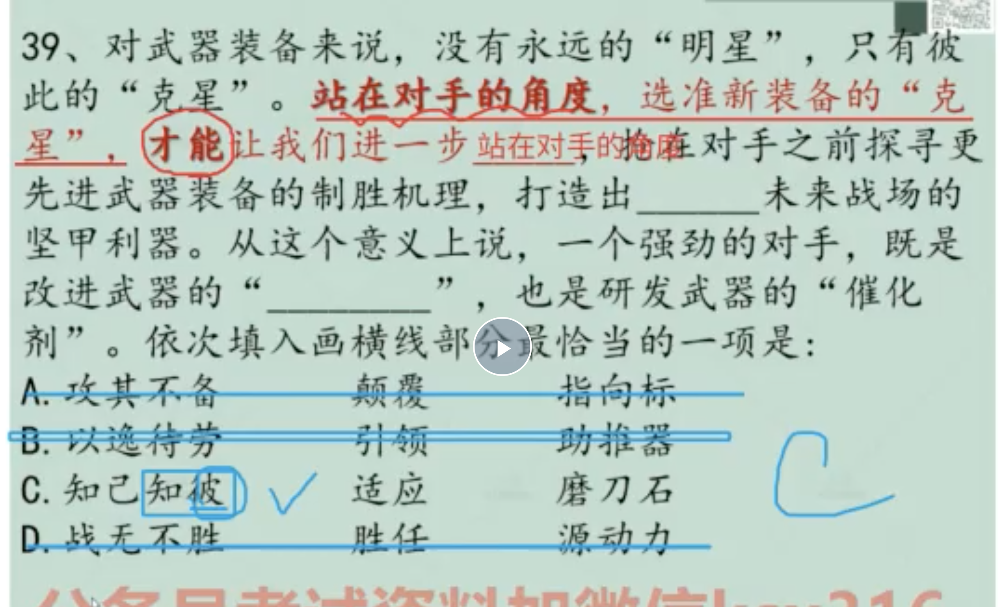
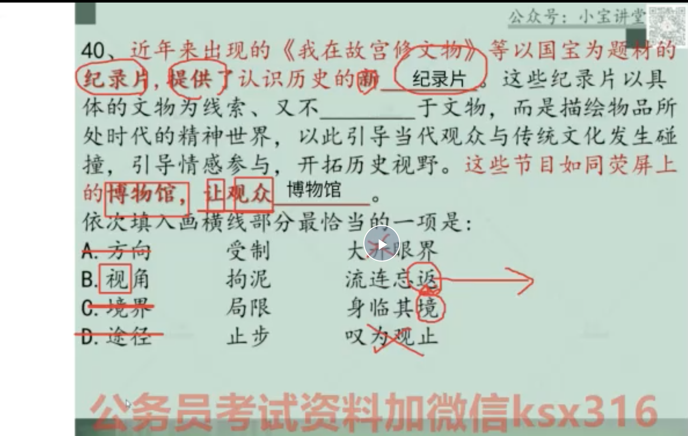

### 言语

```
1. 我发现自己，做逻辑填空的思路不对。其实词语和文章句子。主谓式一一对应的翻译过来。而我总是给它加了一道联想。

2. 40道言语题一定要35分钟之内做完，千万不要耗时间。发现做不了就跳过。

```

#### 01 国考行政执法卷1（逻辑填空）
- 语境题

1. 选择成语对应的重点句子



```
1. 找到所选的词语，与应该对应的文中句子，所对应的关系。（比如相反关系）找最适合文章的词语。
2. 题目不是从选项看到题目。而是应该从题目找到选项。
```

2. 不从成语意思上找，而是从选项对应到成语的某个字



```
不用从词语的意思理解。找出词语的字对应材料丰富的词语。游刃有余的余是多的意思。 

```



```
人家直接对着句子原文翻译得来的词。我往往给她加工了一道。一般相距甚近。之前对应词性找。

```


3. 指代词后面的选词对应前文句子的部分




4. 注意多个空，前两个词都可能考语境。第三个词是用来验证的，比如这里第二个空的，对应海量。用聚集比吸引更好。


5. 注意语境：第二个空应该是发展并生存下去。转折转前文。


6. 只有。。才注意强调前文，站在对手角度




7. 又是成语着重对应的那个字。比如博物馆 要有往返的返字。纪录片要有看见的视字



