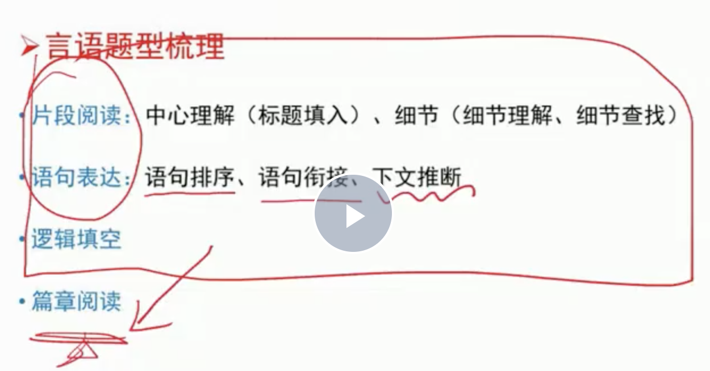
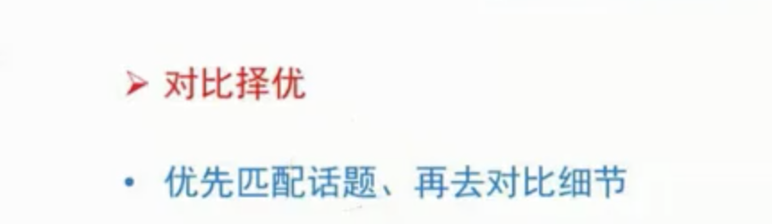
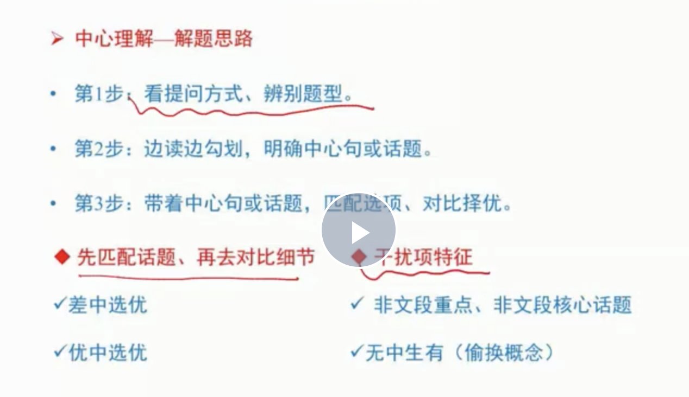

## 言语冲刺 - 中心理解题

![111](../images5/298.png）

#### 结构




1. 容易走神，是因为没有边读边勾划（勾划主语，谓语）


- 选择技巧






#### 一审二找三匹配，观点结论对策,解释举例那种要略看）

> w2

![22](../images5/287.png）


- 观点（要注意关注转折，转折之后一般有作者观点，作者对谁发表了观点，那个句子才是文章中心思想。看例2）
![111](../images5/288.png）

1. 例子（引入，转折+解释。错选了A.是因为行为脉络和主题词找错）

![111](../images5/289.png）
2. 例子（我选了D，但是是无中生有。作者根本没提基本修养。要注意关注转折，转折之后一般有作者观点，作者对谁发表了观点，那个句子才是文章中心思想）

![111](../images5/290.png）

- 结论（因果。不是第一句话的第一个词就是主题词，要看结论的主题词是不是匹配。）

![111](../images5/291.png）

1. 例子1（光结尾有指代词，也不一定是文中的核心话题。最后一句强调了，文化是端午节的灵魂，所以还是落点于文化。）

![111](../images5/292.png）

- 对策

![111](../images5/293.png）

#### 其他关系 

- 文段中的总分

![111](../images5/294.png）
- 文段中的并列（并列结构一定要提取共性。不能片面。）

![111](../images5/295.png）

1， 例子1（错选了A，但是并列的第三个例子只介绍了性格，并没有介绍对策。注意：并列结构一定要提取共性。不能片面。）

![111](../images5/296.png）

- 话题法：如果找不到明显关系，着重注意核心话题

![111](../images5/297.png）

1. 例子（就如：只是举例子，不重要。重要的是前文：形式。核心话题就是形式。而错选的C，文章并没有说技艺是精彩的关键，并且在举例子里面不重要。而且最后一句也是例子里面的。）

![111](../images5/299.png）
![111](../images5/300.png）

#### 中心理解题

- 标题填入题

![111](../images5/301.png）
- 细节理解题

![111](../images5/302.png）

- 细节查找题

![111](../images5/303.png）

- 词句理解题

![111](../images5/304.png）

1. 例子（文中问的是黑洞啥意思，而不是黑洞的对策）
![111](../images5/305.png）

- 语句衔接

![111](../images5/308.png）
![111](../images5/306.png）

1. 例子1

![111](../images5/307.png）

```
选C是总结前文，而B完全跟文章意思不一致
```

2. 例子2（注意上一句代表有来由的）

![111](../images5/309.png）

3. 注意体会到，对应横线。
![111](../images5/310.png）