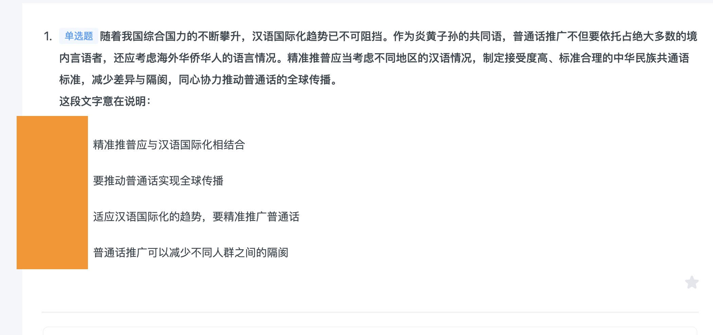

##  言语

- 01


```
没有给明确对策，它又在问“说明什么”，就一定和问题是相关的，问题里的核心是“竞争”

```
- 01




```
AB：比较习惯看首尾句和中间内容的关系吧，就什么类似高中那样，总分总，分总，总分，或者并列，递进等等这种。
简而言之 还是得文章主旨的同义概括。同时还要带上文章的全文逻辑。

```
##  判断
- 01


```


```
##  资料
- 01


```


```
