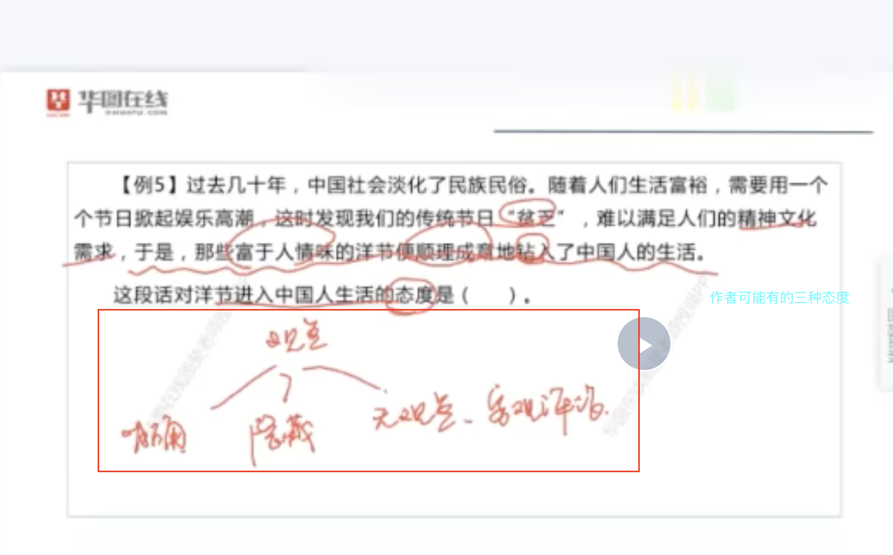
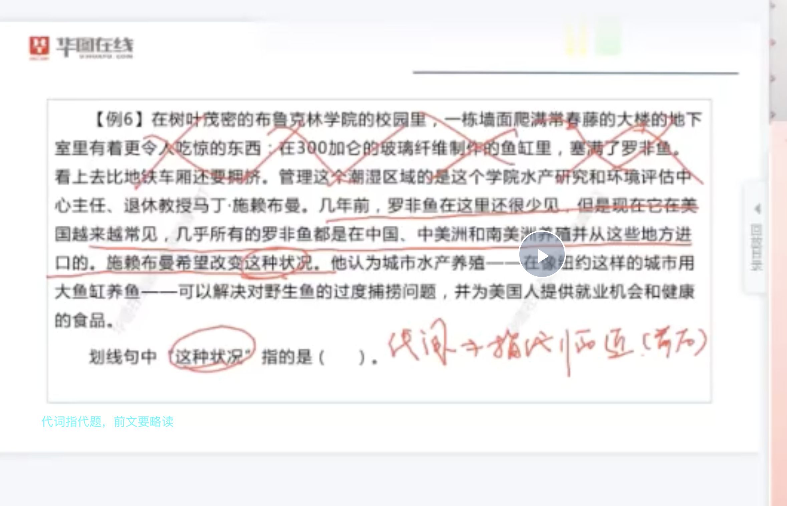
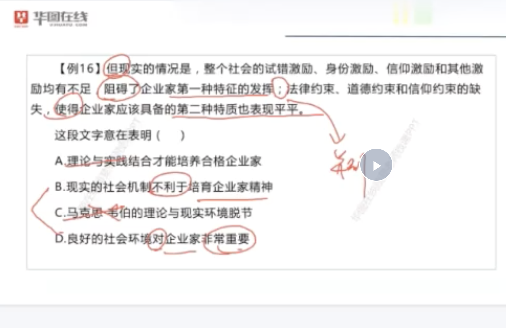
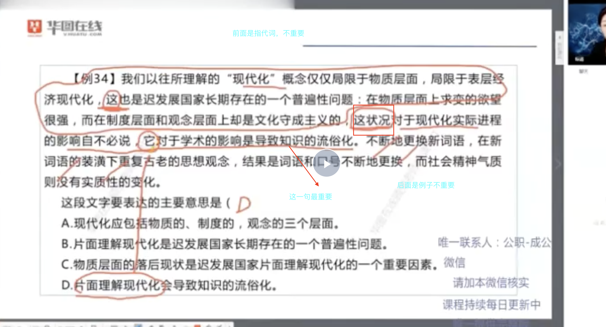

### 言语


#### 知识点扩充
- 一、主题思想：作者的三种态度




- 二、主题的答案

1. 同义替换
2. 精简压缩
3. 找准句子关键词（发现，说明，表明，显示，指出等），对应选项着重点。



```
1. BD的区别：B是不利于，D是对。。重要。而文章段落的重点词，阻碍。。。，使得平平。。。都是更贴切B的。

2. 社会机制 比良好环境 更精准一些。
```

4. 如果只剩两个选项，不知道选哪个。一定要下意识去对比两者的差异，从差异入手。


- 三、成分分析法

1. 找准主谓宾

- 主题排除法

1. 频繁出现的词语
2. 重点讨论的话题


- 四、宏观指代




- 五、背景论述

1. 背景+观点

#### 提速技能

- 指代词：提速。略读前文。

- 标题填入题：着重注意第一句话，可能就是全文的概括。
- 开头时间状语，可能代表着一段都是背景。结构为：背景+论点。
- 文段中含有数据的句子并不重要。可以略看。
- 关联词概括（不断，也是，并且）
<!--  -->

