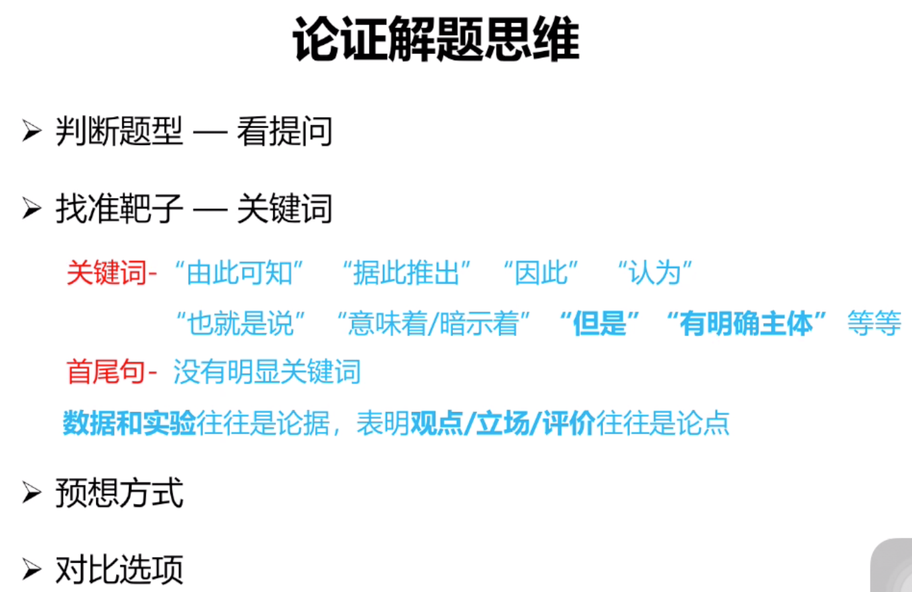

### 第一章图形推理不好搜题见教材

### 第二章定义判断(这次做题发现错的原因在于1. 主体错 2. 主体的形容词或者”的“前的没注意。 3.选是题容易错。)


#### 单定义判断

- 1（错选A是因为，据为己有不是非法行动）


```

挪用公款罪是指国家机关、国有公司、企业、事业单位、人民团体中从事公务的人，利用职务上主管、管理、经营、经手公共财物的权力及便利条件，挪用公款归个人使用、进行非法活动的，或者挪用公款五万元以上、进行营利活动，或者挪用公款五万元以上、超过三个月未还的。

根据上述定义，下列构成挪用公款罪的是：

A

某市环保局执法人员将被处罚单位上缴的4万元罚款隐匿不报，据为己有

B

某省扶贫办主任利用职务之便，将经手的6万元扶贫款以其子女名义投入股市，2个月后赚了钱将其归还

C

某公立医院的会计利用做账的便利条件挪用医院设备购置费2万元用于家人治病，家人病好以后将钱款归还

D

某国有企业的仓库保管员将仓库中的价值10万元的货物私自出卖后用于个人高档消费，一个月后担心东窗事发借钱购买货物放回了仓库


正确答案是： B收起
解析
第一步：找出定义关键词。

“国家机关、国有公司、企业、事业单位、人民团体中从事公务的人” “利用职务上主管、管理、经营、经手公共财物的权力及便利条件” “挪用公款归个人使用、进行非法活动的，或者挪用公款五万元以上、进行营利活动，或者挪用公款五万元以上、超过三个月未还的” 。

第二步：逐一分析选项。

A项：环保局执法人员将被处罚单位上缴的4万元罚款隐匿不报，据为己有。执法人员只是将钱据为己有，没有明确是否“进行非法活动”，不符合定义，排除；

B项：某扶贫办主任挪用了6万元公款投入股市，是进行了营利活动，符合“挪用公款五万元以上、进行营利活动”的关键词，符合定义，当选；

C项：某公立医院的会计挪用2万元公款是为家人治病，不符合“进行非法活动”，不符合定义，排除；

D项：某国有企业的仓库保管员私自出卖10万元的货物，而不是钱，不符合“挪用公款”；用于个人高档消费，不符合“进行非法活动”的关键词，也不符合“进行营利活动”的关键词；并且一个月后借钱购买货物放回了仓库，不符合“超过三个月未还”；不符合定义，排除。

故正确答案为B。


```

- 2(选b是因为没有注意主体是生产方)


```
产品召回是指生产商将已经送到批发商、零售商或最终用户手上的产品收回。产品召回的典型原因是所售出的产品被发现存在缺陷。产品召回制度是针对厂家原因造成的批量性问题而出现的，其中，对于质量缺陷的认定和厂家责任的认定是最关键的核心。

根据上述定义，下列属于产品召回的是：

A

某商家作出承诺，产品有问题可以无条件退货

B

某超市发现卖出的罐头已过期变质，及时告知消费者前来退货或换货

C

因质检把关不严，某厂一批次品流入市场，厂家告知消费者前来退货

D

某玩具厂因某种玩具有害物质超标，向提起诉讼的部分消费者退货赔偿


正确答案是： C收起
解析
第一步：抓住定义中的关键词。

关键词包括“厂家原因”，“批量性问题”，”主动召回“

第二步：逐一判断选项。

A中的商家退货；

B中的超市退货或换货均是商家或超市的问题，不符合关键词“厂家原因”，因此A、B都不属于产品召回，排除；

C中厂家告知退货完全符合关键词，因此属于产品召回，当选；

D中是某种产品有害物质超标，不符合关键词“批量性问题”，因此不属于产品召回，排除。

故正确答案为C。 
```
- 3(C项只捐助了一次，不符合持续性的。)


```
造血式扶贫：指政府部门或社会力量通过持续性地扶持农村产业发展，拓宽农产品销售及消费渠道等，帮助贫困地区、贫困人口增收脱贫的扶贫方式。

下列属于造血式扶贫的是

A

某县按照“东部林果、旅游，西部设施农业”的整体思路，一直坚持“”的产业发展模式，使农民年收入翻了一番，人均达到近万元


B

某县扶贫办组织了200多名山区农民，经过严格培训，输送到东南沿海城市工作。这些农民每月都按时寄钱回家，家里的日子越过越红火


C

县农科所资助某村贫困家庭100头种羊，多次对他们进行科学养羊技术培训，并安排技术人员进行“一对一”的专业指导


D

为了解决全村苹果严重滞销的问题，村里的几个年轻人共同开办了一个水果直销网店。不到半月时间，所有苹果就销售一空


正确答案是： A收起
解析
第一步：找出定义关键词。

“政府部门或社会力量”、“持续性地扶持农村产业发展，拓宽农产品销售及消费渠道”、“帮助贫困地区、贫困人口增收脱贫”。

第二步：逐一分析选项。

A项：某县符合“政府部门或社会力量”，一直坚持“”的产业发展模式，符合“持续性地扶持农村产业发展，拓宽农产品销售及消费渠道”，使农民年收入翻了一番，人均达到近万元，符合“帮助贫困地区、贫困人口增收脱贫”，符合定义，当选；

B项：某县扶贫办组织了200多名山区农民，经过严格培训，输送到东南沿海城市工作，不符合“持续性地扶持农村产业发展，拓宽农产品销售及消费渠道”，不符合定义，排除；

C项：县农科所资助某村贫困家庭100头种羊，多次对他们进行科学养羊技术培训，不符合“持续性地扶持农村产业发展，拓宽农产品销售及消费渠道”，不符合定义，排除；

D项：为了解决全村苹果严重滞销的问题，村里的几个年轻人共同开办了一个水果直销网店，不符合“政府部门或社会力量”，且没有提到贫困，不符合“帮助贫困地区、贫困人口增收脱贫”，不符合定义，排除。

故正确答案为A。


```
- 4(肖像权不属于知识产权)


```

知识产权是权利人通过创造性劳动形成的、或者合法取得的具有知识性、精神性价值和实际经济利益的财产权利。知识产权保护是个人或组织，依法对具有实际经济利益的知识产权进行保护。维护知识产权人合法权益的行为。

根据上述定义，以下不属于知识产权保护行为的是：

A

民营科技企业与涉密员工订立商业秘密保护协议

B

轻工学院赵老师长期从事技术研发工作，取得了多项发明专利

C

模特大赛冠军李艳认为赞助商未经本人同意，擅自使用其照片用于化妆品广告宣传，构成侵权行为，已经起诉到法院

D

个体工商户李某精心研究，制作“一招鲜”调味品，深受消费者欢迎，准备申请注册商标


正确答案是： C收起
解析
第一步：找出定义关键词。

关键词强调“具有知识性、精神性价值和实际经济利益的财产权利”。

第二步：逐一分析选项。

A项：“订立商业秘密保护协议”要保护的就是这个科技企业的技术或者产品，属于知识性和经济利益的财产，是知识产权保护，符合定义；

B项：“发明专利”保护的发明也是知识性和实际经济利益的财产，是知识产权保护，符合定义；

C项：赞助商侵犯了模特李艳的肖像权，肖像权不属于知识产权的范围，李艳的行为不属于知识产权保护行为；

D项：“注册商标”保护的是李某制作的调味品，属于实际经济利益的财产，属于知识产权保护，符合定义。

本题为选非题，故正确答案为C。
```
- 5


- 6(b项，中国只是子类的其中之一，并不能推理出世界。而A项列举的是全部子类。)


```
完全归纳推理又称完全归纳法，是以某类中每一对象(或子类)都具有或不具有某一属性为前提，推出该类对象全部具有或不具有该属性为结论的归纳推理。

根据上述定义，下列属于完全归纳推理的是：

A

美国居民的祖先都是从国外迁徙来的。早期的居民是美洲印第安人，他们是几千年前从亚洲迁徙来的。后来的居民是欧洲人，他们是在250年至350年前作为殖民地开拓者来到这里的

B

在很早的时候，中国就发明了指南针、造纸术、活字印刷术和火药，所以，中国是世界文明发展最早的国家之一

C

凡有所学，皆成性格。读书使人充实，讨论使人机智，笔记使人准确，读史使人明智，读诗使人灵秀，数学使人周密，物理使人深刻，伦理使人庄重

D

世界各国人民历来就相互进行科技的引进和交流。西方国家引进了中国古代的“四大发明”；日本的明治维新，主要是引进了欧洲的技术；今天许多国家种植的玉米、马铃薯，都是美洲印第安人培育出来的


正确答案是： A收起
解析
第一步：找出定义关键词。

“以某类中每一对象(或子类)都具有或不具有某一属性为前提”、“推出该类对象全部具有或不具有该属性为结论”。

第二步：逐一分析选项。

A项：全部情况的结论为美国居民的祖先都是从国外迁徙来的，其前提包括了美国早期的居民和后来的居民是从国外迁徙来的，早期居民和后来居民构成了美国居民中的所有子类，符合定义，当选； 

B项：前提是很早的时候中国就有了四大发明，结论是中国是世界文明发展最早的国家之一，而中国并不能构成世界所有国家的所有子类，其他国家的发明时间未知，不符合定义，排除；

C项：全部情况的结论为凡有所学，皆成性格，其前提包括了读书、讨论、笔记、读史等能够使人形成不同的性格，而读书、讨论、笔记、读史并不是凡有所学的全部对象，不符合定义，排除；

D项：全部情况的结论为世界各国人民互相引进，其前提包括了西方国家引进“四大发明”、日本明治维新引进欧洲技术、许多国家引进印第安人培育的玉米等例子，而后者并不是互相引进的全部对象，不符合定义，排除。

故正确答案为A。
```


- 6(虽然不知道A是啥意思，但是D项不符合快速，顿悟)


```
灵感思维是指凭借直觉而进行的快速、顿悟性的思维，即将长期思考的问题暂停搁置，或是受到某些事物的启发，忽然得到解决的心理过程。

根据上述定义，下列不属于灵感思维的是：

A

中国有“三上”（床上、马上、厨上）文章，西方有“3B”（Bed、Bath、Bus）思考法

B

英国某著名女作家年轻时在厨房劳动，她每次都带着纸和笔，随时把脑子里涌出来的想法记下来

C

阿基米德在泡澡时发现浮力与物体的排水量有关，从而发现浮力原理

D

王教授不断搜集与课题有关的资料，终于解决课题中的久思未决的难题


正确答案是： D收起
解析
第一步：找出定义关键词。

“凭借直觉而进行的快速、顿悟性的思维”、“长期思考的问题暂停搁置”、“受到某些事物的启发，忽然得到解决的心理过程”。

第二步，逐一分析选项。

A项：“三上文章和3B思考法”均符合“凭借直觉而进行的快速、顿悟性的思维”，符合定义，排除；

B项：随时把脑子里涌出来的想法记下来，符合“凭借直觉而进行的快速、顿悟性的思维”，符合定义，排除；

C项：阿基米德泡澡时发现浮力原理，符合“受到某些事物的启发，忽然得到解决的心理过程”，符合定义，排除；

D项：不断搜集与课题有关的资料是一个累积的过程，不符合“凭借直觉而进行的快速、顿悟性的思维”，也不符合“受到某些事物的启发，忽然得到解决的心理过程”不符合定义，当选。

本题为选非题，故正确答案为D。

```

- 7（b中给的是金额而不是税率）


```
超率累进税率是指以征税对象数额的相对比率（如产值利润率、资金利润率、销售利润率、成本利润率等）划分征税级距，分别规定相应的差别税率，相对比例每超过一个级距的，对超过的部分就按高一级的税率计算征税。

根据上述定义，下列各项中按照超率累进税率征税的是：

A

我国法律规定，土地增值额未超过扣除项目金额的部分，土地增值税税率为；超过扣除项目金额、未超过的部分，税率为


B

我国建国初期征收工商所得税税率分为21级，所得额未满300元的税率为；所得额在万元以上的税率为


C

我国企业所得税的税率为。符合条件的小型微利企业，按的税率征收企业所得税；国家需要重点扶持的高新技术企业，按的税率征收企业所得税


D

我国法律规定，白酒消费税税率为，黄酒消费税税率为，啤酒消费税税率为


正确答案是： A收起
解析
第一步：找出定义关键词。
“征税对象数额的相对比率划分征税级距”、“相对比例每超过一个级距的，对超过的部分就按高一级的税率计算征税”。
第二步：逐一分析选项。
A项：土地增值额未超过扣除项目金额的部分，按照一个税率进行征税，而超过的部分，在超过且未超过的，有更高的税率，符合“相对比例每超过一个级距的，对超过的部分就按高一级的税率计算征税”，符合定义，当选；
B项：只是不同的金额，有不同的税率，但是并不符合定义中所说的超过一个级别的部分是另外一个税率，不符合定义，排除；
C项：只是规定了不同对象的企业所得税是多少，不符合“征税对象数额的相对比率划分征税级距”，不符合定义，排除；
D项：只是规定了不同种类的酒的不同税率，不符合“征税对象数额的相对比率划分征税级距”，不符合定义，排除。
故正确答案为A。

```
- 8(c项厌恶的主体错了。)


```
当人们对一事物持某种态度时，不管该事物是有形的还是无形的，都被称为态度标的物。

根据上述定义，下列对态度标的物理解不正确的是：

A

小李对刚买的一件首饰不满意。小李的态度标的物是首饰

B

老刘说，这酒真不好喝。老刘的态度标的物是酒

C

小王对导游的服务不满。小王的态度标的物是导游

D

老张厌恶儿子的“啃老”行为。老张的态度标的物是“啃老”行为


正确答案是： C收起
解析
第一步：找出定义关键词。

“对一事物持某种态度时”、“不管该事物是有形的还是无形的” 。

第二步：逐一分析选项。

A项：小李对刚买的一件首饰持不满意的态度，所以小李的态度标的物是首饰，符合定义，排除；

B项：老刘感觉酒不好喝，对酒持不满意的态度，所以老刘的态度标的物是酒，符合定义，排除；

C项：小王对导游的服务持不满意的态度，小王的态度标的物是导游的服务，而不是导游，不符合定义，当选；

D项：老张厌恶儿子的“啃老”行为，对“啃老”行为持不满的态度，老张的态度标的物是“啃老”行为，符合定义，排除。

本题为选非题，故正确答案为C。
```
- 9(b项中英文不报含在内，包含的只有中文。)


```
合理使用是指在法律明文规定的情形下，非商业性使用他人已经发表的作品，可以不经著作权人许可，也不必向其支付报酬。“法律明文规定的情形”主要包括：（1）为个人学习、研究或者欣赏，使用他人已经发表的作品；（2）免费表演已经发表的作品；（3）对设置或者陈列在室外公共场所的艺术作品进行临摹、绘画、摄影、录像；（4）将已经发表的以汉语言文字创作的作品翻译成少数民族语言文字作品出版发行。

根据上述规定，下列属于合理使用的是：

A

甲在班级聚会上演唱了戊未发表的一首歌曲

B

乙将一部英文作品翻译成蒙文作品出版发行

C

丙公司拍摄公共广场的雕塑作品后，将其制作成图片发行

D

丁为撰写论文，复印了庚发表在某期刊上的论文作参考


正确答案是： D收起
解析
第一步：找出定义关键词。

“在法律明文规定的情形下”、“非商业性使用他人已经发表的作品”、“为个人学习、研究或者欣赏，使用他人已经发表的作品”、“免费表演已经发表的作品”、“对设置或者陈列在室外公共场所的艺术作品进行临摹、绘画、摄影、录像”、“将已经发表的以汉语言文字创作的作品翻译成少数民族语言文字作品出版发行”。

第二步：逐一分析选项。

A项：甲唱了一首戊尚未发表的歌曲，不符合“非商业性使用他人已经发表的作品”和“免费表演已经发表的作品”，不符合定义，排除； 

B项：乙将英文作品翻译成蒙文作品，这里的英文作品不符合“将已经发表的以汉语言文字创作的作品翻译成少数民族语言文字作品出版发行”，不符合定义，排除；

C项：丙公司拍摄雕塑作品后进行发行，属于商业用途，不符合“非商业性使用他人已经发表的作品”，不符合定义，排除；

D项：丁为了撰写论文复印和参考了庚已经发表的论文，参考论文符合“在法律明文规定的情形下”和“为个人学习、研究或者欣赏，使用他人已经发表的作品”，同时，丁没有用作商业用途，符合“非商业性使用他人已经发表的作品”，符合定义，当选。

故正确答案为D。
```
- 10(C项的词性没有变，一直都是名词)


```
转品，是指在构句时改变一个字词原来惯用的词性的一种方法，它是实现词语艺术化的重要手段之一。

根据上述定义，下列选项中划横线的字词没有使用转品的是

A

他穿的服饰很中国


B

这里气候非常夏天


C

从此，徐悲鸿真正做到了画马时胸有成马


D

从此，这个人不烟不酒，甚至也不太诗了


正确答案是： C收起
解析
第一步：找出定义关键词。

“构句时改变一个字词原来惯用的词性的一种方法”。

第二步：逐一分析选项。

A项：“中国”惯用的词性是名词，在选项中用来形容服饰很有中国风格，词性由名词转变为形容词，词性改变，符合“构句时改变一个字词原来惯用的词性的一种方法”，符合定义，排除； 

B项：“夏天”惯用的词性是名词，在选项中用来形容天气热，词性由名词转变为形容词，词性改变，符合“构句时改变一个字词原来惯用的词性的一种方法”，符合定义，排除；

C项：“马”惯用的词性是名词，在选项中依然指马这种生物，词性没有改变，不符合定义，当选；

D项：“烟”、“酒”惯用的词性是名词，选项中的意思是抽烟喝酒，词性由名词转变为动词；“诗”惯用的词性是名词，在选项中形容生活不那么诗意，词性由名词转变为形容词，词性都发生了改变，符合“构句时改变一个字词原来惯用的词性的一种方法”，符合定义，排除。

本题为选非题，故正确答案为C。
```
- 11(无形资产是无形的，而D不是)


```
无形资产是指企业拥有或者控制的没有实物形态的可辨认的非货币性资产，资产满足下列条件之一的，即可视为无形资产：

（1）能够从企业中分离或者划分出来，并能够单独或者与相关合同、资产或负债一起，用于出售、转移、授予许可、租赁或者交换。

（2）源自合同性权利或其他法定权利，无论这些权利是否可以从企业或其他权利和义务中转移或者分离。

那么，下列不属于无形资产的为：

A

某人的知识产权

B

文学艺术原作

C

专利作品

D

机器设备


正确答案是： D收起
解析
第一步：抓住定义中的关键词。

关键词强调“没有实物形态”。

第二步：逐一判断选项。

A中的知识产权，B中的艺术原作，C中的专利作品，均是无形资产；

而D中的机器设备显然是一种有实物形态的资产，不属于无形资产。

故正确答案为D。
```

#### 多定义判断


- 1(b项不知道是不是因为环境问题造成的。而C项复合1，3)


```
人们通常把因环境污染和环境破坏而对公众和社会所造成的危害叫做公害。公害病是公害发生的地区性疾病。其特征包括：①由人类活动造成的环境污染所引起；②损害健康的环境污染因素复杂；③其流行一般具有长期陆续发病的特征，还可能累及胎儿，危害后代；④属新病种，有些发病机制还不清楚，缺乏特效疗法。

根据上述定义，下列不属于公害病的是：

A

人们食用了被镉污染的水稻后罹患骨痛病，骨骼疼痛难忍，无特效疗法

B

某地区玉米、小麦受到霉菌（尤其是镰刀菌）感染后会产生毒素，人们食用后会破坏人体骨骼生长，导致四肢短小

C

某地区使用重油燃料，排出废气中含有大量的二氧化硫，造成了严重的大气污染，引起当地居民罹患支气管哮喘、肺气肿等疾病

D

含无机汞的工业废水排入水体后，被细菌转化为毒性更强的甲基汞，富集于水生生物体内，人们长期食用后出现神经系统损伤，波及后代


正确答案是： B收起
解析
第一步：找出定义关键词。

公害：因环境污染和环境破坏而对公众和社会所造成的危害。

公害病：公害发生的地区性疾病。其特征包括：①由人类活动造成的环境污染所引起；②损害健康的环境污染因素复杂；③其流行一般具有长期陆续发病的特征，还可能累及胎儿，危害后代；④属新病种，有些发病机制还不清楚，缺乏特效疗法。

第二步：逐一分析选项。

A项：镉污染符合“①由人类活动造成的环境污染所引起”、“②损害健康的环境污染因素复杂”，骨骼疼痛难忍，无特效疗法符合“④属新病种，有些发病机制还不清楚，缺乏特效疗法”，符合定义，排除； 

B项：某地区玉米、小麦受到霉菌(尤其是镰刀菌)感染，不符合“①由人类活动造成的环境污染所引起”，不符合定义，当选；

C项：某地区使用重油燃料，排出废气中含有大量的二氧化硫，造成了严重的大气污染，符合“①由人类活动造成的环境污染所引起，②损害健康的环境污染因素复杂”，引起当地居民罹患支气管哮喘、肺气肿等疾病符合“③其流行一般具有长期陆续发病的特征，还可能累及胎儿，危害后代”，符合定义，排除；

D项：含无机汞的工业废水排入水体后，被细菌转化为毒性更强的甲基汞，富集于水生生物体内，符合“①由人类活动造成的环境污染所引起”，人们长期食用后出现神经系统损伤，波及后代，符合“③其流行一般具有长期陆续发病的特征，还可能累及胎儿，危害后代”，符合定义，排除。

本题为选非题，故正确答案为B。

```

- 2(修自行车是程序性，而加减运算也是程序性，都是需要怎么做)


```
陈述性知识是有关“世界是什么”的知识，能够直接陈述，要求的心理过程主要是记忆。程序性知识是有关“怎么办”的知识，不能直接陈述，只能通过某种作业形式简单推测其存在。

根据上述定义，下列归类正确的是：

A

“修自行车”是陈述性知识，“音乐欣赏”需要程序性知识


B

“美国的首都是华盛顿”是陈述性知识，“加减运算”需要程序性知识


C

“水到100℃沸腾”是陈述性知识，“水的分子式是”是程序性知识


D

“骑马射箭”是陈述性知识，“红灯停，绿灯行”是程序性知识


正确答案是： B收起
解析
第一步：找出定义关键词。

陈述性知识的关键词是：①有关“世界是什么”；②直接陈述；③心理过程主要是记忆。

程序性知识的关键词是：①有关“怎么办”；②不能直接陈述；③只能通过某种作业形式简单推测其存在。

第二步：逐一分析选项。

A项：“修自行车”侧重于“怎么办”，属于程序性知识，归类错误，排除；

B项：归类正确，当选；

C项：“水的分子式是” 侧重于“世界是什么”，属于陈述性知识，归类错误，排除；

D项：“骑马射箭”侧重于“怎么办”，属于程序性知识，归类错误；“红灯停，绿灯行” 侧重于“世界是什么”，属于陈述性知识，归类错误，排除。

故正确答案为B。
```
- 3(D项没有流入新的产品而是继续流入了房市)


```
挤进效应是指政府采用扩张性财政政策时，能够诱导民间消费和投资的增加，从而带动产出总量或就业总量增加的效应；挤出效应是指当供应和需求有新的增加时，随着政府支出的增加而引起的私人消费或投资降低的效果，这会导致部分资金从原来的预支中挤出，而流入到新的商品中。

根据上述定义，下列属于挤出效应的是：

A

某地区县政府对家庭困难的个体经营者减免税收，从而带动当地的个体经济

B

某地区政府计划投资一些大型化工项目并建立化工厂，由于工厂将占用一部分耕地，因此该地区粮食价格上涨

C

由于适龄儿童增加，该地区政府加大了对学校基础建设的资金投入，并降低学杂费，于是当地家庭为孩子报艺术班的比例增加了

D

某市实行房屋限购令后，楼市交易低迷，人们转向投资邻市，使邻市楼市被进一步催热


正确答案是： C收起
解析
第一步：分析题干关键词。

“供应和需求有新的增加”、“随着政府支出的增加”、“私人消费或投资降低”、“部分资金从原来的预支中挤出”、“到新的商品中”。第二步：逐一分析选项。A项，没有体现出“供应和需求有新的增加”，也看不出“政府支出的增加”，只是减免了个人的税收而已，没有涉及政府的支出；B项，没有体现出“私人消费或投资降低”，也没有体现出“部分资金从原来的预支中挤出”的变动；C项，“政府加大了对学校基础建设的资金投入”体现了“政府支出的增加”，“降低学杂费”体现了“私人消费或投资降低”，“为孩子报艺术班的比例增加”体现了“供应和需求有新的增加”、“部分资金从原来的预支中挤出”、“到新的商品中”，完全符合题干定义要求，为正确选项；D项，这里没有体现出“新的商品”，因为人们还是投资楼市，只不过由本市转移到了外市。

故正确答案为C。
```
- 4(文章问的是种属关系，而这里要区分种属关系和组成关系。)


```
概念的内涵是指概念所反映的事物具有的本质属性（或特有属性），它是从质的方面反映概念的。概念的外延是指具有概念所反映的本质属性（或特有属性）的那些事物，它是从量的方面反映概念的。内涵和外延的反变关系是指具有属种关系的概念之间所具有的一种相互联系、相互制约的关系。一个概念的外延越大，它的内涵越少；一个概念外延越小，它的内涵越多。反之，一个概念的内涵越多，它的外延越小；一个概念内涵越少，它的外延越大。根据上述定义，下列哪组概念体现了概念内涵与外延的反变关系？

A

司法机关，最高审判机关，最高人民法院

B

水杯，热水杯，大号热水杯

C

中国，新疆，乌鲁木齐

D

中国人，文学家，鲁迅


正确答案是： B收起
解析
第一步：判断题干中的关键词。

内涵和外延反变关系的关键词：属种关系的概念。

第二步：逐一分析选项。

A项：最高审判机关和最高人民法院所指相同，是全同关系，不符合定义，排除。

B项：从水杯到热水杯到大号热水杯，内涵依次增多，外延依次减少，且三者是种属关系，符合定义，当选。

C项：中国、新疆和乌鲁木齐三者是组成关系，不符合定义，排除。

D项：文学家有中国人也有外国人，二者是交叉关系，不符合定义，排除。

故正确答案为B。
```
- 5(BCD都是对原来的体系和经验进行调整，而A是掌握知识后，由此及彼触类旁通掌握其他事物。)




- 6(CD均是含蓄意指)

```
能指和所指是索绪尔语言学的一对术语。索绪尔认为，任何语言符号都是由能指和所指构成的。其中，能指是指符号的物质形式，由声音和形象两部分构成；所指是指语言所反映的事物的概念。而意指则代表了能指与所指之间的关系。意指有两个层次，第一层是直接意指，即语言符号形象具有直接的表现性；第二层是含蓄意指，语言符号形象本身没有直接的表现性，如文学创作中的隐喻、象征、引申等。

根据上述定义，下列表述错误的是（  ）。

A

孩子在公园游玩，看到了五彩缤纷的花朵，喊出了“花”这个字。在这里，被喊出的“花”这个字就是能指

B

如果所指是“木本植物的总称”，那么简体中文里的“树”、繁体中文里的“樹”和英语里的“tree”都是对应这一事物的能指

C

在网络语言中，网民喜欢用“杯具”来代替“悲剧”。因此，在这里“杯具”二字体现了意指的第一个层次

D

在“硕鼠硕鼠，无食我黍”这句诗中具有含蓄意指


正确答案是： C收起
解析
第一步：找出定义关键词。

能指的定义条件是“物质形式”；所指的定义条件是“概念”；意指第一层是语言符号形象具有直接的表现性；第二层是含蓄意指，语言符号形象本身没有直接的表现性。

第二步：逐一分析选项。

A项：孩子看到的花，是花的形象，属于物质形式，符合能指的定义条件，表述正确，排除。

B项：“木本植物的总称”是概念，符合所指的定义条件，而“树”“樹”以及“tree”指的是具体的物质形象，符合能指的定义条件，表述正确，排除。

C项：“杯具”表达“悲剧”的含义，并不是语言的直接表现性，不符合意指第一层，表述错误，当选。

D项：“硕鼠硕鼠，无食我黍”是以硕鼠喻剥削者，并不是语言的直接表现性，符合含蓄意指，表述正确，排除。

本题为选非题，故正确答案为C。
```

### 类比推理


### 第四章 逻辑判断


- 1(这种题型第一次遇见，记得还是用表达式写出来，选出一样的表达式。)

```

如果你演讲时讲真话，那么富人会反对你。如果你演讲时讲假话，那么穷人会反对你。你演讲时或者讲真话，或者讲假话。所以，或者富人会反对你，或者穷人会反对你。

以下哪项与上述推理的结构最为相似？

A

如果月球上有生物，则一定有空气。如果月球上有生物，则一定有水分。月球上或者没有空气，或者没有水分。所以，月球上没有生物

B

如果对物体加压，则它的体积会变小。如果对物体降温，则它的体积会变小。或者对物体加压，或者对物体降温。所以，物体的体积会变小

C

如果天下雨，则地一定会湿。如果天不下雨，则地不一定会湿。或者天下雨或者天不下雨。所以，或者地一定会湿，或者地不一定会湿

D

如果刺激老虎，则老虎要吃人。如果不刺激老虎，则老虎也要吃人。或者刺激老虎，或者不刺激老虎。总之，老虎要吃人


正确答案是： C收起
解析
第一步：翻译题干。

题干可翻译为，AB，AB，A/A，结论：B/B。

第二步：逐一翻译选项。

A项可翻译为，AB，AC，B/C，结论：A；

B项可翻译为，AB，CB，A/C，结论：B；

C项可翻译为，AB，AB，A/A，结论：B/B；

D项可翻译为，AB，AB，A/A，结论：B。

对比题干与选项的推理形式，C项与题干一致。

故正确答案为C。
```
- 2(注意结构：对同一个人不同角度的理解。2.偷换概念。有把马上下台（政治生涯）说成演讲的下台。)

```
有位年轻人，新买的摩托车被撞碎了，他摇着头说：“唉，我以前总说，有一天能有一辆摩托车就好了，现在我真有了一辆车，而且真的只有一天。”

下列与题干的幽默方式最相似的是：

A

亚伯在演讲时，听众哗然，叫嚷着要他下台，这时亚伯微笑着说：“谢谢各位，我等一会儿就下台，因为我刚刚上台”

B

伏尔泰很赞赏一个人的作品，而这个人却总是刻薄地批评伏尔泰，当别人向伏尔泰说这件事时，他微笑的回答说：“那看来是我们双方都弄错了”

C

飓风把一个农民家的屋顶掀了，这时大雨倾盆，他对家人说：“别急，没有房顶的坏处是被雨淋湿了，但好处是太阳，可以直接晒干我们的东西”

D

一次，一个老太婆皱着眉头对林肯说：“你是我见过的最丑的一个人。”林肯微笑着答道：“请多包涵，我也身不由己”


正确答案是： A收起
解析
第一步：分析题干。

题干中所述为对同一个人对同一句话的不同角度的理解。

有“一天”能有一辆摩托车就好了，现在我真有了一辆车，而且真的只有“一天”。这两个“一天”分别指将来某一天和具体一天的时间，使用了偷换概念的方式来表达，从而实现了幽默的效果。

第二步：分析选项。

A项：A项所述为对同一个人对同一句话的不同角度的理解，观众要求亚伯“马上下台”，而亚伯把它说成了演讲结束“最终下台”进行了概念偷换，与题干方式最为相似，当选。

B、C两项：均涉及双方对话，为不同的人，排除。

D项：D项整个表述过程中并未出现概念偷换，排除。

故正确答案为A。

```
- 3(1. 且花园里不会同时存在桃花和杏花，即-（桃花且杏花），去括号得到-桃花或-杏花，或关系有三种情况，此时甲丙不是矛盾关系. 2. 分情况讨论，并不是根据ABC代入，而是就讨论两种情况，第一种情况，红色的花是桃花.还有第二种情况，红色的花不是桃花)

```
春天来了，花园里鲜花朵朵，美不胜收。甲说：“这种红颜色的花是桃花”。乙说：“这种红颜色的花可能是桃花”。丙说：“这种红颜色的花是杏花”。已知花园里不会同时存在桃花和杏花，这三个人中只有一人判断正确，那么判断正确的是：

A

甲

B

乙

C

丙

D

无法判断


正确答案是： C收起
解析
第一步：分析题干。

甲：红色的花是桃花；乙：红色的花可能是桃花；丙：红色的花是杏花。

第二步：逐一分析选项。

三个人中只有一人判断正确，且花园里不会同时存在桃花和杏花，即-（桃花且杏花），去括号得到-桃花或-杏花，或关系有三种情况，此时甲丙不是矛盾关系，题干不存在矛盾关系的真假推理题可直接用假设法做题，从最大信息入手假设，即从桃花入手，关于红色的花是否为桃花，有两种情况，分情况讨论。第一种情况，红色的花是桃花，此时甲一定为真，乙也可能为真，但是只有一个人判断正确，所以这个假设不成立。第二种情况，红色的花一定不是桃花，此时甲一定为假，乙也一定为假（注：“可能”和“必然不”构成矛盾），只有一人判断正确，即丙一定是判断正确。 

故正确答案为C。

```
- 4(太自以为是，不要凭着常识逻辑回答。而是要代入公式。有的选手喝茶不能推出有的选手不喝茶，无法推出绝对化结论)

```
某围棋队有选手会在比赛时喝茶，他们或者喝红茶，或者喝绿茶。

如果以上描述为真，下列哪项一定是真的？

I．该围棋队一名在比赛时不喝红茶的选手，一定喝绿茶。

II．该围棋队没有选手比赛时喝黑茶。

III．该围棋队有的选手比赛时不喝茶。

A

只有II

B

只有III

C

I和II

D

II和III


正确答案是： A收起
解析
第一步：翻译题干。

①该围棋队有的选手在比赛时喝茶；

②喝红茶或者喝绿茶。

第二步：逐一分析选项。

Ⅰ：根据①可知，该围棋队有的选手在比赛时喝茶，但是无法确定该围棋队每一个人在比赛时都喝茶，所以该围棋队某一个人是否喝茶不明确，是否喝茶都不确定，因此无法确定真假。

Ⅱ：根据②可知，该队选手如果喝茶，即在红茶与绿茶之间，没有人喝黑茶，可以推出，该项一定为真。

Ⅲ：根据①可知，有的选手喝茶不能推出有的选手不喝茶，无法推出绝对化结论，因此无法确定真假。

故正确答案为A。

```
- 5(不要想当然，而是列出表达式。这道题的解答方法是代入法。代入之后判断条件对不对。然后条件矛盾，则说明代入的条件反着就是对的)

```

在某图书馆中，涉及民国时期的历史书均只存放于第二层的专业书库中，外文类的典藏书籍均只存放于第三层的珍本阅览室中，小林周末到该图书馆借了一本外文类历史书。由此可以推出小林借的书是：

A

是珍本书

B

不是珍本书

C

是涉及民国时期的典藏书籍

D

不是涉及民国时期的典藏书籍


正确答案是： D收起
解析
第一步：翻译题干。

（1）民国且历史→二层专业书库；（2）外文且典藏→三层珍本。从题干已知条件推不出任何确定结论，因此此题采用代入法。

第二步：逐一代入选项。

假设A项正确，小林借的是珍本书，对于（2）是肯后，推不出必然结论，所以是不确定项；

假设B项正确，小林借的不是珍本书，对于（2）是否后，否后必否前，—三层珍本→—外文或—典藏，题干说他借的是外文书，但是不是典藏书不知道，因此也得不出必然结论；

假设C项正确，是民国时期的典藏书籍，那么说明这本书是民国历史书，也是外文典藏书，就把翻译后的表达式的（1）（2）的前件都肯定了，肯前必肯后，得到的是小林借书既是只能在二层又是只能在三层，矛盾。因此小林借的肯定不是民国时期的典藏书籍，D项正确。

故正确答案为D。
```
- 6()

```


```
- 7()

```


```